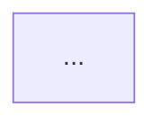

# FIGURE_LIST — 全书配图清单（与实物一致）

> 规则：技术图 = Mermaid；封面/卷首/头图 = 抽象位图（无文字）。可读对象 ≤12（定义见 `BOOK_SPEC.md` §9）。术语见 `GLOSSARY.md`。
> **本表的图数、图号、图型三列由 `python3 scripts/check_figures.py --print` 从手稿实测生成，不手写。**
> 刷新口径：本清单在 2026-09-25 之前手写的图数是 107，那一版之后每轮扩写都改成「由 `--print` 生成」。**当前有多少张，以本文件里那张表下面框出来的三行读数为准**——它是 `check_figures.py` 同一次运行打印的，图数随正文增删而变，这里抄一个数就会在下一轮扩写当天失真（全书的计数只准住在打印它的那条命令里，这条纪律见 `STYLE_GUIDE.md`「事实与编号」）。**每张技术图都在真浏览器里画成了 svg**——这句话的判据不是某一次 `mermaid.parse` 的回忆，而是第七条守卫每一页都在验的那条等式「该页 markdown 围栏数 = 已渲染并量到字号的图数」，等式两侧的读数同样由 `check_legibility.py` 自己打印，不在这里写死。旧版本行写过的「107/107 通过浏览器端 `mermaid.parse` 全量校验」是扩写前的一次性读数，新增的图它没量过，所以按量到的口径重写。同日另用一支独立探针把三口径并排量了一遍（md 围栏 / DOM 容器 / 可用 svg，`console.error` 与未捕获异常一并收），日志在 `/tmp/mm_render.log`；守卫同时判定每章 2–5 张、图号按阅读顺序递增、图注与图一一对应、节点上限全部达标、**图注编号全书唯一**（这条判据也是 2026-09-25 新增的，立闸当天表里是 107 条图注却只有 102 个唯一编号，见文末"下一轮"第 2 条）。
> 配套：`python3 scripts/check_links.py`（**要先起本地服务**：`python3 -m http.server 8080 --directory docs`——它把每条本地引用换成真实 HTTP 请求，所以没有服务就没有判据）→ 去重后的全部本地引用 URL 均 HTTP 200、死链 = 0；**引用条数随正文增删而变，以命令自己打印的那一行为准**，这里不写死。它的失败方向也记一笔：服务没起时它把**全部**引用报成死链并退出 1，不会把"取不到"洗成"通过"。已用两条假链做过变异自检，确认守卫会红。图在窄屏是否被缩糊由第六条守卫 `check_mobile.py --report` 逐图给 `viewBox / 渲染宽 / 缩放`；**图上的字能不能读清、以及宽图宽表有没有"还能滚"的暗示，由第七条守卫 `check_legibility.py` 把住**——它按每张图自己的 `viewBox` 与自然字号解出所需宽度，判据是「任意视口下有效字号 ≥11px」+「每个需横向滚动的容器都挂了随 `scrollLeft` 更新的边缘暗示，且暗示层不吃点击」，`--report` 逐图给 `自然字号 / 有效字号 / 缩放`，`--screenshot DIR` 出逐图截图。

## 每文件图数（实测）

| 文件 | 图 | 图号 | 图型 |
|---|---|---|---|
| README（书稿总览，非章） | 1 | TOC-1 | flowchart |
| ch01-这本书是什么 | 2 | 0-1、0-2 | flowchart |
| ch02-90天总路线图 | 4 | R-1、R-2、R-3、R-4 | flowchart/gantt |
| ch03-案例时间线 | 2 | TL-1、TL-2 | flowchart/gantt |
| ch04-角色设定卡 | 3 | PS-1、PS-2、PS-3 | flowchart |
| ch05-数字清单 | 2 | N-1、N-2 | flowchart |
| ch06-第1章-AI原生不是让AI写代码 | 4 | 1-1、1-2、1-3、1-4 | flowchart |
| ch07-第2章-人在回路 | 4 | 2-1、2-2、2-3、2-4 | flowchart/state |
| ch08-第3章-人机分工 | 3 | 3-1、3-2、3-3 | flowchart/sequence |
| ch09-第4章-AI原生工程栈 | 5 | 4-1、4-2、4-3、4-4、4-5 | flowchart/gantt |
| ch10-第5章-大规模考古画图 | 4 | 5-1、5-2、5-3、5-4 | flowchart |
| ch11-第6章-跨团队依赖分析 | 3 | 6-1、6-2、6-3 | flowchart |
| ch12-第7章-AI读懂祖传代码 | 3 | 7-1、7-2、7-3 | flowchart/state |
| ch13-第8章-目标架构 | 4 | 8-1、8-2、8-3、8-4 | flowchart |
| ch14-第9章-契约先行 | 5 | 9-1、9-2、9-3、9-4、9-5 | flowchart |
| ch15-第10章-边界变测试 | 3 | 10-1、10-2、10-3 | flowchart |
| ch16-第11章-留缝 | 3 | 11-1、11-2、11-3 | flowchart |
| ch17-第12章-数据与日志分家 | 4 | 12-1、12-2、12-3、12-4 | flowchart |
| ch18-第13章-单文件API到router+nginx | 3 | 13-1、13-2、13-3 | flowchart |
| ch19-第14章-Python立包与迁移 | 3 | 14-1、14-2、14-3 | flowchart/state |
| ch20-第15章-前端解耦多端设计系统 | 4 | 15-1、15-2、15-3、15-4 | flowchart |
| ch21-第16章-聊天功能 | 4 | 16-1、16-2、16-3、16-4 | flowchart/sequence |
| ch22-第17章-多端BFF | 4 | 17-1、17-2、17-3、17-4 | flowchart |
| ch23-第18章-亿级流量 | 4 | 18-1、18-2、18-3、18-4 | flowchart/sequence/state |
| ch24-第19章-五层门禁 | 5 | 19-1、19-2、19-3、19-4、19-5 | flowchart/state |
| ch25-第20章-风控不可绕过 | 5 | 20-1、20-2、20-3、20-4、20-5 | flowchart/sequence |
| ch26-第21章-对账灰度回滚监控 | 5 | 21-1、21-2、21-3、21-4、21-5 | flowchart/sequence |
| ch27-第22章-安全合规公开仓库 | 4 | 22-1、22-2、22-3、22-4 | flowchart/sequence |
| ch28-第23章-提示词工程与归档 | 5 | 23-1、23-2、23-3、23-4、23-5 | flowchart |
| ch29-第24章-AI评审与幻觉处理 | 4 | 24-1、24-2、24-3、24-4 | flowchart/sequence |
| ch30-第25章-文档ADR-RFC-设计令牌治理 | 4 | 25-1、25-2、25-3、25-4 | flowchart/state |
| ch31-第26章-组织治理 | 3 | 26-1、26-2、26-3 | flowchart/state |
| ch32-第27章-契约治理 | 5 | 27-1、27-2、27-3、27-4、27-5 | flowchart/sequence/state |
| ch33-第28章-灰度发布 | 5 | 28-1、28-2、28-3、28-4、28-5 | flowchart/sequence/state |
| ch34-案例一-300人电商平台 | 5 | C1-1、C1-2、C1-3、C1-4、C1-5 | flowchart/sequence |
| ch35-案例二-海星交易所 | 5 | C2-1、C2-2、C2-3、C2-4、C2-5 | flowchart/sequence |
| ch36-案例三-暗流资本 | 5 | C3-1、C3-2、C3-3、C3-4、C3-5 | flowchart/sequence |
| ch37-案例四-守夜人科技 | 5 | C4-1、C4-2、C4-3、C4-4、C4-5 | flowchart/mindmap/sequence |
| ch38-第33章-四案例交叉启示 | 4 | 33-1、33-2、33-3、33-4 | flowchart/mindmap |
| ch39-附录A-提示词库骨架 | 2 | A-1、A-2 | flowchart/state |
| ch40-附录I-契约治理规范模板 | 4 | I-1、I-2、I-3、I-4 | flowchart |
| ch41-附录J-AI系统工程 | 5 | J-1、J-2、J-3、J-4、J-5 | flowchart |
| ch42-附录K-一线最小实践包 | 4 | K-1、K-2、K-3、K-4 | flowchart/sequence |
| README（站点页） | 2 | HM-1、HM-2 | flowchart/mindmap |
| guide（站点页） | 1 | G-1 | flowchart |

**上面这张表由 `python3 scripts/check_figures.py --print` 从手稿实测生成**（下面三行是它同一次运行打印的读数，不是手写）：

```text
手稿 43 个文件 / 165 张图；站点页 3 张；合计 168 张。
正文图引用 200 条 / 全书图注 168 条（唯一编号 168 个）/ 悬空与撞号 0 条。
BOOK_SPEC §9 校验通过：每章 2–5 张、图号递增、图注与图一一对应、节点 ≤12、正文图引用全部可解析、图注编号全书唯一。

```

42 个 `chNN-` 文件全部落在 2–5 张区间：2 张 4 个、3 张 9 个、4 张 16 个、5 张 13 个（顶到 §9 上限的是第 4、9、19、20、21、23、27、28 这八章，加上四个案例章与附录 J，共十三章）。**这一句是抄件**：它复述的就是上面那张表的第三列，那张表由 `check_figures.py --print` 生成——改完正文先重跑那条命令，两边一起动，别只改一张（2026-09-25 补附录那四份文件各加 1–3 张图，手稿从 150 涨到 159，随后案例四再补两张到 161、案例一与案例三各补两张到 165，每一次都是先重跑命令再改这两处读数的）。`manuscript/README.md` 是书稿总览页（1 张骨架图），九个 `part-*.md` 卷首页用位图艺术开场——两者都不是章，不参与「2–5 张」判定，由守卫按同一口径跳过。

## 附录为什么不豁免（2026-09-24 更正）

本清单旧版写着「附录 A / I / K 为纯文本模板包，按 STYLE_GUIDE 豁免配图」。**按 `BOOK_SPEC.md` §9，从来没有豁免条款**，那句是清单自己造的，属于元数据比实物好看了。现已补齐：

- 附录 A：A-1 条目生命周期（由文件自带 `status` 字段推导）、A-2 按失灵模式反查提示词（由自带分类速查表推导）。
- 附录 I：I-1 契约变更分级流程、I-2 五端同步与拦截（由 §5–§6 的条款推导）。
- 附录 J：J-1 AI 系统最小面、J-2 评估飞轮。
- 附录 K：K-1 一线日常最小闭环、K-2 事故当夜动作顺序（sequenceDiagram）。
- 前置三件套同步补图：ch03 时间线加 00-2（失灵→接手→制度化的统一形状），ch04 角色卡拆出 R-1/R-2 并加 R-3（对话指纹生成链），ch05 数字清单加 N-1（单一事实源）与 N-2（收益与代价必须成对）。

**所有新图只重画各文件自己已有的表与条款，没有引入任何新数字**；节点数、图号与图注由守卫持续把关。

## 旧版超 12 个可读对象的四张图（已收口）

| 图 | 原来 | 现在 |
|---|---|---|
| 书稿总览 TOC-1 | 13 个卡片（附录被画成主干一环） | 12——附录移出主干链，改写进结论句 |
| ch04 图 PS-1 | 16 个角色卡片挤在一张 | 拆成 PS-1（案例一、二）+ PS-2（案例三、四），各 8 卡 |
| ch07 图 2-1 | 14（六失灵 + 中心枢纽 + 六接管） | 12——删掉中心枢纽，改为两栏一一连线，正好对上「一一对应」这句话 |
| ch24 图 19-2 | 计数曾误报 13 | 计数口径修正后为 12（subgraph 标题与 `style` 行不算卡片） |

## 位图（无文字，14 张实际引用 + 1 张历史遗留）

| 用途 | 路径 | 状态 |
|---|---|---|
| 封面艺术（_coverpage） | `docs/assets/cover-ainse.webp` | 完成 |
| （旧版封面，已无引用） | `docs/assets/cover.webp` | 遗留，待作者决定是否删 |
| 案例一～四头图 | `docs/assets/case-{ecommerce,exchange,quant,agent}.webp` | 完成 |
| 九部分卷首艺术 | `docs/assets/part1-cognition … part9-convergence.webp`（9 张） | 完成 |

**这批位图的颜色不是自己的**：它们是 AI 冷生成后由 `scripts/recolor_plate_art.py` 重着色到 `--c-plate` / `--c-plate-ink` / `--c-plate-accent` 三锚上的派生件（亮部=纸、暗部=墨、原图带饱和度的那一层=铜绿），所以**改配色必须重跑它**，否则图停在旧纸色上。这一层在第八条闸的 DOM 里量不到——`` 对外只有一个盒子，像素在里面。做法是重着色成功后由脚本自己落一张锚点回执 `docs/assets/plate-art-anchor.json`（三个锚的当时令牌值 + 重着色张数），第八条逐键拿它跟 `theme.css` 对账：缺回执、少键、多未知键、值不等、张数不等一律报红，变异 P11 打在"回执里的纸底停在图版另一色"这个形状上。`cover.webp`（无引用的遗留件）不参与对账也不重着色。**为什么用回执而不是量像素**：试过直接量图里的纸底色跟令牌比，一张刚重着色完的图离自己的锚有 2.4–5.4 的通道距离（版画是渐变加抖动，纸底不是一个纯色），而停在旧锚的 HEAD 图离**新**锚只有 2.9–4.9——距离口径分不开这两件事，判据就会既漏又误报；锚点回执是写手自己落的凭据，逐键精确相等，且能同时抓住"没重跑""少跑一张""回执被手编"三种形状。

## 题图（手工版画 SVG，9 张，共 164.9 KB）

九个**部分开卷章**各一张，母题不重复。体积逐张由 `ls` 实测，不是估的。

| 章 | 母题 | 路径 | 体积 |
|---|---|---|---|
| ch06 第 1 章 | 筛子 | `assets/plates/ch06-sieve.svg` | 38.9 KB |
| ch10 第 5 章 | 探沟剖面 | `assets/plates/ch10-strata.svg` | 13.5 KB |
| ch13 第 8 章 | 等高线 | `assets/plates/ch13-contour.svg` | 20.4 KB |
| ch17 第 12 章 | 织机 | `assets/plates/ch17-loom.svg` | 23.0 KB |
| ch21 第 16 章 | 桁架 | `assets/plates/ch21-truss.svg` | 15.3 KB |
| ch24 第 19 章 | 水闸 | `assets/plates/ch24-gate.svg` | 10.5 KB |
| ch28 第 23 章 | 卡尺 | `assets/plates/ch28-caliper.svg` | 13.7 KB |
| ch33 第 28 章 | 溢洪道 | `assets/plates/ch33-spillway.svg` | 10.5 KB |
| ch38 第 33 章 | 回波屏 | `assets/plates/ch38-radar.svg` | 19.2 KB |

四条不是顺手写下的取舍：

1. **为什么不是位图**：本机图像生成接口返回 403（配额），而"先冷生成再后期调色"要欠两笔债——色板对不上 token、放大即糊。于是改由 `scripts/plate_engine.py` 现读 `theme.css` 的 `--c-plate*` 令牌画矢量：板外色在构造上不可能出现，任意视口不糊，整批 164.9 KB。
2. **为什么只有 9 张**：42 章 ÷ 9 个母题会读成贴纸。题图只压在部分开卷章，与"部分"这一层结构对齐。
3. **描边按页面实际宽度预放大 1.792×**：CDP 量 `.chapter-plate img` 的 `getBoundingClientRect().width`，1280 与 1440 两档同为 **670px**（正文栏有 max-width，视口加宽不加宽图），390 档 **340px**。不预放大的第一版在 1280 截图里 0.8 档发丝线只有 0.447 CSS px，整张像蒙了层灰——这就是"不够高级"的具体形状。改口径要连这条读数一起改：`plate_engine.py` 顶部 `DISPLAY_W`。
4. **覆盖边界（谁看不见它）**：题图经 `` 引用，第八条配色闸的 DOM 对比度读数**看不见 SVG 内部**——它量的是页面，不是纸里。题图的颜色纪律由引擎自己的 `check()` 把住（板外色 / XML 解析失败 / 含 `<text>` 三种都判红），窄档可读性由 `check_palette.py --screenshot` 的 390 档截图人工复核：340×132 的版面上，最细一档落回 0.4px 级，题图是论点不是数据，因此不做横向滚动，接受细线变淡。

## 自托管字体（零 CDN）

`scripts/build_fonts.py` 从本机 Noto CJK TTC 的 SC 面（face 2）子集化，charset 覆盖 docs 全部 md/html 实际用字（1,903 字）：
`docs/vendor/fonts/noto-serif-sc-{400,700}.woff2`（约 320/335 KB）+ `noto-sans-sc-{400,700}.woff2`（约 256/260 KB）。

## 图注模板

````markdown


**图 N-M｜标题** — 一句话结论，直接可写进 PPT。
````

## 复核命令

```bash
python3 scripts/check_figures.py                      # 图数 / 图号 / 图注 / 节点上限
python3 -m http.server 8080 --directory docs &        # 第二条要先在另一个 shell 里起服务：check_links.py 自己不起服务器
python3 scripts/check_links.py                        # 第二条：本地引用逐条发 HTTP（起服务那条必跑；端口被残留进程占住时，检查是对着残留的服务跑的）
python3 scripts/check_markdown.py                     # 第三条：围栏 / 裸围栏 / HTML 块吞语法 / 双副本一致
python3 scripts/check_overlays.py                     # 第四条：整屏遮罩的层叠语义闸（静态）
python3 scripts/check_interactions.py                 # 第五条：命中测试 + 真实点击（62 路由 × 1280/390）
python3 scripts/check_mobile.py                       # 第六条：390 窄屏几何闸（顶栏折行 / 图缩糊 / 居中溢出）
python3 scripts/check_mobile.py --report              # 逐图输出 viewBox / 渲染宽 / 缩放（本表的图数不看缩放）
python3 scripts/check_legibility.py                   # 第七条：有效字号地板 + 滚动暗示覆盖率（真浏览器、真点主题按钮；红绿都打印 [覆盖率读数]）
python3 scripts/check_legibility.py --report          # 逐图输出 自然字号 / 有效字号 / 缩放
python3 scripts/check_legibility.py --mutate          # 第七条的变异自检 A–G：每条判据各自要能报红（F＝表格不再被套进滚动层；G＝封面入口改名）
python3 scripts/check_palette.py                      # 第八条：token 纪律 + 逐层 alpha 合成后的对比度 + 分色族可辨性 + 焦点环 + 悬停可辨性（真浏览器、真点 #btn-theme、真点鼠标）
python3 scripts/check_palette.py --mutate             # 第八条的变异自检：每条判据各自要能报红。条数与针数由这条命令自己打印（本行不抄计数：清单会长、抄件不会）——P10＝封面入口改名，首页正文无从抵达；P11＝位图锚点回执停在图版另一色，派生件对账在工作；P15/P16＝焦点环的环色不跟强调色 / 偏移成负值；P17＝声明的选择器被运行时注入的第二宿主赢；P18/P19＝index.html 的色抄件停在上版令牌 / 兜底表外冒出没人认领的抄件；P20/P21＝删掉书名的 hover / hover 字色改成合法的边框灰，针「没有任何反馈」「字反而糊了」；P22＝追加一条与现网同值的重复块，针「永不生效」；P23＝在被读的那个元素上挂无限动画，针「读到的不是终值」
python3 scripts/check_palette.py --screenshot DIR     # 1280/1440/390 × 浅/深 逐页截图（题图与配色改动后逐项复核用这条）
python3 scripts/check_render_leaks.py                 # 第九条：写了 markdown 语法却没渲染出来的（粗体／行内码／链接的残留字面量，浏览器实测）
python3 scripts/check_render_leaks.py --selftest      # 第九条的桩件自检
python3 scripts/check_incidents.py                    # 第十条：跨文件事实一致性（编号↔日期、时间线窗口、事故点名处）
python3 scripts/check_incidents.py --selftest         # 第十条的变异对照 M1–M7 ＋ 两条正例 ＋ 未变异控制跑
python3 scripts/check_replay.py                       # 第十一条：书稿里的 python 块按 print 模板重放，紧邻 text 块的读数行必须落进模板
python3 scripts/check_replay.py --selftest            # 第十一条的桩件自检；它同时打印自己的盲区（交人工的块数与行数），别把红零当全绿
python3 scripts/check_tier_ledger.py                  # 第十二条：档位对账闸——§4.5c 台账逐行等于对应卡上的具名档位声明（台账有几行，以这条命令自己打印的「[覆盖] 台账 N 行」为准，不在这里抄）（键整串相等／落点／档位集合／反向孤立声明）
python3 scripts/check_tier_ledger.py --selftest        # 第十二条的桩件自检：十支 fixture（正对照＋六类坏件＋两支派生支＋一支围栏归属）
python3 scripts/check_tier_ledger.py --print           # 整列档位由卡派生：改档位的动作从这里开始，格子不许手填字母
python3 scripts/plate_engine.py --check               # 题图引擎自检：板外色 / XML 解析 / 含 <text> 三种都判红
python3 scripts/plate_engine.py --emit --no-preview    # 按当前 --c-plate* 令牌重发九张题图 SVG（改过图版令牌必跑；不发到 /tmp 之外等于没改）
python3 scripts/recolor_plate_art.py --check          # 位图只量不改：冷调 / 暖调 / 墨线三条读数
python3 scripts/recolor_plate_art.py                  # 位图重着色到当前三锚，零不达标才写锚点回执（改过图版令牌必跑，否则第八条 P11 报红）
# 浏览器端不再"另跑一次 mermaid.parse"：每页「围栏数 = 已渲染图数」的等式已经由第七条守卫在每次全量跑里判（等式两侧的读数由它自己逐页打印，本表不抄总数）
# 口径边界（读到"全站"两个字之前先看下面几行）：首页 `#/` 的正文压在封面下，所以每条闸都要先声明自己是**量正文**还是**量封面**。
# 第七、九、五、六、八条这五条走同一份揭幕链 `check_legibility.dismiss_cover`：真点封面上那条「全书架构」，等 `.cover.show` 消失之后再量正文
# （点不动 / 点了不收起 ⇒ 报「正文无从揭幕，本页读数作废」而不是静默少测一页；这条拒判由变异 G / F / P10 / M6 各自把住）。
# 第五条因此对首页跑两遍：封面态（遮罩判据的对象）＋揭幕后的正文态。第六条按设计只量代表页，首页正文自 2026-09-25 起是其中一个。
# 第四条是静态层叠闸，不开浏览器，量的是 CSS 而不是某一页。以上覆盖面的计数由每条闸自己打印，本表不抄。
# 第八条量的不止"两个颜色摆在一起看不看得清"，还有五件对比度看不见的事：① 同族分色可辨性（图版色板八档两两 28 对 ΔE，防"一桶漆两个名字"）；
# ② 键盘焦点环（真按 Tab 走到停靠点，量环宽/环色/邻边对比/是否被滚动口裁掉——只有 el.focus() 拿不到的那条 :focus-visible 才算数）；
# ③ 声明 vs 生效（页面上计算出来的颜色是不是 theme.css 声明的那一个：搜索插件会在 </head> 前追加自己的 <style>，同特异度下后写的人赢，
#    所以这条是对着**页面计算样式**逐行对账，不是对着 CSS 文本）；④ 手抄色字面量登记（index.html 里每个 #hex 要么在兜底表内、要么是登记过令牌的宿主，
#    宿主之外的新抄件直接判红——`meta theme-color` 那条陈旧抄件就是这条抓出来的）；
# ⑤ 悬停可辨性（量的不是单态而是**两态之差**：指针真落在一个能点的元素上，字色／合成底／边框／描边／透明度／阴影／字号／字重／下划线／位移至少要有一项动，
#    动完还得读得清。这一支专吃"规则在场而反馈没有"那一类：`.active` 与 `:hover` 同特异度、写在后面的人赢，当前项就在指针下装死）。
#    它的档位口径是 1280 + 1680：右侧目录 `display:none` 到 `min-width:1600px` 才现身，缺 1680 就等于对整条目录失明；390 触屏档不量悬停（粘滞的 :hover 不是反馈通道）。
#    ③④⑤ 的自证行由脚本自己打印，本表不抄计数。
```

## 下一轮

1. `assets/cover.webp` 是无引用的旧封面——作者确认后删除。
2. ~~图号前缀目前混用（`0-1` / `00-1` / `R-1` / `N-1` / `C1-1`），语义清楚但不齐整；若要统一需要一次正文引用同步改~~（2026-09-25 收口，但**收的不是"齐整"，是撞号**：实测 107 条图注只有 102 个唯一编号——ch02 与 ch04 各自把三张图编号成 `R-1/R-2/R-3`，站点首页与定位章各有一对 `0-1/0-2`，六张不同的图共用三个编号，读者手里的"见图 R-2"不指代任何一张确定的图。改法：ch04 → `PS-1..3`、ch03 `00-` → `TL-1/2`、站点首页 → `HM-1/2`，共改写 12 处图注与正文引用；前缀表与"编号全书唯一"写进 `BOOK_SPEC.md` §9。守卫侧新增第三条判据（撞号即退出 1，并打印撞在哪两章的哪两张图），`--selftest` 加一条两文件 fixture，另按还原事故形状量过一次真件红：改回 `R-` 后 rc=1、3 条撞号、唯一编号 104，还原后 rc=0。）
3. 附录 A 可再加「按提示词反查失灵模式」的反向索引表。
4. 外部公开引用的年份与措辞随 `references.md` 台账季度复核（17 条外链逐条读数见 `public-evidence.md`）。
