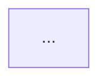

# FIGURE_LIST — 全书配图清单

> 规则：技术图 = Mermaid；封面/头图 = 抽象位图（无文字）。节点 ≤12。术语见 GLOSSARY。
> 本轮已完成 P0 配图接入：Docsify 自托管 Mermaid + 封面/四案例头图 + 26 章 Mermaid。

## 全书级

| ID | 标题 | 类型 | 放置 | 一句话结论 | 状态 |
|---|---|---|---|---|---|
| F-00 | AI 原生交付闭环 | flowchart | 首页 README | 意图→上下文→生成→评估→人审→部署→回灌 | 完成 |
| F-00b | 六种失灵 mindmap | mindmap | 首页 README | 失灵即接管清单 | 完成 |
| F-01 | 三层能力 | flowchart | 第1章 | 有为 AI 出错设计的刹车才算原生 | 完成 |
| F-02 | 六失灵→接管 | flowchart | 第2章 | 一一对应组织动作 | 完成 |
| F-03 | 生成→介入→落地 | sequence | 第3章 | 选择与负责落在具名的人 | 完成 |
| F-04 | 四支柱 | flowchart | 第4章 | 契约/可验证/可回溯/文档即代码 | 完成 |
| F-05 | 考古四步 | flowchart | 第5章 | 先画图再动刀 | 完成 |
| F-06 | 循环依赖与孤儿 | flowchart | 第6章 | 局部正确织出全局死结 | 完成 |
| F-08 | 契约先行流水线 | flowchart | 第9章 | 签字权在人，实现对齐契约仓 | 完成 |
| F-09 | 边界测试门禁 | flowchart | 第10章 | 违规在 CI 变红 | 完成 |
| F-10 | 留缝五步 | flowchart | 第11章 | 生成当天下死扩展点 | 完成 |
| F-11 | 数据/日志/事件三分家 | flowchart | 第12章 | 分类是人的语义判断 | 完成 |
| F-12 | 设计令牌即审美契约 | flowchart | 第15章 | 没有令牌多端各画各的 | 完成 |
| F-12b | 多端 BFF | flowchart | 第17章 | 一份契约多端翻译 | 完成 |
| F-13 | 五层门禁 | flowchart | 第19章 | 五全过才能上线 | 完成 |
| F-14 | 风控三道防线 | flowchart | 第20章 | 设计阶段必须邀请风控 | 完成 |
| F-15 | 对账与监控闭环 | flowchart | 第21章 | 对账独立于发布 | 完成 |
| F-15b | 合规硬门槛 | flowchart | 第22章 | 留痕缺失阻断合并 | 完成 |
| F-16 | 提示词生命周期 | flowchart | 第23章 | 进版本可回归抗腐化 | 完成 |
| F-17 | 幻觉三类型 | flowchart | 第24章 | 雷达与法官角色不可混 | 完成 |
| F-18b | 文档治理环 | flowchart | 第25章 | 决策先于实现 | 完成 |
| F-18 | 治理结构 | flowchart | 第26章 | 委员会对齐打架的 KPI | 完成 |
| F-19 | 契约变更分级 | state | 第27章 | 破坏性变更走签字 | 完成 |
| F-20 | 灰度与自动刹车 | flowchart | 第28章 | 无后退路径不上线 | 完成 |
| F-22 | 案例一关键节点 | flowchart | 案例一 | 从事故到 Owner 名单再到门禁 | 完成 |
| F-21 | 四案例交叉对照 | flowchart | 第33章 | 同一原则四种加严 | 完成 |
| F-22b | 四案例时间线 | gantt | 地基时间线 | 跨度重叠便于交叉对照 | 完成 |
| F-23 | 精度铁律 + 合规铁律 | flowchart | 案例二 | 禁区靠 CI 拒绝 | 完成 |
| F-24 | 四道闸门 | flowchart | 案例三 | 生成可进流水线不可直接进战场 | 完成 |
| F-25 | 权限矩阵与人在回路 | flowchart | 案例四 | 「不许」写进代码中间件 | 完成 |
| F-07 | 目标架构三层 + import-linter | flowchart/yaml | 第8章 | 架构从壁纸变牙齿 | 完成 |
| F-考古 | 跨案例关系图 | flowchart | 角色卡 | 角色与汇报线 | P2 |
| F-补13 | 单文件拆分 | flowchart | 第13章 | 一刀切在职责 | 完成 |
| F-补14 | 立包迁移 | state | 第14章 | 兼容层双跑可回退 | 完成 |
| F-补16 | 聊天独立域 | flowchart | 第16章 | 风控钩子事前留缝 | 完成 |
| F-补18 | 分层削峰 | flowchart | 第18章 | 优先级人定 | 完成 |
| F-C1b | 案例一治理闭环 | flowchart | 案例一 | 三原则串进发布链 | 完成 |

## 位图（无文字）

| ID | 用途 | 路径 | 状态 |
|---|---|---|---|
| I-01 | 封面 / 首页 | `docs/assets/cover.webp` | 完成 |
| I-02 | 案例一头图 | `docs/assets/case-ecommerce.webp` | 完成 |
| I-03 | 案例二头图 | `docs/assets/case-exchange.webp` | 完成 |
| I-04 | 案例三头图 | `docs/assets/case-quant.webp` | 完成 |
| I-05 | 案例四头图 | `docs/assets/case-agent.webp` | 完成 |

## 图注模板

```markdown
**图 N-M｜标题**

> 一句话结论，直接可写进 PPT。



*图注：……*
```

## 下一轮

1. 文件名统一 `chNN-` 时同步更新全部图引用与图号。
2. 外部公开引用（DORA 等）按 `references.md` 核实后补进正文「延伸阅读」。
3. 角色关系图已进角色卡；如需分案例放大可再拆四张。
4. 附录 A 已加分类速查；可再补「按失灵模式反查」索引。
