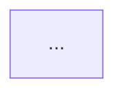

# STYLE_GUIDE — 全书风格指南

## 标题

| 层级 | 格式 | 示例 |
|---|---|---|
| 书名 | 《AI 原生软件工程》 | 侧边栏 / 封面 |
| 章 | `# 第 N 章 中文标题` | `# 第 1 章 为什么 AI 原生不是让 AI 写代码` |
| 节 | `## N.x 中文标题` | `## 1.1 问题：……` |
| 目 | `### 标题` | 事故、子步骤 |
| 禁止 | 英文 Title Case 大标题、emoji 标题、**只有标题没有内容的小节** | 末一条由第三条守卫 `check_markdown.py` 报红 |

写完一节要问一句：**这个标题下面有能读的东西吗**。「### 3. 回滚决策矩阵（见 28.4）」这种指针标题不算内容——实测全书就它一处，而附录 A 的提示词正让 AI"基于回滚决策矩阵"给建议，指针指向了空处。要么把内容补进来（可以顺手写明出处），要么把标题删掉；分组标题（## 下只放 ### 子节）不受此限。

章首固定两行引用块：

```markdown
> **本章定位**：……
> **核心命题**：……
```

## 正文

- 中英混排：中文与英文/数字之间加空格（`用 AI 生成 3 个候选`）。
- 强调用 **粗体**，不用斜体堆砌；单句警句用 `>` 引用块。
- 列表：并列事实用无序；步骤用有序；检查清单用 `- [ ]`。
- 段落短，一段一个主张。
- 不用「众所周知」「显而易见」「毋庸置疑」。
- 不用连续三个以上感叹号；案例对话保留口语。

## 加粗与引号

站内解析器（Docsify 内嵌的 marked 15）判定"标点"时**只看 ASCII 那一组**，
中文的 `，。：、（）「」——…` 在它眼里是字而不是标点。所以 `**` 挨着什么，直接决定这段加粗
落不落地——而且源码看着完全合法、页面却留下一串字面星号。写完必须过
`python3 scripts/check_render_leaks.py`（第九条守卫，浏览器实测；静态检查看不出这一类）。

- 引号包住整句判断时，**引号在外、加粗在内**：
  - 坏：`复盘说：**"两个系统同时失明。"**`（`**` 紧跟 ASCII 引号，开不出来）
  - 好：`复盘说："**两个系统同时失明。**"`
  - 也可：`复盘说：**「两个系统同时失明。」**`（全角引号算字，留在内侧没问题）
- 加粗的两端要落在**字**上，别落在 ASCII 符号上：`**成功构建 +84%**、` 这种以 `%` 收尾再接中文标点的不渲染。
  要么把整句判断收进加粗并以字收尾（`**成功构建 +84% 三项同向**`），要么让强调只罩住标签（`**成功构建** +84%`）。
- 相邻两个加粗之间必须留一个空格：`…落在摘要行上。** **坑在这里**：…`；
  写成 `。**` 紧贴 `**坑` 就是四个星号连成一串，两对同时失效。
- `**` 后面不能紧跟空格：坏 `崩溃点在** JS 侧**` → 好 `崩溃点在 **JS 侧**`。
- 加粗不要以行内代码开场：坏 ``**`select` 至少含 F 与 B。**``（`**` 紧跟反引号，开不出来）→ 好 `` `select` **至少含 `F` 与 `B`。**``。本轮扩写有 3 处栽在这一形，全由第九条守卫抓到。
- 一段里 `**` 必须成对。段末多出来的那颗，绝大多数是**漏了收引号**（`说："……我们第一个炸。**` 应为 `说："……我们第一个炸。"`）。
- 全书引号统一用 ASCII 双引号，成对出现；一段里出现奇数颗就是只开不闭。

## 事实与编号

事故只有一个事实源：`manuscript/ch05-数字清单.md` 的四张「编号｜事件｜日期」表；时间线只有一个骨架源：
`manuscript/ch03-案例时间线.md`。第十条守卫 `python3 scripts/check_incidents.py` 把这几条钉住，写完跑一遍。

- 编号写成 `字母-MMDD`，尾四位必须与本行日期同月同日（改日期就要改编号，反过来也一样）。
- 新增事故先在清单里加一行，再进正文。正文里出现清单没有的 `字母-四位数字` 形状，闸直接拒绝执行。
- 编号与完整日期同写在一行时，日期必须等于清单那一行的日期。正文默认**不要**把两者并排写——
  现网几百次点名里一次都没这么写过，写了就要对得上，否则报红（N7 今日的命中面是 0 行，
  它的牙齿只由 `--selftest` 的桩证明，别当作"闸已经拦过什么"）。
- 时间线每个「阶段」标题必须自带（YYYY-MM ～ YYYY-MM）区间，且同案各段严格递增不重叠；
  段内日期表的每一行都不得越出该段窗口。
- 清单里登记的事故，正文至少要点名一次；只进清单不进叙事的条目会被判为幻觉条目。
- 四案例之间的数字禁止互相引用；确需跨案对照（公开信、交叉启示章），写在正文里点明归属，
  这一轴**目前没有守卫**，靠人核。

## 第一人称

- 仅第八部分四案例章使用「我」。
- 理论章第三人称；需要立场时用「组织 / 团队 / 治理组」。
- 四案例叙述者不得混用第一人称细节。

## 代码

- 围栏标注语言：`java` `go` `python` `typescript` `sql` `json` `yaml` `bash` `diff`。
- 示例必须可读、可理解；不追求可直接编译的完整工程。
- 关键行用注释说明「为什么」，不注释「是什么」。
- 密钥、真实主机、真实域名一律占位符。
- 贴进来的工具读数必须是**这一页那段代码真打印出来的行**：`python` 围栏后面紧跟的 `text` 围栏，
  由第十一条守卫 `python3 scripts/check_replay.py` 把每个 `print` 编译成行模板逐行比对，
  对不上就红（它同时打印自己的盲区：改行形状的多参 `print`、循环拼接输出会整块交人工）。
  本轮扩写有两处编造被这条链抓出并改写：一处贴了脚本根本打不出的读数行，
  一处声称"本机实跑"却没附扫描器且数字是旧的。所以本机跑不了的工具一律**不出读数卡**，
  写清是"文档逐字"还是"本书未跑"。

## 表格

- 横向对照表用于：四案例映射、反模式、介入点矩阵、检查项。
- 表头简洁；单元格短语，不塞整段。
- 数字与数字清单一致；无法核实写 `[待核实]`。

## 图注与 Mermaid

- Mermaid 围栏以三个反引号加 `mermaid` 起头；图注**紧随围栏之后**（全书实测 100+ 张统一此序）：

````markdown


**图 N-M｜标题** — 一句话结论，可直接写进 PPT。
````

- 每张图三件齐：图号、标题、一句话结论；术语与 `GLOSSARY.md` 一致。
- **图号 `前缀-序号` 全书唯一**：前缀按 `BOOK_SPEC.md` §9 的前缀表取（一章一个，新章先查表别挤），序号在本章内递增。给图起号前先问"这个编号全书还有谁在用"——`python3 scripts/check_figures.py` 会撞号即退出 1，并打印撞在哪几章的哪两张图。2026-09-25 实测：旧规则只写"本章内递增"时，全书 107 条图注只有 102 个唯一编号。
- 每章（含附录与前置账本）2–5 张图；无豁免条款。
- 节点中文短标签；避免括号内长句；节点数 ≤ 12。
- 颜色不依赖（读者可能色弱）；结构靠方向与分组。
- **正文里不要裸写围栏串**（三个及以上反引号）：Docsify 会把它当代码块起点，后半页被吞成裸文本。展示围栏时用四反引号包住外层，或改写成"三个反引号"。这条与围栏成对性由 `scripts/check_markdown.py` 校验。

## 引用与遗留债务

- 章末可有「遗留债务」：提出问题 + 回答章号。
- 不编造外部文献；公开数据写清来源与年份，不能确认标 `[待核实]`。

## 事故编号

本节只管**写法**；编号↔日期的一致性、登记与点名的规矩在上方「事实与编号」，由第十条守卫 `check_incidents.py` 把住。

- 格式：`字母-MMDD` 或书中既有编码（`A-0402` `D-0114` `E-0311`）。
- 首次出现写完整日期与影响面；后文可用编号。

## 页脚与站点

- 页脚固定：`AI 做可能，人做选择，人做负责。`
- 主题浅色、Indigo 主强调色、系统字体栈、零 CDN。
