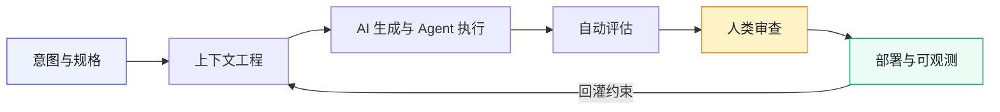
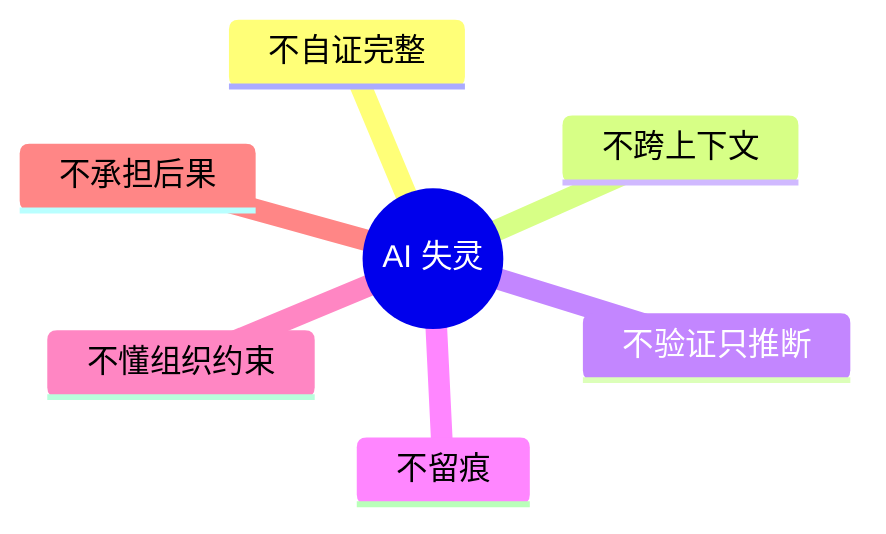

# 《AI 原生软件工程》

  
AI Native Software Engineering

  
当 AI 自己兜不住的时候，<strong>组织如何接管</strong>。

  
不是 AI 的能力清单，是<strong>组织的接管清单</strong>。

  

    01
    <strong>契约先行</strong>
    
接口的事实声明先于代码；实现对不上契约仓就合不了。

  

  

    02
    <strong>人在回路</strong>
    
AI 做可能，人做选择，人做负责。关键节点必须签字。

  

  

    03
    <strong>留缝留痕</strong>
    
输出与生效之间永远留一层人工缝隙；每次操作可审计。

  

---

## 四个案例，一种共识

  <a class="case-card" href="manuscript/44-案例一-300人电商平台.md">
    
    

      案例一 · 300 人
      <h3>电商平台</h3>
      
资金对账不可漏。契约先行 + 留痕，从 Owner 名单开始。

      进入叙事 →
    

  </a>
  <a class="case-card" href="manuscript/45-案例二-海星交易所.md">
    
    

      案例二 · 2300 人
      <h3>海星交易所</h3>
      
撮合精度不可优化。精度铁律 + 合规铁律，CI 硬拒禁区。

      进入叙事 →
    

  </a>
  <a class="case-card" href="manuscript/46-案例三-暗流资本.md">
    
    

      案例三 · 32 人
      <h3>暗流资本</h3>
      
策略意图不可篡改。四道闸门拦过拟合与不安全合约。

      进入叙事 →
    

  </a>
  <a class="case-card" href="manuscript/47-案例四-守夜人科技.md">
    
    

      案例四 · 10 人
      <h3>守夜人科技</h3>
      
智能体边界不可越权。权限矩阵写进代码中间件。

      进入叙事 →
    

  </a>

> AI 把「可能」变多了，把「选择」和「负责」的重量全压到了人身上。

---

## 全书主线

**图 0-1｜AI 原生交付闭环** — 生成可以自动，生效必须过评估与人审，观测再回灌成下一轮上下文。

---

## 六种 AI 失灵模式

AI 稳定做不到的六件事——是**组织的接管清单**：

**图 0-2｜六种失灵** — 在哪里失灵，组织就必须在哪里站起来。

---

## 九部分地图

| 部分 | 主题 | 你将得到 |
|:---:|:---:|:---|
| 一 | 认知 | AI 原生边界、人在回路、人机分工、工程栈四支柱 |
| 二 | 考古 | 大规模仓库画图、跨团队依赖、读懂祖传代码 |
| 三 | 立界 | 目标架构、契约先行、边界测试、留缝五步 |
| 四 | 重构 | 数据分家、接口拆分、立包迁移、设计令牌 |
| 五 | 新功能 | 聊天独立域、多端 BFF、亿级削峰 |
| 六 | 上线 | 五层门禁、风控三防线、对账回滚、合规红线 |
| 七 | 治理 | 提示词归档、幻觉处理、ADR、组织与契约治理 |
| 八 | 四案例 | 等权第一人称叙事 + 灰度发布锚点 |
| 九 | 交叉收束 | 规模 × 治理密度 × 三原则加严形态 |

---

## 从哪里开始

  <a class="path-card" href="manuscript/03-这本书是什么.md">
    <strong>这本书是什么</strong>
    先对齐定位与边界
  </a>
  <a class="path-card" href="manuscript/04-90天总路线图.md">
    <strong>90 天路线图</strong>
    季度作战与验收
  </a>
  <a class="path-card" href="guide.md">
    <strong>阅读指南</strong>
    按角色选路径
  </a>
  <a class="path-card" href="manuscript/42-附录K-一线最小实践包.md">
    <strong>一线最小包</strong>
    一页可抄
  </a>

- 想先看案例 → [四案例时间线](manuscript/00-案例时间线.md)  
- 系统面（eval / 成本 / 权限）→ [附录 J](manuscript/41-附录J-AI系统工程.md)  
- 全书骨架 → [总览](manuscript/README.md)

---

## 证据边界

四案例均为**自洽虚构的脱敏示范案例**，不指代任何真实公司或个人。数字以 [数字清单](manuscript/02-数字清单.md) 为唯一事实来源。正文引用时不得把案例当作真实记录陈述。

理论章另附**公开参照**（DORA、NIST、GitHub 企业研究等），详见 [公开证据档案](public-evidence.md) 与 [延伸阅读](references.md)。外部资料只做框架对照，不给虚构事故数字背书。

---

> **本书的一句话**：组织接管的全部意义，就是在 AI 把事情做完之后，还有人敢站出来说——**「这一步，AI 做不了，我来。」**
