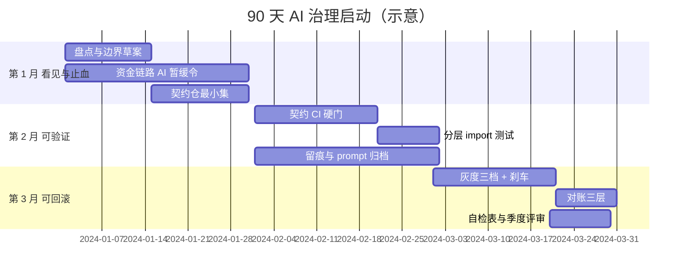
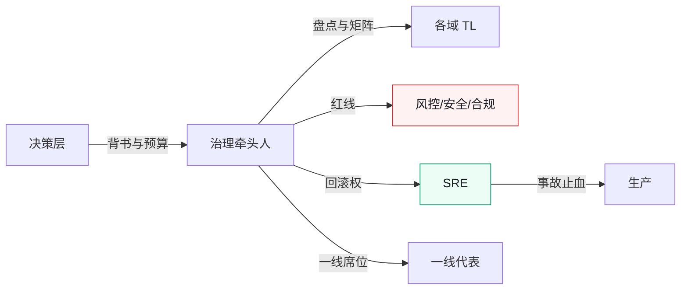
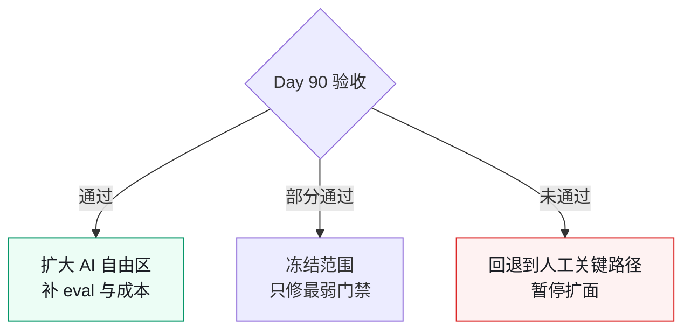

# 90 天总路线图：从 0 到可接管

> **本章定位**：把全书画成一张季度作战图。不替代分章细节，回答「第一个季度每周干什么、谁签字、什么算完成」。
> **核心命题**：治理不能并行开十战场；先让一笔资金相关变更**可追溯、可回滚、可对账**，再扩面。

---

## 0.1 目标状态（Day 90 验收）

随便挑一笔**上周上线的资金/权限/契约相关变更**，10 分钟内答出：

1. 契约在哪、Owner 是谁  
2. 用了哪版提示词 / 哪次生成任务 ID  
3. 门禁结果与谁会签  
4. 灰度比例与刹车阈值  
5. 回滚命令或降级开关在哪  
6. 对账是否跑过、差额多少  

答不出任意两条 → 仍在过渡态，不要扩「全量 AI 自由区」。

---

## 0.2 总览甘特

**图 R-1｜90 天甘特** — 先止血与看见，再可验证，最后可回滚与可复盘。

---

## 0.3 第 1 月：看见与止血

### 第 1–2 周

| 动作 | 产出 | 签字人 | 完成定义 |
|---|---|---|---|
| 仓库/服务盘点 | 模块表（含 money_path） | 治理牵头人 + 各域 TL | 资金链路清单非空 |
| AI 使用边界 v0 | 可碰 / 需审批 / 不可碰 | CTO 或授权人 | 「不可碰」有具名链路 |
| 资金链路 AI 暂缓 | 邮件/公告 + CI 提示 | CTO | 高风险 PR 能被提醒或拦截 |

**不要做**：全员培训三十场、换一堆工具、写长规范不进 CI。

### 第 3–4 周

| 动作 | 产出 | 完成定义 |
|---|---|---|
| 契约仓库最小集 | 仅资金/跨端/对外接口 | 每份契约有 Owner 人名 |
| 介入点矩阵 v0 | 谁在哪步必须签字 | 资金行非空 |
| 事故响应草稿 | 止血优先序 | 「先降级/冻结再查因」写死 |

---

## 0.4 第 2 月：可验证

| 周 | 动作 | 硬门禁 | 代价（预期） |
|---|---|---|---|
| 5–6 | OpenAPI/Protobuf 与实现 diff | 不一致拒绝合并 | CI 时长上升 |
| 7 | 破坏性变更多端 TL 签字 | 无签字不可合 | 评审积压可能先升后降 |
| 8 | Python/分层 import-linter | 违规编译失败 | 历史违规进白名单消化 |
| 全月 | AI PR 附 prompt/任务 ID | 先警告后阻断 | 留痕率爬坡 |

**第 2 月结束标志**：新代码架构违规率可度量且下降；契约一致率周报能出数。

---

## 0.5 第 3 月：可回滚与可复盘

| 周 | 动作 | 验收 |
|---|---|---|
| 9–10 | 灰度 1% / 10% / 50% 三档 | 每档有自动刹车指标 |
| 11 | 迁移必须成对回滚脚本 | 缺回滚包不让上 |
| 11 | 对账：字段完整性 + 数值 + 趋势 | 资金变更次日有对账结果 |
| 12 | 自检表进评审 | 结果挂钩下季度治理资源 |

---

## 0.6 角色负荷（避免一人扛）

**图 R-2｜角色负荷** — 治理牵头人不「多盖一个章」，而是把已有权力收拢到可对齐处。

---

## 0.7 指标仪表盘（最小字段）

| 指标 | 定义 | 频率 | 谁看 | 起步健康带 |
|---|---|---|---|---|
| 契约一致率 | 实现与契约 diff 通过占比 | 周 | 委员会 | ≥95%（终态） |
| AI PR 留痕率 | 附 prompt/任务 ID 占比 | 周 | 治理组 | 先爬坡再 >90% |
| 评审积压 | PR 等待会签时长 | 周 | 治理+TL | 峰值后回落 |
| 事故率 | 与 AI 相关生产事故 | 月 | 全员 | 相对基线下降 |
| MTTR | 告警→止血完成 | 月 | SRE | P50 ≤30min |
| 自动刹车次数 | 灰度触发 | 周 | SRE+业务 | 0 过松 / 过高需调参 |

> 厂商效能数字（如 [GitHub × Accenture](https://github.blog/news-insights/research/research-quantifying-github-copilots-impact-in-the-enterprise-with-accenture/) 的 PR/构建变化）只能作外部参照，**不能替代你自己的基线**。

---

## 0.8 常见失败路径

| 失败 | 症状 | 纠正 |
|---|---|---|
| 只买工具不建门禁 | 事故率与提交量齐涨 | 立刻暂停资金链路 AI |
| 全量盘点不收口 | 三个月还在画图 | 只锁 money_path |
| 门禁可豁免 | 进度一紧就跳过 | 豁免必须 ADR + 时限 |
| KPI 进个人 | 一线反弹、留痕造假 | 团队级聚合 |
| 没有回滚包 | 迁移上线即单向门 | CI 检查成对脚本 |

---

## 0.9 90 天后的分叉

**图 R-3｜分叉** — 扩面是验收结果，不是日历结果。

---

## 0.10 检查清单

- [ ] 你是否指定了一名治理牵头人且给足时间盒？  
- [ ] 资金/权限链路的「不可碰」是否有具名？  
- [ ] 第 2 月是否有至少一条**不可绕过**的 CI？  
- [ ] 第 3 月是否有回滚演练记录？  
- [ ] 指标是否团队级、非惩罚性？  
- [ ] 90 天后敢不敢「冻结扩面」？不敢 = 一直在赌。

---

> **本章的一句话**：90 天不是把治理做完，是把「AI 失灵时组织接得住」的最小回路跑通。**先可追溯、可回滚、可对账，再谈更宽的自由区。**
