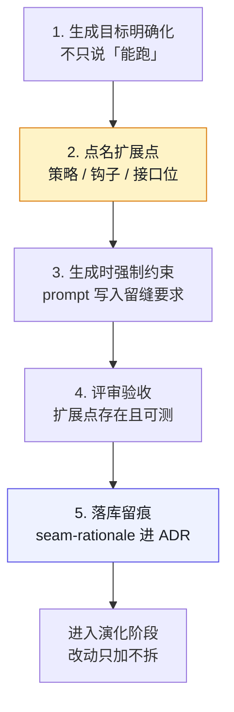
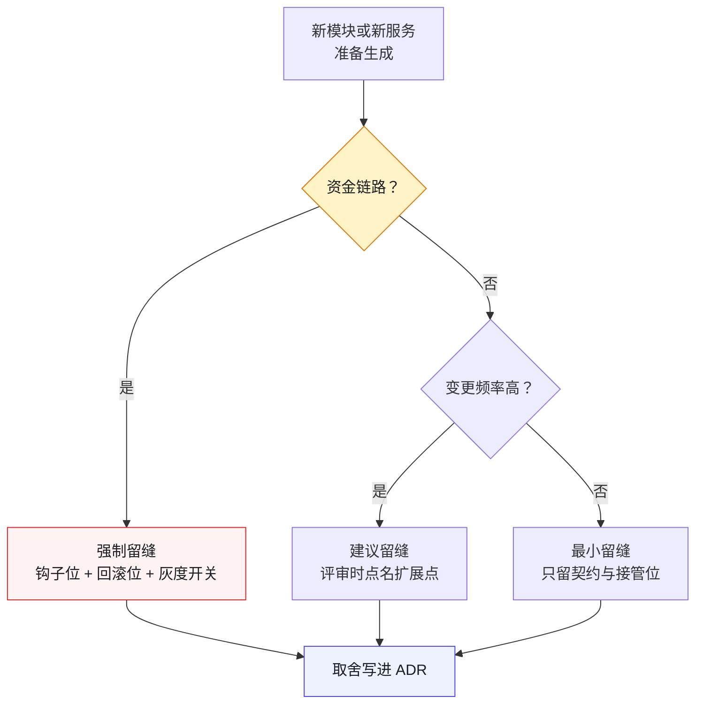
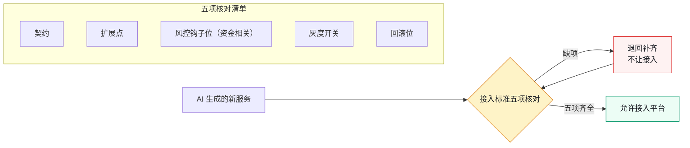

# 第 11 章 AI 一句话生成了系统，然后呢？

> **本章定位**：留缝章。回答"AI 生成的代码以后能不能改"这一问题，给出"生成-留缝五步法 + 扩展点地图 + 服务接入标准"的机制化答案。
> **核心命题**：AI 优化的是"现在能跑"，组织的成本大头在演化；除非有人在生成的那一刻替未来留缝，否则生成越快，演化越贵。

---

## 11.1 问题：生成只花了 20 分钟，改造花了三个礼拜

试点期有一个典型案例。一线工程师让 AI 生成一个规则引擎，从空到能跑，**20 分钟**。群里随即弹出一句"AI 牛逼"，附了张截图：规则配置、计算、落库，全有了。

然后是三个礼拜的折磨。

第一次改动：要加"满减和折扣不能叠加"。AI 给的初版把规则算死了，加不了。打开一看，不是逻辑错，是**结构上没有留扩展点**：规则之间是硬编码的 if-else，不是可组合的策略对象。改这个，等于重写。

第二次改动：要支持"按地域不同规则不同"。又重写一次。

第三次：要接入风控的限额校验。这次风控负责人下场了——他看了眼代码，说："这个引擎跑规则可以，但你没给风控留接口位。我不要事后塞，我要事前拦。"一线工程师说："加上不就行了？"风控负责人说："加不上。你的执行路径里没有钩子位，加进去就是把整个流程拆了重接。"

这一次算了一笔账：**生成省下了大约 3 天的人力，但因为没有留缝，后续三个月里为这段代码多花了 18 人天。** 生成便宜，演化昂贵——这是那三个月里最狠的一课。

---

## 11.2 根因：AI 优化的是"现在能跑"，不是"以后能改"

AI 生成代码，它的目标函数是**"满足当前 prompt 的最短路径"**。它不知道这段代码三个月后会被怎么改、会被谁接管、会被多少个端复用。于是它默认产出的是**最贴合当下、最不利于演化**的形态：

- **硬编码替代抽象**：能把 if-else 写完，它就不建策略类。
- **私有实现替代接口**：能直接调，它就不留接口位。
- **复制替代复用**：能复制一段，它就不抽公共模块。
- **跑通替代留缝**：能跑，它就不管"以后怎么改"。

**这不是 AI 的 bug，这是它的天性。** 它没有"为未来负责"这个动机，因为未来不在它的上下文里，也不在它的损失函数里。

于是矛盾出现了：**组织的成本大头在演化，AI 的强项在生成。一个只擅长生成的工具，被丢进一个演化成本占 80% 的系统里，必然把总成本推高——除非有人在生成的那一刻，替未来留缝。**

---

## 11.3 AI 用法：AI 生成，人留缝，五步法



**图 11-1｜留缝五步** — 生成省 3 天，没留缝可能多花 18 人天；缝必须在生成当天下死。

成熟实践定下的规矩，叫**生成-留缝五步法**。AI 还是那个 AI，但人的介入从"事后改"挪到了"生成时定形"。

```
1. 考古   —— 先搞清楚这块要接进哪个现有边界，AI 不许凭空生成
2. 判断   —— 人决定：这段需要哪些扩展点、哪些接管位
3. 契约   —— 先写契约/接口骨架，AI 在骨架内填实现
4. 灰度   —— 生成物走门禁，小流量验证
5. 归档   —— 扩展点、接管位、设计取舍写进 ADR
```

**关键在第 2 步——这是 AI 替不了的一步。** AI 能在骨架里填得又快又好，但"该留几个扩展点""风控钩子放哪"，它答不了，因为这是对未来的判断，未来不在它的上下文里。

回头复盘那次三个礼拜的折磨，根子正是跳过了第 2 步：让 AI 从零生成，没给它任何"缝"的约束，它当然贴着地面把路铺死了。

### 操作步骤：生成前点名扩展点

第 2 步「判断」最容易空转——人说"我会留意的"，然后什么都没留下。可照抄的提问顺序：

1. **问变更**：这块代码未来三个月最可能改的是什么？（规则、渠道、计价、权限，至少点出两项）
2. **问接管**：谁可能在我之后接手？他要的钩子位、回调位放在哪个接口上？
3. **问拦截**：这段要不要过风控 / 合规的卡点？要，就把钩子写进契约；不要，写明为什么不要。
4. **问回滚**：生成物出问题时怎么关掉？灰度开关、回滚位挂在哪个配置键上？
5. **问归档**：以上四问的答案落到哪份 ADR？没有落点，等于没问。

答不上来的问题，不要硬编——标"待定"进扩展点地图，比编一条错缝便宜。

### 模板：把留缝要求写进 prompt

留缝要求若不进 prompt，就是空话。可照抄的最小模板（占位符自行替换）：

```text
请实现【模块名】。约束：
1. 在【业务域】内复用现有【服务或包名】，不新造平行实现。
2. 【扩展点一，如：计价规则】以策略接口暴露，默认实现一个，注册进工厂。
3. 【扩展点二，如：风控校验】预留钩子位，调用【风控服务或包名】的接口，本次可先空实现。
4. 灰度开关、回滚位接入【配置中心或配置文件】的既有键，不新造配置面。
5. 不确定处显式标注 TODO，不要自行猜测补全。
```

模板里最值钱的是第 3 条：**钩子位允许空实现，但不允许没有**——留缝留的是"位"，不是"功能"。

---

## 11.4 角色博弈：留缝是要花钱的，谁出？

留缝不免费。**给一段代码留扩展点，意味着现在多写 20%、多测 20%、多评审 20%。** 这笔钱谁出，是大组织里最现实的冲突。

**冲突 · 一线交付 vs 风控可接管。** 一线工程师的 KPI 是交付量，留缝降低他的速度；风控负责人的 KPI 是零损失，不留缝他事后接不进来。两人在会上顶起来：

> **一线工程师**：你现在让我每个引擎都留风控钩子位，我交付量掉三成。
> **风控负责人**：你不留，出事了我接不进来，资金算谁的？
> **决策层**：留，但只在资金相关链路强制留；非资金的，留可选项。

**妥协：资金链路强制留缝，非资金链路建议留缝、不强制。** 一线保住了非资金域的速度，风控保住了资金域的可接管性。**两边都丢了东西：一线丢了资金域的"快"，风控接受了非资金域的"可能接不进来"。**

这件事的教训是：**留缝不能一刀切。** 一刀切全留，组织被拖垮；一刀切不留，事故重演。**缝留多少、留哪、谁批，必须按域分，必须挂到责任人头上。**

把这条分级规则画成决策流，评审时照着走：



**图 11-2｜留缝分级决策** — 资金链路宁多勿少，非资金按变更频率倒推；分级结果必须落进 ADR，不许口头。

---

## 11.5 产出物：系统扩展点地图 + 服务接入标准

可落地的两件：

1. **《系统扩展点地图》**：每个核心链路标注——现有扩展点、接管位、谁拥有这个缝、下次该不该补缝。
2. **《服务接入标准》**：AI 生成的新服务要接入平台，必须自带：契约、扩展点、风控钩子位（资金相关）、灰度开关、回滚位。缺一项，不让接。

《服务接入标准》在接入环节就是一道门禁：



**图 11-3｜服务接入标准门禁** — 契约、扩展点、钩子位、灰度开关、回滚位，五项齐全才放行；缺一项就退回补齐。

> **代价声明**：接入标准上线后，新服务从"生成到可接入"的平均时长从 1.2 天涨到 3.5 天。一线会说"这是给 AI 上手铐"。这笔账组织认——但经历过一次"事后接不进来"的事故之后，没人再说手铐是坏事了。

### 模板：扩展点地图的最小条目

《系统扩展点地图》不需要复杂工具，一页表就是起点。每个核心链路一条，字段照抄：

| 字段 | 填什么 | 示例（占位） |
|------|--------|-------------|
| 链路 | 哪条业务链路 | 促销计价链路 |
| 缝位 | 扩展点 / 接管位的名字 | 计价规则策略接口 |
| 类型 | 底线缝 / 弹性缝 | 底线缝（资金相关） |
| 归属 | 谁拥有这条缝 | 促销域 TL |
| 状态 | 已留 / 待补 / 不留 | 已留 |
| 取舍依据 | 对应的 ADR 编号 | ADR-XX（占位） |

「状态」一栏只许三选一，不许留空——留空的地图，三个月后就没人在更新了。

### 度量指标：留缝有没有用，看哪几个数

| 指标 | 怎么测 | 阈值 | 谁看 | 多久看一次 |
|------|--------|------|------|-----------|
| 接入标准缺项拦截数 | 接入门禁的退回记录 | 每次退回都登记，趋势归零 | 平台治理组 | 每月 |
| 扩展点地图覆盖率 | 有条目的核心链路占全部核心链路的比例 | 只升不降 | 各域 TL | 每季度 |
| 资金链路钩子位就位率 | 接口存在性测试通过的资金模块占比 | 全量就位，零容忍缺口 | 风控负责人 | 每次发版 |
| 重写式改动次数 | 评审中被标注「等于重写」的改动 | 持续下降 | 架构组 | 每月 |

这张表刻意不设百分比目标——留缝的收益要几个月后才显形，早期盯绝对数只会逼出造假。先确认"有人在看"，再看趋势。

### 检查清单：评审一段 AI 生成代码的留缝

- [ ] 扩展点是落在接口上，还是只落在注释里？
- [ ] 资金相关链路有没有风控钩子位——哪怕是空实现？
- [ ] 灰度开关与回滚位接的是既有配置键，还是又新造了一套配置面？
- [ ] 本次"不留缝"的决定写进 ADR 了吗，还是只活在口头？
- [ ] 扩展点地图上这条链路的状态栏，更新了吗？

---

### 四案例映射

本章"留缝"机制在四个案例中的具体落地形态：

| 案例 | 必留的"底线缝" | 留缝分级 | 谁拍板 |
|------|---------------|---------|--------|
| 案例一·电商平台 | 促销规则引擎的策略插拔扩展点 | 资金相关强制、其余建议 | 多端负责人 + 业务域 TL |
| 案例二·加密交易所 | 资金链路的风控钩子、回滚位、灰度开关 | 全链路强制 | 风控负责人 |
| 案例三·Web3量化 | 策略插拔位、数据源适配位、熔断接管位 | 强制 | 量化负责人 + 风控 |
| 案例四·安全初创 | 安全审计接管位、权限校验钩子、日志留痕位 | 全链路强制 | 合规负责人 |

---

## 11.6 检查清单

- [ ] 你让 AI 生成一个新模块前，有没有先画好"它要接进哪个边界"？
- [ ] 生成的代码里，有没有为未来改动预留的扩展点？还是一个紧贴当下的死疙瘩？
- [ ] 资金/风控相关的生成物，有没有强制的人工接管位（钩子、回调、审批接入点）？
- [ ] 你有没有一张"扩展点地图"，知道系统现在哪里有缝、哪里没缝？
- [ ] AI 生成的新服务，接入平台有没有一份"必须自带什么"的清单？
- [ ] 留缝的取舍，有没有写进 ADR？还是只活在某个人的判断里？

---

## 11.7 反模式

| # | 反模式 | 后果 |
|---|--------|------|
| 1 | 让 AI 从零生成，不给任何边界约束 | 3 天省下，18 人天赔进去 |
| 2 | 一刀切全留缝，不看域 | 拖垮交付速度 |
| 3 | 一刀切全不留缝 | 事故接不进来 |
| 4 | 留缝只留在脑子里 | 人走了缝就没了 |
| 5 | 把"留缝"理解成"多写注释" | 注释救不了硬编码 |

---

## 11.8 遗留问题

- **缝留多少才够？** 留多了浪费，留少了痛苦。没有现成公式，只有一条经验：**资金链路宁多勿少，非资金链路按变更频率倒推**。这条够不够，本书不打包票。
- **谁来判定"该不该留缝"？** 现在是各域 TL 与决策层人工判。能不能做成一份"扩展点检查清单"自动化？留给第 10 章（边界变成测试）和第 25 章（ADR 治理）。
- **AI 会不会进化到自己留缝？** 一种判断是：它会越来越会"留看起来像缝的东西"，但**"留对缝"需要对未来的判断，这部分永远是人吃饭的本事。** 这条，第 24 章再展开。

---

> **本章的一句话**：AI 让"把东西做出来"变得几乎免费，于是**"做出来之后能不能改"成了新的贵**。留缝，就是人在生成的那一刻，替三个月后的自己交的保险——这笔保险费，AI 不愿意出，因为它不为未来负责；只有人愿意出，因为改这段代码的，迟早是人自己。
