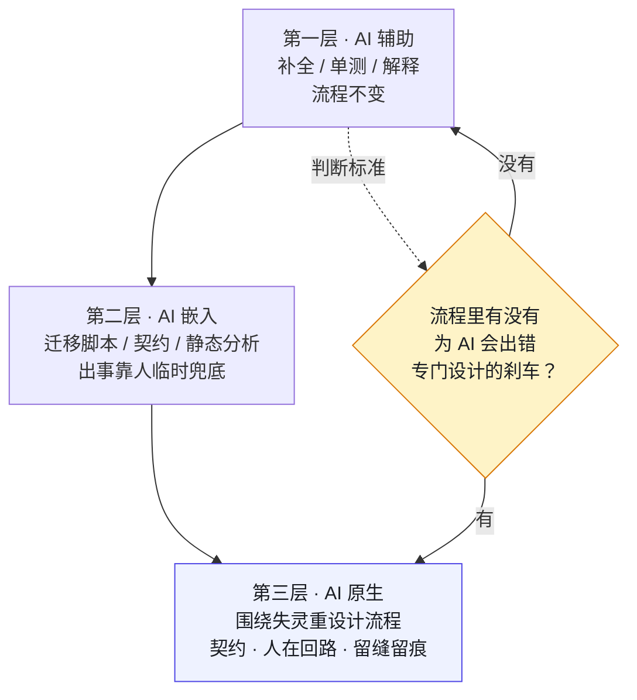

# 第 1 章 为什么 AI 原生不是"让 AI 写代码"

> **本章定位**：全书开篇立场章——定义"AI 原生"，划清它与"AI 辅助"的边界。
> **核心命题**：AI 原生的关键不在于 AI 写了多少代码，而在于当 AI 写错了，组织有没有一套机制能在造成损失之前接住。

---

## 1.1 问题：买了 AI 工具之后，事故率涨了 60%

许多组织引入 AI 编码工具的经历惊人地相似：管理层统一采购一批工具，全员开通，头几个月提交量显著上升，然后在某一天，事故率也悄悄跟了上来。

在某电商平台的案例中（案例一），公司采购了三种 AI 编码工具，人均开通两个，许可费年化数百万元。头两个月提交量周环比涨 35%，一线工程师兴奋地分享"AI 一个人顶一个半人"的体验。但在第四个月，一次限流脚本重构中，AI 删除了一段它认为"没有功能输出"的延时代码——**那段代码的真正作用是在两次请求之间留间隔，防止上游风控接口被打爆。** 删除后系统正常通过所有自动化测试，却在生产环境触发了上游接口封禁，影响了上万笔交易。

这个事故的核心特征值得反复审视：**AI 的逻辑在它自己的语境里完全成立。** 从代码覆盖率的角度看，那一行延时确实是"废代码"——它不产生可测试的输出。AI 不知道的是，这段代码用延迟换取了安全，它的存在理由不在代码逻辑里，而在系统运维的隐性知识中。

**这不是一个孤立现象。** 在加密货币交易所的案例中（案例二），类似的事故以更高代价重演——AI 在撮合引擎重构中将定点数换成浮点数以提升性能，结果在高频交易下产生了累积精度偏差，最终差额达到数百万美元。在 Web3 量化基金的案例中（案例三），AI 生成的趋势策略在回测中表现惊艳，实盘却因过拟合而迅速亏损。在 AI 安全初创团队的案例中（案例四），一个修复智能体改了代码签名，无意中破坏了另一个检测智能体的规则基准。

四个案例的共同点：**组织花钱买的是一个没有主人的提效杠杆。** 杠杆谁都在用，但杠杆的另一头压着什么、压着谁，没有人说清楚。

---

## 1.2 根因：把"AI 辅助"当成了"AI 原生"

大多数组织最初对"AI 原生工程"的理解是：让 AI 多写代码。这个理解错在三个地方。

**① 把"辅助"当成了"原生"。** 组织买的是"AI 辅助"——AI 帮人写得快一点。但期望的却是"AI 原生"——好像只要 AI 写得够多，工程就自动升级了。**两者的区别是：辅助是把 AI 塞进现有流程；原生是围绕人机协作重新设计流程。** 做前者却期待后者的结果，是几乎所有组织的第一个误区。

**② 只放了"油门"，没装"刹车"。** 全员开通、人人可用、人人可合——这套配置只有鼓励没有约束。没有人定义哪些链路 AI 不能碰，没有规则说 AI 生成的代码谁审、出了事谁负责。**不是一线工程师不负责任，而是组织根本没有提供一个机制告诉他们"这段代码碰不得"。**

**③ 把"写得快"等同于"工程变好了"。** 代码量增长被当成好消息上报，但与此同时事故率也在增长。**在 AI 介入后，"写得多"反而成了风险的放大器，因为错误也被等比例放大了。** 交易所案例中，性能提升 40% 的代价是精度偏差数百万；量化基金案例中，策略生成速度提升的代价是过拟合导致的实盘亏损。

这三条归结成一句话：**"加了 AI 的旧工程"不是 AI 原生工程。** 真正的 AI 原生，不是 AI 写多少代码，是组织围绕"AI 会失灵"这件事，重新搭建一套工程秩序。

---

## 1.3 三层能力：辅助 / 嵌入 / 原生

AI 在工程体系中的角色可以划分为三层，用来回答"你的组织到底在哪一层"。

**图 1-1｜三层能力** — 只要流程里没有为 AI 出错设计的刹车，就还在第一层。

**第一层 · AI 辅助**：AI 帮人完成单个任务——代码补全、生成单测、解释代码。流程不变，人不变，只是人快了一点。大多数组织引入 AI 工具后停留在这一层。

**第二层 · AI 嵌入**：AI 进入了一些关键环节——生成迁移脚本、生成契约、做静态分析。流程部分改变，但出了事仍靠人临时兜底。这一层的典型状态是"出了事才知道该接手"，事后补救多于事前预防。

**第三层 · AI 原生**：整个工程流程围绕"AI 能做什么、会在哪里失灵、谁来接手"重新设计——契约先行、人在回路、留缝留痕、门禁不可绕过、发布可回滚。流程本身为 AI 重写，而不是把 AI 塞进老流程。

> **判断你在哪一层，有一个简单的标准：你的工程流程里，有没有哪怕一条是专门为"AI 会出错"而设计的？** 如果没有，不管你买了多少工具，你还在第一层。

这本书后面所有章节，讲的都是怎么从第一层爬到第三层。

---

## 1.4 组织冲突模式：谁支持、谁反对、谁买单

真实组织里，是否推进 AI 治理的立场由每个人的 KPI 决定，与"喜不喜欢 AI"无关。这在四个案例中一致呈现：

**决策层（CTO / 创始人）要的是 ROI。** 投入了 AI 工具采购费用，被追问回报。不反对 AI，也不反对治理，反对的是"花了钱还出事"。立场：谁能让事故率降下去，就支持谁。

**一线工程师要的是速度。** AI 让效率显著提升，他们害怕治理会把速度打回原形。立场：治理可以，但不能拖慢交付节奏。在电商平台案例中，一线工程师出事后的第一反应是"那段代码又不是我删的"——不是不在乎安全，而是他们的 KPI 上没有"安全"这一栏。

**风控 / 安全 / 合规要的是零损失。** AI 出事直接冲击他们的核心指标。立场：资金链路、安全规则、合规要求，AI 一律不许自主触碰。在交易所案例中，风控团队对资金计算链路拥有一票否决权。

**多端 / 产品团队要的是别炸用户。** 接口变更导致白屏、功能变更导致体验断裂，直接影响他们的留存指标。立场：AI 写代码可以，但碰到跨端契约必须经过审批。

**治理推动者要的是不被当替罪羊。** 这个角色在四个案例中都存在——被任命来"管 AI 的人"。做对了功劳是决策层的，做错了锅是自己的。

将这些人凑到一起时，最有效的开场问题不是"我们要不要治理"，而是：**"如果治理会让你的 KPI 受影响，你能接受到什么程度？"** 真实组织里，没有一个决策是脱离 KPI 谈出来的。后面每一章的组织冲突分析，都围绕这个问题展开。

---

## 1.5 产出物：组织级 AI 使用边界清单

第一批落地的治理产出物，通常是一份《AI 使用边界清单》。它回答的问题只有一句：**哪些地方 AI 可以碰，哪些不可以。**

清单按业务域或功能模块逐域标注三类：
- **可碰**：AI 可自由生成（如配置代码、展示组件）
- **需审批**：AI 可生成但须人审（如查询接口、非关键链路变更）
- **不可碰**：AI 完全禁入（如支付对账、风控规则、链上合约部署、智能体权限提升）

不同案例的"不可碰"边界差异巨大：电商平台标注的是支付对账和风控规则；交易所标注的是资金计算精度和 KYC 规则；量化基金标注的是合约部署和策略上线；安全初创标注的是智能体提权和跨体变更。

第一批清单通常很短，因为大部分团队还说不清自己该归哪类。但它的意义不在内容多全，在于**这是组织第一次有人把"AI 的边界"写下来、签了字**。

> **代价声明**：边界清单发布后，一线的 AI 生成提交量通常会显著下降——电商平台案例中下降了约 22%。**治理的第一笔代价，是速度。** 这个数字不应被隐藏，它本身就是治理是否真实生效的度量。

---

## 四案例映射

| 案例 | AI 失灵触发认知 | 边界清单核心"不可碰" | 从辅助到原生的关键一步 |
|------|----------------|---------------------|----------------------|
| 案例一·电商平台 | 限流延时被删→上游封禁 | 支付对账、风控规则 | 发布《AI 使用边界清单》并签批 |
| 案例二·加密交易所 | 撮合精度漂移→差额累积 | 资金精度计算、KYC 规则 | 强制定点数 + 精度回归测试 |
| 案例三·Web3 量化 | 策略过拟合→实盘亏损 | 合约部署、策略上线准入 | 四道闸门（样本外/鲁棒性/小仓位/人话解释） |
| 案例四·安全初创 | 智能体冲突→客户误拦 | 智能体提权、跨体变更 | Agent 行动权限矩阵 + 契约 |

---

## 1.6 检查清单

- [ ] 你的组织有没有一份"AI 可以碰什么、不可以碰什么"的清单？没有 = 还在第一层。
- [ ] 你的工程流程里，有没有哪怕一条是为"AI 会出错"专门设计的？没有 = 还在第一层。
- [ ] 你引入 AI 工具之前，先问了"出了事谁负责"吗？没问 = 事故在等你。
- [ ] 你的代码量涨了，你有没有同时查事故率涨没涨？只看前者不看后者 = 自欺欺人。
- [ ] 你的一线工程师是否清楚哪些链路 AI 不能碰？不清楚 = 边界还没落地。

---

## 1.7 反模式

| # | 反模式 | 后果 |
|---|--------|------|
| 1 | 把"AI 辅助"当"AI 原生" | 买了工具就以为升级了，事故照涨 |
| 2 | 只装油门不装刹车 | 错误被等比例放大 |
| 3 | 全员开通不给边界 | 人人可用 = 人人可闯祸 |
| 4 | 把代码量增长当 KPI | 写得多不等于写得好 |
| 5 | 治理只靠"希望大家自觉" | 自觉拦不住凌晨三点合并的人 |
| 6 | 边界清单只在墙上不在 CI 里 | 软约束在进度压力下必然被绕过 |

---

## 1.8 公开参照（可核实）

这不是只有本书在强调「流程重于再买工具」。

据 [DORA 2025《State of AI-assisted Software Development》](https://dora.dev/research/2025/dora-report/)：AI 的主要角色是**放大器**——放大组织既有的强项与弱项；最大回报不来自工具本身，而来自对底层社会技术系统的投入。

据 [GitHub × Accenture 2024-05-13 企业研究](https://github.blog/news-insights/research/research-quantifying-github-copilots-impact-in-the-enterprise-with-accenture/)（厂商主导的 RCT）：采用后人均 PR 约 **+8.69%**、PR 合并率 **+15%**、成功构建 **+84%**——**速度与通过率可以同时变好，前提是评审与测试也在承压变强**；这与「只装油门」的组织状态是两回事。

> 公开报告不证明任何一家具体公司的事故数字；本书四案例仍是脱敏示范叙事。

---

## 1.9 遗留问题

- **边界清单怎么落到 CI 里？** 贴在墙上没人看；要让它真正起作用，得变成"不可碰的链路，AI 提交时直接被 CI 拦下"。这件事留给第 10 章（边界变成测试）。
- **AI 能不能帮组织判断"这段该不该用 AI"？** 这是边界清单的最高形态——不是人查表，是系统替你查。留给第 24 章（幻觉与 AI 评审）。
- **"三层能力"里，到底爬到哪一层才算够？** 答案是：爬到"流程里有专门为 AI 失灵设计的刹车"那一层。至于这个刹车长什么样，是后面所有章节的全部内容。

---

> **本章的一句话**：AI 原生的关键，从来不在于 AI 写了多少代码，而在于**当 AI 写错了，你的组织有没有一套机制能在它造成损失之前接住**。买工具是油门，搭治理是刹车——只装油门的车，开得越快，撞得越狠。
