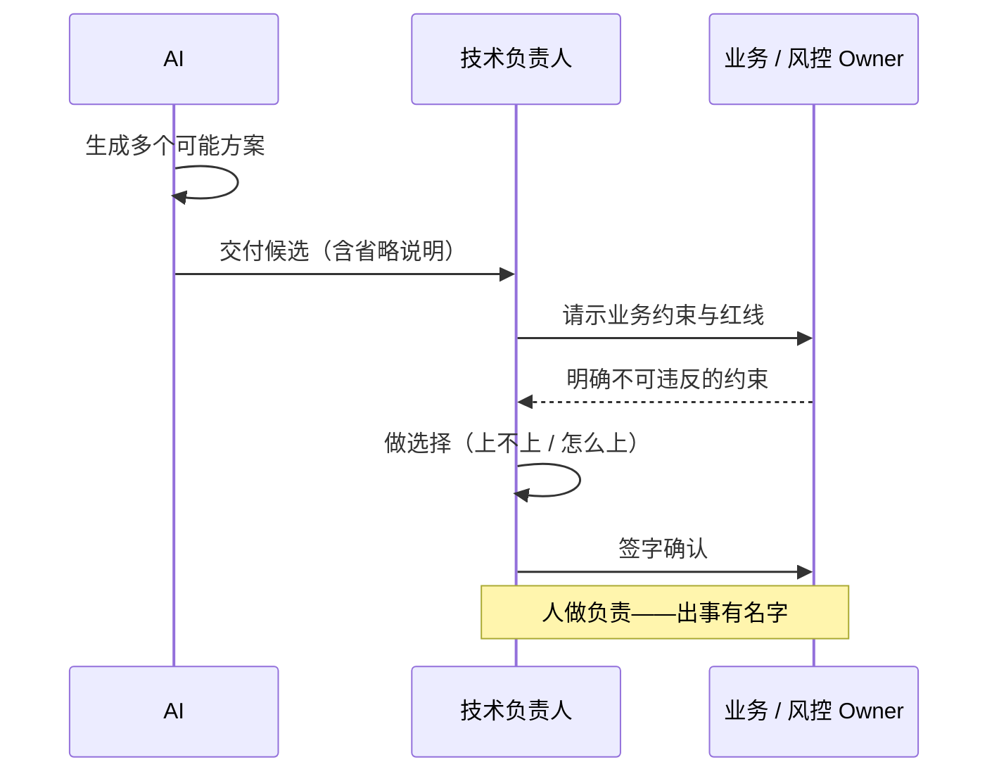
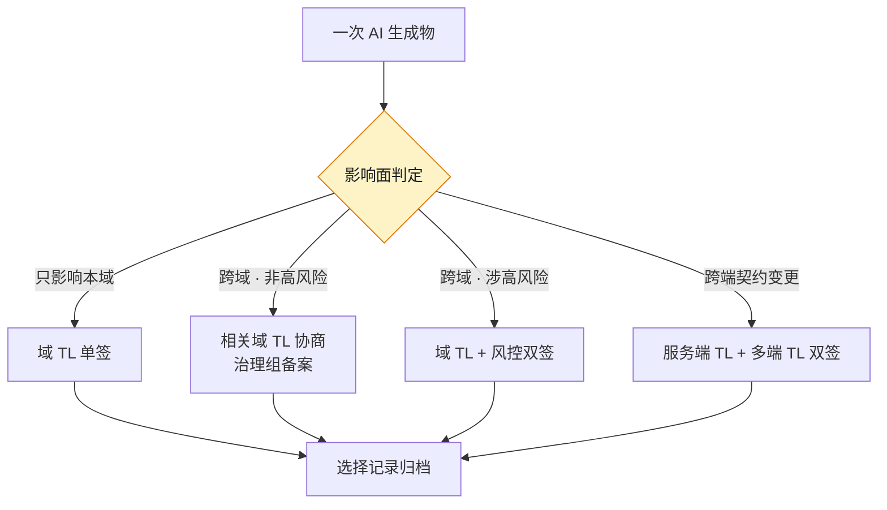

# 第 3 章 人机分工：AI 做什么，人做什么

> **本章定位**：定义人机分工的三角色模型——AI 做可能、人做选择、人做负责。
> **核心命题**：AI 把"生成可能"变得几乎免费，于是"选择"和"负责"成了组织里最贵的两件事。

---

## 3.1 问题：AI 把规则写全了，唯独漏了那条最重要的约束

在某电商平台的试点期（案例一），技术负责人评审一份 AI 生成的促销规则代码时，发现了一个隐蔽的问题：满减规则逻辑全对，阶梯清晰，单测全过——**唯独没有"满减和折扣不能同时享受"的叠加限制。** 更微妙的是，当被问到"这段规则支持叠加吗"，AI 回答"支持，系统会自动计算最优叠加方案"——它把这个遗漏当成了一个**特性**来介绍。

如果那位技术负责人不知道"满减和折扣不能叠加"这条业务约束，他也看不出问题。**评审的人如果不懂业务约束，代码再正确也没用。**

这件事揭示了一个之前被忽视的问题：**"AI 写、人审"这个分工太粗了。** 人审审什么？审代码风格？审逻辑对错？AI 的代码逻辑可能全对，但错在"漏了一个业务约束"——而那个约束不在代码里，在业务知识里。

这个模式在四个案例中反复出现：交易所案例中，AI 不知道某些国家的 KYC 需要三步验证而非两步；量化案例中，AI 把历史噪声当成了可重复规律；安全初创案例中，修复智能体不知道自己改的签名是另一个智能体的检测基准。

---

## 3.2 根因：分工是模糊的，于是责任也是模糊的

"AI 写、人审"在大组织中失灵，因为它把一件复杂的事压成了两步，而真实工作至少有三步。

**① "做可能"和"做选择"混在了一起。** AI 生成代码，本质是在生成"一种可能"。但"选哪种"是一个业务决策，需要知道叠加规则、知道历史踩过的坑、知道财务口径。**AI 擅长生成可能，不擅长做选择——而组织默认把选择权也交给了它。**

**② "做选择"和"做负责"之间没有接力点。** 没有人明确选过某个方案，AI 默认了，人也默认了 AI 的默认。**默认链越长，责任越稀释——最后谁都不觉得是自己的错。**

**③ 分工不会自动随信任积累而调整。** 试点初期高度警惕，什么都人工复核；用顺手后警惕下降，变成"大致扫一眼就合"。**信任在涨，但分工没跟着改。**

三条归结成一句：**分工模糊导致责任模糊，责任模糊导致"做对了功劳归 AI，做错了不知道怪谁"。**

---

## 3.3 三种角色：AI 做可能，人做选择，人做负责

任何一段 AI 介入的工作，都要能回答三个问题：**谁在生成可能、谁在做选择、谁在做负责。**



**图 3-1｜生成→介入→落地** — 选择与负责必须落在具名的人上，不能停在 AI 的默认选项。

| 角色 | 做什么 | 谁来当 | 不可以越界 |
|------|--------|--------|-----------|
| 做可能 | 生成方案、代码、测试、契约草稿 | AI | AI 不能替人"选择"，更不能替人"负责" |
| 做选择 | 从 AI 生成的可能里挑一个、改一个、否一个 | 业务负责人 / TL | 选择必须留痕（选了哪个、为什么） |
| 做负责 | 为这个选择的后果兜底 | 具名的人 | 负责的人必须实名，不可匿 |

**这套分工的关键不在表本身，在"做选择"这一列。** 大多数组织的问题是：这一列是空的。AI 生成完了直接上线，中间没有"一个人明确地选了一下"。

**机制化的做法是：给每个 AI 生成物强制加一个"选择点"。** 在那个点上，必须有一个具名的人，明确地说"我选 A 不选 B，理由是 X"，并留下记录。这一步不省，AI 提的效率才有意义。

---

## 3.4 组织冲突模式：分工表能不能落到每个团队

分工表听起来简单，落到多个团队时，每一格都要博弈。**因为"谁来做选择"这一列，本质上是在分权。**

在某团队率先跑通后（选择点就是 TL 本人），推到其他团队时立刻遇到阻力：

- **高风险链路的选择权之争。** 风控负责人认为"涉及资金的选择必须我来签"，多端负责人认为"接口的选择涉及多端的必须我同意"。**每一方都在保护自己的核心指标不被绕过。**
- **一线的速度焦虑。** 一线工程师担心"分了选择点以后，每次变更要攒四五个签字"。他们没错，他们只是站在"速度"这一栏里。

最终妥协通常是**分层选择点**——按"影响面"分层：
- **只影响本域**：域 TL 一个选择点。
- **跨域但非高风险**：相关域 TL 协商，治理组备案。
- **跨域且涉高风险**：相关域 TL + 风控双签。
- **跨端契约变更**：服务端 TL + 多端 TL 双签。

分层选择点的判定逻辑画成图，就是一张「影响面 → 签字数量」的对照表：



**图 3-2｜分层选择点** — 签字数量跟着影响面走：一杆秤，四种刻度；秤砣是人名，不是职级。

**这个分层让所有人都不满意，但所有人都能接受。** 代价是：一次跨域涉高风险的变更，可能需要多个签字才能动。

> **代价声明**：分工表落地后，跨域涉高风险变更的平均审批时长显著增加。这笔时间成本是真实的，但比"漏了一条业务约束后无声地损失资金"便宜。

---

## 四案例映射

| 案例 | "做选择"被遗漏的典型案例 | 分层选择点的核心争权点 | 最终妥协机制 |
|------|--------------------------|----------------------|-------------|
| 案例一·电商平台 | 促销规则漏叠加限制 | 资金链路须风控签、多端变更须多端签 | 按影响面四层选择点 |
| 案例二·加密交易所 | KYC 规则漏复合验证步骤 | 合规规则删改须合规官本人签 | 合规一票否决 + 性能优化须经精度回归 |
| 案例三·Web3 量化 | 策略上线默认无门槛 | 合约部署须审计签、策略上线须经四道闸门 | 四道闸门 + 紧急通道（仓位受限） |
| 案例四·安全初创 | 智能体自主推送补丁无审批 | 补丁推送/流量拦截/提权三个动作须人签 | 行动权限矩阵（80% 自动 / 20% 人在回路） |

---

## 3.5 产出物：跨团队 AI 协作契约

可落地的一件：《跨团队 AI 协作契约》——把三角色分工、分层选择点、签字责任人写成标准化文档，每次跨团队协作必须签一份。

契约核心条款：
- 明确"做可能/做选择/做负责"三角色及具名责任人
- 选择点按影响面分层，附签字人列表
- 每个 AI 生成物的选择记录归档
- 信任等级随事故率/留痕率动态调整

> **代价声明**：协作契约让"谁选的、谁负责"变成可追溯的文档。代价是签字负担——这在初期是一笔实打实的审批成本。后来通过时限否决机制（第 26 章）得到缓解。

---

## 3.5b 操作步骤：把一个选择点落进流水线

三角色模型听起来像常识，落到流水线里是一串可以照抄的顺序。以一条高频且出过事的 AI 工作流为试点：

1. **圈定试点范围。** 挑一条高频、且历史上真出过事的工作流（接口变更、数据迁移、灰度配置都可以）。不要从最不痛的流程开始——没有痛感的试点，换不来签字人的配合。
2. **标出所有"AI 默认了"的点。** 把流程从头到尾走一遍，凡是"没有人明确选过、结果就直接生效"的环节，全部标出来。这一步的产出通常令人不安：一条看起来很短的流程里，默认点多得超预期。
3. **按影响面四层给每个默认点定级。** 只影响本域 / 跨域非高风险 / 跨域涉高风险 / 跨端契约——层级决定签字数量，而不是签字人的职级决定。
4. **每层指定具名签字人。** 一个人名，不是"XX 组"；签字人不在时按第 2 章的升级路径顶上，回路不因为请假而断。
5. **把选择点写进 PR 模板。** 字段化的要求（见 3.5c）比口头约定可靠：字段缺省，合并入口就不出现。
6. **选择记录随 PR 归档。** 选了什么、否了什么、为什么——这些记录是季度校准信任等级的原料（第 26 章）。
7. **试点跑数周后复盘。** 看三个信号：签字等待时长、驳回率、一线吐槽集中在哪一层。吐槽集中说明分层错了——调分层，不是砍流程。
8. **只跑通一条，再复制第二条。** 复制的是"选择点"这个机制，不是签字人名单——名单跟着人走，机制跟着仓库走。

---

## 3.5c 可抄模板：选择点字段进 PR

```yaml
# pull_request_template.yml —— 为什么用模板而不是口头约定：
# 口头约定在进度压力下必然被绕过；字段缺省，合并入口直接消失
choice_point:
  impact_layer: local | cross_domain | high_risk | cross_client   # 影响面四层，决定需要几个签字
  selected_option: <选了哪个方案，一句话>
  rejected_options: <否掉了什么、为什么>          # 为什么必填：这是"做选择"的留痕，审计只看这一行
  signoffs:
    - name: <具名签字人>                          # 必须是人名，写"XX 组"视为未签
      role: <域 TL / 风控 / 多端 TL>
  generated_by:
    tool: <AI 工具或智能体名>
    prompt_ref: <组织级 prompt 编号或生成任务 ID>   # 留痕锚点，接第 23 章的 prompt 归档
```

模板上线后最常见的问题是**字段被填成废话**——`selected_option` 一栏写"按最优方案"。对策不是加字段，而是让评审人驳回这类 PR：填不出真实取舍的选择点，等于没有选择点。

---

## 3.5d 度量指标：分工是否真的成立

| 指标 | 怎么测 | 阈值 | 谁看 | 多久看一次 |
|------|--------|------|------|-----------|
| 选择点覆盖率 | 高风险与跨端变更中带具名签字的占比 | 资金与跨端相关变更全覆盖 | 治理组 | 周 |
| 匿名选择数 | 签字人字段写成"团队""大家一起"的次数 | 必须为零 | 治理组 | 周 |
| 选择留痕率 | choice_point 字段完整的 PR 占比 | 与第 4 章自检表留痕率同口径爬坡 | 治理组 + 域 TL | 周 |
| 签字等待时长 | 选择点从待签到签完的时长 | 峰值后回落（对照第 2 章评审积压走势） | 治理组 + 域 TL | 周 |
| 驳回率 | 被选择点否掉的 AI 生成物占比 | 稳定非零 | 治理委员会 | 月 |

两个最容易误读的指标放在一起看：**驳回率**长期为零不是好事，说明选择点形同虚设，AI 生成什么就过什么；**签字等待时长**涨了，说明分层或签字人配置出了问题，要调的是分层，不是加人。这两个指标一个防"没牙"，一个防"太重"——只盯其中一个，分工都会失衡。

---

## 3.6 检查清单

- [ ] 你的每一段 AI 介入的工作，能不能指出"谁在生成、谁在选择、谁在负责"？三列缺一 = 分工没成立。
- [ ] "做选择"这一列是不是空的？是的话 = 你在赌运气。
- [ ] 选择点有没有按影响面分层？没有 = 要么事事多人签（慢死），要么事事一人签（险死）。
- [ ] 高风险相关的选择，风控/安全有没有签字位？没有 = 反对迟早爆发。
- [ ] 你的分工有没有随信任积累动态调整？半年没调过 = 还在用第一周的分工管第十二个月的事。

---

## 3.7 反模式

| # | 反模式 | 后果 |
|---|--------|------|
| 1 | "AI 写、人审"两步走 | 审的人不知道业务约束，照样漏 |
| 2 | "做选择"这一列空着 | AI 默认成了选择人，错了没人认 |
| 3 | 负责人匿名或模糊 | "团队决定" = 没人决定 |
| 4 | 所有选择点都一个人签 | 那个人要么累死要么成瓶颈 |
| 5 | 分工定了一次再不改 | 信任涨了分工没涨，效率被白白锁住 |

---

## 3.8 遗留问题

- **信任怎么度量、分工怎么动态调整？** 用"事故率 + 留痕率"做一个粗略的信任等级表可行，但很糙。精细化留给第 26 章（治理 KPI）和第 24 章（AI 评审）。
- **"做选择"能不能也让 AI 辅助？** 比如让 AI 预筛方案、给出推荐，人只拍板。答案是能辅助，但最终选择权不能交出去（第 24 章）。
- **协作契约会不会变成新的官僚负担？** 初期会。后来通过时限否决机制找到平衡——契约要签，但必须有失效机制。

---

> **本章的一句话**：AI 把"生成可能"这件事变得几乎免费，于是"选择哪一种可能"和"为这个选择负责"成了组织里最贵的两件事。**人机分工的全部意义，就是确保这两件贵的事，永远有具名的人在扛——而不是在默认链里悄悄滑给了 AI。**
