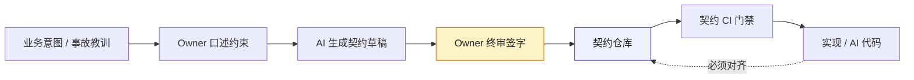

# 第 9 章 契约先行：OpenAPI、Protobuf、设计令牌

> **本章定位**：契约治理章。回答"谁为接口契约负责"这一组织问题，给出"具名 Owner + 签字权分离 + 变更分级"的机制化答案。
> **核心命题**：契约先行的第一步不是建仓库，是逼着每个域交出一个具名的责任人；AI 可以加速生成契约，但契约对不对只能由人审核。

> **本章回答第 2 章遗留问题**：介入点矩阵里"契约 Owner 谁当、风控签字人谁当"——本章给出逐域确定责任人的全过程。

---

## 9.1 问题：一次接口事故之后，去找每个域要"契约 Owner"，没人认

在一次典型的接口事故之后的第二天，治理组拿着一份名单去找各个业务域，名单上只有一栏需要填：**"你们域的契约 Owner 是谁？"**

没有一个域当场填出来。

最常见的回答是："契约？我们域有 OpenAPI 文件，在仓库的 docs 里，谁写的不知道，现在谁维护也不知道。"有些域甚至连 OpenAPI 都没有，接口定义散在代码的注释和协作文档里。

这件事说明，那次接口事故的根子不是 AI 改错了接口，而是**全平台没有一个"契约的责任人"**。没有责任人，契约就成了无人维护的遗产——AI 改了实现没人更新契约，端上拿了旧契约去对接，不炸才怪。

后来治理组做的第一件大事，不是建契约仓库，是**逼着每个域报上一个契约 Owner 的名字**。这一步比建仓库难十倍，因为它不是技术问题，是权力问题——**谁当了 Owner，谁就要对这块契约负责，谁就有了变更签字权**。

---

## 9.2 根因：契约是孤儿，因为从来没人需要为它负责

为什么一个组织里会没有契约 Owner？因为在多数公司的激励结构里，**维护契约不产生任何可见的产出，于是没有人有动机去当这个 Owner**。

**① 维护契约是纯成本。** 写代码有提交量，发版有上线数，维护契约呢？什么都不算。所以没人抢着当 Owner。

**② 契约的影响是滞后的。** 契约没维护好，不会立刻出事——直到有一天 AI 改了实现、端上炸了，才知道契约早就漂了。**滞后的问题永远激励不足，因为它不进当前的 KPI。**

**③ 跨域契约没有"共同的老板"。** 某个核心域的接口被多个端共用，契约 Owner 该归这个域还是归多端？两边都觉得不是自己的事。**没有共同的老板，就没有共同的契约。**

三条根因，一句话：**契约失灵不是技术疏忽，是组织从未把"契约"提升到需要有人负责的地位。** 解决方案不是更好的工具，是给契约配上一个具名的人。

---

## 9.3 AI 用法：用 AI 生成契约，人审核契约

契约先行这件事，AI 反而是最好的加速器——前提是**人生成 → AI 加速 → 人审核**这个顺序不能颠倒。

**图 9-1｜契约先行流水线** — AI 加速草稿，签字权在人；实现对不上契约仓库就合不了。

**AI 在契约环节能做的：**
- 从一段接口描述生成 OpenAPI / Protobuf 初版（试点期部分域 70% 契约草稿是 AI 生成的）
- 从已有代码反推契约骨架（考古场景，配合第 7 章）
- 检测契约与实现的差异（辅助，不替代人工确认）

**AI 不能做的：**
- **判断契约对不对。** 它生成的契约经常漏错误码、把破坏性字段标成兼容——这正是各类接口事故的种子。审核必须人做。
- **决定契约的语义。** "这个字段是金额还是数量"，AI 猜得出来但不敢信，必须业务确认。

成熟实践定下一条规矩：**AI 生成的契约，必须在合并前经过契约 Owner 的显式审核**——不是"看一眼"，是在 PR 里明确回复"我审过了"。没有这句回复，PR 不能合并。

---

## 9.4 角色博弈：契约 Owner 和签字权的两周拉锯

找各个域要 Owner 名单，花了整整两周。最难的不是没人愿意当，是**签字权归属谈不拢**。

**冲突一 · 涉资金域的契约 Owner。** 业务域 TL 说当然归他。风控负责人当场反对："这个域涉资金，契约变更必须我签字，那 Owner 凭什么不是我？" 两人僵了一下午。

**最后方案**：Owner 归业务域 TL（他负责日常维护），但**资金相关字段的变更，Owner 提议后必须风控负责人会签**——所有权和签字权分离。代价：业务域 TL 觉得自己只是个"管家"，风控负责人觉得自己的签字权被稀释成了"会签"。**两边都不满，但都能接受。**

**冲突二 · 多端共享契约 Owner。** 某个被多端共用的接口，服务端 TL 和多端负责人都想要签字权。多端负责人的话很直接："这个接口改一次，我多个端要发版，签字权不给我，我睡不好觉。"

**最后方案**：日常维护归服务端 TL，**破坏性变更必须多端负责人签字**（这条后来在第 27 章升级成了正式的"破坏性契约变更签字权"）。代价：服务端 TL 失去了破坏性变更的单方面决定权。

**冲突三 · 没有 Owner 的孤儿契约。** 有几个域实在没人愿意当 Owner——维护成本高、看不出绩效。最后治理组自己接了这些域的契约 Owner，代价是治理组的工作量直接翻倍。

> **两周拉锯的结果**：各域大多有了具名 Owner（含治理组代管的若干个），少数挂"待定"持续跟进。**这些名字，就是契约先行在全平台落地的起点。** 没有这些名字，建再好的契约仓库也没人维护。

---

## 9.5 产出物：契约治理规范 + 变更流程（指向附录 I）

本章的产出物已在附录 I（`21-契约治理规范模板.md`）中完整给出模板。核心要点：

- **双源契约**：OpenAPI（HTTP）+ Protobuf（RPC）
- **契约仓库唯一**，代码追契约
- **契约变更分级**：兼容性 / 破坏性
- **破坏性变更须签字**：多端签字归多端负责人，资金签字归风控负责人，时限 2 个工作日
- **每个契约一个具名 Owner**

> **代价声明**：契约治理规范上线后，新接口从"写代码"到"可对接"的平均时长从 0.5 天涨到 1.2 天——因为要先写契约、等人审。这笔时间成本写进了数字清单。一线工程师会抱怨："以前我接口写完就能用，现在我还得等一个人审我的契约。"——这话没错，但实践表明，**等一个人审，比炸了之后等回滚便宜。**

---

### 四案例映射

本章"契约先行"机制在四个案例中的具体落地形态：

| 案例 | 契约形态 | Owner 归属 | 破坏性变更签字权 |
|------|---------|-----------|----------------|
| 案例一·电商平台 | 多端共享契约（商品详情等接口被多端共用） | 业务域 TL | 多端负责人签字 |
| 案例二·加密交易所 | 涉资金交易契约（OpenAPI + Protobuf 双源） | 交易域 TL | 风控负责人会签 |
| 案例三·Web3量化 | 策略/数据源契约（行情、信号、下单接口） | 量化团队负责人 | 量化 + 风控双签 |
| 案例四·安全初创 | 安全合规契约（审计、权限、日志接口） | 安全团队负责人 | 合规负责人会签 |

---

## 9.6 检查清单

- [ ] 你的每个接口契约，能不能当场说出一个具名的 Owner？说不出 = 契约是孤儿。
- [ ] Owner 和签字权有没有分离？资金相关的契约，风控有没有签字位？
- [ ] 破坏性契约变更，有没有一个"离端最近的人"持有签字权？
- [ ] 契约是先于代码写的，还是代码写完后补的文档？后者 = 不是契约先行。
- [ ] AI 生成的契约，有没有强制经过人的显式审核？没有 = 接口事故的种子已埋下。

---

## 9.7 反模式

| # | 反模式 | 后果 |
|---|--------|------|
| 1 | 契约无 Owner | 漂移无人维护，端上迟早炸 |
| 2 | Owner 包揽所有签字权 | 跨域涉资金时该签字的人被绕过 |
| 3 | 先写代码后补契约 | 契约沦为代码的注释，一定过期 |
| 4 | AI 生成契约不经人审 | 漏错误码、误标兼容性 |
| 5 | 所有变更都需全员签 | 签字链太长，治理被拖垮 |

---

## 9.8 遗留问题

- **契约仓库本身怎么治理？** 契约成了事实来源，那契约仓库的权限、版本、Owner 更替，就成了新的治理对象。治理会无限套娃——这条留给读者和第 25 章。
- **破坏性变更的分级判定能不能自动化？** 现在是契约 Owner 人工判。AI 辅助判定的准确率够不够？留给第 24 章。
- **老版本 App 的契约兼容怎么办？** 契约变了，线上老版本还在用旧契约。这是第 17 章（多端 BFF）要回答的。

---

> **本章的一句话**：契约先行的第一步不是建仓库，是**逼着每个域交出一个具名的责任人**。工具可以买，仓库可以建，但"谁为这份契约负责"这个问题，永远只能由人来回答。**没有 Owner 的契约，就像没有房东的房子——住着住着就塌了，塌了还找不到人修。**
