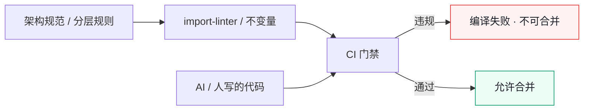

# 第 10 章 把边界变成测试：import-linter 与分层不变量

> **本章定位**：架构边界章。回答"规范为何挡不住代码"这一问题，给出"把架构规范翻译成不变量测试、接入 CI、违规即编译失败"的机制化答案。
> **核心命题**：架构边界不是画出来的，是测出来的；与其告诉 AI "请遵守架构规范"，不如让架构违规变成 AI 能读的编译错误。

> **本章回答第 11 章遗留问题**："该不该留缝"能否做成自动化扩展点检查清单——本章给出"架构不变量测试"这一机制化答案。



**图 10-1｜边界测试门禁** — 规范挡不住进度压力；必须让违规在 CI 变红。

---

## 10.1 问题：架构规范发了三个月，违规还在悄悄涨

架构规范发布之后，团队本预期至少新代码会好一些。可在规范发布三个月后抽查某业务域的新提交，架构违规率还有 12%。

有一条提交很有代表性。一线工程师在应用层写了一段直接查数据库的代码——绕过了服务层。被叫来问时，他很坦白："我知道规范说不能这么写，但服务层那个接口不支持我要的字段，我懒得等人加，直接查库省事。"然后补了一句："**而且规范又不会编译报错，我这么写了照样能跑。**"

他说到了点子上。**规范是文件，文件挡不住代码。** 真正能挡住代码的，只有另一段代码——一段让你编译不过、测试不过、合并不了的代码。

于是治理组的架构师做了一件事：**把架构规范翻译成 import-linter 规则，接入 CI，违规即编译失败。** 一周后上线，首周就在试点域拦下了 47 处违规。

---

## 10.2 根因：人类自律 vs 机器拦截，差着一个量级

为什么"发了规范"不等于"守了规范"？

**① 自律是有波动的，机制是恒定的。** 一线工程师不忙的时候会遵守规范，赶需求的时候就忘了。但 CI 不会因为赶需求就放行——**它不在乎你急不急，它只在乎你违规没违规。**

**② 规范是事后追溯，拦截是事前预防。** 等治理组抽查发现违规，代码已经合并了。而 import-linter 在 PR 阶段就拦住，违规根本进不了仓库。**事后追溯的成本是整改，事前预防的成本只是改一行。**

**③ AI 没有规范意识，但能理解编译错误。** 跟 AI 说"请遵守架构规范"，它答应了然后照样违规。但让它生成的代码过一次 import-linter，它编译失败了，在提示词里附上错误信息，它就会修正。**AI 不懂规范，但它懂报错。**

---

## 10.3 AI 用法：让 AI 在不变量的围栏里生成

这一节的核心认知：**与其告诉 AI "请遵守架构规范"（它做不到），不如让 AI 生成的代码自动经过不变量测试，失败了就把错误信息喂回给它（它能做到）。**

工作流是这样的：

```
1. AI 生成代码
2. 代码经过 import-linter + 架构不变量测试
3. 若失败 → 错误信息自动附加到下一轮提示词
4. AI 根据报错修正
5. 循环直到通过
```

这个闭环的好处：**不需要教会 AI 架构，只需要让架构违规变成 AI 能读的错误信息。** 这比写一万字的"架构指南"塞进提示词有效得多。

同理，第 11 章问的"该不该留缝能不能自动化"，这里给出半个答案：**扩展点的检查，可以被翻译成一种不变量——"资金链路的模块必须暴露风控钩子接口"，用测试来判定有没有留。** 有钩子位就过，没有就拦。这样"留缝"就从"某个人的判断"变成了"一道编译期的检查"。

当然，不是所有缝都能自动化判定——"这个模块未来可能需要扩展到什么程度"仍然需要人判断。**自动化能保证的是"必须留的底线缝"（如风控钩子），不能保证的是"最好留的弹性缝"。** 后者还是人的活。

---

## 10.4 角色博弈：拦下别人的代码，等于挡别人的需求

import-linter 上线第一周，47 处违规被拦。一线工程师的怒气直接冲到治理组办公室。

"你们的 linter 把我三条 PR 全挡了。我这周五要上线，你让我怎么办？"

这种愤怒是合理的——**对一线工程师来说，被拦下的不是"违规"，是"需求"。** 挡了他的 PR，就是挡了他的交付，就是动了他的 KPI。

最后各方谈了一个过渡方案：**违规分两类——硬违规（跨层依赖、循环依赖）必须当场修复，没有例外；软违规（命名规范、层的内部结构）给两周过渡期。** 被拦的三条 PR 里有一条是硬违规，当晚改了；另两条是软违规，给了过渡期。

**这个分级让 import-linter 没有被一线联手推翻。** 如果一开始就把所有违规都设成"编译不过"，一线会联合抵制，工具推不下去。分级后，硬违规铁腕、软违规弹性，**治理组让出了软违规的执法权，换来硬违规的零容忍被接受。**

> **代价声明**：import-linter 接入后，试点域的 PR 平均合并时长增加了 18 分钟（因为要等 linter 跑完、有时要修正）。这笔时间进入了开发流程的固定成本。**但没有这 18 分钟，跨层依赖式的违规就会继续悄悄进仓库。**

---

## 10.5 产出物：组织级不变量清单

可落地的一份清单，每条不变量对应一条 import-linter 规则或测试：

| 不变量 | 判定方式 | 级别 | 责任人 |
|--------|---------|------|--------|
| 依赖单向（应用→服务→包） | import-linter | 硬违规 | 架构组 |
| 跨域只走服务层对外接口 | import-linter | 硬违规 | 各域 TL |
| 资金链路模块暴露风控钩子 | 接口存在性测试 | 硬违规 | 风控 + 域 TL |
| 无循环依赖 | 依赖图分析 | 硬违规 | 架构组 |
| 契约与实现一致 | 契约测试 | 硬违规 | 契约 Owner |
| 层内模块结构合规 | import-linter（软） | 软违规 | 域 TL |

> **代价声明**：这份清单维护本身需要人——架构组每周花半天审查"新增的不变量需求"，因为每发现一种新的违规模式，就要加一条新规则。**不变量清单是活的，它会一直长。**

---

### 四案例映射

本章"把边界变成测试"机制在四个案例中的具体落地形态：

| 案例 | 核心不变量 | 判定方式 | 硬/软违规 |
|------|-----------|---------|----------|
| 案例一·电商平台 | 依赖单向、跨域只走服务层对外接口 | import-linter 接入 CI | 硬违规 |
| 案例二·加密交易所 | 资金链路模块必须暴露风控钩子、无循环依赖 | 接口存在性测试 + 依赖图分析 | 硬违规 |
| 案例三·Web3量化 | 策略模块依赖单向、数据源只走适配层 | import-linter + 适配层测试 | 硬违规 |
| 案例四·安全初创 | 安全边界编译期拦截、敏感模块禁直接入库 | import-linter + 权限不变量测试 | 硬违规 |

---

## 10.6 检查清单

- [ ] 你的架构规范，有没有翻译成 import-linter 规则或测试？没有 = 规范是壁纸。
- [ ] 违规是硬拦截（编译不过）还是软提醒？只软不硬 = 等于没有。
- [ ] 你有没有区分硬违规和软违规？全硬 = 一线会联手抵制；全软 = 形同虚设。
- [ ] AI 生成的代码，有没有自动经过不变量测试、失败了喂回错误信息？没有 = AI 在盲目违规。
- [ ] 你的不变量清单有没有在持续增长？不长 = 你没在发现新的违规模式。

---

## 10.7 反模式

| # | 反模式 | 后果 |
|---|--------|------|
| 1 | 规范只发文不接 CI | "能跑就行"式违规横行 |
| 2 | 所有违规一律硬拦 | 一线抵制，工具推不下去 |
| 3 | 所有违规一律软提醒 | 形同虚设 |
| 4 | AI 不经过不变量测试 | 违规被规模化放大 |
| 5 | 不变量清单定了一次不动 | 新违规模式没人发现 |

---

## 10.8 遗留问题

- **扩展点检查能自动化到什么程度？** 本章给了"底线缝可测，弹性缝要人判"的答案。但"弹性缝"能不能也部分自动化？比如用 AI 分析一个模块的变更历史，推断"它未来大概率要扩展的方向"？这个尝试留给第 24 章。
- **契约测试和架构不变量测试，谁先跑？** 两者都在 CI 里，跑的顺序影响反馈速度。经验是契约测试先（它拦的是最危险的多端不一致），架构不变量后。这条规则留给各域 CI 配置参考。
- **不变量清单会不会变得太重？** 清单越长，CI 越慢，一线越不满。这个问题没有完美解，只有权衡——**每加一条不变量，要问"它拦住的违规值不值这些 CI 时间"。**

---

> **本章的一句话**：架构边界不是画出来的，是测出来的。**当你把"依赖单向"变成了一条 import-linter 规则，它才从一张壁纸变成了一道墙。** AI 让代码生成变容易了，于是边界检测也必须从"事后抽查"升级成"事前编译拦截"——否则你放进来多少代码，就放进来多少违规。
