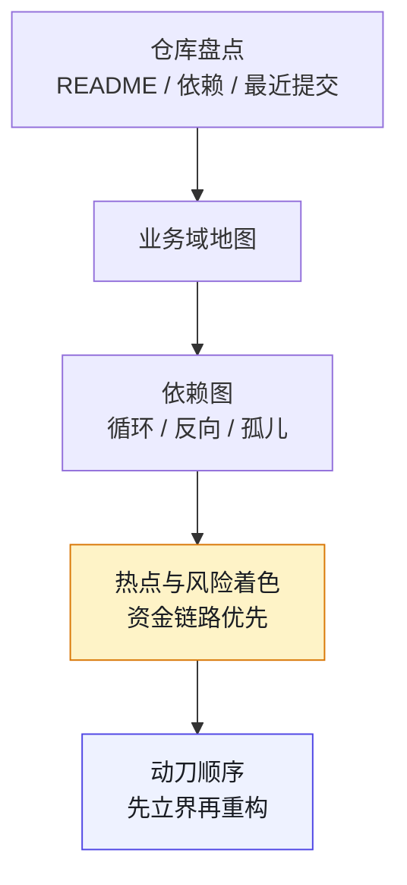

# 第 5 章 大规模遗留系统考古：200+ 仓库怎么画图

> **本章定位**：接手任何大型系统的第一步——不写代码，先画图。
> **核心命题**：治理一个你看不见的系统，和蒙着眼睛开车没有区别。

**图 5-1｜考古四步** — 治理看不见的系统等于蒙眼开车；第一周不写代码只画图。

---

## 5.1 问题：数百个仓库，没有一张全景图

当治理团队被要求"管好全平台的 AI 工程"时，面临的第一个问题不是"怎么管"，而是"全平台到底有什么"。在某电商平台案例中（案例一），214 个仓库、327 个微服务、12 个业务域——但这些数字之间的关系，没有任何一张图能说清楚。

治理团队做的第一个决定是：**接下来一周，谁都不许写代码，不许推方案，先画图。**

他们将所有仓库的 README、依赖配置、最近提交日期、一句话描述扒进了一张表格。**结果是触目惊心的：数十个仓库的 README 是空的，数十个仓库一年以上没人提交。** 这些数字第一次让"考古债"有了实感——这不是"代码不够好"的问题，是"组织根本不知道自己有什么"的问题。

这个困境在不同规模的组织中以不同形态出现：交易所案例中，上千名工程师维护着跨六大事业部的系统，模块边界模糊；量化案例中，策略合约散落在六条链上，版本关系不清；安全初创案例中，七个智能体的职责边界和交互关系没有被显式定义——虽然规模不同，但"不知道自己有什么"是共同的起点。

---

## 5.2 根因：组织只往前赶，从不回头看

为什么大量仓库没有一张全景图？因为大多数组织的发展方式和这些同龄公司一样：**只往前赶，从不回头看。**

**① 每个团队只看自己那块。** 各团队知道自己的仓库，但没人有义务知道"全平台长什么样"。**跨域的地图，不属于任何人的 KPI，于是它不存在。**

**② 仓库的增长是自发的、无规划的。** 每次有人觉得"这个模块该独立出来"，就新建一个仓库。多年下来，没有一个统一命名规范，有些连域归属都没标。**它们像野草一样长出来，从来没有人除草。**

**③ 知识在人脑里，人走了知识就没了。** 那些"一年没人提交"的仓库，它们的主人大多已经离职或转岗。**仓库还在跑，但没人知道它在干什么、能不能动、能不能删。**

---

## 5.3 AI 用法：AI 加速数据收集，但图必须人画

考古这件事，AI 能帮很多忙，但有一条红线：**AI 加速的是数据收集，不是判断。**

**AI 能做的：**
- 从仓库的文件结构、依赖配置、提交历史里，自动提取"这个仓库大概是干什么的"
- 将原始表格按业务域做初步分组
- 标注每个仓库的活跃度（最近提交时间、提交频率）

**AI 不能做的：**
- **裁定一个仓库到底属于哪个域。** 这是组织知识，不在代码里。
- **判断一个"看起来没人维护"的仓库能不能删。** 它可能正在被某个关键服务默默调用。

在电商平台案例中，AI 的初步分组把所有仓库归进了各业务域——**但有数十个仓库被归错了或硬塞了。** AI 把不确定的仓库塞进了"看起来最接近"的域，让结果"看起来整齐"。治理团队逐个审核了这些归类，纠正了一部分，确认了一部分，剩下标为"待定"。

> **这条教训是提示词工程的重要经验：AI 的天性是让结果好看，考古的要求是让结果真实。这两个目标冲突时，必须人介入。** 正确的提示词应该要求"对归属不确定的，单列'待定'并说明原因，不要擅自归并"。

---

## 5.4 组织冲突模式：画图要各团队配合，各团队说"没空"

考古的第二步是画四张图——模块图、依赖图、数据流图、部署图。这需要各团队配合提供信息。**通常没有一个团队主动配合。**

各团队的态度一致："画图是治理团队的事，我们忙着交付需求，没空。"

最终解决的方式在各案例中不同：电商平台案例中靠的是 CTO 的行政命令（"各团队须配合在两周内完成模块信息确认"）；交易所案例中靠的是风控总监推动的全系统盘点行政令。**共同点是：跨团队的考古，没有最高决策层的背书，推不动。**

即便如此，仍会有团队拖到最后才交信息，交得粗糙。治理团队只能自己补，多花数周。

---

## 5.5 产出物：全平台模块地图（四张图）

四张图用 Mermaid 或同类工具画，源码入库：

1. **模块图**：所有模块按业务域分组，标注活跃度与 Owner
2. **依赖图**：所有服务的调用关系（第 6 章深入）
3. **数据流图**：核心业务的数据流向
4. **部署图**：多机房部署与多活拓扑（第 18 章深入）

盘点表最小字段（可直接进 CSV / 表格工具）：

| 字段 | 说明 | 谁填 |
|---|---|---|
| repo / service | 仓库或服务名 | 自动抓取 |
| domain | 业务域 | AI 草稿 + 人裁定 |
| owner | 具名负责人 | 各域 TL |
| last_commit | 最近有意义提交 | 自动 |
| money_path | 是否在资金/合规链路 | 风控/合规 |
| ai_touchable | 可碰 / 需审批 / 不可碰 | 治理组 + 域 TL |
| notes | 循环依赖、孤儿、历史事故 | 人 |

> **代价声明**：画这四张图，治理团队通常需要数周，加上各团队配合的时间成本。**一张全平台地图的成本约为数十人天。** 但没有它，后面所有的架构治理、契约治理、灰度治理都无从谈起——你治理不了一个你看不见的东西。

---

## 四案例映射

| 案例 | 系统盘点规模 | AI 分组中的典型硬塞错误 | 考古地图的核心用途 |
|------|-------------|----------------------|-------------------|
| 案例一·电商平台 | 214 仓库 / 327 服务 | 不确定仓库被塞入最近域 | 为后续架构/契约/灰度治理提供基础 |
| 案例二·加密交易所 | 6 大事业部 / 千人团队 | 跨事业部模块归属模糊 | 为精度回归测试和降级通道定位关键路径 |
| 案例三·Web3 量化 | 47 策略 / 23 合约 / 6 链 | 链上合约版本关系不清 | 为合约审计和安全不变量检查提供全景 |
| 案例四·安全初创 | 7 智能体 / 10 人团队 | 智能体间依赖关系未显式定义 | 为 Agent 间契约和权限矩阵提供基础 |

---

## 5.6 检查清单

- [ ] 你有没有一张全平台的模块地图？没有 = 你不知道自己在治理什么。
- [ ] 你的地图是按业务域分的，还是按仓库分的？按仓库 = 没人看得懂。
- [ ] 地图上有没有标注每个模块的活跃度和 Owner？没有 = 孤儿模块藏在里面你看不见。
- [ ] AI 辅助分组时，你有没有人工审核"不确定"的归类？没有 = AI 硬塞的错误被你当成事实。
- [ ] 地图有没有更新机制？没有 = 三个月后它就过期了。

---

## 5.7 反模式

| # | 反模式 | 后果 |
|---|--------|------|
| 1 | 不画图就开始治理 | 盲人摸象，改了东墙塌西墙 |
| 2 | 按仓库分而不是按业务域分 | 图有了，但没人看得懂 |
| 3 | AI 分组不经人审 | 归类错误被当事实传播 |
| 4 | 地图画完就不管了 | 三个月过期 |
| 5 | 各域不出人就硬推 | 数据粗糙，图不可信 |

---

## 5.8 遗留问题

- **依赖图里藏着什么？** 模块图画完了，但模块之间的依赖关系（谁调谁、有没有循环）还没分析。这是第 6 章的核心。
- **那些"没人维护"的仓库怎么办？** 一年无提交的仓库，删了怕炸，不删占地方。第 6 章的 WIRED/NOT WIRED 分析会给初步答案。
- **隐性知识怎么留住？** 那些 Owner 已离职的仓库，知识随人走了。第 7 章（AI 读懂祖传代码）会用 AI 辅助补写考古笔记。

---

> **本章的一句话**：治理一个你看不见的系统，和蒙着眼睛开车没有区别。**画图不是为了好看，是为了让你在动任何一行代码之前，知道自己动的是什么、连着什么、谁在依赖它。** AI 让画图变快了，但"这个模块到底属于谁"这种判断，永远得人来下。
