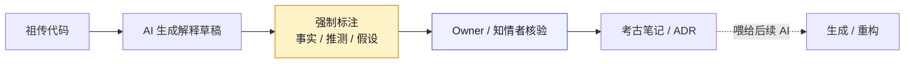

# 第 7 章 用 AI 读懂没人看得懂的项目

> **本章定位**：在第 5-6 章地图和依赖分析基础上，用 AI 辅助考古"无人理解的祖传代码"——补写考古笔记、显性化隐性知识。
> **核心命题**：代码可以靠 AI 写出来，但"这段代码为什么存在"只能靠人来解释。

**图 7-1｜考古三步** — AI 能写解释草稿，不能把推测写成确定；人核验后才进组织知识。

---

## 7.1 问题：数十个仓库的 Owner 都不在了，代码还在跑

在第 6 章做完依赖分析后，有一个问题一直悬着：**那些一年以上没人提交的仓库，它们的代码还在生产环境跑着，但没人知道它们在干什么。**

在某电商平台案例中（案例一），有一个特别令人不安的例子：一个支付对账链路上的辅助服务——对账数据从主库读出来后，会经过这个服务做一次"清洗"。打开它的代码，上千行 Python，没有任何文档，函数名是 `process`、`handle`、`run` 这种万能名。支付域的技术负责人说："这个服务是一位老同事写的，他两年前离职了。我知道它在对账链路上，但具体在清洗什么，我也不清楚。"

**这是一个跑在资金链路上的服务，全公司没有一个人能解释它在干什么。** 如果 AI 重构时不小心改坏了它，后果不堪设想——因为这个服务连"它本来应该做什么"都没人说清楚。

这就是"祖传代码"最可怕的地方：不是代码烂，是**知识断了**。这个困境在量化基金案例中同样严重——23 个链上合约中，有数个合约的原始设计意图已经无人能完整解释，而它们管理着真实的资金流动。

---

## 7.2 根因：知识在人脑里，人走了知识就没了

**① 组织只奖励产出，不奖励文档。** 写完功能上线的人拿了绩效，写文档解释这个功能的人什么都没拿到。多年下来，代码堆积如山，文档寥寥无几。

**② 隐性知识从不显性化。** "这个函数为什么要延时一秒"、"这个清洗为什么要跳过第三列"——这些知识存在于某个人的直觉里，从没被写下来。那个人走了，直觉也走了。

**③ AI 来之前，至少写代码的人还留着一些记忆。** AI 来之后，新生成的代码连原作者的直觉都没有——它只是在"生成看起来对的代码"，背后没有任何人的理解在支撑。**AI 让代码增长更快，却没有让理解同步增长，于是"代码量"和"可理解量"之间的剪刀差越来越大。**

---

## 7.3 AI 用法：三种考古法——摘要、问答、重建

用 AI 考古，有三种用法，可靠性递减、信息量递增：

**① 摘要法（最可靠）。** 让 AI 读一段代码，输出"这段代码看起来在做什么"。适合快速建立整体印象。关键约束：**必须让 AI 标注"我不确定的部分"**，而不是让它给出流畅的、看似全知的总结。

**② 问答法（中等可靠）。** 针对具体问题让 AI 回答——"这个延时是干什么用的？""这个清洗为什么要跳过第三列？" AI 会基于代码模式给出推测。**推测必须标"推测"，并由人核实。**

**③ 重建法（最不可靠但信息量最大）。** 让 AI 试图"重建"这个服务的设计意图——它本来要解决什么问题、有哪些隐含约束。这一步产出最丰富，但也最容易出错，因为 AI 会用它的通用知识"脑补"出代码里不存在的意图。

在电商平台案例中，那个支付对账清洗服务三种方法都用了一遍。摘要法给出"数据格式转换"，问答法推测"跳过第三列是因为它是内部标记位"，重建法大胆猜测"可能在处理退款和正常交易的分离"。

**三个结论里，只有一个经核实是对的。** 问答法和重建法的推测看起来都很合理，但都错了——第三列其实是对账批次号，服务处理的是跨账户对冲而非退款。最终是找到了离职老同事的前同事，凭记忆确认了真实用途。**AI 给了三个看似合理的答案，人给了一个正确的答案。**

这是推断型幻觉（第 24 章定义）的典型案例：AI 面对不确定信息时，倾向于给出"看起来合理"的答案，而不是说"我不知道"。

---

## 7.4 组织冲突模式：考古要不要占交付容量

用 AI 考古这件事，治理团队想做，但各业务团队不愿意配合——**因为考古不产出功能，占的是交付时间。**

"你让我的人花几天去核实 AI 给数十个老仓库写的笔记？我这季度的需求还做不做了？"——这是普遍的态度。

最终解决通常需要最高决策层出面，定下"考古是治理团队的工作，各团队只需配合确认，配合时间受限"的规矩。**考古的成本主要由治理团队扛，各团队只出"确认"这一步。** 代价是治理团队在考古期间几乎没有精力做其他事。

> **代价声明**：数十个仓库的考古笔记，治理团队花费了大量人力天数。这些笔记不产生任何业务价值，但它们让"黑箱仓库"变成了"至少有人能解释的仓库"。**这笔投资的回报，是降低了潜在的灾难——因为考古发现其中一些仓库确实有隐患，提前修了。**

---

## 7.5 产出物：组织级考古笔记 + 隐性知识库

可落地的两件：

1. **考古笔记**：每个考古过的仓库，一份 Markdown 文档——功能描述、关键约束、已确认事实 vs. 待确认推测、当前 Owner、风险标注。
2. **隐性知识库**：所有"已确认事实"汇总成一个可搜索的知识库，新人入职或 AI 生成代码时可检索。

**隐性知识显性化是这一章最重要的产出。** 以前这些知识活在人的脑子里，人走了就没了；现在它们被写进了文档，进了版本控制，就算人走了知识还在。

> **代价声明**：隐性知识库的维护是持续的——每次有新的考古发现、每次有人核实了一个推测，都要更新。**这是一个活的资产，不是一个一次性项目。** 如果不持续投入，它会在两年后变成另一堆过期的文档。

---

## 四案例映射

| 案例 | 祖传代码的核心风险 | AI 考古推断型幻觉的典型表现 | 隐性知识显性化的核心产出 |
|------|-------------------|---------------------------|------------------------|
| 案例一·电商平台 | 资金链路上无人理解的清洗服务 | 把对冲推断为退款、把批次号推断为标记位 | 考古笔记 + 可检索隐性知识库 |
| 案例二·加密交易所 | 跨事业部遗留撮合模块 | 把精度妥协推断为"故意设计" | 合约/模块行为说明书 |
| 案例三·Web3 量化 | 设计意图已无人解释的链上合约 | 把临时方案推断为"长期架构" | 合约设计意图文档（附审计引用） |
| 案例四·安全初创 | 创始初期遗留的检测规则 | 把过时规则推断为"当前有效" | 智能体行为基准文档 |

---

## 7.6 检查清单

- [ ] 你有没有一份"有多少代码没人能解释"的清单？没有 = 你不知道自己的隐性债务有多大。
- [ ] 你的资金/核心链路上，有没有"代码在跑但没人懂"的服务？有 = 定时炸弹。
- [ ] AI 给祖传代码写的考古笔记，你有没有人工核实？没有 = AI 的推测被当成了事实。
- [ ] 你的隐性知识有没有被写下来、版本化？没有 = 下一个人离职，知识又断一次。
- [ ] 隐性知识库有没有更新机制？没有 = 两年后它又变成了另一堆祖传文档。

---

## 7.7 反模式

| # | 反模式 | 后果 |
|---|--------|------|
| 1 | 不做考古，直接动祖传代码 | 改坏了不知道、不改又不敢删 |
| 2 | 信 AI 的考古笔记不核实 | 推测被当成事实，错误传播 |
| 3 | 考古笔记写完不版本化 | 又变成一堆新的无主文档 |
| 4 | 考古只做一次不更新 | 新的隐性知识又没人记 |
| 5 | 让 AI"重建"设计意图当事实 | AI 脑补的意图被当成原始设计 |

---

## 7.8 遗留问题

- **AI 的推测能不能自动标注置信度？** 靠提示词约束 AI 说"不确定的要标推测"，但 AI 经常不标。这件事能不能更可靠？留给第 24 章（幻觉处理）。
- **隐性知识库怎么和 AI 生成代码结合？** 理想状态是 AI 生成代码时，能自动检索知识库里"这个服务的已知约束"。留给第 23 章（提示词工程）。
- **考古完了，新产生的仓库怎么办？** 考古不该是一次性运动，应该是"新仓库上线时就必须附考古笔记"。这条规则留给了第 25 章（文档治理）。

---

> **本章的一句话**：代码可以靠 AI 写出来，但"这段代码为什么存在"只能靠人来解释。**祖传代码真正的风险不在代码本身，在于理解它的人已经不在了。** AI 能帮你把"看起来在做什么"猜出来，但"它真正的隐含约束是什么"——那个能救命的答案，永远只在某个人的记忆里，而那个人随时可能离开。
