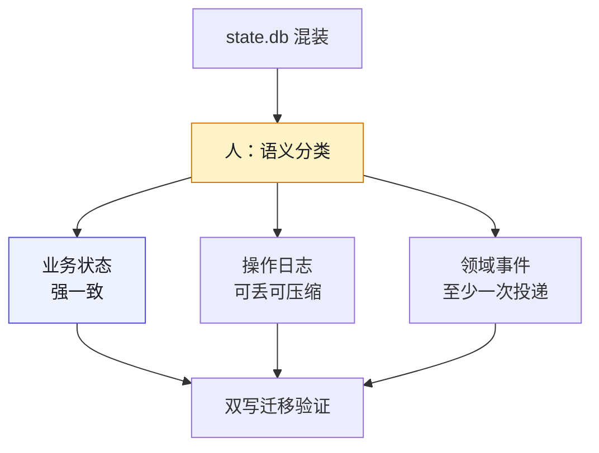
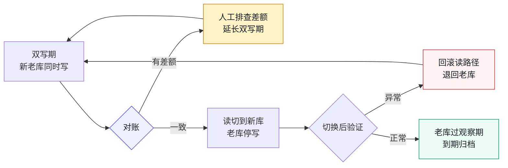

# 第 12 章 数据与日志分家：state.db 不是日志

> **本章定位**：重构进入存储层。当一个数据库里同时塞着业务数据、操作日志和领域事件，AI 能写出迁移脚本，却分不清"哪张表是状态、哪张表是流水"。本章讲人如何做语义分类、AI 如何做机械搬运，以及"双写迁移"背后的组织成本。
> **核心命题**：业务数据、操作日志、领域事件是三种生命周期、三种一致性要求的东西——把它们放进同一个存储，省的是建库那天的半天时间，赔的是三年后每次事故多排查的几个小时。

**图 12-1｜三分家** — 分类是人的语义判断；AI 做机械搬运，不能替人决定哪张表算状态。

---

## 12.1 问题：一个膨胀的 state.db，里面什么都有

业务域的重构推进到数据层时，域负责人把本域的一个 `state.db` 交出来——约 2GB 的 SQLite，里面有几十张表。

打开一看，问题一目了然。这些表里，有真正的业务状态（优惠券发放记录、活动配置），有操作日志（谁在什么时候改了什么），还有领域事件（用户领券、用券的流水）。**三种完全不同的东西，混在一个数据库里，没有任何区分。**

更典型的是一张叫 `tmp_stuff`——"临时东西"——的表，几百万行，是多年前某次促销留下的"临时"数据，之后再没人管过，却占了这个 db 近一半的空间。

域负责人问："这个 db 能不能让 AI 帮我清理一下？"

回答是："你知道这些表里，哪些是业务数据、哪些是日志、哪些是事件吗？"

得到的答案是："大概知道……但说不准。"

**这就是问题所在。** 一个数据库里混着三种生命周期完全不同的东西：业务数据要永久保存且强一致，操作日志要追加写入且可归档，领域事件要按序消费且可重放。**把它们放在同一个存储里，就像把保险箱、日记本和快递包裹扔进了同一个柜子——你想拿保险箱里的钱，却翻出了一堆过期快递。**

---

## 12.2 根因：从小做起，从来不分类

**① 数据库是"顺手建的"。** 当年业务刚起步时人少，所有数据往一个 SQLite 里塞，快、方便、能跑。随着团队和业务增长，这个 db 从几十 MB 长到了几个 GB，但分类的工作从来没做过。

**② AI 把所有表当成"数据"处理。** 让 AI 分析这些表，它给出的建议全是"加索引""优化查询"——它把操作日志表当成业务数据来优化，完全没意识到日志表根本不需要索引（它们只追加不查询）。

**③ 混合存储导致混合事故。** 业务数据的一致性问题的日志的膨胀问题纠缠在一起。state.db 膨胀后，每次写操作都变慢，写日志拖慢了写业务数据，业务数据的事务又锁住了日志表。**性能问题和一致性问题互为因果，查不清根因。**

---

## 12.3 AI 用法：AI 做迁移脚本，人做语义分类

数据迁移这件事，分工是：**人定语义分类，AI 定迁移脚本。**

**人做的（AI 替不了）：**
- 把所有表分成三类：业务数据（保留在主库）、操作日志（迁到日志存储）、领域事件（迁到事件总线/消息队列）
- 判断每张表的生命周期和一致性要求

**AI 做的：**
- 根据人的分类，生成"双写"迁移脚本（老库继续写、新库同步写）
- 生成"对账"脚本（验证新老库数据一致）
- 生成"切换"脚本（读切到新库、老库停写）

这次分类，全部表里有相当一部分是业务数据，另有较大比例是操作日志，剩下的是领域事件。**那张多年代际不清的 `tmp_stuff`，AI 建议归到"日志"然后归档删除。人审之后确认：它确实是多年前遗留的临时数据，可以删。** 删掉之后，state.db 显著瘦身——光分类和清理就解决了一半的性能问题。

---

## 12.4 角色博弈：迁移要双写，谁出成本

数据迁移最贵的一步是"双写期"——新老库同时写，保证切换时不丢数据。**双写意味着写入量翻倍，存储成本翻倍，直到切换完成。**

域负责人向治理组提出："双写期间的额外存储和性能成本，谁出？" 这是个好问题——**治理带来的额外成本，从来没有一个 KPI 会认它。**

最后谈出来的方案：**迁移工具和脚本由治理组出（复用给所有域），额外存储成本由各域自己承担但可申请治理预算补贴。** 域负责人接受了，但他记了一笔："这次迁移让本域多了一段时期的存储开销，我写在季度的成本复盘里了。**

> **代价声明**：一次典型的数据分家，双写期会持续一到两周，额外存储成本按规模浮动。**这笔钱不在任何功能的预算里，它是"还技术债"的利息。** 但分家之后，日志膨胀不再拖慢业务数据，该域的数据库写延迟通常会显著下降。

---

## 12.5 产出物：数据分类标准 + 迁移规范

1. **数据分类标准**：每张表必须标注属于"业务数据/操作日志/领域事件"之一，标注后才能进库。
2. **迁移规范**：双写 → 对账 → 切换 → 验证 → 老库保留 N 天后归档。每一步有回滚预案。

迁移规范的五步画出来，就是一条每步都退得回去的回路：

**图 12-2｜双写迁移回路** — 对账有差额就延长双写，切换有异常就回滚；每一步都退得回去，才敢往前走一步。

> **代价声明**：分类标准上线后，新表必须标注类别，这增加了一步流程。一线抱怨"建个表还得先填分类"。但经历过一次"对账数据与日志混存导致事故拖长"的团队都意识到：**对账数据如果和操作日志混在一起，事故排查会慢三倍——某次事故多拖的两个小时，有一半就是因为对账表和日志表锁在一起。**

---

## 12.6 四案例映射

| 案例 | 混存现象 | 分类难点 | 迁移策略 |
|------|----------|----------|----------|
| 案例一·电商平台 | 营销域 state.db 把优惠券记录、操作流水、领券事件混在 SQLite，含一张多年未清的 `tmp_stuff` 临时表 | 业务数据、操作日志、领域事件没有标注区分，需人逐表判定生命周期 | 治理组出迁移工具，双写 12 天完成切换，老库保留后归档，写延迟从 80ms 降到 22ms |
| 案例二·加密交易所 | 订单簿状态与撮合事件混写在同一存储，扩容时锁竞争严重 | 订单状态（强一致）与成交事件（可重放）语义不同，但表结构相似 | 先迁事件流到消息队列，主库只保留状态，双写期严格对账 |
| 案例三·Web3 量化 | 策略快照与回测日志共用一个时序库，回测数据膨胀拖慢实盘 | 策略快照要永久保留，回测日志可定期归档，二者生命周期差异大 | 按时间分区分离热数据与冷日志，冷日志迁到对象存储 |
| 案例四·安全初创 | 审计日志与业务配置混存，合规审计时难以独立抽取 | 业务配置与审计日志的访问模式完全不同，但被同一个微服务管理 | 审计日志独立成存储并加只读副本，业务配置留在主库 |

---

## 12.7 检查清单

- [ ] 你的数据库里，业务数据和操作日志分开了吗？没有 = state.db 式膨胀在等你。
- [ ] 你有没有一张表的分类标注？没有 = 谁都不知道哪张表能删、哪张表不能动。
- [ ] 你的迁移有没有双写 + 对账？没有 = 切换时一定会丢数据。
- [ ] AI 分析你的表时，有没有人做语义分类？没有 = AI 会把日志当数据来优化。
- [ ] 你有没有"临时表"一直没删？有 = tmp_stuff 在占你的空间。

---

## 12.8 反模式

| # | 反模式 | 后果 |
|---|--------|------|
| 1 | 数据/日志/事件混存 | 膨胀、锁竞争、事故难查 |
| 2 | 不分类就让 AI "清理" | AI 把业务数据当日志删了 |
| 3 | 迁移不做双写 | 切换时丢数据 |
| 4 | 临时表用完不删 | tmp_stuff 式僵尸数据 |
| 5 | AI 优化建议不分类型 | 给只追加的日志表加索引，浪费 |

---

## 12.9 遗留问题

- **跨团队的数据怎么治理？** 单个域分完家了，但更大的业务域数据分家规模大十倍，不能简单复制方案。跨团队数据治理的框架留给后续实践。
- **领域事件迁到事件总线后，消息一致性怎么保证？** 这涉及消息中间件的选型和至少一次/至多一次语义，本书不深入，标注为后续工程方向。
- **AI 能不能自动识别表的类别？** 目前是人标注。AI 辅助分类的准确率在已有尝试中约 70%——能用但不放心。留给后续章节。

---

> **本章的一句话**：数据库不是垃圾桶。**业务数据、操作日志、领域事件是三种生命周期、三种一致性要求、三种存储策略的东西——混在一起存，省的是建库那天的半天时间，赔的是三年后每次事故多排查的几个小时。** AI 擅长生成迁移脚本，但它分不清"这张表是状态还是流水"——这个区分，永远是人来下。
