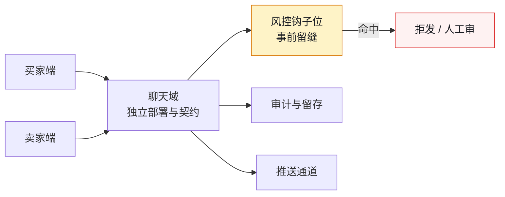
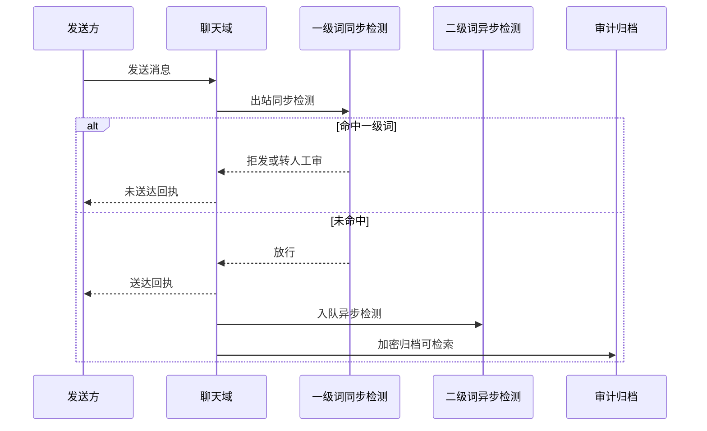

# 第 16 章 聊天功能：独立领域、WebSocket、推送与风控

> **本章定位**：当一个业务新增"用户间即时通讯"这类实时通信功能时，如何把它当成独立域来设计，而不是塞进某个已有域当子功能。
> **核心命题**：聊天域天然挂着风控、合规、审计、降级、跨端一致性——这些非功能约束不在需求文档里，必须由人在 AI 动手之前先画好边界与留缝。
> **本章的 AI 失灵点**：AI 生成的聊天功能默认不带敏感词过滤（它不知道这是业务约束）。
> **本章的人介入点**：聊天域独立、契约先行、风控钩子位强制留缝（呼应第 11 章）。



**图 16-1｜聊天独立成域** — 风控钩子必须事前留缝；事后补过滤等于把合规当成上线后体检。

---

## 16.1 问题：AI 生成的聊天功能，唯独没有敏感词过滤

业务方提了一个新需求：买家和卖家可以在交易过程中直接聊天。这个需求看起来简单——不就是一个聊天室嘛。

一线工程师让 AI 生成了一版完整的聊天功能：WebSocket 连接、消息收发、在线状态、消息存储。从代码角度看，功能完整、能跑、体验流畅。

**然后风控负责人和合规负责人一起把这版代码否了。**

风控负责人的否决理由："这个聊天功能没有任何敏感词过滤。买家卖家在里面聊'加我微信线下交易'怎么办？聊欺诈话术怎么办？聊违规商品怎么办？" 合规负责人的否决理由："聊天内容是用户数据，存储和审计的合规边界在哪里？AI 生成的这版代码，消息直接明文入库，没有审计接口。"

一线工程师委屈地说："需求文档里只写了'买家卖家可以聊天'，并没有说要加这些。"

**这就是第 11 章"留缝"在新功能上的直接体现。** AI 生成聊天功能时，它的目标函数是"让聊天能跑"，不是"让聊天安全合规"。它不知道这个聊天域背后挂着风控、合规、审计三重约束——因为这些约束不在需求文档里，在组织的隐性知识里，而隐性知识从来不会被自动喂给 AI。

---

## 16.2 根因：新功能没有"域"的意识，也没有"非功能需求"的意识

**① 聊天没有被当成一个独立的业务域。** 一线把它当成交易域的一个子功能，塞进了交易域的代码里。但聊天有自己的生命周期、自己的一致性要求（消息顺序、已读状态）、自己的合规约束（内容审计）。**它不是一个子功能，它是一个域。**

**② 非功能需求没有写在需求里。** "聊天要能跑"是功能需求；"聊天内容要过敏感词、要可审计、要能降级"是非功能需求。**AI 只读到了功能需求，因为非功能需求散在风控手册、合规手册、SRE 的运维规范里——它们从来没被整合进 AI 能看到的上下文。**

**③ AI 生成新功能时，不会主动"留缝"。** 第 11 章讲过：AI 的天性是贴着当前需求生成最短路径。它不会主动想"这个聊天域未来要接风控、接审计、接推送降级"——除非有人在生成前就把这些缝定义好。

---

## 16.3 AI 用法：先画域的边界和缝，再让 AI 填充

正确的顺序：

```
人定义（生成前）：
  1. 聊天是独立域 → 独立仓库、独立契约、独立部署
  2. 风控钩子位 → 每条消息发出前必须过敏感词接口
  3. 审计接口 → 所有消息可被审计系统检索
  4. 降级方案 → WebSocket 断开时降级为 HTTP 轮询
  5. 推送策略 → 离线消息通过推送送达

AI 执行（在上述约束内）：
  生成聊天域的代码骨架和实现
```

**关键差异在于：人在 AI 动手之前，就把"这个域必须留的缝"定义好了。** 这样 AI 不是在"生成一个聊天功能"，而是在"填充一个已经留好缝的聊天域骨架"。

---

## 16.4 角色博弈：聊天域的 Owner 和风控接入

**冲突一 · 聊天域归谁？** 交易域负责人说聊天是交易的子功能，归他。增长域负责人说聊天是用户留存工具，归他。最后治理组裁定：**聊天是独立域**，因为它的合规约束和生命周期与交易/增长都不同。**两位都没拿到，都不满，但都能理解。**

**冲突二 · 风控接入的力度。** 风控负责人要求"每条消息实时过敏感词"，但这会增加 50-100ms 延迟。聊天体验团队反对——"聊天延迟超过 200ms 用户就会觉得卡。"

最后妥协：**敏感词分两级——一级词（违法违规）实时拦截（可接受 100ms 延迟），二级词（营销导流）异步检测（不影响延迟但事后追溯）。** 风控负责人保住了对一级词的实时控制，聊天体验团队保住了延迟在可接受范围内。

这条「分级」落到消息出站的链路上，就是每条消息发出前必经的一道闸：



**图 16-2｜消息出站的两级检测** — 一级词同步拦住违法违规，二级词异步追溯营销导流；分级是「拦得住」与「聊得顺」之间唯一的折中。

**冲突三 · 聊天内容保留多久。** 合规负责人要求聊天内容保留 90 天供审计。业务方说"聊天是私密内容，保留太久用户会有隐私顾虑"。最后定 30 天在线、90 天审计归档（加密），过了 90 天彻底删除。**合规负责人让了"在线保留"的时长，业务方让了"审计归档"的存在。**

---

## 16.5 产出物：聊天域契约 + 风控接入标准

1. **聊天域契约**：WebSocket 协议、消息格式（含消息类型、敏感词标记位）、已读/撤回的语义定义。
2. **风控接入标准**：一级词实时接口（<100ms）、二级词异步队列、审计检索接口。

> **代价声明**：风控接入让聊天消息的平均延迟从 30ms（纯转发）涨到了 95ms（含一级敏感词检测）。**体验团队最初无法接受，但风控负责人的一句话终结了争论："聊天里出了欺诈，用户不会找你聊天团队，会找我风控。"**

### 落地步骤：聊天域从立项到上线

把 16.3 的「先画缝、再生成」展开成可照抄的顺序，每一步都有责任人：

1. **域判据评审**：独立生命周期、独立合规约束、独立一致性要求，三条中两条成立即独立成域，结论写成 RFC。
2. **定 Owner**：聊天域 TL 一名；风控、合规、SRE 的接手点写进介入点矩阵（见本节末）。
3. **契约先行**：消息格式（含敏感词标记位）、已读与撤回语义、WebSocket 协议先入契约仓库，签字后 AI 才能动手。
4. **骨架留缝**：风控钩子位、审计接口、降级开关写进骨架接口；骨架评审通过，才允许 AI 填充实现。
5. **AI 填充**：消息收发、在线状态、存储在骨架约束内生成，生成物带 prompt 留痕进 PR。
6. **风控联调**：一级词实时接口、二级词异步队列、审计检索接口分别联调，各留一份联调记录。
7. **降级演练**：人为断开 WebSocket，验证 HTTP 轮询降级与离线推送路径，演练记录归档。
8. **门禁放行**：走第 19 章五层门禁；即使适用性判定为与资金无关，也要留判定记录。
9. **度量接入**：延迟、拦截、留痕三块指标进监控，口径见下表。

### 可抄骨架：出站风控钩子位

```typescript
// 聊天域出站中间件：风控钩子位是「留缝」的落地形态
// 为什么骨架必须人写：钩子位一旦交给生成代码「顺手实现」，合规就退回事后体检
type Verdict = 'BLOCK' | 'REVIEW' | 'PASS'

async function outboundGuard(msg: ChatMessage): Promise<Verdict> {
  // 一级词同步检测：违法违规内容必须拦在送达之前
  const l1 = await riskClient.checkSync(msg.text)
  if (l1.hit) return l1.severe ? 'BLOCK' : 'REVIEW'
  // 二级词只入异步队列：营销导流类不牺牲聊天延迟，事后可追溯
  await riskQueue.enqueue({ messageId: msg.id })
  // 审计归档加密存储，检索接口只对审计系统开放（冲突三的结论）
  await auditArchive.saveEncrypted(msg)
  return 'PASS'
}
```

`riskClient`、`riskQueue`、`auditArchive` 都是注入的边界依赖；`REVIEW` 的处置策略表由风控负责人维护，聊天域无权改。

### 度量指标：聊天域的三块仪表盘

| 指标 | 怎么测 | 起步阈值 | 谁看 | 多久看一次 |
|---|---|---|---|---|
| 出站延迟 P95 | 发送到回执的端到端打点 | 超出两级方案的延迟预算即告警 | 聊天域 TL | 每日 |
| 一级词拦截量 | 钩子位打点，按词类分组 | 突增即告警——话术在变异 | 风控 | 每日 |
| 二级词处置闭环 | 异步队列从积压到处置的时长 | 有积压即告警 | 风控 | 每周 |
| 审计检索可用性 | 对审计接口定时拨测 | 失败即告警 | 合规 | 每日 |
| 降级演练新鲜度 | 演练记录归档时间 | 大促前必须有新鲜记录 | SRE | 每个大促前 |

### 演练剧本：WebSocket 断链降级

每月一次、大促前必做，SRE 主导，聊天域 TL 在场：

1. 预发环境断开 WebSocket 网关，观察端上是否自动切换 HTTP 轮询。
2. 验证轮询的进入与退出：连接恢复后是否及时切回长连接，避免轮询 QPS 滞留。
3. 制造一条离线消息，验证推送通道送达与端上提醒。
4. 记录切换时长、消息丢失与恢复时长，归档为演练记录。
5. 任一项失败即红项，上线检查清单不放行。

### 介入点矩阵：聊天域谁在哪儿接手

| 节点 | 谁接手 | 动作 |
|---|---|---|
| 域判据评审 | 治理组 | 裁定独立成域或并入既有域 |
| 契约定稿 | 聊天域 TL | 签字入契约仓库，解锁 AI 生成 |
| 敏感词分级 | 风控负责人 | 定一级与二级词表及处置策略 |
| 保留时长 | 合规负责人 | 定在线与审计归档期限 |
| 降级演练验收 | SRE | 出演练记录，未演练不放行 |
| 上线放行 | 聊天域 TL | 五层门禁全过后解锁发布 |

---

## 16.6 四案例映射

| 案例 | 本章对应的场景 | 域的独立性体现 | 关键约束 |
|------|----------------|----------------|----------|
| 案例一·电商平台 | 买家卖家交易即时聊天新增 | 聊天独立成域，从交易域剥离 | 敏感词分级、内容审计保留期 |
| 案例二·加密交易所 | 用户间站内消息与客服会话 | 与交易/资金域隔离，独立部署 | 反洗钱话术识别、合规留痕 |
| 案例三·Web3 量化 | 策略告警与成员通知通道 | 通知域与策略执行域分离 | 关键告警必达、噪声抑制 |
| 案例四·安全初创 | 安全研究员协作与工单讨论 | 讨论域与工单系统解耦 | 敏感样本脱敏、操作可追溯 |

---

## 16.7 检查清单

- [ ] 你的新功能，是被当成"子功能"还是"独立域"？子功能 = 它的非功能需求没人管。
- [ ] AI 生成新功能前，你有没有定义它必须留的缝（风控/审计/降级）？没有 = 第 11 章的教训重演。
- [ ] 敏感内容有没有分级处理（实时 vs. 异步）？全实时 = 延迟炸；全异步 = 拦不住一级风险。
- [ ] 聊天内容的保留时长，合规和隐私有没有谈过？没谈 = 合规否决在等你。
- [ ] 新域的 Owner 定了没有？没定 = 它会成为下一个孤儿域。

---

## 16.8 反模式

| # | 反模式 | 后果 |
|---|--------|------|
| 1 | 聊天塞进交易域当子功能 | 合规约束没人管，风控接不进来 |
| 2 | AI 生成聊天不留风控缝 | 欺诈/违规内容畅行无阻 |
| 3 | 敏感词全实时 | 聊天延迟过高，用户流失 |
| 4 | 敏感词全异步 | 一级违法违规内容拦不住 |
| 5 | 聊天内容永久保留 | 隐私合规风险 |

---

## 16.9 遗留问题

- **WebSocket 降级方案在大规模下可靠吗？** 小规模测试 HTTP 轮询降级可用，但百万级并发下降级的代价（轮询的 QPS 暴涨）还没有实战验证。留给第 18 章（亿级流量）。
- **聊天域的跨端一致性怎么保证？** 已读状态在多端之间同步，涉及多端状态一致性——这是第 17 章（多端 BFF）的同类问题。
- **敏感词库谁来维护？** 词库是活的，新的欺诈话术不断出现。敏感词库的更新机制和 Owner 归属，留给第 20 章（风控）和第 26 章（治理）。

---

> **本章的一句话**：新功能不是"代码生成完就结束了"。**一个聊天功能背后，挂着风控、合规、审计、降级、跨端一致性——这些都不是 AI 会主动想到的东西。** AI 能帮你把聊天写出来，但"这个聊天域必须遵守什么规则"，永远是人在 AI 动手之前就要画好的边界。
