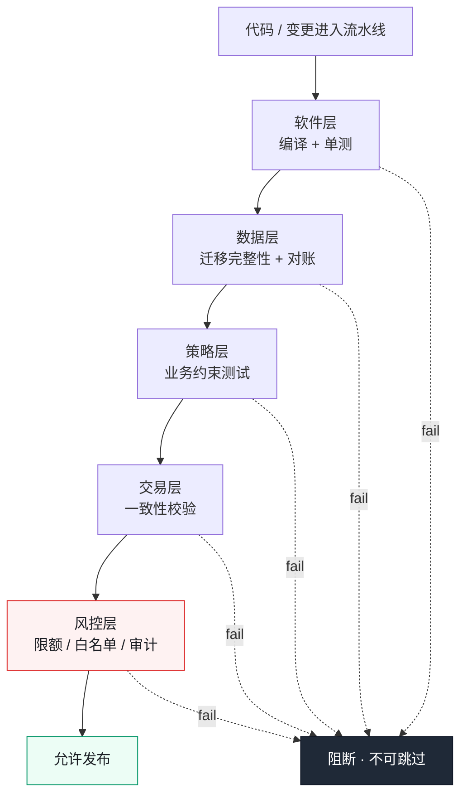
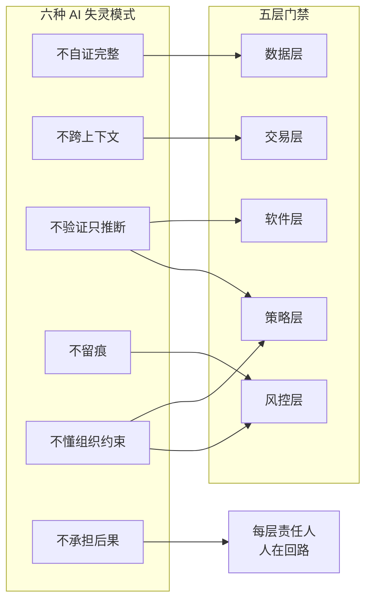
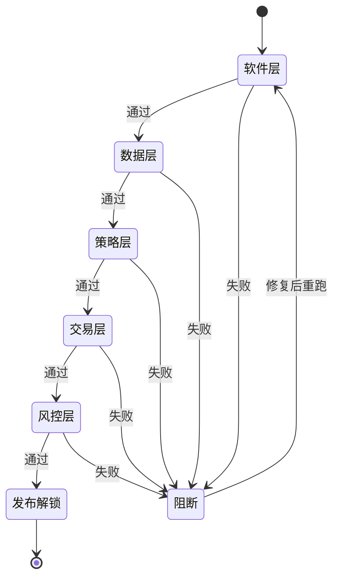

# 第 19 章 测试五层门禁：软件、数据、策略、交易、风控

> **本章定位**：上线体系统一化——五层门禁成为全平台发布标准。
> **核心命题**：门禁不可绕过（靠技术手段保证），每层有明确的通过标准和责任人；AI 生成代码让门禁意识更脆弱，必须用系统约束替代人的自觉。

---

## 19.1 问题：门禁太多没人守，门禁太少等于没有

在一次支付对账事故的复盘之后，一个核心问题被摆到桌面："那笔对账迁移上线前，过了几道门禁？"

答案是：只过了"软件层"门禁（代码编译通过 + 单测过）。**数据层有没有漏字段、策略层有没有限额缺失、交易层有没有对账不一致、风控层有没有资金风险——一道都没过。** 不是这些门禁不存在，是它们从来没被"系统化"地接进上线流程。有些门禁靠人记得去查，有些门禁纯粹靠运气。

另一次促销规则事故则是另一个极端——促销规则引擎上线前过了软件层和策略层，但"满减不能叠加"这个业务约束没有对应的门禁。它是"策略层门禁不完善"的典型。

这两件事指向同一个问题：**上线门禁是碎片化的、靠人记忆的、没有统一标准的。** 一次事故漏了数据层，另一次事故漏了策略层——漏的不同，但漏的原因一样：**没有人把"上线前应该过哪些门禁"做成一个不可绕过的清单。**

---

## 19.2 根因：门禁靠自觉，自觉有波动

**① 每层门禁分散在不同人手里。** 软件层在开发手里，数据层在 DBA 手里，风控层在风控负责人手里。**没有人把这些门禁串成一条流水线。** 于是上线的人只过自己知道的那几道，其余的碰运气。

**② 门禁是"建议"不是"强制"。** "建议上线前做对账验证"和"不做对账验证就不让上线"，效果差着一个银河系。**只要门禁可以被绕过，赶时间的人一定会绕过。**

**③ AI 生成代码进一步削弱了门禁意识。** 当代码是 AI 写的，开发者对它的信心会偏高（"AI 生成的，应该没问题吧"），于是更倾向于跳过他觉得"多余"的门禁。**AI 没有降低门禁的必要性，但降低了人执行门禁的意愿。**

---

## 19.3 五层门禁

全平台的上线门禁被统一成五层，每层有职责、标准、责任人和技术强制手段：



**图 19-1｜五层门禁** — 五全过才能上线；任何一层失败，发布按钮不可用。

| 门禁层 | 守什么 | 通过标准 | 责任人 | 技术强制 |
|--------|--------|---------|--------|---------|
| 软件层 | 代码质量 | 编译通过 + 单测覆盖率 ≥ 80% | 开发 | CI 自动 |
| 数据层 | 数据完整性 | 迁移脚本无字段遗漏 + 对账无差异 | DBA + 开发 | 迁移对账脚本自动跑 |
| 策略层 | 业务规则正确 | 关键业务约束有对应测试 | 域 TL | 策略测试自动跑 |
| 交易层 | 交易一致性 | 订单-支付-库存一致 | 交易域 TL | 交易一致性测试 |
| 风控层 | 资金安全 | 限额/白名单/审计接入验证 | 风控负责人 | 风控接口存在性测试 |

**五层的关系不是"五选一"，是"五全过才能上线"。** 任何一层不过，发布流程卡住，不允许跳过。

### 五层与六失灵：每层兜哪种失灵

五层门禁不是为了「AI 写得差」兜底，而是给第 2 章归纳的六种 AI 失灵模式各指定一个承接层。把失灵模式和门禁层摆成一张对应矩阵，「为什么恰好是五层」就有了出处：



**图 19-2｜五层对六失灵的承接矩阵** — 前五种失灵都能指定门禁层兜住；唯独「不承担后果」没有任何一层能自动拦截，只能落在每层的责任人身上——这就是门禁表里必须有责任人栏的原因。

配套的对应关系可直接抄进 RFC 的评审依据：

| 失灵模式 | 主要承接层 | 承接方式 |
|---|---|---|
| 不自证完整 | 数据层 | 迁移完整性 + 对账 |
| 不跨上下文 | 交易层 | 订单-支付-库存一致性校验 |
| 不验证只推断 | 软件层 + 策略层 | 单测 + 业务约束测试 |
| 不留痕 | 风控层 | 审计接入存在性验证 |
| 不懂组织约束 | 策略层 + 风控层 | 约束测试 + 限额/白名单 |
| 不承担后果 | 每层责任人 | 人在回路签字 |

---

## 19.4 门禁不可绕过的技术保证

门禁如何"不可绕过"？靠的不是写规范，是**把门禁嵌进发布流水线**——不过门禁，部署按钮就点不了。

```
PR 合并 → 触发五层门禁流水线
  → 软件层 CI → 过？
  → 数据层对账 → 过？
  → 策略层测试 → 过？
  → 交易层一致性 → 过？
  → 风控层接入验证 → 过？
    → 全过 → 解锁灰度部署
    → 任何一层不过 → 部署不可用，须修复后重跑
```

**关键在于"解锁"机制：部署权限与门禁结果绑定。** 不是"你过了门禁但可以手动部署"，而是"系统只有在你过了全部门禁后，才把部署按钮解锁给你"。**门禁不再是人的自觉，而是系统的约束。**

把「解锁」画成状态机，「发布按钮不可用」就不再是一句口号，而是一个可验证的系统状态：



**图 19-3｜门禁解锁状态机** — 门禁不是「检查记录」而是「解锁条件」：任何一层失败，发布按钮保持不可用；修复后从流水线重跑，没有「只补失败那层」的捷径。

---

## 19.5 角色博弈：风控层门禁的例外审批

五层门禁里，最难推的不是技术实现，是**"风控层门禁能不能有例外"**。

一线的诉求："有些改动和资金完全无关（比如改一个文案），也要过风控层门禁？太浪费时间了。"

风控负责人的态度很硬："你怎么确定一个改动'和资金完全无关'？那次对账事故的迁移脚本，当时也以为只是个数据搬运。"

最后妥协：**风控层门禁有一个"适用性判定"步骤——由风控团队自动扫描变更内容，判断是否涉及资金链路。涉及则全量过风控门禁；不涉及则标记"风控豁免"并记录原因。** 但"风控豁免"不是自己声明，是风控系统判的——**一线不能自己说"这不涉及资金"来跳过门禁。**

> **代价声明**：五层门禁上线后，一次发布的平均门禁耗时从"几乎为零"（因为以前根本不全过）变成了约 40 分钟。**这 40 分钟是一笔实打实的效率税。但事故复盘告诉我们：少过一道门禁省下的时间，远不够赔一次事故的钱。**

---

## 19.6 产出物：五层门禁标准

一份标准文档，覆盖每层的定义、通过标准、责任人、技术实现方式、例外审批流程。门禁结果与部署权限绑定的技术规范。

> **代价声明**：五层门禁最大的隐性成本不是时间，而是**"门禁本身的维护"**——每一层的判定规则需要持续更新（新的业务约束出现时，策略层要加新测试）。门禁是活的系统，不是写完就不用管的文档。

### 落地步骤：把门禁焊进流水线

1. **先统一清单**：五层的定义、通过标准、责任人写成一份文档，逐条签字——先有共识，再谈工具。
2. **每层找机判抓手**：编译与覆盖率、迁移对账脚本、策略测试、一致性校验、接口存在性；机判不了的先设人工卡点，但卡点结果必须留痕进门禁面板。
3. **串成流水线**：串行起步，先保证「不可绕过」，再优化时长——并行化是优化，不是前提。
4. **权限绑定**：解锁逻辑写在发布系统里，不写在规范文档里；按钮不解锁，谁都发不了。
5. **例外通道单建**：风控适用性判定走自动扫描并记录原因，一线没有自我豁免权。
6. **联动灰度**：门禁解锁只到灰度档位，全量仍由第 21 章的监控与自动刹车守着。
7. **门禁自身也走门禁**：判定规则的变更同样要评审留痕，防止门禁被悄悄放松。

### 可抄配置：五层门禁流水线

```yaml
# 五层门禁流水线（占位示例：runner 与脚本路径按各域实际替换）
stages: [software, data, policy, trade, risk]

software:
  run: ./ci/unit-test.sh
  coverage_min: 80          # 第 19.3 节既定标准：低于即失败，不进下一层
data:
  run: ./ci/migration-recon.sh
  require_field_manifest: true   # 为什么：字段清单缺失是漏字段事故的前兆
policy:
  run: ./ci/policy-tests.sh
  fail_owner: domain_tl     # 策略层失败只有域 TL 能判定放过还是修复
trade:
  run: ./ci/trade-consistency.sh
risk:
  run: ./ci/risk-hooks-check.sh
  exemption: auto_scan      # 豁免只能由风控系统判定，不接受自我声明

deploy_unlock:
  needs: [software, data, policy, trade, risk]   # 解锁条件：五层全部成功
  on_failure: block         # 任何一层失败，部署按钮保持不可用
```

### 度量指标：门禁本身也要度量

门禁是活系统，不度量它就会悄悄失效：

| 指标 | 怎么测 | 口径 | 谁看 | 多久看一次 |
|---|---|---|---|---|
| 门禁全过率 | 流水线结果统计 | 趋势看，突降即查规则是否被放松 | 治理组 | 每周 |
| 平均门禁耗时 | 流水线打点 | 对照本章代价声明的量级持续压降 | 各域 CI Owner | 每月 |
| 失败层分布 | 按失败层聚合 | 长期集中在某层，说明该层上游质量差 | 域 TL | 每月 |
| 豁免误判率 | 豁免样本抽查复核 | 对照遗留问题的已知误判量级，只许降 | 风控 | 每周 |
| 门禁有效性 | 人工注入缺陷样例 | 漏拦一次即红项 | 治理组 | 每季度 |

### 反模式：门禁的六种变形记

| # | 反模式 | 后果 |
|---|--------|------|
| 1 | 门禁是文档不是流水线 | 靠人记得，赶时间一定漏 |
| 2 | 门禁留了手动跳过口 | 「不可绕过」四个字当场失效 |
| 3 | 只自动化软件层 | 数据层与策略层事故照发 |
| 4 | 责任人栏空着 | 拦下了没人认领，门禁空转 |
| 5 | 判定规则常年不动 | 一线学会「刷题」过门禁 |
| 6 | 拿门禁耗时考核一线 | 一线开始绕路，门禁变成博弈场 |

---

## 19.7 四案例映射

| 案例 | 五层门禁的核心挑战 | 门禁侧重 | 典型失守层 |
|------|-------------------|---------|-----------|
| 案例一·电商平台 | 支付对账迁移跨多层域，门禁需串起软件/数据/交易/风控 | 五层全覆盖，重点是数据层与风控层 | 数据层（漏字段）、风控层（未介入） |
| 案例二·加密交易所 | 充提转链路资金属性强，风控层门禁权重最高 | 风控层为主，策略层与交易层并重 | 风控层（限额缺失）、策略层（规则漂移） |
| 案例三·Web3 量化 | 策略迭代快、合约高频部署，策略层门禁最易被绕过 | 策略层为主，软件层与交易层并重 | 策略层（策略无对应测试） |
| 案例四·安全初创 | 工程人力薄、合规要求高，门禁自动化程度要求高 | 软件层与风控层为主，自动化优先 | 软件层（覆盖率不足）、风控层（人力不足） |

---

## 19.8 检查清单

- [ ] 你的上线门禁，是一份统一清单还是分散在各人脑子里？分散 = 一定有遗漏。
- [ ] 你的门禁是"建议"还是"强制"？建议 = 赶时间一定被绕过。
- [ ] 门禁结果和部署权限绑定了吗？没有 = 人可以手动跳过。
- [ ] 五层里，你覆盖了几层？只有软件层 = 数据层和策略层事故在等你。
- [ ] 风控层门禁能不能被一线自己豁免？能 = 等于没有风控层。

---

## 19.9 遗留问题

- **门禁流水线跑 40 分钟，能不能加速？** 可以通过并行化（五层同时跑而不是串行）和增量测试（只跑变更影响的层）。留给各域 CI 优化。
- **"适用性判定"会不会误判？** 风控系统的自动判定有约 5% 的误判率——要么误判为"涉及资金"导致白跑全量门禁，要么误判为"不涉及"导致跳过了该过的门禁。前者浪费、后者危险。**误判的处理仍需人工复核。** 留给第 24 章（AI 评审与幻觉）。
- **门禁会不会变成"刷题"？** 一线可能学会"怎么写代码才能最快过门禁"而不是"怎么写代码才真正安全"。这个博弈永远存在，解药是"门禁内容持续更新"和"抽查门禁的有效性"。

---

> **本章的一句话**：门禁的价值不在"拦住了多少发布"，而在"**让每一次发布都过了同样多的检查，不依赖于当天谁在岗、谁记得查、谁有空审**"。AI 让代码生成变快了，门禁必须变得更系统——否则你放行的速度越快，放进去的风险就越大。
