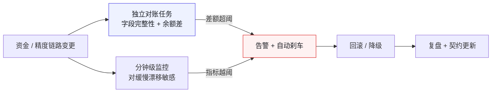
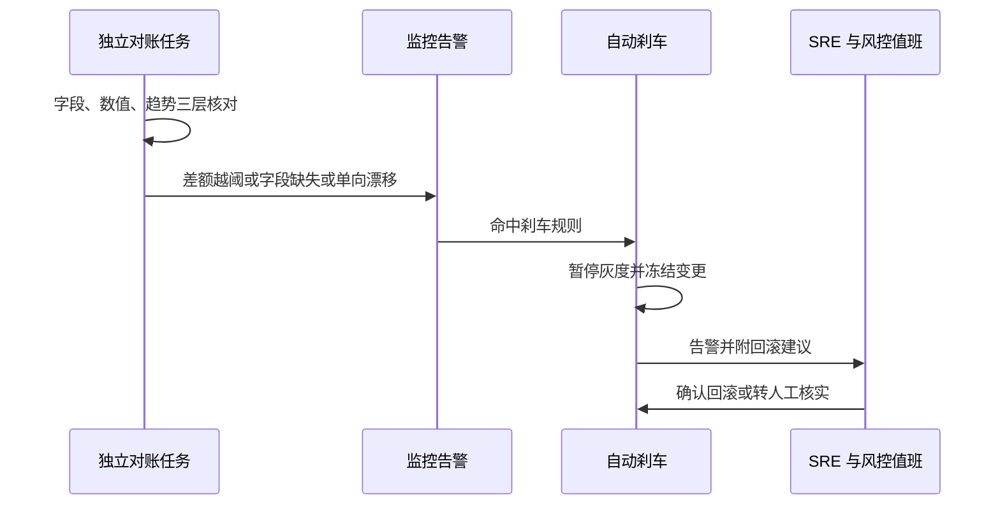
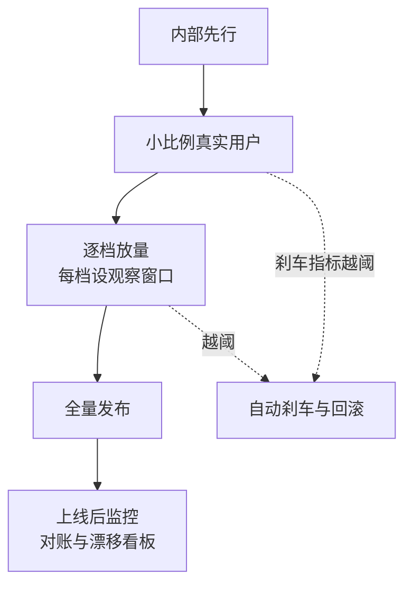

# 第 21 章 对账、灰度、回滚、监控

> **本章定位**：上线体系的总览章；灰度/回滚的细节已在第 28 章深入，本章补充对账与监控两条防线。
> **核心命题**：对账是资金系统的生命线；监控覆盖"AI 可能引入的盲区"。两者都必须从"事后发现"前置为"实时感知"。



**图 21-1｜对账与监控闭环** — 对账必须独立于发布链路；只对「有的字段」算差额会漏掉字段级事故。

---

## 21.1 问题：那次事故当天，对账和监控同时失明

那次对账事故的复盘结论里，有一句话被反复引用：**"那天晚上，对账系统和监控系统同时失明。"**

对账失明：迁移脚本漏了字段，但对账系统没有"字段完整性检查"——它只对"有的字段"算差额，漏掉的字段它压根不知道该对。于是差额在悄悄积累，对账系统说"正常"。

监控失明：告警阈值是按"历史正常波动"设的，而这次的差额增长虽然异常，但初期幅度没超阈值——**监控系统的阈值是均值导向的，它对"缓慢但持续的增长"天然不敏感。**

两个系统同时失明的结果是：**从迁移上线到告警响起，过了 47 分钟。** 这 47 分钟里差额从 0 累计到了 ¥86 万。

---

## 21.2 根因：对账和监控都在"事后"工作，且都有盲区

**① 对账只查"已有的东西"。** 传统对账是"两边数据对不对得上"。但如果一边的数据根本没产生（字段漏了），对账无从对起。**对账需要"预期完整性检查"——不只对数值，还要对"应该有的字段有没有缺失"。**

**② 监控阈值是均值导向的。** 绝大多数告警阈值是"历史 P99 的 N 倍"。这对突发尖峰有效，但对"温水煮青蛙式的缓慢漂移"无效。**那次对账事故的差额增长就是缓慢漂移——每个时间点的增幅都不大，但持续累积就成了灾难。**

**③ AI 生成的代码引入了新的监控盲区。** AI 生成的迁移脚本、配置、规则，它们的行为模式可能和人工写的不一样——但监控的基线是按人工代码的行为建立的。**AI 的输出偏离了监控的"正常基线"，但偏离得不够大，没触发告警。**

---

## 21.3 对账：资金系统的生命线

对账不是"可选的验证步骤"，它是资金系统的生命线。**一个不做对账的资金系统，不是"可能有错"，而是"一定有错但你不知道"。**

对账体系被升级为三层：

**① 字段完整性对账（事故后新增）。** 对账不只对数值，先检查"两边应该有的字段是否都在"。缺任何一个，立刻告警。**这一层专门防"漏字段"式的事故。**

**② 数值精确对账。** 两边对应字段的值必须精确相等（金额领域不存在"近似"）。差额 > 0 立刻标记。

**③ 趋势对账（事故后新增）。** 即使当前差额为 0，如果"过去 30 分钟的差额变化趋势"异常（比如持续单向小额漂移），也触发预警。**这一层专门防"温水煮青蛙"。**

三层对账的产出不只是一份报表，它直接驱动刹车。把「对账不平」到「自动刹车」的链路画成时序，就能看到黄金时间花在哪里：



**图 21-2｜对账不平到自动刹车** — 对账必须独立于发布链路：差额越阈先冻结再找人，黄金时间花在止损上，而不是花在「要不要先开会」上。

### 可抄 SQL：三层对账的最小骨架

```sql
-- 三层对账最小骨架（表名与字段均为占位，按业务替换）
-- 第一层：字段完整性——先对「应该有的字段」，再对数值
SELECT 'field_integrity' AS layer, COUNT(*) AS bad_rows
FROM order_payment o
JOIN payment_ledger p ON p.order_id = o.order_id
WHERE p.refund_amount IS NULL          -- 为什么先查缺失：漏字段的事故对账系统「看不见」
  AND o.has_refund = 1;

-- 第二层：数值精确——金额领域不存在「近似相等」
SELECT 'amount_diff' AS layer, COUNT(*) AS bad_rows
FROM order_payment o
JOIN payment_ledger p ON p.order_id = o.order_id
WHERE ABS(o.pay_amount - p.pay_amount) > 0;   -- 差额大于零即标记，不设容差

-- 第三层：趋势——当前差额为零也可能在「温水煮青蛙」
SELECT 'drift' AS layer, direction, COUNT(*) AS streak
FROM recon_diff_minute
WHERE ts >= now() - interval '30 minutes'     -- 连续同号小额漂移，比绝对阈值更早报警
GROUP BY direction;
```

### 落地步骤：三层对账从零接入

1. **先补「应有什么」**：与业务 Owner 一起列资金链路两侧的字段清单，入契约仓库——没有清单，完整性对账无从谈起。
2. **第一层先上线**：字段完整性对账独立部署、独立告警，不挂在发布流水线里。
3. **第二层接数值**：精确相等口径，差额大于零即标记人工核实。
4. **第三层加趋势**：分钟级差额快照落表，配单向漂移告警。
5. **刹车接进灰度**：对账告警进第 28 章的自动刹车指标清单，告警即冻结。
6. **runbook 落地**：用本章值班摘录模板，演练一次「告警到止血」全流程。
7. **对账系统本身也要查**：它也是系统，也会失明——按季度抽查它的告警是否真的会响。

---

## 21.4 监控：覆盖 AI 的盲区

监控系统升级，新增了对"AI 特有风险"的覆盖：

**① 留痕率监控。** 每次 AI 生成的代码上线，监控它的 prompt 留痕是否完整。留痕率下降 = 有人跳过了留痕流程。

**② 契约一致率监控。** 接口和契约仓库的一致率，低于阈值即告警。**这一层防契约漂移式的事故。**

**③ 回滚速度监控（MTTR）。** 从告警到回滚完成的时长，作为 SRE 的核心指标。那次对账事故的 3.5 小时是一个反面基准——目标是把 MTTR 压到 30 分钟以内。

**④ 灰度刹车触发率。** 自动刹车的触发频率——太高说明阈值太敏感，太低说明可能在漏拦。

起步阈值（需按系统调参，不是标准答案）：

| 指标 | 起步建议 | 说明 |
|---|---|---|
| 对账差额 | 业务定义绝对阈值 + 相对阈值 | 只用相对阈值会漏小单大面 |
| 单向漂移 | 连续 N 分钟同号差额 | N 先取 15，再按误报调 |
| 留痕率 | 周环比下降 >10% 告警 | 治理组看趋势，不看单日 |
| MTTR | P50 ≤30min / P95 ≤2h | 写进 SRE 值班 runbook |
| 刹车触发率 | 周均 0–3 次较健康 | 长期 0 可能阈值过松 |

值班摘录模板（事故当晚可直接改）：

```text
1) 确认告警对象与影响面（资金/用户/合规）
2) 先止血：降级 / 冻结 / 回滚按钮权限人是谁
3) 存档现场：镜像、日志、对账快照
4) 通知矩阵：SRE → 风控/合规 → 业务 Owner → 决策层
5) 未获授权前禁止「顺手再改一段」
```

### 可抄配置：监控告警规则

把上面这些监控落到监控系统里，就是一份告警规则。写规则时有一条纪律：**每条告警必须绑定一个动作**——只往群里发消息的告警，等于把「发现」和「止损」之间又塞回了一次人工转述。动作分四档：`brake`（直接刹车）、`freeze_rollout`（冻结灰度）、`block_deploy`（拦下一次发布）、`ticket`（开单跟踪）。

```yaml
# 监控告警规则骨架（指标名、数据源、阈值为占位，按监控系统与业务替换）
rules:
  - name: recon_field_missing        # 字段完整性：缺一个字段就是事故，不是嫌疑
    expr: recon_field_missing_count > 0
    severity: critical
    action: brake                    # 为什么直接刹车：这一层对应那次 47 分钟失明的事故
    notify: [sre, 风控值班]

  - name: recon_amount_diff          # 数值对账：绝对 + 相对双阈值，只用相对会漏「小单大面」
    expr: recon_diff_abs > <ABS_THRESHOLD> or recon_diff_ratio > <RATIO_THRESHOLD>
    severity: critical
    action: brake                    # 金额领域差额只有零和非零，没有「近似正常」
    notify: [sre, 业务Owner]

  - name: recon_one_way_drift        # 单向漂移：连续 15 分钟同号差额（N 起步值，按误报调）
    expr: recon_diff_sign_streak >= 15
    severity: high
    action: freeze_rollout           # 先冻结灰度再查原因——趋势告警的定位是「提前量」
    notify: [sre]

  - name: trace_retention_drop       # 留痕率：周环比降逾 10% 告警，看趋势不看单日
    expr: trace_retention_rate_wow < -0.10
    severity: high
    action: ticket                   # 为什么只开单：这层的病根在流程执行，不在线上代码
    notify: [治理组]

  - name: contract_consistency       # 契约一致率：跌破治理后 97.4% 基线即告警
    expr: contract_consistency_rate < 0.974
    severity: high
    action: block_deploy             # 拦的是下一次发布，不是线上流量
    notify: [sre]

  - name: rollback_mttr_regression   # MTTR：回滚时长变长 = 兜底在悄悄失效
    expr: rollback_mttr_p95 > 2h     # 为什么盯 P95：平均值会把长尾藏掉
    severity: high
    action: ticket
    notify: [sre负责人]
```

维护约定只有一条：**阈值每次调参都留 ADR**——谁改的、依据哪次误报或漏报、改成多少。否则半年后没人说得清「15 分钟」是怎么来的。

---

## 21.5 灰度与回滚：引用第 28 章

灰度分层方案、自动刹车、回滚决策矩阵的完整内容已在第 28 章给出，本章不重复。这里只补充一个视角：

**灰度和回滚不只是"发布技术"，它们是"AI 失灵时的组织兜底"。** AI 让代码上线变快了，灰度和回滚就是"上线后发现不对时，能多快撤回来"的保障。**生成的速度和回滚的速度必须匹配——否则你放出去多快，收不回来就有多惨。**

把第 28 章的分层灰度画成漏斗，每一档都是一道闸——各档比例与观察窗口以第 28 章为准，这里看的是闸的结构：



**图 21-3｜灰度发布漏斗** — 每一档都是闸：越阈即自动刹车回滚，不越阈才许进下一档；漏斗收窄的节奏由刹车指标说了算，不由排期说了算。

第 28 章的核心产出"前进必带后退"——任何变更必须有回滚脚本、刹车指标、演练记录——是对这个原则的落地。

### 反模式：对账、灰度与监控的若干死法

| 反模式 | 长什么样 | 死法 | 解法 |
|---|---|---|---|
| 对账挂进发布流水线 | 对账任务作为流水线的一个 stage | 流水线一失败就整体跳过，对账跟着失明 | 对账独立部署、独立告警（21.3） |
| 只对数值 | 对账只比对金额字段 | 漏字段的事故对账「看不见」 | 第一层字段完整性（21.3） |
| 阈值均值导向 | 告警按历史波动的 N 倍设 | 缓慢漂移永远不响，响时已是灾难 | 趋势对账 + 单向漂移告警（21.4） |
| 告警不接动作 | 告警只往群里发消息 | 值班看到消息时，差额已经累计完了 | 每条告警绑定 brake / freeze / block（本章告警骨架） |
| 灰度按排期放量 | 每档停留多久由排期定 | 指标没稳就进下一档，灰度名存实亡 | 漏斗节奏由刹车指标说了算（图 21-3） |
| 清单填着玩 | 上线检查清单过一遍但没人拦 | 形式主义，出事时清单成了免责道具 | 门禁化：不过清单不让上（21.8） |

---

## 21.6 产出物：上线检查清单（附录 B）

一份可勾选的上线检查清单，每次发布前过一遍：

- [ ] 五层门禁全过？（第 19 章）
- [ ] 风控会签完成？（第 20 章，资金相关）
- [ ] 字段完整性 + 数值 + 趋势三层对账配置就绪？
- [ ] 回滚脚本存在且演练过？（第 28 章）
- [ ] 自动刹车阈值已设？（第 28 章）
- [ ] 灰度比例方案已定？（第 28 章）
- [ ] 留痕完整？（第 23 章）
- [ ] 多端影响已评估？（第 17 章）

> **代价声明**：一份完整的上线检查清单意味着"每次发布的准备时间变长了"。从"写完就上"到"过完清单才上"，平均增加约 1 小时的准备时间。**但这 1 小时买的是"对账事故不再重演"。**

---

## 21.7 四案例映射

| 案例 | 对账的关键对象 | 监控的关键指标 | 回滚的核心约束 |
|------|---------------|--------------|--------------|
| 案例一·电商平台 | 订单-支付-库存三方对账 | 对账差额、异常交易率 | 灰度比例 + 数据回滚脚本 |
| 案例二·加密交易所 | 链上流水 vs 账本对账 | 充提转延迟、地址白名单命中率 | 资产隔离 + 冷热钱包切换 |
| 案例三·Web3 量化 | 持仓敞口 vs 策略预期 | 策略 PnL 漂移、滑点异常 | 合约暂停 + 策略回滚 |
| 案例四·安全初创 | 客户数据访问日志 vs 合规策略 | 留痕率、契约一致率 | 配置回滚 + 权限回收 |

---

## 21.8 检查清单（关于上线体系本身）

- [ ] 你的对账是只对数值还是也查字段完整性？只对数值 = 漏字段事故在等你。
- [ ] 你的监控有没有覆盖"缓慢漂移"（趋势告警）？没有 = 温水煮青蛙。
- [ ] 你的 MTTR 目标是多少？>1 小时 = 不可接受。
- [ ] 你有留痕率监控吗？没有 = 有人偷偷跳过留痕。
- [ ] 你的上线检查清单是"填着玩"还是"不过不让上"？前者 = 形式主义。

---

## 21.9 遗留问题

- **对账系统本身的可靠性怎么保证？** 对账系统成了资金系统的生命线，那谁来对"对账系统"？这是一个无限套娃的问题。实践中需要对对账系统做独立的高可用部署和独立的告警——但它终究也需要人来信任。留给读者。
- **趋势告警的阈值怎么设？** "持续单向漂移多少分钟算异常"是一个需要调参的问题。太敏感会误报，太迟钝会漏报。没有标准答案，只有持续调优。
- **AI 能不能帮着做对账？** 可以辅助生成对账规则，但"什么算异常"的判定必须人定或确定性规则定——不能让概率性 AI 来判定"这笔钱对不对"。

---

> **本章的一句话**：上线不是一个动作，是一条从"代码写完"到"用户无感"的防线。**对账守的是钱的完整，监控守的是异常的可见，灰度守的是错误的可控，回滚守的是损失的封顶。** AI 让代码上线变快了，于是这条防线的每一环都必须比以前更灵敏——否则你放出去的每一个"快"，都是在赌"这次不出事"。
