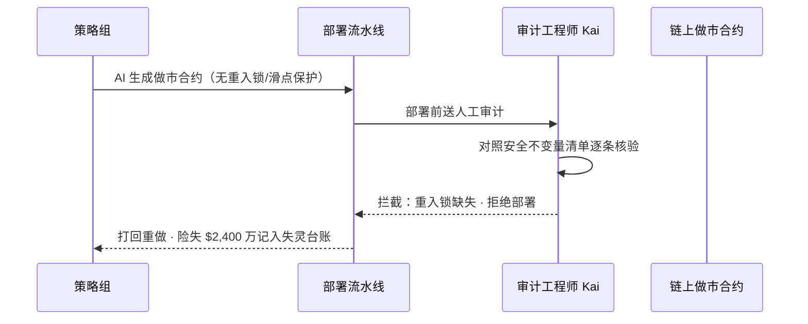
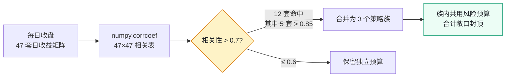
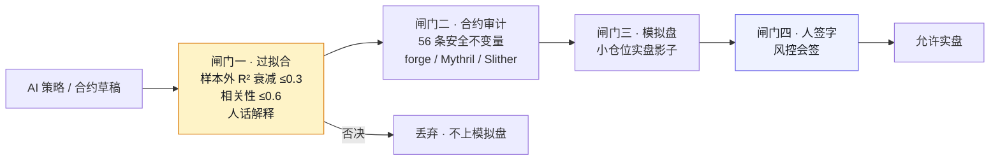

# 第八部分 · 案例三：暗流资本


> **叙事边界**：本案例为**自洽虚构的脱敏示范**，「暗流资本」为化名。链、策略与合约事故均为教学构造，**不构成任何投资或安全建议**；数字以 [`02-数字清单.md`](./02-数字清单.md) 为准。

> **本案例的 AI 失灵点**：Z-0612（策略过拟合崩盘）、W-0703（合约重入/滑点漏洞）。
> **本案例的人介入点**：策略可以被 AI 生成但不能被 AI "信任"；合约可以被 AI 写但不能被 AI "免责"。
> **本案例涉及的角色**：首席风控 Mira（叙述者）、审计工程师 Kai、策略主管 Teddy、CFO 老贺。

> **性质声明**：自洽虚构。暗流资本为化名，全部日期、人名、数字均为构造的脱敏虚构，不指代任何真实公司或个人。数字以 `02-数字清单.md` 为唯一事实来源。

---

## 一、背景

我叫 Mira，是暗流资本的首席风控官。

如果你听说过暗流，大概率是因为一个数字——**32 个人，管 $5.2 亿 AUM**。在传统资管，32 个人连一只中型公募基金的固定收益组都凑不齐。在我们这里，32 个人里 8 个是策略研究员，剩下的是合约工程师、运维、合规、财务和我。我们没有市场部，没有 BD，没有行政——我们只有两类资产：策略和合约。

**速度是这家基金的全部信仰。** 一条策略从研究员脑子里冒出来，到回测，到实盘，行业平均要两周。暗流的标准是 **2 天**。Teddy——我们的策略主管——把这个节奏当成宗教一样守着。任何拖慢这条流水线的东西，在他眼里都是异端。

我对此从来没有天真过。

我们跑着 **47 套策略**，横跨 6 条链（Ethereum、Arbitrum、Optimism、Polygon、BSC、Avalanche），日均交易 **8 万笔以上**——套利、做市、趋势、跨链搬砖，什么都做。链上躺着 **23 个我们部署的合约**：12 个是可升级代理模式，剩下的 11 个，一旦部署就是死的——逻辑刻在区块里，永远改不掉。

这套基础设施是这样的：策略研究员这边，Python 3.11 是底座——策略引擎是我们自己写的，核心是 `pandas` + `numpy` + `scipy`，回测用 `vectorbt` 做向量化部分，外面再包一层我们自研的事件驱动引擎，用来处理那些向量化搞不定的复杂逻辑（比如带条件的仓位再平衡）。研究员写完策略，跑回测，出报告，一套流程下来。

策略通过了闸门，到了实盘执行这一层，就交给 Go 1.21 写的低延迟执行层。Go 那边对接的是 CEX（Binance、OKX、Bybit）的 REST + WebSocket API，订单路由是我们自研的——同一个信号，拆成几条链路，谁先到谁先成交，剩下的撤掉。链上交互这一层，Python 用 `web3.py`，Go 用 `go-ethereum`，两套并存，因为研究员的脚本用 Python 顺手，执行层用 Go 快——各自发挥长处。

合约开发这一块，Solidity 0.8.20 + Foundry 是标准武器——`forge` 跑测试，`cast` 做链上交互调试，`anvil` 起本地节点做模拟盘 fork 主网。合约库用 OpenZeppelin 5.0，重入锁、ERC20 标准、权限控制这些都从它继承。数据层，行情和 tick 数据存在 TimescaleDB 里——它能扛住我们的写入吞吐，又能按时间切片做查询；实时状态（仓位、挂单、最近成交价）放 Redis；合约 ABI 这种不常变但要全节点都能读到的东西，我们 pin 在 IPFS Pinata 上。

基础设施这一层，我们大量用 AWS EC2 spot 实例跑回测和策略计算——spot 比按需便宜 70%，对回测这种容错性高的任务很划算，被回收了重启就行。事件触发的任务用 Lambda。所有这些资源用 Terraform 管，不让任何人手动点控制台——基础设施即代码，改一次 review 一次。

监控这一层我们叠了三家：Datadog 做 APM 和自定义指标，合约交易模拟和实时监控用 Tenderly——它能告诉我们一笔交易执行前会变成什么样，对 DeFi 策略特别关键。PnL 看板是我们自己写的，因为没有任何现成产品能同时聚合 CEX 和链上的实时盈亏。

AI 工具这一层，我不想回避——我们用得很多。GitHub Copilot 帮研究员写策略代码的样板部分，GPT-4 API 用来跑策略想法的生成和回测参数空间的搜索，外面还包了一层自研的 LangChain workflow，把"喂 prompt → 拿策略草稿 → 自动跑回测 → 出报告"这条链路串起来。这套东西让我们的策略产能翻了三倍，也是后来所有麻烦的起点。

这就是 Web3 量化与传统软件工程最残酷的差别。传统世界里，你写错了代码，凌晨三点起来打 hotfix，第二天一切恢复如初。在我们的世界里，一个有漏洞的合约部署上链的那一刻，错误就被永久写进了历史的区块。你能做的只有一件事：在漏洞被对手发现之前，把合约里所有的资金抢出来，然后把那个合约当死人一样丢在那里。如果你抢不出来——那笔钱就永远不是你的了。

我每天上班做的第一件事，不是看 PnL，而是看那 11 个不可升级合约的余额。我知道它们每一个的弱点，我知道它们每一个一旦被攻破会丢多少。

有人问我为什么当风控。我通常不回答这个问题。但如果你非要听——我做风控，是因为我对"完美拟合过去"这件事，有一种本能的恐惧。

这是我和 Teddy 之间最深的一道裂缝。他相信数据，我相信数据会骗你。他觉得我太保守，我觉得他赌注下在了错误的概率上。

这个案子讲的，就是这种分歧怎么变成了制度。

---

## 二、认知触发

2024 年 6 月 12 日，是我在这家基金职业生涯的分水岭。

那天下午，我在监控屏上看到一条让我心跳漏了一拍的曲线：**第 37 号趋势策略，上线不到 48 小时，实盘收益与回测预测的偏离度达到了 7 个标准差。**

不是小幅偏离。是策略的核心假设，在真实市场里完全不成立。

我盯着那条曲线看了大约 30 秒。这 30 秒里我没做任何决策——我只是在确认一件事：这不是数据延迟，这不是行情源问题，这不是某个 oracle 报错。这是策略本身在崩。

然后我启动了那个我祈祷自己永远不要用的程序：**手动 kill switch**。强制平掉 37 号策略的所有仓位，撤掉所有挂单，把策略状态切到"冻结"。这个 kill switch 是我自己写的——一个 Go 守护进程，常驻在风控服务器上，每秒轮询所有实盘策略的 PnL，同时订阅 Datadog 的实时指标流。它的触发条件有两个：自动模式下，实盘 PnL 偏离回测预期超过 2σ 即触发自动平仓并发 Slack/飞书告警；手动模式下，我有权限一键强平整个策略组。那天用的是手动——因为我不想等下一个 σ。

整个动作从决定到执行完成，11 分钟。

但这 11 分钟里，又多亏了 $120 万。

**最终清算：37 号策略实盘存活 72 小时，累计亏损 $860 万，占基金总 AUM 的 1.65%。** 那天 AUM 单日回撤 0.8%。我记得这个数字，因为它正好踩在我向 LP 承诺的单月回撤红线附近。

复盘还原的事实是这样的：37 号是策略组用 AI 辅助生成的。他们给 GPT-4 喂了过去三年（2021-2024）的 ETH/USDT 价格、链上 Gas 数据、一组技术指标，AI 产出了一套趋势跟踪逻辑。逻辑本身并不复杂——**EMA 交叉（快慢线金叉死叉）+ ATR 动态止损 + 基于波动率的动态仓位管理**，一共 12 个可调参数。然后 AI 用 LangChain workflow 自动跑了一轮网格搜索，把 12 个参数扫了一遍，挑出了"最优组合"。回测年化 **180%**，夏普比率 **2.8**，最大回撤 **12%**——这三个数都漂亮得过分。研究员很兴奋，过了一轮内部评审——评审基本是"回测好看就过"——直接上实盘。

事后我去翻那次参数搜索的日志，看到了那个让我心里一沉的画面：12 个参数的"最优值"全部挤在一片非常窄的区间里——EMA 周期 17-19，ATR 倍数 2.3-2.7，仓位系数 0.18-0.22。这不是"AI 学到了规律"该有的形状。一个真正学到规律的参数，应该在一个相对宽的区间里都表现稳定；只有当 AI 在"记住历史"时，最优点才会塌缩成这样一个针尖——稍微一动就崩，因为它依赖的不是泛化的规律，而是历史里那一组特定的噪声组合。

实盘第一周，证据就来了：**样本内 R² = 0.91（回测期拟合得几乎完美），实盘第一周 R² = 0.23（衰减超过 0.6）**。我们后来定的衰减阈值是 0.3，37 号实盘的衰减是这个阈值的两倍。它在回测里能解释 91% 的收益波动，在实盘里只能解释 23%——剩下那 68% 的解释力，全是它"背下来"的历史，不是它"学到"的规律。

更具体地说，它崩在哪一天：上线第三天，市场出现了一个历史样本里没有的波动模式——某代币在 8 分钟内闪崩 60%，然后在接下来 40 分钟里反弹回 80% 的位置。37 号的趋势跟踪逻辑在闪崩时触发了"加仓"信号（因为它把急跌当成趋势启动），在反弹时又触发了 ATR 止损（因为波动率瞬间放大到 ATR 的 2.7 倍，正好踩在它优化出来的止损线上）。**它在最不该加仓的时候加仓，在最不该止损的时候止损——一套动作做完，亏损落地。** 这套动作在历史回测里一次都没出现过，因为 2021-2024 这三年里没有发生过这种形状的闪崩反弹。AI 没见过，所以它没有应对。

没有人问过那个我最在乎的问题：**这个策略赚的是什么钱？** 它赚的是某种可重复的市场结构里的钱，还是它只是把过去三年里恰好发生的那组随机噪声背了下来？两者在回测里长得一模一样，但一个是金矿，一个是悬崖。

那天的复盘会，我记得 Teddy 的脸。他没有狡辩。他说：

> "我们以为回测 180% 是策略好。其实是 AI 把历史背下来了。它不是在预测未来，它是在复读过去。"

那一刻我心里只有一句话，但我没说出口。这句话后来变成了我对自己、对整个行业重复了无数遍的一句：

**回测里它是神仙，实盘里它面对的是从未见过的未来。**

AI 最擅长的事——拟合历史——恰恰是量化里最危险的事。给它足够多的历史，它总能找到一套完美解释历史的规则，但这套规则对未来没有任何预测力。在传统软件里，过拟合顶多是一段冗余代码；在量化里，过拟合等于把 LP 的钱喂给一个你以为有效、其实根本没有 edge 的策略。

37 号之后，我做了一件全公司都反对的事：**我把所有 AI 生成策略的实盘通道，冻结了 4 周。**

Teddy 当着我的面拍桌子。"市场机会窗口就那么短，你冻结一个月，我们这个月收益归零，LP 怎么交代？"

我没有退让。我说："LP 交代的是亏 1.65% 的 AUM，还是收益归零，你算算哪个数大。" 他没有回答。

这 4 周里，我们没有上线任何新策略。这 4 周也是这家基金第一次认真地坐下来，讨论"AI 生成的东西，到底要怎么信"。

---

## 三、事故复盘

我们这个案子，有两次事故。一次是策略的，一次是合约的。它们犯的不是同一种错，但根上是同一种天真——**用 AI 的概率性产出，去守护一个确定性的底线。**

### Z-0612：过拟合的 180%

第一次就是上面讲的 37 号。事后的技术还原是这样的：AI 学到的不只是"市场规律"，还有"过去三年这段历史数据里的特定噪声"。它把一组本不会重复的随机波动，当成了一条可复制的策略主干。回测里它每一笔都对，实盘里它每一笔都偏——因为它从来没有见过 2024 年 6 月 12 日以后的世界。

更技术地说，这是一个典型的**样本内过拟合**问题。AI 在 2021-2024 这段数据上做网格搜索时，12 个参数的自由度足够它在噪声里找到一条完美曲线——这在统计上叫"维度灾难"，参数越多，过拟合的能力越强。我们的 LangChain workflow 给 AI 的指令是"最大化回测夏普比率"，AI 就忠实地执行了这条指令——它没有动机去区分"规律"和"巧合"，因为它根本没有"巧合"这个概念。它看到的只有数据，它能做的只有拟合。

我在复盘报告里写了一句话：**"AI 不验证，只推断。"** 它在训练分布内是无敌的；它在训练分布外是瞎的。问题是，实盘永远在训练分布外。

亏损已经发生，$860 万，不可逆。我能做的只是让它不再发生第二次。我冻结了实盘通道，启动了闸门的设计。

### W-0703：漏掉的重入锁

第二次差点比第一次严重十倍。如果 Z-0612 是策略的问题，W-0703 就是合约的问题——而且它差点让我们损失 **$2,400 万**，差不多是我们一半的流动性储备。

2025 年 7 月 3 日，审计工程师 Kai 在做例行合约审计。他盯着一段 AI 生成的 DeFi 做市合约代码看了 20 分钟，越看越不对劲——**提款函数没有重入锁。**

具体说，这份合约是一个在 DEX 上自动提供流动性的做市合约，核心是一个 `withdraw()` 函数：用户调用它，合约把该用户名下的份额转给用户。AI 写的版本里，函数先把代币 `transferFrom` 给用户，**然后**才更新用户的余额状态。问题就出在这个顺序上——Solidity 0.8.20 的 `transferFrom` 会触发接收方的 `receive()` 或 fallback 函数，如果接收方是个恶意合约，它的 `receive()` 里再回调我们的 `withdraw()`——此时余额还没扣减，合约会以为这个用户还有钱，再转一次，再回调，再转……直到合约被掏空。这就是经典的重入攻击（reentrancy attack）。

OpenZeppelin 的 `ReentrancyGuard` 就是防这个的——给函数加一个 `nonReentrant` modifier，函数执行期间锁住，不允许重入。AI 知道这个概念，它在注释里甚至提到了重入风险，但它"判断"`swap` 函数里没有显式的外部调用，所以没加锁。它没看到的是：`transferFrom` 之后的状态更新可以被重入——AI 对调用图的推理是浅层的，它看了函数体里的字面 `call`，没推理出 `transferFrom` 在代币是恶意合约时会变成外部调用的入口。

Kai 没有靠肉眼判断完事。他用 Foundry 写了一个 PoC 测试——`forge test --match-test test_reentrancy_attack`。他写了一个恶意合约作为提款接收方，在 `receive()` 里回调 `withdraw()`。测试跑起来，红灯——攻击成功，合约被掏空。这是一段不到 30 行的 Solidity，但它直接证明了这个合约可被重入。**这种事不能靠"我觉得有问题"拦下来，必须靠测试证伪。**

如果这份合约第二天按原计划部署上链——上的是那 11 个不可升级合约里的一个——会怎样？我们的估算：合约 TVL $3,000 万，按重入攻击的典型耗损率 80%，**预计损失 $2,400 万**。链上一个 MEV 机器人可以在一个区块里完成攻击，gas 成本不到 $50。这就是为什么我说 W-0703 比 Z-0612 严重十倍——Z-0612 是策略慢慢亏，W-0703 是合约瞬间被掏空，没有任何止损窗口。

Kai 在审计报告里写了一段话，我把它打印出来贴在了我的工位上：

> "AI 生成的合约在'看起来对'这件事上做得很好——语法对、逻辑流程对、甚至 Gas 优化都对。但它对安全不变量的遵守是概率性的，不是确定性的。这一次它漏了重入锁，下一次它可能漏整数溢出。**你不能用一个概率性的工具，去守护一个确定性的底线。**"

我问他："如果合约已经部署了呢？" 他没说话，只是看着那 11 个不可升级合约的清单。我们都明白那个意思——链上没有 hotfix，漏一个就是永久的。

W-0703 和 Z-0612 是两种完全不同的失灵，但它们教会我们的，是同一件事：**AI 产出可以进入流水线，但绝不能直接进入战场。** 在"生成"和"上线"之间，必须有人插进去。



**图 C3-2｜W-0703 审计拦截时序** — 这一次不是运气好，是闸门刚好修到了"部署前"那一格。

---

## 四、失灵分析

两次事故复盘结束后，我花了整整一周，把 AI 在我们这里为什么会失灵，拆成了几条。拆完之后我发现，这些失灵模式不是暗流独有的——它们是 AI 在任何"信噪比极低、错误不可逆"的领域里，都会犯的同一组错。

**① AI 拟合历史，但未来它从没见过（不验证，只推断）。** 这是 Z-0612 的根。AI 的全部本事就是"从已知数据里找规律"。当已知数据里混了大量噪声时，它无法分辨"规律"和"巧合"——它会把两者一起学进去。金融市场的信噪比是出了名的低，给它三年数据，它几乎一定能拟合出一条年化 180% 的曲线。但这条曲线对未来没有任何承诺。AI 没有办法自证"我学到的是规律不是噪声"，因为它根本不做这种区分。

**② AI 生成的合约"看起来对"，但不自证安全完整（不自证完整）。** 这是 W-0703 的根。AI 写合约像一个非常聪明的实习生——它知道重入锁这个概念，知道整数溢出，知道权限边界，但它什么时候加、什么时候不加，是概率性的。它没有一份"必须遵守的安全不变量清单"在脑子里逐条核验。它会"忘记"。而在合约世界里，忘记一次就够你倾家荡产。

**③ AI 在相似数据上，会拟合出相似的策略（不懂组织约束）。** 这是 2025 年 2 月我们才发现的第三种失灵——策略同质化。当时我注意到，策略组用 AI 生成的几套趋势策略，实盘表现的相关性高达 **0.7**。这意味着什么？意味着它们表面上各跑各的，实际上在押注同一件事——市场一旦转向，它们会一起亏。这不是任何单个策略的 bug，这是组合层面的风险，而 AI 在生成单个策略时，根本看不见组合。

发现这事的过程是这样的：我让运维在每日收盘后跑一个脚本——用 `numpy.corrcoef` 计算 47 套在跑策略的日收益率矩阵，输出一个 47×47 的相关系数表，再把 > 0.7 的格子高亮出来。2025 年 2 月那张表让我倒吸一口凉气：**12 套策略两两相关系数 > 0.7**，其中有 5 套 > 0.85。进一步看，这 12 套里有 9 套是 AI 用同一组训练数据（ETH/USDT 2021-2024）生成的——它们在参数上各不相同，但在信号上高度同源，因为它们拟合的是同一段历史噪声。处理办法是把这 12 套合并成三个"策略族"，每个族共用一个风险预算，族内策略的合计敞口不能超过族预算——否则它们名义上是 12 套，实际上是 1 套加了 11 倍杠杆。这条经验后来催生了相关性 ≤ 0.6 的组合规则。

我把这三条，再加上另外几条更隐蔽的（AI 不懂 MEV 的私有交易池机制、AI 不懂链上 finality 的延迟对清算的影响、AI 生成的合约注释会泄露策略意图被对手读到、AI 写的合约事件 emit 不完整导致链上监控盲区），凑成了一个 **六类失灵清单**。这个清单后来成了我们闸门设计的依据——每一道闸门，对应拦截其中一类。

核心规律只有一句：**AI 在"生成"这件事上是顶级的，但它在"判断这个生成能不能用"这件事上是不可信的。** 后者必须由人来做，由制度来保证。



**图 C3-3｜策略同质化雷达** — AI 看不见组合，那就把"组合视角"做成每天收盘后必跑的一张表。

---

## 五、人接管过程

闸门不是一夜之间建起来的。它是用 $860 万和差点发生的 $2,400 万换来的。而推动它的过程，比我预想的要难——因为阻力不只是来自 Teddy。

### Mira：冻结实盘通道

Z-0612 之后我做的第一件事，是把 AI 生成策略的实盘通道冻结 4 周。这是我的职权范围内我能做出的最重的动作，但它合法——任何策略上线都需要风控会签，我拒绝会签，通道就关了。

这 4 周里，策略组一台新策略都没上。Teddy 找过我三次，每次都是同一个论点："市场窗口在关闭，我们正在烧机会成本。" 我每次都回他同一句话："你先告诉我，37 号赚的是什么钱——答得出，我就给你开。" 他答不出。这恰恰证明了闸门的必要性。

### Kai：审计拦下 $2,400 万

Kai 的拦截是 W-0703 没有变成真损失的唯一原因。合约原定第二天部署，Kai 在最后一天的例行审计里发现了那个漏掉的重入锁。如果不是他——如果合约上了那 11 个不可升级合约里的任何一个——那 $2,400 万今天就不是我们的了。

Kai 后来做了一件我觉得比救回那 $2,400 万更重要的事：他在 CI 里挂了一条规则——**所有 AI 生成的合约，必须在代码顶部用 NatSpec 注释显式声明自己的"安全假设"**，格式固定：

```solidity
/// @security-assumptions
/// 1. 本合约假设所有 ERC20 代币的 transferFrom 在失败时 revert（非返回 false）
/// 2. 本合约假设调用者不是恶意合约（未加 ReentrancyGuard，依赖 CEI 模式）
/// 3. 本合约假设 Chainlink oracle 不会在单个区块内偏移 > 10%
/// ...
```

AI 不写这段，Kai 不审；这段写得不完整或者和代码不符，自动打回。这个清单后来从重入锁一项，扩展到了 56 条——每一条都对应一个具体的不变量，每一个不变量都对应一条 `forge test` 用例。W-0703 之后，所有 AI 合约上线前必须看到 `forge test` 全绿、覆盖率 100%、Mythril 和 Slither 零告警，Kai 才会坐下来逐行读。

### 老贺：用期望值把两边摁下来

真正的破局者是 CFO 老贺。Teddy 和我吵了快两个月，谁也说服不了谁——我相信他真的觉得慢一周就是丢机会，他相信我真的觉得快一天就是赌命。是老贺在 2024 年 12 月的那次会议上，把这个死结解开了。

他没有站任何一边。他只是把我们各自的代价，翻译成了同一个量纲：

> "我给你们算笔账。一个策略晚一周上线，机会成本我假设是潜在收益的 20%。一个策略出了事，亏损是本金的 100%，甚至更多——还记得 37 号吗？你自己算期望值。"

他说完这句话，会议室安静了大概十秒。

Teddy 不是被我说服的。他是被期望值说服的。从那天起，他不再反对闸门——他只要求两件事：一是闸门要快，二是每月复盘一次闸门挡掉的策略里，有没有冤假错案。我答应了。

这两条要求，最后都进了章程。

---

## 六、治理机制

冻结 4 周结束后，我们发布了《策略实盘四道闸门》。这套机制后来被写进了 2025 年 5 月的《暗流 AI 治理章程》，成了这家基金的底层操作系统。



**图 C3-1｜四道闸门** — 生成可进流水线，不能直接进战场；每一闸对应一类失灵。

### 闸门一：风控审查（过拟合检测）

任何 AI 生成的策略，回测数据必须切出最后 **20% 作为样本外**——这部分是 AI 没见过的数据。策略在样本外的表现才算数。我们把这做成了 CI 流水线里的一个命令：`python -m overfit_check --strategy=<path> --metric=out_of_sample_r2_decay`。核心指标是**样本外 R² 衰减阈值**——样本内 R² 减去样本外 R²，差值超过 0.3 自动否决，不需要任何人主观判断。37 号那种 0.91 → 0.23（衰减 0.68）的策略，在这道闸门前面连一秒都撑不过。同时还跑一个组合相关性检测：`correlation_matrix(portfolio) > 0.6` 否决——这是为了拦同质化，新策略不能和已有的实盘策略高度相关。

此外还有鲁棒性扰动：给历史数据随机加 5% 的噪声，策略表现如果剧烈波动，判定为过拟合。这一道闸门，大约拦下了 **30% 的策略草稿**——它们在到达模拟盘之前就被挡下了。

这一道闸门里，还有一条我亲自加的硬规则——**"人话解释"测试**。策略研究员必须能用人话回答："这个策略赚的是什么钱？" 如果他的回答是"AI 找出来的规律"，不准上。这条不在脚本里，在我脑子里——但它是硬规则。

### 闸门二：合约审计（安全不变量清单）

Kai 主导。AI 生成的合约，必须逐条通过 **56 条安全不变量清单**——重入锁、整数溢出、权限边界、滑点保护、闪电贷防护、oracle 单点依赖……每一条都要核验。这条闸门在工程上是分层跑的：第一层是自动化——`forge test --coverage` 必须 100%（任何一条路径没覆盖到，直接打回），跑完之后 Mythril 做静态分析（查重入、整数溢出、访问控制），再跑 Slither 做安全扫描（覆盖 70+ 类已知漏洞模式）。这三层自动化能挡掉一大半，但挡不掉的全部留给 Kai 的人工审计——**审计是不可跳过的环节**。

那 56 条不变量是 Kai 一条一条攒出来的，每一条背后都是一次事故或者一次差点发生的事故。举几条关键的：

```solidity
// 不变量 #1: 所有涉及资金流转的外部调用必须经过 ReentrancyGuard
// 不变量 #7: 整数运算必须使用 Solidity 0.8+ 内置溢出检查或 OpenZeppelin SafeMath
// 不变量 #15: 状态修改必须在 external 调用之前完成（Checks-Effects-Interactions 模式）
// 不变量 #23: 所有 external 调用必须检查返回值（不能用无返回值检查的 transfer）
// 不变量 #31: 提款函数必须有提款限额 + 时间锁（24h）
// 不变量 #42: 合约升级必须经过 2/3 多签 + 48h 时间锁
// 不变量 #56: 所有用户资金必须有对应的储备金证明（链下 Merkle Tree 对账）
```

W-0703 那个漏掉重入锁的合约，就是被不变量 #1 拦下的——AI 没继承 `ReentrancyGuard`，自动检测标红，Kai 人工复核确认。

Kai 还推动了那条"安全假设声明"规则：AI 生成合约时，必须显式列出"本合约依赖的安全假设"，假设一旦不成立，合约自动判定为否决。这条把"AI 没说什么"变成了"AI 必须说什么"，把缺失暴露出来。

可升级代理模式成为默认——即使是审计过的合约，也优先用可升级模式部署，给未来留改的余地。代价是可升级本身引入新的中心化风险（管理员密钥），需要额外的多签治理。我们用 3/5 多签加时间锁覆盖了这一层。

### 闸门三：模拟盘

通过前两道闸门的策略，先进模拟盘跑两周——用真实行情、假资金。链上策略的模拟盘，我们用 Foundry 的 `anvil` fork 主网——它在本地起一个完整状态的以太坊节点，策略以为自己在和真实链交互，实际上每一笔都在本地落块，零成本、零风险。两周里，模拟盘的 PnL 和回测预期的偏离度必须 < 15%，超过这个阈值就打回闸门一重新审。CEX 策略这边，我们对接交易所的 testnet（Binance/OKX 都提供），同样的逻辑。两周是 Teddy 跟我磨了好几轮才定的——他想要一周，我想要一个月，最后落在两周这个双方都能忍的点上。

### 闸门四：审批

最后一道是人工会签。策略上线需要 Mira + Teddy 双签，涉及合约的还要加 Kai 的审计签，CFO 老贺知情备案。任何一方否决，策略就不能上。这套会签在工程上落成了一个上线请求系统：每条上线请求挂载回测报告、审计报告、模拟盘报告三份文档，归档到对象存储，谁签了什么、什么时候签的，全程留痕。这条规则让 Teddy 和我都拿到了自己想要的东西——他要的是"我有话语权"，我要的是"任何策略都不能只靠一个人点头就上"。

### 组合层面：策略相关性上限

闸门之外，还有一条组合层面的规则：**任意两个实盘策略的相关性不得超过 0.6**。这条是为了对付同质化——AI 在相似数据上拟合出的策略，实盘相关性很容易飙到 0.7 以上。超限的策略必须合并或下线其一。

### 代价：从 2 天到 9 天

闸门的代价是赤裸裸的——**策略从想法到实盘的周期，从 2 天拉到了 9 天。** +7 天。

这个数字在内部会议上被 Teddy 引用了无数次。每一次我都让他重复一遍——因为我希望全公司都记住：这 7 天不是浪费，这 7 天是 Z-0612 那种事故的保费。

我们最后还给 Teddy 留了一个出口：**紧急通道**。市场出现明确重大机会时，策略可以走快速通道，样本外测试和模拟盘压缩到 48 小时。但紧急通道触发需要我签字，且走紧急通道的策略仓位上限只有正常值的 30%。 Teddy 不喜欢这个出口，但他接受了——因为他知道，这已经是他能拿到的最大的灵活性，而代价是必须由风控背书。

---

## 七、代价与遗留

我不想把闸门说成一个胜利的故事。它是一个用真金白银换来的、没有人完全满意的妥协。

**我们付出的代价：**

- **$860 万的真实亏损**，已经发生，不可逆。LP 那边我亲自去解释的，那是我职业生涯里最难开的一次会。
- **策略上线周期 +7 天**（2 天 → 9 天）。这意味着我们错过了一些短窗口的机会——这是事实，我不会粉饰。
- **30% 的策略草稿被挡在模拟盘之前**。策略研究员的产能从月产 60+ 套，降到了 40 套。质量替代了数量，但研究员的士气是真的受了冲击。
- **2025 年 3 月那次极端行情，我们还是损失了 $120 万**——某个 DeFi 策略的滑点模式被 MEV 机器人利用，闸门没能拦住它，因为这是部署后的实盘风险，不在上线闸门的范围内。具体说，2025-03-15 那天，某个代币在 15 分钟内闪崩，AI 生成的做市策略里写死的滑点保护参数 `max_slippage = 3%`——这个值在正常行情下够用，但在闪崩那一刻，真实的滑点瞬间冲到 8%，3% 的保护反而成了一个"必成交且必亏"的开关。一个 MEV 机器人通过 Flashbots 私有交易池 front-run 了我们的卖单，在滑点保护失效的窗口里套利走了 $120 万。事后修复是 Kai 和策略组一起做的：滑点保护从写死改成动态计算——`max_slippage = max(3%, 2 * recent_volatility)`，高波动时自动扩大保护范围，宁可拒绝成交，也不在极端行情里裸奔。同时新增了一类回归测试——"极端行情滑点回归"——模拟 50 种历史极端行情模式（2020-03 的 312、2021-05 的 519、2022-05 的 Luna 崩盘等），每种都必须通过滑点保护，否则合约不许上线。这套测试现在挂在 CI 里，每次合约改动自动跑一遍。
- **AUM 单日回撤 0.8%**（Z-0612 之后），踩到了我对 LP 承诺的单月回撤红线附近。
- **Teddy 的挫败感**。他从来没有真心拥护过闸门——他只是被期望值摁住了。这种被动接受的治理，是最脆弱的一种。

**没有解决的问题，我也必须老实说：**

**第一，同质化风险还在。** 相关性 0.6 的上限治标不治本——AI 在相似数据上拟合，本质就是会产出相似的策略。我们只是把"一起亏"的规模，控制在了一个我们能承受的范围内。

**第二，Web3 的不可逆性意味着审计必须零失误。** 那 11 个不可升级合约，每一个都是一个永远改不掉的赌注。Kai 的 56 条清单已经很厚了，但清单永远不能保证"第 57 条不存在"。审计从"降低风险"变成了"赌没有遗漏"，这是我们这个业态独有的压力。

**第三，速度竞争的压力。** 我们把周期从 2 天拉到 9 天，但市场上比我们大的基金还在 2 天。他们会不会因为更快而抢占机会、然后把我们的 LP 抢走？这是老贺和 Teddy 都在担心的事，我没有答案。我能保证的是：我们慢，但我们不会因为一个 AI 编出来的幻觉策略，把一半 AUM 丢在链上。

治理从来不是免费的。我们选择了付保费，而不是赌不会出事。

---

## 八、对其他案例的启示

这个案子结束之后，我把我们走过的路，和另外几个案例做过对照。结论是：**业态不同，失灵的形状不同，但人接手的位置，是同构的。**

**给案例一·电商平台：** 你们做的"契约先行"和我们做的"四道闸门"，是同一件事——都是在 AI 产出和人决策之间，硬插一道验证。你们的契约仓库，是我们的样本外数据：都是"AI 没见过的、不能绕过的真东西"。你们支付域拒绝 AI、我们策略必须人话解释，背后是同一种直觉：**有些底线，AI 的概率性产出不能直接落在上面。**

**给案例二·海星交易所：** 你们撞上的"精度漂移"和我们撞上的"过拟合"，是同一类病——**AI 在你看不见的地方，悄悄偏了。** 你们的精度漂移藏在撮合批处理的浮点取整里，我们的过拟合藏在回测曲线的平滑度里。两者的共同点是：表面上一切正常，问题积累到资金层才爆发。你们用"精度回归门禁"拦它，我们用"样本外 R² 衰减"拦它——本质上都是给 AI 的产出，加一个独立于 AI 自己的、确定性的检验。

**给案例四·守夜人科技：** 你们的"智能体权限矩阵"，就是我们的"安全不变量清单"——**都是穷举 AI 不能碰什么。** 你们写"不许提权"，我们写"必须有重入锁"；你们关心的是智能体不能自主越界，我们关心的是合约不能漏掉一道防线。形式不同，逻辑完全一致：AI 不会自己给自己设限，限必须由人来写、人来查、人来守。

如果要从我们这 16 个月里抽出一条跨案例都成立的规律，我会说这一条——

> **AI 在"生成"上已经达到了让人惊叹的水平，但它在"这个生成能不能用、用了会不会出事"上，是不可信的。** 你不能要求 AI 既当选手又当裁判。你能做的，是在它的产出和真实战场之间，插入足够多的、由人守护的、确定性的闸门。这些闸门会拖慢你，会让你错过一些机会，会让你的研究员抱怨——但它们会在那个最关键的瞬间，拦下那个 AI 自己都不知道它犯了的错。

在我们这个业态，那个错会被永久刻在区块上。在你们的业态，那个错会被写进用户的客诉、监管的罚单、客户的信任里。形状不同，重量相同。

这就是为什么我每天上班做的第一件事，还是看那 11 个不可升级合约的余额。我不相信它们永远安全。我只相信，只要有足够的闸门，下一个 Z-0612、下一个 W-0703，会发生在闸门前面，而不是发生在链上。

---

> **本案例的一句话**：在 Web3 量化，AI 最擅长的事（拟合历史）恰恰是最危险的事（过拟合），AI 最容易漏的东西（安全不变量）恰恰是最致命的东西（合约漏洞）。**你不能用一个概率性的工具去守护一个确定性的底线——你能做的，是在"生成"和"上线"之间，插入足够多的、由人守护的确定性闸门，让 AI 的概率性失误，在这些闸门前被一一拦下。** 链上的不可逆性，让每一道闸门的代价都值得——因为漏过一道，就是刻在区块里、永远抹不掉的教训。
