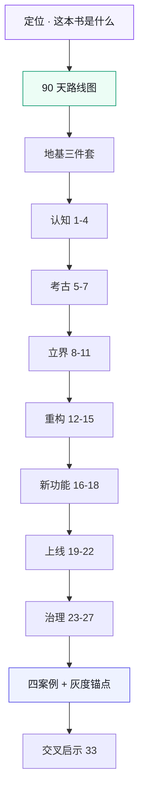

# 《AI 原生软件工程》书稿总览

> 一本关于**组织如何在 AI 失灵时接管**的书。  
> 书名偏 AI 工程，正文主线是治理与责任结构——先读 [这本书是什么](./ch01-这本书是什么.md)。  
> 全书采用"理论中枢 + 四案例平行"架构：第一至七部分是案例中立的第三人称理论框架；第八部分是四个等权案例研究；第九部分是交叉启示与全书收束。

本目录是按《写作宪法》产出的**定位 + 路线图 + 地基 + 正文 + 配套附录**。所有数字、事故、角色立场相互自洽，以 [`ch05-数字清单.md`](./ch05-数字清单.md) 为唯一事实来源。四案例各自独立，数字禁止交叉引用。

**快速入口**

- [这本书是什么](./ch01-这本书是什么.md)  
- [90 天总路线图](./ch02-90天总路线图.md)  
- [附录 K · 一线最小实践包](./ch42-附录K-一线最小实践包.md)  
- [附录 J · AI 系统工程最小面](./ch41-附录J-AI系统工程.md)

**图 TOC-1｜全书骨架** — 定位与路线图在前，理论中枢线性推进，四案例等权，附录可抄。

---

## 全书结构（定位 + 九大部分 + 附录）

### 开篇
- [`ch01-这本书是什么.md`](./ch01-这本书是什么.md) — 定位：治理书不是模型教程
- [`ch02-90天总路线图.md`](./ch02-90天总路线图.md) — 季度作战图与 Day90 验收

### 第一部分 · 认知（第 1–4 章）
- [`ch06-第1章-AI原生不是让AI写代码.md`](./ch06-第1章-AI原生不是让AI写代码.md) — 开篇立场；混乱期数字
- [`ch07-第2章-人在回路.md`](./ch07-第2章-人在回路.md) — 全书立场锚点；AI 失灵六场景 + 跨角色介入矩阵
- [`ch08-第3章-人机分工.md`](./ch08-第3章-人机分工.md) — 三种角色：AI 做可能、人做选择、人做负责
- [`ch09-第4章-AI原生工程栈.md`](./ch09-第4章-AI原生工程栈.md) — 四支柱：契约先行 / 可验证 / 可回溯 / 文档即代码

### 第二部分 · 考古（第 5–7 章）
- [`ch10-第5章-大规模考古画图.md`](./ch10-第5章-大规模考古画图.md) — 大规模仓库盘点；四张图
- [`ch11-第6章-跨团队依赖分析.md`](./ch11-第6章-跨团队依赖分析.md) — 循环依赖、反向依赖、孤儿模块、WIRED/NOT WIRED
- [`ch12-第7章-AI读懂祖传代码.md`](./ch12-第7章-AI读懂祖传代码.md) — 三种考古法；AI 把推测写成确定

### 第三部分 · 立界（第 8–11 章）
- [`ch13-第8章-目标架构.md`](./ch13-第8章-目标架构.md) — 三层划分；依赖单向；边界测出来不是画出来
- [`ch14-第9章-契约先行.md`](./ch14-第9章-契约先行.md) — 三种契约；用 AI 生成、人审核
- [`ch15-第10章-边界变测试.md`](./ch15-第10章-边界变测试.md) — import-linter；不变量；扩展点自动检查
- [`ch16-第11章-留缝.md`](./ch16-第11章-留缝.md) — 核心命题锚点；生成便宜、演化昂贵；留缝五步法

### 第四部分 · 重构（第 12–15 章）
- [`ch17-第12章-数据与日志分家.md`](./ch17-第12章-数据与日志分家.md) — 数据/日志/事件三分家
- [`ch18-第13章-单文件API到router+nginx.md`](./ch18-第13章-单文件API到router+nginx.md) — 单文件拆分；router/service/repository
- [`ch19-第14章-Python立包与迁移.md`](./ch19-第14章-Python立包与迁移.md) — 先稳定再抽取；兼容层双跑
- [`ch20-第15章-前端解耦多端设计系统.md`](./ch20-第15章-前端解耦多端设计系统.md) — 设计令牌即契约；多端统一

### 第五部分 · 新功能（第 16–18 章）
- [`ch21-第16章-聊天功能.md`](./ch21-第16章-聊天功能.md) — 聊天独立成域；风控钩子位
- [`ch22-第17章-多端BFF.md`](./ch22-第17章-多端BFF.md) — 多端 BFF；契约共享一份
- [`ch23-第18章-亿级流量.md`](./ch23-第18章-亿级流量.md) — 大促削峰；多活

### 第六部分 · 上线（第 19–22 章）
- [`ch24-第19章-五层门禁.md`](./ch24-第19章-五层门禁.md) — 软件/数据/策略/交易/风控；不可绕过
- [`ch25-第20章-风控不可绕过.md`](./ch25-第20章-风控不可绕过.md) — 事前/事中/事后三道防线
- [`ch26-第21章-对账灰度回滚监控.md`](./ch26-第21章-对账灰度回滚监控.md) — 对账三层；监控盲区
- [`ch27-第22章-安全合规公开仓库.md`](./ch27-第22章-安全合规公开仓库.md) — 强制留痕；公开仓库四红线

### 第七部分 · 治理（第 23–27 章）
- [`ch28-第23章-提示词工程与归档.md`](./ch28-第23章-提示词工程与归档.md) — 提示词即接口；归档机制；留痕监控边界
- [`ch29-第24章-AI评审与幻觉处理.md`](./ch29-第24章-AI评审与幻觉处理.md) — 幻觉三类型；回答第 2/11/27 章三处遗留
- [`ch30-第25章-文档ADR-RFC-设计令牌治理.md`](./ch30-第25章-文档ADR-RFC-设计令牌治理.md) — ADR / RFC / 设计令牌
- [`ch31-第26章-组织治理.md`](./ch31-第26章-组织治理.md) — 组织治理锚点；委员会、章程、KPI
- [`ch32-第27章-契约治理.md`](./ch32-第27章-契约治理.md) — 契约治理锚点；变更分级、跨团队签字

### 第八部分 · 四案例（第 28–32 章）

> 四个等权案例，各自第一人称独立叙事，统一八节模板。每章 6000-8000 字。

#### 第 28 章 · 灰度发布（理论章，上线治理收束）
- [`ch33-第28章-灰度发布.md`](./ch33-第28章-灰度发布.md) — 灰度发布锚点；分层灰度、自动刹车、回滚矩阵

#### 四个等权案例研究
- [`ch34-案例一-300人电商平台.md`](./ch34-案例一-300人电商平台.md) — 300 人电商平台（契约先行落地）
- [`ch35-案例二-海星交易所.md`](./ch35-案例二-海星交易所.md) — 2300 人加密交易所（精度铁律 + 合规铁律）
- [`ch36-案例三-暗流资本.md`](./ch36-案例三-暗流资本.md) — 32 人 Web3 量化基金（四道闸门 + 安全不变量）
- [`ch37-案例四-守夜人科技.md`](./ch37-案例四-守夜人科技.md) — 10 人 AI 安全智能体初创（权限矩阵 + 协作所有权）

### 第九部分 · 交叉收束（第 33 章）
- [`ch38-第33章-四案例交叉启示.md`](./ch38-第33章-四案例交叉启示.md) — 四案例等权并置；治理三原则的四种加严形态；全书收束

## 地基三件套（章节正文依赖）
- [`ch03-案例时间线.md`](./ch03-案例时间线.md) — 四案例时间线，精确到月/日
- [`ch04-角色设定卡.md`](./ch04-角色设定卡.md) — 四案例角色卡（32+ 角色），每人独立 KPI / 恐惧 / 口头禅
- [`ch05-数字清单.md`](./ch05-数字清单.md) — 四案例各自规模、事故、治理规模，全部自洽虚构

## 配套附录
- [`ch39-附录A-提示词库骨架.md`](./ch39-附录A-提示词库骨架.md) — 50 条组织级 prompt，YAML 结构，含失灵点与介入点
- [`ch40-附录I-契约治理规范模板.md`](./ch40-附录I-契约治理规范模板.md) — 可 fork 即用的契约治理规范
- [`ch41-附录J-AI系统工程.md`](./ch41-附录J-AI系统工程.md) — Eval / 上下文 / 权限 / 成本最小面
- [`ch42-附录K-一线最小实践包.md`](./ch42-附录K-一线最小实践包.md) — 一页可抄的 IC 作战包

## 四案例横向对照

| 维度 | 案例一 电商平台 | 案例二 海星交易所 | 案例三 暗流资本 | 案例四 守夜人科技 |
|------|----------------|-----------------|---------------|-----------------|
| 组织规模 | 300 人 | 2,300 人 | 32 人 | 10 人 |
| 核心红线 | 资金链路 · 多端契约 | 撮合精度 · 合规字段 | 过拟合 · 合约安全 | 智能体权限 · 协作边界 |
| 标志失灵 | D-0114 / E-0311 / F-0515 | X-0719 / Y-0820 | Z-0612 / W-0703 | V-0905 / U-0918 |
| 治理核心 | 契约先行 + 留痕 | 精度铁律 + 合规铁律 | 四道闸门 | 权限矩阵 + 协作所有权 |

## 遗留债务兑现记录

| 提出章 | 遗留问题 | 回答章 |
|--------|---------|--------|
| 第 2 章 | 契约 Owner 谁当 | 第 9 章（9.5 逐域吵一轮）|
| 第 2 章 | AI 能不能自己识别该叫人 | 第 24 章（24.3 统一回答）|
| 第 11 章 | 留缝判定自动化 | 第 10 章（import-linter + 扩展点检查）|
| 第 11 章 | AI 会不会自己留对缝 | 第 24 章（24.3 统一回答）|
| 第 11 章 | 留缝取舍写进 ADR | 第 25 章（25.4 seam-rationale）|
| 第 27 章 | 破坏性变更分级能否 AI 辅助 | 第 24 章（24.3 统一回答）|
| 第 27 章 | 老版本兼容策略 | 第 17 章（17.4）|
| 第 28 章 | 多端回滚同步 | 第 17 章（17.5）|

## 证据真实性边界

四案例全部为**自洽虚构的脱敏示范案例**，不指代任何真实公司或个人。正文引用时不得把案例当作真实记录陈述。数字严禁与 `ch05-数字清单.md` 冲突。案例间数字禁止交叉引用。
