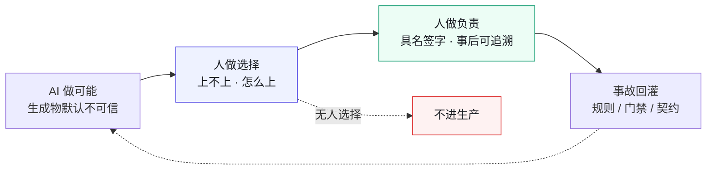
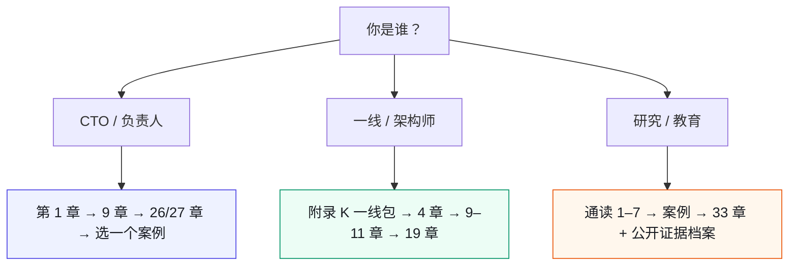

# 这是一本什么书（定位章）

> **本章定位**：全书导航前的定位声明——写清你会得到什么、不会得到什么，以及本书与「AI 提效指南」「Agent 编程书」的边界。
> **核心命题**：你买的不是又一个生产力工具，是**责任的再分配**。

---

## 0.1 一句话

**《AI 原生软件工程》是一本组织治理书，不是一本模型 API 教程。**

它回答的问题是：

> 当 AI 把「写出来」变得几乎免费，组织如何保证「敢上线、出事有人扛、事后可追溯」？

它不回答：

- 某家模型在某 benchmark 上是多少分  
- 如何微调 / 量化 / 自建推理集群  
- 某个 Agent 框架的完整 API  
- 「未来五年 AI 将取代多少程序员」

---

## 0.2 书名与内容的边界（先说清楚）

| 你可能期待的 | 本书实际给的 |
|---|---|
| AI Native = 多写代码、多上 Copilot | AI Native = **围绕「AI 会失灵」重设计流程与责任** |
| 工程 = 系统与代码结构 | 工程 = **系统 + 门禁 + 度量 + 组织签字链** |
| 治理 = 多盖几个章 | 治理 = **把谁负责钉进 CI、矩阵、灰度与对账** |

书名里的 *Software Engineering* 要按**广义工程**读：契约、测试、发布、可观测、文档、组织接口，和代码同等重要。

若你只想要「Agent 怎么写工具调用」，请看附录 J 的最小技术面；正文主线仍是**组织如何接管**。

---

## 0.3 三句口号的工程含义

```
AI 做可能，人做选择，人做负责。
```

| 短语 | 工程含义 | 落到哪 |
|---|---|---|
| AI 做可能 | 生成可以自动、可以很快 | 代码、契约草稿、测试草稿、配置 |
| 人做选择 | 「上不上 / 怎么上」不由模型默认 | 介入点矩阵、破坏性变更签字、灰度阈值 |
| 人做负责 | 出事有名字、有留痕、有回滚 | ADR、审批、对账单、值班 runbook |



**图 0-1｜责任再分配链** — 生成可以是机器的，选择与负责必须是人的；回灌让上一场事故变成下一道的门禁。

[DORA 2025](https://dora.dev/research/2025/dora-report/) 称 AI 是**放大器**：弱系统被放大成更弱，强系统才可能被放大成更强。本书的全部结构，就是在造那个「强系统」。

---

## 0.4 你将得到的五样东西

1. **三原则**：契约先行 · 人在回路 · 留缝留痕  
2. **六失灵**：AI 稳定做不到的六件事 = 组织接管清单  
3. **从考古到治理的九部分路径**：看见系统 → 立界 → 重构 → 门禁 → 治理  
4. **四个等权示范案例**：300 / 2300 / 32 / 10 人，四种加严形态  
5. **可抄作业的附录**：提示词库骨架、契约模板、90 天路线、一线最小包、AI 系统工程最小面

---

## 0.5 你不会得到的五样东西

1. 未核实的行业「大数据」和编造引用  
2. 单一工具软文  
3. 把示范案例包装成真实公司纪实  
4. 「上了 AI 就自动变快」的许诺  
5. 可以绕过人的全自动责任真空

---

## 0.6 证据与叙事边界

| 类型 | 性质 | 用法 |
|---|---|---|
| 四案例 | **自洽虚构脱敏示范** | 学冲突结构与机制，不当地图索引真实公司 |
| 数字 | 以 [`ch05-数字清单.md`](./ch05-数字清单.md) 为准 | 案例间数字禁止交叉引用 |
| 公开锚点 | DORA / NIST / 厂商研究等，见 [公开证据档案](../public-evidence.md) | 支撑理论，不给虚构事故背书 |
| 操作模板 | 可 fork 的清单与骨架 | 按组织风险改阈值，勿原样硬套 |

---

## 0.7 三种读者的「最小路径」



**图 0-2｜最小阅读路径** — 先认身份，再选路径；不必线性读完九部分。

---

## 0.8 检查清单：你适不适合继续读

- [ ] 你已经在用或即将全员开通 AI 编码 / Agent 工具  
- [ ] 你关心「出了事谁签字、怎么回滚」  
- [ ] 你能接受「治理第一笔代价是速度」  
- [ ] 你愿意把边界写进 CI，而不是只写进 wiki  
- [ ] 你不需要本书假装示范案例是真实公司新闻  

五条里中三条以上，继续往下读。若你只想要模型教程，本书会反复让你失望。

---

## 0.9 与公开研究的一句话对照

[DORA 信任研究](https://dora.dev/insights/trust-in-ai/)：严的评审与自动化测试会提高对 gen AI 的信任。  
[NIST AI RMF](https://www.nist.gov/itl/ai-risk-management-framework)：Govern / Map / Measure / Manage。  
本书：用四案例把这些「原则语言」压成**签字链、门禁层、对账与灰度**。

---

> **本章的一句话**：这是一本写给「必须对生产负责的人」的书。**AI 把可能变多了；选择与负责的重量，全压到了人身上——本书只讨论人怎么扛得住。**
