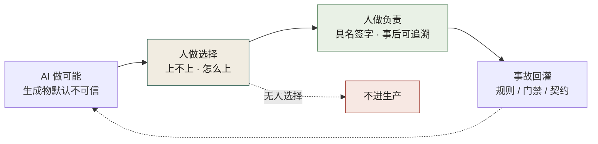
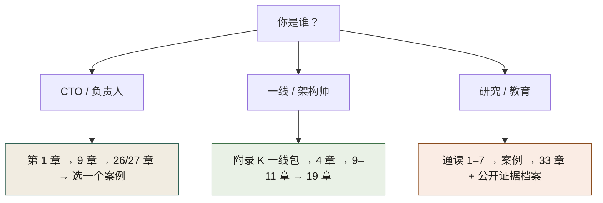

# 这是一本什么书（定位章）

> **本章定位**：全书导航前的定位声明——写清你会得到什么、不会得到什么，以及本书与「AI 提效指南」「Agent 编程书」的边界。
> **核心命题**：你买的不是又一个生产力工具，是**责任的再分配**。

---

## 0.1 一句话

**《AI 原生软件工程》是一本组织治理书，不是一本模型 API 教程。**

它回答的问题是：

> 当 AI 把「写出来」变得几乎免费，组织如何保证「敢上线、出事有人扛、事后可追溯」？

它不回答：

- 某家模型在某 benchmark 上是多少分  
- 如何微调 / 量化 / 自建推理集群  
- 某个 Agent 框架的完整 API  
- 「未来五年 AI 将取代多少程序员」

---

## 0.2 书名与内容的边界（先说清楚）

| 你可能期待的 | 本书实际给的 |
|---|---|
| AI Native = 多写代码、多上 Copilot | AI Native = **围绕「AI 会失灵」重设计流程与责任** |
| 工程 = 系统与代码结构 | 工程 = **系统 + 门禁 + 度量 + 组织签字链** |
| 治理 = 多盖几个章 | 治理 = **把谁负责钉进 CI、矩阵、灰度与对账** |

书名里的 *Software Engineering* 要按**广义工程**读：契约、测试、发布、可观测、文档、组织接口，和代码同等重要。

若你只想要「Agent 怎么写工具调用」，请看附录 J 的最小技术面；正文主线仍是**组织如何接管**。

---

## 0.2b 同一份 PR，两种组织

把边界说明白，最好用同一个场景两头对照。**下面这份 PR 在两类组织里都真实存在**——改动不大：给退款回调补一个金额字段映射，AI 生成，逻辑自洽，单测全绿。

**周三 14:20，评审通过，当天合并。**

| 时点 | 只上工具的组织 | 改了责任链的组织 |
|---|---|---|
| 周三 14:20 | 评审问的是「逻辑通不通」，通 → 合并 | 评审第一问是「契约在哪、Owner 是谁」，答不出即不合并 |
| 周三 14:25 | PR 描述里写着「AI 辅助完成」，没有任务 ID | PR 描述里是 prompt 链接 + 推测清单，推测项标了验证方式 |
| 周四 10:00 | 对账出现差额，开始追人：谁提的？谁审的？模型给的什么？三问都答得出，但都指向**个人**，不指向机制 | 灰度 1% 档刹车命中，自动退回；差额没出账务系统 |
| 周五 | 补数据、写复盘、约定「下次评审仔细点」 | 次日一份 ADR：契约补一个必填字段 + CI 加一条 diff 检查 |
| 三个月后 | 下一次同类事故照旧发生 | 上一场事故变成了这一道的门禁 |

**两边的差别不在模型，在同一晚有没有一条被 CI 引用的契约、一个签过字的人、一条能敲的回滚命令。** 本书案例一的 D-0114（迁移漏字段）就是左边那一列的完整版，金额与影响面以 [`ch05-数字清单.md`](./ch05-数字清单.md) 为准，此处不复述。

右边那一列不需要先建成完整治理体系。它需要的东西，全部在附录 K 的一页纸上。

---

## 0.3 三句口号的工程含义

```
AI 做可能，人做选择，人做负责。
```

| 短语 | 工程含义 | 落到哪 |
|---|---|---|
| AI 做可能 | 生成可以自动、可以很快 | 代码、契约草稿、测试草稿、配置 |
| 人做选择 | 「上不上 / 怎么上」不由模型默认 | 介入点矩阵、破坏性变更签字、灰度阈值 |
| 人做负责 | 出事有名字、有留痕、有回滚 | ADR、审批、对账单、值班 runbook |



**图 0-1｜责任再分配链** — 生成可以是机器的，选择与负责必须是人的；回灌让上一场事故变成下一道的门禁。

图 0-1 里三条实线只是主干，真正决定成败的是两条虚线：选择那一步若没人接（「无人选择」分支），产物直接不进生产；负责若不把事故回灌成门禁，「出事有名字」就停在纸面，上一场坑会再踩一遍。

[DORA 2025](https://dora.dev/research/2025/dora-report/) 称 AI 是**放大器**：弱系统被放大成更弱，强系统才可能被放大成更强。本书的全部结构，就是在造那个「强系统」。

---

## 0.4 你将得到的五样东西

1. **三原则**：契约先行 · 人在回路 · 留缝留痕  
2. **六失灵**：AI 稳定做不到的六件事 = 组织接管清单  
3. **从考古到治理的九部分路径**：看见系统 → 立界 → 重构 → 门禁 → 治理  
4. **四个等权示范案例**：300 / 2300 / 32 / 10 人，四种加严形态  
5. **可抄作业的附录**：提示词库骨架、契约模板、90 天路线、一线最小包、AI 系统工程最小面

---

## 0.4b 从「得到」到「动手」：一页使用协议

上面五样东西不会自己长进你的仓库。**读完一章只允许做一件事，而且必须是往仓库里放文件**——只往会议里放概念的，按没读处理。

先签一页协议（照抄、填空，放进你和团队每天都打开的地方——工单模板、仓内 docs，不只是 wiki）：

```text
我承诺在 __ 月 __ 日前做完一件事：
  动作（动词开头，一句话）：
  产出物落在哪个文件（写仓内路径，不写「写在 wiki 里」）：
  谁签字（人名，不是组名）：
  怎么算完成（一条能被点开的证据：CI 任务名 / PR 链接 / 清单条目号）：
```

再按下表把「得到」翻译成明早的动作（每章只取一行，取满即停）：

| 你读到这 | 明天上午的动作 | 产出物 | 完成判定 |
|---|---|---|---|
| 第 1 章（边界） | 关起门写 20 分钟（时段随意），写下你域「不可碰」前三条 | 清单文件（每条带一个人名） | 别人能凭这份清单在评审里挡住一个 PR |
| 第 2 章（六失灵） | 挑一个失灵，标出它现在靠谁兜底 | 介入点矩阵一行 | 出事时这一行能直接指到一个人 |
| 第 9 章（契约） | 挑一个对外接口，把契约文件路径填进 PR 模板 | PR 模板一版 | 模板的契约一栏不为空 |
| 第 19 章（门禁） | 给你的域加**一条不可绕过**的 CI 检查 | 一条流水线任务 + 一张豁免单模板 | 有人为了绕开它写过一张带日期的豁免 |
| 第 26 章（签字链） | 把「谁在哪一步必须签」画成一页矩阵，贴在看板上 | 介入点矩阵一页 | 每一行都是人名，不是「大家」 |
| 附录 K | 直接执行 K.1b 的 90 分钟 | 一版作战卡 + 一张 PR | 本周内至少一个 AI PR 带了任务 ID |

再给这件事配一个时间盒：**每周固定 45 分钟**，写进日历、与需求评审错开，只做两件事——把上周那一行的产出物推进一格，把下周那一行贴进日历。**没有这 45 分钟，读到第三章你就会停在「有道理」。**

两条自查（都是判断题，不是标准）：

- 你的产出物**能不能被 CI 或工单引用**？只能被人引用 = 三个月后它会消失。
- 你这周的 45 分钟**被需求挤掉过没有**？连续两周被挤掉，说明组织还没打算接管，只打算继续用工具。

---

## 0.5 你不会得到的五样东西

1. 未核实的行业「大数据」和编造引用  
2. 单一工具软文  
3. 把示范案例包装成真实公司纪实  
4. 「上了 AI 就自动变快」的许诺  
5. 可以绕过人的全自动责任真空

---

## 0.6 证据与叙事边界

| 类型 | 性质 | 用法 |
|---|---|---|
| 四案例 | **自洽虚构脱敏示范** | 学冲突结构与机制，不当地图索引真实公司 |
| 数字 | 以 [`ch05-数字清单.md`](./ch05-数字清单.md) 为准 | 案例间数字禁止交叉引用 |
| 公开锚点 | DORA / NIST / 厂商研究等，见 [公开证据档案](../public-evidence.md) | 支撑理论，不给虚构事故背书 |
| 操作模板 | 可 fork 的清单与骨架 | 按组织风险改阈值，勿原样硬套 |

---

## 0.7 三种读者的「最小路径」

先答「你是谁」再翻页：图 0-2 从同一起点分出三条路径——负责人从第 1 章进，一线从附录 K 进，研究者从通读 1–7 章进，各走各的顺序即可，不必线性读完九部分。



**图 0-2｜最小阅读路径** — 先认身份，再选路径；不必线性读完九部分。

---

## 0.8 检查清单：你适不适合继续读

- [ ] 你已经在用或即将全员开通 AI 编码 / Agent 工具  
- [ ] 你关心「出了事谁签字、怎么回滚」  
- [ ] 你能接受「治理第一笔代价是速度」  
- [ ] 你愿意把边界写进 CI，而不是只写进 wiki  
- [ ] 你不需要本书假装示范案例是真实公司新闻  

五条里中三条以上，继续往下读。若你只想要模型教程，本书会反复让你失望。

---

## 0.8b 读没读进去：三个自测与四种假动作

自测不需要考试，**十分钟能做完**。三条线都是经验判断，用来起手，不是标准。

1. **六问自测**：随手挑一笔上周上线的资金 / 权限 / 契约相关变更，按第 2 章 0.1 的六问限时作答。任意两条答不出 = 你读完了，流程一点没改。
2. **名词落地**：在你自己的仓库里全文搜「契约先行」。搜得到被 CI 引用的文件 = 落地；只搜得到 PPT 与会议记录 = 你只是换了套词。
3. **回灌自测**：最近一次与 AI 相关的回滚或事故之后，是否新增了一条门禁、一个契约必填字段或一条不可碰条目，并且你能指出它的提交记录。答不出，放大器就还在放大弱系统（DORA 2025，见[公开证据档案](../public-evidence.md) E1）。

四种假动作，是这类书最常见的四种死法：

| 假动作 | 症状 | 一句话纠正 |
|---|---|---|
| 把书当汇报素材 | 名词进了 PPT，签字链没进 CI | 当场用 0.4b 的「产出物路径」逐条对，说不出路径的删掉 |
| 十个战场并行开 | 一次抄完 90 天甘特，第二周没人管最弱那道门禁 | 只锁 money_path，其余挂账（第 2 章 0.8） |
| 借案例数字当 KPI | 把示范案例的损失金额、一致率写进自己的季度目标 | 案例数字是自洽虚构，只学冲突结构（0.6） |
| 治理抄成表单表演 | 清单、模板都建了，Owner 一栏全空 | 空 Owner 视为未完成，退回重填（附录 K.1 第 2 条） |

> **这本书的完成标志不是你觉得有道理，是你的仓库里多了一个能被 CI 引用的文件。**

---

## 0.9 与公开研究的一句话对照

[DORA 信任研究](https://dora.dev/insights/trust-in-ai/)：严的评审与自动化测试会提高对 gen AI 的信任。  
[NIST AI RMF](https://www.nist.gov/itl/ai-risk-management-framework)：Govern / Map / Measure / Manage。  
本书：用四案例把这些「原则语言」压成**签字链、门禁层、对账与灰度**。

---

> **本章的一句话**：这是一本写给「必须对生产负责的人」的书。**AI 把可能变多了；选择与负责的重量，全压到了人身上——本书只讨论人怎么扛得住。**
