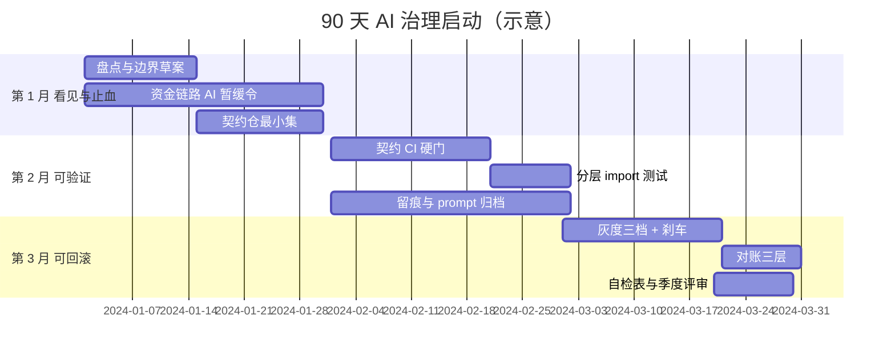
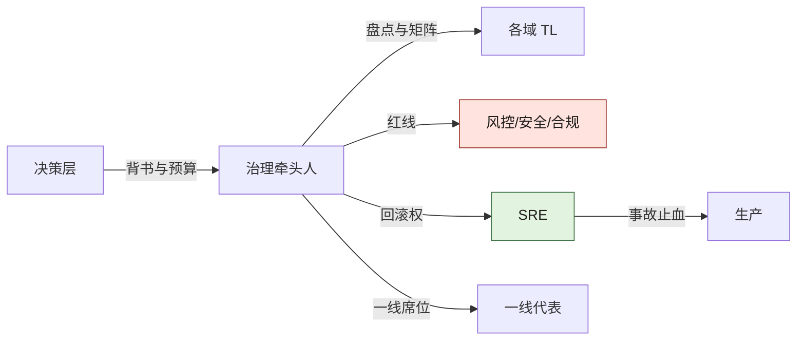
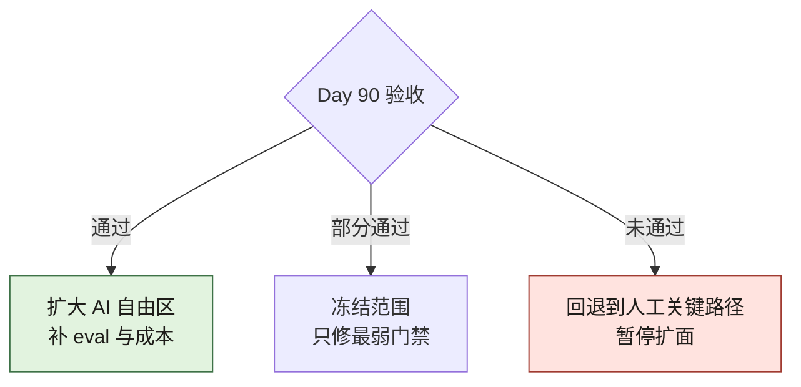
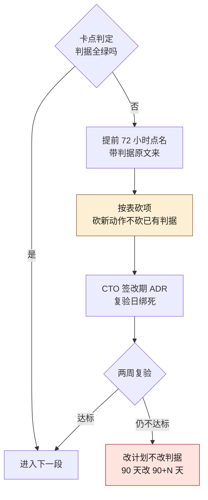

# 90 天总路线图：从 0 到可接管

> **本章定位**：把全书画成一张季度作战图。不替代分章细节，回答「第一个季度每周干什么、谁签字、什么算完成」。
> **核心命题**：治理不能并行开十战场；先让一笔资金相关变更**可追溯、可回滚、可对账**，再扩面。

---

## 0.1 目标状态（Day 90 验收）

随便挑一笔**上周上线的资金/权限/契约相关变更**，10 分钟内答出：

1. 契约在哪、Owner 是谁  
2. 用了哪版提示词 / 哪次生成任务 ID  
3. 门禁结果与谁会签  
4. 灰度比例与刹车阈值  
5. 回滚命令或降级开关在哪  
6. 对账是否跑过、差额多少  

答不出任意两条 → 仍在过渡态，不要扩「全量 AI 自由区」。

---

## 0.2 总览甘特



**图 R-1｜90 天甘特** — 先止血与看见，再可验证，最后可回滚与可复盘。

图 R-1 三个 section 的先后是硬前提：第 1 月没有盘点与暂缓令，第 2 月的契约 CI 就不知道该守哪些接口；第 2 月没建起 prompt 留痕，第 3 月的三档刹车出了问题没人能回溯到生成任务。排期与这三段前提对不上时，先砍排期，别砍顺序。

---

## 0.2b 启动那天的 60 分钟（可抄议程）

甘特图不会自己开工。**第 1 月的成败，基本落在这一小时里**。时段是示意，但别超 60 分钟——超时的会一般是因为没带决策项来。

**必须在场的四个角色**：CTO 或授权人、内定的治理牵头人、一名资金链路所在域的 TL、SRE 值班。缺一个就改期，不要「先开起来回头再对齐」。

| 时段 | 议程 | 必须产出 | 现场一定会出现的话与接法 |
|---|---|---|---|
| 0–10 分 | 念三条：Day 90 六问（0.1）、资金链路暂缓令、牵头人名字 | 全场确认「90 天只交付这三件事」 | 「这不就是走流程？」→ 打开 0.1，逐条问六问里哪一条是填表填出来的 |
| 10–25 分 | 当场打开模块表，逐域问：钱从哪进、从哪出、在哪对账 | money_path 第一批条目 | TL 说「到处都是钱」→ 收敛口径为「用户能感知余额变化的服务」，其余当场挂账不改 |
| 25–40 分 | 把暂缓令翻译成机器能执行的形态 | 一条 CI 检查的名字 + 触发路径清单 | 「先靠自觉」→ 不接受：**没有 CI 或评审硬门的暂缓令，只是一封邮件** |
| 40–55 分 | 给牵头人时间盒 | 写进排期的投入比例与代偿方案 | 「他手上还有两个需求」→ 不减需求就等于没任命 |
| 55–60 分 | 复述三条决定、两处分歧 | ADR 草稿编号 + 下次会议时间 | 分歧没有结论 → 指定裁决人姓名，不允许写「后续对齐」 |

**散会判定**（会后 24 小时内自查，三项缺一就重开一小时、不要往下推甘特）：模块表已建仓且有第一批条目；暂缓公告已发出、且 CI 配置里搜得到那条检查；牵头人的名字每个在场的人都答得出。

---

## 0.3 第 1 月：看见与止血

0.3–0.5 三张表只给动作与产出。每一行的**退出判据**（命令形状与判据行）在 0.5c 集中给出，本周动作是否真做了怎么核对在 0.5d，每条验收挂哪一类机器判据在 0.5e。先读表再读判据没有意义——判据就是表的另一半。

### 第 1–2 周

| 动作 | 产出 | 签字人 | 完成定义 |
|---|---|---|---|
| 仓库/服务盘点 | 模块表（含 money_path） | 治理牵头人 + 各域 TL | 资金链路清单非空 |
| AI 使用边界 v0 | 可碰 / 需审批 / 不可碰 | CTO 或授权人 | 「不可碰」有具名链路 |
| 资金链路 AI 暂缓 | 邮件/公告 + CI 提示 | CTO | 高风险 PR 能被提醒或拦截 |

**不要做**：全员培训三十场、换一堆工具、写长规范不进 CI。

### 第 3–4 周

| 动作 | 产出 | 完成定义 |
|---|---|---|
| 契约仓库最小集 | 仅资金/跨端/对外接口 | 每份契约有 Owner 人名 |
| 介入点矩阵 v0 | 谁在哪步必须签字 | 资金行非空 |
| 事故响应草稿 | 止血优先序 | 「先降级/冻结再查因」写死 |

---

## 0.4 第 2 月：可验证

| 周 | 动作 | 硬门禁 | 代价（预期） |
|---|---|---|---|
| 5–6 | OpenAPI/Protobuf 与实现 diff | 不一致拒绝合并 | CI 时长上升 |
| 7 | 破坏性变更多端 TL 签字 | 无签字不可合 | 评审积压可能先升后降 |
| 8 | Python/分层 import-linter | 违规编译失败 | 历史违规进白名单消化 |
| 全月 | AI PR 附 prompt/任务 ID | 先警告后阻断 | 留痕率爬坡 |

**第 2 月结束标志**：新代码架构违规率可度量且下降；契约一致率周报能出数。

---

## 0.5 第 3 月：可回滚与可复盘

| 周 | 动作 | 验收 |
|---|---|---|
| 9–10 | 灰度 1% / 10% / 50% 三档 | 每档有自动刹车指标 |
| 11 | 迁移必须成对回滚脚本 | 缺回滚包不让上 |
| 11 | 对账：字段完整性 + 数值 + 趋势 | 资金变更次日有对账结果 |
| 12 | 自检表进评审 | 结果挂钩下季度治理资源 |

---

## 0.5b 第 6–8 周那场豁免谈判（场景）

这张路线图真正的考验不在启动会，在第 7 周。

**场景**：大促前两个多星期，某域 TL 手里一条 PR 被契约 diff 门禁挡了两天多——改的是跨端接口的一个可选字段。他先找了三个地方：

1. 群里问「这个字段其实没人用，能不能先放过」——治理组答不了，因为**「谁在用」是事实问题，答案在下游仓库里，不在会议室里**；
2. 找 SRE，SRE 说门禁归治理，回滚归我；
3. 最后走到 CTO 门口，带了一句话：「就这一次，业务等不起。」

**这一周治理组被要求做次数最多的一件事，不是加门禁，是批豁免。** 而豁免一旦变成口头同意，第 2 月建立的硬门就在组织记忆里永久消失了——下次所有人都问「上次不是也放了吗」。

可抄：把豁免做成一张有失效期的 ADR，一次一页。

```text
豁免 ADR-__：
  被绕开的门禁：（写 CI 任务名，不写「契约检查」这种泛称）
  为什么现在绕：（业务事实；「时间紧」不构成理由）
  影响半径：（涉及的资金 / 权限 / 契约面，逐条列；写「无」要给出依据）
  补偿措施：（三选一以上：人工对账频次 / 追加具名评审人 / 灰度上限下调）
  失效日期：（具体日期；到期自动恢复门禁，不写「上线后」）
  签字：CTO 或授权人 + SRE + 该域 TL（三个名字，缺一个不生效）
```

**回到那单 PR，它的结局值得记**：因为要凑齐三个签字，PR 又多等了半天，TL 第一次发现门禁的成本不在 CI 里、在组织里；补偿措施选的是「人工对账跑一周 + 灰度上限压到 1%」；到期日那天门禁自动回来了，没有人再讨论要不要撤。**豁免单的作用不是放行，是把破例变成一次带名字、会过期的登记。**

> **代价声明**：这张表本身就是代价——每个豁免多出半天到一天的等待。如果你算下来「走豁免比修契约还慢」，那正是设计意图：慢的那部分，是上一次没让 AI 跨上下文所带来的债，只能在今天还。

---

## 0.5c 每周的退出判据：命令形状、判据行与刷坏方式

0.3–0.5 的表写了「契约一致率周报能出数」「不一致拒绝合并」，但没写出这条判据长什么样。本节逐周补齐：**CI 任务名 + 命令形状 + 失败时日志里唯一合法的那一行 + 这一条会被怎么刷坏 + 反向检查**。三条口径先说定：

- 退出判据必须可 grep。落不进日志行的判据是会议，不是门禁。
- 本节的命令都是这 90 天里你要建的门禁的**落地形状**，不是已跑过的读数；唯一标注「本机实跑」的是 0.5e 里本书书稿仓库那条。
- 判据行的内容你的实现者可以定，**形状本节钉死**：标签开场、后接「哪个变更、对哪份账、缺哪一项」三类字段——缺一类，这行就不足以指认现场。

### 第 1–2 周：暂缓令长出机器牙齿

0.3 表里第三行的完成定义是「高风险 PR 能被提醒或拦截」——「能被拦截」的机器形态，就是一个 required check：

```bash
# CI job: money-path-freeze（每个 PR 触发；账本就是第 1–2 周那份盘点表）
python3 ci/money_path_guard.py --ledger inventory/money_path.csv --diff "$BASE..HEAD"
```

判据行（拒绝合并时日志里必须出现的唯一形状）：`MONEY-PATH-FREEZE deny file=<命中路径> ledger_row=<盘点表行定位>`。

- **什么才算做完了**：暂缓公告发出的同一天，这个任务的历史里有一条 deny——首次 deny 允许来自一次故意撞上去的测试 PR，不许等真人来撞。
- **会被怎么刷坏**：盘点表建了、money_path 列也建了，但整列是空的——守卫全天在跑，匹配集合为空，绿灯是假的；或者匹配规则被改成「PR 标题含关键词」，路径命中变成文案命中。
- **反向检查**：周报把「money_path 列非空行数 / 总行数」与一致率并排；再用一个命中账本的路径提交空变更，**它必须红**——撞不红的门禁等于没建。

### 第 3–4 周：契约 Owner 是字段不是散文

```bash
# CI job: contract-owner-check（契约仓每次 push 触发；每周对全仓巡检一次）
python3 ci/contract_owner_check.py --contracts contracts/ --require named-owner --resolvable
```

判据行：`OWNER-MISSING contract=<契约文件路径> reason=<字段缺失|填的是团队名|解析不到在职身份>`。

- **什么才算做完了**：存量契约的 OWNER-MISSING 清零当周，新增契约的这条检查进 required check——不绿不合。
- **会被怎么刷坏**：Owner 写在契约文档的散文段里，机器读不到；或整仓 Owner 统一填一个组名，格式合法、无人可叫。
- **反向检查**：`--resolvable` 这一半才是牙齿——每个 Owner 要能解析到在职身份（邮箱或目录链接打得开）。案例四的教训正挂在这一周：修复体与检测体的规则无契约、无人认领，才有了 V-0905（案例四，两个智能体互相「修」掉了对方的成果）。

### 第 5–6 周：契约 diff 硬门

```bash
# CI job: contract-diff（改到已纳管接口的 PR 触发；纳管名单在 scope 文件里）
python3 ci/contract_diff.py --spec contracts/ --impl "$SERVICE" --scope-file ci/contract_scope.yaml
```

判据行：`CONTRACT-DIFF FAIL endpoint=<方法+路径> field=<字段名> expected=<契约侧> got=<实现侧>`。

- **什么才算做完了**：这条判据行能拒绝合并（在分支保护的 required checks 里，不是允许列表里），且周报第一次出数。
- **会被怎么刷坏**：0.7b 第一行写过的分母戏法在这里发生——把最常失败的接口移出 `contract_scope.yaml`，一致率立刻上升、纳管数悄悄下降；或把 job 从阻断改成警告但仍显示绿。
- **反向检查**：同一个 job 每次顺手多打一列 `CONTRACT-SCOPE covered=<已纳管端点数>`，两个数同屏才算出数；覆盖数环比下降按红灯处理。E-0311（案例一）的根因是「改实现绕契约仓」——绕路径要判为红线而不是缺测试。

### 第 7 周：破坏性变更的多端会签

```bash
# CI job: breaking-signoff（消费方名单由仓库侧维护，提交人无权自报）
python3 ci/breaking_signoff.py --pr "$PR" --consumers-file ci/consumers.yaml
```

判据行：`BREAKING-REVIEW-MISSING endpoint=<方法+路径> waiting_on=<已登记消费方中未签的具名签字位>`。

- **什么才算做完了**：本周任何打了破坏性标签的已合并 PR，都能列出全部消费端 TL 的签字记录，且每条签字的时间戳**早于**合并时间戳（第 2 章的伪介入判据，见 [第 2 章](./ch07-第2章-人在回路.md)）。
- **会被怎么刷坏**：「破坏性」标签由提交人自贴——0.5b 那单 PR 的第一次尝试就是这一形；或者 `consumers.yaml` 半年没更新，签齐了一串幽灵端。
- **反向检查**：机器按契约兼容规则自动判破坏性（字段从有到无、类型收紧），**自报与机判不一致的 PR 直接红**；消费方名单每季度与下游仓库的使用扫描对账一次（对账方法在第 27 章，见 [第 27 章](./ch32-第27章-契约治理.md)）。

### 第 8 周：分层守卫与只减不增的白名单

```bash
# CI job: layering —— import-linter 契约 + 白名单棘轮
lint-imports --config .importlinter
python3 ci/whitelist_ratchet.py --baseline ci/layering_baseline.json
```

判据行两条：`LAYERING-VIOLATION contract=<契约名> <源包> -> <目标包>`（新增违规即红）与 `WHITELIST-GROW baseline=<基线违规数> current=<当前违规数>`（当前大于基线即红）。`lint-imports` 的判据形状按第 8 章 import-linter 卡（B 档，本书未在本机跑过）写，抄进流水线之前自己先跑一遍。

- **什么才算做完了**：违规会红是上半周的事；下半周看的是基线提交记录里违规数**逐周下降**。
- **会被怎么刷坏**：每周重新生成基线，把当前违规「合法化」——那不叫消化，叫洗白；或者给文件逐个挂豁免注释，豁免本身没有失效期。
- **反向检查**：棘轮脚本对比的是 git 历史里的上一版基线，白名单 diff 的增长行要打印在 job 输出最上面；豁免条目必须带具名 Owner 与失效日期，过期未处理即红。

### 第 9–10 周：三档灰度的刹车必须咬过

```bash
# 每次发布触发：发布参数与灰度策略逐档核对
python3 ci/brake_check.py --release "$REL" --policy deploy/brake_policy.yaml
```

判据行两条：配置侧 `BRAKE-METRIC-UNBOUND stage=<1%|10%|50%> metric=<未绑定的刹车指标名>`；动作侧 `BRAKE-TRIGGERED stage=<档位> metric=<指标> action=<刹车动作>`。

- **什么才算做完了**：两处都齐——发布参数逐档与策略文档一致，且每个新绑的刹车在本周有一次**真实触发记录或预发演练触发记录**。
- **会被怎么刷坏**：这是全路线图上最安静的一种假完成——三档方案写在方案文档里，发布平台的参数根本没动；或者阈值调宽到永不触发，「自动刹车 0 次」被当成绩报上去（0.7b 的自动刹车一行点过名）。
- **反向检查**：预发环境注入一次漂移指标，日志里必须见到那条 `BRAKE-TRIGGERED`；没咬过的刹车不算装好。演练记录进第 28 章的台账口径（见 [第 28 章](./ch33-第28章-灰度发布.md)）。

### 第 11 周：回滚成对 + 次日对账

```bash
# 发布流水线：迁移与回滚脚本双向配对（可跑的检查器形状见第 21 章 21.5b，那节本机实跑）
# Nightly job: recon-daily —— 独立部署，不挂发布流水线（第 21 章的独立性纪律）
python3 ci/recon_daily.py --ledger "$LEDGER_DB" --source "$BIZ_DB" --window last-day
```

判据行三种：`ROLLBACK-PAIR-ORPHAN migration=<迁移文件>`（双向孤儿任一即红）、`RECON-FIELD-MISSING table=<表> field=<字段>`（第一层）、`RECON-DIFF window=<日期> nonzero=<差额>`（第二层，金额非零即标记）。

- **什么才算做完了**：本周每一个上线的资金相关迁移，次日早上有一份三层齐全的独立对账记录——不是流水线日志里的一行绿。
- **会被怎么刷坏**：对账任务挂在发布流水线里，流水线一失败整段跳过，「本周对账正常」其实是「本周没跑对账」；或者周报里的「对账通过」只算了第二层数值，第一层字段完整性根本没配。
- **反向检查**：每季度往预发注一次「新表少一个字段」的场景，第一层必须红——D-0114（案例一，迁移漏了 `refund_amount`）就是这道演练题的固定标的；红不了的版本，就是第 21 章 21.1 里那个「对账与监控同时失明」的版本。

### 第 5–8 周全月：AI PR 留痕从警告切阻断

```bash
# CI job: trace-check（先警告模式出数，阻断切换单独走 ADR）
python3 ci/trace_check.py --pr "$PR" --fields prompt_ref,task_id
```

判据行：`TRACE-MISSING pr=<编号> field=<两个字段名之一>`。

- **什么才算做完了**：切换动作本身有据可查——警告转阻断的那天有一条 ADR，CI 配置的 required 状态 diff 就是「先警告后阻断」里「后」字的实体。
- **会被怎么刷坏**：字段全填、填的是同一个群链接或模板占位文本；留痕率在报表里爬坡，抽查时链接打不开（0.7b 第二行）。
- **反向检查**：周随机抽若干条真点开，追到生成任务才算留痕；`TRACE-MISSING` 的判定写死「字段非空**且**链接可达」两半。

### 第 12 周：自检 = 把前 11 周的判据重跑一遍

第 12 周的验收不是新门禁，是对整条链的重跑：

```bash
# Quarterly job: governance-recheck —— 逐周逐 job 核对「本季真执行过」
python3 ci/governance_recheck.py --since quarter-start --jobs ci/jobs.yaml
```

判据行：`CHECK-MISSING week=<周次> job=<CI 任务名>`——某周的门禁整个季度没执行过记录，这一行就是证据。

- **什么才算做完了**：对上周任意一笔资金相关变更答 0.1 六问，每条答案带三个链接（PR、CI 原始日志、签字记录），当场点开。
- **会被怎么刷坏**：自检表由牵头人一人代填、不附日志链接；「随便挑一笔上周上线的变更」被现场执行成「挑上周最太平的那笔」。
- **反向检查**：抽样由非治理组角色跨天执行（一线代表或 SRE 值班），链接任一点不开，对应周次的退出判据作废、回到 0.9b 的未达标程序。

---

## 0.5d 最容易假装做完的动作：缺哪个 artifact 就没做完

上面的判据行有一个共同前提：job 写了、还挂了 required。造假完成往往藏在更早一步——artifact 在 CI 之前就不存在。周会收尾按这张表逐行对，**缺哪行的 artifact，哪周就不收口**：

| 周次 | 动作 | 最常见的「看起来做了」 | 缺了即没做完的 artifact | 怎么核对存在 |
|---|---|---|---|---|
| 1–2 | 暂缓令 | 全员邮件发了，没人反对 | 测试 PR 上第一条 deny 记录 | 去 CI 任务历史拉，贴回公告正文 |
| 1–2 | 盘点 | 表格建了，money_path 列也建了 | 非空率读数与若干行逐字样例 | 非空率与总行数同屏（0.7b 分母规矩） |
| 3–4 | 契约仓 | 仓开了，接口清单贴进去了 | 每份契约的机器可读 Owner 字段 | `contract-owner-check` 的零报行周报告 |
| 5–6 | 契约 diff | 规范文档发布，群里都学了 | 主干分支保护里名为 `contract-diff` 的 required check | 保护规则查询结果，文档不算数 |
| 7 | 破坏性会签 | 群里 TL 回了「同意」 | 逐消费端签字记录 + 时间戳 | 签字时间戳与合并时间戳比对 |
| 8 | 分层守卫 | 装了 import-linter，全绿 | 基线文件在 git 历史里逐周变小的 diff | 棘轮脚本对比上一版基线 |
| 9–10 | 灰度三档 | 三档方案写在发布文档 | 发布平台参数与策略文档一致的 diff 记录 | `brake_check` 每次发布都跑 |
| 11 | 成对回滚 | PR 描述里写了「可回滚」 | 仓库里成对存在的回滚脚本文件 | 配对检查器输出（第 21 章 21.5b） |
| 11 | 对账 | 周报里一句「对账正常」 | 独立任务近一周逐日运行记录 + 第一层结果行 | 运行记录缺一天，周报缺一天 |
| 全月 | PR 留痕 | PR 模板里字段有了 | 真链接可打开并追溯到生成任务 | 周抽查，抽中点开才算 |
| 12 | 自检表 | 表收上来了 | 逐条附 PR / CI 日志 / 签字三类链接 | 任一链接打不开，对应行未过 |

表底下压一条通则：**会议纪要里没有链接的，等于没发生；门禁没有过一条红色记录的，等于没建**——第一条红要么来自线上有人真撞，要么来自你故意去撞（0.5e 的演练纪律），「没人撞过所以全绿」不在选项里。

---

## 0.5e 治理动作 → 机器判据：谁来核，以及核不了时算什么

五类机器判据（契约 diff、结构 lint、覆盖率、对账、留痕率）是全书各章的通用语言；90 天里的每条验收都要认领其中一类，否则它只是组织记忆。逐条认领：

| 验收（按出现顺序） | 认领的判据类 | 判定物 | 判据没落地时，这条验收算 |
|---|---|---|---|
| 暂缓令可拦截（1–2） | 契约 diff 族变体：账本即契约 | PR 路径命中盘点表 | 自证：一封邮件 |
| 契约有具名 Owner（3–4） | 留痕率族变体：字段存在且可解析 | Owner 字段 + 身份解析 | 自证：一段散文 |
| 契约一致率（5–6） | 契约 diff | 实现与契约双向比对 | 无法自证——出不了数直接走 0.9b |
| 破坏性会签（7） | 留痕率族变体：签字记录 + 时序 | 签字时间戳早于合并 | 自证：一次群回复 |
| 架构违规率（8） | 结构 lint | import 图对分层契约 | 自证：评审感觉 |
| 门禁测试质量（5–11 随建随挂） | 覆盖率 | 行/分支/断言三档各出读数（第 10 章口径） | 半自证：一条绿线会骗人 |
| 灰度刹车会咬（9–10） | 对账族变体：文档与实际对账 | 档位参数一致 + 触发记录 | 自证：一份方案 |
| 回滚成对（11） | 对账族变体：双向孤儿检查 | 文件名配对检查器 | 自证：PR 描述 |
| 三层对账（11） | 对账 | 字段、数值、趋势各有判据行 | 无法自证——缺第一层就是第 21 章 21.1 写过的失明 |
| PR 留痕（全月） | 留痕率 | 字段非空且链接可达 | 自证：勾了没填 |
| 季度自检（12） | 全部——重跑前 11 周 | 每条判据的本季执行记录 | 无法自证——这就是它存在的意义 |

**「算自证」不是骂人，是要明写**：表里凡是「自证」行，在对应周的周会纪要里必须原样写「本周该验收无人机器核，凭 <具名的人> 的口头确认收口」。哪天事故复盘要找到「谁说的算」，这一行就是组织记忆里留到最后的东西。

落地顺序三条纪律：

- **先单文件判据，再跨仓判据，最后时间轴判据。** 留痕字段非空是单文件的，第 5 周就能跑；契约 diff 要两个仓的数据；趋势对账与刹车演练要时间窗口。倒序落地，第 6 周还没人见过一条红色判据，治理组就输了。
- **没有机器判据的三条，用「首次真碰撞」验收。** 边界文档 v0 的具名链路、介入点矩阵、事故响应草稿，90 天里没有对应机器判据——别急着为它们建 CI，先证明被真用过一次（一次实际拦截、一次实际按矩阵叫人、一次实际演练），用不上的承认是草稿。
- **每条判据落地前，故意撞红一次再挂 required。** 这是全书第 19 章的口径：没被故意触发过的门禁，等于不知道存不存在（见 [第 19 章](./ch24-第19章-五层门禁.md)）。

这本书的书稿仓库自己就是本节的最小标本：全书的写法纪律（图号全书唯一、判据行可 grep、「本机实跑」不许编）各自挂着一支 `scripts/check_*.py` 守卫，红就退出码 1，改到绿才算收口。**本机实跑**：本书仓库故意植入一个与既有图号撞号的文件跑 `check_figures.py`，它打印两条报红，摘第一条与退出码——临时文件读数后即删：

```bash
$ python3 scripts/check_figures.py
```

```text
 - 图 R-1 撞号 2 处（全书图注必须唯一）→ ch02-90天总路线图「90 天甘特」、ch99-临时撞号试验「撞号试验」
EXIT=1
```

这一行就是所有退出判据的模板：撞了哪个编号、两处图注在哪、各自标题——一行之内的信息够任何人去修，不需要问作者。「撞号 2 处」这个数由那次运行自己打印，不抄进任何文档——抄件当天就会少报，这是数字清单开头那条派生纪律的同一件事。

---

## 0.6 角色负荷（避免一人扛）



**图 R-2｜角色负荷** — 治理牵头人不「多盖一个章」，而是把已有权力收拢到可对齐处。

数一数图 R-2 里牵头人射出的箭头：盘点与矩阵归各域 TL、红线归风控安全合规、回滚权归 SRE、席位给一线代表，决策层只负责背书与预算——若日后「审批」和「评审」两类事频繁落到牵头人本人头上，就是这几条箭头又回卷成了一个人。

---

## 0.7 指标仪表盘（最小字段）

| 指标 | 定义 | 频率 | 谁看 | 起步健康带 |
|---|---|---|---|---|
| 契约一致率 | 实现与契约 diff 通过占比 | 周 | 委员会 | ≥95%（终态） |
| AI PR 留痕率 | 附 prompt/任务 ID 占比 | 周 | 治理组 | 先爬坡再 >90% |
| 评审积压 | PR 等待会签时长 | 周 | 治理+TL | 峰值后回落 |
| 事故率 | 与 AI 相关生产事故 | 月 | 全员 | 相对基线下降 |
| MTTR | 告警→止血完成 | 月 | SRE | P50 ≤30min |
| 自动刹车次数 | 灰度触发 | 周 | SRE+业务 | 0 过松 / 过高需调参 |

> 厂商效能数字（如 [GitHub × Accenture](https://github.blog/news-insights/research/research-quantifying-github-copilots-impact-in-the-enterprise-with-accenture/) 的 PR/构建变化）只能作外部参照，**不能替代你自己的基线**。

---

## 0.7b 每个指标怎么取数、会被怎么刷坏

「起步健康带」只有配上一条取数口径和一个刷坏姿势，才可执行。逐条补齐：

| 指标 | 从哪取数（当场能做） | 会被刷坏的方式 | 补一句判读 |
|---|---|---|---|
| 契约一致率 | CI 契约 diff 步骤的通过率；分母限定为「本周期改到已纳管接口的 PR」 | 把最容易失败的接口移出「已纳管」名单——分母自己变小，数字立刻好看 | 与纳管覆盖率成对报：覆盖率降而一致率升，按红灯处理。≥95% 是终态参考（案例一到过 97.4%，见数字清单），**不是第 6 周该够的线** |
| AI PR 留痕率 | 判定写死为「字段非空且链接打得开」，脚本周跑 | 模板全勾、正文留空；或统一填一个群链接 | 每周随机抽 5 条真点开。**案例一是从 0% 走到 94%——94% 是结果不是起手目标，第 5–8 周非零就算合格** |
| 评审积压 | PR 创建到首次会签的时间差，P50 与 P90 都记 | 只报均值，把最慢的长尾藏起来 | P90 才是 TL 的真实痛感；案例一 3.1 天降到 1.0 天是终态。「峰值后回落」这条线是拍的，用于起手 |
| MTTR | 告警触发 → 止血完成；止血与查因两段分开记 | 把「止血完成」偷换成「重启完成」，或把查因时间混进来 | 定义里写死两列，谁都不许合并成一个数。P50 ≤30min 是本书给的经验阈值，按你的值班结构改 |
| 自动刹车次数 | 灰度放量被自动回退的次数 | 把阈值调宽——永远不触发，看起来最干净 | 0 次要分两种：真没异常，还是刹车根本没咬住。**做一次回滚演练验证它会咬**；这条只能人判，别做成 KPI |
| 事故率 | 与 AI 相关的生产事故数，逐条按 0.1 的六问归因 | 「这条不算 AI 相关」的自由裁量 | 分母固定为全部事故，并同时报绝对数（相对基线=100 的算法见数字清单） |

两条使用规则：

- **前 4 周只出趋势、不出排名，且一律团队级聚合**。一旦进个人 KPI，上表每一行的刷坏姿势都会立刻出现（见 0.8）。
- **任一指标连续两周没有因为它而改变过一次决定**（放量、回滚、加门禁、排人力），它就是壁纸：要么补一条门禁让它咬得住，要么承认没用、从表里删掉。

---

## 0.8 常见失败路径

| 失败 | 症状 | 纠正 |
|---|---|---|
| 只买工具不建门禁 | 事故率与提交量齐涨 | 立刻暂停资金链路 AI |
| 全量盘点不收口 | 三个月还在画图 | 只锁 money_path |
| 门禁可豁免 | 进度一紧就跳过 | 豁免必须 ADR + 时限 |
| KPI 进个人 | 一线反弹、留痕造假 | 团队级聚合 |
| 没有回滚包 | 迁移上线即单向门 | CI 检查成对脚本 |

这张表列的是症状；「卡点没达标之后，接下来两周具体做什么」的操作顺序在 0.9b——失败路径与回退操作是同一本账的两页：前者是查出来的病，后者是提前排好的抢救流程。

---

## 0.9 90 天后的分叉



**图 R-3｜分叉** — 扩面是验收结果，不是日历结果。

图 R-3 的三条分支只认 0.1 六问的验收结果：全过才开「扩大 AI 自由区」，部分通过就冻结范围只修最弱门禁，未通过就回退人工关键路径。到 Day 90 不敢选「冻结」或「回退」那两条，说明扩面被当成了日历程序，而不是校验结论。**而选了「冻结」或「回退」之后干什么，0.9 没有写——那是 0.9b 的全部内容。**

---

## 0.9b 没达标之后那两周：收敛、砍项、时间盒、复验

Day 30、Day 60、Day 90 三个卡点各对应 0.2 甘特的一段。卡点没达标时，最常见的两种反应都不对：一种是「加班赶完」（赶出来的门禁没撞过红，等于没建），另一种是「下次再说」（组织记忆从此知道这条线可以不认）。图 R-4 给的是第三种：**按固定顺序走完两周，再复验。**



**图 R-4｜卡点未达标的两周操作** — 提前点名、带判据原文、照表砍项、ADR 绑复验日；期限可滑，判据不豁免。

四步顺序固定，哪一步都不能因为赶时间跳过：

1. **提前 72 小时点名，不搞突袭。** 卡点评审 3 天前把「预计不达标的判据行原文」发给 CTO 与涉及域 TL——通知里没有机器判据原文，视为没通知，会议可推迟，未达标事实不可推迟。
2. **带着判据输出开会，不带幻灯片。** 每个缺席的 required check、每条空转的守卫，现场打开 CI 任务历史。谁的门禁这一周没红过也没绿过，先回答「它这周执行过吗」——答不出，本周议题就是它为什么隐形。
3. **砍项照表执行，原则一条：砍新动作，不砍已有判据。** 已有的判据是上一个月用代价换来的地基；拆地基赶工期，下一个月的数字就没有能钉住它的柱子。新动作（扩面、培训、选工具）延后的代价是进度可见性，地基延后的代价是整季自证。
4. **改计划当场签成 ADR，复验日写死在两周后。** 由 CTO 签，带失效日期；两周后复验仍不达标，动作不是「再来两周」，是把 90 天目标改写成 90+N 天并全员通报——N 由 CTO 定，但 **0.1 六问不豁免，只延期**。滑期可以，滑标准不行。

| 卡点 | 未达标长什么样 | 谁被叫来 | 砍哪一项 | 为什么砍它而不是别的 |
|---|---|---|---|---|
| Day 30 | 暂缓令撞不红；盘点表 money_path 列大面积为空 | 治理牵头人、涉事域 TL、写那条 CI 的人 | 全员培训、工具选型、边界文档润色 | 这三样不产出第 2 月硬门所需的任何判定对象；暂缓令机判与盘点行质量直接决定契约 CI 有没有分母——分母没了，第 5 周的一致率无处可算 |
| Day 60 | 契约一致率出不了数，或出数但纳管端点数在缩水 | 纳管接口所属域 TL、多端负责人 | 新纳管接口（分母收缩到跑得动 diff 的资金链路）、import-linter 白名单消化节奏 | 宁可分母小而出数真，不可分母大而出数假——0.7b 第一行的刷坏方式就长这样；白名单是历史债，晚两周消化不新增债，假一致率每天都在新增债 |
| Day 90 | 刹车从未真实咬过；对账只有数值一层；留痕链接点不开 | SRE 值班、风控负责人、CTO | 扩大 AI 自由区、新门禁立项、一切「下季度再说」的评估 | 图 R-3 的「回退」分支说的就是这个：自由区是验收结果不是日历权利；这三条恰是「看起来治理在前进」的装饰品，砍掉它们，剩下的才是出事故时真能接住东西的那几根柱子 |

复验通过之后，被砍的那一项要重新排进下一个时间盒，不许「顺势不再提」——砍项是排程动作，不是路线修正；每次改期 ADR 里那句「复验日」，就是它回来的地方。

---

## 0.10 检查清单

- [ ] 你是否指定了一名治理牵头人且给足时间盒？  
- [ ] 资金/权限链路的「不可碰」是否有具名？  
- [ ] 第 2 月是否有至少一条**不可绕过**的 CI？  
- [ ] 第 3 月是否有回滚演练记录？  
- [ ] 指标是否团队级、非惩罚性？  
- [ ] 每周的退出判据，你当场说得出那条可 grep 的行吗？说不出 → 回 0.5c，那周按自证处理。  
- [ ] 卡点未达标时，砍哪一项你提前写在表里了吗？没有 → 回 0.9b，现场砍的一定是最不该砍的。  
- [ ] 90 天后敢不敢「冻结扩面」？不敢 = 一直在赌。

---

> **本章的一句话**：90 天不是把治理做完，是把「AI 失灵时组织接得住」的最小回路跑通。**先可追溯、可回滚、可对账，再谈更宽的自由区。**
