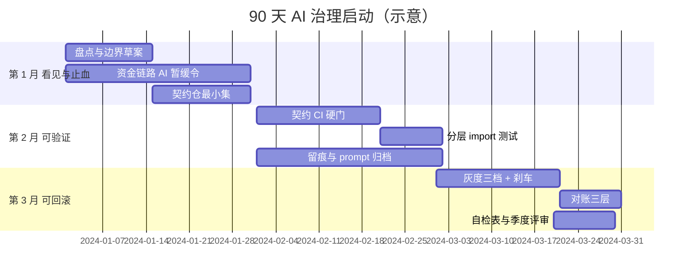
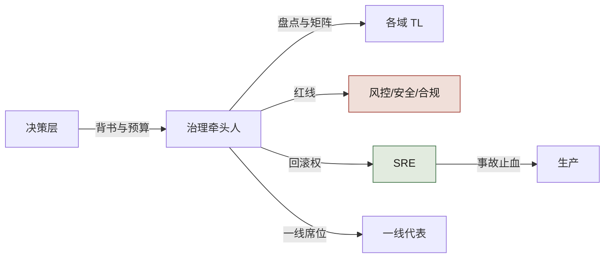
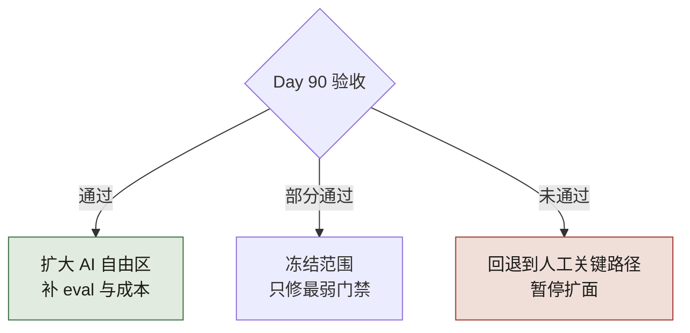

# 90 天总路线图：从 0 到可接管

> **本章定位**：把全书画成一张季度作战图。不替代分章细节，回答「第一个季度每周干什么、谁签字、什么算完成」。
> **核心命题**：治理不能并行开十战场；先让一笔资金相关变更**可追溯、可回滚、可对账**，再扩面。

---

## 0.1 目标状态（Day 90 验收）

随便挑一笔**上周上线的资金/权限/契约相关变更**，10 分钟内答出：

1. 契约在哪、Owner 是谁  
2. 用了哪版提示词 / 哪次生成任务 ID  
3. 门禁结果与谁会签  
4. 灰度比例与刹车阈值  
5. 回滚命令或降级开关在哪  
6. 对账是否跑过、差额多少  

答不出任意两条 → 仍在过渡态，不要扩「全量 AI 自由区」。

---

## 0.2 总览甘特



**图 R-1｜90 天甘特** — 先止血与看见，再可验证，最后可回滚与可复盘。

图 R-1 三个 section 的先后是硬前提：第 1 月没有盘点与暂缓令，第 2 月的契约 CI 就不知道该守哪些接口；第 2 月没建起 prompt 留痕，第 3 月的三档刹车出了问题没人能回溯到生成任务。排期与这三段前提对不上时，先砍排期，别砍顺序。

---

## 0.2b 启动那天的 60 分钟（可抄议程）

甘特图不会自己开工。**第 1 月的成败，基本落在这一小时里**。时段是示意，但别超 60 分钟——超时的会一般是因为没带决策项来。

**必须在场的四个角色**：CTO 或授权人、内定的治理牵头人、一名资金链路所在域的 TL、SRE 值班。缺一个就改期，不要「先开起来回头再对齐」。

| 时段 | 议程 | 必须产出 | 现场一定会出现的话与接法 |
|---|---|---|---|
| 0–10 分 | 念三条：Day 90 六问（0.1）、资金链路暂缓令、牵头人名字 | 全场确认「90 天只交付这三件事」 | 「这不就是走流程？」→ 打开 0.1，逐条问六问里哪一条是填表填出来的 |
| 10–25 分 | 当场打开模块表，逐域问：钱从哪进、从哪出、在哪对账 | money_path 第一批条目 | TL 说「到处都是钱」→ 收敛口径为「用户能感知余额变化的服务」，其余当场挂账不改 |
| 25–40 分 | 把暂缓令翻译成机器能执行的形态 | 一条 CI 检查的名字 + 触发路径清单 | 「先靠自觉」→ 不接受：**没有 CI 或评审硬门的暂缓令，只是一封邮件** |
| 40–55 分 | 给牵头人时间盒 | 写进排期的投入比例与代偿方案 | 「他手上还有两个需求」→ 不减需求就等于没任命 |
| 55–60 分 | 复述三条决定、两处分歧 | ADR 草稿编号 + 下次会议时间 | 分歧没有结论 → 指定裁决人姓名，不允许写「后续对齐」 |

**散会判定**（会后 24 小时内自查，三项缺一就重开一小时、不要往下推甘特）：模块表已建仓且有第一批条目；暂缓公告已发出、且 CI 配置里搜得到那条检查；牵头人的名字每个在场的人都答得出。

---

## 0.3 第 1 月：看见与止血

### 第 1–2 周

| 动作 | 产出 | 签字人 | 完成定义 |
|---|---|---|---|
| 仓库/服务盘点 | 模块表（含 money_path） | 治理牵头人 + 各域 TL | 资金链路清单非空 |
| AI 使用边界 v0 | 可碰 / 需审批 / 不可碰 | CTO 或授权人 | 「不可碰」有具名链路 |
| 资金链路 AI 暂缓 | 邮件/公告 + CI 提示 | CTO | 高风险 PR 能被提醒或拦截 |

**不要做**：全员培训三十场、换一堆工具、写长规范不进 CI。

### 第 3–4 周

| 动作 | 产出 | 完成定义 |
|---|---|---|
| 契约仓库最小集 | 仅资金/跨端/对外接口 | 每份契约有 Owner 人名 |
| 介入点矩阵 v0 | 谁在哪步必须签字 | 资金行非空 |
| 事故响应草稿 | 止血优先序 | 「先降级/冻结再查因」写死 |

---

## 0.4 第 2 月：可验证

| 周 | 动作 | 硬门禁 | 代价（预期） |
|---|---|---|---|
| 5–6 | OpenAPI/Protobuf 与实现 diff | 不一致拒绝合并 | CI 时长上升 |
| 7 | 破坏性变更多端 TL 签字 | 无签字不可合 | 评审积压可能先升后降 |
| 8 | Python/分层 import-linter | 违规编译失败 | 历史违规进白名单消化 |
| 全月 | AI PR 附 prompt/任务 ID | 先警告后阻断 | 留痕率爬坡 |

**第 2 月结束标志**：新代码架构违规率可度量且下降；契约一致率周报能出数。

---

## 0.5 第 3 月：可回滚与可复盘

| 周 | 动作 | 验收 |
|---|---|---|
| 9–10 | 灰度 1% / 10% / 50% 三档 | 每档有自动刹车指标 |
| 11 | 迁移必须成对回滚脚本 | 缺回滚包不让上 |
| 11 | 对账：字段完整性 + 数值 + 趋势 | 资金变更次日有对账结果 |
| 12 | 自检表进评审 | 结果挂钩下季度治理资源 |

---

## 0.5b 第 6–8 周那场豁免谈判（场景）

这张路线图真正的考验不在启动会，在第 7 周。

**场景**：大促前两个多星期，某域 TL 手里一条 PR 被契约 diff 门禁挡了两天多——改的是跨端接口的一个可选字段。他先找了三个地方：

1. 群里问「这个字段其实没人用，能不能先放过」——治理组答不了，因为**「谁在用」是事实问题，答案在下游仓库里，不在会议室里**；
2. 找 SRE，SRE 说门禁归治理，回滚归我；
3. 最后走到 CTO 门口，带了一句话：「就这一次，业务等不起。」

**这一周治理组被要求做次数最多的一件事，不是加门禁，是批豁免。** 而豁免一旦变成口头同意，第 2 月建立的硬门就在组织记忆里永久消失了——下次所有人都问「上次不是也放了吗」。

可抄：把豁免做成一张有失效期的 ADR，一次一页。

```text
豁免 ADR-__：
  被绕开的门禁：（写 CI 任务名，不写「契约检查」这种泛称）
  为什么现在绕：（业务事实；「时间紧」不构成理由）
  影响半径：（涉及的资金 / 权限 / 契约面，逐条列；写「无」要给出依据）
  补偿措施：（三选一以上：人工对账频次 / 追加具名评审人 / 灰度上限下调）
  失效日期：（具体日期；到期自动恢复门禁，不写「上线后」）
  签字：CTO 或授权人 + SRE + 该域 TL（三个名字，缺一个不生效）
```

**回到那单 PR，它的结局值得记**：因为要凑齐三个签字，PR 又多等了半天，TL 第一次发现门禁的成本不在 CI 里、在组织里；补偿措施选的是「人工对账跑一周 + 灰度上限压到 1%」；到期日那天门禁自动回来了，没有人再讨论要不要撤。**豁免单的作用不是放行，是把破例变成一次带名字、会过期的登记。**

> **代价声明**：这张表本身就是代价——每个豁免多出半天到一天的等待。如果你算下来「走豁免比修契约还慢」，那正是设计意图：慢的那部分，是上一次没让 AI 跨上下文所带来的债，只能在今天还。

---

## 0.6 角色负荷（避免一人扛）



**图 R-2｜角色负荷** — 治理牵头人不「多盖一个章」，而是把已有权力收拢到可对齐处。

数一数图 R-2 里牵头人射出的箭头：盘点与矩阵归各域 TL、红线归风控安全合规、回滚权归 SRE、席位给一线代表，决策层只负责背书与预算——若日后「审批」和「评审」两类事频繁落到牵头人本人头上，就是这几条箭头又回卷成了一个人。

---

## 0.7 指标仪表盘（最小字段）

| 指标 | 定义 | 频率 | 谁看 | 起步健康带 |
|---|---|---|---|---|
| 契约一致率 | 实现与契约 diff 通过占比 | 周 | 委员会 | ≥95%（终态） |
| AI PR 留痕率 | 附 prompt/任务 ID 占比 | 周 | 治理组 | 先爬坡再 >90% |
| 评审积压 | PR 等待会签时长 | 周 | 治理+TL | 峰值后回落 |
| 事故率 | 与 AI 相关生产事故 | 月 | 全员 | 相对基线下降 |
| MTTR | 告警→止血完成 | 月 | SRE | P50 ≤30min |
| 自动刹车次数 | 灰度触发 | 周 | SRE+业务 | 0 过松 / 过高需调参 |

> 厂商效能数字（如 [GitHub × Accenture](https://github.blog/news-insights/research/research-quantifying-github-copilots-impact-in-the-enterprise-with-accenture/) 的 PR/构建变化）只能作外部参照，**不能替代你自己的基线**。

---

## 0.7b 每个指标怎么取数、会被怎么刷坏

「起步健康带」只有配上一条取数口径和一个刷坏姿势，才可执行。逐条补齐：

| 指标 | 从哪取数（当场能做） | 会被刷坏的方式 | 补一句判读 |
|---|---|---|---|
| 契约一致率 | CI 契约 diff 步骤的通过率；分母限定为「本周期改到已纳管接口的 PR」 | 把最容易失败的接口移出「已纳管」名单——分母自己变小，数字立刻好看 | 与纳管覆盖率成对报：覆盖率降而一致率升，按红灯处理。≥95% 是终态参考（案例一到过 97.4%，见数字清单），**不是第 6 周该够的线** |
| AI PR 留痕率 | 判定写死为「字段非空且链接打得开」，脚本周跑 | 模板全勾、正文留空；或统一填一个群链接 | 每周随机抽 5 条真点开。**案例一是从 0% 走到 94%——94% 是结果不是起手目标，第 5–8 周非零就算合格** |
| 评审积压 | PR 创建到首次会签的时间差，P50 与 P90 都记 | 只报均值，把最慢的长尾藏起来 | P90 才是 TL 的真实痛感；案例一 3.1 天降到 1.0 天是终态。「峰值后回落」这条线是拍的，用于起手 |
| MTTR | 告警触发 → 止血完成；止血与查因两段分开记 | 把「止血完成」偷换成「重启完成」，或把查因时间混进来 | 定义里写死两列，谁都不许合并成一个数。P50 ≤30min 是本书给的经验阈值，按你的值班结构改 |
| 自动刹车次数 | 灰度放量被自动回退的次数 | 把阈值调宽——永远不触发，看起来最干净 | 0 次要分两种：真没异常，还是刹车根本没咬住。**做一次回滚演练验证它会咬**；这条只能人判，别做成 KPI |
| 事故率 | 与 AI 相关的生产事故数，逐条按 0.1 的六问归因 | 「这条不算 AI 相关」的自由裁量 | 分母固定为全部事故，并同时报绝对数（相对基线=100 的算法见数字清单） |

两条使用规则：

- **前 4 周只出趋势、不出排名，且一律团队级聚合**。一旦进个人 KPI，上表每一行的刷坏姿势都会立刻出现（见 0.8）。
- **任一指标连续两周没有因为它而改变过一次决定**（放量、回滚、加门禁、排人力），它就是壁纸：要么补一条门禁让它咬得住，要么承认没用、从表里删掉。

---

## 0.8 常见失败路径

| 失败 | 症状 | 纠正 |
|---|---|---|
| 只买工具不建门禁 | 事故率与提交量齐涨 | 立刻暂停资金链路 AI |
| 全量盘点不收口 | 三个月还在画图 | 只锁 money_path |
| 门禁可豁免 | 进度一紧就跳过 | 豁免必须 ADR + 时限 |
| KPI 进个人 | 一线反弹、留痕造假 | 团队级聚合 |
| 没有回滚包 | 迁移上线即单向门 | CI 检查成对脚本 |

---

## 0.9 90 天后的分叉



**图 R-3｜分叉** — 扩面是验收结果，不是日历结果。

图 R-3 的三条分支只认 0.1 六问的验收结果：全过才开「扩大 AI 自由区」，部分通过就冻结范围只修最弱门禁，未通过就回退人工关键路径。到 Day 90 不敢选「冻结」或「回退」那两条，说明扩面被当成了日历程序，而不是校验结论。

---

## 0.10 检查清单

- [ ] 你是否指定了一名治理牵头人且给足时间盒？  
- [ ] 资金/权限链路的「不可碰」是否有具名？  
- [ ] 第 2 月是否有至少一条**不可绕过**的 CI？  
- [ ] 第 3 月是否有回滚演练记录？  
- [ ] 指标是否团队级、非惩罚性？  
- [ ] 90 天后敢不敢「冻结扩面」？不敢 = 一直在赌。

---

> **本章的一句话**：90 天不是把治理做完，是把「AI 失灵时组织接得住」的最小回路跑通。**先可追溯、可回滚、可对账，再谈更宽的自由区。**
