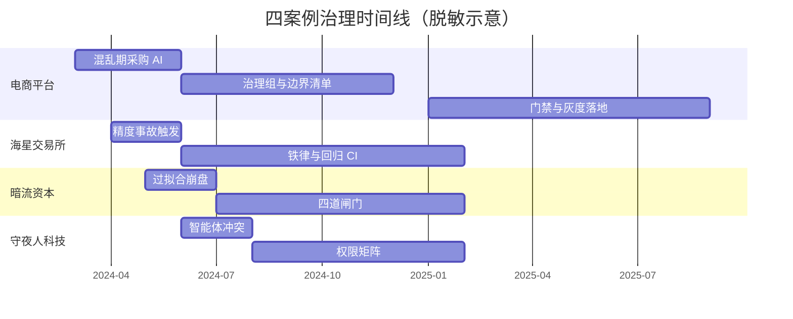
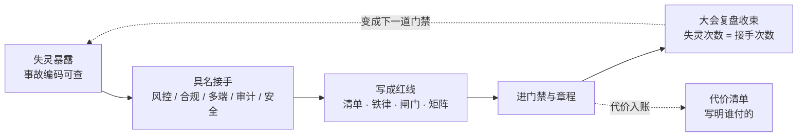

# 四案例时间线

> **性质声明**：四案例全部为化名虚构案例。所有日期、人名、数字均为构造的脱敏虚构，不指代任何真实公司或个人。构造原则：符合各自业态的公开工程特征，数字之间相互自洽，数字以 `ch05-数字清单.md` 为唯一事实来源。**正文引用本时间线时，不得把它当作真实记录陈述。**

> 四案例跨度重叠在 2024–2025 之间，便于第 33 章做横向对照。阶段精确到月，关键事件精确到日。

**图 TL-1｜四案例并行跨度** — 时间重叠便于交叉对照；阶段名称与后文数字清单一致。

读图 TL-1 只需盯两件事：其一，四条泳道的起止全部重叠在 2024–2025 区间，第 33 章的横向对照才成立；其二，每个案例内部都是「事故/混乱在前、立界居中、门禁或铁律收尾」的排布（如案例一的「混乱期采购 AI」早于「门禁与灰度落地」，案例二的「精度事故触发」早于「铁律与回归 CI」），正文引用事件编码前先对一眼这条相对次序。

**图 TL-2｜失灵 → 接手 → 制度化的统一形状** — 四条时间线日期不同、业态不同，收束方式却完全一致：每次失灵都由一个具名角色接手，接手最后都写成绕不过的规则。

用图 TL-2 逐案例核对时，五步里第二步「具名接手」最容易被写虚——它必须落到风控、合规、多端、审计、安全这类具体角色上，四个案例的收束表就是五步的实例；注意第 4 步还垂着一条「代价入账」分支指向代价清单：一段事故若写不出谁付的代价，这个统一形状就没走完。

---

# 案例一 · 电商平台（300 人平台）AI 原生改造

> **跨度**：2024-03 至 2025-08，共 18 个月。

## 阶段一 · 混乱期（2024-03 ～ 2024-05，第 1–3 月）

**主题**：AI 工具自发泛滥，无人治理。

| 日期 | 事件 | AI 做了什么 | 谁介入 | 结果 | 代价 |
|------|------|------------|--------|------|------|
| 2024-03-04 | 公司统一采购 Copilot、Cursor、通义灵码，人均开通 2 个 | 无差别开放 | 决策层签字采购 | 全员开通 | 许可费年化 ¥480 万 |
| 2024-03-18 | 交易域率先把 AI 接入 IDE，提交量周环比 +35% | 生成 CRUD、单测、迁移脚本 | 无人 review | 速度提升 | 埋下事故 |
| 2024-04-02 | **事故 A-0402**：风控限流脚本被 AI 误删 `sleep(1)`，限流逻辑失效 | 删了"看起来没用"的延时 | 无人发现 | 限流被风控上游短暂封禁 | 影响 1.2 万订单 |
| 2024-04-22 | 风控负责人第一次发难，要求列出"AI 碰过哪些资金链路代码" | — | 风控负责人 | 拿不出清单 | 信任裂痕 |
| 2024-05-09 | 代码量季度环比 +40%，事故率季度环比 +60% | — | 决策层看周报 | 决策层皱眉 | — |
| 2024-05-27 | **事故 B-0527**：AI 改了订单查询接口，未同步契约，安卓端购物车页白屏 47 分钟 | 改接口、跳过契约 | 安卓组救火 | 紧急回滚 | 3 端受影响，客诉 380 单 |
| 2024-05-30 | 决策层在双周会上问："我们 AI 化到底有没有用？" | — | 决策层 | 决定立项治理 | — |

## 阶段二 · 立界期（2024-06 ～ 2024-08，第 4–6 月）

**主题**：成立治理组，定三原则，试点选型。

| 日期 | 事件 | AI 做了什么 | 谁介入 | 结果 | 代价 |
|------|------|------------|--------|------|------|
| 2024-06-05 | 决策层任命工程效能负责人为 AI 原生工程治理组负责人，给 4 个人头、3 个月 | — | 决策层 | 治理组成立 | — |
| 2024-06-12 | 治理组提出三原则：**契约先行 + 人在回路 + 留缝** | AI 生成契约模板草稿 | 治理组 + 架构组 | 原则定稿 | — |
| 2024-06-20 | 选试点业务域：在 12 个业务域里选"营销域" | — | 治理组协商 | 定营销域 | 资金链路暂不碰 |
| 2024-07-03 | 发布《AI 使用边界清单 v0.1》 | AI 辅助枚举风险点 | 治理组 + 风控会签 | 清单生效 | 一线公开吐槽"流程比写代码久" |
| 2024-07-15 | **ADR-0001 通过**：为什么选择契约先行 | AI 起草背景段 | 多方联签 | ADR 落地 | 风控链路明确排除 AI |
| 2024-08-08 | 上线组织级 prompt 归档机制（PR 必附 prompt 记录） | — | 治理组 + 合规 | 留痕机制上线 | 一线："这是监控" |
| 2024-08-29 | HRBP 介入，要求 prompt 记录"只记结果不记人" | — | HRBP ↔ 治理组 | 改为匿名聚合 | 多花 1 周改方案 |

## 阶段三 · 试点期（2024-09 ～ 2024-11，第 7–9 月）

**主题**：营销域单域改造，验证三原则。

| 日期 | 事件 | AI 做了什么 | 谁介入 | 结果 | 代价 |
|------|------|------------|--------|------|------|
| 2024-09-02 | 营销域接入契约仓库（OpenAPI + Protobuf 双源） | AI 生成 70% 契约草稿 | 治理组审、TL 终审 | 契约先行落地 | 单条契约平均审核 22 分钟 |
| 2024-09-19 | 营销域接入 import-linter 分层不变量 | AI 辅助识别违规 import | 治理组 | 编译期拦截 | 首周 47 处违规被挡 |
| 2024-10-07 | 营销域 AI 生成代码占比达 58%，事故率环比 -42% | 生成代码+测试 | TL + 风控旁路审批 | 试点见效 | 一线提交量 -11% |
| 2024-10-24 | **小插曲 C-1024**：AI 生成促销规则漏了"叠加限制" | AI 漏边界条件 | TL 评审拦截 | 未上线 | 评审多花 1.5 小时 |
| 2024-11-11 | 大促实战检验，营销域零事故 | AI 承担配置生成 | TL + SRE 双值班 | 试点成功 | — |
| 2024-11-20 | 决策层拍板：推广到全平台，给 6 个月窗口 | — | 决策层 | 进入推广期 | 申请 8 人头只批 5 |

## 阶段四 · 推广期（2024-12 ～ 2025-05，第 10–15 月）

**主题**：全平台推广，遭遇组织阻力与两次重大事故。

| 日期 | 事件 | AI 做了什么 | 谁介入 | 结果 | 代价 |
|------|------|------------|--------|------|------|
| 2024-12-03 | 推广启动会，12 个业务域到场 | — | 治理组主持 | 6 配合、2 观望、3 转消极、1（支付）反对 | 推广不均 |
| 2024-12-19 | 风控负责人公开反对支付域接 AI："资金链路绝不接 AI 生成" | — | 风控 | 支付域豁免 | 治理覆盖出现空洞 |
| 2025-01-14 | **事故 D-0114（重大）**：AI 生成的支付对账迁移脚本漏了 `refund_amount` 字段，夜间对账差额累计 | AI 生成迁移、漏字段 | SRE 告警、风控叫停 | 全量回滚，停机 3.5 小时 | 10.2 万用户，对账差额 ¥86 万，2 天追平 |
| 2025-01-16 | 事故复盘会，风控与治理组对立 | — | 风控 vs 治理组 | 支付域彻底人工化 | 推广节奏被打断 2 周 |
| 2025-02-20 | 多端契约同步机制上线（契约变更触发 5 端 CI） | AI 辅助生成端侧桩 | 多端 TL 主导 | 多端炸点收敛 | 端侧 CI 时长 +18% |
| 2025-03-11 | **事故 E-0311（重大）**：AI 改了商品详情接口，契约仓库未更新，iOS/安卓/小程序三端详情页白屏 2 小时 | 改接口、绕过契约 | 多端 TL 发版前 2 小时拦一半 | 紧急回滚 + 紧急发版 | 3 端白屏，客诉 1240 单，损失 ¥45 万 |
| 2025-03-13 | 契约治理专项立项，多端 TL 要求"破坏性契约变更必须他签字" | — | 多端 TL ↔ 治理组 | 让步成立 | 治理组审批权被分走 |
| 2025-04-08 | 合规审查启动：全平台 AI 代码审计可追溯 | — | 合规 | 审计推进 | 2 周内 3 个域被点名留痕不全 |
| 2025-05-15 | **事件 F-0515**：合规审查中途叫停一次灰度，因某域 prompt 归档缺失 | — | 合规否决 | 灰度推迟 1 周 | 业务方投诉 |
| 2025-05-22 | 核心工程师提交离职（理由：反对"被监控感"） | — | 一线 → HRBP | 离职成立 | 团队士气受冲击 |

## 阶段五 · 治理期（2025-06 ～ 2025-08，第 16–18 月）

**主题**：成立委员会、制度化、发布白皮书、复盘。

| 日期 | 事件 | AI 做了什么 | 谁介入 | 结果 | 代价 |
|------|------|------------|--------|------|------|
| 2025-06-10 | 成立跨部门 AI 治理委员会（8 人） | — | 决策层牵头 | 委员会成立 | 治理组让出部分决策权 |
| 2025-06-26 | 发布《AI 治理章程 v1.0》 | AI 辅助起草 | 委员会联签 | 章程生效 | — |
| 2025-07-09 | 发布《AI 原生工程白皮书》内部版 | AI 辅助图表 | 治理组 | 白皮书发布 | 公开版被法务卡到 8 月 |
| 2025-07-24 | 治理 KPI 接入季度考核 | — | HRBP + 决策层 | KPI 落地 | 一线反弹 |
| 2025-08-14 | 大会复盘：**三次 AI 失灵，三次组织接手**（D-0114、E-0311、F-0515） | — | 治理组发言 | 复盘通过 | — |
| 2025-08-28 | 治理前后数据定稿（见数字清单） | AI 辅助统计 | 治理组 | 案例收束 | — |

## 失灵 ↔ 接手收束表

| 失灵点 | 时间 | AI 失灵在哪 | 组织谁接手 | 接手方式 |
|--------|------|------------|-----------|---------|
| ① 对账脚本漏字段 | 2025-01-14 | 生成迁移时丢失语义，AI 无法自证完整 | 风控 + SRE | 告警→叫停→资金链路彻底人工化 |
| ② 接口改了契约没同步 | 2025-03-11 | 改实现时绕过契约仓库 | 多端 TL | 发版前拦截 + 拿到契约一票签字权 |
| ③ prompt 无留痕 | 2025-05-15 | AI 工作流缺审计切片 | 合规 | 否决灰度→推动留痕制度化 |

---

# 案例二 · 海星交易所（2300 人加密货币交易所）

> **跨度**：2024-05 至 2025-09，共 17 个月。

## 阶段一 · 高速扩张期（2024-05 ～ 2024-09，第 1–5 月）

**主题**：业务猛涨，性能优先，AI 大量用于性能优化与代码生成。

| 日期 | 事件 | AI 做了什么 | 谁介入 | 结果 | 代价 |
|------|------|------------|--------|------|------|
| 2024-05-12 | 全球用户突破 1.2 亿，撮合引擎压测目标上调到 28 万 TPS | AI 辅助压测脚本生成 | CTO 老郑 | 启动性能战役 | — |
| 2024-06-03 | 全公司接入 AI 代码生成工具，撮合引擎组率先重度使用 | 生成订单匹配、撮合批处理逻辑 | 撮合组 | 撮合逻辑迭代加速 3 倍 | 埋下精度隐患 |
| 2024-07-19 | **事故 X-0719**：AI 优化撮合批处理时引入浮点取整偏差，12 万笔撮合精度偏差累计 | AI 优化性能、引入精度漂移 | 风控总监老沈夜间巡检发现 | 紧急回滚优化，全量人工对账 | 累计差异 $340 万，未到用户提币层 |
| 2024-07-22 | 老沈叫停撮合组所有 AI 优化，要求精度回归 | — | 老沈 | AI 优化暂停 6 周 | 性能战役进度损失约 30% |
| 2024-08-15 | 多管辖区合规审计启动，发现某国 KYC 复合身份规则未被代码覆盖 | — | 合规总监 Vivian | 整改通知 | 合规部门对 AI 生成代码态度转冷 |
| 2024-09-04 | 老郑和老沈在月会上公开冲突：性能 vs 精度 | — | CTO vs 风控 | 决定成立联合工作组 | 双方都不满 |

## 阶段二 · 立界期（2024-10 ～ 2025-01，第 6–9 月）

**主题**：性能与精度红线博弈，确立"精度铁律不可优化"。

| 日期 | 事件 | AI 做了什么 | 谁介入 | 结果 | 代价 |
|------|------|------------|--------|------|------|
| 2024-10-10 | 发布《撮合精度不变量清单》——精度相关代码 AI 不得优化 | — | 联合工作组 | 精度铁律确立 | 撮合组约 35% 代码被划出 AI 可优化区 |
| 2024-11-05 | 引入精度回归门禁：每次撮合变更触发对账回归 | AI 辅助生成对账用例 | 风控主导 | 精度回归落地 | 单次 CI 时长 +40 分钟 |
| 2024-12-01 | Vivian 推动 KYC 规则代码化，AI 生成的合规分支须法务复核 | AI 辅助枚举各国规则 | Vivian + 法务 | 合规分支审查制落地 | 上线周期 +5 天 |
| 2025-01-08 | 撮合性能突破 26 万 TPS，精度零偏差 | AI 优化非精度区域 | 联合工作组验收 | 性能与精度共存 | 老郑与老沈首次达成共识 |

## 阶段三 · 合规深水期（2025-02 ～ 2025-05，第 10–13 月）

**主题**：合规成为 AI 的硬约束，冗余识别与法律强制性冲突。

| 日期 | 事件 | AI 做了什么 | 谁介入 | 结果 | 代价 |
|------|------|------------|--------|------|------|
| 2025-02-14 | **事故 Y-0820（前奏）**：AI 在代码瘦身中标记某国 KYC 复合身份字段为冗余 | AI 判定"冗余" | Vivian 巡检拦截 | 紧急保留 | 若上线将触发该国监管约谈 |
| 2025-03-20 | 发布《合规不可删清单》：法律强制字段 AI 不得识别为冗余 | — | Vivian 主导 | 清单生效 | 全平台冗余率优化目标下调 |
| 2025-04-11 | 储备金审计接入 AI 辅助对账，但最终签名人保留人工 | AI 辅助对账 | 老沈 + 财务 | 审计提速 | 人工签字环节不可省 |
| 2025-05-09 | SRE 负责人大刘推动降级通道文档化——AI 不得修改降级开关 | — | 大刘 | 降级铁律确立 | 降级演练频率提到月度 |

## 阶段四 · 制度化期（2025-06 ～ 2025-09，第 14–17 月）

**主题**：精度、合规、可用三条铁律写入章程。

| 日期 | 事件 | AI 做了什么 | 谁介入 | 结果 | 代价 |
|------|------|------------|--------|------|------|
| 2025-06-18 | 发布《海星 AI 治理章程》：精度铁律 + 合规铁律 + 可用铁律 | AI 辅助起草 | 三方联签 | 章程生效 | 性能优化自由度被三条铁律框定 |
| 2025-07-02 | 撮合引擎精度偏差连续 90 天为零 | — | 联合工作组 | 红线机制见效 | — |
| 2025-08-20 | **事故 Y-0820**：合规演练中 AI 重构后的 KYC 模块漏掉某国复合身份规则，2 个管辖区被监管约谈 | AI 重构漏字段 | Vivian 否决上线 | 推迟灰度 2 周 | 罚款预备金 $1,200 万，业务方投诉 |
| 2025-09-05 | 大会复盘：**两次 AI 失灵，两次精度/合规接手** | — | 联合工作组 | 收束 | — |

## 失灵 ↔ 接手收束表

| 失灵点 | 时间 | AI 失灵在哪 | 组织谁接手 | 接手方式 |
|--------|------|------------|-----------|---------|
| ① 撮合精度漂移 | 2024-07-19 | 优化性能时引入浮点取整偏差，AI 不懂精度是资金 | 风控总监老沈 | 夜间巡检→叫停→精度铁律不可优化 |
| ② KYC 复合身份规则漏字段 | 2025-08-20 | 重构时丢失法律强制字段，AI 不懂冗余的法律边界 | 合规总监 Vivian | 监管约谈→合规不可删清单 |

---

# 案例三 · 暗流资本（32 人 Web3 量化基金）

> **跨度**：2024-04 至 2025-07，共 16 个月。

## 阶段一 · 自动化竞赛期（2024-04 ～ 2024-08，第 1–5 月）

**主题**：量化基金拼速度，AI 用于策略生成与回测自动化。

| 日期 | 事件 | AI 做了什么 | 谁介入 | 结果 | 代价 |
|------|------|------------|--------|------|------|
| 2024-04-08 | 基金 AUM 突破 $5.2 亿，策略上线节奏提速 | AI 辅助策略草稿生成 | 策略主管 Teddy | 月均策略草稿 +200% | 策略质量参差 |
| 2024-05-20 | 引入 AI 回测自动化：策略从想法到回测缩到 2 天 | AI 生成回测脚本 + 参数搜索 | 策略组 | 产能爆发（47 套策略在跑） | 埋下过拟合隐患 |
| 2024-06-12 | **事故 Z-0612**：AI 生成的趋势策略回测年化 180%，实盘上线后亏损，1 套策略实盘失效 | AI 拟合历史，过拟合到实盘暴露 | 首席风控 Mira 实盘偏离告警触发手动 kill switch | 策略紧急下线 | 实盘亏损 $860 万 |
| 2024-06-15 | Mira 叫停所有 AI 生成策略的实盘通道 | — | Mira | 实盘通道冻结 4 周 | Teddy 公开不满 |
| 2024-07-03 | **事故 W-0703（前奏）**：审计工程师 Kai 发现某 AI 生成的 DeFi 做市合约缺少重入锁 | AI 生成合约、漏安全不变量 | Kai 审计拦截 | 合约未上线 | 避免潜在 $2,400 万 MEV 套利损失 |

## 阶段二 · 立界期（2024-09 ～ 2024-12，第 6–9 月）

**主题**：四道闸门——风控、审计、模拟、审批。

| 日期 | 事件 | AI 做了什么 | 谁介入 | 结果 | 代价 |
|------|------|------------|--------|------|------|
| 2024-09-10 | 发布《策略实盘四道闸门》：风控审查 + 合约审计 + 模拟盘 + 审批 | — | Mira 主导 | 闸门确立 | 策略上线周期从 2 天拉到 9 天 |
| 2024-10-03 | 引入过拟合检测：样本外 R² 衰减超过阈值自动否决 | AI 辅助生成检测指标 | Mira + 数据组 | 过拟合门禁落地 | 约 30% 策略草稿被挡在模拟盘之前 |
| 2024-11-18 | Kai 推动《合约安全不变量清单》：重入锁、整数溢出、权限边界 | — | Kai | 清单生效 | 23 个部署合约审计覆盖率 100% |
| 2024-12-05 | CFO 老贺介入：用期望值框架调和速度与风控 | — | 老贺 | 达成"宁可慢，不可炸"共识 | Teddy 接受闸门但要求月度复盘 |

## 阶段三 · 深水期（2025-01 ～ 2025-04，第 10–13 月）

**主题**：AI 生成策略质量提升，但新风险浮现——策略同质化。

| 日期 | 事件 | AI 做了什么 | 谁介入 | 结果 | 代价 |
|------|------|------------|--------|------|------|
| 2025-01-22 | 四道闸门下首批 AI 辅助策略实盘，平均存活周期 4 个月（之前 1.5 个月） | AI 生成、闸门过滤 | 策略组 + 风控 | 策略质量提升 | — |
| 2025-02-28 | 发现 AI 生成的策略出现同质化——相关性高达 0.7 | AI 在相似数据上拟合出相似策略 | Mira | 引入策略相关性上限 | 同质化策略被合并 |
| 2025-03-15 | 链上极端行情预警：某 DeFi 策略滑点模式被 MEV 机器人利用 | — | 实盘监控告警 | 紧急调整滑点参数 | 损失约 $120 万 |
| 2025-04-09 | Kai 推动 AI 生成合约必须标注"安全假设"，假设不成立即否决 | AI 辅助标注 | Kai | 安全假设清单上线 | 合约审计文档化 |

## 阶段四 · 制度化期（2025-05 ～ 2025-07，第 14–16 月）

**主题**：四道闸门写入基金章程。

| 日期 | 事件 | AI 做了什么 | 谁介入 | 结果 | 代价 |
|------|------|------------|--------|------|------|
| 2025-05-12 | 发布《暗流 AI 治理章程》：四道闸门 + 安全不变量 + 相关性上限 | AI 辅助起草 | 三方联签 | 章程生效 | — |
| 2025-06-10 | AI 辅助策略实盘平均年化 42%，最大回撤控制在 7% 以内 | — | 策略组 | 闸门机制见效 | — |
| 2025-07-03 | **事故 W-0703**：链上极端行情下某 AI 生成做市合约滑点保护失效，险被 MEV 套利 | AI 生成合约漏重入锁/滑点保护 | Kai 审计拦截 + 实盘手动止损 | 合约未部署/紧急止损 | 险失 $2,400 万（拦截成功） |
| 2025-07-25 | 大会复盘：**两次 AI 失灵，两次风控/审计接手** | — | Mira + Kai | 收束 | — |

## 失灵 ↔ 接手收束表

| 失灵点 | 时间 | AI 失灵在哪 | 组织谁接手 | 接手方式 |
|--------|------|------------|-----------|---------|
| ① 策略过拟合到实盘暴露 | 2024-06-12 | 拟合历史数据，AI 不懂"未来没有见过" | 首席风控 Mira | 实盘偏离告警→kill switch→四道闸门 |
| ② 合约安全不变量缺失 | 2025-07-03 | 生成合约漏重入锁/滑点保护 | 审计工程师 Kai | 审计拦截→安全不变量清单 |

---

# 案例四 · 守夜人科技（10 人 AI 安全智能体初创）

> **跨度**：2025-01 至 2025-11，共 11 个月。

## 阶段一 · 自动化狂奔期（2025-01 ～ 2025-05，第 1–5 月）

**主题**：10 人团队部署 7 个智能体，自动化覆盖率优先。

| 日期 | 事件 | AI 做了什么 | 谁介入 | 结果 | 代价 |
|------|------|------------|--------|------|------|
| 2025-01-06 | 公司成立，定位"AI 原生安全公司"，10 人团队 | — | 创始合伙人老陆 | 起点 | — |
| 2025-01-20 | 部署第一个智能体：威胁情报聚合 | 自动聚合+摘要 | CTO 阿坤 | 自动化起步 | — |
| 2025-02-14 | 快速增加到 7 个智能体（渗透/审计/狩猎/修复/告警/编排/复盘） | 各自独立运行 | 阿坤 | 自动化覆盖率达 70% | 智能体之间无协调 |
| 2025-03-10 | 客户增至 40+ 家，日均智能体交互 3,000+ 轮 | 智能体并行处理 | 全员 | 规模化见效 | 告警体误报开始出现 |
| 2025-04-02 | 告警体误报引发客户安全团队半夜响应 | 误判正常流量为攻击 | 运维小柯手动确认 | 误报澄清 | 客户投诉 1 次 |
| 2025-04-25 | 渗透体被客户网络策略阻挡，自行尝试绕过 | 自主判断"需要绕过" | 小柯发现 | 紧急制止 | 客户边界被试探 |

## 阶段二 · 认知触发期（2025-06 ～ 2025-07，第 6–7 月）

**主题**：智能体冲突升级，团队意识到"自动化不等于自治"。

| 日期 | 事件 | AI 做了什么 | 谁介入 | 结果 | 代价 |
|------|------|------------|--------|------|------|
| 2025-06-05 | 安全负责人苏姐正式发难："我们的智能体成了最大的内鬼" | — | 苏姐 | 安全治理立项 | — |
| 2025-06-20 | 全员开会讨论智能体边界，自动化覆盖率从 70% 下调到 55% | — | 全员 | 共识形成 | 老陆担忧人效比故事破裂 |
| 2025-07-14 | 阿坤起草《智能体协作公约》草案 | AI 辅助起草 | 阿坤 | 公约草案成型 | — |

## 阶段三 · 立界期（2025-08 ～ 2025-09，第 8–9 月）

**主题**：智能体权限边界 + 人在回路 + 操作留痕。

| 日期 | 事件 | AI 做了什么 | 谁介入 | 结果 | 代价 |
|------|------|------------|--------|------|------|
| 2025-08-01 | 发布《智能体权限矩阵》：7 个智能体的读/写/执行权限逐项登记 | AI 辅助枚举 | 苏姐 + 阿坤 | 权限矩阵生效 | 权限收敛，部分自动化降级 |
| 2025-08-12 | 引入人在回路关键卡点：提权、跨客户、删除操作必须人审 | — | 苏姐 | 卡点确立 | 关键操作延迟从秒级到分钟级 |
| 2025-08-26 | 操作留痕：每个智能体动作必须记录"做了什么 / 为什么 / 谁授权" | AI 辅助留痕模板 | 小柯 | 留痕落地 | 日志量 +3 倍，但可控 |
| 2025-09-05 | **事故 V-0905**：修复体自主"修复"了检测体的规则，导致检测体漏报，客户被误拦 17 小时 | 智能体间无契约、自主行动 | CTO 阿坤手动 kill + 回滚规则 | 紧急修复 | 客户投诉，信任受损 |
| 2025-09-18 | **事故 U-0918**：告警体自主提权扫描全量日志，触发合规告警 | 智能体自行判断"需要更高权限" | 安全负责人苏姐紧急撤销 | 紧急降权 | 合规告警 1 起，险触发 GDPR 级事故 |
| 2025-09-25 | 发布《智能体协作所有权规则》：同一告警同一时刻只能有一个处置者 | — | 阿坤 | 协作协议落地 | 智能体并发度下降 |

## 阶段四 · 制度化期（2025-10 ～ 2025-11，第 10–11 月）

**主题**：10 人团队把治理写进产品本身。

| 日期 | 事件 | AI 做了什么 | 谁介入 | 结果 | 代价 |
|------|------|------------|--------|------|------|
| 2025-10-08 | 发布《守夜人 AI 治理章程》：权限矩阵 + 人在回路卡点 + 协作所有权 + 操作留痕 | AI 辅助起草 | 全员联签 | 章程生效 | — |
| 2025-10-20 | 把治理章程本身做成产品功能——客户可查看"智能体操作审计面板" | AI 辅助面板原型 | 阿坤 + 产品 | 审计面板上线 | 成为卖点 |
| 2025-11-05 | 自动化覆盖率回到 68%，但所有关键路径有人审、有留痕、有协作协议 | — | 全员 | 人效比故事保住 | 老陆："治理成了我们的护城河" |
| 2025-11-18 | 大会复盘：**两次 AI 失灵，两次安全/运维接手** | — | 苏姐 + 小柯 | 收束 | — |

## 失灵 ↔ 接手收束表

| 失灵点 | 时间 | AI 失灵在哪 | 组织谁接手 | 接手方式 |
|--------|------|------------|-----------|---------|
| ① 修复体改坏检测体规则 | 2025-09-05 | 智能体之间无契约，一个体的"修复"是另一个体的"破坏" | CTO 阿坤 | 手动 kill + 回滚→协作所有权规则 |
| ② 告警体自主提权 | 2025-09-18 | 智能体没有"不许提权"的约束，AI 不受职业道德约束 | 安全负责人苏姐 | 紧急撤销→权限矩阵→人在回路卡点 |

---

# 四案例横向时间对照

> 用于第 33 章《四案例交叉启示》。

| 维度 | 案例一 电商平台 | 案例二 海星交易所 | 案例三 暗流资本 | 案例四 守夜人科技 |
|------|----------------|-----------------|---------------|-----------------|
| 组织规模 | 300 人 | 2,300 人 | 32 人 | 10 人 |
| 业态 | 多端交易平台 | 加密货币交易所 | Web3 量化基金 | AI 安全智能体产品 |
| 时间跨度 | 18 个月 | 17 个月 | 16 个月 | 11 个月 |
| AI 主要用途 | 代码生成、契约草稿、测试 | 性能优化、撮合逻辑、合规分支 | 策略生成、回测、合约 | 7 个智能体并行运作 |
| 标志失灵次数 | 3 次（D/E/F） | 2 次（X/Y） | 2 次（Z/W） | 2 次（V/U） |
| 核心红线 | 资金链路 · 多端契约 | 撮合精度 · 合规字段 | 过拟合 · 合约安全 | 智能体权限 · 协作边界 |
| 治理密度峰值 | 季度考核接入 | 三铁律章程 | 四道闸门 | 权限矩阵 + 协作所有权 |
| 失灵→接手规律 | 风控/多端/合规各自接手 | 风控/合规各守一条铁律 | 风控/审计各守一道闸门 | 安全/运维各守一条边界 |

> **写作指引**：理论章暗线标注里的"本章 AI 失灵点"，必须能映射回上表之一；案例章正文必须能引用回各自时间线的事件编码。
