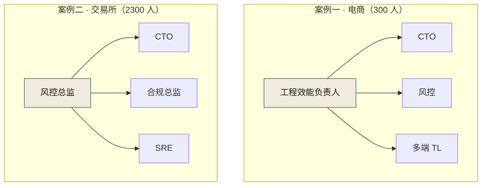
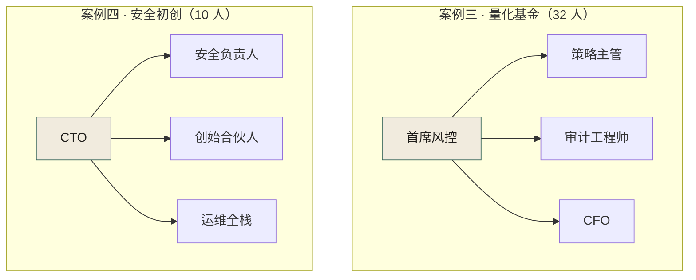
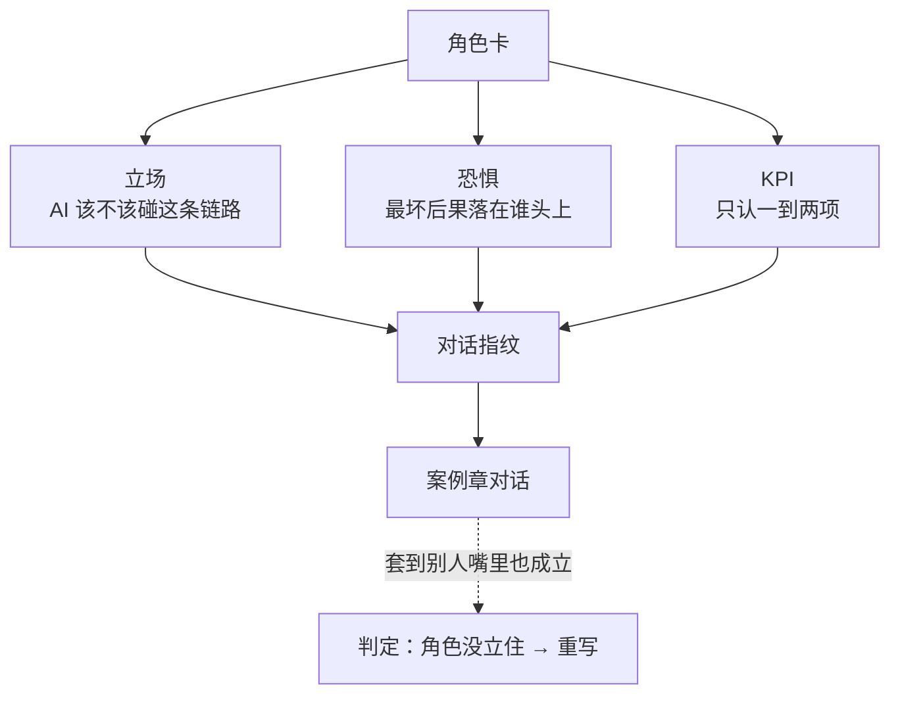

# 四案例角色设定卡

> **性质声明**：全部为化名虚构角色，构造原则是"每个人都有独立的 KPI 和独立的恐惧，对话时立场不可互换"。写作时若一段话套到另一人嘴里也成立，说明角色没立住，重写。

先看大组织一侧：图 PS-1 里被箭头聚拢的位置——案例一的工程效能负责人、案例二的风控总监——KPI 同时压在「效率」与「红线」两栏上，两边都不能替他签字，案例一、二的多数冲突都由这一站位引爆。

**图 PS-1｜大型组织的博弈轴（案例一、二）** — 叙述者坐在「效率」与「红线」的夹缝里，两边的 KPI 都跟他有关，两边都不能替他签字。

图 PS-2 与上面两张子图的差别只在链条长度：32 人和 10 人的组织里，箭头汇聚的位置仍是守红线的那个人（首席风控、CTO），同一个位置既拍板又背后果——所以案例三、四的对话里立场不会漂移，代价是红线全押在个人身上。

**图 PS-2｜小团队的博弈轴（案例三、四）** — 人越少，红线越靠个人守；同一个位置既要做决定又要背后果，立场同样不可互换。

---

# 案例一 · 电商平台（300 人平台）

## ① 主角——工程效能与架构组负责人

| 维度 | 内容 |
|------|------|
| 本名 | 全书不出现真名 |
| 职位 | 工程效能与架构组负责人（治理组负责人） |
| 经验 | 8 年，做过交易核心与风控引擎 |
| 立场 | AI 是杠杆，但杠杆必须有支点——支点就是契约、测试、留痕 |
| 口头禅 | "先画边界，再让 AI 动手。" |
| 恐惧 | 成为"AI 化"失败的替罪羊：上面要效率，下面要自由，出事算我的 |
| KPI | 治理覆盖率、事故率下降、契约一致率 |
| 弱点 | 倾向用流程解决问题，被 HRBP 批评"把人当机器管" |

## ② 决策层（CTO）

| 维度 | 内容 |
|------|------|
| 立场 | 支持 AI，但绝不愿替事故背书 |
| 口头禅 | "我不关心你用不用 AI，我关心出事谁负责。" |
| 恐惧 | 在董事会上被问"AI 投入回报在哪"答不上来 |
| KPI | 系统稳定性、研发效率 |
| 决策风格 | 给资源、给授权，但要结果、要责任人 |

## ③ 风控负责人

| 维度 | 内容 |
|------|------|
| 权力 | 一票否决权 |
| 立场 | 资金链路绝不让 AI 碰；AI 生成的代码必须人审 |
| 口头禅 | "这笔钱错了，用户不会找 AI，会找我。" |
| 恐惧 | 有一天对账差额出现在自己签字的链路上 |
| KPI | 资金零损失、风控拦截准确率 |
| 对话指纹 | 永远从"能不能验证"切入，验证不了就否决 |

## ④ 多端 TL

| 维度 | 内容 |
|------|------|
| 职位 | 多端 TL，负责多端一致性 |
| 立场 | AI 可以写代码，但绝不能改契约——契约一动多端都要发版 |
| 口头禅 | "AI 改一次接口，多个端要发版，谁扛？" |
| 恐惧 | 凌晨被叫起来排查"为什么只有某个端炸了" |
| KPI | 多端一致性、发版准时率、端侧崩溃率 |
| 对话指纹 | 永远问"它怎么验证的"，并把"端"挂在嘴边 |

## ⑤ 合规负责人

| 维度 | 内容 |
|------|------|
| 立场 | AI 生成代码必须留痕，否则审计追溯不了，就不合规 |
| 口头禅 | "审计问起来，我能拿出一份 AI 操作记录吗？" |
| 恐惧 | 监管来查，发现某段代码"不知是谁、用了什么 prompt 生成" |
| KPI | 合规零缺陷、审计通过率 |
| 对话指纹 | 不停追问"谁审的""记录呢"，直到对方答不上来 |

## ⑥ 一线工程师

| 维度 | 内容 |
|------|------|
| 立场 | AI 让他一个人顶一个半人，反对一切拖慢提交的治理 |
| 口头禅 | "你们治理组的流程，比我写代码时间还长。" |
| 恐惧 | 被"监控式治理"判定为低效，绩效受影响 |
| KPI | 需求交付量（只认这一个） |
| 对话指纹 | 用"现在就要上线"对抗一切"先填契约" |

## ⑦ SRE 负责人

| 维度 | 内容 |
|------|------|
| 立场 | 不关心 AI，只关心回滚速度和告警质量 |
| 口头禅 | "出事的时候，AI 能帮我回滚吗？" |
| 恐惧 | 一个 AI 引入的 bug，监控根本没覆盖，炸了才知道 |
| KPI | 可用性、MTTR（平均恢复时间） |
| 对话指纹 | 用"指标"说话，一句话离不开 SLI/SLO |

## ⑧ HRBP

| 维度 | 内容 |
|------|------|
| 立场 | AI 治理不能变成"监控工程师" |
| 口头禅 | "你让 AI 记录每个人的 prompt，工程师会觉得被监控。" |
| 恐惧 | 治理把优秀工程师逼走，离职率背到她头上 |
| KPI | 离职率、满意度、绩效公平性 |
| 对话指纹 | 反问"你怎么保证"，逼对方承认"还没想好" |

---

# 案例二 · 海星交易所（大型加密货币交易所）

## ① 风控总监——老沈

| 维度 | 内容 |
|------|------|
| 职位 | 风控总监，15 年金融风控经验 |
| 立场 | 在交易所，精度就是资金；AI 优化的一切必须在精度铁律下运行 |
| 口头禅 | "你们优化的是性能，丢的是钱。在海星，钱对不上比慢严重一万倍。" |
| 恐惧 | 撮合精度漂移到用户提币时才被发现 |
| KPI | 资金零偏差、储备金审计通过 |
| 对话指纹 | 从"钱对不对得上"切入，对不上即熔断 |

## ② 合规总监——Vivian

| 维度 | 内容 |
|------|------|
| 职位 | 合规总监，法务背景，跨多司法管辖区合规 |
| 立场 | 合规不是上线后的体检，是上线前的疫苗 |
| 口头禅 | "AI 不知道哪条规则是法律强制的——冗余不冗余不是代码说了算，是法律说了算。" |
| 恐惧 | 某国 KYC 规则被 AI 当冗余删掉，被监管约谈 |
| KPI | 多管辖区合规零缺陷 |
| 对话指纹 | 追问"这条规则的法律依据是什么"，答不上来就否决 |

## ③ CTO——老郑

| 维度 | 内容 |
|------|------|
| 立场 | 性能是和大所竞争的生命线，AI 优化是必须的 |
| 口头禅 | "28 万 TPS 是我们的生命线。隔壁做到了 35 万，我们慢了用户就跑了。" |
| 恐惧 | 因风控一票否决导致性能优化被无限搁置，竞争力丧失 |
| KPI | 系统性能、撮合吞吐量、用户增长 |

## ④ SRE 负责人——大刘

| 维度 | 内容 |
|------|------|
| 立场 | 24/7 不可停机，降级通道就是生命线 |
| 口头禅 | "你可以降级，但你不能停。停一分钟就是挤兑。" |
| KPI | 可用性 99.99%+，降级 SLA |

---

# 案例三 · 暗流资本（Web3 量化基金）

## ① 首席风控——Mira

| 维度 | 内容 |
|------|------|
| 职位 | 首席风控官，负责策略风控和仓位管理 |
| 立场 | AI 最擅长的事（拟合历史）恰恰是最危险的事（过拟合） |
| 口头禅 | "回测里它是神仙，实盘里它面对的是从未见过的未来。" |
| 恐惧 | 某个策略过拟合到实盘才暴露，亏损已不可逆 |
| KPI | 基金最大回撤、策略实盘偏离度 |
| 对话指纹 | 永远问"这个策略赚的是什么钱"，答不出就不准上 |

## ② 审计工程师——Kai

| 维度 | 内容 |
|------|------|
| 职位 | 合约审计工程师，安全审计是合约部署的硬门槛 |
| 立场 | 不能用概率性工具守护确定性底线 |
| 口头禅 | "AI 生成的合约在'看起来对'上做得很好——但安全不变量的遵守是概率性的。" |
| 恐惧 | 审计过的合约上线后被 MEV 攻击 |
| KPI | 合约审计通过率、零安全事件 |

## ③ 策略主管——Teddy

| 维度 | 内容 |
|------|------|
| 职位 | 策略研究主管 |
| 立场 | 量化就是拼速度，策略从想法到实盘超过一周，机会就没了 |
| 口头禅 | "市场机会窗口就那么短，你们四道闸门加上审计黄花菜都凉了。" |
| 恐惧 | 因风控拖慢策略上线，错失重大市场机会 |
| KPI | 策略上线数量、策略收益率 |

## ④ CFO——老贺

| 维度 | 内容 |
|------|------|
| 立场 | 用期望值说话 |
| 口头禅 | "一个策略晚一周上线，机会成本假设 20%。一个策略出了事，亏损是本金 100%。期望值自己算。" |
| KPI | 基金整体收益率、风险调整后回报 |

---

# 案例四 · 守夜人科技（10 人 AI 安全智能体初创）

## ① CTO——阿坤

| 维度 | 内容 |
|------|------|
| 职位 | CTO 兼联合创始人 |
| 立场 | 10 个人管 7 个智能体，不靠自动化活不下来——但关键边界必须人在回路 |
| 口头禅 | "我们有 7 个很聪明的智能体，但它们互相不认识。各自为政的力量越大，互相伤害越大。" |
| 恐惧 | 智能体之间的冲突升级成客户事故，10 人团队扛不起 |
| KPI | 产品可靠性、客户留存率、团队可持续性 |

## ② 安全负责人——苏姐

| 维度 | 内容 |
|------|------|
| 职位 | 安全负责人 |
| 立场 | 我们做安全产品，结果自己的智能体成了最大的内鬼 |
| 口头禅 | "AI 不受职业道德约束，它只受代码里写了什么约束。你没写'不许提权'，它就认为可以。" |
| 恐惧 | 智能体自主提权扫描客户数据，触发 GDPR 级合规事故 |
| KPI | 安全零事故、合规零告警 |

## ③ 创始合伙人——老陆

| 维度 | 内容 |
|------|------|
| 职位 | 创始合伙人，负责融资和商业 |
| 立场 | 10 人做 100 人的事是拿投资时的故事，不能因为治理把这个故事破了 |
| 口头禅 | "如果每个关键动作都要人审，我们的'人效比'故事就破了——下一轮融资怎么讲？" |
| 恐惧 | 过度治理让自动化覆盖率下降，人效比故事不成立 |
| KPI | 人效比（收入/人数）、融资进度 |

## ④ 运维兼全栈——小柯

| 维度 | 内容 |
|------|------|
| 职位 | 运维 + 全栈工程师 |
| 立场 | 我关心的是我半夜被叫醒几次 |
| 口头禅 | "你们吵自动化程度，我关心的是可持续性。10 个人每周被叫醒超过 2 次就撑不住了。" |
| 恐惧 | 值班告警失控，团队先于系统崩溃 |
| KPI | 夜间唤醒次数 ≤ 2 次/周 |

---

## 四案例对话指纹速查

| 案例 | 角色 | 对话指纹 |
|------|------|---------|
| 案例一 | 风控负责人 | 能不能验证？不能 → 否决 |
| 案例一 | 多端 TL | 它怎么验证的？端怎么办？ |
| 案例一 | 合规负责人 | 谁审的？记录呢？补上 |
| 案例一 | 一线工程师 | 我现在就要上线 |
| 案例一 | SRE 负责人 | 指标说话，能回滚吗？ |
| 案例二 | 风控总监老沈 | 钱对不对得上？对不上即熔断 |
| 案例二 | 合规总监Vivian | 这条规则的法律依据是什么？ |
| 案例三 | 首席风控Mira | 这个策略赚的是什么钱？答不出就不准上 |
| 案例三 | 审计工程师Kai | 安全不变量过了吗？没过不准部署 |
| 案例四 | CTO阿坤 | 它们互相认识吗？不认识就别让它们自己协作 |
| 案例四 | 安全负责人苏姐 | 代码里写了"不许"吗？没写它就会做 |

速查表不是抄来背的，它是图 PS-3 生成链的终点：每句指纹都应能倒推回角色卡的立场、恐惧、KPI 三样，倒推不回的那句，说明那张卡缺了一样，先改卡再写对话。

**图 PS-3｜对话指纹的生成链** — 立场、恐惧、KPI 三样齐了，一句话遮住名字也认得出是谁说的；三样缺一样，对话就会互相通用。

> **写作铁律**：写完一段对话，把名字遮住，能猜出是谁说的才算过。

---

## 这张卡的自检口径（把"立没立住"变成能判定的三问）

"遮住名字能猜出来"是判据，但它是凭手感判的。要能在多人协作时复现，得换成三条可数的问题——沿用全书那条标准：**可判定、可执行、可归因**。

| 自检问 | 判据（怎么算过） | 不通过时改哪一格 |
|---|---|---|
| **一、指纹能被别人认出吗** | 遮住名字，把这张卡的对话交给**没读过本书的人**猜是谁说的；全部猜对才算过，猜错一条即不过 | 通常不是措辞问题，是**立场**或**恐惧**写成了通用形容词（"重视质量"这类谁都能说） |
| **二、KPI 是不是只有一到两项** | 数一下 KPI 那格的分号项数：>2 项就是没立住 | 删到两项，删不掉的说明这个角色在替两个岗位说话——把卡拆成两张 |
| **三、否决权有具体动作吗** | 「能否决什么」必须落成一个**会停下某件事**的动作（"不准部署""不准上"），不能是"提出意见""保持关注" | 改不成动作的，说明这个角色只是背景板；在案例章里不该给他台词 |

三条都过的标志是一个副产品：**同一个场景里两个人同时说话，读者不需要看名字就知道谁在拦、谁在推**。反过来，如果一张卡三条都过了却仍然没有一句可引用的口头禅，那是**口头禅**写成了标语——标语不承载立场，改成这个人在会议室里真会说的那半句不耐烦的话。

这套口径不只用于写书。它同样适用于任何一份"角色/职责卡"：**填完之后能不能拿去问一个新人"这个人能停下哪件事"，答得出才算填好**。案例一那份让渡出去的权力就是现成的对照——那条规则的原话是「**破坏性契约变更必须多端 TL 签字**」（见案例一「300 人电商平台」的治理让渡一节），它把"参与讨论"变成了一格有名字的签字位；同样是这一格，写成"多端 TL 参加评审"就什么都拦不住。
