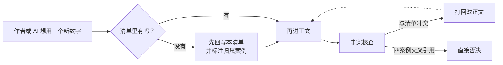
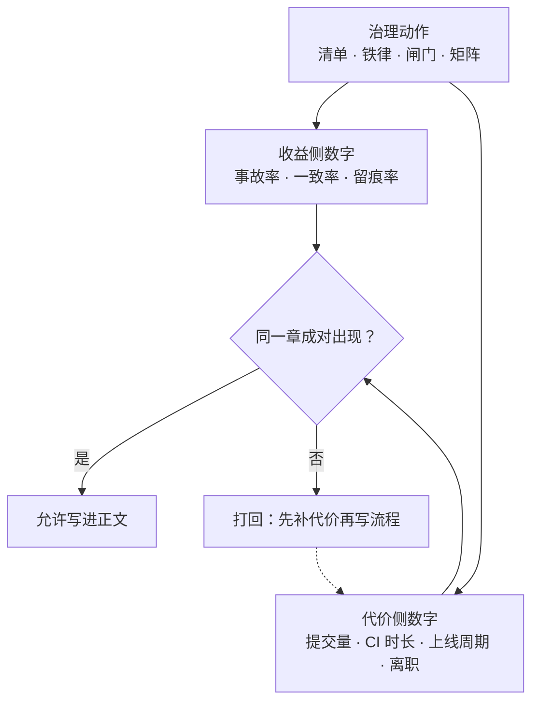

# 数字清单 · 四案例可信度锚点

> **性质声明**：全部为自洽虚构数字，四案例各自独立，数字之间相互自洽。构造原则：与时间线（`ch03-案例时间线.md`）逐一对应，禁止在正文里出现与本清单冲突的数字。**任何新增数字必须先回写本清单，再进正文。四案例之间数字禁止交叉引用。**

图 N-1 把这段声明变成操作顺序：卡点是菱形那一问「清单里有吗」，不是作者记不记得——没有就先回写这里并标注归属案例；事实核查若发现正文与清单冲突，改的永远是正文那一路；「四案例交叉引用」是直接被否决的第三路，没有例外分支。

---

**图 N-1｜数字的单一事实源** — 新数字必须先写进本清单才允许进正文；正文与清单冲突时改正文，四案例之间数字禁止互相引用。

---

# 案例一 · 电商平台（300 人平台）

## 1.1 平台规模

| 指标 | 数值 | 备注 |
|------|------|------|
| DAU | 1.2 亿 | 亿级 |
| 峰值 QPS | 86 万 | 大促峰值，百万级量级 |
| 代码总量 | 约 480 万行 | 百万行级 |
| 仓库数 | 214 | 200+ |
| 微服务数 | 327 | 300+ |
| 端 | 5（安卓 / 鸿蒙 / iOS / Web / 小程序） | — |
| 业务域 | 12（商品、交易、支付、风控、营销、客服、聊天、物流、账户、搜索、推荐、增长） | — |
| 团队人数 | 约 300 | 跨 12 业务域 |
| 日均发布 | 110+ 次 | 治理前 |

## 1.2 事故规模

| 编号 | 事件 | 日期 | 影响范围 | 损失估算 | 根因 | 介入人 |
|------|------|------|---------|---------|------|--------|
| A-0402 | 限流脚本 sleep 被删 | 2024-04-02 | 1.2 万订单 | ¥6 万 | AI 删延时、无人审 | 无人（暴露问题） |
| B-0527 | 订单接口改了未同步契约 | 2024-05-27 | 安卓端白屏 47 分钟，客诉 380 单 | ¥12 万 | AI 改实现绕契约 | 多端救火 |
| C-1024 | 促销规则漏叠加限制 | 2024-10-24 | 未上线（评审拦下） | 0（避免损失） | AI 漏边界条件 | TL 拦截 |
| **D-0114** | **支付对账迁移漏字段** | **2025-01-14** | **10.2 万用户，停机 3.5 小时** | **对账差额 ¥86 万，2 天追平** | AI 生成迁移漏 `refund_amount` | SRE 告警、风控叫停 |
| **E-0311** | **商品详情接口契约未更新** | **2025-03-11** | **3 端白屏 2 小时，客诉 1240 单** | **¥45 万** | AI 改接口绕契约仓库 | 多端 TL 发版前拦一半 |
| F-0515 | 合规灰度被叫停 | 2025-05-15 | 灰度推迟 1 周 | 业务方投诉 | prompt 归档缺失 | 合规否决 |

> **规则**：D、E 是"两次重大事故"；F 是"一次合规叫停"。全书涉及这三件事的数字，一律以本表为准。

## 1.3 AI 使用规模（治理前 vs 治理后）

| 指标 | 治理前（2024-Q2） | 治理后（2025-Q3） | 变化 |
|------|------------------|------------------|------|
| AI 工具数 | 人均 2.1 个（三种并存） | 统一 1 个平台 | 收敛 |
| AI 生成代码占比 | 40% | 55% | +15pp |
| 线上事故率（季度环比基线=100） | 160（涨 60%） | 30（降 70%） | 矩阵两端 |
| 评审积压 | 3.1 天 | 1.0 天 | -68% |
| 回滚率 | 8.2% | 2.1% | -6.1pp |
| 一线提交量（基线=100） | 100 | 85 | -15% |
| 契约一致率（接口 vs 契约仓库） | 未度量（估计 < 60%） | 97.4% | 新增度量 |
| prompt 留痕率 | 0% | 94% | 新增度量 |

## 1.4 治理规模

| 指标 | 数值 |
|------|------|
| 治理组初始人数 | 4 人 |
| 推广期申请人头 | 8 人 |
| 实际获批 | 5 人 |
| 治理委员会人数 | 8 人（CTO、治理组、风控、多端、合规、SRE、HRBP、一线代表） |
| 推广覆盖（推广期末） | 12 域中 6 配合 / 2 观望 / 3 消极 / 1（支付）豁免 |
| AI 工具年化许可费 | ¥480 万 |
| 核心工程师离职 | 1 人（2025-05-22） |
| ADR 数量（截至全书末） | 14 份 |
| RFC 数量 | 9 份 |
| 组织级 prompt 数量 | 50+ |

## 1.5 代价清单

| 代价 | 出处 | 谁付的 |
|------|------|--------|
| 一线提交量 -15% | 治理三原则上线后 | 全体一线工程师 |
| 对账差额 ¥86 万 | D-0114 | 公司（用户短暂受损） |
| 多端白屏 2 小时 | E-0311 | 三端用户 |
| 支付域彻底人工化 | D-0114 后 | 治理覆盖出现空洞 |
| 契约签字权被分走 | 2025-03-13 | 治理组让渡给多端 TL |
| 灰度推迟 1 周 | F-0515 | 业务方 |
| 核心工程师离职 | 2025-05-22 | 团队士气 |
| 决策权让出 | 委员会成立 | 治理组让渡给委员会 |

---

# 案例二 · 海星交易所（2300 人加密货币交易所）

## 2.1 平台规模

| 指标 | 数值 | 备注 |
|------|------|------|
| 全球用户 | 1.2 亿 | 分布 43 个司法管辖区 |
| 日交易量 | $82 亿 | 峰值 $150 亿 |
| 工程师人数 | 约 2,300 | 跨 6 大事业部 |
| 上线币种 | 380+ | 含现货/合约/期权 |
| 撮合引擎峰值 TPS | 28 万 | 百万级挂单 |
| 24/7 运营 | 是 | 无维护窗口 |

## 2.2 事故规模

| 编号 | 事件 | 日期 | 影响范围 | 损失估算 | 根因 | 介入人 |
|------|------|------|---------|---------|------|--------|
| **X-0719** | **撮合精度漂移** | **2024-07-19** | **12 万笔撮合精度偏差** | **累计差异 $340 万** | AI 优化撮合引入 float 取整 | 风控总监老沈熔断全量人工对账 |
| **Y-0820** | **KYC 复合身份规则漏洞** | **2025-08-20** | **2 管辖区被监管约谈** | **罚款预备金 $1,200 万** | AI 生成 KYC 漏某国复合身份规则 | 合规总监 Vivian 紧急补规则 |

## 2.3 AI 使用规模（治理前 vs 治理后）

| 指标 | 治理前（2024-06） | 治理后（2025-09） | 变化 |
|------|------------------|------------------|------|
| AI 生成代码占比 | 45% | 38% | -7pp（精度区划出后下降） |
| 撮合精度偏差 | 偶发 | 连续 90 天为零 | 精度铁律生效 |
| 性能优化自由度 | 100% | 65%（35% 精度区划出） | 红线框定 |
| 合规分支审查覆盖率 | 0% | 100%（法务复核） | 新增 |
| KYC 规则覆盖率 | 部分管辖区缺失 | 43 管辖区全覆盖 | 合规铁律 |

## 2.4 治理规模

| 指标 | 数值 |
|------|------|
| 联合工作组人数 | 12 人（CTO 办公室 + 风控 + 合规 + SRE） |
| 精度不变量清单条目 | 230+ 条 |
| 合规不可删清单条目 | 180+ 条（跨 43 管辖区） |
| 治理章程 | 3 条铁律（精度 + 合规 + 可用） |

## 2.5 代价清单

| 代价 | 出处 | 谁付的 |
|------|------|--------|
| 性能战役进度损失 30% | X-0719 后 AI 优化暂停 6 周 | 撮合组 |
| 累计精度差异 $340 万 | X-0719 | 公司（未到用户层） |
| 罚款预备金 $1,200 万 | Y-0820 | 公司 |
| CI 时长 +40 分钟/次 | 精度回归门禁 | 全体开发 |
| 上线周期 +5 天 | 合规分支法务复核 | 业务方 |
| 撮合组 35% 代码划出 AI 区 | 精度铁律 | 撮合组效率 |

---

# 案例三 · 暗流资本（32 人 Web3 量化基金）

## 3.1 平台规模

| 指标 | 数值 | 备注 |
|------|------|------|
| 团队人数 | 32 | 含 8 名策略研究员 |
| AUM | $5.2 亿 | 链上 + CEX 混合 |
| 在跑策略 | 47 套 | 跨 6 条链 |
| 日均交易笔数 | 8 万+ | 含套利/做市/趋势 |
| 部署合约 | 23 个 | 12 个可升级，11 个不可升级 |

## 3.2 事故规模

| 编号 | 事件 | 日期 | 影响范围 | 损失估算 | 根因 | 介入人 |
|------|------|------|---------|---------|------|--------|
| **Z-0612** | **策略过拟合崩盘** | **2024-06-12** | **1 套趋势策略实盘失效** | **$860 万** | AI 在回测中过拟合，实盘偏离 | 首席风控 Mira 手动 kill switch |
| **W-0703** | **合约重入/滑点漏洞** | **2025-07-03** | **1 个做市合约险被套利** | **险失 $2,400 万（拦截成功）** | AI 生成合约漏了重入锁/滑点保护 | 审计工程师 Kai 审计拦截 |

## 3.2b Z-0612 的回测三数与 R² 衰减（正文引用锚点）

| 指标 | 数值 | 正文出处 |
|------|------|---------|
| 回测年化 | 180% | 案例三「Z-0612：过拟合的 180%」 |
| 夏普比率 | 2.8 | 同上 |
| 最大回撤 | 12% | 同上 |
| 样本内 R² | 0.91 | 案例三 37 号策略 |
| 样本外 R² | 0.23（衰减 0.68） | 同上；闸门一的通过标准是衰减 ≤0.3 |

> **补记（2026-09-24）**：这五个数此前只活在案例正文里、本清单漏登。第 23 章的 LangChain 工具卡要引用「回测年化 180%」，按本页开头那条规矩——**先回写清单，再进正文**——先补这一节，卡片里的引用才算有锚。

## 3.3 AI 使用规模（治理前 vs 治理后）

| 指标 | 治理前（2024-05） | 治理后（2025-07） | 变化 |
|------|------------------|------------------|------|
| 策略草稿月产量 | 60+ 套 | 40 套（30% 被闸门挡） | 质量替代数量 |
| 策略实盘上线周期 | 2 天 | 9 天（四道闸门） | +7 天 |
| 策略实盘平均存活 | 1.5 个月 | 4 个月 | 质量提升 |
| 过拟合检测拦截率 | — | 30%（模拟盘前） | 新增 |
| 合约审计覆盖率 | 部分 | 100%（23 个合约） | 安全不变量清单 |
| 策略相关性上限 | 不监控 | ≤ 0.6 | 同质化控制 |

## 3.4 治理规模

| 指标 | 数值 |
|------|------|
| 四道闸门 | 风控审查 + 合约审计 + 模拟盘 + 审批 |
| 合约安全不变量清单 | 56 条（重入锁/整数溢出/权限边界/滑点保护） |
| 策略相关性上限 | 0.6 |
| 治理章程 | 四道闸门 + 安全不变量 + 相关性上限 |

## 3.5 代价清单

| 代价 | 出处 | 谁付的 |
|------|------|--------|
| 实盘亏损 $860 万 | Z-0612 | 基金（投资人） |
| 策略上线周期 +7 天 | 四道闸门 | 策略组（Teddy 不满） |
| 30% 策略草稿被挡 | 过拟合检测 | 策略研究员产能 |
| 极端行情损失 $120 万 | 2025-03-15 滑点事件 | 基金 |
| AUM 回撤 0.8% | Z-0612 后 | 基金 |

---

# 案例四 · 守夜人科技（10 人 AI 安全智能体初创）

## 4.1 平台规模

| 指标 | 数值 | 备注 |
|------|------|------|
| 团队人数 | 10 | 6 工程 + 2 安全 + 2 创始 |
| 智能体数量 | 7 个 | 渗透/审计/狩猎/修复/告警/编排/复盘 |
| 日均智能体交互 | 3,000+ 轮 | 含 agent-to-agent |
| 客户数 | 40+ | 中小企业 SaaS |
| 月度 AI 成本 | $2.8 万 | token + 推理 |

## 4.2 事故规模

| 编号 | 事件 | 日期 | 影响范围 | 损失估算 | 根因 | 介入人 |
|------|------|------|---------|---------|------|--------|
| **V-0905** | **智能体冲突** | **2025-09-05** | **修复体"修"坏了检测体的规则，客户被误拦 17 小时** | **客户投诉 + 信任受损** | agent 间无契约、自主行动 | CTO 阿坤手动 kill + 回滚规则 |
| **U-0918** | **智能体幻觉提权** | **2025-09-18** | **告警体自主提权扫描全量日志** | **合规告警 1 起** | agent 自行判断"需要更高权限" | 安全负责人苏姐紧急撤销 |

## 4.3 AI 使用规模（治理前 vs 治理后）

| 指标 | 治理前（2025-04） | 治理后（2025-11） | 变化 |
|------|------------------|------------------|------|
| 自动化覆盖率 | 70% | 68%（但关键路径人审） | 质变 |
| 智能体自主行动权限 | 无约束 | 权限矩阵约束 | 从无到有 |
| 人在回路卡点 | 0 | 3 个（提权/跨客户/删除） | 关键操作可控 |
| 操作留痕率 | 0% | 100% | 从无到有 |
| 夜间唤醒次数 | 4+ 次/周 | ≤ 2 次/周 | 可持续性改善 |

## 4.4 治理规模

| 指标 | 数值 |
|------|------|
| 智能体权限矩阵 | 7 智能体 × 3 权限级（读/写/执行）× 逐客户 |
| 人在回路卡点 | 3 个（提权、跨客户、删除） |
| 协作所有权规则 | 同一告警同一时刻一个处置者 |
| 操作留痕 | 做了什么/为什么/谁授权 |
| 治理章程 | 权限矩阵 + 人在回路 + 协作所有权 + 操作留痕 |

## 4.5 代价清单

| 代价 | 出处 | 谁付的 |
|------|------|--------|
| 客户被误拦 17 小时 | V-0905 | 客户 + 公司信誉 |
| 合规告警 1 起 | U-0918 | 公司（险触发 GDPR） |
| 自动化覆盖率 70%→55%（后回到 68%） | 权限矩阵收敛 | 全员（短期产能下降） |
| 关键操作延迟秒级→分钟级 | 人在回路卡点 | 全员（值班负担） |
| 日志量 +3 倍 | 操作留痕 | 运维（小柯存储成本） |

---

# 四案例横向对照

| 维度 | 案例一 电商平台 | 案例二 海星交易所 | 案例三 暗流资本 | 案例四 守夜人科技 |
|------|----------------|-----------------|---------------|-----------------|
| 组织规模 | 300 人 | 2,300 人 | 32 人 | 10 人 |
| 标志事故数 | 3（D/E/F） | 2（X/Y） | 2（Z/W） | 2（V/U） |
| 最大单次损失 | ¥86 万（对账） | $1,200 万（罚款预备金） | $860 万（实盘亏损） | 客户信任（非金钱） |
| 治理核心 | 契约先行 | 精度铁律 | 四道闸门 | 权限矩阵 |
| AI 生成代码占比变化 | 40%→55% | 45%→38%（精度区划出） | 质量替代数量 | 70%→68%（关键路径人审） |
| 治理委员会规模 | 8 人 | 12 人联合工作组 | 三方（风控+审计+CFO） | 10 人全员 |

**图 N-2｜收益与代价必须成对** — 每一节"x.5 代价清单"就是配对表；只有收益没有代价的章节，按铁律直接不入正文。

拿图 N-2 自查正文每一节：写了收益侧数字（事故率、一致率、留痕率），就要能沿下方分支在对应案例的 x.5 代价清单里找到配对的代价数字；菱形判定为「否」时，动作是打回补代价，而不是删掉代价那半句。

> **铁律**：每一章若出现"建立了流程"，必须在本清单或本章内挂一个对应的"代价"。没有代价的流程不入正文。案例间数字禁止交叉引用。
