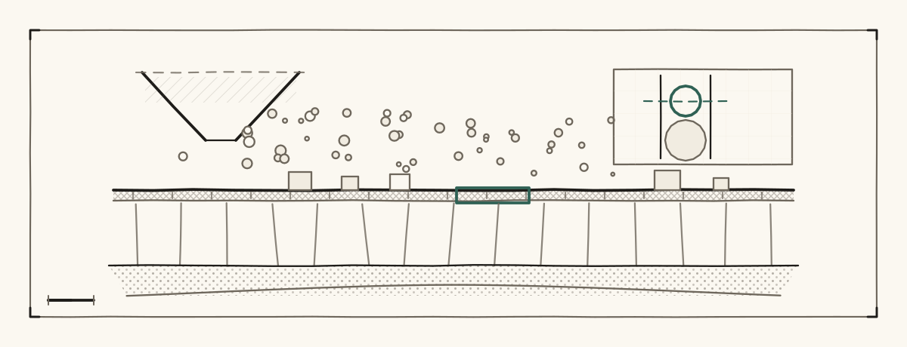
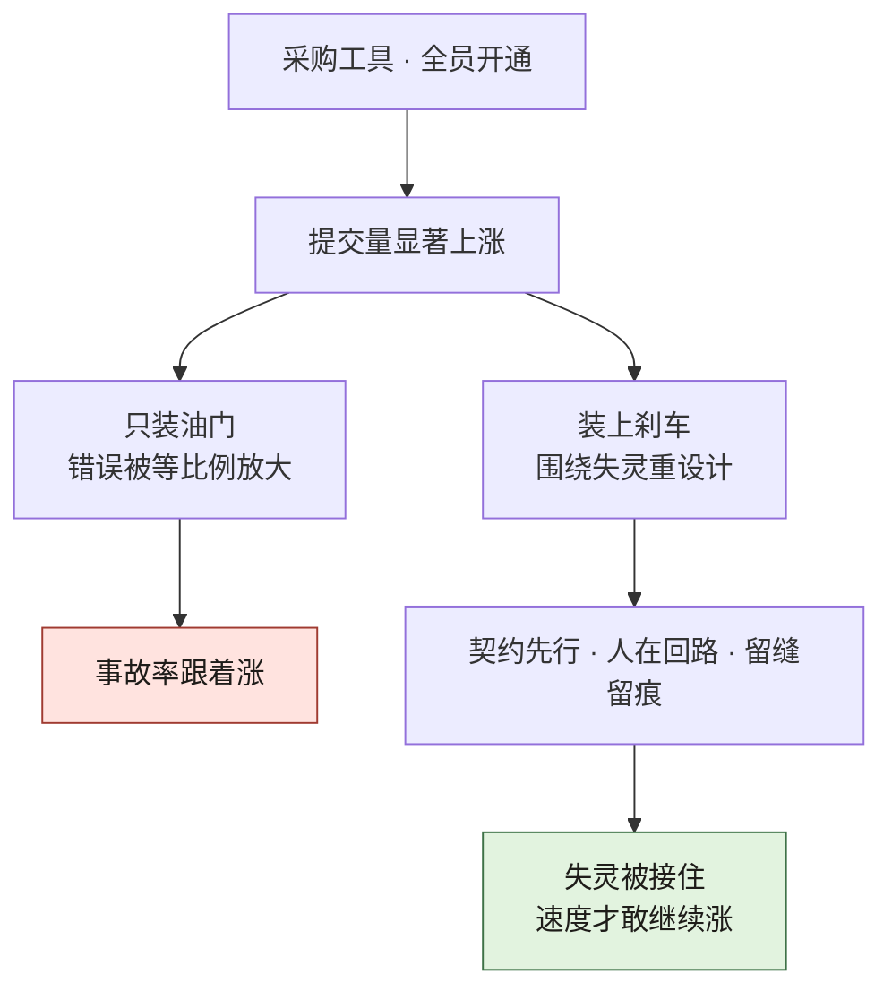
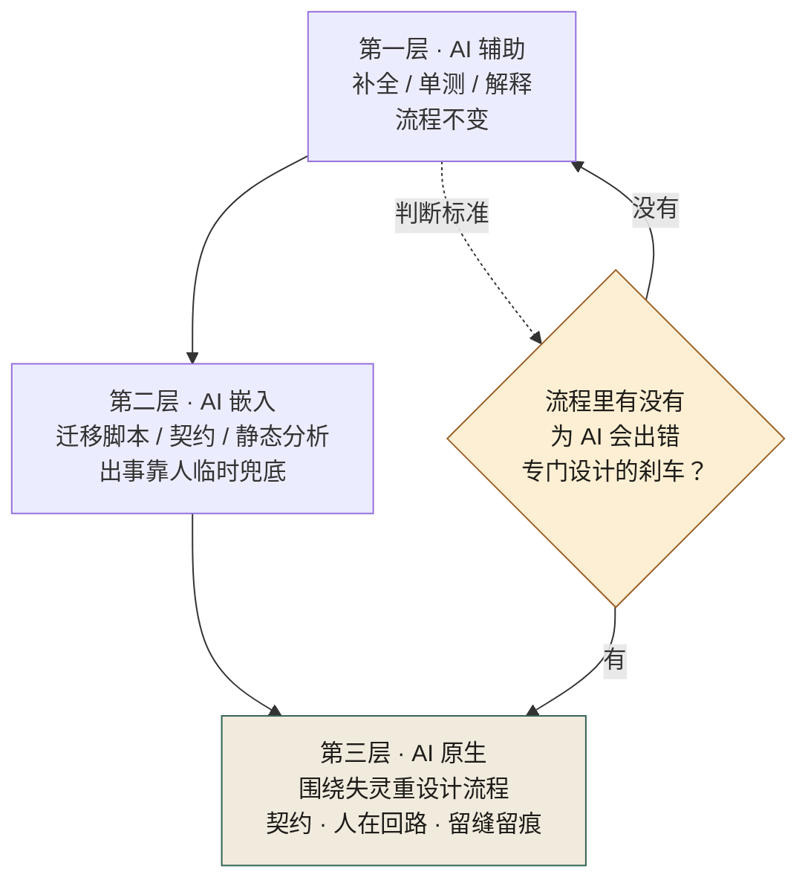
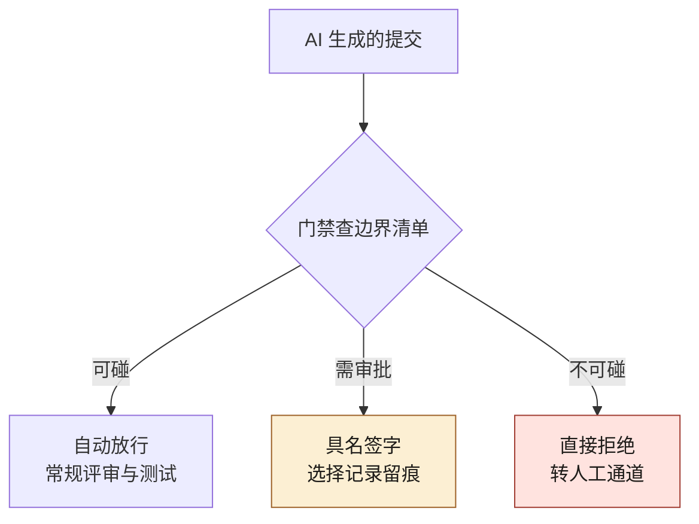
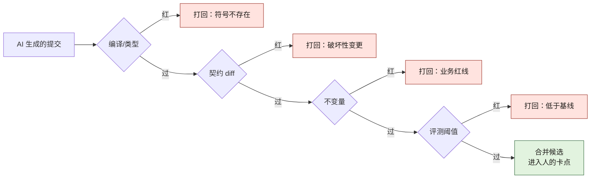

# 第 1 章 为什么 AI 原生不是"让 AI 写代码"

> **本章定位**：全书开篇立场章——定义"AI 原生"，划清它与"AI 辅助"的边界。
> **核心命题**：AI 原生的关键不在于 AI 写了多少代码，而在于当 AI 写错了，组织有没有一套机制能在造成损失之前接住。

<figure class="chapter-plate">
  
  <figcaption>题图 · 筛子：AI 写得快不是本事，写错了能被接住才是</figcaption>
</figure>

---

## 1.1 问题：买了 AI 工具之后，事故率涨了 60%

许多组织引入 AI 编码工具的经历惊人地相似：管理层统一采购一批工具，全员开通，头几个月提交量显著上升，然后在某一天，事故率也悄悄跟了上来。

在某电商平台的案例中（案例一），公司采购了三种 AI 编码工具，人均开通两个，许可费年化数百万元。头两个月提交量周环比涨 35%，一线工程师兴奋地分享"AI 一个人顶一个半人"的体验。但在第四个月，一次限流脚本重构中，AI 删除了一段它认为"没有功能输出"的延时代码——**那段代码的真正作用是在两次请求之间留间隔，防止上游风控接口被打爆。** 删除后系统正常通过所有自动化测试，却在生产环境触发了上游接口封禁，影响了上万笔交易。

这个事故的核心特征值得反复审视：**AI 的逻辑在它自己的语境里完全成立。** 从代码覆盖率的角度看，那一行延时确实是"废代码"——它不产生可测试的输出。AI 不知道的是，这段代码用延迟换取了安全，它的存在理由不在代码逻辑里，而在系统运维的隐性知识中。

**这不是一个孤立现象。** 在加密货币交易所的案例中（案例二），类似的事故以更高代价重演——AI 在撮合引擎重构中将定点数换成浮点数以提升性能，结果在高频交易下产生了累积精度偏差，最终差额达到数百万美元。在 Web3 量化基金的案例中（案例三），AI 生成的趋势策略在回测中表现惊艳，实盘却因过拟合而迅速亏损。在 AI 安全初创团队的案例中（案例四），一个修复智能体改了代码签名，无意中破坏了另一个检测智能体的规则基准。

四个案例的共同点：**组织花钱买的是一个没有主人的提效杠杆。** 杠杆谁都在用，但杠杆的另一头压着什么、压着谁，没有人说清楚。

---

## 1.2 根因：把"AI 辅助"当成了"AI 原生"

大多数组织最初对"AI 原生工程"的理解是：让 AI 多写代码。这个理解错在三个地方。

**① 把"辅助"当成了"原生"。** 组织买的是"AI 辅助"——AI 帮人写得快一点。但期望的却是"AI 原生"——好像只要 AI 写得够多，工程就自动升级了。**两者的区别是：辅助是把 AI 塞进现有流程；原生是围绕人机协作重新设计流程。** 做前者却期待后者的结果，是几乎所有组织的第一个误区。

**② 只放了"油门"，没装"刹车"。** 全员开通、人人可用、人人可合——这套配置只有鼓励没有约束。没有人定义哪些链路 AI 不能碰，没有规则说 AI 生成的代码谁审、出了事谁负责。**不是一线工程师不负责任，而是组织根本没有提供一个机制告诉他们"这段代码碰不得"。**

**③ 把"写得快"等同于"工程变好了"。** 代码量增长被当成好消息上报，但与此同时事故率也在增长。**在 AI 介入后，"写得多"反而成了风险的放大器，因为错误也被等比例放大了。** 交易所案例中，性能提升 40% 的代价是精度偏差数百万；量化基金案例中，策略生成速度提升的代价是过拟合导致的实盘亏损。

这三条归结成一句话：**「加了 AI 的旧工程」不是 AI 原生工程。** 真正的 AI 原生，不是 AI 写多少代码，是组织围绕"AI 会失灵"这件事，重新搭建一套工程秩序。

把这三条根因画成图 1-1，冲突会更直观——同一次采购、同一条「提交量显著上涨」，往下分成两支：只装油门的那支一路走到事故率跟着涨，装上刹车的那支才走到「失灵被接住、速度敢继续涨」。



**图 1-1｜油门与刹车** — 只装油门，速度与事故一起涨；装上刹车，速度才敢继续涨。

---

## 1.3 三层能力：辅助 / 嵌入 / 原生

AI 在工程体系中的角色可以划分为三层，用来回答"你的组织到底在哪一层"。定位时别只顺着图 1-2 的三级台阶数进度，要看那个虚线菱形：只问一句「流程里有没有为 AI 出错专门设计的刹车」——回答「没有」，生成物爬得再远也退回第一层；回答「有」，才谈得上第三层。



**图 1-2｜三层能力** — 只要流程里没有为 AI 出错设计的刹车，就还在第一层。

**第一层 · AI 辅助**：AI 帮人完成单个任务——代码补全、生成单测、解释代码。流程不变，人不变，只是人快了一点。大多数组织引入 AI 工具后停留在这一层。

**第二层 · AI 嵌入**：AI 进入了一些关键环节——生成迁移脚本、生成契约、做静态分析。流程部分改变，但出了事仍靠人临时兜底。这一层的典型状态是"出了事才知道该接手"，事后补救多于事前预防。

**第三层 · AI 原生**：整个工程流程围绕"AI 能做什么、会在哪里失灵、谁来接手"重新设计——契约先行、人在回路、留缝留痕、门禁不可绕过、发布可回滚。流程本身为 AI 重写，而不是把 AI 塞进老流程。

> **判断你在哪一层，有一个简单的标准：你的工程流程里，有没有哪怕一条是专门为"AI 会出错"而设计的？** 如果没有，不管你买了多少工具，你还在第一层。

这本书后面所有章节，讲的都是怎么从第一层爬到第三层。

---

## 1.4 组织冲突模式：谁支持、谁反对、谁买单

真实组织里，是否推进 AI 治理的立场由每个人的 KPI 决定，与"喜不喜欢 AI"无关。这在四个案例中一致呈现：

**决策层（CTO / 创始人）要的是 ROI。** 投入了 AI 工具采购费用，被追问回报。不反对 AI，也不反对治理，反对的是"花了钱还出事"。立场：谁能让事故率降下去，就支持谁。

**一线工程师要的是速度。** AI 让效率显著提升，他们害怕治理会把速度打回原形。立场：治理可以，但不能拖慢交付节奏。在电商平台案例中，一线工程师出事后的第一反应是"那段代码又不是我删的"——不是不在乎安全，而是他们的 KPI 上没有"安全"这一栏。

**风控 / 安全 / 合规要的是零损失。** AI 出事直接冲击他们的核心指标。立场：资金链路、安全规则、合规要求，AI 一律不许自主触碰。在交易所案例中，风控团队对资金计算链路拥有一票否决权。

**多端 / 产品团队要的是别炸用户。** 接口变更导致白屏、功能变更导致体验断裂，直接影响他们的留存指标。立场：AI 写代码可以，但碰到跨端契约必须经过审批。

**治理推动者要的是不被当替罪羊。** 这个角色在四个案例中都存在——被任命来"管 AI 的人"。做对了功劳是决策层的，做错了锅是自己的。

将这些人凑到一起时，最有效的开场问题不是"我们要不要治理"，而是："**如果治理会让你的 KPI 受影响，你能接受到什么程度？**" 真实组织里，没有一个决策是脱离 KPI 谈出来的。后面每一章的组织冲突分析，都围绕这个问题展开。

---

## 1.5 产出物：组织级 AI 使用边界清单

第一批落地的治理产出物，通常是一份《AI 使用边界清单》。它回答的问题只有一句：**哪些地方 AI 可以碰，哪些不可以。**

清单按业务域或功能模块逐域标注三类：
- **可碰**：AI 可自由生成（如配置代码、展示组件）
- **需审批**：AI 可生成但须人审（如查询接口、非关键链路变更）
- **不可碰**：AI 完全禁入（如支付对账、风控规则、链上合约部署、智能体权限提升）

三类边界要能被机器判定，才会从墙上的清单变成流水线里的门禁。图 1-3 把一次 AI 生成的提交分流三条：可碰的自动放行走常规评审、需审批的必须具名签字并留痕、不可碰的直接拒绝转人工通道——三条出口都是机器判定，没有一条叫「口头提醒」。



**图 1-3｜边界清单进 CI** — 清单只有变成门禁才拦得住提交；纸面边界必然被进度绕过。

不同案例的"不可碰"边界差异巨大：电商平台标注的是支付对账和风控规则；交易所标注的是资金计算精度和 KYC 规则；量化基金标注的是合约部署和策略上线；安全初创标注的是智能体提权和跨体变更。

第一批清单通常很短，因为大部分团队还说不清自己该归哪类。但它的意义不在内容多全，在于**这是组织第一次有人把"AI 的边界"写下来、签了字**。

> **代价声明**：边界清单发布后，一线的 AI 生成提交量通常会显著下降——电商平台案例中下降了约 22%。**治理的第一笔代价，是速度。** 这个数字不应被隐藏，它本身就是治理是否真实生效的度量。

---

## 1.5b 可测判据：一次 AI 变更在 CI 里会撞到的四类拒绝点

图 1-3 给的是边界清单的**空间形态**——一次提交按所属域分去三条出口。它的**时间形态**是另一张图：一条被标为"可碰 / 需审批"的 AI 提交往前走，在流水线里会依次撞上四类拒绝点。1.3 的判断标准只有一问（流程里有没有专为 AI 出错设计的刹车），这一问要变成可测判据，就看四件事：**四类拒绝点各立了几道、挂在哪一步、亮的是红灯还是黄灯、被拒时输出里有没有"为什么"。**

组织需要把刹车数成这四类，是因为它们各自兜住一种失灵模式，谁也替不了谁：

| 拒绝点 | 兜住的 AI 失灵模式 | 机器判据 | 红灯的典型形状 | 纵深在哪章 |
|---|---|---|---|---|
| 编译 / 类型 | 不自证完整——引用的符号根本不存在 | 编译器与类型检查的退出码 | 未定义符号、签名不匹配 | [第 14 章](./ch19-第14章-Python立包与迁移.md) |
| 契约 | 不跨上下文——改了实现，消费方还按旧结构取数 | 与已发布契约做 diff，破坏性即红 | 字段被删、枚举缩窄 | [第 9 章](./ch14-第9章-契约先行.md) |
| 不变量 | 不懂组织约束——业务红线不在代码里，在业务知识里 | 领域不变量写成可执行断言 | 断言消息直接点名被破坏的约束 | [第 10 章](./ch15-第10章-边界变测试.md) |
| 评测 | 不验证只推断——"听起来对"从没被样本集检验过 | 阈值门 + 回归门 | 分数低于基线、关键样本回退 | [第 24 章](./ch29-第24章-AI评审与幻觉处理.md) |

四类缺一类，对应那种失灵模式就在漏网——这与第 2 章的接管清单是同一个道理：右列有一格没人接，左列就漏防一种事故。



**图 1-4｜四类拒绝点串成流水线** — 每道门兜住一种失灵；全绿只是拿到进入人工卡点的资格，不是合并的许可。

图 1-4 里最容易被组织省掉的是第三道门，因为"不变量"听起来最虚。拿 3.1 那个促销事故说话：业务约束是"满减与折扣不能同时享受"，它不在代码里，在业务知识里——但它可以被写成一条可执行断言。下面的测试跑在一份"AI 重写后"的实现上，两种优惠被直接叠加：

```python
# promo.py —— AI 重写后的版本：满减与折扣直接叠加，互斥没了
def apply_promotion(price, full_reduction, discount):
    if full_reduction:
        price -= 50
    if discount:
        price *= 0.9
    return price
```

```python
# test_invariant.py —— 那条业务红线写成不变量
from promo import apply_promotion

def test_at_most_one_promotion_applies():
    # 不变量：满减与折扣互斥——同时开启时，生效结果必须等于只开其中一种
    both   = apply_promotion(100, full_reduction=True, discount=True)
    single = {apply_promotion(100, True, False), apply_promotion(100, False, True)}
    assert both in single, f"两种优惠同时生效了: {both}"
```

本机实跑（Python 3 + pytest，`python3 -m pytest -q test_invariant.py`，退出码 1），红灯原文如下：

```text
F                                                                        [100%]
=================================== FAILURES ===================================
______________________ test_at_most_one_promotion_applies ______________________

    def test_at_most_one_promotion_applies():
        # 不变量：满减与折扣互斥——同时开启时，生效结果必须等于只开其中一种
        both   = apply_promotion(100, full_reduction=True, discount=True)
        single = {apply_promotion(100, True, False), apply_promotion(100, False, True)}
>       assert both in single, f"两种优惠同时生效了: {both}"
E       AssertionError: 两种优惠同时生效了: 45.0
E       assert 45.0 in {50, 90.0}

test_invariant.py:8: AssertionError
=========================== short test summary info ============================
FAILED test_invariant.py::test_at_most_one_promotion_applies - AssertionError...
1 failed in 0.01s
```

判"这条不变量还活着"，看的就是这个退出码 1 和断言消息——**消息里点名了是哪条业务红线被破坏**，下一轮修订才有抓手；只报 "1 failed" 不带消息的断言，等于把线索丢回给人。

它什么时候静默失效：断言被人改成恒真、这道门被设成 warning（黄灯照样合并）、或者这条测试从 PR 流水线被挪进 nightly——三种形状都不再拦任何提交，但 CI 面板上它仍然"存在"。第 10 章会把这条判据说透：**挂在 nightly 上的 lint 不叫门禁，叫晚报。**

还要盯住一件事：图 1-4 全绿不代表该合并。四类拒绝点回答的是"这份产物坏没坏"，不回答"这个选择对不对"——满减与折扣到底允不允许叠加，是业务决策，落在第 2 章的人在回路卡点上。刹车是刹车，方向盘是方向盘。

现在可以回收本节开头的承诺：把 1.3 那句一问式的判断标准，升级成对每道拒绝点的**三态清点**。同一道门（比如不变量），有三种存在形态：

1. **缺失**——流水线里压根没有这一步。对应第一层：AI 写得对不对，全靠它自己。
2. **亮黄灯**——有这一步，但设成非阻断（warning、`continue-on-error` 一类）。对应第二层：门立着，出事靠人临时兜底，兜不兜得住看运气。
3. **红灯且带原因**——挂在合并前、跳过即失败、拒绝输出点名违反了什么。这是第三层的最低配置：流程为"AI 会出错"重设计过，且错误信息设计给下一轮修订用。

拿这四道门 × 三态去数自己的流水线，比回答"我们大概在哪一层"诚实得多：**数出来的不是感觉，是格子**——哪格是缺失、哪格是黄灯，一目了然，缺的格子就是下一个季度的工单。这套清点与 1.5 的边界清单是同一张表的两个轴：边界清单管"哪些域走哪条出口"，三态清点管"每类拒绝点有没有牙齿"。

---

## 1.5c 上下文与 token 预算：先把口径说清，是估算式还是分词器

三层能力的第二层（AI 嵌入）有一个隐蔽的失效姿势：把契约、代码、报错、规范一股脑塞进对话窗口，塞到什么算什么。**上下文是判断的原料，预算是原料的计量单位**——没有预算表的组织，等于允许 AI 在"不知道模型读到了哪里"的前提下被信任。这一节给一个最小量法；完整的上下文工程在 [附录 J](./ch41-附录J-AI系统工程.md)。

量 token 有两种口径，必须写明用的是哪一种，因为结果差着量级：

| 口径 | 怎么算 | 准不准 | 依赖什么 |
|---|---|---|---|
| 分词器口径 | 用模型厂商的分词器把文本切成真实 token | 精确 | 厂商词表，逐模型不同；离线或自托管环境常拿不到 |
| 估算式口径 | 按字符类折算法近似 | 系统性偏差，只用于量级判断与横向比较 | 任何语言运行时都能跑 |

本书这台机器没有离线分词器，所以下面全部用估算式，**并且把估算式本身写成可核对的脚本而不是心里的除法**（本机实跑，Python 3）。量法要有一个不变的被测对象，所以拿本书自己的三份写作元文件当样本——spec、风格指南、术语表，正是"想让模型遵守规则"时最常塞进去的三件：

```python
# budget.py —— 估算式口径：CJK 字符按 1 token/字，其余按 4 字符折 1 token
import pathlib

def est_tokens(text):
    cjk = sum(1 for ch in text if "\u4e00" <= ch <= "\u9fff" or "\u3000" <= ch <= "\u303f")
    other = len(text) - cjk
    return cjk + other // 4

files = ["docs/BOOK_SPEC.md", "docs/STYLE_GUIDE.md", "docs/GLOSSARY.md"]
budget = 128_000  # 示例窗口：取 128k 为例，换模型时改这一个数
for f in files:
    est = est_tokens(pathlib.Path(f).read_text())
    print(f"{pathlib.Path(f).name[:28]:28s} est_tokens={est:6d}  占窗口 {est/budget:.1%}")
```

真实读数：

```text
BOOK_SPEC.md                 est_tokens=  1772  占窗口 1.4%
STYLE_GUIDE.md               est_tokens=  2167  占窗口 1.7%
GLOSSARY.md                  est_tokens=  1071  占窗口 0.8%
```

这组示例读数说明三件事。**第一**，把写作规则三件套全塞进上下文，合计还不到示例窗口的四个百分点——"塞不下"在起步期往往不是容量问题，是组织问题，没人规定该塞什么。**第二**，估算式对中文文本给出的量级与"每字约一个 token"的直觉一致，但同一脚本跑代码文件会明显低估（标点、标识符切得碎），所以**跨文件比较用同一口径，绝对值要回分词器口径复核**——写进预算表的每个数都要标明口径，不然三个部门拿三个口径吵架。**第三**，读数里应当带"占窗口比例"而不是裸 token 数：预算表的本质是占比分配，换模型（换窗口）时重算比例就行，不必重新争论绝对值。

还有一条纪律来自这次实跑本身：我最初把脚本指向书稿章节，读数随文件被编辑而漂移——**预算读数必须钉住输入版本**（一个 sha256 或一次提交号就够），否则表上的数对应的是上个月的上下文，而不会有任何东西报错。

一条可以直接抄进任务模板的分配规则（数值以一次真实任务为例，不是标准）：

| 上下文成分 | 占比上限 | 为什么给它这么多 |
|---|---|---|
| 系统指令与边界清单 | 一成 | 每次都要在场，但它不该膨胀——超了说明清单在往里塞散文 |
| 契约与接口文本 | 三成 | 第 9 章的教训：AI 猜字段语义不如读契约原文 |
| 相关源码（按符号切块） | 三成 | 切块方法在 [第 7 章](./ch12-第7章-AI读懂祖传代码.md)，整文件塞入挤掉的正是这里 |
| 报错与红灯输出 | 一成 | 整段贴入，不摘录——摘录会截掉"哪一层不许碰哪一层"（第 10 章） |
| 生成留白 | 一成 | 模型的回答也要占窗口，不留白就等于让它写到一半被掐断 |

这套预算什么时候静默失效：**平台的截断策略不看清楚，预算表就是假的。** 窗口溢出时模型不会报错，它安静地基于读到的部分继续推断，而且不会说"我没读到尾部"——这正是[第 2 章](./ch07-第2章-人在回路.md)六种失灵里的"不验证只推断"。所以纪律只有一条：上下文包必须附**回显校验**，让模型复述关键锚点（文件数、末行内容、契约版本号），复述不出就是被截了，重塞而不是采信。

### 分词器口径这一半：tiktoken（本书未跑过）

上面那张表和 1.5c 前半的换算法都是**估算式口径**——快、无依赖，代价是每一格都带一个"约"。另一半天然是**分词器口径**：拿模型自己的词表把文本切一遍，数出来的才是它实际要付的那个数。这一半本书没有跑过，所以只登记形状与出处，不登记读数。

> **档位声明（tiktoken）**：**B 档 · 文档逐字，本机没有这个库（`pip` 从未装过它，也没有一行示例被这台机器执行过），因此"跑完看哪条输出"整格留空。**

- **版本口径**：**未核实**——本书不写它的版本号。上游 README 的定义句逐字为 "tiktoken is a fast BPE tokenizer for use with OpenAI's models."，要用的是后半句：**它按模型给词表**，这一条决定了它在预算表里的用法。
- **配置落点**：没有配置文件可落——它是被调用的一侧。要落的是一件元数据：**每次计量都连同"用哪个编码算出来的"一起记账**，否则一周后没人能解释这两个数为什么不一样。
- **最小可抄配置**：**本节不贴代码**——本书没跑过的东西不贴"看起来能抄"的片段，那是广告不是卡。要抄就去上游 README 取当前示例，取回来第一件事是用 1.5c 的换算法对一遍量级：差一个数量级说明你选错了编码，而不是模型变贵了。
- **跑完看哪条输出**：**未核实（整条空着）**。
- **它替代不了什么**：替代不了上面那张分配表。分词器只回答"这段多少 token"；"该给契约多少、该给报错多少、超了先削谁"仍是预算判断。两条口径各司其职：**估算式在写之前拦住手笔过大的任务，分词器在跑之后核对有没有骗自己。** 只留后一条，成本要到账单上才看得见；只留前一条，预算表永远差一个说不清的百分比。

> 一句话收口：预算表不是成本报表，是**证据表**——它记录你要求模型"必须看见什么才许开口"。

---

## 四案例映射

| 案例 | AI 失灵触发认知 | 边界清单核心"不可碰" | 从辅助到原生的关键一步 |
|------|----------------|---------------------|----------------------|
| 案例一·电商平台 | 限流延时被删→上游封禁 | 支付对账、风控规则 | 发布《AI 使用边界清单》并签批 |
| 案例二·加密交易所 | 撮合精度漂移→差额累积 | 资金精度计算、KYC 规则 | 强制定点数 + 精度回归测试 |
| 案例三·Web3 量化 | 策略过拟合→实盘亏损 | 合约部署、策略上线准入 | 四道闸门（样本外/鲁棒性/小仓位/人话解释） |
| 案例四·安全初创 | 智能体冲突→客户误拦 | 智能体提权、跨体变更 | Agent 行动权限矩阵 + 契约 |

---

## 1.6 检查清单

- [ ] 你的组织有没有一份"AI 可以碰什么、不可以碰什么"的清单？没有 = 还在第一层。
- [ ] 你的工程流程里，有没有哪怕一条是为"AI 会出错"专门设计的？没有 = 还在第一层。
- [ ] 你引入 AI 工具之前，先问了"出了事谁负责"吗？没问 = 事故在等你。
- [ ] 你的代码量涨了，你有没有同时查事故率涨没涨？只看前者不看后者 = 自欺欺人。
- [ ] 你的一线工程师是否清楚哪些链路 AI 不能碰？不清楚 = 边界还没落地。

---

## 1.7 反模式

| # | 反模式 | 后果 |
|---|--------|------|
| 1 | 把"AI 辅助"当"AI 原生" | 买了工具就以为升级了，事故照涨 |
| 2 | 只装油门不装刹车 | 错误被等比例放大 |
| 3 | 全员开通不给边界 | 人人可用 = 人人可闯祸 |
| 4 | 把代码量增长当 KPI | 写得多不等于写得好 |
| 5 | 治理只靠"希望大家自觉" | 自觉拦不住凌晨三点合并的人 |
| 6 | 边界清单只在墙上不在 CI 里 | 软约束在进度压力下必然被绕过 |

---

## 1.8 公开参照（可核实）

这不是只有本书在强调「流程重于再买工具」。

据 [DORA 2025《State of AI-assisted Software Development》](https://dora.dev/research/2025/dora-report/)：AI 的主要角色是**放大器**——放大组织既有的强项与弱项；最大回报不来自工具本身，而来自对底层社会技术系统的投入。

据 [GitHub × Accenture 2024-05-13 企业研究](https://github.blog/news-insights/research/research-quantifying-github-copilots-impact-in-the-enterprise-with-accenture/)（厂商主导的 RCT）：**采用后人均 PR 约 +8.69%、PR 合并率 +15%、成功构建 +84% 三项同向**——**速度与通过率可以同时变好，前提是评审与测试也在承压变强**；这与「只装油门」的组织状态是两回事。

> 公开报告不证明任何一家具体公司的事故数字；本书四案例仍是脱敏示范叙事。

---

## 1.9 遗留问题

- **边界清单怎么落到 CI 里？** 贴在墙上没人看；要让它真正起作用，得变成"不可碰的链路，AI 提交时直接被 CI 拦下"。这件事留给第 10 章（边界变成测试）。
- **AI 能不能帮组织判断"这段该不该用 AI"？** 这是边界清单的最高形态——不是人查表，是系统替你查。留给第 24 章（幻觉与 AI 评审）。
- **"三层能力"里，到底爬到哪一层才算够？** 答案是：爬到"流程里有专门为 AI 失灵设计的刹车"那一层。至于这个刹车长什么样，是后面所有章节的全部内容。

---

> **本章的一句话**：AI 原生的关键，从来不在于 AI 写了多少代码，而在于**当 AI 写错了，你的组织有没有一套机制能在它造成损失之前接住**。买工具是油门，搭治理是刹车——只装油门的车，开得越快，撞得越狠。
