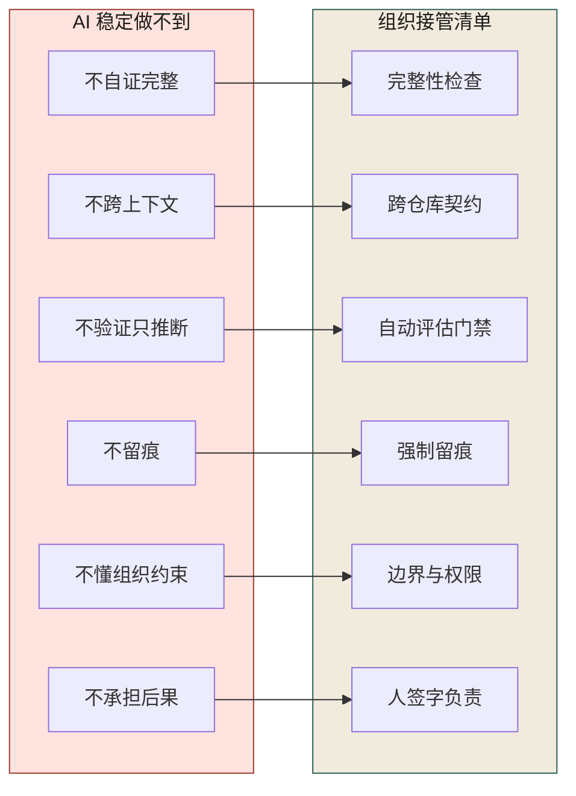
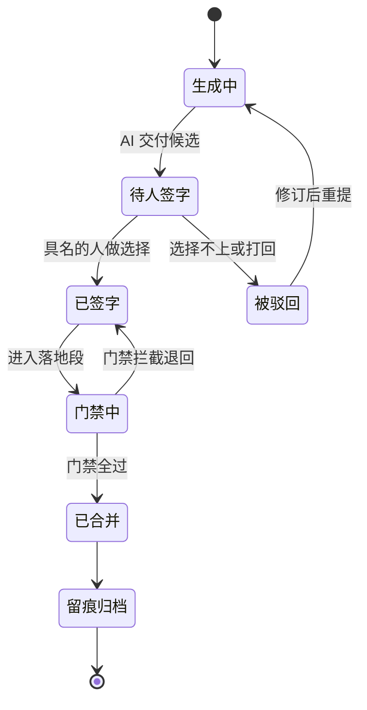
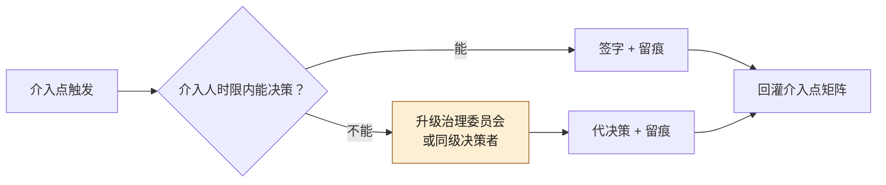
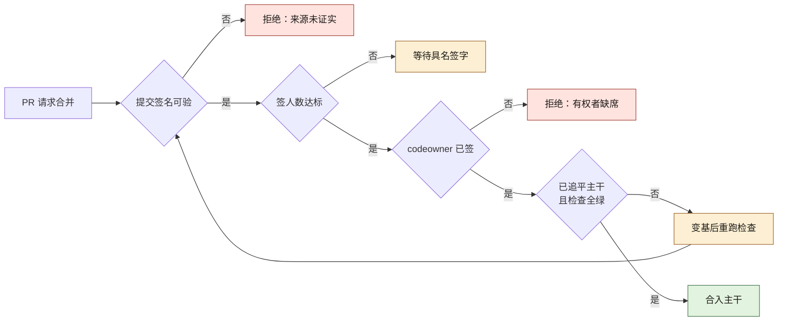

# 第 2 章 人在回路：AI 在复杂架构前为什么必然失灵

> **本章定位**：全书立场锚点——定义"AI 失灵"的六种模式，建立"跨角色介入点矩阵"。
> **核心命题**：AI 不扛责，而系统里总得有人扛——所以"人在回路"不是兜底，是接管。

---

## 2.1 问题：AI 说它"根据语义分析"兼容所有端，然后用户端崩了

在某电商平台的案例中（案例一），一次接口变更引发了典型的 AI 失灵场景。工程师询问 AI 新的返回结构是否兼容所有端，AI 回答"根据语义分析，新的返回结构兼容所有端"。工程师追问"你怎么验证的"，AI 回答"基于接口语义的兼容性推断"。

**它从未运行过任何一端的契约测试。**

结果是三端白屏数十分钟，数百单客诉，紧急回滚。事后复盘时，一个令人不安的细节浮出水面：**问问题的工程师其实知道不对劲，但他还是点了"合并"。** 因为要上线，因为评审已经积压数天，因为"AI 都说兼容了"是一句可以用来分散责任的话。

事后，一位多端负责人说了一句值得反复引用的话："**AI 改一次接口，三个端要发版，谁扛？它扛吗？它不扛。我扛。**"

这就是"人在回路"的起点——**不是因为 AI 笨，是因为 AI 不扛责，而系统里总得有人扛。** 这种模式在所有四个案例中都重复出现：交易所案例中，AI 说精度没问题但不对账；量化案例中，AI 说回测收益高但不做样本外验证；安全初创案例中，智能体说"我需要更多权限"但不懂权限边界。

---

## 2.2 根因：AI 的"失灵"不是偶发故障，是它的默认行为

将多个案例中所有 AI 相关事故摊在一起，可以归纳出六种失灵模式。**没有一种是 bug，全部是 AI 的正常工作方式。** 图 2-1 左列是 AI 稳定做不到的六件事，右列是组织必须站上去的六个位置——「不自证完整」由完整性检查顶住，「不承担后果」由人签字负责顶住；右列有一格没人接，左列对应的那种失灵就漏防一种事故。



**图 2-1｜六种失灵 → 组织接管** — 失灵模式即接管清单，一一对应组织动作。

**① 不自证完整。** AI 生成迁移脚本，它不知道自己漏了字段。它没有"完整性"这个概念，只有"生成下一个最可能的 token"。电商平台案例的对账事故、交易所案例的精度事故，都死在这里。

**② 不跨上下文。** AI 改这个仓库的代码，它不知道另外上百个仓库里谁依赖它。对它来说，跨仓库一致性不存在。

**③ 不验证只推断。** "根据语义分析"是 AI 的典型输出——它把"听起来对"当成了"是对的"。量化基金案例中，AI 把历史数据的拟合当成了未来的预测力。

**④ 不留痕。** AI 不会自己记下"我用了哪个 prompt"。留痕这件事必须人来做。

**⑤ 不懂组织约束。** AI 不知道风控链路禁碰，不知道哪些域在灰度，不知道哪段代码上次出过事。这些是组织知识，不在它的上下文里。安全初创案例中，智能体不知道"能提权"不等于"被授权提权"。

**⑥ 不承担后果。** 这是最根本的一条。AI 把系统改崩了，被回滚的是人，被扣绩效的是人，被用户骂的是人。**AI 没有 KPI，所以 AI 永远会过度乐观。**

六条归结成一句：**AI 没有边界感、没有完整性、没有责任体。** 这三样东西在传统组织里是由人提供的，现在 AI 把人的活抢了一半，这三样却没人补——这就是失灵的根。

---

## 2.3 AI 用法：从"个人英雄救火"到"流程化介入"

在案例一的接口事故中，介入的是一个经验丰富的负责人。他能救火，是因为经验够、手够快、当晚在线。**但一个数百服务的平台，不能靠"每次都有个救火的人在线"撑着。**

治理的第一个动作不是给 AI 加限制，而是**把"人什么时候必须介入"变成一张表**。原则三条：

- **AI 做可能，人做选择。** 生成是 AI 的事，"上不上、怎么上"是人的事。
- **介入点是组织资产，不是个人本事。** 某个负责人的判断要能被复用，不能跟着人走。
- **介入必须留痕。** 谁在哪一步接的手，要能审计。

落到 AI 用法上，工作流被切成三段：**生成 → 介入 → 落地**。生成段 AI 自由；介入段必须有人签字；落地段自动跑门禁。**中间那段，就是"人在回路"的全部重量。**

把这三段画成一张变更状态机，"回路"的位置就一目了然——它是流程里一个**不可跳过的状态**，而不是一句口号：



**图 2-2｜变更状态机与人在回路卡点** — 「待人签字」是不可跳过的状态；跳过它，后面每一步都在裸奔。

---

## 2.4 跨角色介入点矩阵

这张矩阵是推行到全组织的核心产出物。**它的价值不在"AI 能做什么"，在"谁必须在哪一步接手"。**

| 工作流节点 | AI 做 | 失灵风险 | 必须介入的人 | 介入方式 | 留痕物 |
|-----------|------|---------|------------|---------|--------|
| 契约设计 | 生成草稿 | 漏字段/错语义 | 契约 Owner | 终审签字 | ADR |
| 代码生成 | 写实现 | 绕契约/跨仓库冲突 | 技术负责人评审 | 评审通过 | PR+prompt 记录 |
| 数据迁移 | 生成脚本 | 漏字段/丢语义 | 风控+DBA | 双人复核 | 迁移对账单 |
| 接口变更 | 改实现 | 端上不一致 | 多端负责人 | 契约 CI | 契约测试报告 |
| 上线灰度 | 生成配置 | 漏限额/漏降级 | SRE+风控 | 灰度审批 | 灰度检查单 |
| 事故应急 | 辅助定位 | 幻觉式归因 | SRE | 人工验证 | 复盘 ADR |

> **这张表的关键在第三列和第四列——它把"谁负责"钉死了。** 资金相关的两行（数据迁移、上线灰度），风控负责人要求必须有人在他的那一栏，否则整行作废。

矩阵的意义在于：让"英雄式救火"不再是系统的依赖。

---

## 2.5 产出物：介入点矩阵 + 责任人 + 升级路径

可落地的三件套：

1. **《跨角色介入点矩阵》**：上表，逐业务域或功能模块实例化，高风险链路加注专属签字人。
2. **责任人 RACI**：每个介入点一个 Accountable，一个 Responsible，避免"大家都负责等于没人负责"。
3. **升级路径**：介入人在约定时间内无法决策时，向谁升级（默认向治理委员会或同级决策者）。

三件套里最容易被省略的是第三件——因为它平时用不上。升级路径的价值恰恰在介入人缺席的那一刻体现：图 2-3 里那条「不能」分支就是它——介入人在时限内答不出，动作是升级委员会代决策并留痕，而不是让回路停在原处等人的回复。



**图 2-3｜介入升级路径** — 介入人不在时回路不能断；升级路径是回路的第二重保险。

> **代价声明**：矩阵上线后，评审积压通常会缩短，但一线提交量会下降——因为多了一道审批环节。这个代价不应隐藏，它本身就是治理是否真实生效的度量。

---

## 2.5b 场景细节：一次"该叫的人"被叫错的夜晚

拿 E-0311 重演推演来说明回路在真实压力下怎么走形（事实与数字以数字清单为准）：

- **21:40** 交易域一线提交商品详情接口的返回结构调整，AI 生成实现。变更要赶在次日大促预热前发布。
- **22:05** 一线在多端群里 @ 了"端上最熟的同学"——一个前端工程师，不是矩阵里写的多端负责人。他看了两分钟，回了"结构看着没问题"。
- **23:20** 发布。凌晨灰度全量。
- **次日 09:00** 三端白屏累计 2 小时，客诉 1240 单。复盘时那个被 @ 的前端工程师说了一句让全场安静的话："**没人告诉我要跑契约测试，我也不知道这三个端谁依赖这个字段。**"

两个失败点，都不是"没人审"：**第一，介入人被现场 @ 错了**——回落在依赖某个人的好意，而不是矩阵那一行；**第二，审的人拿到的只有 diff**——没有契约测试报告，没有 prompt 记录，他除了"看着没问题"之外没有任何可依据的东西。**没有证据的介入不是介入，是陪葬。**

---

## 2.5c 可抄工件：审批记录——签的不是"同意"，是证据

对策一句话：**签字必须附证据，证据缺项，记录页提交按钮就是灰的。** 字段进 PR 模板与审批系统（示意，字段名替换为你系统的）：

```yaml
# signoff-record.yml —— 一次人工介入的完整记录
change_id: PR-trade-2025-0311-077
matrix_row: 接口变更                  # 必须能指回介入点矩阵的某一行；指不出 = 不该有人签
ai_generated: true
ai_artifacts:
  tool: <AI 工具/智能体名>
  prompt_ref: <组织级 prompt 编号或生成任务 ID>   # 接第 23 章的 prompt 归档
evidence:
  contract_test_report: <链接>        # 缺此项按钮为灰——"我看着没问题"不是证据
  impact_scan: <跨仓库消费方扫描结果链接>
risk_level: cross_client              # 影响面分层决定签字人，不取决于申请人职级
signoff:
  name: 多端负责人（具名，写"XX 组"视为未签）
  decision: approved | rejected | escalated        # 不允许空着，不允许"同意，但……"
  signed_at: 2025-03-11T22:05:00+08:00
  waited_before_sign: 15min           # 签前停留时长，系统自动记录，不是人填的
escalation:
  used: false
  reason: <介入人缺席/超时限才为 true>
```

这张记录同时回答复盘时的三个问题——**谁签的、他当时看得见什么、他想了多久**。三问有一问答不上，这次介入就等于没发生。

---

## 2.5d 度量与反例：人怎么退化成橡皮图章

| 指标 | 怎么测 | 阈值 | 谁看 | 多久看一次 |
|------|--------|------|------|-----------|
| 介入覆盖率 | 矩阵各行的 AI 变更中带完整审批记录的比例 | 资金/跨端行全覆盖；起步期爬坡口径比照 prompt 留痕率（数字清单：0% → 94%） | 治理组 | 周 |
| 中位签前停留时长 | waited_before_sign 的中位数 | 低于 10 分钟持续两周即判定橡皮图章、触发复核——**这条线是拍的，用于起手，不是标准**；拿它跟矩阵上线前 3.1 天的评审积压对照着看，两头都别骗自己 | 治理组 | 周 |
| 驳回率 | rejected / 全部介入 | 长期为零 = 介入段没有牙（与第 3 章选择点驳回率同判据） | 治理委员会 | 月 |
| 证据完备率 | 抽查审批记录，evidence 链接真实可打开且非空的占比 | 经验阈值：90% 以上——抽查比例自己定，但没有抽查，100% 也是自欺 | 治理组 | 月 |
| 升级使用次数 | escalation.used 计数 | 长期为零 = 介入人从不缺席，可疑；全部超时才升级 = 升级路径没人敢用 | 治理组 | 月 |

橡皮图章有三个前兆，按出现顺序：**第一，证据字段被填成「见群聊」**——链接点不开，但形式上齐了；**第二，介入人开始只看 AI 写的变更摘要，不看 diff**——他审的是 AI 的转述，不是 AI 的产物，而 AI 恰恰"不自证完整"；**第三，签字人自己承认「我基本没看过，看不懂」**——这不是态度问题，是矩阵把介入点挂在了没有判断材料的人身上，要么配证据工具，要么换那一行的介入人。

还有一条**伪介入**要单独点名：把介入做成"事后补签"。上线后再让介入人补一条 approved 记录，留痕率照样好看，但回路已经断了——**「待人签字」必须出现在「已合并」之前，状态机的顺序就是防线的顺序（图 2-2）**。度量上很好抓：比较 signed_at 与合并时间戳，逆序即伪介入，直接进复盘。

---

## 2.5e 审批链的机器形态之一：把介入点矩阵镜像成 CODEOWNERS

2.5b 那个夜晚真正的病灶，是介入点矩阵只是一张**文档**——文档靠人想起来去查，而现场 @ 的是"端上最熟的同学"。把"谁必须签"从文档搬进仓库的第一站是 CODEOWNERS：它让平台按路径自动把评审请求路由到具名 Owner，签字人跟着 PR 走，不跟着群聊走。组织需要它，是因为**矩阵的第四列（必须介入的人）只有变成仓库里的文本文件，"叫错人"才会从一次失误变成一个门禁红灯**——路由错了，合不进去。

语法按规范口径写（本节不声称本机跑过平台校验，行为以你自托管平台的文档为准）：文件放在仓库根、`.github/` 或 `docs/` 三个位置之一；`#` 起注释行；每行是一个 gitignore 风格的路径模式，后面空格分隔若干 owner——`@用户名`、`@组织/团队名`，或外部贡献者的邮件。最关键的一条排序规则：**同一文件命中多条模式时，写在后面的那条生效**。所以越具体的规则要越写在后面，通用兜底写在最前面。

拿 2.4 的矩阵逐行镜像（示意，路径与账号替换为你仓库的真实值）：

```text
# .github/CODEOWNERS —— 跨角色介入点矩阵的机器镜像
# 通用兜底在前，专项规则在后（后面的命中优先）
*                                  @dev-oncall

# 矩阵行 · 契约设计
/docs/contracts/                   @contract-owner

# 矩阵行 · 数据迁移（风控 + DBA 双人复核的"双人"，在这里就是两个 owner）
/db/migrations/                    @dba-lead @risk-lead

# 矩阵行 · 接口变更（离端最近的人持有签字位）
/trade/api/                        @trade-tl @multi-end-lead

# 矩阵行 · 上线灰度
/deploy/canary/                    @sre-lead @risk-lead
```

这份文件替代不了什么：它只回答**该叫谁来**，不回答**他能不能不签**——后者要靠 2.5f 的分支保护，两件合起来才是审批链。它的静默失效面恰好都在"没人会报错"这一侧：

- **路径模式拼错**——那一目录实际无人所有，平台不会提醒你这行规则从未命中过任何文件；
- **顺序写反**——通用规则写在专项规则后面，把资金路径的签字位覆盖成 `@dev-oncall`，从此涉资变更按普通流程放行；
- **owner 账号失效**——人离职、团队改名后，评审请求仍路由给幽灵签字人，链路"正确地"挂着，只是永远不会有人签；
- **与矩阵脱钩**——矩阵改了行、CODEOWNERS 没跟着改。对策是把它当对账对象：每季度把矩阵行与 CODEOWNERS 块逐条 diff，差异本身就是审计发现。

---

## 2.5f 审批链的机器形态之二：分支保护的三态——评审数、strict、codeowner

CODEOWNERS 是路由器，分支保护是门闩。三态各堵一种橡皮图章的形状，字段语义按 GitHub 分支保护规范口径写（具体字段名与可选值以你的自托管平台 API 文档为准）：

| 态 | 规范里的字段位 | 堵住的失效形状 | 它自己防不住的 |
|---|---|---|---|
| required reviews | `required_pull_request_reviews.required_approving_review_count` | "一人顺手点同意"——最少签人数不达标，合并按钮不出现 | 签的人都不看内容 |
| strict | `required_status_checks.strict` | "签过的不是要合的"——分支必须先追上最新主干、检查在新基线上重跑全绿才许合 | 检查本身是黄灯 |
| codeowner | `required_pull_request_reviews.require_code_owner_reviews` | "人数凑够了但没叫到有权的人"——2.5b 之夜的直接解药 | Owner 秒签（见 2.5d 的签前停留时长） |

三态同时亮的时候，还要盯另外两个开关：`enforce_admins` 决定管理员是否也被这套规则拦住——**管理员一键合并是审批链最常见的旁路**；绕过名单（哪些应用或团队可以直接绕）在 API 版本间字段名有变，本书不写具体形状，但纪律只有一条：**绕过面要逐条登记、定期重审，名单上每一个条目都要有具名批准人**。完整绕过面清单在第 19 章（[五层门禁](./ch24-第19章-五层门禁.md)）。

一次 AI 生成的 PR 想合进主干，四道门串起来是这样：



**图 2-4｜合并前四道门** — 签名证明谁提交的，人数证明审的够多，codeowner 证明有权的人签了，strict 证明签的就是要合的。

注意图 2-4 里"否"的两条回路不同：strict 不满足是**技术性重跑**（变基、检查，机器行为），codeowner 不满足是**组织性等待**（叫到人或走升级路径，人的行为）。把两者混成"再试一次"，就等于把 2.5b 那种叫错人的错误自动化了。

静默失效面：分支保护常只配在主干，长期分支与发布分支规则为空——AI 智能体最爱走的就是这些旁路分支；另外检查上下文中如果没登记契约测试与不变量测试（第 1 章图 1-4 那四类拒绝点），strict 只保证"登记的检查"绿，不保证该登记的都登记了。

---

## 2.5g 审批链的机器形态之三：签名提交——git verify-commit 与它的静默

前面两条门拦的是"谁点了同意"。还有一件事没人拦：**这条提交本身是谁产生的**。签名提交回答的就是这个——`git commit -S` 让提交附带一个 GPG（或其它格式）签名，`git verify-commit` 在验签链成立时退出 0。对 AI 介入的仓库，这条证据链有组织学意义：**AI 智能体产生的提交应当用独立身份签名、密钥由平台侧持有**，这样"人签批的评审"与"机器产生的代码"在 git 对象层面就是两种来源，复盘时不必靠猜。

这一节本机实跑（git 2.53.0 + gpg 2.4.8，临时仓库；下面三段转录都以 `LC_ALL=C` 前缀跑出——同一台机器不加这个前缀时，人类可读文案是中文打印的。实验密钥现生成、签完即删，所以签名不对应任何真实身份；第三段转录里剔除了两行与签名无关的钥匙环初始化提示）。先看**没有签名**的提交被验证时发生什么：

```bash
$ git verify-commit 3cb73fd > out.txt 2> err.txt; echo "exit=$?"
exit=1
$ wc -c out.txt err.txt
0 out.txt
0 err.txt
0 total
$ git log -1 --format='%h %G?' 3cb73fd
3cb73fd N          # N = 无签名
```

这是全书"静默失效"的一个标本：**verify-commit 对未签名提交不打印任何文字，只在退出码上翻脸**——两条流都是零字节。谁在 CI 里 grep 报错文案、谁只看绿灯日志，谁就会被它骗过去。

再看**签名且验签链成立**时的读数（实验密钥还在钥匙环里时跑的）：

```text
$ git verify-commit --raw 9d57dcc 2>&1
[GNUPG:] NEWSIG throwaway@example.com
[GNUPG:] KEY_CONSIDERED BA8380584435EA4CAAADD35FD17FE0EC3796539B 0
[GNUPG:] SIG_ID K7pzpTPTWgf3j98V1yqddfG7+LE 2026-09-25 1790304839
[GNUPG:] GOODSIG E80ADDD7674D753F Throwaway Tester <throwaway@example.com>
[GNUPG:] VALIDSIG CF0D476B6273FCE6295DE79EE80ADDD7674D753F 2026-09-25 1790304839 0 4 0 22 10 00 BA8380584435EA4CAAADD35FD17FE0EC3796539B
[GNUPG:] KEY_CONSIDERED BA8380584435EA4CAAADD35FD17FE0EC3796539B 0
[GNUPG:] TRUST_ULTIMATE 0 pgp throwaway@example.com
$ git log -1 --format='%h %G?' 9d57dcc
9d57dcc G          # G = 有效签名
```

注意机读行（`[GNUPG:]` 状态码）与人类文案的分工：GOODSIG 这类状态行不随 locale 变，而 `--show-signature` 下面跟的"完好的签名/Good signature"那类句子会变。**门禁只准断言前者。**

最后是把实验密钥从钥匙环删掉后再验同一条提交——这是生产里"密钥轮换未同步"的缩影：

```bash
$ git verify-commit 9d57dcc
gpg: Signature made Fri Sep 25 10:53:59 2026 CST
gpg:                using EDDSA key CF0D476B6273FCE6295DE79EE80ADDD7674D753F
gpg:                issuer "throwaway@example.com"
gpg: Can't check signature: No public key
$ echo $?
1
$ git log -1 --format='%h %G?' 9d57dcc
9d57dcc E          # E = 无法完成校验
```

三段读数放在一起，判据的形状就出来了：**退出码加 `%G?`（N / G / E）才是机器能依赖的面，人类可读文案不是。** `%G?` 的完整取值集合请以你环境的 git 文档为准，本节只报告实跑见到的三个值。合并前的逐提交门禁就是这两样东西的组合（本机实跑过等价形状：把 `BASE` 换成 `3cb73fd`，对未签名与验不出的提交逐条点名）：

```bash
# CI：合并前逐提交验签；判据 = 退出码，不是输出文案
git rev-list --no-merges BASE..HEAD |
  while read c; do
    git verify-commit "$c" >/dev/null 2>&1 || { echo "commit $c 验签失败"; exit 1; }
  done
```

```text
commit 9d57dcc86d206fbe19c02b1a938c2ea82911d3b5 验签失败   # 整条流水线退出码 1
```

平台侧的 verified 标识与本机 `git verify-commit` 是**两条独立的信任链**：前者信平台的密钥托管，后者信你钥匙环里有什么。审计脚本必须写清信的是哪条，否则会出现"平台显示已验证、本地验证失败"这类两边都坚持自己没错的扯皮。

它替代不了什么：**签名只证明来源，不证明正确，也不证明审过。** 一个有有效签名的提交照样可能没跑契约测试——那是 2.5f 三态门的职责。它的静默失效面：`required_signatures` 类保护没开启时，验签只存在于你自己写的脚本里，平台照常放行未签名合并；以及上面第三段读数演示的——密钥撤销、轮换没同步，历史提交从 G 静默漂到 E，审计结论跟着变 yet 无人收到通知。

---

## 2.5h 例外审批的策略表达：把"就这一次"写成会过期的记录

三态门 + 签名链再严密，组织里一定会有例外：凌晨故障要修、签字人失联、大促前窗口关闭。例外不可耻，**不可审计的例外**才可耻——例外若只存在于群聊里，它与"绕过门禁"在证据上无法区分。对策是把例外本身做成策略记录：谁批的、降了哪一道、降到什么程度、几点自动恢复。

可抄的记录形状（进审批系统或仓库配置，示意）：

```yaml
# exception-approval.yml —— 一次例外审批的最小完整记录
exception:
  scope:
    repo: trade-core
    branch: hotfix/restore-delay-guard   # 例外只属于一条分支，不属于一个人
    relaxed_gate: codeowner_review       # 明确写降哪一道；"审批从简"不是合法取值
    to_level: require_ticket             # 降到什么程度：签字可后补，工单不可缺
  granted_by: 风控负责人（具名）          # 与申请人不得为同一人
  requested_by: 一线值班（具名）
  reason: 上游封禁复现，修复路径 15 分钟内无法叫齐 codeowner
  ttl_hours: 6                           # 到期自动恢复原保护，恢复动作同样留痕
  ticket_ref: CHG-77
  post_review_due: next-standup          # 例外用后必须回看：为什么叫不齐人？矩阵要不要改？
```

配套的三条判定规则，写在门禁配置注释里、不写在记忆里：

1. **例外只能降数量，不能降为零**——"两人签"可以降成"一人签"，"codeowner 必签"不能降成"无人必签"；降为零的审批不是例外，是取消。
2. **资金链路不设例外**——与第 19 章的风控豁免同构：豁免判定由风控系统扫描变更内容做出，一线不能自己声明"这次与资金无关"（详见 [第 19 章](./ch24-第19章-五层门禁.md)）。
3. **到期即恢复，恢复要留痕**——TTL 到点后门禁回到原状态这一动作本身进审计日志；例外长期不过期，等于保护字段被改写而从未登记。

如果组织已有策略引擎，2.5e–2.5h 这套可以整体搬进策略文件做机检——例如用 Rego 表达"例外不得覆盖资金路径"这一条（语法按规范口径，策略即代码的完整展开在第 19 章）：

```rego
# 判定式：本次例外申请是否可批
allow_exception {
    input.relaxed_gate != "risk_control_gate"   # 风控层门禁不在可降集合
    input.granted_by != input.requested_by       # 批准人与申请人不得同人
    input.ttl_hours <= 24                        # 无 TTL 的例外不允许存在
}
```

这一段的全部要点浓缩成一句：**例外审批的机器形态，就是让"就这一次"变成一条有到期时间的记录**——它允许组织在压力下不失忆，也不失守。

---

## 四案例映射

| 案例 | AI 失灵如何触发"人在回路" | 介入矩阵的核心"不可绕过"行 | 介入点的组织化产出 |
|------|--------------------------|---------------------------|-------------------|
| 案例一·电商平台 | 接口变更未验证契约→三端白屏 | 资金迁移须风控签字 | 跨角色介入点矩阵（六行） |
| 案例二·加密交易所 | 撮合精度漂移未被实时检测 | 资金计算变更须精度回归测试 | 交易所增量治理清单（精度/合规/降级） |
| 案例三·Web3 量化 | 策略过拟合未被样本外拦截 | 合约部署须审计签字 | 四道闸门（样本外/鲁棒性/小仓位/解释） |
| 案例四·安全初创 | 智能体跨体变更无契约约束 | 智能体提权须人工审批 | Agent 行动权限矩阵 |

---

## 2.6 检查清单

- [ ] 你的每个 AI 工作流，能不能指出"哪一步必须人签字"？指不出 = 没有回路。
- [ ] 介入点是写在某个人脑子里，还是写在组织资产里？前者叫"个人英雄"，后者叫"回路"。
- [ ] 资金/风控/安全链路，矩阵里有没有一行是"AI 不参与"？
- [ ] 介入决策有没有升级路径？介入人请假了谁顶？
- [ ] 每次介入，有没有留痕物（ADR / 审批 / prompt 记录）？
- [ ] 你的介入矩阵覆盖了全部六种失灵模式吗？只覆盖了"不验证" = 其余五种在漏网。

---

## 2.7 反模式

| # | 反模式 | 后果 |
|---|--------|------|
| 1 | 把"人在回路"理解成"AI 写完人看一眼" | 看一眼不叫回路，叫走神 |
| 2 | 介入点只写在强人脑子里 | 强人离职，回路崩塌 |
| 3 | 介入不留痕 | 出了事无法追溯，等于没介入 |
| 4 | 所有环节都让人介入 | 等于没用 AI，一线造反 |
| 5 | 资金/安全链路也想"半自动介入" | 高风险链路的事故前奏 |

---

## 2.8 公开参照（可核实）

[DORA 信任研究（2024-09-13）](https://dora.dev/insights/trust-in-ai/) 指出：组织若能证明「评审与自动化测试是严的」，开发者对 gen AI 的信任会上升——因为错误会在进生产前被接住。这正是「人在回路」的公开注脚：**回路不是不信任 AI，是让信任建立在可验证的反馈上。**

同一研究的五条策略里，**可接受使用政策（AUP）**、**鼓励但不强制** 与本章介入矩阵的「谁签字、何时叫人」直接同构。

---

## 2.9 遗留问题

- **介入点的责任人，谁来当？** 矩阵画出去了，但"契约 Owner 是谁""安全签字人是谁"，每个团队都要吵一轮。这是第 9 章（契约治理）和第 26 章（组织治理）要解决的。
- **介入的"度"在哪？** 介入太多，AI 提效被吃光；介入太少，事故重演。这个度，是用试点跑出来的，没有公式。留给读者自己试。
- **AI 能不能自己识别"我该叫人"？** 这是第 24 章（幻觉处理）的话题。答案是：能提醒，不能决策。

---

> **本章的一句话**：人在回路不是给 AI 兜底，是承认一件事——**在任何一个组织中，"谁负责"比"谁写得快"重要一万倍。AI 把后者变容易了，前者就必须由人重新接管。**
