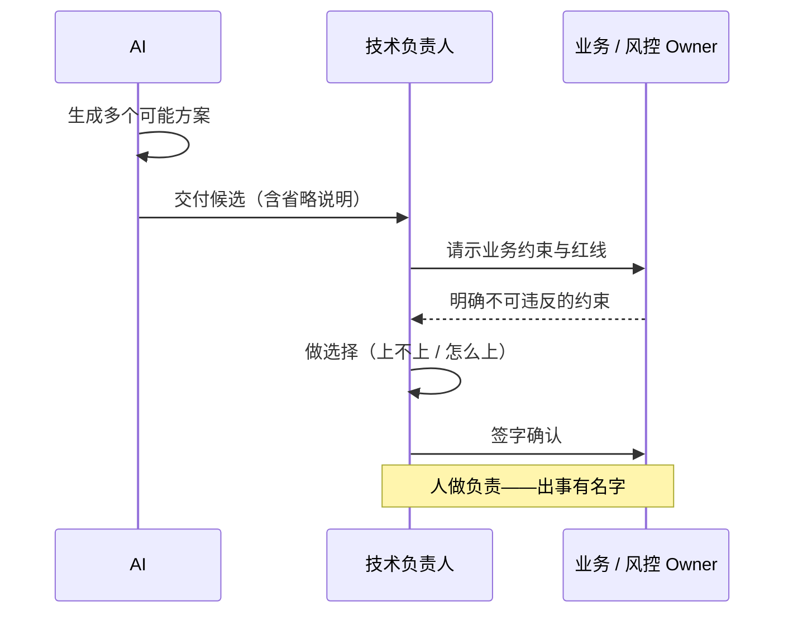
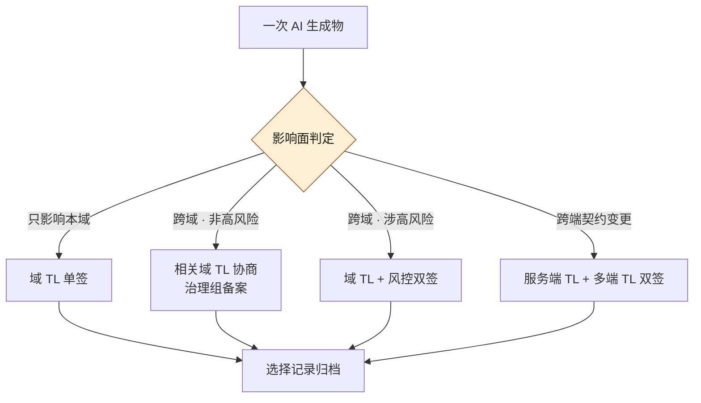
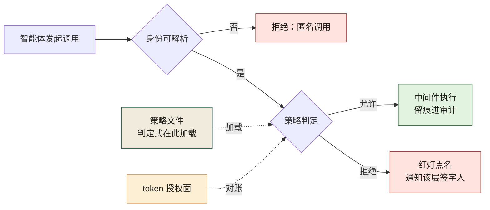
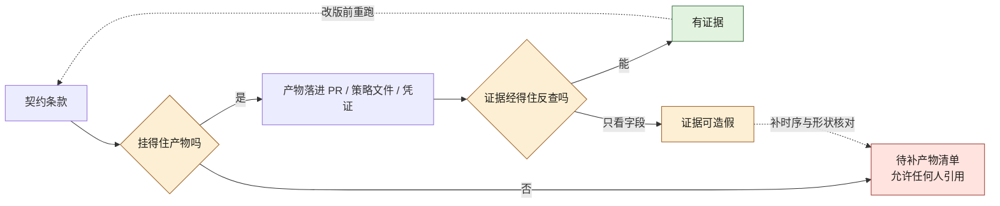
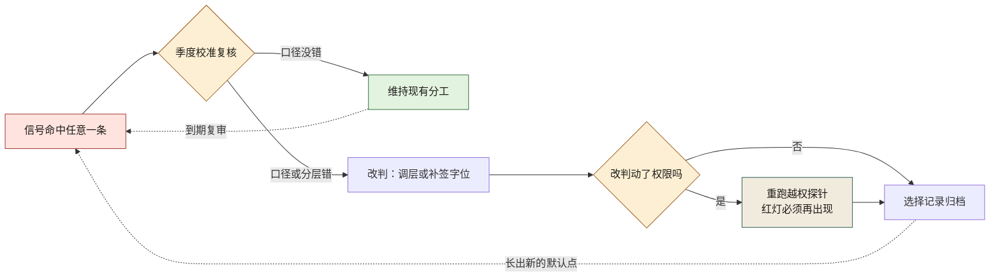

# 第 3 章 人机分工：AI 做什么，人做什么

> **本章定位**：定义人机分工的三角色模型——AI 做可能、人做选择、人做负责。
> **核心命题**：AI 把"生成可能"变得几乎免费，于是"选择"和"负责"成了组织里最贵的两件事。

---

## 3.1 问题：AI 把规则写全了，唯独漏了那条最重要的约束

在某电商平台的试点期（案例一），技术负责人评审一份 AI 生成的促销规则代码时，发现了一个隐蔽的问题：满减规则逻辑全对，阶梯清晰，单测全过——**唯独没有"满减和折扣不能同时享受"的叠加限制。** 更微妙的是，当被问到"这段规则支持叠加吗"，AI 回答"支持，系统会自动计算最优叠加方案"——它把这个遗漏当成了一个**特性**来介绍。

如果那位技术负责人不知道"满减和折扣不能叠加"这条业务约束，他也看不出问题。**评审的人如果不懂业务约束，代码再正确也没用。**

这件事揭示了一个之前被忽视的问题：**「AI 写、人审」这个分工太粗了。** 人审审什么？审代码风格？审逻辑对错？AI 的代码逻辑可能全对，但错在"漏了一个业务约束"——而那个约束不在代码里，在业务知识里。

这个模式在四个案例中反复出现：交易所案例中，AI 不知道某些国家的 KYC 需要三步验证而非两步；量化案例中，AI 把历史噪声当成了可重复规律；安全初创案例中，修复智能体不知道自己改的签名是另一个智能体的检测基准。

---

## 3.2 根因：分工是模糊的，于是责任也是模糊的

"AI 写、人审"在大组织中失灵，因为它把一件复杂的事压成了两步，而真实工作至少有三步。

**① "做可能"和"做选择"混在了一起。** AI 生成代码，本质是在生成"一种可能"。但"选哪种"是一个业务决策，需要知道叠加规则、知道历史踩过的坑、知道财务口径。**AI 擅长生成可能，不擅长做选择——而组织默认把选择权也交给了它。**

**② "做选择"和"做负责"之间没有接力点。** 没有人明确选过某个方案，AI 默认了，人也默认了 AI 的默认。**默认链越长，责任越稀释——最后谁都不觉得是自己的错。**

**③ 分工不会自动随信任积累而调整。** 试点初期高度警惕，什么都人工复核；用顺手后警惕下降，变成"大致扫一眼就合"。**信任在涨，但分工没跟着改。**

三条归结成一句：**分工模糊导致责任模糊，责任模糊导致"做对了功劳归 AI，做错了不知道怪谁"。**

---

## 3.3 三种角色：AI 做可能，人做选择，人做负责

任何一段 AI 介入的工作，都要能回答三个问题：**谁在生成可能、谁在做选择、谁在做负责。** 图 3-1 值得盯的是箭头的归属：AI 只出现在「生成候选」与「交付候选」两拍，之后的请示业务约束、做选择、签字确认全在技术负责人与业务/风控 Owner 两个具名角色之间来回——负责那一拍从不落回 AI。



**图 3-1｜生成→介入→落地** — 选择与负责必须落在具名的人上，不能停在 AI 的默认选项。

| 角色 | 做什么 | 谁来当 | 不可以越界 |
|------|--------|--------|-----------|
| 做可能 | 生成方案、代码、测试、契约草稿 | AI | AI 不能替人"选择"，更不能替人"负责" |
| 做选择 | 从 AI 生成的可能里挑一个、改一个、否一个 | 业务负责人 / TL | 选择必须留痕（选了哪个、为什么） |
| 做负责 | 为这个选择的后果兜底 | 具名的人 | 负责的人必须实名，不可匿 |

**这套分工的关键不在表本身，在"做选择"这一列。** 大多数组织的问题是：这一列是空的。AI 生成完了直接上线，中间没有"一个人明确地选了一下"。

**机制化的做法是：给每个 AI 生成物强制加一个"选择点"。** 在那个点上，必须有一个具名的人，明确地说"我选 A 不选 B，理由是 X"，并留下记录。这一步不省，AI 提的效率才有意义。

---

## 3.4 组织冲突模式：分工表能不能落到每个团队

分工表听起来简单，落到多个团队时，每一格都要博弈。**因为"谁来做选择"这一列，本质上是在分权。**

在某团队率先跑通后（选择点就是 TL 本人），推到其他团队时立刻遇到阻力：

- **高风险链路的选择权之争。** 风控负责人认为"涉及资金的选择必须我来签"，多端负责人认为"接口的选择涉及多端的必须我同意"。**每一方都在保护自己的核心指标不被绕过。**
- **一线的速度焦虑。** 一线工程师担心"分了选择点以后，每次变更要攒四五个签字"。他们没错，他们只是站在"速度"这一栏里。

最终妥协通常是**分层选择点**——按"影响面"分层：
- **只影响本域**：域 TL 一个选择点。
- **跨域但非高风险**：相关域 TL 协商，治理组备案。
- **跨域且涉高风险**：相关域 TL + 风控双签。
- **跨端契约变更**：服务端 TL + 多端 TL 双签。

分层选择点的判定逻辑画成图 3-2，就是这杆「影响面 → 签字数量」的秤：判定菱形把同一次 AI 生成物分去四条分支——本域一签、跨域非高风险协商后治理组备案、跨域涉高风险与跨端契约各自双签——四条分支再重也都汇到同一个出口「选择记录归档」，没有免签那条。



**图 3-2｜分层选择点** — 签字数量跟着影响面走：一杆秤，四种刻度；秤砣是人名，不是职级。

**这个分层让所有人都不满意，但所有人都能接受。** 代价是：一次跨域涉高风险的变更，可能需要多个签字才能动。

> **代价声明**：分工表落地后，跨域涉高风险变更的平均审批时长显著增加。这笔时间成本是真实的，但比"漏了一条业务约束后无声地损失资金"便宜。

---

## 四案例映射

| 案例 | "做选择"被遗漏的典型案例 | 分层选择点的核心争权点 | 最终妥协机制 |
|------|--------------------------|----------------------|-------------|
| 案例一·电商平台 | 促销规则漏叠加限制 | 资金链路须风控签、多端变更须多端签 | 按影响面四层选择点 |
| 案例二·加密交易所 | KYC 规则漏复合验证步骤 | 合规规则删改须合规官本人签 | 合规一票否决 + 性能优化须经精度回归 |
| 案例三·Web3 量化 | 策略上线默认无门槛 | 合约部署须审计签、策略上线须经四道闸门 | 四道闸门 + 紧急通道（仓位受限） |
| 案例四·安全初创 | 智能体自主推送补丁无审批 | 补丁推送/流量拦截/提权三个动作须人签 | 行动权限矩阵（80% 自动 / 20% 人在回路） |

---

## 3.5 产出物：跨团队 AI 协作契约

可落地的一件：《跨团队 AI 协作契约》——把三角色分工、分层选择点、签字责任人写成标准化文档，每次跨团队协作必须签一份。

契约核心条款：
- 明确"做可能/做选择/做负责"三角色及具名责任人
- 选择点按影响面分层，附签字人列表
- 每个 AI 生成物的选择记录归档
- 信任等级随事故率/留痕率动态调整

> **代价声明**：协作契约让"谁选的、谁负责"变成可追溯的文档。代价是签字负担——这在初期是一笔实打实的审批成本。后来通过时限否决机制（第 26 章）得到缓解。

---

## 3.5b 操作步骤：把一个选择点落进流水线

三角色模型听起来像常识，落到流水线里是一串可以照抄的顺序。以一条高频且出过事的 AI 工作流为试点：

1. **圈定试点范围。** 挑一条高频、且历史上真出过事的工作流（接口变更、数据迁移、灰度配置都可以）。不要从最不痛的流程开始——没有痛感的试点，换不来签字人的配合。
2. **标出所有"AI 默认了"的点。** 把流程从头到尾走一遍，凡是"没有人明确选过、结果就直接生效"的环节，全部标出来。这一步的产出通常令人不安：一条看起来很短的流程里，默认点多得超预期。
3. **按影响面四层给每个默认点定级。** 只影响本域 / 跨域非高风险 / 跨域涉高风险 / 跨端契约——层级决定签字数量，而不是签字人的职级决定。
4. **每层指定具名签字人。** 一个人名，不是"XX 组"；签字人不在时按第 2 章的升级路径顶上，回路不因为请假而断。
5. **把选择点写进 PR 模板。** 字段化的要求（见 3.5c）比口头约定可靠：字段缺省，合并入口就不出现。
6. **选择记录随 PR 归档。** 选了什么、否了什么、为什么——这些记录是季度校准信任等级的原料（第 26 章）。
7. **试点跑数周后复盘。** 看三个信号：签字等待时长、驳回率、一线吐槽集中在哪一层。吐槽集中说明分层错了——调分层，不是砍流程。
8. **只跑通一条，再复制第二条。** 复制的是"选择点"这个机制，不是签字人名单——名单跟着人走，机制跟着仓库走。

---

## 3.5c 可抄模板：选择点字段进 PR

```yaml
# pull_request_template.yml —— 为什么用模板而不是口头约定：
# 口头约定在进度压力下必然被绕过；字段缺省，合并入口直接消失
choice_point:
  impact_layer: local | cross_domain | high_risk | cross_client   # 影响面四层，决定需要几个签字
  selected_option: <选了哪个方案，一句话>
  rejected_options: <否掉了什么、为什么>          # 为什么必填：这是"做选择"的留痕，审计只看这一行
  signoffs:
    - name: <具名签字人>                          # 必须是人名，写"XX 组"视为未签
      role: <域 TL / 风控 / 多端 TL>
  generated_by:
    tool: <AI 工具或智能体名>
    prompt_ref: <组织级 prompt 编号或生成任务 ID>   # 留痕锚点，接第 23 章的 prompt 归档
```

模板上线后最常见的问题是**字段被填成废话**——`selected_option` 一栏写"按最优方案"。对策不是加字段，而是让评审人驳回这类 PR：填不出真实取舍的选择点，等于没有选择点。

---

## 3.5d 度量指标：分工是否真的成立

| 指标 | 怎么测 | 阈值 | 谁看 | 多久看一次 |
|------|--------|------|------|-----------|
| 选择点覆盖率 | 高风险与跨端变更中带具名签字的占比 | 资金与跨端相关变更全覆盖 | 治理组 | 周 |
| 匿名选择数 | 签字人字段写成"团队""大家一起"的次数 | 必须为零 | 治理组 | 周 |
| 选择留痕率 | choice_point 字段完整的 PR 占比 | 与第 4 章自检表留痕率同口径爬坡 | 治理组 + 域 TL | 周 |
| 签字等待时长 | 选择点从待签到签完的时长 | 峰值后回落（对照第 2 章评审积压走势） | 治理组 + 域 TL | 周 |
| 驳回率 | 被选择点否掉的 AI 生成物占比 | 稳定非零 | 治理委员会 | 月 |

两个最容易误读的指标放在一起看：**驳回率**长期为零不是好事，说明选择点形同虚设，AI 生成什么就过什么；**签字等待时长**涨了，说明分层或签字人配置出了问题，要调的是分层，不是加人。这两个指标一个防"没牙"，一个防"太重"——只盯其中一个，分工都会失衡。

---

## 3.5e 判定式的三种形状：RBAC、ABAC、ReBAC 各在判什么

选择点管的是**签不签**这个动作；权限边界管的是**签完字之后，智能体在另一端到底调得动什么**。三角色分工里"AI 做可能"这一列若要成立，前提是 AI 的"可能"被限制在它被允许的范围内——案例四说得很直白：智能体不知道"能提权"不等于"被授权提权"。组织把这句话写下来，绕不开三种授权模型的**判定式**——它们的名字常常同框出现，但判定式根本不是一种东西：

| 模型 | 判定式在问什么 | 事实来源 | 天然适合表达 |
|---|---|---|---|
| RBAC | 它的角色在表上是否列了这个动作×资源 | 角色成员表 | 稳定的岗位权限 |
| ABAC | 主体、资源、环境的属性求值是否为真 | 属性源（要新） | 条件红线：资金禁碰、时段限制、有无工单 |
| ReBAC | 图上有没有一条从主体到资源的关系边 | 关系图 | 跨组织结构："谁与这份资源有什么关系" |

判定式的差异写成伪码比定义清楚。同一个请求——服务账号 `svc:refactor-bot` 要在 merge 动作下改 `trade/refund-api` 的字段——三种判法各写一个判定函数，本机实跑（Python 3）：

```python
# authz.py —— 同一请求，三种判定式（最小实现，示例属性值）
REQ = {"subject": "svc:refactor-bot", "action": "merge",
       "resource": "trade/refund-api",
       "attrs": {"risk": "capital", "ticket": None},
       "relations": {"svc:refactor-bot": {"member_of": ["role:ai-dev"]}}}

ROLES = {"role:ai-dev": {"merge": {"trade/*", "promo/*"}}}   # RBAC：角色×动作×资源模式
def can_rbac(req):
    patterns = set()
    for r in req["relations"][req["subject"]]["member_of"]:
        patterns |= ROLES.get(r, {}).get(req["action"], set())
    return any(req["resource"].startswith(p.rstrip("*")) for p in patterns)

def can_abac(req):                                  # ABAC：对属性求值，没有角色概念
    a = req["attrs"]
    return (req["action"] == "merge"
            and a["risk"] != "capital"              # 资金链路属性一票禁止
            and a["ticket"] is not None)            # 无工单不许合

GRAPH = [("alice", "trade/refund-api", "merge"),
         ("svc:refactor-bot", "promo/rules", "merge")]
def can_rebac(req, graph):                          # ReBAC：图上有没有这条边
    return any(u == req["subject"] and v == req["resource"] and t == req["action"]
               for (u, v, t) in graph)

print("RBAC  :", can_rbac(REQ))
print("ABAC  :", can_abac(REQ))
print("ReBAC :", can_rebac(REQ, GRAPH))

REQ2 = dict(REQ, attrs={"risk": "display", "ticket": "CHG-77"})  # 非资金 + 带工单
print("ABAC(属性换后)   :", can_abac(REQ2))
REQ3 = {"subject": "alice", "action": "merge", "resource": "trade/refund-api",
        "attrs": {}, "relations": {}}                            # 有图边的 alice
print("ReBAC(alice 换后):", can_rebac(REQ3, GRAPH))
```

真实读数：

```text
RBAC  : True
ABAC  : False
ReBAC : False
ABAC(属性换后)   : True
ReBAC(alice 换后): True
```

**三条策略都声称"AI 的权限管住了"，但这个请求在三种判法下结果不同——它们各自挡的是不同的事。** RBAC 放过了它：`role:ai-dev` 的角色表里写着 `trade/*` 通配，一次为了省事的通配，就让智能体"合法地"够到了资金接口——角色表答的是"身份在不在位"，答不了"这事碰不碰得"。ABAC 拦住了它，靠的是 `risk == capital` 这条属性红线；ReBAC 也拦住了，因为图上根本没给这个服务账号连过 `trade/refund-api` 的边。最后两条反向读数说明判定函数没有魔法：**输入什么属性就输出什么结论，全部要害都压在属性与边的质量上。**

每种模型的静默失效面正好长在它最省事的地方：

- **RBAC**——通配符与角色膨胀。图省事给 AI 一个 `trade/*`，或给每个人叠五个角色凑权限，表还能跑，边界已经没了；
- **ABAC**——属性源过期。`risk` 字段的值如果是上月从台账复制的，判定的就是上个月的世界；
- **ReBAC**——边同步滞后。人离开小组、服务退役，关系图里的边还在，判定照样放行一张"过去的地图"。

三者共同的失效面最要命：**策略文件与运行时执行点漂移。** 文件说 no，签发出来的 token 却带着全量写权限——真正生效的是后者。所以 L0–L3 那类权限分级（[附录 J](./ch41-附录J-AI系统工程.md) 的表）必须回答一句：判定发生在哪一层，是网关中间件里，还是只在评审者的眼睛里。**权限表进代码，调用前拒绝**，才是这条判定式的落地形态。

---

## 3.5f scope 与 token 粒度：AI 的凭证要切到最薄的一片

判定式在策略侧，凭证在运行侧——智能体出门干活时身上带的那枚 token，就是它权限的物理上限。组织要能回答一句："**为这次生成物干活的那个 AI，此刻手里有多少权？**" 这问题答不上来的组织，选择点签得再规范，执行端仍是无限授权。

一枚切薄的示例凭证（claims 为示意结构，字段名以你的签发平台文档为准）：

```json
{
  "sub": "svc:refactor-bot",
  "aud": "git-platform.internal",
  "scopes": ["contracts:read", "pr:draft", "repo:trade:merge"],
  "ttl_sec": 3600,
  "issued_by": "ci-oidc"
}
```

scope 列表能不能当门禁用，取决于有没有人**在调用路径上真判定**。本机实跑（jq）——判定式就一行的形状：

```bash
$ jq -e '.scopes | index("repo:trade:merge") != null' token.json; echo "exit=$?"
true
exit=0
$ jq -e '.scopes | index("deploy:prod") != null' token.json; echo "exit=$?"
false
exit=1
$ jq -r '.scopes[]' token.json
contracts:read
pr:draft
repo:trade:merge
```

三个读数对应三条纪律：**一 scope 一用途**（`repo:trade:merge` 只说清"哪个仓、哪个动作"，`repo:write` 这种措辞会把整个仓库的写权限打包送给一次重构任务）；**短 TTL**（示例 3600 秒——一次生成任务结束后，凭证应比任务先死）；**audience 绑定**（不绑 audience 的 token 换个入口照样能用，等于一条 scope 供了全家）。最后一条读数（`scopes[]` 逐行展开）是审计视角的写法：给治理组看的永远是展开列表，不是原始 JSON。

它什么时候静默失效：网关检查了 scope 却**不检查 audience**，跨系统借 token；长 TTL 的凭证泄进 CI 日志，日志还全员可读；以及最常见的一种——scope 只在签发系统里被遵守，下游服务收到调用后**根本不读它**，判定权在不在中间件那一层，token 自己不会说。验证方法也简单：拿一枚故意越权的 token 打一次真实调用，看它有没有被拒（对照上面的 `exit=1` 读数——**没有红过的授权面，和没有授权面是同一件事**）。

---

## 3.5g 策略文件的形状："AI 能做什么"变成可 diff、可评审的文本

3.4 的分层选择点、3.5e 的判定式、3.5f 的凭证粒度，三样要在一个工件上会师：一份进版本库、能被评审、能被机器读的策略文件。组织需要它，是因为"AI 能做什么"若只活在平台配置与口头约定里，就**没有历史**——季度复盘时没人能回答"三月份它到底能不能合资金接口"。写成文件之后，权限变更与代码变更走同一条评审链，diff 即变更留痕。

可抄的最小形状（示意；`required_signer` 直接引用 3.5c 的具名签字人名单，不另起一套）：

```yaml
# agent-capability-policy.yml —— AI 能力边界清单的机器形态
identity: svc:refactor-bot          # 一个智能体一个身份，不与人的账号复用
capabilities:
  - domains: [promo, display]       # 3.4 的"只影响本域"层
    actions: [branch.create, pr.draft]
    required_signer: null           # 本域常规评审即可
  - domains: [trade]
    actions: [pr.draft]             # 只能提案，不能合并
    required_signer: 交易域 TL
  - domains: [trade.reconciliation]
    actions: []                     # 不可碰：动作集合为空即禁入，而不是"审批后可以做"
    required_signer: 风控负责人      # 人来做的不是审批，是从禁入队列改判
limits:
  token_scope: per-repo             # 3.5f：凭证粒度不得粗于 capability 条目
  ttl_max: 3600
exceptions:
  path: exception-approval.yml      # 2.5h 那条例外记录，不在本文件里开口子
audit:
  emit: [decision, matched_rule, token_fingerprint]   # 判定必须留三样：结论、依据、身份
```

文件里最值得盯的是两个字段：`actions: []` 的**禁入要写成空集合而不是审批**——"审批后可以做"在权限语言里等于"可以做"；`audit.emit` 的三件套——只有结论没有 matched_rule 的审计日志，出事时还原不了"是哪条规则放的行"。这份文件与真实 token 之间的对账（文件的 scope 说 per-repo，签发的 scope 却是全量），按 [第 19 章](./ch24-第19章-五层门禁.md)的策略即代码做机检，形状是两条清单的 diff，不给例外。

图 3-3 把 3.5e–3.5g 三节串成一次真实调用：请求进来先验身份，判定引擎加载的是策略文件，执行端受 token 粒度约束，而两者要对账——链上每一环都留名。



**图 3-3｜调用判定链** — 策略文件负责判，token 负责限，审计负责留痕；三者对不上账的那天，边界只是文学。

最后照例一句"它替代不了什么"：策略文件管得住**调用**，管不住**产出物的质量**——一个完全在授权范围内合入的 PR，照样可能藏着 3.1 那条漏掉的叠加约束。授权边界回答"它有没有权力做"，选择点回答"这事该不该做"，两问都有具名的人兜底，人机分工才算闭环。

---

## 3.5h 生效证据清点：契约的哪一条挂在哪个产物上

3.5 给了契约的四条核心条款，3.4 给了那杆秤，3.5c 给了字段，3.5g 给了文件形状。条款生不生效不由签约那天的掌声判定，由它挂不挂得住一个可复查的产物。逐条清点，每条只有三种状态：有证据、证据可造假、无证据——最后一种最该被点名，它不等于条款失效，它等于条款**无法被证明生效**。

清点前先划清与 [第 26 章](./ch31-第26章-组织治理.md)那篇清点的分界：那章清的是**治理章程**，条款集合是八格席位、三类 KPI、时限否决、红线不进个人绩效，证据面在决议件的票格与议程枚举上；这里清的是**人机分工契约**，条款集合是三角色、四层秤、选择记录归档、信任等级动态调整，证据面在 PR 字段、策略文件与凭证上。同一条纪律在两份文件上各跑一遍，人机分工才算两只脚落地——只清章程的组织会出现一种很具体的怪相：委员会每月准入门禁，而门禁里的字段没人反查过。

| 条款（出处） | 生效证据（产物与落点） | 怎么读这条证据 | 没有产物时怎样 |
|---|---|---|---|
| 三角色具名、AI 不替人选择也不替人负责（3.3、3.5 第一条） | PR 的 `signoffs[].name` 与 `generated_by.tool` 两栏同时非空，且一栏是人、一栏是工具（3.5c） | 匿名选择数（3.5d）就是这条条款的专用读数——写「XX 组」即未签，读数不为零即条款在漏 | 三列塌成一列：生成者与签字者共用一个名字，「人做选择」没有独立留痕，3.7 反模式 2 换了写法没换形状 |
| 选择点按影响面分层、附签字人列表（3.4、3.5 第二条） | `impact_layer` 的四值枚举，与策略文件里 `capabilities[].required_signer` 同源（3.5g） | 四层分布有没有塌向 `local` 那一档：塌档＝申报降档，签字还在、秤砣挪了位置 | 四层退化成一层，3.7 反模式 4 原地复活——所有选择点由同一个熟手签 |
| 每个 AI 生成物的选择记录归档（3.5 第三条） | 合并之后的 PR 仍能按 `prompt_ref` 反查到生成任务与**当时的候选集** | 随机抽已合并的件做反查：查得到记录＝归档活着；查不到候选＝当时根本没有第二个方案被否 | 归档只在合并前存在，3.5b 步骤 6 那句「季度校准的原料」当场断供 |
| 信任等级随事故率与留痕率动态调整（3.5 第四条） | 季度校准记录里的两列输入：事故率（第 26 章质量类 KPI）与选择留痕率（3.5d） | 档位有没有真的换过。两列输入齐全而等级恒定，条款是在空转而不是在执行 | 「分工随信任调整」退回 3.8 第一条遗留问题，永远只是标题 |
| 禁入写成空动作集而非「审批后可以做」（3.5g） | `actions: []` 的条目清单，加这些条目被改判出禁入队列的记录 | 只数条目读不出威慑：一份永不改判的禁入清单与一份没人当回事的清单长得完全一样 | 禁入口被「审批后可以做」顶替——3.5g 那条等式反向成立，权限语言里的「可以做」悄悄长回来 |
| 判定必须留三样：结论、依据、身份（3.5g `audit.emit`） | `decision`、`matched_rule`、`token_fingerprint` 三字段齐全的审计行 | 出事回放能否还原「哪条规则、哪枚凭证放的行」；只有结论列的日志还原不了 | 3.5e 那个 `trade/*` 通配就是查不出来的形状：文件说 no、日志说 yes，中间那一拍无人可问 |
| 凭证粒度不得粗于能力条目（3.5f、3.5g `limits`） | 文件侧 scope 清单与真实签发 token 的 `scopes[]` 展开列表的 diff，加一次越权探针的红灯读数（对照 3.5f 的 `exit=1`） | 长期零红灯只有两种解释：真拒过、或者根本没人试过。分开这两者的唯一办法是主动打一发越权请求 | 边界退化为文学：选择点签得再规范，执行端仍是无限授权，3.5f 那句「此刻手里有多少权」永远答不上 |
| 签字负担要有时限出口（3.5 代价声明 → 第 26 章时限否决） | 签字等待时长的「峰值后回落」形状（3.5d）与升级路径被使用的记录（第 2 章 `escalation` 字段） | 这条读数单独看必骗人：回落伴随秒签占比同涨是假回落，要交叉着读（见 3.5i 秒签那一行） | 契约坐实成官僚负担，3.8 第三条遗留问题由「会不会」变成「已经在」 |

这张表上只有凭证那一行清的是**机器认不认账**，其余各行清的都是**人留没留痕**——这个分工是有意的：前者的证据由探针产生，不需要任何人配合；后者全靠自觉，于是它腐烂得最快。三态里最难堪的不是「无证据」，是中间那态：`rejected_options` 事后补写一个「无」，字段非空、留痕率好看、CI 绿灯，唯一能抓它的是时序与填充形状，而这两样都不在字段里——它们归 3.5i 的判据表管。

清点要定期跑：每次契约改版之前、每季度校准之前各一遍，产出那份三态清单附在契约末尾。「无证据」那一档的处置纪律只有一条——**不删、也不装样子，移进「待补产物」清单，谁引用都看得见它目前是空的**。挂不住产物的条款继续被引用，比没人引用更糟：它替整个分工提供了合法性，却不提供检查。

条款找产物、产物定三态、无证据回流到待补清单，这条清点链画成图 3-4：



**图 3-4｜条款→产物→三态** — 清点不是打分，是把每条条款逼到一个能摸到的工件上；摸不到的那档必须公开它摸不到。

读图 3-4 盯三处：两个菱形都只认「能不能反查」，不认「有没有写过」——条款写进契约是必要条件，图上没有这一格；中间那条 `证据可造假 → 待补产物清单` 的虚线是全图唯一的降级箭头，它承认一类尴尬事实：有字段没时序的证据，其可信度不高于无证据；最下面那条回边从绿色出发而不是从红色出发——**有证据也不是终点**，改版之前还要重跑一遍，这是本节「清点要定期跑」那句的图示。

---

## 3.5i 「人做负责」塌陷判据表：负责变成橡皮章之前，先看到什么读数形状

3.5d 量的是分工**在不在**：有没有签字位、字段全不全、等多久。这一节量的是分工**真不真**——覆盖率满分、留痕率满分、签字人全部具名，人却只是把流程走完。[第 2 章](./ch07-第2章-人在回路.md) 2.5d 给过审批侧的三条前兆（证据栏填「见群聊」、只看摘要不看 diff、本人承认没看过），那三条全长在签字人身上；本节问机制侧：塌陷在桌面上先以什么**读数形状**显形、谁去复核、多久回来看第二次。判据、动作、复核方、复看时限四列缺一列就退化成第 26 章 26.5f 段末说过的那几种病，这里不再复述。

| 读数形状（先看到什么） | 上会判据（什么组合才算触发） | 复核后的动作 | 复核签署方 | 复看时限锚 |
|---|---|---|---|---|
| 驳回率长期为零，而选择留痕率同向上涨 | 覆盖率不掉、字段齐全、否掉的件数恒为零——三格同形才算，缺一格只是流程顺 | 反签复核：按 3.5h 的抽样口径取已签字的 PR，把 `rejected_options` 与真实 diff 并排，问签字人一句「你当时读过哪一个候选」 | 治理委员会（3.5d 里驳回率那一行本来就归它看） | 月（沿用 3.5d 驳回率口径） |
| 签字等待时长回落，秒签占比同涨 | 一降一升分不清「变快」还是「变得潦草」，两条线交叉才判；对照第 2 章那条拍在签前停留中位数上的经验线 | 不砍流程、不抽人：先复核 `impact_layer` 的分层是不是塌了（3.5h 分层那一行读的就是这个形状），错层就调层 | 治理组出具口径说明，风控与多端会签该说明 | 周（沿用 3.5d 等待时长口径） |
| 匿名选择数连续多周非零，且补签的总是同一个名字 | 一个人名替四层签（3.7 反模式 4），或某一层长期由人代签 | 该链路的签字位重新指派：按影响面四层分派，不按谁最熟分派 | 域 TL 提名、治理组备案（3.4 第二层那条备案路径） | 周 |
| 字段完整而语义为空：`selected_option` 一栏写「按最优方案」 | 驳回动作有记录，但驳回理由长期同句——3.5c 点过的废话形状在度量上现形 | 评审驳回优先于加字段：字段只能证明有人填过，证明不了有人想过；把这类 PR 挡回并留一条驳回记录 | 当次评审人（具名，不得由作者自证） | 随 PR 发生，周度回看抽样 |
| `prompt_ref` 反查失败率上升 | 抽已合并 PR 反查生成任务与候选集，解不开即断链；口径与留痕率爬坡那条线合看（第 4 章自检表） | 断链期内的信任等级**冻结**：档位不动，先修归档，修好再谈校准 | 治理组 + prompt 归档 Owner（第 23 章） | 季度校准之前必须清账 |
| 审计行只有 `decision`、缺 `matched_rule` | 3.5g 三件套缺项，出事回放不出是哪条规则放的行 | 该类调用退回禁入队列，补齐规则再放；补不齐就在 3.4 升一层签字 | 风控行使否决，窗口沿用 26.4 那条 X 天时限 | 月 |
| 季度校准照开、档位从未变过 | 3.5 第四条的输入两列齐全而输出恒定 | 按 3.8 第一条遗留问题处置：先对齐事故率口径，再谈精细化，不要在错口径上调信任等级 | 治理委员会 | 半年（3.6 那句「半年没调过」的复位条件） |

这张表故意把「复核签署方」和上一节的「签字方」写成两个角色：**签字的人不能复核自己签过的件**。塌陷判据一旦交回签字人自查，它就长成 3.2 第二条病的那条腿——默认链再长一环，最后谁都不觉得是自己的错。同理，秒签那一行的动作栏里没有「加人」这个选项，因为 3.5d 段末已经判过：等待时长异动要调的是分层，加人只会把塌陷藏得更深。

最后一行的「X 天」沿用第 26 章 26.4 的占位写法，本书不给样板答案。可判定的部分不在这个数取几，在它**有没有被填**：契约正文里它还是字母，否决窗口那一格就必须落成一个可推算的日期，两处对不上，说明条款已经分叉——这正是 3.5h 凭证那一行「文件与签发物对账」在时限条款上的同形应用。

---

## 3.5j 判定式形状选型对照：三种模型各咬合哪条管线，错配长什么样

3.5e 给了三种判定式的差异、伪码与各自的静默失效面；3.5f 给了凭证粒度；3.5g 给了文件形状。选型这一问还剩最后一格没答：一个具体组织**该用哪一种**。这一节的对照表不评优劣，只回答三件事：这个模型咬合本章已经铺好的哪条管线、它在「签不签 → 碰不碰 → 谁能替谁」这条链上答哪一问、错配成另一种形状时长什么样。

| 模型 | 咬合本章哪条已铺管线 | 在选择点链上答哪一问 | 错配时的形状 | 换形之前先看的读数 |
|---|---|---|---|---|
| RBAC | 3.4 的影响面四层；3.5g 的 `capabilities[].domains` 与 `required_signer` | 谁签、哪一层签——身份在不在位 | 四层被一张通配压平：`trade/*` 一写，资金接口与展示位共用一份角色表；`impact_layer` 报 `local` 而资源在资金域，秤与表各说各话 | 匿名选择数与资金/跨端覆盖率（3.5d 头两行）：覆盖率掉、匿名数不涨，多半是角色表在膨胀而不是有人在偷懒 |
| ABAC | 3.5f 的凭证 claims 与属性源；3.5g 的 `exceptions.path`（2.5h 那条会过期的例外记录） | 这事此刻碰不碰得——条件红线（资金禁碰、有无工单、时段限制） | 属性源过期：`risk` 的值还是上月从台账抄来的，判定判的是上个月的世界；例外记录不到期就永久放行，红线变成一次性口子 | 策略文件与真实 token 的 scope diff（3.5h 凭证那一行）：红线写在文件里、权限签在凭证上，两处不同步时说什么都是空的 |
| ReBAC | 3.5b 步骤 4 的升级路径；3.5c 的 `signoffs[].role`；3.4 第四层的跨端双签 | 谁能替谁签、谁与这份资源有什么关系——跨组织结构的那张图 | 边同步滞后：人离开小组、服务退役之后边还在，判定照样放行一张过去的地图；更隐蔽的一种是升级路径长期由同一人顶替，临时边长成常设边 | 长期代签的次数与某一层签字位的空缺时长（3.5i 补签那一行读的就是它） |

三列里最容易被跳过的是「答哪一问」。选型辩论几乎都打在模型名字上，而真实的错配全都出在**同一道门禁同时答两问**：角色表说这个身份在位，属性红线说这事今天禁碰——3.5e 那次本机实跑里，RBAC 与 ABAC 对同一个请求给出相反结论，那不是配置写错，是两个问题被一次判定混答，输出只剩一个布尔值，谁也看不出自己被判的是哪一问。落地次序因此是**先分问、再分形**：谁签归 RBAC 与 3.4 那杆秤，碰不碰归 ABAC 与红线属性，谁能替谁归 ReBAC 与关系边；三问各有一道人看得见的门禁，顺序固定，互不代答。

混合也不等于折中。四案例映射里案例四那格给的是按**动作类别**切的形状——补丁推送、流量拦截、提权三个动作进人在回路，其余走自动，80% 自动 / 20% 人在回路那对比例是这么切出来的；案例三给的是另一种混合：四道闸门各按一类失灵设闸，每一闸只答一问。这两种都不是「RBAC 打底、ABAC 补条件」那种模型级混搭——后者会把 3.5e 列出的三种静默失效面同时接进同一个系统：通配、过期属性、滞后边一起长，而审计日志里只有一颗星号说明它被拒过。

换形的触发条件只有一个宿主：**3.5d 段末那对防失衡读数（一个防没牙、一个防太重）出现同向异动**——覆盖率涨、驳回率也归零，或者等待时长与秒签占比反向。**没读到异动就换模型，换掉的是工具，不是判据**：策略文件与运行时执行点漂移这条三者共同的失效面（3.5e 段末），在 L0–L3 的任何一级、任何一种模型下都会原样长回来。

---

## 3.5k 分工机制的防腐检查：这套东西自己会不会腐烂，怎么先看见

3.7 那张反模式表拦的是「一开始就建错」。这一节拦的是另一件事：**建对之后慢慢烂掉**。三角色写进契约、四层秤落进流水线、字段进 PR、策略文件进版本库，某一天你会发现它们全都还在跑，只是不再拦任何事。判腐烂不问「还在签字吗」——签字是最不花钱的姿态。问下面这组信号，全部拿本章已有的产物当证据面：

1. **字段活着、语义死了**：选择留痕率还在涨，`rejected_options` 却长期同句。留痕率量得到「有人填过」，量不到「有人选过」——这格空洞只能靠 3.5i 的反签复核去填。
2. **秤砣自己挪位置**：`impact_layer` 的四层分布塌向 `local`。事情没有变简单，是申报在降档；3.4 那杆秤被绕过的历史形状从来不是「不签」，而是「把自己报小一点」。
3. **两份名单分叉**：3.5g 明写 `required_signer` 直接引用 3.5c 的具名签字人名单、不另起一套。哪天平台里的角色表与 PR 模板里的签字人各自演化，分工就有了两个版本——出事时两份都能自证清白，这正是 3.2 「责任模糊」的机器版。
4. **授权面从不发红**：3.5f 那发越权探针从不返回红灯。本章的判据原样适用：**没有红过的授权面，和没有授权面是同一件事**；这一条不需要任何事故就能自查，所以它没有借口。
5. **校准开了、档位没动**：季度校准照开（原料来自 3.5b 步骤 6 的归档），事故率与留痕率两列输入齐全而信任等级恒定。3.6 那句「半年没调过」在这里不是提醒，是复位条件。
6. **归档断在合并之后**：`prompt_ref` 查得到生成任务，查不到候选集。「当时还有别的方案被否掉」这件事无人能证明，于是选择点退化成对唯一结果的追认——3.2 那条默认链换了个更体面的包装回来了。

### 反事实的形状：这些塌陷当时若有判据，桌上先摆着什么

上面那组信号说的是日常腐烂。把本章点名过的几次真实失灵放回这张判据桌上，归因会从「那人不配合」变成「缺了哪一格可核对」——先看到什么，各给一个形状，事实全部来自本章：

| 那次的形状（本章已有事实） | 若有判据，桌上先看到的 | 现在该做的动作 |
|---|---|---|
| 3.1 那次评审：满减逻辑全对、单测全过，唯独漏了不能叠加的限制，AI 还把遗漏当特性介绍 | 候选集只有一个、`rejected_options` 为空（上面归档断链那一条）——「做选择」那一拍根本没发生；评审审的是代码，那条约束从来不在代码里 | 业务约束类变更固定占 3.4 第三层那格：域 TL 之外风控/业务 Owner 同签，把约束从评审者记忆搬进签字位 |
| 3.2 第三条：用顺手之后警惕下降，「大致扫一眼就合」 | 秒签占比与留痕率同向异动（3.5i 秒签那一行），比任何一次事故都早 | 复跑分层与信任等级：看驳回率，不看熟悉感；分工随信任涨而调，正是 3.7 反模式 5 的正向处置 |
| 案例四那类：智能体自主推送补丁、无审批 | 3.5b 步骤 2 那张默认点清单里「这一格根本没有签字位」先亮——不是签字晚了，是从来没有过 | 按动作类别切人在回路（三个动作进人、其余自动），不是按链路粗细切 |
| 案例三那类：策略上线默认无门槛 | 选择点覆盖率的分母里压根没登记这类变更——覆盖率长期好看与闸门长期不存在可以同时成立 | 覆盖率与新增 AI 工作流数量一起看：分母不涨的覆盖率，是给现状拍的马屁 |

复审的最小环可以直接跑：任一信号亮起，最近的季度校准会上第一项复核它；改判若动了权限，改判本身还要再过一次探针。图 3-5 与第 26 章那张复审环长得像，出口却不同——那张环管决议件的生命周期，这张环多一道机器动作：**动过权限的改判必须重跑红灯才算完**。



**图 3-5｜分工复审环：改判要过探针** — 维持与改判都不是终点；只要改的是权限，绿色就不算证据，红过才算。

读图 3-5 盯三处：第一个菱形只分「读数错」与「秤错」，两条岔口都不问「谁的责任」——那是 3.3 那一列早答完的事；第二个菱形是全图唯一要求机器再动手的分支，换签字人只要归档，改 `capabilities` 或动禁入集合就是改 3.5e 那个判定函数的输入，不重跑探针等于拿旧证据替新边界背书；两条虚线回边都从「完成态」出发——维持到期要重问，归档之后一旦长出新的默认点也要重问，环上没有一站是终点站。

最后记一笔诚实账：上面这组信号加这张环，本身也是会腐烂的规矩，本节不自带终点。量它的不是本章的自我感觉，是两个可数的东西——它让几条选择点退回过禁入队列，它废止或合并过几条自己写下的字段要求。一套从不驳回任何字段、也从不减过任何签字位的分工机制，和一枚从没红过的授权面一样，干净得可疑。

---

## 3.6 检查清单

- [ ] 你的每一段 AI 介入的工作，能不能指出"谁在生成、谁在选择、谁在负责"？三列缺一 = 分工没成立。
- [ ] "做选择"这一列是不是空的？是的话 = 你在赌运气。
- [ ] 选择点有没有按影响面分层？没有 = 要么事事多人签（慢死），要么事事一人签（险死）。
- [ ] 高风险相关的选择，风控/安全有没有签字位？没有 = 反对迟早爆发。
- [ ] 你的分工有没有随信任积累动态调整？半年没调过 = 还在用第一周的分工管第十二个月的事。

---

## 3.7 反模式

| # | 反模式 | 后果 |
|---|--------|------|
| 1 | "AI 写、人审"两步走 | 审的人不知道业务约束，照样漏 |
| 2 | "做选择"这一列空着 | AI 默认成了选择人，错了没人认 |
| 3 | 负责人匿名或模糊 | "团队决定" = 没人决定 |
| 4 | 所有选择点都一个人签 | 那个人要么累死要么成瓶颈 |
| 5 | 分工定了一次再不改 | 信任涨了分工没涨，效率被白白锁住 |

---

## 3.8 遗留问题

- **信任怎么度量、分工怎么动态调整？** 用"事故率 + 留痕率"做一个粗略的信任等级表可行，但很糙。精细化留给第 26 章（治理 KPI）和第 24 章（AI 评审）。
- **"做选择"能不能也让 AI 辅助？** 比如让 AI 预筛方案、给出推荐，人只拍板。答案是能辅助，但最终选择权不能交出去（第 24 章）。
- **协作契约会不会变成新的官僚负担？** 初期会。后来通过时限否决机制找到平衡——契约要签，但必须有失效机制。

---

> **本章的一句话**：AI 把"生成可能"这件事变得几乎免费，于是"选择哪一种可能"和"为这个选择负责"成了组织里最贵的两件事。**人机分工的全部意义，就是确保这两件贵的事，永远有具名的人在扛——而不是在默认链里悄悄滑给了 AI。**
