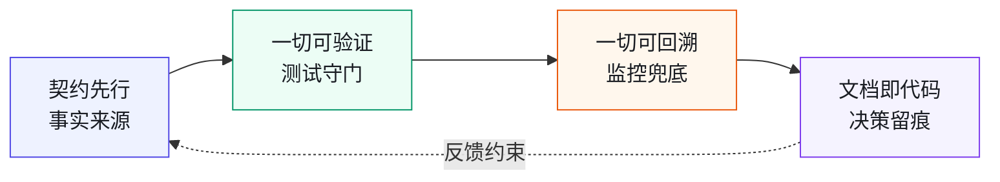
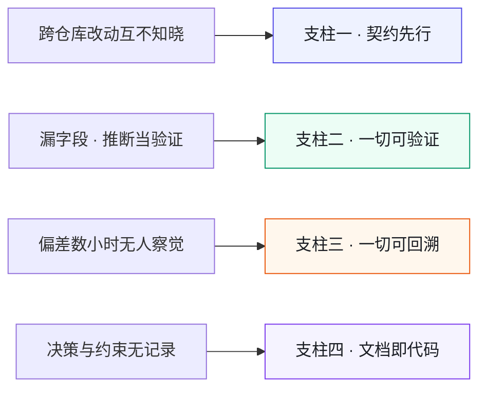
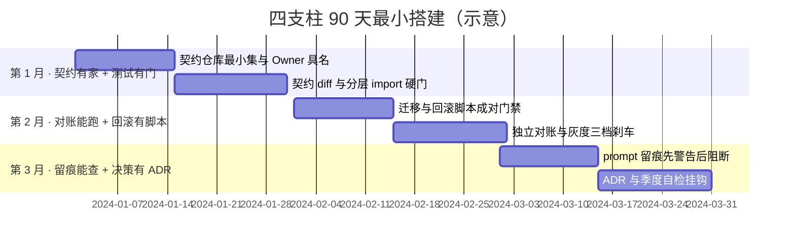

# 第 4 章 AI 原生工程栈：契约、测试、可观测、文档即代码

> **本章定位**：把治理三原则落地为四个互相咬合的基础设施支柱。
> **核心命题**：原则是方向，基础设施是脚下的路——少一个支柱，AI 失灵时就少一道兜底。

---

## 4.1 问题：治理原则挂在墙上，落地却无处下手

许多组织经历了相似的过程：治理团队定下了几条原则（契约先行、人在回路、留缝留痕），贴在会议室墙上，所有人点头。然后散会，回去该干嘛干嘛。

两周后抽查，没有一个团队动过。一线的反馈最直接：**"你说的契约先行，我具体要做什么？我现在的代码里没有契约仓库，你让我先去建一个？建了我也不知道往里放什么。"**

这说明一件事：**原则是空的，它必须落到一套可见、可做、可检查的基础设施上，才会变成行动。** 一个一线工程师看到"契约先行"四个字，他需要知道——契约放哪、怎么写、谁审、改了之后代码怎么跟着改。如果这些都没有，原则就只是墙上的一张纸。

四个案例中，基础设施缺失的表现各异：电商平台缺的是跨模块契约测试和可观测告警；交易所缺的是精度回归测试和降级通道；量化基金缺的是样本外验证闸门和合约审计流程；安全初创缺的是 Agent 间契约和行动权限矩阵。**形态不同，本质相同——没有基础设施，原则就是空中楼阁。**

---

## 4.2 根因：组织缺的不是原则，是基础设施

为什么原则挂墙上没人动？因为在任何一个有一定规模的组织里，**个人的力量撑不起一个跨团队的原则。**

**① 契约没有家。** 没有一个中心化的契约定义和存储机制，每个团队的接口文档散在自己仓库里。一个人想做"契约先行"，他先得说服全组织跟他一起建——这件事他做不了，只有治理团队能做。

**② 测试只到单元层。** 有单测，但没有跨模块的契约测试、没有架构不变量测试。AI 改了接口，没有一道测试能在合并前告诉它"你破坏了某个契约"。**测试的覆盖范围，决定了 AI 能在多大范围里"安全地犯错"。**

**③ 可观测是黑盒。** AI 生成的代码进了线上，它的影响"可不可见"完全靠运气。如果核心指标没有分钟级告警，AI 造成的偏差可能在数小时甚至数天后才被发现——电商平台案例中对账差额积累数十分钟才告警、交易所案例中精度漂移持续累积，都是可观测缺失的典型。

**④ 文档不在代码里。** 决策散在会议纪要、聊天群、各人的脑子里。一个新人想知道"为什么这段代码是这样的"，找不到任何记录。AI 来了之后更严重——它生成的代码背后没有决策记录，出了事无从追溯。

四条归结成一句：**组织没有一个让"AI 原生"得以发生的地基。**

---

## 4.3 四个支柱，缺一不可

四个支柱是一套互相咬合的基础设施。它们的顺序不是随意的——**后一个依赖前一个**。

**图 4-1｜四支柱** — 少一个支柱，AI 失灵时就少一道兜底；四者必须一起搭。

**支柱一 · 契约先行。** 契约先于实现存在，代码与契约互为事实来源。详细在第 9 章、第 27 章。没有它，AI 改代码就没有"对不对"的标准。

**支柱二 · 一切可验证。** 任何一段代码、任何一次变更，都能被自动化测试验证——包括契约测试、架构不变量测试、门禁检查。详细在第 10 章、第 19 章。没有它，AI 的错误只能靠人眼拦。

**支柱三 · 一切可回溯。** 线上发生的任何异常，都能在分钟级被发现、定位、回滚。详细在第 21 章、第 28 章。没有它，AI 造成的损失会随时间无声放大。

**支柱四 · 文档即代码。** 每一个技术决策都有 ADR，每一次大改动都有 RFC，提示词归档进仓库。详细在第 25 章、第 23 章。没有它，组织知识随人员流动而流失，AI 来了之后流失更快。

**四个支柱不是四个选项，是一个最小完整集。** 少任何一个，AI 原生就塌一角。支柱要一起搭，不能挑着搭。

把四支柱与第 2 章的失灵模式对上，"缺一角塌什么"就具体了——每根支柱接住的是一类确定的失灵：

**图 4-2｜四支柱纵深：每根支柱接住哪类失灵** — 失灵模式不会消失，只能被支柱接住；缺一根，对应那类失灵直通生产。

---

## 4.4 组织冲突模式：四个支柱，谁先建，谁出人

四个支柱都重要，但治理团队人手有限，不可能同时铺开。**先建哪个，本身就是一场 KPI 博弈。**

- **多端/产品团队最想要契约先行。** 他们被接口变更坑过，知道契约能救多端。
- **SRE/运维最想要可观测。** 他们被延迟告警坑过，知道早发现一分钟少损失一大笔。
- **合规/安全最想要文档即代码。** 审计追溯离不开留痕，他们的直觉告诉他们"迟早要出事"。他们出不了人，但能出"合规压力"。
- **一线工程师什么都不想要。** 每多一个支柱就多一道卡他的关。

最终的排序通常是：**契约先行先建（它是一切的基础），然后测试，可观测和文档并行。** 这个排序让多端和运维先拿到他们最需要的东西，合规的诉求被排到后面——这有时会埋下隐患（电商平台案例中，文档/留痕缺失后来引发了合规事故）。

**用排序的优先级，换取关键团队的支持。代价是后延的诉求可能变成定时炸弹。**

---

## 四案例映射

| 案例 | 四支柱中最早崩塌的那个 | 最优先补建的支柱 | 支柱建设的顺序教训 |
|------|---------------------|----------------|-------------------|
| 案例一·电商平台 | 可观测（对账延迟发现）+ 文档（无决策记录） | 契约先行 → 测试 → 可观测 + 文档 | 文档延后建→合规事故 |
| 案例二·加密交易所 | 可验证（无精度回归测试） | 契约先行 + 精度回归测试同步建 | 24/7 场景下可回溯须提前 |
| 案例三·Web3 量化 | 可验证（无样本外测试闸门） | 可验证（四道闸门）+ 文档（审计留痕） | 合约不可逆要求验证先行 |
| 案例四·安全初创 | 契约先行（Agent 间无契约） | 契约先行（Agent 间契约）+ 可验证 | 小团队四支柱须同时最小化搭建 |

---

## 4.5 产出物：工程栈自检表

可落地的一张表，每个团队每季度自检一次：

| 支柱 | 检查项 | 通过标准 | 责任人 |
|------|--------|---------|--------|
| 契约先行 | 接口是否在中心契约仓库有对应契约 | 一致率 ≥ 95% | 契约 Owner |
| 一切可验证 | 跨模块契约测试是否接入 CI | PR 不过测试不可合并 | 域 TL |
| 一切可回溯 | 核心指标是否有分钟级告警 + 回滚预案 | 告警延迟 < 5 分钟 | SRE |
| 文档即代码 | 每个 PR 是否附 ADR/prompt 记录 | 留痕率 ≥ 90% | 治理组 |

> **代价声明**：自检表上线第一轮，通常只有少数团队能四项全过。工程栈不是"发布就完成"——它是一个需要逐季补齐的长期工程。

---

## 4.5b 最小可用工程栈（90 天起步）

很多团队问：四个支柱听起来正确，但我们只有两周带宽，从哪下手？

**第一个 30 天：契约有家 + 测试有门。**

1. 建一个中心契约仓库（OpenAPI / Protobuf 均可），只收录「资金、跨端、对外」三类接口——不要全量。
2. 每个入选接口指定具名 Owner（一个人名，不是「XX 组」）。
3. CI 挂两条硬规则：实现与契约 diff 不一致 → 拒绝合并；架构分层 import 违规 → 拒绝合并。

**第二个 30 天：对账能跑 + 回滚有脚本。**

1. 资金链路变更必须成对生成迁移与回滚脚本，缺一不让上。
2. 上线前跑独立对账任务（哪怕只是 T-1 差额阈值告警）。
3. 灰度比例写死三档（1% / 10% / 50%），每档对应自动刹车指标。

**第三个 30 天：留痕能查 + 决策有 ADR。**

1. AI 辅助 PR 附 prompt 版本号或生成任务 ID，缺则 CI 警告（先警告后阻断）。
2. 重大技术决策（尤其是「故意跳过某门禁」）必须开 ADR，写清谁签字、为何可跳。
3. 自检表进季度评审，结果与治理资源投入挂钩。

**90 天验收一句话**：随便挑一笔上周上线的资金相关变更，能在 10 分钟内回答——契约在哪、谁签的、对账结果、回滚命令是什么。答不出，工程栈还没搭起来。

三个 30 天的节奏画成甘特，里程碑状态一目了然（日期为示意，与总路线图同口径）：

**图 4-3｜90 天最小工程栈** — 90 天搭的不是完整四支柱，是「资金相关变更可追溯、可回滚、可对账」的最小闭环。

---

## 4.6 检查清单

- [ ] 你有没有一个全组织唯一的契约定义中心？没有 = 支柱一没建。
- [ ] 你的测试里，有没有跨模块的契约测试和架构不变量测试？没有 = 支柱二只搭了一半。
- [ ] 你的核心指标，能不能在 5 分钟内告警并触发回滚评估？不能 = 偏差会无声放大。
- [ ] 你的每个技术决策，有没有对应的 ADR 可查？没有 = 支柱四缺失。
- [ ] 四个支柱你是全搭了，还是只挑了容易的搭？只挑了容易的 = 地基是斜的。

---

## 4.7 反模式

| # | 反模式 | 后果 |
|---|--------|------|
| 1 | 原则挂墙上，不落基础设施 | 两周后没人动 |
| 2 | 四个支柱挑着搭 | 缺角的地基，关键时刻塌 |
| 3 | 自检表变成填表游戏 | 为了过而过，不反映真实状态 |
| 4 | 契约建了但测试不验 | 契约和代码各自漂移 |
| 5 | 文档写成 Word 存网盘 | 不随代码版本化 = 不是"即代码" |

---

## 4.8 公开参照（可核实）

[DORA 2025](https://dora.dev/research/2025/dora-report/) 的结论可以给四支柱「定性」：若底层系统（契约、测试、可观测、文档）是弱的，AI 会把弱放大；若是强的，AI 才可能把强放大。

[GitHub × Accenture（2024-05-13）](https://github.blog/news-insights/research/research-quantifying-github-copilots-impact-in-the-enterprise-with-accenture/) 给出的是一组「工程栈承压能力」的公开参照系：在他们的企业 RCT 中，人均 PR、合并率、成功构建可以同步上升——这通常发生在**评审与 CI 本身已足够严**的组织里，而不是「只有补全没有门禁」的组织里。

---

## 4.9 遗留问题

- **四个支柱分别怎么搭？** 契约先行→第 9、27 章；可验证→第 10、19 章；可回溯→第 21、28 章；文档即代码→第 23、25 章。
- **支柱之间的顺序能不能换？** 经验是：契约必须最先，因为它是其他三个的事实来源。但如果组织有特殊痛点（比如先被可观测缺失坑过），可以先搭可观测——前提是接受契约缺失会反噬。
- **自检表会不会沦为形式？** 会，如果没有人用结果来做资源分配。把自检结果和治理资源投入挂钩，可以让自检有牙齿（第 26 章）。
- **AI 系统本身的 eval、上下文包、权限、成本怎么算？** 四支柱是组织地基；系统工程最小面见 [附录 J](./ch41-附录J-AI系统工程.md)。

---

> **本章的一句话**：原则是方向，基础设施是脚下的路。**AI 原生工程不是一句口号，而是四个必须一起搭好的支柱——少一个，AI 失灵的时候你就少一道兜底。** 组织最该投入的，不是更多的 AI 工具，而是让这些工具能安全运行的工程栈。
