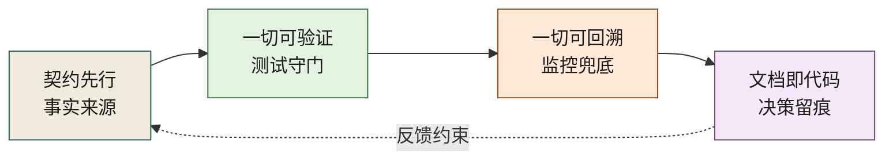
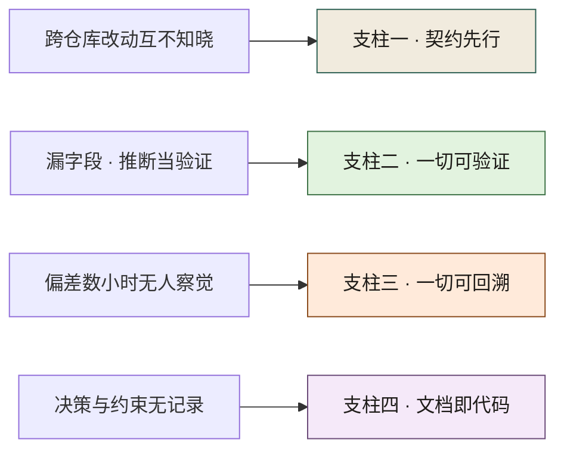
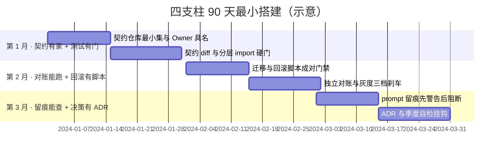
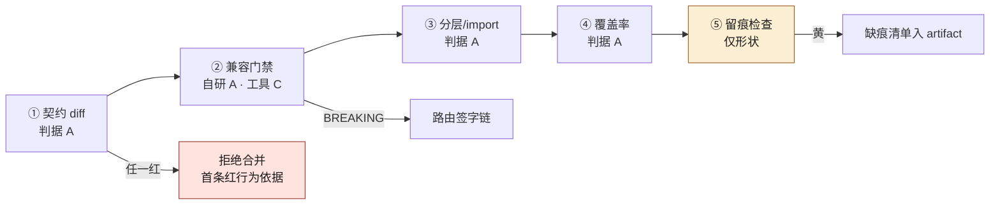

# 第 4 章 AI 原生工程栈：契约、测试、可观测、文档即代码

> **本章定位**：把治理三原则落地为四个互相咬合的基础设施支柱。
> **核心命题**：原则是方向，基础设施是脚下的路——少一个支柱，AI 失灵时就少一道兜底。

---

## 4.1 问题：治理原则挂在墙上，落地却无处下手

许多组织经历了相似的过程：治理团队定下了几条原则（契约先行、人在回路、留缝留痕），贴在会议室墙上，所有人点头。然后散会，回去该干嘛干嘛。

两周后抽查，没有一个团队动过。一线的反馈最直接："**你说的契约先行，我具体要做什么？我现在的代码里没有契约仓库，你让我先去建一个？建了我也不知道往里放什么。**"

这说明一件事：**原则是空的，它必须落到一套可见、可做、可检查的基础设施上，才会变成行动。** 一个一线工程师看到"契约先行"四个字，他需要知道——契约放哪、怎么写、谁审、改了之后代码怎么跟着改。如果这些都没有，原则就只是墙上的一张纸。

四个案例中，基础设施缺失的表现各异：电商平台缺的是跨模块契约测试和可观测告警；交易所缺的是精度回归测试和降级通道；量化基金缺的是样本外验证闸门和合约审计流程；安全初创缺的是 Agent 间契约和行动权限矩阵。**形态不同，本质相同——没有基础设施，原则就是空中楼阁。**

---

## 4.2 根因：组织缺的不是原则，是基础设施

为什么原则挂墙上没人动？因为在任何一个有一定规模的组织里，**个人的力量撑不起一个跨团队的原则。**

**① 契约没有家。** 没有一个中心化的契约定义和存储机制，每个团队的接口文档散在自己仓库里。一个人想做"契约先行"，他先得说服全组织跟他一起建——这件事他做不了，只有治理团队能做。

**② 测试只到单元层。** 有单测，但没有跨模块的契约测试、没有架构不变量测试。AI 改了接口，没有一道测试能在合并前告诉它"你破坏了某个契约"。**测试的覆盖范围，决定了 AI 能在多大范围里"安全地犯错"。**

**③ 可观测是黑盒。** AI 生成的代码进了线上，它的影响"可不可见"完全靠运气。如果核心指标没有分钟级告警，AI 造成的偏差可能在数小时甚至数天后才被发现——电商平台案例中对账差额积累数十分钟才告警、交易所案例中精度漂移持续累积，都是可观测缺失的典型。

**④ 文档不在代码里。** 决策散在会议纪要、聊天群、各人的脑子里。一个新人想知道"为什么这段代码是这样的"，找不到任何记录。AI 来了之后更严重——它生成的代码背后没有决策记录，出了事无从追溯。

四条归结成一句：**组织没有一个让"AI 原生"得以发生的地基。**

---

## 4.3 四个支柱，缺一不可

四个支柱是一套互相咬合的基础设施。它们的顺序不是随意的——**后一个依赖前一个**。图 4-1 要沿三条实线箭头读：契约有家，测试才有东西可守；测试守住了门，回溯才有意义；末尾那条从「文档即代码」折回「契约先行」的虚线，说明咬合是双向的，不是一次单向施工。



**图 4-1｜四支柱** — 少一个支柱，AI 失灵时就少一道兜底；四者必须一起搭。

**支柱一 · 契约先行。** 契约先于实现存在，代码与契约互为事实来源。详细在第 9 章、第 27 章。没有它，AI 改代码就没有"对不对"的标准。

**支柱二 · 一切可验证。** 任何一段代码、任何一次变更，都能被自动化测试验证——包括契约测试、架构不变量测试、门禁检查。详细在第 10 章、第 19 章。没有它，AI 的错误只能靠人眼拦。

**支柱三 · 一切可回溯。** 线上发生的任何异常，都能在分钟级被发现、定位、回滚。详细在第 21 章、第 28 章。没有它，AI 造成的损失会随时间无声放大。

**支柱四 · 文档即代码。** 每一个技术决策都有 ADR，每一次大改动都有 RFC，提示词归档进仓库。详细在第 25 章、第 23 章。没有它，组织知识随人员流动而流失，AI 来了之后流失更快。

**四个支柱不是四个选项，是一个最小完整集。** 少任何一个，AI 原生就塌一角。支柱要一起搭，不能挑着搭。

把四支柱与第 2 章的失灵模式对上，"缺一角塌什么"就具体了——每根支柱接住的是一类确定的失灵。图 4-2 左栏的失灵各有一条箭头指向右栏的支柱：「跨仓库改动互不知晓」归支柱一、「偏差数小时无人察觉」归支柱三；左栏任何一条找不到落点，就是地基缺了对应那一角：



**图 4-2｜四支柱纵深：每根支柱接住哪类失灵** — 失灵模式不会消失，只能被支柱接住；缺一根，对应那类失灵直通生产。

---

## 4.4 组织冲突模式：四个支柱，谁先建，谁出人

四个支柱都重要，但治理团队人手有限，不可能同时铺开。**先建哪个，本身就是一场 KPI 博弈。**

- **多端/产品团队最想要契约先行。** 他们被接口变更坑过，知道契约能救多端。
- **SRE/运维最想要可观测。** 他们被延迟告警坑过，知道早发现一分钟少损失一大笔。
- **合规/安全最想要文档即代码。** 审计追溯离不开留痕，他们的直觉告诉他们"迟早要出事"。他们出不了人，但能出"合规压力"。
- **一线工程师什么都不想要。** 每多一个支柱就多一道卡他的关。

最终的排序通常是：**契约先行先建（它是一切的基础），然后测试，可观测和文档并行。** 这个排序让多端和运维先拿到他们最需要的东西，合规的诉求被排到后面——这有时会埋下隐患（电商平台案例中，文档/留痕缺失后来引发了合规事故）。

**用排序的优先级，换取关键团队的支持。代价是后延的诉求可能变成定时炸弹。**

---

## 4.4b 支柱之间的机械顺序：哪一根缺了先行者必然空转

4.4 的排序是谈出来的，图 4-1 的箭头方向却谈不动——**讨价还价只决定谁先开工，依赖图决定哪一根缺了先行者必然空转。** 上一节讲的是人，这一节把四条边翻成机器清单：每条边给出证据——对应哪一章的哪张工具卡、卡是什么档位。档位一律照 4.5c 台账里各卡自己的声明抄，一个字母不改。

**边一 · 没有契约，可验证就空转。** 测试断言总要有一个来源；不从契约来，就只能从实现里长出来，那它验证的是"代码等于自身"。证据在第 9 章 9.5f 那张卡（JSON Schema ↔ pydantic 双向对账，**A**／**B** 两半）：对账门吃的就是代码模型导出的 schema 与契约仓文本的逐字节 diff，`'USD' does not match '^CNY$'` 那条判据行是本机打印的；9.5h 的三条机检同样只认"基线文本 vs 候选文本"，抽走任一份文本，机检没有输入。缺这条边的样子，案例一 E-0311 演过一次：实现绕着契约仓改，没有任何一道测试报得出"哪边错了"——自证自演的测试只会报"代码和刚才不一样了"。

**边二 · 没有测试门，回滚判据就空转。** 门不提前拦下的偏差，全部转给上线后的监控去盯；代价是回滚判据从"机器读判据"退化成"人眼看曲线"。证据是一 A 一形状两张卡对着摆：SLO 与错误预算的算术在第 21 章 21.4d，**A** 档，BurnRate 两档窗口的燃烧率是这本书自己在本机算出来的；而"自动踩刹车"的执行器（Argo 的 steps 与 analysis）在第 28 章 28.5b，只有 **形状档**——本书没跑过，也不替它假装跑过。这个组合就是这条边最诚实的描述：**判据的算术是真的，按判据自动刹车的执行者还只是形状。** 缺这条边的样子：灰度"自动刹车"写在预案里，实际的刹车动作取决于当天谁正好盯着屏幕。

**边三 · 没有回溯留痕，文档就空转。** ADR 里"当时为什么这么做、后果如何"的那一栏，要能对着真实记录核查；没有留痕，复盘就成了第二次创作。证据在第 6 章 6.5g 那张卡（CODEOWNERS + `git log --numstat`）：git 聚合侧是 **A** 档，所有权与提交足迹这条边的材料在本机数得出来。缺这条边的样子：同一个坑每季度新写一份 ADR，ADR 库越厚，被执行的决定越少。

**回边 · 没有文档的签字记录，契约的兼容判定就空转。** 图 4-1 那条虚线是带电的：一次契约变更算不算破坏，终审权不在工具手里，在 Owner 的签字记录手里（第 9 章那条签字链，细则在第 27 章）。机检工具 oasdiff / buf 是 **C** 档（第 9 章 9.5h），卡位空着——这不是疏漏，是纪律：**写不出判据的机检，只能说明人在替机器裁决，不能反过来让机器冒充人。** 缺这条回边的样子：契约仓里塞满无人签字的"兼容"变更，E-0311 那一类以"机器判过绿"的名义重演。

这四条边同时是一份负面清单：支柱之间没有更多的直连边，一切都要绕线。契约与可观测之间没有边——契约文本不直接产生告警规则，它得先经测试这一站；测试与文档之间也没有边——覆盖率数字写不出 ADR。这条负面清单的用法很实在：哪天有人提议"在某支柱里再加一道门"，先拿这张图问一句，这道门的输入沿着哪条边走过来。边接不上的，要么是在给闭环加装饰，要么是在宣布第五根支柱——后者得先有人认这笔账（回到 4.4 的博弈桌）。

四条边拼成图 4-3：节点是支柱自己，边上小字是 4.4 那张博弈表里"谁出人"，大字是缺了先行者会空转什么。4.4 的博弈可以换起点——先被可观测缺失坑过的组织先搭监控，4.9 也明说过这是允许的——**但换不掉箭头方向：换了，就有一根支柱从"还没建"变成"建了也不工作"。**


**图 4-3｜四条依赖边与缺席后果** — 箭头方向由依赖图定，不由 KPI 定：实线是施工顺序，虚线是回流的电线；每条边标注缺了先行者谁在空转，出人名单接 4.4 的博弈表。

---

## 四案例映射

| 案例 | 四支柱中最早崩塌的那个 | 最优先补建的支柱 | 支柱建设的顺序教训 |
|------|---------------------|----------------|-------------------|
| 案例一·电商平台 | 可观测（对账延迟发现）+ 文档（无决策记录） | 契约先行 → 测试 → 可观测 + 文档 | 文档延后建→合规事故 |
| 案例二·加密交易所 | 可验证（无精度回归测试） | 契约先行 + 精度回归测试同步建 | 24/7 场景下可回溯须提前 |
| 案例三·Web3 量化 | 可验证（无样本外测试闸门） | 可验证（四道闸门）+ 文档（审计留痕） | 合约不可逆要求验证先行 |
| 案例四·安全初创 | 契约先行（Agent 间无契约） | 契约先行（Agent 间契约）+ 可验证 | 小团队四支柱须同时最小化搭建 |

---

## 4.5 产出物：工程栈自检表

可落地的一张表，每个团队每季度自检一次：

| 支柱 | 检查项 | 通过标准 | 责任人 |
|------|--------|---------|--------|
| 契约先行 | 接口是否在中心契约仓库有对应契约 | 一致率 ≥ 95% | 契约 Owner |
| 一切可验证 | 跨模块契约测试是否接入 CI | PR 不过测试不可合并 | 域 TL |
| 一切可回溯 | 核心指标是否有分钟级告警 + 回滚预案 | 告警延迟 < 5 分钟 | SRE |
| 文档即代码 | 每个 PR 是否附 ADR/prompt 记录 | 留痕率 ≥ 90% | 治理组 |

> **代价声明**：自检表上线第一轮，通常只有少数团队能四项全过。工程栈不是"发布就完成"——它是一个需要逐季补齐的长期工程。

这张表眼下还是"打勾"形状的：四行检查项都写了通过标准，没写**勾是从哪条命令、哪个 artifact 里取出来的**。取不了数的勾，到季度评审就变成集体回忆，回忆再可靠一次也就是一句"我们应该是过的"。把每一行的取数口径钉死，同时钉死它最容易被刷成假勾的那一种刷法——取数动作的形状都能对到本书某一张卡，档位照卡上的声明写：

| 检查行 | 勾怎么取数（命令 / artifact） | 这一行最常被怎么刷成假勾 |
|---|---|---|
| 契约一致率 | CI 每周回放作业：实现实际返回与契约仓导出文本逐字节 diff，分母取挂了具名 Owner 的契约数，diff 清单存成周报 artifact（门的形状即第 9 章 9.5f 那条对账回路） | 把对账基线设成从实现反导出的契约：基线既然是实现长出来的，一致率上线第一天就是满分——它没有伪造数字，它取的是"代码等于代码" |
| 契约测试接入 CI | 分支保护的 required checks 清单 + 最近一场 PR 里该 check 的运行记录，两个 artifact 都要能导出（绕过面见第 19 章 19.6d 卡：本机钩子侧 **A**、托管平台服务端侧 **B**） | 检查接了但配成 warning：黄灯照样合并，两周后与没接完全同形；再狠一点的刷法是管理员身份绕过分支保护——清单上写着 required，服务端并不认这个绕过 |
| 分钟级告警 + 回滚预案 | 告警规则文件进仓库版本化，外加一份演练 artifact：人工注入一次偏差、当场记时，看告警何时响；间隔按"偏差发生 → 告警触发"计（规则窗口形状见第 21 章 21.4c，**规范档**，接进自检前先自己跑一遍） | 把延迟口径悄悄换成"看到告警 − 告警触发"：读数健康，偏差其实已在线上一两个小时；或者根本不停演练——一条规则从未被触发过，死透了也能连过四个季度 |
| 留痕率 | CI 读 PR 元数据：AI 辅助的 PR 是否带 prompt 版本号或生成任务 ID，缺失清单输出成 artifact（动作形状即 4.5b 的第三个 30 天第 1 条） | 字段都在、内容全是占位符：整批复制同一个版本号，90% 的留痕率一次拿到——格式合规不等于内容可信，抽查回炉的口径与第 7 章 7.5d 的抽查回炉率是同一条判断 |

一句收尾：**自检表的一行，只有同时有命令、有 artifact、有具名读者，才配进表；缺一样，这一行是装饰。** 四条假勾里最阴的是第一行，最隐蔽的是第三行——规则活着、延迟真实，只是计算的起点被挪了。

---

## 4.5b 最小可用工程栈（90 天起步）

很多团队问：四个支柱听起来正确，但我们只有两周带宽，从哪下手？

**第一个 30 天：契约有家 + 测试有门。**

1. 建一个中心契约仓库（OpenAPI / Protobuf 均可），只收录「资金、跨端、对外」三类接口——不要全量。
2. 每个入选接口指定具名 Owner（一个人名，不是「XX 组」）。
3. CI 挂两条硬规则：实现与契约 diff 不一致 → 拒绝合并；架构分层 import 违规 → 拒绝合并。

**第二个 30 天：对账能跑 + 回滚有脚本。**

1. 资金链路变更必须成对生成迁移与回滚脚本，缺一不让上。
2. 上线前跑独立对账任务（哪怕只是 T-1 差额阈值告警）。
3. 灰度比例写死三档（1% / 10% / 50%），每档对应自动刹车指标。

**第三个 30 天：留痕能查 + 决策有 ADR。**

1. AI 辅助 PR 附 prompt 版本号或生成任务 ID，缺则 CI 警告（先警告后阻断）。
2. 重大技术决策（尤其是「故意跳过某门禁」）必须开 ADR，写清谁签字、为何可跳。
3. 自检表进季度评审，结果与治理资源投入挂钩。

**90 天验收一句话**：随便挑一笔上周上线的资金相关变更，能在 10 分钟内回答——契约在哪、谁签的、对账结果、回滚命令是什么。答不出，工程栈还没搭起来。

三个 30 天的节奏画成甘特，里程碑状态一目了然（日期为示意，与总路线图同口径）。图 4-4 按月分三节、每节两条任务条：第一月先落「契约仓库最小集与 Owner 具名」、再把契约 diff 挂成硬门；最末一条「ADR 与季度自检挂钩」正是 4.9 里让自检表不沦为形式的那个挂钩：



**图 4-4｜90 天最小工程栈** — 90 天搭的不是完整四支柱，是「资金相关变更可追溯、可回滚、可对账」的最小闭环。

---

## 4.5c 工具落地卡：全书点名的工具，逐张卡在哪一章

四个支柱最后都要落到一个具体工具上，否则又是墙上的字。这张表是**全书工具卡的索引**：正文点名的工具，每一件在哪一章有卡、卡里的证据是什么档位。

**卡的读法**：每张卡固定四项——**版本口径**（写能核实的版本线，核实不了的直接标「未核实」）、**配置落点**（文件放仓库哪里、叫什么）、**最小可抄配置**（能整段复制、每一行有存在理由）、**跑完看哪条输出**（确切的命令与可 grep 的判据行），最后一行是**它替代不了什么**。**没有判据输出的卡不算卡，算广告。**

**证据档位必须写在卡上**（这是本轮加的一条，因为它决定了这些行你该信几分）：

- **A · 本机实跑**——命令在这台机器上装好、跑过，成功与失败两条输出都是抄回来的原文。
- **B · 文档逐字**——判据行与常量逐字取自官方文档或项目源码，但**工具未在本机安装、命令未复跑**；抄之前自己跑一次。
- **C · 不出卡**——判据没核实到手，宁可留空也不写。

另有两个 B 档的子档，专给「连判据行都没有」的卡：**规范档**（按规范/文档口径写形状与字段，本机未实跑）与**形状档**（只给判据的形状，本节一个字节的操作结果都不贴）。这两个词出现在表里时与 A／B／C 同级参与对账，不许与 B 混写在同一张卡上。

**这张表无权裁定档位。** 每一行的档位是从对应卡片自己那行 `> **档位声明（工具名）**：` 抄来的，卡才是权威；哪天两者不符，以卡为准并把这张表改掉。这条规矩不是抽象洁癖，它有过一次代价，见本节末尾——**而现在它不靠人守**：`python3 scripts/check_tier_ledger.py` 逐行把两个数据源对一遍（键整串相等、落点所在的节相符、档位标签集合相等，卡上声明了却不在表里的键同样报红），整列档位还能用 `--print` 从卡直接派生出来。

| 工具 | 支柱 | 案例章里的交代 | 卡落点 | 档位 |
|---|---|---|---|---|
| OpenAPI 3.1 / openapi-generator-cli | 契约先行 | 案例一、第 17 章用 HTTP 契约 | 第 9 章 9.5e | **B**（本机无 JVM，输出的每一行都是官方逐字） |
| JSON Schema ↔ pydantic 双向对账 | 契约先行 | 案例一 | 第 9 章 9.5f | **A**／正向导出与两条报错；**B**／反向生成侧 |
| Protobuf / protoc | 契约先行 | 案例一的 gRPC 与 RPC 契约 | 第 9 章 9.5e | **B**（`protoc` 未在本机装过） |
| AsyncAPI 事件契约 | 契约先行 | 案例一、二的事件面 | 第 9 章 9.5g | **B** |
| oasdiff / buf | 一切可验证（契约兼容门禁） | 案例一的契约仓 | 第 9 章 9.5h | **C** |
| FastAPI `APIRouter` + pydantic + httpx | 契约先行（三层各自拦什么） | 机制章新增，案例章未点名 | 第 13 章 13.5b | **A** |
| nginx `location` / `proxy_pass` 尾斜杠 | 契约先行（路由即边界） | 案例一的入口层 | 第 13 章 13.5c | **B**（卡上明写"本机没有安装 nginx"） |
| AST 边界判据（防回流） | 一切可验证（架构不变量） | 机制章新增 | 第 13 章 13.5e | **A** |
| Python `ast` 建 import 图 | 一切可验证（结构边） | 机制章新增 | 第 5 章 5.5e | **A** |
| Tarjan 强连通分量（把环跑出来） | 一切可验证 | 机制章新增 | 第 6 章 6.5e | **A** |
| CODEOWNERS + `git log --numstat` | 一切可回溯（所有权） | 机制章新增 | 第 6 章 6.5g | **A**／git 聚合侧；**B**／CODEOWNERS 语法侧 |
| 符号级切块（按 AST 而非行数） | 文档即代码（检索地基） | 机制章新增 | 第 7 章 7.5e | **A** |
| 上下文包与 token 预算算术 | 文档即代码 | 机制章新增 | 第 7 章 7.5h | **A** |
| entry points（`importlib.metadata`） | 契约先行（接缝的契约义务） | 机制章新增 | 第 11 章 · entry points 的注册与发现 | **A** |
| 进程内注册表与 SPI | 契约先行 | 机制章新增 | 第 11 章 · 注册表与 SPI | **A** |
| import-linter | 一切可验证（架构不变量） | 案例一、案例三 | 第 8 章 8.3 · import-linter | **B** |
| 覆盖率三档（行／分支／断言各自怎么骗人） | 一切可验证 | 四案例都点名过覆盖率门槛 | 第 10 章 10.5e | **A** |
| pytest 扩展点（marker 与采集器） | 一切可验证 | 机制章新增 | 第 10 章 10.5f | **A** |
| Hypothesis 属性测试与 shrinking | 一切可验证 | 机制章新增 | 第 10 章 10.5c | **规范档**（本机未装，只给形状） |
| mutmut 一类变异测试 | 一切可验证 | 机制章新增 | 第 10 章 10.5d | **规范档**（本机未装，只给形状） |
| 对账取数 SQL（窗口函数 + CTE） | 一切可验证（对账） | 案例三 | 第 12 章 12.5h | **A**／SQLite 标准库实跑；**B**／PostgreSQL 语法侧 |
| 限流三算法（令牌桶／漏桶／滑动窗口） | 一切可验证（容量线） | 机制章新增 | 第 18 章 18.6d | **A** |
| p50/p99 分位算术（为什么不能相加平均） | 一切可验证 | 案例一、二 | 第 18 章 18.6g | **A**／纯标准库算术；**B**／`histogram_quantile` 口径句 |
| Kafka 分区键与顺序语义 | 一切可回溯（事件流） | 案例一、二写的是 3.6 | 第 18 章 18.6e | **B** |
| 策略即代码：门禁判定式 | 一切可验证 | 机制章新增 | 第 19 章 19.6b | **B** |
| Conftest / OPA | 一切可验证 | 机制章新增 | 第 19 章 19.6c | **B** |
| required checks 与分支保护绕过面 | 一切可验证 | 机制章新增 | 第 19 章 19.6d | **A**／本机 git 钩子侧对照；**B**／托管平台服务端侧 |
| KMS 与密钥轮换 | 一切可验证（钥匙的保管） | 机制章新增 | 第 20 章 20.6f | **规范档**（未本机实跑） |
| mTLS 与 SPIFFE 身份模型 | 契约先行（调用者是谁） | 案例四 | 第 20 章 20.6g | **规范档**（未本机实跑） |
| OpenTelemetry 三信号与资源属性 | 一切可回溯 | 机制章新增 | 第 21 章 21.4b | **规范档**（未本机实跑） |
| PromQL 三条判据与告警路由 | 一切可回溯 | 机制章新增 | 第 21 章 21.4c | **规范档**（未本机实跑） |
| SLO 与错误预算（BurnRate 两档窗口） | 一切可回溯 | 机制章新增 | 第 21 章 21.4d | **A** |
| Prometheus / Grafana | 一切可回溯 | 案例一、二、四的 metrics 主力与面板层 | 第 21 章 21.4 · 真系统 | **B** |
| Redis | 一切可回溯（容量线） | 案例一/二/四的 7.x Cluster | 第 21 章 21.4 · 真系统 | **B** |
| Kafka | 一切可回溯（事件流） | 案例一、二写的是 3.6 | 第 21 章 21.4 · 真系统 | **B** |
| Sentry | 一切可回溯 | 案例二一句「追踪错误」 | 第 21 章 21.4 · 真系统 | **B** |
| Argo Rollouts 的 steps 与 analysis | 一切可回溯（渐进交付） | 机制章新增 | 第 28 章 28.5b | **形状档**（本书未跑） |
| Semgrep | 一切可验证 | 案例四用它扫代码 | 第 22 章 22.6c · Semgrep 与 Trivy | **B** |
| Trivy | 一切可验证 | 案例四用它扫容器 | 第 22 章 22.6c · Semgrep 与 Trivy | **B** |
| 自研秘密扫描三判据（`secscan.py`） | 一切可验证 | 机制章新增 | 第 22 章 22.6g | **A**（同一条命令的命中数不幂等，见卡内说明） |
| AI 生成代码的额外扫描规则 | 一切可验证 | 案例四 | 第 24 章 24.5b · 额外扫描规则 | **B**（本机没有 semgrep，只给规则形状） |
| Mythril / Slither | 一切可验证（合约侧静态分析） | 案例三闸门二的第 2、3 层 | 案例三 · Foundry | **C** |
| Foundry（forge / anvil） | 一切可验证（合约侧） | 案例三的 `forge test` / `forge coverage` / `anvil` fork | 案例三 · Foundry | **B** |
| PEP 621 / setuptools 字段口径 | 文档即代码（立包） | 机制章新增 | 第 14 章 14.5b | **B**（未跑过任何构建或发布） |
| ruff 与 mypy strict 的判据行 | 一切可验证 | 机制章新增 | 第 14 章 14.5c | **B**（两个都未装） |
| shim、`sys.modules` 换名与 `meta_path` 钩子 | 契约先行（双跑迁移） | 机制章新增 | 第 14 章 14.5e | **A** |
| LangChain | 文档即代码（链路即留痕） | 案例三自研 workflow、案例四 0.2 | 第 23 章 23.4 · LangChain | **B** |
| W3C Design Tokens 字段口径 | 文档即代码 | 机制章新增 | 第 15 章 15.7b | **B** |
| 视觉回归工具链（截图比对） | 一切可验证（多端一致） | 机制章新增 | 第 15 章 15.7e | **形状档**（本机未运行） |

**这张表的读法不是「书里配齐了几件工具」，而是「哪几行你抄了之后要自己再跑一遍」。** A 档可以照抄（含报错原文，命令在这台机器上真跑过）；B 档那一列的**版本行与判据行**要自己复跑一次才算数——本轮把 Redis、Prometheus、Grafana、Kafka、Semgrep、Trivy、LangChain、import-linter、Foundry、Sentry 从「提到名字」推到了「能抄」，但**没有**假装它们都在这台机器上跑通过。B 档就是 B 档。留在 C 档的（oasdiff/buf 的判据行、Mythril/Slither 的整张卡）就老老实实在卡位上留空——判据没核实到手，写上是有害而不是有益。**Sentry 这行的升档过程比结论有用**：先前判 C 的理由是「官方文档没有可 grep 的输出样例」，最后判据行是从源码 `src/commands/info.rs` 里取的，而文档确实只有一句用途说明——**「文档里没有」不等于「取不到」，但也绝不等于可以不算出处**。

**这张表还有另一条读法，它比上面那条不体面：三行曾经被写成 A。** OpenAPI 生成器、`protoc`、nginx 在先前那一版台账里都挂着「本机实跑」，而这三件工具这台机器一个都跑不起来——没有 JVM（`command -v java` 无输出、`/usr/lib/jvm` 目录不存在），没有 `protoc`（`command -v protoc` 无输出，`go` 也不在），没有 nginx（`command -v nginx` 无输出），`~/.npm/_npx/` 的缓存里也只有 chrome-devtools-mcp 与 vite 两个包，没有 openapi-generator-cli。发现它不是因为读了一遍台账，而是因为**把卡内声明与台账档位摆在一起对**：卡的正文写的是「文档逐字」，台账写的是「本机实跑」，两句话不可能同时成立。于是本轮定了两条口径：**档位由卡自己声明**（每张卡的 `> **档位声明**` 行或小标题里那句「未在本机跑过」是唯一权威），**台账只是声明的抄件**；抄件一旦与声明不符，以卡为准并当场降档。这张表现在就是照着卡里的声明逐行抄出来的。留一个教训给写工具卡的人：把 B 档写成 A 档，读者抄走的不是「这条命令要自己复跑」，而是「这段输出可以当证据」——**台账说错了比台账留空更贵**。第 11 条守卫（`scripts/check_replay.py`）量的是打印与围栏的逐行相等，它抓不到这一类，因为编造的那几行本来就自洽；能抓到它的只有「声明 ↔ 抄件」这一对，而这一对从本轮起有执行者：第十二条守卫 `scripts/check_tier_ledger.py` 逐行判「声明 ↔ 抄件」相等，红就拦。**它管不到的一面也说清楚**：它只保证表等于卡，不保证卡等于这台机器上发生过的事——卡里那句「本机实跑」是不是真的，第十一条量的是「打印 ↔ 围栏」自洽，仍然抓不到自洽的编造，最终还是要有人打开那张卡读一遍。

> **口径声明**：上表按**规定该工具机制的那一章**给落点，不按第一次点名的那一句——案例章只负责讲发生了什么，怎么配、看哪行输出归机制章。**落点落在案例章的那些行**（目前是 Foundry）：全书只在案例三点名它，而第 19 章「五层门禁」讲的是软件/数据/策略/交易/风控五层，正文没有一处合约测试内容——硬把合约卡塞进某一章等于替案例编造机制章，所以它的卡留在案例三闸门二、三之后。表里刻意不再放"提到几次"这类计数：它是本书自己写出来的字，任何一次扩写都会让它当天腐烂，而它对读者没有行动价值。（想要计数的人可以自行对 `docs/manuscript/chNN-*.md` 做词界统计，注意排除本台账自身。）

---

## 4.5d 工程栈的最小闭环：把四支柱串成一条命令

四支柱的卡散在第 5、6、9、10、13、19、21、23、28 章，可对一个真要动手的团队来说，栈在它 CI 里的存在形式应该是一条命令——AI 生成的 PR 进来，过的是同一道门，而不是挨个去支柱各自的章节问卦。这一节给出这条链的**形状**：五步横排，一步一行，每一步失败时判据行长什么样、这张判据来自哪张卡。

口径先声明白：**整条链本书没有在真实仓库上跑过，本节是形状档**；但链上若干步的判据行在本书其它章有过 A 档实跑，哪一步坐到哪一档，下文那张表逐步点名——形状归形状，实跑归实跑，两段不许混着卖。

```bash
#!/usr/bin/env bash
# stack_gate.sh —— 工程栈最小闭环（形状档：这条链本身本书未跑）
# 每步判据行标注它的出处卡与该卡声明的档位，档位照 4.5c 台账的口径
set -euo pipefail

# ① 契约 diff：实现实际返回 vs 契约仓导出文本，逐字节
#    判据行本身是 A 档（第 9 章 9.5f）：'USD' does not match '^CNY$'
#    那一行由独立校验器在本机打印，一个违规字段一行
contract_diff || { echo "CONTRACT 红 | 违规字段清单见上一行"; exit 1; }

# ② 兼容门禁：基线文本 vs 候选文本，输出 BREAKING / FORWARD? / OK 三类
#    工具侧（oasdiff / buf）判据行是 C 档，卡位空着；
#    真在本机跑过的是第 9 章 9.5h 那个自研 40 行门，它的红灯行以 BREAKING 开场
compat_gate || { echo "COMPAT 红 | BREAKING 行进签字链，不许静默合并"; exit 1; }

# ③ 分层/import 判据：依赖方向违例直接红
#    两张卡都是 A 档：第 13 章 13.5e 的 AST 边界判据、第 5 章 5.5e 的 import 图，
#    判据行都由那两节自己打印；import-linter（第 8 章 8.3）是 B 档，抄前先跑一遍
layer_gate || { echo "LAYER 红 | 违规边清单：文件:行 -> 禁止依赖目标"; exit 1; }

# ④ 覆盖率：行/分支/断言三档分开报，不合并成一个总百分比
#    第 10 章 10.5e A 档——三档各自怎么骗人，证据在那张卡上
coverage_gate || { echo "COVERAGE 红 | 三档各掉哪一档、掉多少"; exit 1; }

# ⑤ 留痕检查：AI 辅助的 PR 是否带 prompt 版本号或任务 ID
#    这一步没有 A 档判据行——第 23 章 23.4 的 LangChain 卡是 B 档，且它不是门禁判据；
#    照 4.5b 第三个 30 天的节奏"先警告后阻断"，本步只出清单，不 exit
trace_gate || echo "TRACE 黄 | 缺留痕 PR 清单（artifact: missing_trace.tsv）"
```

链上的设计决定有三处，每一处都对应一条机器纪律：

**一，`set -euo pipefail` 加逐步 exit，让 ①—④ fail-fast。** 第一条红灯出现即全链停，拒绝依据就是那一行。修复顺序于是天然等于 4.4b 的依赖顺序——先契约、再门、再谈别的；不会有人一次拿到三盏红灯，再从里面挑最便宜的那盏修。

**二，判据行一律"行首稳定标签词 + 一句话"。** `CONTRACT 红 |` 这个形状直接来自 4.5c 每张卡的"跑完看哪条输出"——机器 grep 得到、人一眼读得懂。**一盏灯的红线每次运行换个说法，告警路由就没法写**，这条链就退化成一段需要人盯的日志。

**三，第⑤步的退出面和前四步刻意不同。** 先警告后阻断是 4.5b 定的节奏，整条链的退出码也因此有明确语义：①—④ 任一红，非零退出；只有 ⑤ 黄，零退出但清单落盘。哪天留痕从警告升成阻断，改的是这一行的形状，不是评审会的记性。

触发时机不是一件事是两件：①② 挂在契约仓的 PR 上（基线变更由那里发起），③④⑤ 挂在业务仓的 PR 上。别把部署和回滚塞进这条链——那是 4.4b 边二所属的回溯闭环，串进门禁闭环只会让"谁拒的"说不清。绿的路径上也要有东西留下：每一步各存一份 artifact（diff 清单、带签字链接的判定表、违规边清单、三档覆盖率读数、缺痕清单），这五份文件正是 4.5 那张自检表取数口径的物理输入。**自检表季度查、闭环每次 PR 查，两者必须共用同一批 artifact；让 CI 产数、让团队手工另填一张自检表，两本账第一个季度就会分叉。**

五步串起来就是图 4-5：每个步骤节点上标着它的判据坐在哪一档，两处缺口（② 的工具侧 C、⑤ 整步无实跑）正是栈还没闭合的地方。



**图 4-5｜一条命令的闭环** — 五步按依赖顺序 fail-fast 串成一条链；② 的工具判据行停在 C 档、⑤ 没有实跑证据，这两格与 4.5e 的台账读数直接对得上。

各步证据档位再单独点一次名，免得读者从注释里自己扒：

| 链上步骤 | 判据行来源 | 卡上声明的档位 |
|---|---|---|
| ① 契约 diff | 第 9 章 9.5f 双向对账卡 | **A**（导出与报错半边） |
| ② 兼容门禁 | 第 9 章 9.5h 自研门 / oasdiff 与 buf | **A**（自研门）／**C**（工具侧） |
| ③ 分层判据 | 第 13 章 13.5e、第 5 章 5.5e（外加第 8 章 8.3 的 import-linter） | **A**（两张）／**B**（import-linter） |
| ④ 覆盖率 | 第 10 章 10.5e 三档卡 | **A** |
| ⑤ 留痕检查 | 无门禁卡；第 23 章 23.4 的 LangChain 卡不是判据来源 | 本节整体为形状档 |

---

## 4.5e 用台账自己的读数：哪根支柱厚，哪根薄，当场跑一遍

4.5c 那张 49 行的台账自然会招出一个问题：点名的这些工具里，A、B、C、规范、形状各占几件，哪根支柱最薄？手工点数不可信——台账本身就是抄件，抄件数出来的数又抄进正文，是二次腐烂。这一节的办法是跑把这张表对账的那个守卫，让它自己打印，计数命令也一并钉死在正文里。**本节数字与四个案例无关、不进数字清单**：它是本仓库守卫的输出，A 档口径指"本仓库、本机、可复核"——命令原样贴在下面，输出逐字抄回，一个字没改。

第一跑，对账闸本身（退出码 0）：

```bash
$ python3 scripts/check_tier_ledger.py
[覆盖] 台账 49 行（解析 49 行）；卡上带键声明 49 条；逐行对上 49 行；落点查无文件 0 行；孤立声明 0 条
台账闸通过：49 行档位全部由对应卡片自己那行声明支撑，键整串相等、落点相符。
[盲区] 本闸只判「台账 == 卡上写的」；卡上写的是否 == 机器上发生的，仍要人读那张卡。
```

第二跑，`--print` 把整列档位从卡上派生出来；下面是它的第一行与最后一行（中间 48 行从略，最后一行是派生覆盖读数）：

```bash
$ python3 scripts/check_tier_ledger.py --print | head -n 1
OpenAPI 3.1 / openapi-generator-cli	**B**（ch14:238）
```

```bash
$ python3 scripts/check_tier_ledger.py --print | tail -n 1
[派生] 可由卡派生 49 行；派生不出来（缺声明／落点不符）0 行——这些格子不许手填字母；档位括号外的理由是人写的，不参与对账
```

档位计数不靠手，拿 awk 数派生列的末档标签：

```bash
$ python3 scripts/check_tier_ledger.py --print | awk -F'\t' '!/^\[派生/{gsub(/（.*/,"",$2); print $2}' | sort | uniq -c | sort -rn
     20 **B**
     14 **A**
      6 **规范**
      5 **A**／**B**
      2 **形状**
      2 **C**
```

把两跑读数合起来读：49 件点名的工具里，**纯 A 14 行、A/B 两半 5 行、纯 B 20 行、规范档 6 行、形状档 2 行、C 2 行**；带 A 半边的是 19 行（14 + 5），带 B 半边的是 25 行（20 + 5），两式都由上面那列读数直加，不是手抄别处。`--print` 末行那句"派生不出来 0 行"是给这些数的出处兜底的：每一格都是从卡上长出来的，没有一格是手填的字母。

档位列回答"各几件"，支柱列回答"哪根薄"。支柱口径直接取 4.5c 台账表第二列，另起一条 awk 数出来（49 行，行序按 sort）：

```bash
$ awk -F'|' '/^\|/ && $5 ~ /第 [0-9]+ 章|案例/ {p=$3; gsub(/^[ \t　]+|[ \t　]+$/,"",p); sub(/（.*/,"",p); t=$6; n[p]++; if(t~/\*\*A\*\*/)A[p]++; if(t~/\*\*B\*\*/)B[p]++; if(t~/\*\*C\*\*/)C[p]++; if(t~/规范档/)F[p]++; if(t~/形状档/)S[p]++} END{for(k in n) printf "%s\t行 %d\t含A %d\t含B %d\tC %d\t规范 %d\t形状 %d\n", k, n[k], A[k], B[k], C[k], F[k], S[k]}' docs/manuscript/ch09-第4章-AI原生工程栈.md | sort | tr '\t' ' '
契约先行 行 10 含A 5 含B 5 C 0 规范 1 形状 0
文档即代码 行 5 含A 2 含B 3 C 0 规范 0 形状 0
一切可回溯 行 10 含A 2 含B 6 C 0 规范 2 形状 1
一切可验证 行 24 含A 10 含B 11 C 2 规范 3 形状 1
```

读数三条，逐条对着上面的行说。**第一条：「一切可验证」是唯一一根能直接抄着用的支柱**——24 行、含 A 10 行，厚度和 A 档密度都排第一。原因不在运气，在这本书的结构：这根支柱的多数卡是机制章（第 5、6、10、13 章）自己在本机跑出来的。

**第二条：「一切可回溯」行数不薄（10 行），颜色最浅**——含 A 只有 2 行（SLO 错误预算的算术、git 所有权聚合），其余是 B 6 行、规范 2 行、形状 1 行。含 A 与含 B 两列相加会超过行数上限，因为 A/B 两半的卡两边各记一次，口径就写在列名里。这一列与 4.4b 的边二逐字互证：判据的算术是真的，按判据自动刹车的执行器还只是形状。**要补证据颜色，补在这根支柱上。**

**第三条：「文档即代码」行数垫底**（5 行），但 5 行里 2 行含 A——检索地基那两张卡（第 7 章的切块与预算算术）恰好是跑得动的那部分，而真正当门用的"留痕检查"反而一无所有（4.5d 第⑤步）。所以**支柱的厚薄不看行数，看行数在"跑得动、只能读、只能画"三级台阶上的分布**——行数只是卡数的影子。

还有半格读数值得单说：C 与形状合计 4 行，位置全对得上号——oasdiff / buf 堵在 4.5d 第②步的工具侧，Argo 行堵在 4.4b 边二的执行器上，视觉回归行管多端一致，Mythril / Slither 行管案例三的合约闸门。**缺口不是坏消息，这 4 行是这本书明着告诉你"卡位留空、自己去填"的地方**；比留空更糟的写法，上一轮已经付过学费（4.5c 那三行曾经被写成 A 的 OpenAPI／protoc／nginx）。

漂移警告钉在读数旁边：以上全部是**本节这一次跑出来的读数**。哪天有人补一张卡、降一档声明，这几张表整列就漂；漂了没有？唯一的权威版本是你现在按下上面那五条命令跑出来的那一次。本节也刻意不把这几个数抄去别处——不写进 4.6 的检查清单，不写进 4.9 的遗留问题——理由与 4.5c 口径声明段拒绝放"提到几次"完全一样：**抄件会在下一次扩写当天腐烂，读数只有贴着打印它的那条命令时才有意义。**

---

## 4.6 检查清单

- [ ] 你有没有一个全组织唯一的契约定义中心？没有 = 支柱一没建。
- [ ] 你的测试里，有没有跨模块的契约测试和架构不变量测试？没有 = 支柱二只搭了一半。
- [ ] 你的核心指标，能不能在 5 分钟内告警并触发回滚评估？不能 = 偏差会无声放大。
- [ ] 你的每个技术决策，有没有对应的 ADR 可查？没有 = 支柱四缺失。
- [ ] 四个支柱你是全搭了，还是只挑了容易的搭？只挑了容易的 = 地基是斜的。

---

## 4.7 反模式

| # | 反模式 | 后果 |
|---|--------|------|
| 1 | 原则挂墙上，不落基础设施 | 两周后没人动 |
| 2 | 四个支柱挑着搭 | 缺角的地基，关键时刻塌 |
| 3 | 自检表变成填表游戏 | 为了过而过，不反映真实状态 |
| 4 | 契约建了但测试不验 | 契约和代码各自漂移 |
| 5 | 文档写成 Word 存网盘 | 不随代码版本化 = 不是"即代码" |

---

## 4.8 公开参照（可核实）

[DORA 2025](https://dora.dev/research/2025/dora-report/) 的结论可以给四支柱「定性」：若底层系统（契约、测试、可观测、文档）是弱的，AI 会把弱放大；若是强的，AI 才可能把强放大。

[GitHub × Accenture（2024-05-13）](https://github.blog/news-insights/research/research-quantifying-github-copilots-impact-in-the-enterprise-with-accenture/) 给出的是一组「工程栈承压能力」的公开参照系：在他们的企业 RCT 中，人均 PR、合并率、成功构建可以同步上升——这通常发生在**评审与 CI 本身已足够严**的组织里，而不是「只有补全没有门禁」的组织里。

---

## 4.9 遗留问题

- **四个支柱分别怎么搭？** 契约先行→第 9、27 章；可验证→第 10、19 章；可回溯→第 21、28 章；文档即代码→第 23、25 章。
- **支柱之间的顺序能不能换？** 经验是：契约必须最先，因为它是其他三个的事实来源。但如果组织有特殊痛点（比如先被可观测缺失坑过），可以先搭可观测——前提是接受契约缺失会反噬。
- **自检表会不会沦为形式？** 会，如果没有人用结果来做资源分配。把自检结果和治理资源投入挂钩，可以让自检有牙齿（第 26 章）。
- **AI 系统本身的 eval、上下文包、权限、成本怎么算？** 四支柱是组织地基；系统工程最小面见 [附录 J](./ch41-附录J-AI系统工程.md)。

---

> **本章的一句话**：原则是方向，基础设施是脚下的路。**AI 原生工程不是一句口号，而是四个必须一起搭好的支柱——少一个，AI 失灵的时候你就少一道兜底。** 组织最该投入的，不是更多的 AI 工具，而是让这些工具能安全运行的工程栈。
