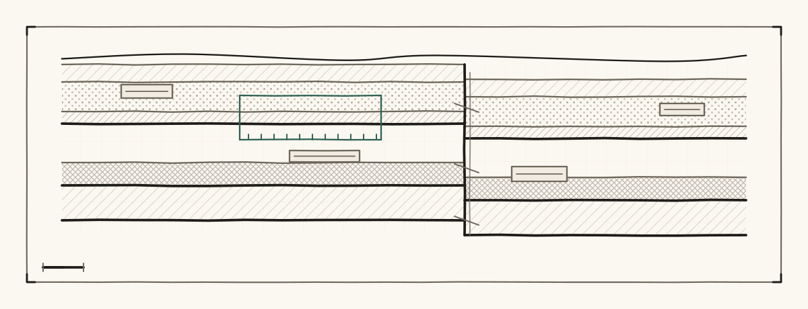
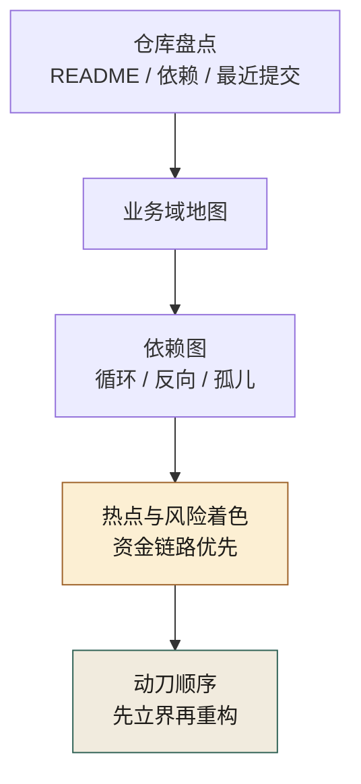
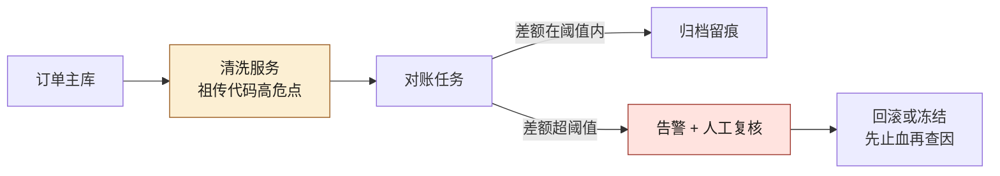
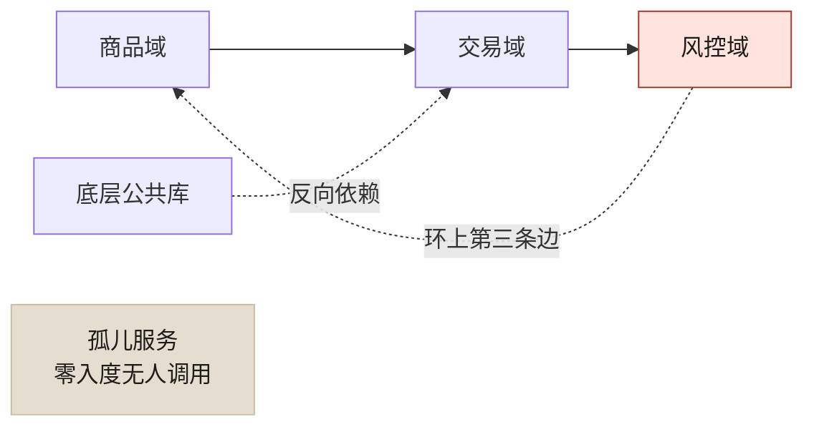
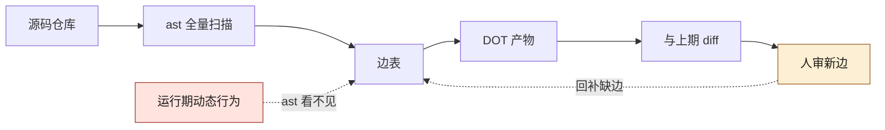

# 第 5 章 大规模遗留系统考古：200+ 仓库怎么画图

> **本章定位**：接手任何大型系统的第一步——不写代码，先画图。
> **核心命题**：治理一个你看不见的系统，和蒙着眼睛开车没有区别。

图 5-1 的读法就是本章的执行顺序：从仓库盘点起，经业务域地图、依赖图，到资金链路优先的热点着色，最后才落到「先立界再重构」的动刀顺序——顺序颠倒，动刀就失去了依据。

<figure class="chapter-plate">
  
  <figcaption>题图 · 探沟剖面：地层不会自己说话，断层要人标出来</figcaption>
</figure>



**图 5-1｜考古四步** — 治理看不见的系统等于蒙眼开车；第一周不写代码只画图。

---

## 5.1 问题：数百个仓库，没有一张全景图

当治理团队被要求"管好全平台的 AI 工程"时，面临的第一个问题不是"怎么管"，而是"全平台到底有什么"。在某电商平台案例中（案例一），214 个仓库、327 个微服务、12 个业务域——但这些数字之间的关系，没有任何一张图能说清楚。

治理团队做的第一个决定是：**接下来一周，谁都不许写代码，不许推方案，先画图。**

他们将所有仓库的 README、依赖配置、最近提交日期、一句话描述扒进了一张表格。**结果是触目惊心的：数十个仓库的 README 是空的，数十个仓库一年以上没人提交。** 这些数字第一次让"考古债"有了实感——这不是"代码不够好"的问题，是"组织根本不知道自己有什么"的问题。

这个困境在不同规模的组织中以不同形态出现：交易所案例中，上千名工程师维护着跨六大事业部的系统，模块边界模糊；量化案例中，策略合约散落在六条链上，版本关系不清；安全初创案例中，七个智能体的职责边界和交互关系没有被显式定义——虽然规模不同，但"不知道自己有什么"是共同的起点。

---

## 5.2 根因：组织只往前赶，从不回头看

为什么大量仓库没有一张全景图？因为大多数组织的发展方式和这些同龄公司一样：**只往前赶，从不回头看。**

**① 每个团队只看自己那块。** 各团队知道自己的仓库，但没人有义务知道"全平台长什么样"。**跨域的地图，不属于任何人的 KPI，于是它不存在。**

**② 仓库的增长是自发的、无规划的。** 每次有人觉得"这个模块该独立出来"，就新建一个仓库。多年下来，没有一个统一命名规范，有些连域归属都没标。**它们像野草一样长出来，从来没有人除草。**

**③ 知识在人脑里，人走了知识就没了。** 那些"一年没人提交"的仓库，它们的主人大多已经离职或转岗。**仓库还在跑，但没人知道它在干什么、能不能动、能不能删。**

---

## 5.3 AI 用法：AI 加速数据收集，但图必须人画

考古这件事，AI 能帮很多忙，但有一条红线：**AI 加速的是数据收集，不是判断。**

**AI 能做的：**
- 从仓库的文件结构、依赖配置、提交历史里，自动提取"这个仓库大概是干什么的"
- 将原始表格按业务域做初步分组
- 标注每个仓库的活跃度（最近提交时间、提交频率）

**AI 不能做的：**
- **裁定一个仓库到底属于哪个域。** 这是组织知识，不在代码里。
- **判断一个"看起来没人维护"的仓库能不能删。** 它可能正在被某个关键服务默默调用。

在电商平台案例中，AI 的初步分组把所有仓库归进了各业务域——**但有数十个仓库被归错了或硬塞了。** AI 把不确定的仓库塞进了"看起来最接近"的域，让结果"看起来整齐"。治理团队逐个审核了这些归类，纠正了一部分，确认了一部分，剩下标为"待定"。

> **这条教训是提示词工程的重要经验：AI 的天性是让结果好看，考古的要求是让结果真实。这两个目标冲突时，必须人介入。** 正确的提示词应该要求"对归属不确定的，单列'待定'并说明原因，不要擅自归并"。

---

## 5.4 组织冲突模式：画图要各团队配合，各团队说"没空"

考古的第二步是画四张图——模块图、依赖图、数据流图、部署图。这需要各团队配合提供信息。**通常没有一个团队主动配合。**

各团队的态度一致："画图是治理团队的事，我们忙着交付需求，没空。"

最终解决的方式在各案例中不同：电商平台案例中靠的是 CTO 的行政命令（"各团队须配合在两周内完成模块信息确认"）；交易所案例中靠的是风控总监推动的全系统盘点行政令。**共同点是：跨团队的考古，没有最高决策层的背书，推不动。**

即便如此，仍会有团队拖到最后才交信息，交得粗糙。治理团队只能自己补，多花数周。

---

## 5.5 产出物：全平台模块地图（四张图）

四张图用 Mermaid 或同类工具画，源码入库：

1. **模块图**：所有模块按业务域分组，标注活跃度与 Owner
2. **依赖图**：所有服务的调用关系（第 6 章深入）
3. **数据流图**：核心业务的数据流向
4. **部署图**：多机房部署与多活拓扑（第 18 章深入）

四张图不必同时开画。**先画资金链路的数据流图**——它直接回答"钱怎么流、每一跳谁负责"，是后续所有"不可碰"标注的底图。以支付对账链路为示意，一张最小的数据流图长这样。图 5-2 里唯一分叉在对账任务节点：差额在阈值内走归档留痕，超阈值才进人工复核、先止血再查因；被标成高危的那一跳是清洗服务——清洗类节点正是"不可碰"标注最先落的位置：



**图 5-2｜数据流图迷你示例（支付对账）** — 数据流图画的是「钱怎么流」；资金链路上每一跳都要有具名 Owner，清洗类服务天然是高危点。

依赖图则先看三样东西：环、反向、孤儿——它们在图上的形态一眼可辨（怎么拆，见第 6 章）。图 5-3 里三样齐全：商品域到交易域再到风控域、风控折回商品的那条边闭合成环；底层公共库被交易域反向依赖；最右侧孤儿服务零入度，没有任何一条线指向它：



**图 5-3｜依赖图迷你示例（域间环）** — 环在哪死锁风险就在哪、孤儿在哪维护浪费就在哪；着色只是提示，结论要看结构。

盘点表最小字段（可直接进 CSV / 表格工具）：

| 字段 | 说明 | 谁填 |
|---|---|---|
| repo / service | 仓库或服务名 | 自动抓取 |
| domain | 业务域 | AI 草稿 + 人裁定 |
| owner | 具名负责人 | 各域 TL |
| last_commit | 最近有意义提交 | 自动 |
| money_path | 是否在资金/合规链路 | 风控/合规 |
| ai_touchable | 可碰 / 需审批 / 不可碰 | 治理组 + 域 TL |
| notes | 循环依赖、孤儿、历史事故 | 人 |

> **代价声明**：画这四张图，治理团队通常需要数周，加上各团队配合的时间成本。**一张全平台地图的成本约为数十人天。** 但没有它，后面所有的架构治理、契约治理、灰度治理都无从谈起——你治理不了一个你看不见的东西。

---

## 5.5b 操作步骤：一场考古冲刺怎么跑

把 5.1–5.5 的动作串成可照抄的顺序（行政背书是第 0 步，没有它就地解散，别硬推）：

1. **拿到最高决策层背书。** 行政令或 CTO 邮件均可——各团队的第一反应一定是"没空"，背书是对抗这两个字的唯一筹码。
2. **冻结写代码冲动。** 冲刺期内治理团队不接需求、不推方案，产出只有图和表；考古期写代码，等于边开车边装后视镜。
3. **自动抓取仓库元数据。** README、依赖配置、最近提交、一句话描述，全部机器填进盘点表——人只填机器填不了的列。
4. **AI 预分组业务域。** 提示词强制要求"不确定的单列待定并说明原因，不许归并"（模板见 5.5c）。
5. **人审"待定"与资金相关仓库的归属。** AI 草稿 + 人裁定，裁定人签名进表——签名是分界线：签名之前是 AI 的猜测，签名之后是组织的事实。
6. **各域 TL 确认 owner 字段。** 必须是人名；找不到人的，标"孤儿 · 待处置"，不许留空。
7. **风控 / 合规标注 money_path 与 ai_touchable。** 可碰 / 需审批 / 不可碰三档，这一列是后面第 10 章边界测试的种子。
8. **出四张图，Mermaid 源码入库。** 模块 / 依赖 / 数据流 / 部署，不存截图——截图没法 diff，没法评审，没法进 CI。
9. **治理组验收。** 随机抽仓库问三问：属于哪个域、Owner 是谁、在不在资金链路——答不上的部分回炉。
10. **定更新机制再收工。** 新仓库上线必须同步进盘点表，否则地图从第一天就开始过期。

---

## 5.5c 可抄配置：盘点抓取与预分组提示词

抓取用现成命令就够，关键是口径统一（`$GIT_HOST`、`$ORG`、`$REPO` 均为占位符）：

```bash
# 为什么用元数据而不是读代码：盘点阶段要的是全景，不是细节
curl -s "$GIT_HOST/api/v4/groups/$ORG/projects?per_page=100" \
  | jq -r '.[] | [.path, .last_activity_at] | @tsv' > repos.tsv

# 最近一次有意义提交：活跃度决定考古优先级，空 README 的仓库优先补
git -C "$REPO" log -1 --format='%ci %an %s' >> activity.tsv
```

预分组提示词照附录 A 的骨架写，核心是**把"待定"变成合法输出**：

```yaml
id: P-5-5-01
scene: 全平台仓库按业务域预分组
objective: AI 出分组草稿，待定项必须单列
prompt: |
  以下是仓库清单（名称 / 一句话描述 / 依赖配置摘要）：<仓库清单>。
  业务域候选：<域列表>。
  请把仓库归入业务域，要求：
  1. 归属不确定的，单列「待定」并说明不确定的原因——不许塞进看起来最接近的域；
  2. 一年以上无提交的，单独标注；
  3. 输出表格，不要叙述性总结。
must_intervene: 「待定」与资金相关仓库的归属由治理组人审裁定
ai_failure_mode: 天性让结果好看，倾向硬塞归并以显得整齐
status: skeleton
```

---

## 5.5d 度量指标：地图是否可信

| 指标 | 怎么测 | 阈值 | 谁看 | 多久看一次 |
|------|--------|------|------|-----------|
| Owner 具名率 | 盘点表 owner 字段非空且为人名的占比 | 资金链路仓库全覆盖 | 治理组 + 各域 TL | 周（冲刺期）/ 季度（常态） |
| 待定仓库占比 | domain 为"待定"的仓库占比 | 持续下降，不许被悄悄归并 | 治理组 | 月 |
| 空文档仓库数 | README 为空或缺一句话描述的仓库数 | 趋势下降 | 治理组 | 月 |
| 地图更新时延 | 新仓库上线到进盘点表的时长 | 不超过一个季度 | 治理委员会 | 季度 |
| 验收抽查通过率 | 随机抽仓库"三问"能答上的占比 | 抽查不通过即回炉 | 治理组 | 季度 |

最容易被误读的是**待定仓库占比**——它下降有两种方式：人逐个裁定，或者 AI 悄悄归并。前者是治理在推进，后者是地图在腐烂。所以这个指标必须和"待定项的裁定记录数"一起看：没有裁定记录的下降，一律视为造假。

---

## 5.5e 工具落地卡 · 结构考古第一件：用 Python ast 建 import 图（本机实跑）

盘点表里的依赖列如果是手填的，它反映的就是画图那一刻的组织记忆，之后每一天都在过期。结构边必须由机器可重算——**可重算才可核对，可核对才谈得上治理**。这一卡给最小可抄件：标准库 `ast` 扫一个 Python 包，产出项目内 import 边表和 DOT 工件。

按 A 档口径先交代现场：本机实跑，Python 3.14，无第三方依赖；样本是自己造的三模块小仓（刻意不用真仓库——样本小到每一行输出都能逐行核对，失效面才看得清）。

```text
sample1/
  demoapp/__init__.py
  demoapp/config.py      # 谁都不 import，纯被依赖方
  demoapp/store.py       # import json；from demoapp import config
  demoapp/api.py         # from demoapp.store import load；from . import config
```

扫描器（本机跑的就是这份，注释里写"为什么"）：

```python
#!/usr/bin/env python3
"""最小结构考古件：用 ast 扫一个 Python 包，产出项目内 import 边表 + DOT。
只认 import / from-import 两类语句——这既是它的确定性，也是它的天花板。"""
import ast, pathlib, sys

root = pathlib.Path(sys.argv[1]).resolve()   # 被扫的包目录
out = pathlib.Path(sys.argv[2]); out.mkdir(parents=True, exist_ok=True)
pkg = root.name                              # 顶层包名：只收这个前缀的边
def is_mine(mod): return mod == pkg or mod.startswith(pkg + ".")

files = sorted(root.rglob("*.py"))
def modname(f):
    parts = f.relative_to(root.parent).with_suffix("").parts
    return ".".join(parts[:-1]) if parts[-1] == "__init__" else ".".join(parts)
mods = {modname(f) for f in files}

edges = set()
for f in files:
    self_mod = modname(f)
    for node in ast.walk(ast.parse(f.read_text(encoding="utf-8"))):
        if isinstance(node, ast.Import):
            for a in node.names:
                if is_mine(a.name) and a.name in mods:
                    edges.add((self_mod, a.name))
        elif isinstance(node, ast.ImportFrom):
            if node.level:                    # 相对 import：from . import config
                base = self_mod.rsplit(".", 1)[0] if "." in self_mod else pkg
                cands = {f"{base}.{a.name}" for a in node.names}
            else:                             # 绝对 import；from X import y 里 y
                base = node.module or ""      # 可能是子模块也可能是符号，这里按
                cands = {f"{base}.{a.name}" if base + "." + a.name in mods else base
                         for a in node.names} # "是否存在对应 .py" 消歧
            for c in cands:
                if is_mine(c) and c in mods:
                    edges.add((self_mod, c))

lines = [f"{s}\t{d}" for s, d in sorted(edges)]
(out / "edges.tsv").write_text("\n".join(lines) + "\n")
dot = ["digraph imports {"] + [f'  "{s}" -> "{d}";' for s, d in sorted(edges)] + ["}"]
(out / "deps.dot").write_text("\n".join(dot) + "\n")
print(f"文件 {len(files)} 个，节点 {len(mods)} 个，项目内 import 边 {len(edges)} 条：")
for s, d in sorted(edges):
    print(f"  {s:24s} -> {d}")
print(f"边表与 DOT 已写出：{out}/edges.tsv、{out}/deps.dot")
```

真实输出（stdout 逐字）：

```text
$ python3 scan_imports.py sample1/demoapp out1
文件 4 个，节点 4 个，项目内 import 边 3 条：
  demoapp.api              -> demoapp.config
  demoapp.api              -> demoapp.store
  demoapp.store            -> demoapp.config
边表与 DOT 已写出：out1/edges.tsv、out1/deps.dot
```

三条边各对应代码里一条真实的 import 语句。有一个细节值一个字："from X import y" 里的 y 可能是子模块也可能是符号，本件按"是否存在对应 `.py` 文件"消歧——这个歧义就是纯 `ast` 方案的痛点样本，也是 5.5f 里 SCIP 那一段存在的理由。

然后造第二个样本：给 `store.py` 加一处运行期才成形的反向依赖。

```python
def notify_ready() -> None:
    api = importlib.import_module("demoapp.api")  # 动态边：不是 import 语句
    api.handle("boot")                            # 运行期 store->api 真实存在
```

重扫，对照两份边表（真实输出）：

```text
$ python3 scan_imports.py sample2/demoapp out2
文件 4 个，节点 4 个，项目内 import 边 3 条：
  demoapp.api              -> demoapp.config
  demoapp.api              -> demoapp.store
  demoapp.store            -> demoapp.config
边表与 DOT 已写出：out2/edges.tsv、out2/deps.dot
$ diff <(sort out1/edges.tsv) <(sort out2/edges.tsv) && echo '两个样本的边表完全一致'
两个样本的边表完全一致
```

多了一条运行期依赖，边表纹丝不动——这就是"只认 import 语句"这个口径的天花板。扫描器漏的，用一条 grep 就能当场逮到：

```text
$ grep -n "import_module" sample2/demoapp/store.py
10:    api = importlib.import_module("demoapp.api")  # 动态边：不是 import 语句
```

这一卡要立住的结论：`ast` 给你的是**确定的一份边**，不是全部边。这条区分在下游是要命的——第 6 章会把这里漏掉的 `store->api` 补进边表，环检测立刻就会报出一个由静态边加动态边闭合成的环。静态边是地板，动态边是人审捞回来的天花板，两样都进同一张边表，才配叫依赖图。

它替代不了什么：域归属裁定（5.3 说过，那是组织知识）、注册表与配置驱动的加载、C 扩展里的相互调用——这些边不在 import 语句里，也不在 grep 的关键词里，只能靠运行时证据补，口径见 5.5g。

---

## 5.5f 工具落地卡 · 结构考古第二件：DOT 产物与 Ctags、SCIP 的定位

扫描器的第二个产物先贴原文——它在版本库里长这样：

```text
$ cat out2/deps.dot
digraph imports {
  "demoapp.api" -> "demoapp.config";
  "demoapp.api" -> "demoapp.store";
  "demoapp.store" -> "demoapp.config";
}
```

为什么落 DOT 而不是直接出一张 PNG：**DOT 是文本，能 diff、能评审、能进 CI 和上期对账**；布局是渲染器的事，不是工件的事。诚实标注渲染环节：本机没有 graphviz（`dot` 不在 PATH），渲染这一步没有实跑——工件以源码形态入库，用什么渲染、渲成什么样，留给各团队自己的图工具链，本书第 5-2、5-3 两张 Mermaid 图同样是"文本即工件"这条纪律的产物。

工具定位一张表。纪律：只有第一行是 A 档实跑，后三行是本机没装、按格式规范写的 B 档——**定位可以抄，行为没实测过就不写报错原文**：

| 工具 | 它给你什么 | 它给不了什么 | 本机状态 |
|------|-----------|-------------|---------|
| Python `ast` | 单语言 import 边，标准库零依赖，输出确定 | 动态 import、跨语言、引用点 | 本机实跑（5.5e） |
| Universal Ctags | 跨语言的符号定义标签，快，适合建"哪里有定义"的索引 | 引用边——谁用了这个符号它不管 | 本机未安装，未实测 |
| SCIP | 索引的交换格式：定义与引用精确到文件行，由语言 indexer 产出、任何消费端可读 | 运行期调用边 | 本机未跑通 indexer，未实测 |
| 编辑器 LSP | 交互式查定义、查引用，单点问题最准 | 全仓批量与存档 | 未实测 |

一句话分工：`ast` 答"谁 import 谁"，Ctags 答"这个符号定义在哪"，SCIP 答"谁在哪一行引用了这个符号"。三者是上下游供货关系，不是互相替代——选型的第一问永远是"我下游要跑的算法吃什么粒度的边"，而不是"哪个工具更时髦"。

把"扫描器只产出候选、人审补的边也进同一张表"这层意思画出来，就是图 5-4。顺着箭头读：机器扫出来的边和运行期观察到的边汇进同一份边表，DOT 与后续分析只消费边表；右边那条虚线是提醒——`ast` 看不见的东西，靠人审与遥测回补（图 5-4 上"边表"这个汇合点，就是 5.5g 全部失效讨论的受力点）：



**图 5-4｜结构考古主环** — 边表是唯一枢纽工件：机器边与人工回补边同表存放、每条边带来源口径，下游的渲染与环检测才不用各修各的真相。

---

## 5.5g 增量重扫的静默失效面（含本书仓库的负样本）

考古冲刺是一次性全量，地图保鲜靠增量——而增量恰恰是静默失效的老家。失效的共同形状是：**输出依然正常，结论已经错了**——流水线全绿，边表却在腐烂。先把面列全，再给两条本机实跑的样本。

| 失效面 | 机制 | 你看到的表象 | 兜底动作 |
|--------|------|-------------|---------|
| 扫描清单漂移 | 增量管线拿 `git ls-files` 当清单，未提交的新模块不在清单上 | 边数只减不增，且没人报警 | 全量对账：清单口径与文件系统口径定期 diff |
| 平级 import 漏出前缀判定 | 扫描器只认"顶层包名."点分前缀的边，靠工作目录的平级 import 全部漏网 | 明明互调的目录扫出 0 条边 | 前缀口径写进边表头，抽样 grep 复核 |
| 解析失败即静默跳过 | 语法错误触发 `ast.parse` 抛异常，包在容错里继续跑 | 某模块的节点与边整体蒸发 | 跳过必须打印文件名，跳过量计入红灯 |
| 动态 import | 5.5e 的 sample2：`importlib.import_module(字符串)` | 少一条边，图"看起来"正常 | 高扇出模块人审 + 运行期遥测对账（第 6 章） |
| 再导出链 | 公共包 `from a import b` 再对外转售，边的真实源头隔了一层 | 假边或漏边 | 边上区分"直接依赖"与"透传依赖"两类来源 |

第一条实跑：扫描清单漂移。`metrics.py` 写在本地还没 commit——`git ls-files` 看不见它，`find` 看得见（真实输出；`find` 的次序是 C locale 排序）：

```text
$ git ls-files '*.py'
demoapp/__init__.py
demoapp/api.py
demoapp/config.py
demoapp/store.py
$ find demoapp -name '*.py' | sort
demoapp/api.py
demoapp/config.py
demoapp/__init__.py
demoapp/metrics.py
demoapp/store.py
$ comm -13 <(git ls-files '*.py' | sort) <(find demoapp -name '*.py' | sort)
demoapp/metrics.py
```

增量扫描若按前者取清单，新模块的边进不了表，而流水线一声不响——绿灯不代表边在，只代表扫到的是这份清单。

第二条更疼，因为样本是**本书仓库自己**：拿 5.5e 的扫描器扫 `scripts/`（本书全部守卫脚本，十八个文件），输出 0 条边——

```text
$ python3 scan_imports.py scripts out_scripts
文件 18 个，节点 18 个，项目内 import 边 0 条：
边表与 DOT 已写出：out_scripts/edges.tsv、out_scripts/deps.dot
```

信了"0 条"，你就会在地图上写下"这批脚本彼此独立"。grep 一枪打穿：

```text
$ grep -n "^from check_" scripts/*.py
scripts/check_interactions.py:41:from check_legibility import dismiss_cover  # noqa: E402  # 揭幕那条链只写一份，五条闸共用
scripts/check_mobile.py:33:from check_legibility import dismiss_cover, same_landing  # noqa: E402  # 揭幕那条链只写一份，五条闸共用
scripts/check_palette.py:73:from check_legibility import dismiss_cover, same_landing  # noqa: E402  # 揭幕那条链只写一份，五条闸共用
scripts/check_render_leaks.py:56:from check_legibility import routes_two_ways, dismiss_cover  # noqa: E402
scripts/sync_plate_literals.py:32:from check_palette import DIR_COLOR, FALLBACK_BLOCK, MERMAID_DIR, parse_tokens  # noqa: E402
```

五条货真价实的平级 import 全在，扫描器却报 0——因为"项目内边"的口径只认带顶层包名前缀的点分模块名，而这些脚本从仓库根运行、靠工作目录做平级导入。**0 条边不是结构真相，是口径错误**——这个负样本比任何正样本都值钱：它示范了静默失效的标准长相，也证明"对工具输出处处留怀疑"不是态度口号，是一条 grep 的成本。

增量不失效，靠三条纪律：

1. **增量只许用来提速，不许用来代替真相。** 每跑若干次增量，必须补一次全量，两份边表的 diff 留档为工件；补跑节奏按你们的提交频率定，本书不给默认值。
2. **跳过路径必须出声。** 扫描器遇到解析失败要打印文件名并计数；CI 判据不是"退出码 0"，是"退出码 0 且跳过计数为 0 且边数跌幅在预期内"。
3. **口径改动进边表头。** 前缀规则、扫描根、清单来源任何一项变了，边表头部要写口径版本号——否则上下一期的 diff 只是在比较两个不同问题的问题陈述。

这三条都兜不住的东西（配置驱动的加载、跨语言的隐式调用），出路不在静态扫描器里，在第 6 章的运行期对账与引用索引——那里见真章：边不够用时，先问这条边该由谁来供。

---

## 四案例映射

| 案例 | 系统盘点规模 | AI 分组中的典型硬塞错误 | 考古地图的核心用途 |
|------|-------------|----------------------|-------------------|
| 案例一·电商平台 | 214 仓库 / 327 服务 | 不确定仓库被塞入最近域 | 为后续架构/契约/灰度治理提供基础 |
| 案例二·加密交易所 | 6 大事业部 / 千人团队 | 跨事业部模块归属模糊 | 为精度回归测试和降级通道定位关键路径 |
| 案例三·Web3 量化 | 47 策略 / 23 合约 / 6 链 | 链上合约版本关系不清 | 为合约审计和安全不变量检查提供全景 |
| 案例四·安全初创 | 7 智能体 / 10 人团队 | 智能体间依赖关系未显式定义 | 为 Agent 间契约和权限矩阵提供基础 |

---

## 5.6 检查清单

- [ ] 你有没有一张全平台的模块地图？没有 = 你不知道自己在治理什么。
- [ ] 你的地图是按业务域分的，还是按仓库分的？按仓库 = 没人看得懂。
- [ ] 地图上有没有标注每个模块的活跃度和 Owner？没有 = 孤儿模块藏在里面你看不见。
- [ ] AI 辅助分组时，你有没有人工审核"不确定"的归类？没有 = AI 硬塞的错误被你当成事实。
- [ ] 地图有没有更新机制？没有 = 三个月后它就过期了。

---

## 5.7 反模式

| # | 反模式 | 后果 |
|---|--------|------|
| 1 | 不画图就开始治理 | 盲人摸象，改了东墙塌西墙 |
| 2 | 按仓库分而不是按业务域分 | 图有了，但没人看得懂 |
| 3 | AI 分组不经人审 | 归类错误被当事实传播 |
| 4 | 地图画完就不管了 | 三个月过期 |
| 5 | 各域不出人就硬推 | 数据粗糙，图不可信 |

---

## 5.8 遗留问题

- **依赖图里藏着什么？** 模块图画完了，但模块之间的依赖关系（谁调谁、有没有循环）还没分析。这是第 6 章的核心。
- **那些"没人维护"的仓库怎么办？** 一年无提交的仓库，删了怕炸，不删占地方。第 6 章的 WIRED/NOT WIRED 分析会给初步答案。
- **隐性知识怎么留住？** 那些 Owner 已离职的仓库，知识随人走了。第 7 章（AI 读懂祖传代码）会用 AI 辅助补写考古笔记。

---

> **本章的一句话**：治理一个你看不见的系统，和蒙着眼睛开车没有区别。**画图不是为了好看，是为了让你在动任何一行代码之前，知道自己动的是什么、连着什么、谁在依赖它。** AI 让画图变快了，但"这个模块到底属于谁"这种判断，永远得人来下。
