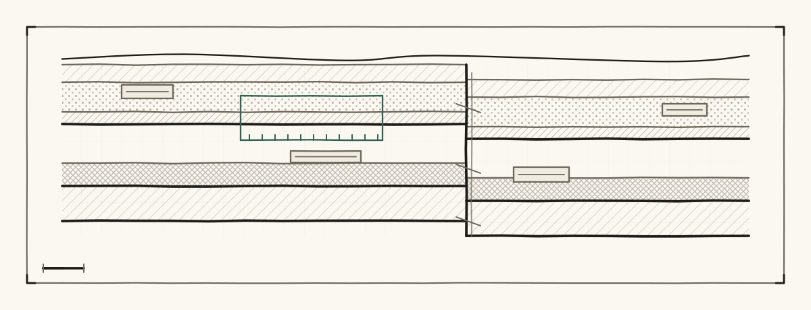
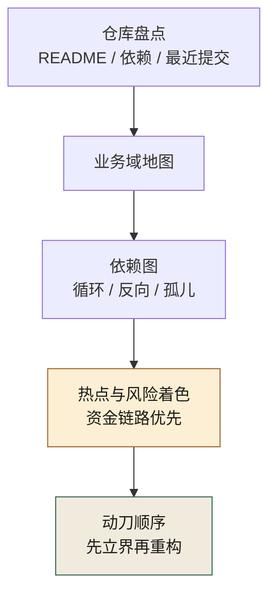
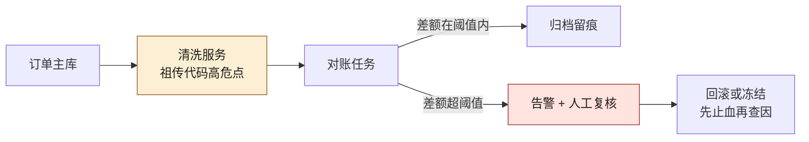
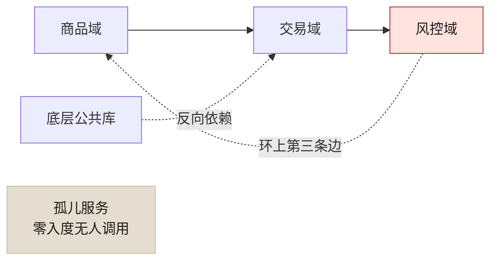
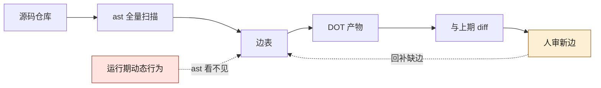
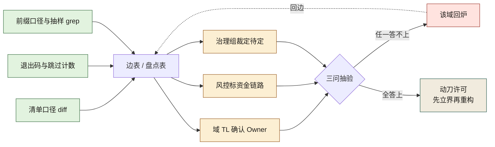

# 第 5 章 大规模遗留系统考古：200+ 仓库怎么画图

> **本章定位**：接手任何大型系统的第一步——不写代码，先画图。
> **核心命题**：治理一个你看不见的系统，和蒙着眼睛开车没有区别。

图 5-1 的读法就是本章的执行顺序：从仓库盘点起，经业务域地图、依赖图，到资金链路优先的热点着色，最后才落到「先立界再重构」的动刀顺序——顺序颠倒，动刀就失去了依据。

<figure class="chapter-plate">
  
  <figcaption>题图 · 探沟剖面：地层不会自己说话，断层要人标出来</figcaption>
</figure>


```mermaid
flowchart TB
  INV[仓库盘点<br/>README / 依赖 / 最近提交] --> MAP[业务域地图]
  MAP --> DEP[依赖图<br/>循环 / 反向 / 孤儿]
  DEP --> HOT[热点与风险着色<br/>资金链路优先]
  HOT --> ACT[动刀顺序<br/>先立界再重构]
  style HOT fill:#fcefd3,stroke:#9d6127,color:#1e1c19
  style ACT fill:#f1ebde,stroke:#2f6154,color:#1e1c19
```

**图 5-1｜考古四步** — 治理看不见的系统等于蒙眼开车；第一周不写代码只画图。

---

## 5.1 问题：数百个仓库，没有一张全景图

当治理团队被要求"管好全平台的 AI 工程"时，面临的第一个问题不是"怎么管"，而是"全平台到底有什么"。在某电商平台案例中（案例一），214 个仓库、327 个微服务、12 个业务域——但这些数字之间的关系，没有任何一张图能说清楚。

治理团队做的第一个决定是：**接下来一周，谁都不许写代码，不许推方案，先画图。**

他们将所有仓库的 README、依赖配置、最近提交日期、一句话描述扒进了一张表格。**结果是触目惊心的：数十个仓库的 README 是空的，数十个仓库一年以上没人提交。** 这些数字第一次让"考古债"有了实感——这不是"代码不够好"的问题，是"组织根本不知道自己有什么"的问题。

这个困境在不同规模的组织中以不同形态出现：交易所案例中，上千名工程师维护着跨六大事业部的系统，模块边界模糊；量化案例中，策略合约散落在六条链上，版本关系不清；安全初创案例中，七个智能体的职责边界和交互关系没有被显式定义——虽然规模不同，但"不知道自己有什么"是共同的起点。

---

## 5.2 根因：组织只往前赶，从不回头看

为什么大量仓库没有一张全景图？因为大多数组织的发展方式和这些同龄公司一样：**只往前赶，从不回头看。**

**① 每个团队只看自己那块。** 各团队知道自己的仓库，但没人有义务知道"全平台长什么样"。**跨域的地图，不属于任何人的 KPI，于是它不存在。**

**② 仓库的增长是自发的、无规划的。** 每次有人觉得"这个模块该独立出来"，就新建一个仓库。多年下来，没有一个统一命名规范，有些连域归属都没标。**它们像野草一样长出来，从来没有人除草。**

**③ 知识在人脑里，人走了知识就没了。** 那些"一年没人提交"的仓库，它们的主人大多已经离职或转岗。**仓库还在跑，但没人知道它在干什么、能不能动、能不能删。**

---

## 5.3 AI 用法：AI 加速数据收集，但图必须人画

考古这件事，AI 能帮很多忙，但有一条红线：**AI 加速的是数据收集，不是判断。**

**AI 能做的：**
- 从仓库的文件结构、依赖配置、提交历史里，自动提取"这个仓库大概是干什么的"
- 将原始表格按业务域做初步分组
- 标注每个仓库的活跃度（最近提交时间、提交频率）

**AI 不能做的：**
- **裁定一个仓库到底属于哪个域。** 这是组织知识，不在代码里。
- **判断一个"看起来没人维护"的仓库能不能删。** 它可能正在被某个关键服务默默调用。

在电商平台案例中，AI 的初步分组把所有仓库归进了各业务域——**但有数十个仓库被归错了或硬塞了。** AI 把不确定的仓库塞进了"看起来最接近"的域，让结果"看起来整齐"。治理团队逐个审核了这些归类，纠正了一部分，确认了一部分，剩下标为"待定"。

> **这条教训是提示词工程的重要经验：AI 的天性是让结果好看，考古的要求是让结果真实。这两个目标冲突时，必须人介入。** 正确的提示词应该要求"对归属不确定的，单列'待定'并说明原因，不要擅自归并"。

---

## 5.4 组织冲突模式：画图要各团队配合，各团队说"没空"

考古的第二步是画四张图——模块图、依赖图、数据流图、部署图。这需要各团队配合提供信息。**通常没有一个团队主动配合。**

各团队的态度一致："画图是治理团队的事，我们忙着交付需求，没空。"

最终解决的方式在各案例中不同：电商平台案例中靠的是 CTO 的行政命令（"各团队须配合在两周内完成模块信息确认"）；交易所案例中靠的是风控总监推动的全系统盘点行政令。**共同点是：跨团队的考古，没有最高决策层的背书，推不动。**

即便如此，仍会有团队拖到最后才交信息，交得粗糙。治理团队只能自己补，多花数周。

---

## 5.5 产出物：全平台模块地图（四张图）

四张图用 Mermaid 或同类工具画，源码入库：

1. **模块图**：所有模块按业务域分组，标注活跃度与 Owner
2. **依赖图**：所有服务的调用关系（第 6 章深入）
3. **数据流图**：核心业务的数据流向
4. **部署图**：多机房部署与多活拓扑（第 18 章深入）

四张图不必同时开画。**先画资金链路的数据流图**——它直接回答"钱怎么流、每一跳谁负责"，是后续所有"不可碰"标注的底图。以支付对账链路为示意，一张最小的数据流图长这样。图 5-2 里唯一分叉在对账任务节点：差额在阈值内走归档留痕，超阈值才进人工复核、先止血再查因；被标成高危的那一跳是清洗服务——清洗类节点正是"不可碰"标注最先落的位置：


```mermaid
flowchart LR
  S["订单主库"] --> W["清洗服务<br/>祖传代码高危点"]
  W --> R["对账任务"]
  R -->|差额在阈值内| OK["归档留痕"]
  R -->|差额超阈值| AL["告警 + 人工复核"]
  AL --> RB["回滚或冻结<br/>先止血再查因"]
  style W fill:#fcefd3,stroke:#9d6127,color:#1e1c19
  style AL fill:#ffe3df,stroke:#a03b31,color:#1e1c19
```

**图 5-2｜数据流图迷你示例（支付对账）** — 数据流图画的是「钱怎么流」；资金链路上每一跳都要有具名 Owner，清洗类服务天然是高危点。

依赖图则先看三样东西：环、反向、孤儿——它们在图上的形态一眼可辨（怎么拆，见第 6 章）。图 5-3 里三样齐全：商品域到交易域再到风控域、风控折回商品的那条边闭合成环；底层公共库被交易域反向依赖；最右侧孤儿服务零入度，没有任何一条线指向它：


```mermaid
flowchart LR
  A["商品域"] --> B["交易域"]
  B --> C["风控域"]
  C -.环上第三条边.-> A
  D["底层公共库"] -.反向依赖.-> B
  E["孤儿服务<br/>零入度无人调用"]
  style C fill:#ffe3df,stroke:#a03b31,color:#1e1c19
  style E fill:#e5ddd0,stroke:#c9bfa9,color:#1e1c19
```

**图 5-3｜依赖图迷你示例（域间环）** — 环在哪死锁风险就在哪、孤儿在哪维护浪费就在哪；着色只是提示，结论要看结构。

盘点表最小字段（可直接进 CSV / 表格工具）：

| 字段 | 说明 | 谁填 |
|---|---|---|
| repo / service | 仓库或服务名 | 自动抓取 |
| domain | 业务域 | AI 草稿 + 人裁定 |
| owner | 具名负责人 | 各域 TL |
| last_commit | 最近有意义提交 | 自动 |
| money_path | 是否在资金/合规链路 | 风控/合规 |
| ai_touchable | 可碰 / 需审批 / 不可碰 | 治理组 + 域 TL |
| notes | 循环依赖、孤儿、历史事故 | 人 |

> **代价声明**：画这四张图，治理团队通常需要数周，加上各团队配合的时间成本。**一张全平台地图的成本约为数十人天。** 但没有它，后面所有的架构治理、契约治理、灰度治理都无从谈起——你治理不了一个你看不见的东西。

---

## 5.5b 操作步骤：一场考古冲刺怎么跑

把 5.1–5.5 的动作串成可照抄的顺序（行政背书是第 0 步，没有它就地解散，别硬推）：

1. **拿到最高决策层背书。** 行政令或 CTO 邮件均可——各团队的第一反应一定是"没空"，背书是对抗这两个字的唯一筹码。
2. **冻结写代码冲动。** 冲刺期内治理团队不接需求、不推方案，产出只有图和表；考古期写代码，等于边开车边装后视镜。
3. **自动抓取仓库元数据。** README、依赖配置、最近提交、一句话描述，全部机器填进盘点表——人只填机器填不了的列。
4. **AI 预分组业务域。** 提示词强制要求"不确定的单列待定并说明原因，不许归并"（模板见 5.5c）。
5. **人审"待定"与资金相关仓库的归属。** AI 草稿 + 人裁定，裁定人签名进表——签名是分界线：签名之前是 AI 的猜测，签名之后是组织的事实。
6. **各域 TL 确认 owner 字段。** 必须是人名；找不到人的，标"孤儿 · 待处置"，不许留空。
7. **风控 / 合规标注 money_path 与 ai_touchable。** 可碰 / 需审批 / 不可碰三档，这一列是后面第 10 章边界测试的种子。
8. **出四张图，Mermaid 源码入库。** 模块 / 依赖 / 数据流 / 部署，不存截图——截图没法 diff，没法评审，没法进 CI。
9. **治理组验收。** 随机抽仓库问三问：属于哪个域、Owner 是谁、在不在资金链路——答不上的部分回炉。
10. **定更新机制再收工。** 新仓库上线必须同步进盘点表，否则地图从第一天就开始过期。

---

## 5.5c 可抄配置：盘点抓取与预分组提示词

抓取用现成命令就够，关键是口径统一（`$GIT_HOST`、`$ORG`、`$REPO` 均为占位符）：

```bash
# 为什么用元数据而不是读代码：盘点阶段要的是全景，不是细节
curl -s "$GIT_HOST/api/v4/groups/$ORG/projects?per_page=100" \
  | jq -r '.[] | [.path, .last_activity_at] | @tsv' > repos.tsv

# 最近一次有意义提交：活跃度决定考古优先级，空 README 的仓库优先补
git -C "$REPO" log -1 --format='%ci %an %s' >> activity.tsv
```

预分组提示词照附录 A 的骨架写，核心是**把"待定"变成合法输出**：

```yaml
id: P-5-5-01
scene: 全平台仓库按业务域预分组
objective: AI 出分组草稿，待定项必须单列
prompt: |
  以下是仓库清单（名称 / 一句话描述 / 依赖配置摘要）：<仓库清单>。
  业务域候选：<域列表>。
  请把仓库归入业务域，要求：
  1. 归属不确定的，单列「待定」并说明不确定的原因——不许塞进看起来最接近的域；
  2. 一年以上无提交的，单独标注；
  3. 输出表格，不要叙述性总结。
must_intervene: 「待定」与资金相关仓库的归属由治理组人审裁定
ai_failure_mode: 天性让结果好看，倾向硬塞归并以显得整齐
status: skeleton
```

---

## 5.5d 度量指标：地图是否可信

| 指标 | 怎么测 | 阈值 | 谁看 | 多久看一次 |
|------|--------|------|------|-----------|
| Owner 具名率 | 盘点表 owner 字段非空且为人名的占比 | 资金链路仓库全覆盖 | 治理组 + 各域 TL | 周（冲刺期）/ 季度（常态） |
| 待定仓库占比 | domain 为"待定"的仓库占比 | 持续下降，不许被悄悄归并 | 治理组 | 月 |
| 空文档仓库数 | README 为空或缺一句话描述的仓库数 | 趋势下降 | 治理组 | 月 |
| 地图更新时延 | 新仓库上线到进盘点表的时长 | 不超过一个季度 | 治理委员会 | 季度 |
| 验收抽查通过率 | 随机抽仓库"三问"能答上的占比 | 抽查不通过即回炉 | 治理组 | 季度 |

最容易被误读的是**待定仓库占比**——它下降有两种方式：人逐个裁定，或者 AI 悄悄归并。前者是治理在推进，后者是地图在腐烂。所以这个指标必须和"待定项的裁定记录数"一起看：没有裁定记录的下降，一律视为造假。

---

## 5.5e 工具落地卡 · 结构考古第一件：用 Python ast 建 import 图（本机实跑）

盘点表里的依赖列如果是手填的，它反映的就是画图那一刻的组织记忆，之后每一天都在过期。结构边必须由机器可重算——**可重算才可核对，可核对才谈得上治理**。这一卡给最小可抄件：标准库 `ast` 扫一个 Python 包，产出项目内 import 边表和 DOT 工件。

按 A 档口径先交代现场：本机实跑，Python 3.14，无第三方依赖；样本是自己造的三模块小仓（刻意不用真仓库——样本小到每一行输出都能逐行核对，失效面才看得清）。

```text
sample1/
  demoapp/__init__.py
  demoapp/config.py      # 谁都不 import，纯被依赖方
  demoapp/store.py       # import json；from demoapp import config
  demoapp/api.py         # from demoapp.store import load；from . import config
```

扫描器（本机跑的就是这份，注释里写"为什么"）：

```python
#!/usr/bin/env python3
"""最小结构考古件：用 ast 扫一个 Python 包，产出项目内 import 边表 + DOT。
只认 import / from-import 两类语句——这既是它的确定性，也是它的天花板。"""
import ast, pathlib, sys

root = pathlib.Path(sys.argv[1]).resolve()   # 被扫的包目录
out = pathlib.Path(sys.argv[2]); out.mkdir(parents=True, exist_ok=True)
pkg = root.name                              # 顶层包名：只收这个前缀的边
def is_mine(mod): return mod == pkg or mod.startswith(pkg + ".")

files = sorted(root.rglob("*.py"))
def modname(f):
    parts = f.relative_to(root.parent).with_suffix("").parts
    return ".".join(parts[:-1]) if parts[-1] == "__init__" else ".".join(parts)
mods = {modname(f) for f in files}

edges = set()
for f in files:
    self_mod = modname(f)
    for node in ast.walk(ast.parse(f.read_text(encoding="utf-8"))):
        if isinstance(node, ast.Import):
            for a in node.names:
                if is_mine(a.name) and a.name in mods:
                    edges.add((self_mod, a.name))
        elif isinstance(node, ast.ImportFrom):
            if node.level:                    # 相对 import：from . import config
                base = self_mod.rsplit(".", 1)[0] if "." in self_mod else pkg
                cands = {f"{base}.{a.name}" for a in node.names}
            else:                             # 绝对 import；from X import y 里 y
                base = node.module or ""      # 可能是子模块也可能是符号，这里按
                cands = {f"{base}.{a.name}" if base + "." + a.name in mods else base
                         for a in node.names} # "是否存在对应 .py" 消歧
            for c in cands:
                if is_mine(c) and c in mods:
                    edges.add((self_mod, c))

lines = [f"{s}\t{d}" for s, d in sorted(edges)]
(out / "edges.tsv").write_text("\n".join(lines) + "\n")
dot = ["digraph imports {"] + [f'  "{s}" -> "{d}";' for s, d in sorted(edges)] + ["}"]
(out / "deps.dot").write_text("\n".join(dot) + "\n")
print(f"文件 {len(files)} 个，节点 {len(mods)} 个，项目内 import 边 {len(edges)} 条：")
for s, d in sorted(edges):
    print(f"  {s:24s} -> {d}")
print(f"边表与 DOT 已写出：{out}/edges.tsv、{out}/deps.dot")
```

真实输出（stdout 逐字）：

```text
$ python3 scan_imports.py sample1/demoapp out1
文件 4 个，节点 4 个，项目内 import 边 3 条：
  demoapp.api              -> demoapp.config
  demoapp.api              -> demoapp.store
  demoapp.store            -> demoapp.config
边表与 DOT 已写出：out1/edges.tsv、out1/deps.dot
```

三条边各对应代码里一条真实的 import 语句。有一个细节值一个字："from X import y" 里的 y 可能是子模块也可能是符号，本件按"是否存在对应 `.py` 文件"消歧——这个歧义就是纯 `ast` 方案的痛点样本，也是 5.5f 里 SCIP 那一段存在的理由。

然后造第二个样本：给 `store.py` 加一处运行期才成形的反向依赖。

```python
def notify_ready() -> None:
    api = importlib.import_module("demoapp.api")  # 动态边：不是 import 语句
    api.handle("boot")                            # 运行期 store->api 真实存在
```

重扫，对照两份边表（真实输出）：

```text
$ python3 scan_imports.py sample2/demoapp out2
文件 4 个，节点 4 个，项目内 import 边 3 条：
  demoapp.api              -> demoapp.config
  demoapp.api              -> demoapp.store
  demoapp.store            -> demoapp.config
边表与 DOT 已写出：out2/edges.tsv、out2/deps.dot
$ diff <(sort out1/edges.tsv) <(sort out2/edges.tsv) && echo '两个样本的边表完全一致'
两个样本的边表完全一致
```

多了一条运行期依赖，边表纹丝不动——这就是"只认 import 语句"这个口径的天花板。扫描器漏的，用一条 grep 就能当场逮到：

```text
$ grep -n "import_module" sample2/demoapp/store.py
10:    api = importlib.import_module("demoapp.api")  # 动态边：不是 import 语句
```

这一卡要立住的结论：`ast` 给你的是**确定的一份边**，不是全部边。这条区分在下游是要命的——第 6 章会把这里漏掉的 `store->api` 补进边表，环检测立刻就会报出一个由静态边加动态边闭合成的环。静态边是地板，动态边是人审捞回来的天花板，两样都进同一张边表，才配叫依赖图。

它替代不了什么：域归属裁定（5.3 说过，那是组织知识）、注册表与配置驱动的加载、C 扩展里的相互调用——这些边不在 import 语句里，也不在 grep 的关键词里，只能靠运行时证据补，口径见 5.5g。

> **档位声明（Python ast 建 import 图）**：**A 档 · 本机实跑（Python 3.14、无第三方依赖），两个样本的边表读数与 grep 对照输出都是这台机器实际跑出来的**

---

## 5.5f 工具落地卡 · 结构考古第二件：DOT 产物与 Ctags、SCIP 的定位

扫描器的第二个产物先贴原文——它在版本库里长这样：

```text
$ cat out2/deps.dot
digraph imports {
  "demoapp.api" -> "demoapp.config";
  "demoapp.api" -> "demoapp.store";
  "demoapp.store" -> "demoapp.config";
}
```

为什么落 DOT 而不是直接出一张 PNG：**DOT 是文本，能 diff、能评审、能进 CI 和上期对账**；布局是渲染器的事，不是工件的事。诚实标注渲染环节：本机没有 graphviz（`dot` 不在 PATH），渲染这一步没有实跑——工件以源码形态入库，用什么渲染、渲成什么样，留给各团队自己的图工具链，本书第 5-2、5-3 两张 Mermaid 图同样是"文本即工件"这条纪律的产物。

工具定位一张表。纪律：只有第一行是 A 档实跑，后三行是本机没装、按格式规范写的 B 档——**定位可以抄，行为没实测过就不写报错原文**：

| 工具 | 它给你什么 | 它给不了什么 | 本机状态 |
|------|-----------|-------------|---------|
| Python `ast` | 单语言 import 边，标准库零依赖，输出确定 | 动态 import、跨语言、引用点 | 本机实跑（5.5e） |
| Universal Ctags | 跨语言的符号定义标签，快，适合建"哪里有定义"的索引 | 引用边——谁用了这个符号它不管 | 本机未安装，未实测 |
| SCIP | 索引的交换格式：定义与引用精确到文件行，由语言 indexer 产出、任何消费端可读 | 运行期调用边 | 本机未跑通 indexer，未实测 |
| 编辑器 LSP | 交互式查定义、查引用，单点问题最准 | 全仓批量与存档 | 未实测 |

一句话分工：`ast` 答"谁 import 谁"，Ctags 答"这个符号定义在哪"，SCIP 答"谁在哪一行引用了这个符号"。三者是上下游供货关系，不是互相替代——选型的第一问永远是"我下游要跑的算法吃什么粒度的边"，而不是"哪个工具更时髦"。

把"扫描器只产出候选、人审补的边也进同一张表"这层意思画出来，就是图 5-4。顺着箭头读：机器扫出来的边和运行期观察到的边汇进同一份边表，DOT 与后续分析只消费边表；右边那条虚线是提醒——`ast` 看不见的东西，靠人审与遥测回补（图 5-4 上"边表"这个汇合点，就是 5.5g 全部失效讨论的受力点）：


```mermaid
flowchart LR
  SRC[源码仓库] --> SCAN[ast 全量扫描]
  SCAN --> EDGE[边表]
  EDGE --> DOT[DOT 产物]
  DOT --> CMP[与上期 diff]
  CMP --> REV[人审新边]
  RUN[运行期动态行为] -.ast 看不见.-> EDGE
  REV -.回补缺边.-> EDGE
  style RUN fill:#ffe3df,stroke:#a03b31,color:#1e1c19
  style REV fill:#fcefd3,stroke:#9d6127,color:#1e1c19
```

**图 5-4｜结构考古主环** — 边表是唯一枢纽工件：机器边与人工回补边同表存放、每条边带来源口径，下游的渲染与环检测才不用各修各的真相。

---

## 5.5g 增量重扫的静默失效面（含本书仓库的负样本）

考古冲刺是一次性全量，地图保鲜靠增量——而增量恰恰是静默失效的老家。失效的共同形状是：**输出依然正常，结论已经错了**——流水线全绿，边表却在腐烂。先把面列全，再给两条本机实跑的样本。

| 失效面 | 机制 | 你看到的表象 | 兜底动作 |
|--------|------|-------------|---------|
| 扫描清单漂移 | 增量管线拿 `git ls-files` 当清单，未提交的新模块不在清单上 | 边数只减不增，且没人报警 | 全量对账：清单口径与文件系统口径定期 diff |
| 平级 import 漏出前缀判定 | 扫描器只认"顶层包名."点分前缀的边，靠工作目录的平级 import 全部漏网 | 明明互调的目录扫出 0 条边 | 前缀口径写进边表头，抽样 grep 复核 |
| 解析失败即静默跳过 | 语法错误触发 `ast.parse` 抛异常，包在容错里继续跑 | 某模块的节点与边整体蒸发 | 跳过必须打印文件名，跳过量计入红灯 |
| 动态 import | 5.5e 的 sample2：`importlib.import_module(字符串)` | 少一条边，图"看起来"正常 | 高扇出模块人审 + 运行期遥测对账（第 6 章） |
| 再导出链 | 公共包 `from a import b` 再对外转售，边的真实源头隔了一层 | 假边或漏边 | 边上区分"直接依赖"与"透传依赖"两类来源 |

第一条实跑：扫描清单漂移。`metrics.py` 写在本地还没 commit——`git ls-files` 看不见它，`find` 看得见（真实输出；`find` 的次序是 C locale 排序）：

```text
$ git ls-files '*.py'
demoapp/__init__.py
demoapp/api.py
demoapp/config.py
demoapp/store.py
$ find demoapp -name '*.py' | sort
demoapp/api.py
demoapp/config.py
demoapp/__init__.py
demoapp/metrics.py
demoapp/store.py
$ comm -13 <(git ls-files '*.py' | sort) <(find demoapp -name '*.py' | sort)
demoapp/metrics.py
```

增量扫描若按前者取清单，新模块的边进不了表，而流水线一声不响——绿灯不代表边在，只代表扫到的是这份清单。

第二条更疼，因为样本是**本书仓库自己**：拿 5.5e 的扫描器扫 `scripts/`（本书全部守卫脚本，十八个文件），输出 0 条边——

```text
$ python3 scan_imports.py scripts out_scripts
文件 18 个，节点 18 个，项目内 import 边 0 条：
边表与 DOT 已写出：out_scripts/edges.tsv、out_scripts/deps.dot
```

信了"0 条"，你就会在地图上写下"这批脚本彼此独立"。grep 一枪打穿：

```text
$ grep -n "^from check_" scripts/*.py
scripts/check_interactions.py:41:from check_legibility import dismiss_cover  # noqa: E402  # 揭幕那条链只写一份，五条闸共用
scripts/check_mobile.py:33:from check_legibility import dismiss_cover, same_landing  # noqa: E402  # 揭幕那条链只写一份，五条闸共用
scripts/check_palette.py:73:from check_legibility import dismiss_cover, same_landing  # noqa: E402  # 揭幕那条链只写一份，五条闸共用
scripts/check_render_leaks.py:56:from check_legibility import routes_two_ways, dismiss_cover  # noqa: E402
scripts/sync_plate_literals.py:32:from check_palette import DIR_COLOR, FALLBACK_BLOCK, MERMAID_DIR, parse_tokens  # noqa: E402
```

五条货真价实的平级 import 全在，扫描器却报 0——因为"项目内边"的口径只认带顶层包名前缀的点分模块名，而这些脚本从仓库根运行、靠工作目录做平级导入。**0 条边不是结构真相，是口径错误**——这个负样本比任何正样本都值钱：它示范了静默失效的标准长相，也证明"对工具输出处处留怀疑"不是态度口号，是一条 grep 的成本。

增量不失效，靠三条纪律：

1. **增量只许用来提速，不许用来代替真相。** 每跑若干次增量，必须补一次全量，两份边表的 diff 留档为工件；补跑节奏按你们的提交频率定，本书不给默认值。
2. **跳过路径必须出声。** 扫描器遇到解析失败要打印文件名并计数；CI 判据不是"退出码 0"，是"退出码 0 且跳过计数为 0 且边数跌幅在预期内"。
3. **口径改动进边表头。** 前缀规则、扫描根、清单来源任何一项变了，边表头部要写口径版本号——否则上下一期的 diff 只是在比较两个不同问题的问题陈述。

这三条都兜不住的东西（配置驱动的加载、跨语言的隐式调用），出路不在静态扫描器里，在第 6 章的运行期对账与引用索引——那里见真章：边不够用时，先问这条边该由谁来供。

---

## 5.5h 生效证据清点：这张地图的十五件机制各自挂着哪份产物

5.5 立了四张图与一张七列盘点表，5.5b 排了十步冲刺，5.5c 给了抓取命令和预分组提示词，5.5d 起了五行阈值，5.5e 到 5.5g 造出扫描器、DOT 工件与五张失效面。件很齐，但"写了"与"这台机器上真出过一份东西"是两件事。这一节把每件机制翻回证据面，三态只有三个词，口径沿用[第 21 章](./ch26-第21章-对账灰度回滚监控.md) 21.5c 与[第 27 章](./ch32-第27章-契约治理.md) 27.5f 那同一副尺：**有产物**（实物在、读数可取）、**产物可造假**（实物在，但它可以在机制没干活的情况下照样绿）、**无产物**（机制的说法还在，载体已经不在）。表内每个数字都已是本章前文的数，格子标出处；不新增任何读数。

| 机制（出处） | 生效证据（本章产物） | 三态 | 这条证据怎么读 | 没有产物时退回什么样子 |
|---|---|---|---|---|
| 七列盘点表口径（5.5 那张字段表） | 七列字段名与"谁填"那一整列逐字在章里，可整表抄进表格工具 | 产物可造假 | 读法全在"谁填"那一列：两列机器填（`repo/service`、`last_commit`）、一列 AI 起草人裁定（`domain`）、四列人填（`owner`、`money_path`、`ai_touchable`、`notes`）。表填满了不算产物，人填的四列被第二个人引用过才算 | 退回 5.1 那个起点：一张只有仓库名的清单被当成地图，"数十个一年无提交"就只是排序的副产品 |
| 214 仓库 / 327 服务 / 12 业务域那张实例表（5.1） | 无——章里只有它的结论（README 空的有数十个、一年无提交的有数十个），没有一行实例数据 | 无产物 | 这是全表最要紧的一格空：三个总数是治理团队读表读出来的，读者能拿到他们读到的结论，拿不到那张表本身 | 退回 5.2 根因①：跨域的地图不属于任何人的 KPI，于是它只活在"我们看到过"这句话里 |
| 四张图的"文本即工件"纪律（5.5 第 4 条、5.5f 关于 DOT 那段） | 本章自己交了两份图的源码：图 5-2 与图 5-3 的 Mermaid 逐字入册，外加 5.5f 贴出来的那份 DOT 三行 | 有产物 | 把图当文件问一句：它能 diff 吗？能——它进不了 diff 的那一天就不再是工件，而是汇报页 | 退回 5.5b 第 8 条点名的那种存法：截图没法 diff、没法评审、没法进 CI |
| 先画资金链路的数据流图（5.5 中段与图 5-2 那条分叉） | 一张六节点的迷你图，加"清洗类节点是『不可碰』标注最先落的位置"那句判据 | 产物可造假 | 迷你图能画得完而 Owner 一栏全空；分辨法是问图 5-2 那条分叉的阈值是谁定的、写在哪个文件里——问不出，这张图就只是形状 | 退回 5.5 开头那句：没有这张底图，后面所有"不可碰"标注都没有依据 |
| 预分组提示词 `P-5-5-01`（5.5c） | 提示词全文与 `status: skeleton` 那一行都在 | 产物可造假 | 卡片自己写着它是骨架：跑一次不报错、表也整齐，而"待定"这一栏可以整列空着——那正是 5.3 点名的 AI 硬塞没被拦住 | 退回 5.3 那条教训：AI 让结果好看与考古要结果真实冲突时，没人介入 |
| `ast` 扫描器与两个样本的边表（5.5e） | 本机实跑读数：4 个文件、4 个节点、3 条边；两个样本的边表 `diff` 后完全一致；grep 一条命中动态 import | 有产物 | "完全一致"那一行是这一卡的判据本体——多了一条运行期依赖而边表纹丝不动，天花板当场可见，不用谁解释 | 退回 5.5e 末段那个误读：把确定的一份边当成全部边 |
| DOT 工件与它的可 diff 性（5.5f 的 `cat` 输出） | 三行 `digraph` 原文逐字在章里；渲染环节本机没有 graphviz，章内明写未实跑 | 有产物 | 有产物的是工件不是渲染：这一格要连那句"没有实跑"一起读——工件在、图没渲过，两件事各占一半，缺一半就是吹牛 | 退回 5.5f 那句分工：布局是渲染器的事，不是工件的事——把 PNG 当真相就会丢掉 diff |
| Ctags / SCIP / 编辑器 LSP 三行定位（5.5f 工具表后三行） | 无——三行的"本机状态"各写未安装、未跑通索引器、未实测 | 无产物 | 这一格是本章诚实的部分：定位可以抄，行为没实测过就不写报错原文；读法是去看那一列字，它空着说明还没人跑过 | 退回[第 4 章](./ch09-第4章-AI原生工程栈.md) 4.5c 那条 C 档纪律：写不出判据的机检，只能说明人在替机器裁决 |
| 清单口径对账（5.5g 第一条实跑） | 本机两跑：`git ls-files` 打出四行、`find` 打出五行，`comm` 差集输出一行 `metrics.py` | 有产物 | 那一行差集就是"增量静默失效"的标准标本：绿灯不代表边在，只代表扫到的是这份清单 | 退回 5.5g 失效面表第一行：边数只减不增，且没人报警 |
| 本书 `scripts/` 的零边负样本（5.5g 第二条实跑） | 本机实跑：18 个文件、0 条边；一条 grep 当场打出 5 条货真价实的平级 import | 有产物 | 全表最值钱的一格——负样本出自本章自己的扫描器扫自己的仓库。读法是"0 条"之后必须跟一步 grep，没有那一步，0 就长得像结构真相 | 退回 5.5g 那句结论：0 条边不是结构真相，是口径错误 |
| 增量不失效的三条纪律（5.5g 末尾） | 三条文本逐字在（增量只提速、跳过要出声、口径改动进表头），没有一条有机器判据 | 产物可造假 | 三条都能被写进流程文档而一次也没执行过；"跳过必须打印文件名并计数"缺的是那台计数器的退出码，不是那句话 | 退回 5.5g 失效面表第三行：解析失败被容错包住，模块整体蒸发而输出正常 |
| 五行地图可信度阈值（5.5d） | 五行指标、阈值列与"谁看／多久看一次"两列都在；没有一列有读数 | 产物可造假 | 有阈值没读数 = 这条指标从没说过话；且它的阈值全是"持续下降／趋势下降"这类形状，没有任何一格写明降到哪里要停下动刀 | 退回 5.5d 末段自己点出的那一支：待定占比被 AI 悄悄归并而下降 |
| 「待定」裁定记录与三问抽验记录（5.5b 第 5、9 条） | 无——两条纪律逐字在（裁定人签名进表、答不上的部分回炉），没有一份记录被贴出来 | 无产物 | 这两格管着上面五行：签名是分界线（AI 的猜测 → 组织的事实），抽验是他评（治理组不能自数自己的图） | 退回 5.5d 那句判据：没有裁定记录的下降，一律视为造假 |
| 行政背书原件与两周确认令（5.4、5.5b 第 1 条） | 无——章里只有它的内容转述（行政命令、两周内完成模块信息确认） | 无产物 | 这一格是本章唯一"没有它就就地解散"的前提（5.5b 第 0 步原话），而它恰恰最不可核对：邮件不进版本库 | 退回 5.4 那句：没有一个团队主动配合，共同点是跨团队考古没有背书推不动 |
| 地图更新机制与"不超过一个季度"的时延（5.5b 第 10 条、5.5d 第四行） | 无——阈值有、口径有（新仓库上线到进盘点表的时长），没有一次测量 | 无产物 | 一格里同时有阈值和口径却没有读数时，读法是先问这一列由谁在哪天填；没人答，它就是反模式表第四行 | 退回 5.5b 第 10 条自己写的后果：地图从第一天就开始过期 |

十五行各有各的消费者与被翻出来的那天：表行一律用汉字序数点名，免得被读成源码行号。第一、十二、十五归治理组，翻的节奏就是 5.5d 那两列（冲刺期每周、常态每季度）；第二、十三由治理组与各域 TL 在裁定和验收那天各翻一次；第三、六、七、九、十归写扫描器与维护地图的人，每次换扫描根、每次改前缀口径都要翻；第四归风控与合规——图 5-2 那条分叉的阈值是他们定的；第五归抄提示词的工程师，每抄一行先读那一行 `status`；第八归选型的人，读的是"本机状态"那一列；第十一归 CI 的 Owner，那里唯一能执行它的是退出码；第十四的读者只有一个，就是"没空"那两个字被搬上会场的那天。

三态自己数一遍：**有产物五行**（第三、六、七、九、十）、**产物可造假五行**（第一、四、五、十一、十二）、**无产物五行**（第二、八、十三、十四、十五）。这个分布值得盯很久：**五行有产物全在"文本工件 + 本机实跑"这一侧**——两份图源码、一份 DOT、一次边表 diff、一次清单对账，外加一个拿自己的仓库做的负样本；**五行无产物全在"组织事实"那一侧**——实例表、没装的工具、裁定与抽验记录、背书原件、更新时延读数。产物可造假的五行夹在中间，形状是同一种：口径写得齐、阈值起得好，而它们可以在没有一次真实裁定、没有一次真实回炉的情况下永远绿。也就是说，本章把"结构边怎么扫"落了地，把"组织事实谁来签"整整齐齐留在了没有载体的位置上。这恰好压中 5.2 三条根因里最难的那条——知识在人脑里，人走了知识就没了：证据面上看，本章能自证的五件全在机器这一侧，需要人签的五件一件都没有产物。

---

## 5.5i 决策点表：哪条读数越线触发哪次上会、谁签、多久复量

5.5d 的指标表管"看什么、多久看"，反模式表管"死法"，可越线之后归谁上会、谁签字、能拖多久无人接，还差一张桌子。这一节把散在指标表、十步冲刺、失效面表与各节段尾的判断收成一张表：读数（标出处）→ 上会判据（什么形状算越线，只写形状不写手感）→ 触发后的动作 → 签署方 → 时限锚。签署方全部沿用本章已经出场的人，不新增人物、不新增读数：**各域 TL**（5.5 字段表 `owner` 那一列的填法）、**风控 / 合规**（`money_path` 与 `ai_touchable` 的标注方）、**治理组**（5.5b 第 5、9 条的裁定方与验收方）、**治理委员会**（5.5d 第四行"谁看"那一格的人）、**背书那一位**（5.4 里的行政命令与 CTO 邮件）。

| 读数（出处） | 上会判据（什么形状算越线） | 触发后的动作 | 签署方 | 时限锚 |
|---|---|---|---|---|
| Owner 具名率（5.5d 第一行、5.5b 第 6 条） | 资金链路仓库里出现任何一种非人名填法：组名、留空、代填——这一条不设容差，`owner` 是"找不到人就叫孤儿"的那一列 | 该仓库当场改标"孤儿 · 待处置"，动刀许可收回；回到 5.5b 第 6 条重新确认 | 域 TL 签，治理组收回许可 | 冲刺期每周，常态每季度 |
| 待定仓库占比（5.5d 第二行） | 占比下降而同期"裁定记录数"为零——两个数只有一个在动，形状本身就是判据 | 这一期占比按上一期回填，被悄悄归并的那些退回人审；5.5d 的原话是"一律视为造假" | 治理组 | 每月 |
| 空文档仓库数（5.5d 第三行） | 两种形状任一：趋势不降；或新仓库上线当天 README 就缺一句话描述 | 进下一轮冲刺的清单，按 5.5c 的抓取口径补列——补的是表，不是解释 | 治理组 | 每月 |
| 地图更新时延（5.5d 第四行） | 任一仓库上线到进表超过一个季度；形状级：整批仓库的进表日期堆在同一天，那是补录不是更新 | 上治理委员会——这一格是"地图可信度"的门，门一松，图上所有日期一起失效 | 治理委员会 | 每季度 |
| 三问抽验通过率（5.5b 第 9 条、5.5d 第五行） | 抽查里"属于哪个域"与"在不在资金链路"任一答不上；判据是"三问"，不是"三问答上了两问" | 该域整批回炉——章里的口径是不通过即回炉，回炉不落到单个仓库，否则下次抽到的还是它 | 治理组 | 每季度 |
| 边数跌幅与跳过计数（5.5g 纪律 2 的 CI 判据） | 两种形状任一：退出码 0 而跳过计数非零；或边数只减不增且没有任何一条报警 | 这次增量结果作废、补跑一次全量，两份边表的 diff 留档成工件 | 治理组（边表口径的 Owner） | 每次增量 |
| 清单口径差集（5.5g 第一条实跑） | `comm` 输出非空——文件系统里有、清单上没有 | 清单来源换成文件系统口径重扫，并把口径版本号写进边表头（纪律 3），否则下期 diff 比的是两个问题 | 治理组 | 每次全量之前 |
| 平级导入漏检（5.5g 的零边负样本） | 某个目录扫出 0 条边，而目录里存在跨文件引用——0 与"互不调用"之间必须有一步 grep | 当场判"口径错误"而不是"结构独立"，把前缀口径写进表头再重扫 | 治理组 | 每次换扫描根 |
| `money_path` 与 `ai_touchable` 的标注分布（5.5b 第 7 条） | 整列同一个档——全填"需审批"是全章最安全也最没用的写法，它让第 10 章那颗种子根本中不了 | 退回风控与合规重标；重标之前边界测试的种子不启用 | 风控 / 合规 | 每季度 |
| 行政背书是否还在生效（5.4、5.5b 第 1 条） | 冲刺期内有团队拖到最后一天交、或交回的信息粗糙到需要治理组代填——这就是背书失效的形状 | 找背书那一位，不是找团队谈判；背书拿不到就地解散，别硬推（5.5b 第 0 步） | 背书那一位 | 冲刺开工之前 |
| 四张图的开画顺序（5.5 中段） | 资金链路的数据流图未出，而模块图或部署图先动 | 停：先补底图。"不可碰"标注与后续所有动刀顺序都以它为依据 | 治理组与风控 | 冲刺第一周 |

五列咬合，缺哪一列就复发本章写过的哪条病。**缺读数出处**，"数十人天"与"数周"就成了一句没有母体的成本口号——它们一个来自 5.5 的代价声明、一个来自 5.5b 第 10 条之后的常态维护，混着报等于把考古说成一次性开销。**缺上会判据**，"地图在腐烂"只是手感：待定占比那一格的本章原话已经给了形状（有下降无裁定记录），不写成形状就没人能在评审会上拒绝一次归并。**缺触发后的动作**，图就只是图——第一行与第五行的动作都是"收回动刀许可"，这是全表唯一一种能让考古反过来约束工程队的力量，没有它，5.1 那句"谁都不许写代码"只在一周里有效。**缺签署方**，Owner 具名率就成了治理组自数自己的图，而 5.5b 第 5 条写得很清楚，签名之前是 AI 的猜测、签名之后才是组织的事实；治理组不能替组织签。**缺时限锚**，更新时延与演练这两类会永远"下次再说"，而 5.7 反模式表第四行那条"三个月过期"的时限锚就是这里该填的那一格。

链逐岔口钉过去（**本章还有一张图额度，就用它来画这条链**，画出来是图 5-5：左三绿、右三黄、中间那道菱形是唯一的关口）。**岔口零，信号有没有进机器。** 清单口径的差集、跳过计数、前缀口径这三盏灯不由人判——5.5g 那条零边负样本已经演示过：机器报 0，人写下"彼此独立"，这一岔走错，后面三岔全在错图上做决策。**岔口一，边表进哪张表。** 机器边与人审回补边进同一张边表（图 5-4 那个汇合点），每条边带来源口径；分表存就是两份真相，合表存才有 diff 可做。**岔口二，事实谁来签。** Owner、资金链路、域归属三格分别由三方签，签字记录是 5.5h 表里第十三行那格空位——本章到这里还答不出"谁来签"的实物在哪。**岔口三，抽验信不信自评。** 三问是他评，完成度是自评；许可只挂在抽验上。**回边，回炉而不是收工。** 抽验不过的那一批回到边表与盘点表，图 5-4 那条"回补缺边"的虚线就是这条回边的形状；链条上没有终点站，只有 5.5b 第 10 条那台更新机制在替它继续转。


```mermaid
flowchart LR
  L1[清单口径 diff] --> T[边表 / 盘点表]
  L2[退出码与跳过计数] --> T
  L3[前缀口径与抽样 grep] --> T
  T --> H1[域 TL 确认 Owner]
  T --> H2[风控标资金链路]
  T --> H3[治理组裁定待定]
  H1 --> V{三问抽验}
  H2 --> V
  H3 --> V
  V -->|任一答不上| B[该域回炉]
  V -->|全答上| A[动刀许可<br/>先立界再重构]
  B -.回边.-> T
  style L1 fill:#e2f3df,stroke:#3e7247,color:#1e1c19
  style L2 fill:#e2f3df,stroke:#3e7247,color:#1e1c19
  style L3 fill:#e2f3df,stroke:#3e7247,color:#1e1c19
  style H1 fill:#fcefd3,stroke:#9d6127,color:#1e1c19
  style H2 fill:#fcefd3,stroke:#9d6127,color:#1e1c19
  style H3 fill:#fcefd3,stroke:#9d6127,color:#1e1c19
  style B fill:#ffe3df,stroke:#a03b31,color:#1e1c19
  style A fill:#f1ebde,stroke:#2f6154,color:#1e1c19
```

**图 5-5｜生效链：三格机器开口、三格人签字** — 左边三盏灯由命令判，右边三格由人签；动刀许可不挂在"图画完了"那天，挂在三问能答上的那一天，回炉那条回边让这张图不是流程终点而是循环。

这张表不登记的也要记账：它不登记本章没出场的人，也不登记本章正文没给的数。三问抽验的历史通过率、待定仓库的真实曲线、四张图各自的维护工时，三处都只登记形状不登记数——前两条本章没有一份读数，第三条只在 5.5 的代价声明里以"数十人天"这个量级出现过一次。哪一行将来拿到了数，就该搬回 5.5d 那张指标表去补"阈值"与"谁看"两列；在本章，它只许以形状示人。

---

## 5.5j 腐烂判据：这张地图烂掉之前，先出现的是什么形状

件齐了，最后一问最不留情：一张全平台地图的坏法从来不是哪天不在了，是**它天天在、月月更新、指标月月报，而没有一样还在为"能不能动这一行"服务**。5.1 那次"没有任何一张图能说清楚"是缺图的形状，比它更难看的是有图的形状：图在会议室，Owner 列填着组名，边表最后一次更新停在冲刺结束那天。以下九条信号，每条点名一份本章产物，并给一条当场可做的分辨法。

**① 待定占比在降，裁定记录为零。** 载体是 5.5d 第二行与 5.5b 第 5 条。分辨法：把两个数并排问一次，只有一个数在动就是造假。这一条本章已经写死了判据，缺的从来不是判据，是有人真去并排看。

**② Owner 具名率在涨，名字打不通。** 载体是 5.5d 第一行。分辨法：随机抽几个"人名"去核实——分子要能被第二个人证实；全填组名是涨这个指标最快的刷法，而且它合规。

**③ 盘点表的时间字段全体堆在同一天。** 载体是 5.5c 抓取命令里那个 `last_activity_at`。分辨法：看这个字段的日期分布，不看地图首页那句"更新于"。堆成一根尖峰就是补录，摊开成一条带才是更新。

**④ 边数只减不增，流水线全绿。** 载体是 5.5g 失效面表第一行与第三行。分辨法：把两条实跑反着用——一次 `comm` 差集、一次跳过计数，两样加起来是一行命令的成本，而它能把"结构变简单了"这个假说当场否掉或证实。

**⑤ `ai_touchable` 整列同一档。** 载体是 5.5 字段表倒数第二行与 5.5b 第 7 条。分辨法：看这一列的分布。全填"需审批"是恐惧不是治理，而它的下游代价要等到第 10 章边界测试来取种子那天才暴露——那时已经过了两个季度。

**⑥ 图从 Mermaid 源码退化成截图存档。** 载体是 5.5b 第 8 条那条纪律。分辨法：问它能不能 diff。不能 diff 的图当天就不再进评审，也不会再被 5.5f 那条"与上期 diff"的环节消费——这一条的腐烂是无声的，因为截图比源码好看。

**⑦ 工具表里"未实测"那一列被抄成已验证。** 载体是 5.5f 那张定位表的后三行。分辨法：抄之前读那一列的字，它写字就是这一格当前的宿主。这一条与[第 4 章](./ch09-第4章-AI原生工程栈.md) 4.5c 的台账教训同支：把未实测写成跑过，读者抄走的不是"这条命令要自己复跑"，而是"这段输出可以当证据"。

**⑧ 冲刺报告里"完成度"在涨，三问通过率没有读数。** 载体是 5.5b 第 9 条与 5.5d 第五行。分辨法：完成度是自评，抽验是他评，能退回东西的只有后者。一个只报前者的季度，等于治理组既画图又给图签字。

**⑨ 每次事故之后新增一类标注，而标注从没被下游翻过。** 载体是 5.5 字段表的 `money_path` 与 `notes` 两列。分辨法：问下游有没有真取用过这一列——第 6 章的环检测吃边表，第 10 章的边界测试吃 `ai_touchable`；取用不上的列只涨表的体积，不涨组织的判断力。

九条同形：**产物还在、指标还在报、图还挂着，而取数的那只手已经换成了写数的那只手**。这正是 5.5g 那条零边负样本的组织版本——工具报 0，人写下"彼此独立"，这一步跨过去，腐烂就开始了。所以本章的防腐动作只有一条值得记住：任何一格读数在被人写进地图之前，先问它由哪条命令打印、上次打印是哪天、谁在它的下游取用过它。三问有一问答不上，就把这一格标成"待定"——5.5d 已经规定过，待定项只能靠裁定记录下降，不能靠归并。

三条纪律之外还漏的东西，本章不装作兜住了：配置驱动的加载、跨语言的隐式调用、注册表与运行期遥测那条对账回路，都在[第 6 章](./ch11-第6章-跨团队依赖分析.md)；Owner 已离职的那批仓库怎么把知识从人脑里捞回文本，在[第 7 章](./ch12-第7章-AI读懂祖传代码.md)。腐烂判据管的是"这张图什么时候不能信"，不管"信不了的部分由谁补"——补的那一半归下一层。

---

## 四案例映射

| 案例 | 系统盘点规模 | AI 分组中的典型硬塞错误 | 考古地图的核心用途 |
|------|-------------|----------------------|-------------------|
| 案例一·电商平台 | 214 仓库 / 327 服务 | 不确定仓库被塞入最近域 | 为后续架构/契约/灰度治理提供基础 |
| 案例二·加密交易所 | 6 大事业部 / 千人团队 | 跨事业部模块归属模糊 | 为精度回归测试和降级通道定位关键路径 |
| 案例三·Web3 量化 | 47 策略 / 23 合约 / 6 链 | 链上合约版本关系不清 | 为合约审计和安全不变量检查提供全景 |
| 案例四·安全初创 | 7 智能体 / 10 人团队 | 智能体间依赖关系未显式定义 | 为 Agent 间契约和权限矩阵提供基础 |

---

## 5.6 检查清单

- [ ] 你有没有一张全平台的模块地图？没有 = 你不知道自己在治理什么。
- [ ] 你的地图是按业务域分的，还是按仓库分的？按仓库 = 没人看得懂。
- [ ] 地图上有没有标注每个模块的活跃度和 Owner？没有 = 孤儿模块藏在里面你看不见。
- [ ] AI 辅助分组时，你有没有人工审核"不确定"的归类？没有 = AI 硬塞的错误被你当成事实。
- [ ] 地图有没有更新机制？没有 = 三个月后它就过期了。

---

## 5.7 反模式

| # | 反模式 | 后果 |
|---|--------|------|
| 1 | 不画图就开始治理 | 盲人摸象，改了东墙塌西墙 |
| 2 | 按仓库分而不是按业务域分 | 图有了，但没人看得懂 |
| 3 | AI 分组不经人审 | 归类错误被当事实传播 |
| 4 | 地图画完就不管了 | 三个月过期 |
| 5 | 各域不出人就硬推 | 数据粗糙，图不可信 |

---

## 5.8 遗留问题

- **依赖图里藏着什么？** 模块图画完了，但模块之间的依赖关系（谁调谁、有没有循环）还没分析。这是第 6 章的核心。
- **那些"没人维护"的仓库怎么办？** 一年无提交的仓库，删了怕炸，不删占地方。第 6 章的 WIRED/NOT WIRED 分析会给初步答案。
- **隐性知识怎么留住？** 那些 Owner 已离职的仓库，知识随人走了。第 7 章（AI 读懂祖传代码）会用 AI 辅助补写考古笔记。

---

> **本章的一句话**：治理一个你看不见的系统，和蒙着眼睛开车没有区别。**画图不是为了好看，是为了让你在动任何一行代码之前，知道自己动的是什么、连着什么、谁在依赖它。** AI 让画图变快了，但"这个模块到底属于谁"这种判断，永远得人来下。
