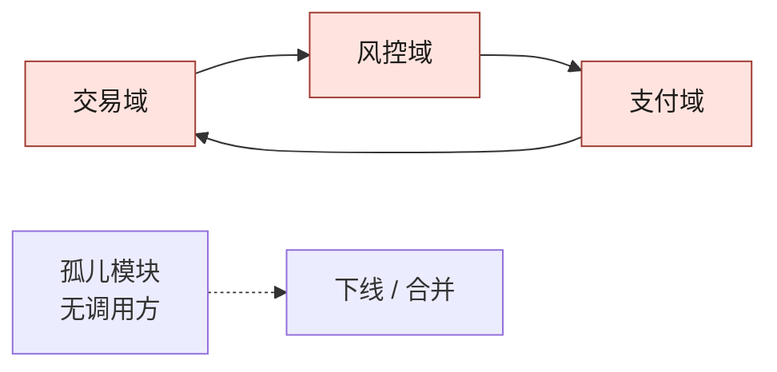
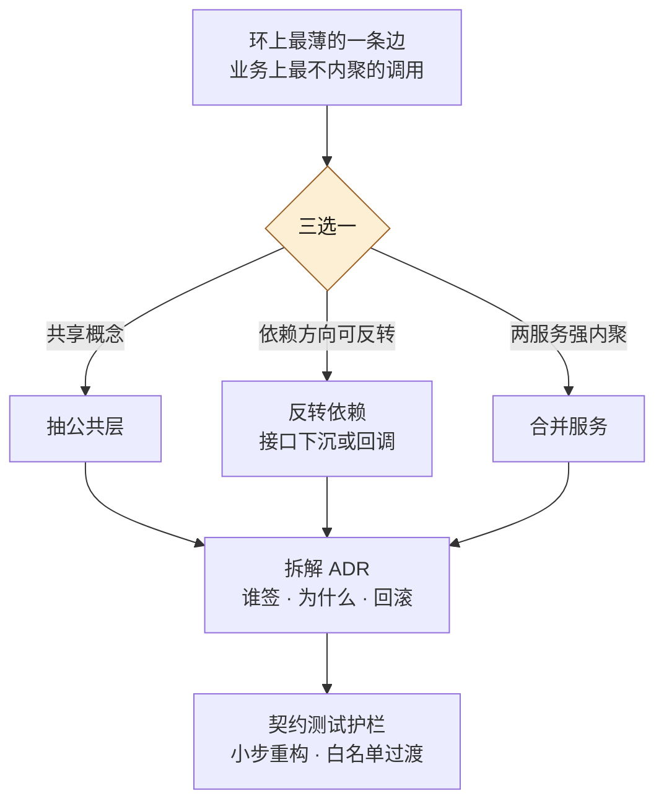
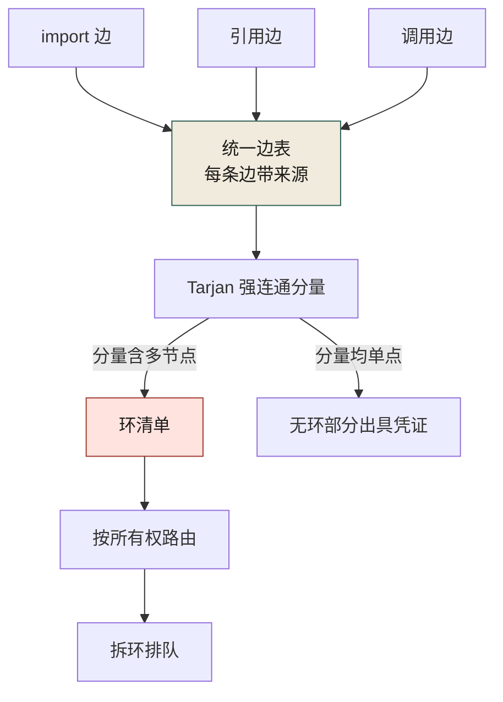
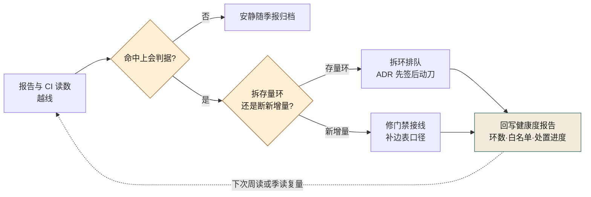

# 第 6 章 跨团队依赖分析：循环、反向、孤儿、WIRED / NOT WIRED

> **本章定位**：在第 5 章模块地图基础上深入依赖关系分析——发现并处理循环依赖、反向依赖、孤儿模块。
> **核心命题**：循环依赖是大组织里最隐蔽的炸弹——每个团队都在局部做了正确决定，全局却织出了一个死结。

图 6-1 左侧三个节点首尾相接织成一个环：交易域调风控域、风控域调支付域、支付域又调回交易域——任何一点超时都会三方互等；右侧的孤儿模块只有一条出边、没有任何入边——环要拆、孤儿要人裁定敢不敢删，正是本章的两件事。



**图 6-1｜循环依赖与孤儿** — 局部正确会织出全局死结；没有全局图就看不见互等。

---

## 6.1 问题：循环依赖像定时炸弹埋在依赖图里

在第 5 章画完模块图后，第二步是分析依赖。在某电商平台案例中（案例一），数百个微服务的调用关系跑出来一看，**有三个循环依赖**——A 调 B、B 调 C、C 又调回来。

其中一个循环横跨交易域、风控域、支付域。一位 SRE 看到这个环后立刻意识到危险："这个环要是任何一个点出了超时，三个域会互相等，一起卡死。" 他不是在假设——半年前确实出过一次类似的事故，排查了数小时才定位到"互相等"这个环。**那次事故的根因报告里，没人画出这个环——因为没人有全局依赖图。**

循环依赖为什么是最危险的？因为它是**唯一一种"局部完全正常、全局却会死锁"的结构**。每个服务单独看都没问题，但它们组成的环，会在高并发下把彼此拖死。**而且 AI 在重构任何一个服务时，都看不到这个环——它的上下文只有当前仓库。它改了一个节点的代码，完全不知道这个节点在一个环上。**

这个风险在其他案例中以不同形态出现：量化基金案例中，策略之间的隐式资金依赖（策略 A 的收益影响策略 B 的仓位决策，B 又反向影响 A 的信号）形成了逻辑上的"循环依赖"，最终导致策略组合在极端行情下互相放大亏损；安全初创案例中，七个智能体之间的隐式依赖（修复体的输出是检测体的输入基准）虽然不是经典意义上的循环依赖，但它们的"耦合环"造成了同样的连锁崩溃。

---

## 6.2 根因：跨仓库依赖从来没有人从全局看过

**① 依赖是自组织的，没有全局约束。** 每个团队在自己的需求驱动下，就近调用能解决问题的服务。每个调用在局部都合理，全局就出了环。

**② 跨仓库的静态分析没人做过。** 每个团队只分析自己仓库内部的依赖。跨仓库的调用关系，分散在大量仓库的代码里，没有工具把它们拼起来。

**③ AI 的静态分析默认是单仓库的。** AI 生成代码时，它不知道这个仓库外面还有什么。所以它甚至会**帮你新建一个跨域调用**，完全不知道这个调用让一个环更紧了。

---

## 6.3 AI 用法：AI 跑分析出候选，人做判断

依赖分析这件事，AI 和人的分工很清晰：**AI 负责跑大规模分析生成候选清单，人负责对每个候选做判断和决策。**

**AI 做的：**
- 从所有服务的调用日志 + 代码静态分析，拼出全平台依赖图
- 自动检出循环依赖、高频被依赖的节点（"热点"）、零入度模块（"孤儿"）

**AI 做不了、人做的：**
- **判断一个循环依赖怎么拆。** 是抽公共层？反转依赖？合并服务？这涉及业务理解。
- **判断一个"孤儿"能不能删。** 它可能不在调用图里，但被一个定时任务或手动触发。
- **判断一个热点服务该不该拆。** 拆它会动到几十个调用方，成本巨大。

在电商平台案例中，AI 检出了数十个孤儿模块并建议全部下线。**人审之后，只敢下线一部分**——另外几个，AI 没检测到它们的"隐藏调用方"（定时任务、手动触发的脚本、跨环境的调用）。**AI 的静态分析漏了这些，因为它们不在标准调用链里。**

---

## 6.4 四种依赖问题，四种处理

| 问题 | 危险度 | AI 能检测 | 人要决策 | 产出 |
|------|--------|----------|----------|------|
| 循环依赖 | 最高（死锁） | 能 | 拆解方案 | 环全部拆解 |
| 反向依赖（低层调高层） | 高（架构腐蚀） | 能 | 是否容忍或修正 | 白名单消化 |
| 孤儿模块（没人调） | 中（维护浪费） | 能，但漏报隐藏调用方 | 能不能删 | 部分下线 |
| NOT WIRED（部署了但没流量） | 低-中 | 需结合流量数据 | 敢不敢下线 | 部分下线 |

**"WIRED / NOT WIRED"是最有用的概念之一。** 它区分了"部署了"和"真正在跑"——有部署记录但流量数据为零的服务（NOT WIRED），它们占着机器资源却不产生价值。下线它们可以节省可观的服务器成本。

但低流量或零流量不等于无用——它们可能是低频但关键的服务（如季度对账任务）。**判断"敢不敢下线"必须人来做，AI 只能提供候选。**

---

## 6.5 产出物：跨团队依赖健康度报告

可落地的一份报告，每季度更新：

- 循环依赖：数量 + 拆解进度
- 反向依赖：白名单条目 + 消化率
- 孤儿模块：数量 + 下线进度
- NOT WIRED 服务：数量 + 下线进度
- 热点服务：被依赖次数 Top N + 是否需要拆分评估

> **代价声明**：第一次依赖分析报告出来后，循环依赖的拆解占用了相关团队大量人力天数。**拆环是紧急但无产出的事——它不新增任何功能，只是消除隐患。** 但一个横跨多个关键域的环如果不拆，下一次死锁可能就是一次灾难级事故。

---

## 6.5b 操作步骤：拆一个环

拆环没有公式，但有固定的决策顺序——先找"环上最薄的一条边"，再三选一，最后让契约测试护住重构。图 6-2 从入口往下读：三条出边各对应一种病因——有共享概念才抽公共层，方向可反转才下沉接口，两服务强内聚才考虑合并；无论走哪条，最终都汇进「拆解 ADR」再进契约测试护栏，先签字、后动刀：



**图 6-2｜拆环三选一** — 拆环拆的是「边」不是「服务」；先找最薄的那条边，三选一后用契约测试护住小步重构。

完整的步骤清单：

1. **把全局依赖图跑出来。** AI 拼图，人先复核口径：调用日志覆盖了定时任务、手动脚本、跨环境调用吗——6.3 的教训是漏报就藏在这里。
2. **给每个环标注三件事。** 横跨哪些域、环上调用频率、历史上是否出过"互相等"的事故。
3. **按危险度排序。** 先拆横跨资金 / 风控 / 交易这类关键域的环，其余排队。
4. **找环上"最薄的一条边"。** 业务上最不像内聚的那次调用——通常是某次赶需求时就近抄的近路。
5. **三选一：抽公共层、反转依赖、合并服务。** 选择理由写进拆解 ADR，不许口头定。
6. **ADR 签字。** 涉及域 TL + 架构治理；涉资金的环加风控会签。
7. **先补契约测试再动刀。** 把环上接口钉住——没有护栏的拆环等于裸拆，拆坏比不拆更糟。
8. **小步重构，白名单过渡。** 过渡期的临时违规进白名单，每条挂 ADR 并逐季度消化（第 8 章）。

这八步里最难的不是技术，是第 5 步背后的那个组织决定：**为了拆环，先不交付。** 拆环占用相关团队的研发容量，却不产生任何用户可见的功能——这正是本章结尾说的"不受欢迎的决定"。把它写成拆解 ADR 的意义之一，就是让这个决定将来被追问时有据可查：不是团队慢了，是组织选择先拆炸弹。

---

## 6.5c 可抄配置：把"新环"拦在 CI

拆旧环是一次的，防新环是每天的。域间互相 import 必然织出环，用独立性契约直接禁止：

```ini
# .importlinter —— 为什么用 independence 契约：环的源头是域间互相依赖，
# 分层契约管不住"平级互调"，独立性契约管得住
[importlinter]
root_package = platform

[importlinter:contract:domain-independence]
name = 域间禁止互相 import（环的源头）
type = independence
modules =
    platform.trade
    platform.risk
    platform.pay
```

```bash
# CI 里把违规当编译错误——为什么必须 fail 而不是 warn：
# 警告在进度压力下等于没有
lint-imports --config .importlinter
```

这条命令的成败判据只有一行：末尾的 `Contracts: N kept, M broken.`（源码里的 f-string 逐字如此，全过即 `Contracts: 1 kept, 0 broken.`），退出码 `0` / `1` 两个值。**「CI 绿了」不算判据——要看那行里的 `broken` 是不是 0**，因为契约名写错、配置文件没被读到这类事，同样能让流水线一声不响地过去。落地卡（版本口径、`root_package` 必须可导入、`exhaustive` 的漏点、以及"先让它红一次"的自证动作）在第 8 章的 import-linter 一节。

这份配置只覆盖 import 级别的环；运行时的环（HTTP 调用织成的环）它看不见，要靠依赖图的生成口径单独检——静态契约拦新代码，运行时数据拆旧账，两手都要有。

---

## 6.5d 度量指标：依赖健康度怎么看

| 指标 | 怎么测 | 阈值 | 谁看 | 多久看一次 |
|------|--------|------|------|-----------|
| 循环依赖数 | 全局依赖图自动检出 | 高风险环清零，其余持续下降 | 治理组 + 架构组 | 季度（CI 拦截上线后转周） |
| 新增环拦截数 | CI 独立性契约拒绝的 PR 数 | 稳定非零 | 治理组 | 周 |
| 反向依赖白名单长度 | import-linter 白名单条目数 | 只减不增 | 架构组 | 季度 |
| 孤儿与 NOT WIRED 处置进度 | 依赖健康度报告中已下线 / 已合并占比 | 持续推进 | 治理委员会 | 季度 |
| 隐藏调用方漏报复盘 | 人审否决 AI"可下线"判断的次数 | 出现即回补检测口径 | 治理组 | 季度 |

「新增环拦截数稳定非零」最反直觉——门禁在拒绝 PR，才证明门禁活着；和第 3 章的驳回率同理，长期为零的第一嫌疑人是门禁失效，不是团队变乖了。

---

## 6.5e 工具落地卡 · Tarjan 强连通分量：把环从边表里跑出来（本机实跑）

6.5 的报告模板里"循环依赖：数量 + 拆解进度"这一行，如果不是一条命令算出来的，季度报告就会退化成人眼找环。找环这件事有确定的算法解：**依赖图里的环，形式化定义就是"大小大于 1 的强连通分量"（SCC）**——分量里每个节点都能沿边到达其他每个节点，翻译成组织语言，就是 6.1 那次事故复盘里的"三方互等"。本卡给最小可抄实现并在本机跑通。

按 A 档口径交代现场：本机实跑，Python 3.14，纯标准库；输入是第 5 章样本的边表（`out2/edges.tsv` 的三个模块、三条静态边，以及人审把动态边 `store->api` 回补进去之后的四条边）。两个样本刻意一好一坏——**先让算法老实说"无环"，再让它把环报出来**，读者才能同时看见两种输出形状。

```python
#!/usr/bin/env python3
"""Tarjan 强连通分量：在依赖边表上把"环"找出来。
一个 SCC 里节点数 > 1 = 这组模块互相等着对方；拆环排队就以这份清单为准。
（教科书递归写法；生产上对上万节点要改迭代式避免爆栈。）"""
import sys
from collections import defaultdict

def tarjan(nodes, adj):
    index, low, onstack, stack, out = {}, {}, set(), [], []
    counter = [0]
    def sc(v):
        index[v] = low[v] = counter[0]; counter[0] += 1
        stack.append(v); onstack.add(v)
        for w in adj[v]:
            if w not in index:
                sc(w)
                low[v] = min(low[v], low[w])
            elif w in onstack:
                low[v] = min(low[v], index[w])
        if low[v] == index[v]:
            comp = []
            while True:
                w = stack.pop(); onstack.discard(w); comp.append(w)
                if w == v: break
            out.append(comp)
    for v in nodes:
        if v not in index:
            sc(v)
    return out

nodes, edges = set(), []
for line in open(sys.argv[1]):
    s, d = line.rstrip("\n").split("\t")
    edges.append((s, d)); nodes.update((s, d))
adj = defaultdict(list)
for s, d in edges:
    adj[s].append(d)
comps = [c for c in tarjan(sorted(nodes), adj) if len(c) > 1]
print(f"边表 {sys.argv[1]}：{len(nodes)} 个节点、{len(edges)} 条边")
if not comps:
    print("强连通分量（大小>1）：0 个 —— 此图无环。")
else:
    print(f"强连通分量（大小>1）：{len(comps)} 个 —— 每个分量都是一个环：")
    for i, c in enumerate(sorted(comps, key=lambda x: -len(x)), 1):
        inner = sorted({f"{s}->{d}" for s, d in edges if s in c and d in c})
        print(f"  环 {i}：{{{', '.join(sorted(c))}}}，环上边：{'；'.join(inner)}")
```

两个样本的真实输出（stdout 逐字）：

```text
==== 样本 A：只有静态 import 边 ====
边表 edges_a.tsv：3 个节点、3 条边
强连通分量（大小>1）：0 个 —— 此图无环。

==== 样本 B：人审把运行期动态边补进边表后 ====
边表 edges_b.tsv：3 个节点、4 条边
强连通分量（大小>1）：1 个 —— 每个分量都是一个环：
  环 1：{demoapp.api, demoapp.store}，环上边：demoapp.api->demoapp.store；demoapp.store->demoapp.api
```

三个读数，每个都对着一句组织含义：

1. **样本 A 确实无环，报告就该直说"0 个"。** 环检测的价值一半在报警、一半在出具"此处没有环"的可复核凭证——没有这份凭证，"我们域没有循环依赖"就只是一句口头承诺。
2. 只补一条边，图就从无环变成有环。环往往不是设计出来的，是**最后那条就近抄的近路**闭合的——这正是 6.5c 把防线放进展路径（拦"新环"）而不是存量路径的物理理由。
3. 报出来的分量 `{api, store}` 就是 6.5b 第 2 步要标注"横跨哪些域"的那组节点。**算法给的是节点集合与环上边，拆哪条边仍然是人的决定**（图 6-2 的三选一）——Tarjan 替代不了业务判断，它只是让"有没有环"从此不再依赖任何人的记忆。

生产化注意两条（B 档口径，未在本机万级节点上实测）：递归写法在大图上要改迭代式或加大栈深；算法复杂度线性（节点数加边数），几十万条边的全平台图跑不动的原因从来不是算法，是边表没拼齐——下一节。

> **档位声明（Tarjan 强连通分量）**：**A 档 · 本机实跑（Python 3.14、纯标准库），样本 A「无环」与样本 B「报出 1 个环」两份 stdout 读数都是这台机器实际输出**

---

## 6.5f 边的来源链：静态 import 边、SCIP/LSP 引用边、遥测调用边

上一节默认"边表是齐的"，而第 5 章的样本刚刚演示过 `ast` 会漏边。**依赖分析的天花板不在算法，在边的供给。** 全平台的边只有三个来源，各有各的漏法：

| 边类型 | 谁供 | 粒度 | 天然漏掉 | 证据档位 |
|--------|------|------|----------|---------|
| import 边 | `ast` / 各语言依赖扫描（第 5 章 5.5e） | 文件、模块级 | 动态加载、跨进程调用 | 本卡体系内 A 档（第 5 章实跑） |
| 引用边 | SCIP 索引（语言 indexer 产出、消费端通用）与 LSP findReferences（编辑器实时查询） | 符号级、精确到行列 | 靠字符串、配置、反射建立的关联 | B 档：本机未跑通 indexer 与语言服务器进程，行为以官方文档为准 |
| 调用边 | 运行期遥测（trace 的服务间调用边，实现在第 21 章） | 服务级 + 时间窗 | 采样缺口、低频冷路径 | 本机未实测 |

两条治理口径，比选哪个工具更重要：

**边表每条边必须带来源。** 静态边织出的环是"结构上会烂"，遥测边织出的环是"现在正在烂"——两者混在一张无标注的表里，健康度报告的分母就是一锅粥。落地形态很土：边表加一列 `source`，取值为 `ast / scip / telemetry` 之一，按来源分别出环。

**引用边是 AI 的解毒剂。** 6.2 说过 AI 的静态分析默认单仓库，它改一个节点时不知道节点在环上。解法不是让 AI"更小心"，是把 findReferences 这类**确定的边**作为工具输出注入它的上下文，把"猜调用方"这个动作整个从模型手里收走。上下文怎么拼、预算怎么给，在第 7 章展开（[第 7 章](./ch12-第7章-AI读懂祖传代码.md)）。

图 6-3 是本卡整条供给链的读法：左侧三种来源汇进统一边表（每条边带来源口径），Tarjan 出环，环上的节点集合再去和所有权度量对账（6.5g）：



**图 6-3｜边的来源链与环检测** — 环清单只是工作队列的入口：边不带来源，报告就没有分母；节点不带 Owner，清单就没有收件人。

---

## 6.5g 所有权度量：CODEOWNERS 的语法形状与 git log --numstat 聚合（git 部分本机实跑）

环清单回答"环在哪"，还要有一张表回答"拆环吃谁的容量、环是谁越界织出来的"。盘点表里的 owner 字段是自报的（第 5 章），**自报字段需要度量对账才立得住**。对账用两件东西：声明侧的 CODEOWNERS，行为侧的提交统计。

声明侧先给语法形状。B 档声明：以下是代码托管平台的通行约定（语法按其文档口径，本机没有可跑的评审服务，**不声称验证过任何平台行为，精确语义以你所在平台文档为准**）：

```text
# .github/CODEOWNERS —— 左列路径模式，右列负责人；最后匹配的规则生效
/pay/            @team-pay
/order/          @team-order
/pay/gateway.py  @team-pay @tl-pay-backup    # 细粒度规则写在后面，覆盖上面的粗规则
*                @governance-oncall          # 兜底：不存在没有 owner 的路径
```

注意 CODEOWNERS 管的是**变更审批的路由**，不是**所有权的事实**——它声明"该谁"，不记录"是谁"。行为侧就用 git 统计。本机实跑（git 2.53）：样本是自己造的五行提交小仓，三个身份——`zhang-order`（订单目录本主）、`li-pay`（支付目录本主）、`bot-ci`（生成物机器人），中间夹一次订单域替支付域热修的越界提交：

```text
$ git log --numstat --format='COMMIT %h %an %s'
COMMIT 9894e86 zhang-order order: add cancel

5	1	order/order_service.py
COMMIT 57fb130 bot-ci chore: regenerate openapi client (生成物)

40	0	pay/openapi_gen.py
COMMIT b067185 zhang-order pay: order-side hotfix (越界提交)

1	1	pay/gateway.py
COMMIT 9ef4da3 li-pay pay: gateway skeleton

2	0	pay/gateway.py
COMMIT 152edd7 zhang-order order: refund skeleton

2	0	order/order_check.py
2	0	order/order_service.py
2	0	order/test_order.py
```

聚合脚本（本机跑的就是这份，口径写在文件头）：

```python
#!/usr/bin/env python3
"""所有权度量：把 git log --numstat 聚合成 作者 × 顶层目录 的增删行数。
口径（必须写进报表页脚）：统计对象 = 提交作者（%an）的行级增删；
rename 未开 -M 时按整文件重写计；生成物与机器人按路径规则剔除后再看。"""
import re, subprocess, sys
from collections import defaultdict

log = subprocess.run(["git", "log", "--numstat", "--format=COMMIT\x1f%an"],
                     capture_output=True, text=True, check=True).stdout
rows = defaultdict(lambda: [0, 0])              # (作者, 目录) -> [增行, 删行]
author = None
for line in log.splitlines():
    if line.startswith("COMMIT\x1f"):
        author = line.split("\x1f", 1)[1]        # 提交头行：换作者
        continue
    m = re.match(r"^(\d+|-)\t(\d+|-)\t(.+)$", line)
    if not m or author is None:
        continue                                 # 二进制文件计 "-"，样本里没有
    add, dele, path = m.groups()
    top = path.split("/")[0] if "/" in path else "."
    r = rows[(author, top)]
    r[0] += int(add) if add != "-" else 0
    r[1] += int(dele) if dele != "-" else 0

expected = {("zhang-order", "order"), ("li-pay", "pay")}   # 声明归属（示意）
genbot = {("bot-ci", "pay")}                               # 生成物剔除规则（示意）
print(f"{'作者':<12}{'目录':<8}{'增行':>6}{'删行':>6}")
for (a, d), (i, r) in sorted(rows.items(), key=lambda kv: (-kv[1][0], kv[0])):
    if (a, d) in genbot and "--keep-bot" not in sys.argv:
        continue   # 默认剔除生成物；--keep-bot 给对照读数
    flag = "" if (a, d) in expected else "   ← 越界"
    print(f"{a:<12}{d:<8}{i:>6}{r:>6}{flag}")
```

真实输出，剔除与不剔除各跑一次做对照：

```text
$ python3 ownstat.py                       # 默认：剔除生成物
作者          目录          增行    删行
zhang-order order       11     1
li-pay      pay          2     0
zhang-order pay          1     1   ← 越界

$ python3 ownstat.py --keep-bot            # 对照：不剔除
作者          目录          增行    删行
bot-ci      pay         40     0   ← 越界
zhang-order order       11     1
li-pay      pay          2     0
zhang-order pay          1     1   ← 越界
```

读这张表之前，先把口径钉死——**口径不写出来的所有权度量，和没有口径的绩效数字一样危险**：

- 统计对象是**提交作者对每个顶层目录的行级增删**。样本里 `zhang-order pay 1 1 ← 越界` 就是那次替支付域热修：行为侧证据与声明侧（CODEOWNERS 里 `/pay/` 归 team-pay）对不上账，要么规则过期，要么有人在越界，两种都要浮出来。
- **squash 合并会让 `%an` 变成 squash 执行者**，真实作者整体丢失；rebase、cherry-pick 同理。度量只能看见仓库里留下的历史。
- rename 不开 `-M` 时按"整文件删除加重写"计，行数会虚胖一整个文件；对照第二遍读数，机器人 40 行生成物混进来时，`pay` 目录的行数分布会被彻底扭曲——**生成物与 bot 路径必须按规则剔除，且剔除规则本身要写进报表页脚**。
- 想看"某一行是谁写的"用 `git blame`，但 blame 记的是"最后触碰"，不是"负责"，两者经常被混用成同一个词。

最后是这条度量**不该用来做什么**：它不进绩效、不做人头排名。一旦行数和考核挂钩，它会立刻被拆提交、注水重命名博弈掉（指标博弈的完整形态在第 26 章，[第 26 章](./ch31-第26章-组织治理.md)）。它在本书里只有一个用途：和第 5 章盘点表的 owner 字段、6.5e 的环清单对账——**环上的节点集合 × 各节点的实际维护人，就是拆环排期的收件人名单**；跨三个团队的环，按 6.5b 第 6 步找三方 TL 签字；三个节点同属一个团队的，先问为什么这个团队自己没发现。

它替代不了什么：行数统计证明不了"谁懂这个模块"——对账链路上那个 Owner 已离职的清洗服务（第 7 章开篇），git 历史上最后一行触碰者恰恰是最不该签字的人。

> **档位声明（CODEOWNERS + git log --numstat）**：**A 档／B 档 · git log --numstat 聚合侧本机实跑（git 2.53，五行提交小仓的 numstat 原文与剔除/不剔除两份对照读数为实际输出）；CODEOWNERS 语法侧仅为代码托管平台的文档口径，本机没有可跑的评审服务、未验证过任何平台行为**

---

## 6.5h 生效证据清点：这些依赖机制各自挂着哪份产物

6.5 到 6.5g 把机制从找环一路造到所有权对账。但「写了」和「生效过」是两件事。本节把每条机制翻成证据面：它挂着什么产物、这份产物怎么读、它落在三态里的哪一态——**有产物**（实物在、读数可取）、**产物可造假**（实物在，但它可以在机制没干活的情况下照样绿）、**无产物**（说法还在、载体不在）。表内每一行的出处都指回本章小节，不新增任何读数。

| 机制（出处） | 生效证据（本章产物） | 三态 | 这条证据怎么读 | 没有产物时退回什么样子 |
|---|---|---|---|---|
| Tarjan 环检测（6.5e） | 两份本机实跑 stdout：样本 A「0 个——此图无环」、样本 B 报出 1 个环（三个节点、四条边的边表） | 有产物 | 读数 1 原话给了读法：环检测的价值一半在报警、一半在出具「此处没有环」的可复核凭证——报告若只贴环清单、不贴无环凭证，等于只跑了一半闸 | 6.5e 首句写死了退路：不是一条命令算出来的，季度报告就退化成人眼找环；6.1 那次根因报告里没人画出环，因为没人有全局图——这就是没人跑命令的现场 |
| CI 拦新环 · 独立性契约（6.5c） | `lint-imports` 末尾的汇总行 `Contracts: N kept, M broken.` 与退出码两个值 | 产物可造假 | 6.5c 把读法钉死在一行上：看 broken 是不是 0，不看「CI 绿了」——契约名写错、配置文件没被读到，都能让流水线一声不响地过去；「门禁要先证它会红」那条自证动作在[第 8 章](./ch13-第8章-目标架构.md)的 import-linter 落地卡 | 门禁退成摆设：新环照样进来，季度报告里「环数不降」的锅还得团队背——6.5d 第二行早预警过，长期为零的第一嫌疑人是门禁失效，不是团队变乖 |
| CODEOWNERS 声明归属（6.5g） | 文件本体：路径模式、负责人、兜底行（不存在没有 owner 的路径） | 有产物 | 读法照 6.5g 的原话：它管的是变更审批的路由，声明「该谁」、不记录「是谁」——审它只审两件事：兜底行在不在、细粒度规则有没有盖在粗规则后面。档位要说尽：文件本体与语法形状是本章逐字的事实，平台怎么执行它属 B 档、本机未验证 | 所有权退回自报——6.5g 开篇原话：[第 5 章](./ch10-第5章-大规模考古画图.md)盘点表的 owner 字段是自报的，自报字段需要度量对账才立得住 |
| git log --numstat 行为度量（6.5g） | 五行提交小仓的 numstat 原文，与剔除/不剔除生成物两份对照读数（git 2.53 本机实跑） | 产物可造假 | 三条口径丑话全是读法：squash 让 %an 变成执行者、rename 不开 -M 行数虚胖一个文件、机器人 40 行生成物混进来会彻底扭曲 pay 目录的行数分布——报表页脚没写这三条，这张表就不算数 | 越界无从分辨：`zhang-order pay 1 1` 那行越界是这套机制唯一的输出形状；口径一坏，误报的是生成物、漏报的是真越界，两种都会把对账机制本身废掉 |
| SCIP 索引与 LSP findReferences 引用边（6.5f） | 无运行件——6.5f 的边类型表自己标注：本机未跑通 indexer 与语言服务器进程 | 无产物 | 诚实的读法就是看档位列：符号级、精确到行列是文档口径，不是本书读数；不许从那张表里读出「本机可跑」 | 6.5f 那句「引用边是 AI 的解毒剂」（把确定的边注入上下文、把「猜调用方」从模型手里收走）悬空，上下文接线的落点在[第 7 章](./ch12-第7章-AI读懂祖传代码.md) |
| 运行期遥测调用边（6.5f） | 无运行件（本机未实测；信号实现见[第 21 章](./ch26-第21章-对账灰度回滚监控.md)） | 无产物 | 6.5c 末段说破了缺它的后果：静态契约看不见运行时 HTTP 调用织成的环——这只手不接上，运行时的旧账就拆不动 | 6.1 那个三方互等正是运行时形状的环；没有调用边，这类环只能等它下一次把三个域一起卡死才显形 |
| 边表来源纪律（6.5f 治理口径第一条） | 口径条款：每条边带 `source` 列、取 `ast / scip / telemetry` 之一，按来源分别出环 | 产物可造假 | 条款在纸上、还没挂运行件；读法照原文追问：报告里每个环出自哪类边——静态边织的环是「结构上会烂」，遥测边织的环是「现在正在烂」，两种读数不许混进一张表 | 健康度报告的分母就是一锅粥（原文话）：环数不再对应任何确定的修法，因为没人说得清那是哪类边上的环 |
| 拆解 ADR 与签字（6.5b 第 5、6 步） | 一份 ADR：谁签、三选一里为什么选这个、怎么回滚 | 有产物 | 时间戳先于内容：ADR 必须早于该环第一份改码 PR；涉资金的环，风控会签那一行必须有名字——它同时是 6.5b 末段那个「为了拆环，先不交付」的组织决定唯一落了件的形式 | 回到第 5 步原文「不许口头定」的反面：6.5 代价声明里那笔人力天数的账，将来被追问时没人答得出「是组织选择先拆炸弹」 |
| 契约测试护栏（6.5b 第 7 步） | 本章无产物——本节只写了「先补契约测试再动刀」这条纪律，可执行形态在[第 10 章](./ch15-第10章-边界变测试.md) | 无产物 | 只问一句：该环的改码 PR 开出来那天，护栏测试在场没有——第 7 步原话：没有护栏的拆环等于裸拆，拆坏比不拆更糟 | 拆环这件「紧急但无产出」的事（6.5 代价声明）再叠上一次拆坏，整支队伍从此拒绝给环排期——6.5j 信号 3 的修理成本全挂在这一行 |
| 白名单过渡（6.5b 第 8 步、6.5d 第三行） | import-linter 白名单条目数，每条挂一个 ADR | 产物可造假 | 两列要分开看：长度「只减不增」是度量表第三行阈值的原话，「每条挂 ADR 并逐季度消化」是第 8 步的原话——长度恒定而消化记录为零，白名单就庇护了违规而不是在过渡 | 6.4 表产出列写的「白名单消化」退化成「白名单存在」，反向依赖的「是否容忍」这个人的决定被白名单本身替做了 |
| 季度依赖健康度报告（6.5 产出物） | 报告本体：五行读数加各自的进度列，每季度更新 | 产物可造假 | 逐行对生产者：环数行由 6.5e 那条命令背书、白名单行由 6.5c 的配置背书、处置进度由下线 PR 背书——答不出生产者是谁的那一行，是空白支票 | 6.7 反模式第五条（做一次就不管，后果栏写的正是「旧图过期」）就挂在这份产物上：过期的不是图，是没人再跑命令这件事本身 |
| 人审否决记录 · 隐藏调用方（6.3、6.5d 第五行） | 「人审否决 AI 可下线判断」的次数，按季度记（度量表第五行的取数动作） | 产物可造假 | 这个数得有人记才存在；两个读数要并排看，姿势与第二行同理：否决恒为零而 AI 孤儿建议照单全收，第一嫌疑人不是模型变准，是复核停摆 | 6.3 的教训重演：数十个孤儿、人审才敢下线一部分——隐藏调用方这个发现若没人记录，就没有下一轮回补，下一种隐藏调用方要等下一次误删才被发现 |
| 热点服务 Top N（6.5 产出物第五行） | 被依赖次数 Top N 清单，加「是否需要拆分评估」一栏 | 有产物（清单侧）／无产物（评估侧） | 清单是机器读数，评估是人的签字：Top N 那列有命令背书，评估列若长期空挂「评估中」，等于这一行不存在 | 6.3「AI 做不了、人做的」那三件里的第三件，点名的正是这格最贵的判断：拆热点会动到几十个调用方——没人签字，等于这个判断被永久搁置，热点继续被依赖 |

十三行证据各有各的消费者与翻出来那天：CI 日志（第二行）在 PR 合并当时被门禁执行人翻；报告（第十一行）在季度报告日被治理委员会翻开——6.5d 第四行的「谁看」列已指名这张桌子；ADR（第八行）最残酷的翻阅场景是事故复盘——6.1 那次没人画出环，就是因为这张表还不存在；两张所有权表（第三、四行）在拆环排期那天被翻——6.5g 末段给过用途：环上节点集合乘各节点实际维护人，就是收件人名单；否决记录（第十二行）由治理组在每季度回补口径的会上读。没有指名消费者、没有翻出来日期的证据，不该进这张表——进了也只会躺在里面过一年。

三态分布本身也要读一遍：十三行里，有产物四行（Tarjan 两份实跑输出、CODEOWNERS 文件、拆解 ADR、Top N 清单），产物可造假六行，无产物三行——引用边、调用边、契约测试护栏，全在 6.5b 与 6.5f 新立的机制上：先立了纪律、后补工件。这个分布不是坏消息，它是下一批工件的物料清单。

---

## 6.5i 决策点表：哪条读数越线触发哪次上会、谁拍、多久复核

6.5d 的度量表管「谁盯哪一行、多久盯一次」；这一节管自动动作之上必须有人拍板的半段。每行 = 读数（出处）→ 上会判据（什么形状算越线，只写形状不写手感）→ 触发后的动作 → 签署方 → 时限锚。签署方全部沿用本章已出场的角色，不新增人物、不新增读数：各域 TL、架构治理、风控（6.5b 第 6 步的三方签字人），治理组、架构组、治理委员会（6.5d「谁看」列的这三个名字），SRE（6.1 里看到环就认出互等的那位），相关团队（6.5 代价声明里被占容量的那批人）。

| 读数（出处） | 上会判据（什么形状算越线） | 触发后的动作 | 签署方 | 时限锚 |
|---|---|---|---|---|
| 循环依赖数与拆解进度（6.5d 第一行；6.1 的三个环；6.5e 环清单） | 高风险环未清零（阈值原话：高风险环清零、其余持续下降），而拆解进度列不动——形状是「队列有序、收件人无人」 | 环从报告里拎出来上会：把「先不交付」的容量决定重签一次，再按 6.5b 第 3 步重排（资金、风控、交易这类关键域的环先拆） | 治理委员会召集，各域 TL 签拆解 ADR，架构治理会签；涉资金加风控 | 季度报告日（6.5d 第一行：CI 拦截上线后转周） |
| 新增环拦截数（6.5d 第二行；6.5c 汇总行） | 拦截数恒为零而跨域 import 仍在合并——6.5d 原话：长期为零的第一嫌疑人是门禁失效；另一形状：broken 从不为 1、也从未红过 | 先验门活没活：一次性分支里故意写一条违规 import，亲眼看它红（自证动作在第 8 章落地卡）；门活着，就问跨域调用为什么还放行；门死了，修接线、计数从修好那天重新起算 | 治理组执行并报备数，架构组验收接线 | 周（6.5d 第二行） |
| 反向依赖白名单长度（6.5d 第三行；6.5b 第 8 步） | 两种形状：出现一次没走签字流程的增长；或长度恒定而消化记录长期为零——只进不出 | 增长退回 6.5b 第 6 步补签；无消化记录的条目升级进环清单排队拆解，不许改名「例外」继续躺着 | 架构组（6.5d 这一行的看的人），被豁免域的域 TL 会签 | 季度（6.5d 第三行；6.5b 第 8 步同一锚） |
| 人审否决次数（6.5d 第五行；6.3 数十个孤儿只敢下线一部分） | 两个极端都算越线：否决一直有，检测口径一毫米没动——人审成了工具的永久兜底；或否决恒为零，而隐藏调用方还在不断被发现——复核在睡着 | 前者：每条否决回补一类边（定时任务、手动脚本、跨环境调用——6.5b 第 1 步点名的三类）；后者：抽查当季孤儿判定，逐个问裁定人依据是什么 | 治理组（6.5d 第五行阈值原话：出现即回补检测口径） | 季度（6.5d 第五行） |
| 孤儿与 NOT WIRED 处置进度（6.5d 第四行；6.4 的 WIRED 概念） | 处置占比长期为零（不敢删），或一期冲满（瞎删）——6.6 第四条点名的这两种；低频但关键的服务（6.4 举的季度对账任务）没有保留清单 | 下线提案逐条要认领团队签「敢下线」；保留的写明理由与生产者；没判定过的服务不进下一轮提案清单 | 治理委员会裁，相关团队 TL 签下线风险 | 季度（6.5d 第四行） |
| 越界提交行数（6.5g 的 `zhang-order pay 1 1` 越界那行） | 同一作者与同一目录的越界行不减反增；或越界落在环上节点的目录里——这是环最早的行为侧读数 | 先问口径（squash 吞了真作者？生成物没剔除？6.5g 三条口径的前两条），排除口径后与 CODEOWNERS 对账：规则过期或越界施工，两种都要浮出来；无 ADR 的越界按反向违规走白名单流程 | 两域 TL 当面对账，治理组记这笔账；进不进白名单由架构组定 | 季度（与健康度报告同表） |
| 边表来源覆盖度（6.5f 治理口径第一条；6.5e「边表没拼齐」） | 三类来源的环混在一个分母里出报告；或调用边一条都没有、报告却宣称「环清零」——后者不是测量结果，是载体缺失 | 召回报告、按来源分别出环；缺哪类边写进报告抬头（漏掉的边类照 6.5f 表「天然漏掉」列点名），分母不全结论不生效 | 治理组召回，架构组验收分母口径 | 每次季度出报之前（6.5 的更新节奏） |
| 拆解 ADR 与执行的错位（6.5b 第 6、7 步；6.5g 那句 blame 记的是最后触碰、不是负责） | ADR 签齐而该环长期没有改码 PR——签字成了文书；改码 PR 的时间戳早于 ADR——先上车后补票 | 前者：环退回下一轮队列头部，同时记知识流失这笔账（6.8 第三条点过 Owner 不在、代码还在的那种风险）；后者：ADR 作废，退回第 6 步重签 | 各域 TL 说明停摆原因，架构治理记账；涉资金由风控重会签 | 每次季度报告核对（6.5 第一行：数量加拆解进度） |

五列咬合，缺哪一列就复发本章写过的哪条病：**缺上会判据**，6.3 那三件「AI 做不了、人做的」判断（环怎么拆、孤儿能不能删、热点该不该拆）退回临场手感——6.7 第二条「AI 检测结果不经人审就执行」的复发方式，正是在 NOT WIRED 服务上凭手感按下线键，那张表已经写好缺这一列的代价：误删被隐藏调用方依赖的孤儿。**缺触发后的动作**，6.5d 五行读数退化成一墙仪表，「出现即回补检测口径」响了也白响——反模式第三条「知道有炸弹但不管」的稳态形式就是：发现、上报、无人动手。**缺签署方**，6.5b 第 5 步「不许口头定」成空话，6.5g 末段那张收件人名单（环上节点集合乘实际维护人）没有名字，跨三个团队的环永远约不到同一张桌子。**缺时限锚**，直接复发反模式第五条「旧图过期」——6.8 第二条已经承认季度本身就慢；没有这一列，连季度都守不住，因为没人记得哪天该再看。**缺出处**，`Contracts: 1 kept, 0 broken.` 就脱离了契约文件这个分母，那个 0 失去意义——6.5c 演示过：契约名写错的「静默通过」和全量通过的「真绿」，裸眼看一模一样。

这张表排成的链画在图 6-4：哪条读数越线、命中哪道判据、岔口在哪、动作最终回写报告的哪一行。



**图 6-4｜跨团队依赖决策链** — 岔口只认「存量还是增量」这一个形状：拆存量要签字与容量，断增量只动接线与口径；回边让今天写回的进度，成为下个季度被复量的对象。

读图 6-4 盯三处。第一个菱形之前的「否」支什么都不拦——没命中判据就安静归档，整张表不至于一有读数就炸会，全靠这一支；6.5b 那八步只发生在真排上队的环上。第二个菱形是全图唯一先分形状再选动作的岔口：存量环走签字与容量那条路（6.5 代价声明早说过这一仗难打），新增量走接线与口径那条路（纯技术动作，不上会）。把两支混掉是最常见的逃逸方式——用「我们在拆旧环」的名义放新环进来，或用「门禁已修好」的名义不再拆旧环。底部虚线回边不产生新动作——本季度写回的进度，下季度的读数还要再量一遍；6.7 第五条反模式就是这条回边断掉的形状：图停更了，所有读数都躺在一张过期的图上说话。

---

## 6.5j 腐烂判据：这套机制自己烂掉之前，先出现的是什么形状

机制造齐了、证据清点了、判据上会了，最后一问最不留情：这整套会不会烂。跨团队依赖分析的失败形态从来不是「没建过」，是「门禁还挂着、报告照发、字照签，而没有一样还在为环服务」。六条信号，每条点名它依赖的本章产物；证据面全部取自本章前文，不新增读数。

1. **门禁层的信号——拦下数长期为零，且从没有红过的记录。** 依赖 6.5c 的汇总行与退出码。分辨法只有一条：故意投一条违规 import，看 broken 变不变 1。从没红过、而报告环数也恰好为零时，两个零互相揭发——6.2 说依赖是自组织的，跨域近路一直在被织出来（AI 甚至会帮你新建），「恒为零」比「团队突然自律」可信度低得多。
2. **边层的信号——环数几季不变，而边表行数也停止增长。** 依赖 6.5e 那句「跑不动的原因从来不是算法，是边表没拼齐」与 6.5f 的来源列。环数不变有两种读法：拆完了，或边断了。分辨靠边的增量：静态边的增量能 diff，调用边的增量看时间窗记录。边不涨而环报「干净」，干净的是分母，不是系统。
3. **签字层的信号——ADR 签得齐，环上却长期没有改码 PR。** 依赖 6.5b 第 6 步的产物与 6.5g 那句 blame 记的是「最后触碰」不是「负责」（签了字的人可能恰恰最不懂这个模块）。腐烂的形式是签字动作自循环：队列很长、进度不动、每份 ADR 都很完整——反模式第三条「知道有炸弹但不管」的安静版本。
4. **白名单层的信号——长度恒定、消化记录为零。** 依赖 6.5d 第三行与 6.5b 第 8 步。白名单从不报红，它只是慢慢把 6.4 表产出列那四个字「白名单消化」变成「白名单存在」。再加一个形状：新的反向依赖开始出现在白名单里而不是违规清单里——还没被审的东西被提前免审，这一格烂得最快。
5. **复核层的信号——否决次数恒为零，而隐藏调用方仍在人审层被发现。** 依赖 6.5d 第五行与 6.3 的教训。AI 漏隐藏调用方是工具盲区（它们不在标准调用链里），人审漏是治理盲区；「出现即回补检测口径」这条阈值要靠否决记录才有入口，记录为零，提案清单就永远停在「数十个孤儿、只敢下线一部分」的原地。
6. **报告层的信号——五行读数按时交付，措辞与上季度一字不差。** 依赖 6.5 产出物与 6.5e 到 6.5g 的三份可复跑命令。单个进度列停摆是常态（团队要排容量），整表一字不差则几乎必然是没人跑命令——三张卡各留了一份能复跑的口径，就是给这条信号准备的分辨法：复跑一遍，差值立现。

### 反事实的形状：把本章点过名的失效现场放回判据桌

| 信号（当时的形状，出处） | 若按信号行动，省下什么 | 若不按，复发什么 |
|---|---|---|
| 信号 2 · 三个环藏在数百个微服务的调用关系里（6.1） | 图跑出来当天环清单就有了——环从来不是新发现，缺的只是有人去跑那条命令；半年前那次互等排查数小时的事故，会变成清单上的一行被排进拆解 | 反模式 1 的原话：循环依赖一直藏到死锁——「藏」就是它的字面代价 |
| 信号 5 · 数十个孤儿只敢下线一部分（6.3） | 每次隐藏调用方的发现都回进口径，提案清单逐季收敛；人审的开销花在训练检测器上，而不是永远兜底 | 反模式 2 与反模式 4——不经人审就执行、或全部下线，两条都是这一层没有记录时走出来的极端 |
| 信号 1 · 6.5c 点名「契约名写错、配置文件没被读到」 | 接错的门在周读数当天现形，而不是季度末——中间差的是一整个季度的新环 | broken 行被「CI 绿了」顶替；新旧环混进同一分母，6.5b 第 3 步「关键域的环先拆」直接失执行依据 |
| 信号 1 · 样本 B：补一条就近抄的近路，图从无环变有环（6.5e 读数 2） | 新边在进路径当周就被拦，环压根长不出来——6.5c 把防线放进展路径的物理理由兑现成读数 | 反模式 5：做一次就不管——图没骗人，是新的那条边在一个没人拦住的 PR 里织进来的 |
| 信号 2、信号 4 · 案例二撮合与资金清算的三角隐式环（四案例映射表） | 调用边进表的那天，这一行就从映射表挪进拆解队列；隐式的东西被白名单式地摊出来数 | 隐式环以连锁崩溃的形式显形——案例三那种极端行情下策略互相放大亏损（6.1 的交叉段），就是同类形状没判据的现场 |

六条信号互相校验，不各自成立：信号 1 与信号 2 共享那对「零」（拦下数为零、环数为零），单看任何一个都容得下「一切正常」的解释，并排看就只剩一种：边的供给断了，或者门的接线断了；信号 3 守的是「先不交付」那个容量决定——它一烂，6.5 代价声明那笔人力天数的账就会被读成「团队慢」，6.5b 末段明写 ADR 存在的意义就是防这种误读；信号 4 与信号 5 分别管存量侧与增量侧的人审，缺任何一个，季度报告就少半行有效读数；信号 6 是前五条的载体——没人跑命令时，其余五条信号本身都不会动。

最后记一笔诚实账。六条信号里，此刻就有分母的是两条半：信号 1 有 6.5c 的汇总行与第 8 章落地卡「门禁要先证它会红」那条自证动作；信号 6 的复跑分辨法（6.5e 到 6.5g 的三份命令）当场可用；信号 4 的白名单长度从配置 diff 就能起数。另外三条半要等：信号 2 要等边表攒出至少两个季度的增量——三类边里引用边与调用边都是 B 档或未实测，「断供」这个读数得先有「供」；信号 3 要等第一批 ADR 真的签起来、且熬过一个拆解周期；信号 5 要等 6.5d 第五行从度量定义变成度量记录——否决次数今天还没有第一次读数。这三条半在拿到读数之前，只能当季度会上的问题清单用，不能当报红灯的判据用——把「只有形状」写成「已有读数」，正是 6.5h 指控「产物可造假」那一族的反向形态：判据自己先造假。本节按 6.5h 那把尺自量：有产物，产物就是本节这六段文字，而它能被造假的方式与它指控的一模一样——抄进规范、会上念得很响、没人去跑命令。6.8 第二条已写好这一节的毕业条件：季度报告太慢，依赖变化是持续的；等 6.5d 第一行括号里那句「CI 拦截上线后转周」真的上线，这六条信号才算拿到第一份周度读数，届时该重写的是本节，不是那六条形状。

---

## 四案例映射

| 案例 | 依赖分析发现的最危险结构 | AI 静态分析的典型漏报 | 拆解策略 |
|------|------------------------|---------------------|---------|
| 案例一·电商平台 | 跨交易/风控/支付的循环依赖 | 定时任务和手动脚本的隐藏调用 | 抽公共层 + 反转依赖 |
| 案例二·加密交易所 | 撮合↔资金↔清算的三角隐式环 | 跨事业部调用链 | 分层解耦 + 异步对账 |
| 案例三·Web3 量化 | 策略间隐式资金依赖（逻辑环） | 链上合约间的跨合约调用 | 策略隔离 + 独立仓位管理 |
| 案例四·安全初创 | 智能体间隐式基准依赖（耦合环） | Agent-to-Agent 的非标准交互 | Agent 间契约显式化 |

---

## 6.6 检查清单

- [ ] 你有没有一张全平台的依赖图？没有 = 循环依赖藏在里面你不知道。
- [ ] 你有没有定期跑循环依赖检测？没有 = 等死锁了才发现。
- [ ] AI 的静态分析，你有没有人工复核它的结果？没有 = AI 的漏报会被你当成"没有问题"。
- [ ] 你的孤儿模块，有没有一个敢不敢删的判断流程？没有 = 要么不敢删（浪费），要么瞎删（炸了）。
- [ ] 你区分 WIRED 和 NOT WIRED 了吗？不区分 = 你在为不跑的服务买单。

---

## 6.7 反模式

| # | 反模式 | 后果 |
|---|--------|------|
| 1 | 从不做跨仓库依赖分析 | 循环依赖一直藏到死锁 |
| 2 | AI 检测结果不经人审就执行 | 误删被隐藏调用方依赖的孤儿 |
| 3 | 发现循环依赖但不拆 | 知道有炸弹但不管 |
| 4 | NOT WIRED 全部下线 | 误删低频但关键的服务 |
| 5 | 依赖分析做一次就不管 | 新依赖不断产生，旧图过期 |

---

## 6.8 遗留问题

- **拆循环依赖有没有自动化方案？** 目前是人脑分析 + 手动重构。AI 辅助在简单环上可行，但在跨多域的复杂环上不够靠谱。留给第 24 章。
- **依赖健康度怎么持续监控？** 季度报告太慢，依赖变化是持续的。理想状态是新 PR 如果引入循环依赖，CI 就拦住。这件事在第 10 章的不变量测试里部分实现了。
- **那些 Owner 不在了的仓库，知识怎么留？** 孤儿模块的代码还在，但没人知道它在干什么。这是第 7 章的主题。

---

> **本章的一句话**：循环依赖是大组织里最隐蔽的炸弹——**每个团队都在局部做了正确的决定，全局却织出了一个死结。** AI 让代码生成更快了，也意味着这个结会织得更快。唯一能解开它的，是有人站在全局看一次依赖图——然后做那个"为了拆环，先不交付"的不受欢迎的决定。
