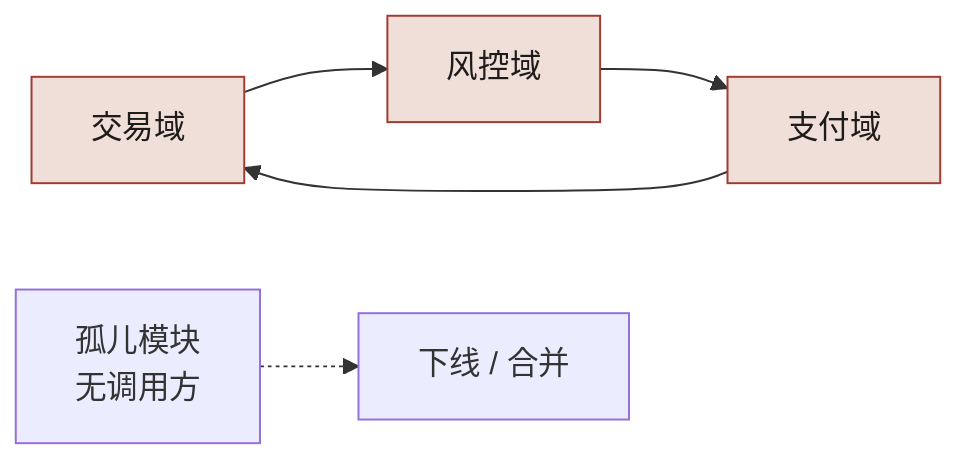
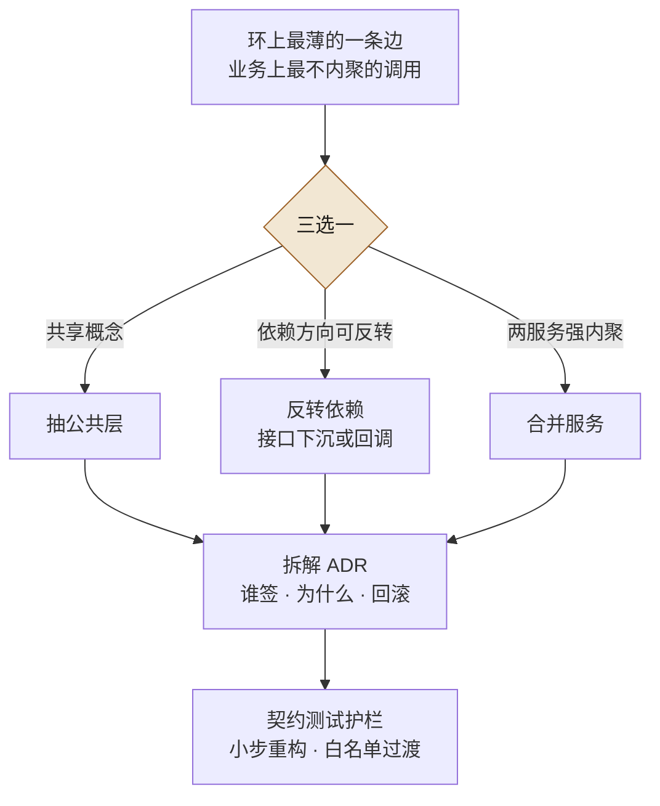

# 第 6 章 跨团队依赖分析：循环、反向、孤儿、WIRED / NOT WIRED

> **本章定位**：在第 5 章模块地图基础上深入依赖关系分析——发现并处理循环依赖、反向依赖、孤儿模块。
> **核心命题**：循环依赖是大组织里最隐蔽的炸弹——每个团队都在局部做了正确决定，全局却织出了一个死结。

图 6-1 左侧三个节点首尾相接织成一个环：交易域调风控域、风控域调支付域、支付域又调回交易域——任何一点超时都会三方互等；右侧的孤儿模块只有一条出边、没有任何入边——环要拆、孤儿要人裁定敢不敢删，正是本章的两件事。



**图 6-1｜循环依赖与孤儿** — 局部正确会织出全局死结；没有全局图就看不见互等。

---

## 6.1 问题：循环依赖像定时炸弹埋在依赖图里

在第 5 章画完模块图后，第二步是分析依赖。在某电商平台案例中（案例一），数百个微服务的调用关系跑出来一看，**有三个循环依赖**——A 调 B、B 调 C、C 又调回来。

其中一个循环横跨交易域、风控域、支付域。一位 SRE 看到这个环后立刻意识到危险："这个环要是任何一个点出了超时，三个域会互相等，一起卡死。" 他不是在假设——半年前确实出过一次类似的事故，排查了数小时才定位到"互相等"这个环。**那次事故的根因报告里，没人画出这个环——因为没人有全局依赖图。**

循环依赖为什么是最危险的？因为它是**唯一一种"局部完全正常、全局却会死锁"的结构**。每个服务单独看都没问题，但它们组成的环，会在高并发下把彼此拖死。**而且 AI 在重构任何一个服务时，都看不到这个环——它的上下文只有当前仓库。它改了一个节点的代码，完全不知道这个节点在一个环上。**

这个风险在其他案例中以不同形态出现：量化基金案例中，策略之间的隐式资金依赖（策略 A 的收益影响策略 B 的仓位决策，B 又反向影响 A 的信号）形成了逻辑上的"循环依赖"，最终导致策略组合在极端行情下互相放大亏损；安全初创案例中，七个智能体之间的隐式依赖（修复体的输出是检测体的输入基准）虽然不是经典意义上的循环依赖，但它们的"耦合环"造成了同样的连锁崩溃。

---

## 6.2 根因：跨仓库依赖从来没有人从全局看过

**① 依赖是自组织的，没有全局约束。** 每个团队在自己的需求驱动下，就近调用能解决问题的服务。每个调用在局部都合理，全局就出了环。

**② 跨仓库的静态分析没人做过。** 每个团队只分析自己仓库内部的依赖。跨仓库的调用关系，分散在大量仓库的代码里，没有工具把它们拼起来。

**③ AI 的静态分析默认是单仓库的。** AI 生成代码时，它不知道这个仓库外面还有什么。所以它甚至会**帮你新建一个跨域调用**，完全不知道这个调用让一个环更紧了。

---

## 6.3 AI 用法：AI 跑分析出候选，人做判断

依赖分析这件事，AI 和人的分工很清晰：**AI 负责跑大规模分析生成候选清单，人负责对每个候选做判断和决策。**

**AI 做的：**
- 从所有服务的调用日志 + 代码静态分析，拼出全平台依赖图
- 自动检出循环依赖、高频被依赖的节点（"热点"）、零入度模块（"孤儿"）

**AI 做不了、人做的：**
- **判断一个循环依赖怎么拆。** 是抽公共层？反转依赖？合并服务？这涉及业务理解。
- **判断一个"孤儿"能不能删。** 它可能不在调用图里，但被一个定时任务或手动触发。
- **判断一个热点服务该不该拆。** 拆它会动到几十个调用方，成本巨大。

在电商平台案例中，AI 检出了数十个孤儿模块并建议全部下线。**人审之后，只敢下线一部分**——另外几个，AI 没检测到它们的"隐藏调用方"（定时任务、手动触发的脚本、跨环境的调用）。**AI 的静态分析漏了这些，因为它们不在标准调用链里。**

---

## 6.4 四种依赖问题，四种处理

| 问题 | 危险度 | AI 能检测 | 人要决策 | 产出 |
|------|--------|----------|----------|------|
| 循环依赖 | 最高（死锁） | 能 | 拆解方案 | 环全部拆解 |
| 反向依赖（低层调高层） | 高（架构腐蚀） | 能 | 是否容忍或修正 | 白名单消化 |
| 孤儿模块（没人调） | 中（维护浪费） | 能，但漏报隐藏调用方 | 能不能删 | 部分下线 |
| NOT WIRED（部署了但没流量） | 低-中 | 需结合流量数据 | 敢不敢下线 | 部分下线 |

**"WIRED / NOT WIRED"是最有用的概念之一。** 它区分了"部署了"和"真正在跑"——有部署记录但流量数据为零的服务（NOT WIRED），它们占着机器资源却不产生价值。下线它们可以节省可观的服务器成本。

但低流量或零流量不等于无用——它们可能是低频但关键的服务（如季度对账任务）。**判断"敢不敢下线"必须人来做，AI 只能提供候选。**

---

## 6.5 产出物：跨团队依赖健康度报告

可落地的一份报告，每季度更新：

- 循环依赖：数量 + 拆解进度
- 反向依赖：白名单条目 + 消化率
- 孤儿模块：数量 + 下线进度
- NOT WIRED 服务：数量 + 下线进度
- 热点服务：被依赖次数 Top N + 是否需要拆分评估

> **代价声明**：第一次依赖分析报告出来后，循环依赖的拆解占用了相关团队大量人力天数。**拆环是紧急但无产出的事——它不新增任何功能，只是消除隐患。** 但一个横跨多个关键域的环如果不拆，下一次死锁可能就是一次灾难级事故。

---

## 6.5b 操作步骤：拆一个环

拆环没有公式，但有固定的决策顺序——先找"环上最薄的一条边"，再三选一，最后让契约测试护住重构。图 6-2 从入口往下读：三条出边各对应一种病因——有共享概念才抽公共层，方向可反转才下沉接口，两服务强内聚才考虑合并；无论走哪条，最终都汇进「拆解 ADR」再进契约测试护栏，先签字、后动刀：



**图 6-2｜拆环三选一** — 拆环拆的是「边」不是「服务」；先找最薄的那条边，三选一后用契约测试护住小步重构。

完整的步骤清单：

1. **把全局依赖图跑出来。** AI 拼图，人先复核口径：调用日志覆盖了定时任务、手动脚本、跨环境调用吗——6.3 的教训是漏报就藏在这里。
2. **给每个环标注三件事。** 横跨哪些域、环上调用频率、历史上是否出过"互相等"的事故。
3. **按危险度排序。** 先拆横跨资金 / 风控 / 交易这类关键域的环，其余排队。
4. **找环上"最薄的一条边"。** 业务上最不像内聚的那次调用——通常是某次赶需求时就近抄的近路。
5. **三选一：抽公共层、反转依赖、合并服务。** 选择理由写进拆解 ADR，不许口头定。
6. **ADR 签字。** 涉及域 TL + 架构治理；涉资金的环加风控会签。
7. **先补契约测试再动刀。** 把环上接口钉住——没有护栏的拆环等于裸拆，拆坏比不拆更糟。
8. **小步重构，白名单过渡。** 过渡期的临时违规进白名单，每条挂 ADR 并逐季度消化（第 8 章）。

这八步里最难的不是技术，是第 5 步背后的那个组织决定：**为了拆环，先不交付。** 拆环占用相关团队的研发容量，却不产生任何用户可见的功能——这正是本章结尾说的"不受欢迎的决定"。把它写成拆解 ADR 的意义之一，就是让这个决定将来被追问时有据可查：不是团队慢了，是组织选择先拆炸弹。

---

## 6.5c 可抄配置：把"新环"拦在 CI

拆旧环是一次的，防新环是每天的。域间互相 import 必然织出环，用独立性契约直接禁止：

```ini
# .importlinter —— 为什么用 independence 契约：环的源头是域间互相依赖，
# 分层契约管不住"平级互调"，独立性契约管得住
[importlinter]
root_package = platform

[importlinter:contract:domain-independence]
name = 域间禁止互相 import（环的源头）
type = independence
modules =
    platform.trade
    platform.risk
    platform.pay
```

```bash
# CI 里把违规当编译错误——为什么必须 fail 而不是 warn：
# 警告在进度压力下等于没有
lint-imports --config .importlinter
```

这条命令的成败判据只有一行：末尾的 `Contracts: N kept, M broken.`（源码里的 f-string 逐字如此，全过即 `Contracts: 1 kept, 0 broken.`），退出码 `0` / `1` 两个值。**「CI 绿了」不算判据——要看那行里的 `broken` 是不是 0**，因为契约名写错、配置文件没被读到这类事，同样能让流水线一声不响地过去。落地卡（版本口径、`root_package` 必须可导入、`exhaustive` 的漏点、以及"先让它红一次"的自证动作）在第 8 章的 import-linter 一节。

这份配置只覆盖 import 级别的环；运行时的环（HTTP 调用织成的环）它看不见，要靠依赖图的生成口径单独检——静态契约拦新代码，运行时数据拆旧账，两手都要有。

---

## 6.5d 度量指标：依赖健康度怎么看

| 指标 | 怎么测 | 阈值 | 谁看 | 多久看一次 |
|------|--------|------|------|-----------|
| 循环依赖数 | 全局依赖图自动检出 | 高风险环清零，其余持续下降 | 治理组 + 架构组 | 季度（CI 拦截上线后转周） |
| 新增环拦截数 | CI 独立性契约拒绝的 PR 数 | 稳定非零 | 治理组 | 周 |
| 反向依赖白名单长度 | import-linter 白名单条目数 | 只减不增 | 架构组 | 季度 |
| 孤儿与 NOT WIRED 处置进度 | 依赖健康度报告中已下线 / 已合并占比 | 持续推进 | 治理委员会 | 季度 |
| 隐藏调用方漏报复盘 | 人审否决 AI"可下线"判断的次数 | 出现即回补检测口径 | 治理组 | 季度 |

「新增环拦截数稳定非零」最反直觉——门禁在拒绝 PR，才证明门禁活着；和第 3 章的驳回率同理，长期为零的第一嫌疑人是门禁失效，不是团队变乖了。

---

## 四案例映射

| 案例 | 依赖分析发现的最危险结构 | AI 静态分析的典型漏报 | 拆解策略 |
|------|------------------------|---------------------|---------|
| 案例一·电商平台 | 跨交易/风控/支付的循环依赖 | 定时任务和手动脚本的隐藏调用 | 抽公共层 + 反转依赖 |
| 案例二·加密交易所 | 撮合↔资金↔清算的三角隐式环 | 跨事业部调用链 | 分层解耦 + 异步对账 |
| 案例三·Web3 量化 | 策略间隐式资金依赖（逻辑环） | 链上合约间的跨合约调用 | 策略隔离 + 独立仓位管理 |
| 案例四·安全初创 | 智能体间隐式基准依赖（耦合环） | Agent-to-Agent 的非标准交互 | Agent 间契约显式化 |

---

## 6.6 检查清单

- [ ] 你有没有一张全平台的依赖图？没有 = 循环依赖藏在里面你不知道。
- [ ] 你有没有定期跑循环依赖检测？没有 = 等死锁了才发现。
- [ ] AI 的静态分析，你有没有人工复核它的结果？没有 = AI 的漏报会被你当成"没有问题"。
- [ ] 你的孤儿模块，有没有一个敢不敢删的判断流程？没有 = 要么不敢删（浪费），要么瞎删（炸了）。
- [ ] 你区分 WIRED 和 NOT WIRED 了吗？不区分 = 你在为不跑的服务买单。

---

## 6.7 反模式

| # | 反模式 | 后果 |
|---|--------|------|
| 1 | 从不做跨仓库依赖分析 | 循环依赖一直藏到死锁 |
| 2 | AI 检测结果不经人审就执行 | 误删被隐藏调用方依赖的孤儿 |
| 3 | 发现循环依赖但不拆 | 知道有炸弹但不管 |
| 4 | NOT WIRED 全部下线 | 误删低频但关键的服务 |
| 5 | 依赖分析做一次就不管 | 新依赖不断产生，旧图过期 |

---

## 6.8 遗留问题

- **拆循环依赖有没有自动化方案？** 目前是人脑分析 + 手动重构。AI 辅助在简单环上可行，但在跨多域的复杂环上不够靠谱。留给第 24 章。
- **依赖健康度怎么持续监控？** 季度报告太慢，依赖变化是持续的。理想状态是新 PR 如果引入循环依赖，CI 就拦住。这件事在第 10 章的不变量测试里部分实现了。
- **那些 Owner 不在了的仓库，知识怎么留？** 孤儿模块的代码还在，但没人知道它在干什么。这是第 7 章的主题。

---

> **本章的一句话**：循环依赖是大组织里最隐蔽的炸弹——**每个团队都在局部做了正确的决定，全局却织出了一个死结。** AI 让代码生成更快了，也意味着这个结会织得更快。唯一能解开它的，是有人站在全局看一次依赖图——然后做那个"为了拆环，先不交付"的不受欢迎的决定。
