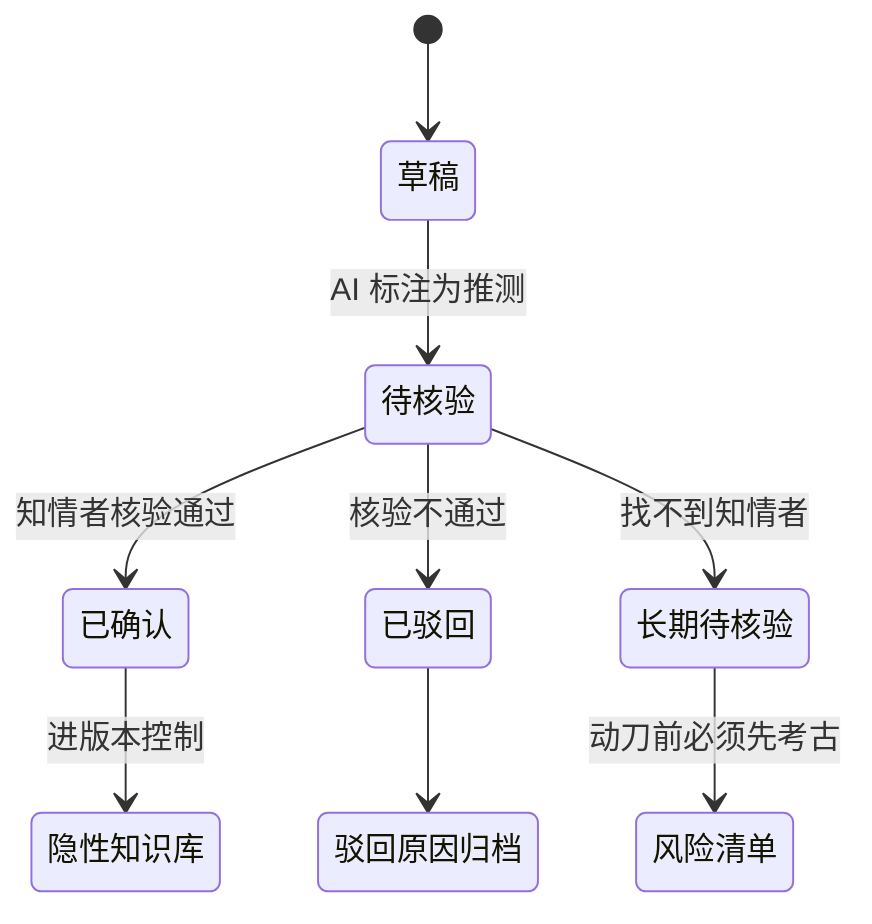
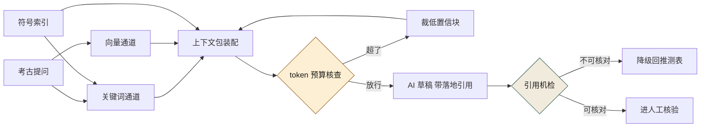

# 第 7 章 用 AI 读懂没人看得懂的项目

> **本章定位**：在第 5-6 章地图和依赖分析基础上，用 AI 辅助考古"无人理解的祖传代码"——补写考古笔记、显性化隐性知识。
> **核心命题**：代码可以靠 AI 写出来，但"这段代码为什么存在"只能靠人来解释。

图 7-1 沿主链读：AI 的解释草稿必须先过「事实 / 推测 / 假设」的强制标注，再交 Owner 或知情者核验，核过才配进考古笔记；末尾那条虚线是回报——笔记反过来喂后续 AI 的生成与重构，链条断在核验之前，喂进去的就是未证之言。


**图 7-1｜考古三步** — AI 能写解释草稿，不能把推测写成确定；人核验后才进组织知识。

---

## 7.1 问题：数十个仓库的 Owner 都不在了，代码还在跑

在第 6 章做完依赖分析后，有一个问题一直悬着：**那些一年以上没人提交的仓库，它们的代码还在生产环境跑着，但没人知道它们在干什么。**

在某电商平台案例中（案例一），有一个特别令人不安的例子：一个支付对账链路上的辅助服务——对账数据从主库读出来后，会经过这个服务做一次"清洗"。打开它的代码，上千行 Python，没有任何文档，函数名是 `process`、`handle`、`run` 这种万能名。支付域的技术负责人说："这个服务是一位老同事写的，他两年前离职了。我知道它在对账链路上，但具体在清洗什么，我也不清楚。"

**这是一个跑在资金链路上的服务，全公司没有一个人能解释它在干什么。** 如果 AI 重构时不小心改坏了它，后果不堪设想——因为这个服务连"它本来应该做什么"都没人说清楚。

这就是"祖传代码"最可怕的地方：不是代码烂，是**知识断了**。这个困境在量化基金案例中同样严重——23 个链上合约中，有数个合约的原始设计意图已经无人能完整解释，而它们管理着真实的资金流动。

---

## 7.2 根因：知识在人脑里，人走了知识就没了

**① 组织只奖励产出，不奖励文档。** 写完功能上线的人拿了绩效，写文档解释这个功能的人什么都没拿到。多年下来，代码堆积如山，文档寥寥无几。

**② 隐性知识从不显性化。** "这个函数为什么要延时一秒"、"这个清洗为什么要跳过第三列"——这些知识存在于某个人的直觉里，从没被写下来。那个人走了，直觉也走了。

**③ AI 来之前，至少写代码的人还留着一些记忆。** AI 来之后，新生成的代码连原作者的直觉都没有——它只是在"生成看起来对的代码"，背后没有任何人的理解在支撑。**AI 让代码增长更快，却没有让理解同步增长，于是"代码量"和"可理解量"之间的剪刀差越来越大。**

---

## 7.3 AI 用法：三种考古法——摘要、问答、重建

用 AI 考古，有三种用法，可靠性递减、信息量递增：

**① 摘要法（最可靠）。** 让 AI 读一段代码，输出"这段代码看起来在做什么"。适合快速建立整体印象。关键约束：**必须让 AI 标注「我不确定的部分」**，而不是让它给出流畅的、看似全知的总结。

**② 问答法（中等可靠）。** 针对具体问题让 AI 回答——"这个延时是干什么用的？""这个清洗为什么要跳过第三列？" AI 会基于代码模式给出推测。**推测必须标"推测"，并由人核实。**

**③ 重建法（最不可靠但信息量最大）。** 让 AI 试图"重建"这个服务的设计意图——它本来要解决什么问题、有哪些隐含约束。这一步产出最丰富，但也最容易出错，因为 AI 会用它的通用知识"脑补"出代码里不存在的意图。

在电商平台案例中，那个支付对账清洗服务三种方法都用了一遍。摘要法给出"数据格式转换"，问答法推测"跳过第三列是因为它是内部标记位"，重建法大胆猜测"可能在处理退款和正常交易的分离"。

**三个结论里，只有一个经核实是对的。** 问答法和重建法的推测看起来都很合理，但都错了——第三列其实是对账批次号，服务处理的是跨账户对冲而非退款。最终是找到了离职老同事的前同事，凭记忆确认了真实用途。**AI 给了三个看似合理的答案，人给了一个正确的答案。**

这是推断型幻觉（第 24 章定义）的典型案例：AI 面对不确定信息时，倾向于给出"看起来合理"的答案，而不是说"我不知道"。

---

## 7.4 组织冲突模式：考古要不要占交付容量

用 AI 考古这件事，治理团队想做，但各业务团队不愿意配合——**因为考古不产出功能，占的是交付时间。**

"你让我的人花几天去核实 AI 给数十个老仓库写的笔记？我这季度的需求还做不做了？"——这是普遍的态度。

最终解决通常需要最高决策层出面，定下"考古是治理团队的工作，各团队只需配合确认，配合时间受限"的规矩。**考古的成本主要由治理团队扛，各团队只出"确认"这一步。** 代价是治理团队在考古期间几乎没有精力做其他事。

> **代价声明**：数十个仓库的考古笔记，治理团队花费了大量人力天数。这些笔记不产生任何业务价值，但它们让"黑箱仓库"变成了"至少有人能解释的仓库"。**这笔投资的回报，是降低了潜在的灾难——因为考古发现其中一些仓库确实有隐患，提前修了。**

---

## 7.5 产出物：组织级考古笔记 + 隐性知识库

可落地的两件：

1. **考古笔记**：每个考古过的仓库，一份 Markdown 文档——功能描述、关键约束、已确认事实 vs. 待确认推测、当前 Owner、风险标注。
2. **隐性知识库**：所有"已确认事实"汇总成一个可搜索的知识库，新人入职或 AI 生成代码时可检索。

笔记里每一条内容，都处在这条状态链上——"待核验"不是垃圾箱，而是一张显式的风险清单：



**图 7-2｜推测的生命周期** — 推测只有两条出路：确认成事实，或驳回归档；「长期待核验」本身就是风险清单，不是待办杂项。

**隐性知识显性化是这一章最重要的产出。** 以前这些知识活在人的脑子里，人走了就没了；现在它们被写进了文档，进了版本控制，就算人走了知识还在。

> **代价声明**：隐性知识库的维护是持续的——每次有新的考古发现、每次有人核实了一个推测，都要更新。**这是一个活的资产，不是一个一次性项目。** 如果不持续投入，它会在两年后变成另一堆过期的文档。

---

## 7.5b 操作步骤：一个黑箱仓库五天怎么考古

拿 7.1 那个支付对账清洗服务当样本。触发点不是"有人想做治理"，是两件已经发生的事：第 6 章的依赖图把它标在了对账链路上、最近一次提交停在两年前、Owner 字段空着；再往前，风控在 2024-04-22 要"AI 碰过哪些资金链路代码"的清单，这个仓库连"它在干什么"都答不上来。

考古负责人是治理组五个人里抽出来的一个——**同一个人还要兼顾别的域，这是他这一段时间的主要工作，但不是唯一工作**，这是排期一路往后拖的真实原因。

| 时间 | 动作 | 谁 | 卡在哪 |
|---|---|---|---|
| D1 上午 | 先冻结：盘点表里把该仓库 `ai_touchable` 改成"不可碰"，禁止 AI 生成的改动进这个仓库 | 治理组 + 支付域 TL | 已经有一个改日志级别的 PR 挂在队列里，得先退回；退回要给出理由，理由写"未考古" |
| D1 下午 | 抓结构：函数签名、调用图、读写的表和接口 | AI 抓取，人复核口径 | 函数名全是 `process`/`handle`/`run`，摘要只能到"读主表、写结果表"这一层 |
| D2 | 摘要法 + 问答法各跑三轮，每轮强制输出"不确定项" | AI 出草稿，考古负责人逐条打"事实 / 推测 / 假设" | 第一轮 AI 一条推测都没标，重写提示词才逼出"我不确定"（提示词见 7.5c） |
| D3 | 从数据反推：拉一天的真实输入输出做行级比对 | DBA 抽数 | 抽数要风控审批，半天没了；**资金链路上的数据，看一眼都要走流程** |
| D4 | 找人：`git log` 的作者 → 通讯录 → 已离职 → 同组第二人 → 前同事 | 考古负责人 | 唯一知情者已离职且无交接文档，只能靠人情约时间 |
| D5 | 30 分钟口头确认，人当场写，事后由知情者邮件回复确认 | 前同事 + 支付域 TL | 确认结果是"跨账户对冲"，7.3 里 AI 的两个猜测全部作废 |

**五天的产出是一页纸。** 但这一页纸把"不可碰"从"没人敢动"变成了"知道为什么不能动、动的先决条件是什么"。

三条最容易被忽略的顺序纪律：

1. **先冻结，后考古。** 不冻结就考古，等于一边查炸弹一边有人在旁边改线路——D1 那个 PR 就是证据。
2. **找人排在跑 AI 前面启动。** D2 的草稿一小时就出来了，D4 的约人排到三天后。**考古的工期由知情者的日历决定，不由模型决定。**
3. **D5 之后仍然有没找到人的条目。** 它们的正确归宿是"长期待核验"（图 7-2），不是"关闭"。这个仓库最后留下几条无人可证的推测，全部进了动刀前置条件。

---

## 7.5c 可抄工件：考古笔记模板 + 提问提示词 + 仓库侧护栏

**笔记放哪**：`legacy-notes/<repo>.md`，与第 5 章的盘点表同仓、同名可对应——**文件名对得上，CI 才能查覆盖率；散在各人文档空间里的笔记等于不存在。**

模板（可直接抄走填空，字段不许删，没有内容就写"未知"）：

```markdown
# <repo> 考古笔记
- 一句话用途：<它替谁解决什么问题>
- 当前 Owner：<人名 / 无主>            # "无主"是结论，不是留空
- 在资金 / 合规链路上：是 / 否          # 是 → 附风控或合规的会签人
- 输入 → 输出：<表或接口> → <表或接口>
- 调度：谁触发、频率、失败了会不会自己重试
- 最近一次核实：<日期>

## 已确认事实（每条必须有确认人 + 日期 + 确认方式）
| # | 事实 | 确认人 | 日期 | 方式（邮件 / 工单 / 口头复述记录） |
|---|------|--------|------|------|

## 推测（未核实；动刀前必须先转成事实或驳回）
| # | 推测 | 若为假的后果 | 找谁能证 |
|---|------|--------------|----------|

## 长期待核验（找不到知情者）
| # | 问题 | 已尝试的找人路径 | 动刀前的兜底动作 |
|---|------|------------------|------------------|

## 隐含约束（代码里看不出来，但改了会炸）
## 动刀前置条件（最多三条，必须是可验证的动作）
## 未知清单（我们知道自己不知道的那部分）
```

三条硬规则：**「已确认」必须有具名确认人，没有具名的一律待在「推测」——状态由证据决定，不由措辞决定**；口头确认必须由记录人当场复述一遍并留下第二人；「动刀前置条件」为空 = 这份笔记没写完。

提问用提示词，按附录 A 骨架：

```yaml
id: P-7-5-01
scene: 无主仓库的摘要法考古
objective: 产出"看起来在做什么"，并把不确定项逼出来
prompt: |
  这是一个无人维护的服务（函数签名、调用关系、读写的表清单如下）：<材料>。
  要求：
  1. 只描述代码里可指认的行为，每条后面写依据（文件:行 或 表名）；
  2. 凡是你从命名推断出的意图，单列「推测」，并给出另外两种同样说得通的解释；
  3. 禁止用"综合来看""这类服务通常会"补白——没有依据就写「未知」；
  4. 最后一节固定为「要确认哪三件事最省钱」。
must_intervene: 「推测」条目须由具名知情者核验后才能进隐性知识库
ai_failure_mode: 面对空白会给流畅且自信的错误解释（7.3：三个结论只有一个对）
status: skeleton
```

护栏（挂在每天跑的巡检里，把"考古"从一次运动变成一条会红的线）：

```bash
# 巡检一：资金/合规链路上的仓库必须有笔记文件——没笔记 = 红
# 为什么只扫 money_path=1：全平台仓库扫不动，先把最贵的那批看住
while IFS=$'\t' read -r repo money; do
  [ "$money" = "1" ] || continue
  [ -f "legacy-notes/$repo.md" ] || { echo "缺笔记：$repo"; fail=1; }
  # 巡检二：进了「已确认事实」却没有确认人 = 假事实，同样算红
  awk '/^\| [0-9]/ && ($3 == "" || $3 == " ") { print FILENAME": 无确认人的已确认条目"; exit 1 }' \
      "legacy-notes/$repo.md" || fail=1
done < inventory/repos.tsv
exit ${fail:-0}
```

**这条 lint 只保证"有笔记、有具名"，不保证内容对。** 内容对不对靠 7.5d 的抽查——两手都要有，缺一只手，覆盖率会先涨、可信度先跌。

---

## 7.5d 度量指标：考古有没有真的发生

| 指标 | 怎么测 | 阈值 | 谁看 | 多久看一次 |
|------|--------|------|------|-----------|
| 资金链路笔记覆盖率 | 盘点表 `money_path=1` 且有 `legacy-notes/<repo>.md` | 全覆盖（这条是硬线，没有例外） | 治理组 | 周 |
| 无主推测占比 | 「推测」条目里超过 90 天没有确认人的比例 | 不降即上报；**90 天是拍的，用于起手，不是标准** | 治理组 | 月 |
| 抽查回炉率 | 随机抽笔记问一句「这条推测若是假的会怎样」，答不上的条目占比 | 超三分之一即判这批笔记为走过场，整批重做（三分之一同样是拍的） | 治理委员会 | 季度 |
| 考古→动刀转化率 | 笔记完成后半年内发生重构、下线或补测试的仓库数 | 长期为零 = 考古只用来安心，不用来决策 | 治理组 | 季度 |
| AI 结论被否决次数 | 人把 AI 的"事实"判为错误的次数 | **必须非零** | 治理组 | 月 |

这条路的四种具体坏法，按出现频率排：

**① 第二份 README。** 笔记写完就再没人打开，一年后它和它解释的代码一样旧。**症状**：「最近一次核实」字段全是建库那天同一个日期。

**② 盖章式核实。** TL 一句"看着没问题"批量确认了几十条。**为什么要「确认方式」这一列**：口头确认必须当场复述并由第二人记录，写不出复述记录的，就是没核过。

**③ 用覆盖率交差。** 覆盖率涨、推测条数清零，两件事同时发生且中间没有人审过——这不是治理推进，是标注造假（和第 5 章「没有裁定记录的下降一律视为造假」同一条判断）。

**④ 考古变成不重构的挡箭牌。** 「这个仓库没人懂」被引用了两年，谁也没打算让它变得可懂。这是"考古→动刀转化率"存在的全部理由：**笔记的价值在它被用掉的那一次改动上，不在它写得多完整上。**

---

## 7.5e 检索地基第一件：切块要按符号，不是按行数（本机实跑）

7.3 的三种考古法共享一个前提，而它从没被单独拆开讲过：**先把上千行代码里相关的那一片捞出来，递给模型**。命中率的第一杠杆不是模型大小，是切块的形状。7.5b 那张表里"D1 下午抓结构"要做对的就是这一步——这一步做歪，后面每一步都在错误的地基上自信。

本卡 A 档现场：本机实跑，Python 3.14。样本是给 7.1 那个清洗服务做的 37 行迷你替身（保留它的三个要害：模块级常量、藏在函数体里的注释、万能函数名）：

```python
"""支付对账清洗服务：从主库读流水，清洗后写结果表。"""
import csv

BATCH_COL = 2          # 第三列是批次号，不是金额——前任留下的唯一线索
SKIP_IDX = 2

def load_rows(path):
    rows = []
    with open(path, newline="") as fh:
        for raw in csv.reader(fh):
            rows.append(raw)
    return rows

def clean_row(row):
    out = []
    for i, cell in enumerate(row):
        if i == SKIP_IDX:
            continue   # 跳过列：真因是对账批次号，见 BATCH_COL 注释
        out.append(cell.strip())
    return out

def hedge_split(rows):
    left, right = [], []
    for r in rows:
        if r[BATCH_COL].startswith("H"):
            right.append(r)   # H 前缀批次走跨账户对冲分支
        else:
            left.append(r)
    return left, right

def write_result(rows, path):
    with open(path, "w", newline="") as fh:
        csv.writer(fh).writerows(rows)

def run(src, dst):
    left, right = hedge_split(load_rows(src))
    write_result([clean_row(r) for r in left + right], dst)
```

两种切法的对照器（token 列先声明是字符估算，口径在 7.5h 讨论）：

```python
#!/usr/bin/env python3
"""切块对照：按行定宽 vs 按符号（ast）。token 数为字符估算（示例口径，非分词器实测）。"""
import ast, pathlib, sys
src = pathlib.Path(sys.argv[1]).read_text(encoding="utf-8")
lines = src.splitlines()
W = int(sys.argv[2]) if len(sys.argv) > 2 else 30   # 窗口宽度（行）

print("== 按行定宽切块（无重叠）==")
for i in range(0, len(lines), W):
    body = "\n".join(lines[i:i + W])
    head = lines[i]
    print(f"  chunk-{i//W+1}  行 {i+1:>2}-{i+len(lines[i:i+W]):<3} 首行: {head[:34]:<36} 约 {len(body)//4:>3} tok(估)")

print("== 按符号切块（ast 顶层 def/class）==")
tree = ast.parse(src)
for node in tree.body:
    if isinstance(node, (ast.FunctionDef, ast.AsyncFunctionDef, ast.ClassDef)):
        a, b = node.lineno, node.end_lineno
        body = "\n".join(lines[a - 1:b])
        sig = lines[a - 1].strip()
        print(f"  {node.name:<12} 行 {a:>2}-{b:<3} 签名: {sig[:36]:<38} 约 {len(body)//4:>3} tok(估)")
```

真实输出（stdout 逐字）：

```text
$ python3 chunk.py recon_clean.py 15
== 按行定宽切块（无重叠）==
  chunk-1  行  1-15  首行: """支付对账清洗服务：从主库读流水，清洗后写结果表。"""       约  73 tok(估)
  chunk-2  行 16-30  首行:     for i, cell in enumerate(row):   约  95 tok(估)
  chunk-3  行 31-37  首行: def write_result(rows, path):        约  59 tok(估)
== 按符号切块（ast 顶层 def/class）==
  load_rows    行  7-12  签名: def load_rows(path):                   约  38 tok(估)
  clean_row    行 14-20  签名: def clean_row(row):                    约  48 tok(估)
  hedge_split  行 22-29  签名: def hedge_split(rows):                 约  54 tok(估)
  write_result 行 31-33  签名: def write_result(rows, path):          约  28 tok(估)
  run          行 35-37  签名: def run(src, dst):                     约  31 tok(估)
```

读法只有一处要害：看定宽切法的 chunk-2，**首行是 `    for i, cell in enumerate(row):`——一个没有名字的循环**。它的函数签名在上一块，它依赖的 `SKIP_IDX` 定义也在上一块。检索一旦命中这个块，模型拿到的是"某段不知道属于谁的循环体"，此时它唯一的补全材料是命名猜测——**7.3 里"第三列是内部标记位"那条幻觉推测，机械根源就在这类边界上**。符号切法用 `ast` 的 `lineno`/`end_lineno` 保证每个 `def` 自带签名与完整函数体，注释跟着代码走（跳过列的真相就在 clean_row 体内那行注释里）。

代价与边界，三条：符号切块需要每种语言各一把解析器（第 5 章 5.5e 的 `ast` 就是 Python 那把）；函数之间的游离注释和模块级语句会掉在块缝里，得像本样本这样单独立一个"模块头"块；块大小不均把压力转移到预算那头——正好是 7.5h 的主题。

一句话收束：**按行切块省下的边界功夫，会在模型的脑补里加倍偿还。**

> **档位声明（符号级切块）**：**A 档 · 本机实跑（Python 3.14），37 行样本上按行定宽与按符号（ast）两种切法的对照 stdout 读数为这台机器实际输出（token 列为字符估算口径）**

---

## 7.5f 检索地基第二件：关键词与向量两个通道，各自漏得很不一样

块备好了，下一个问题是：提问进来，返回哪几块。**两个通道的漏法互补，所以先各自看清怎么漏，再谈混合。**

关键词通道本机实跑——对 7.5e 的符号块做词频打分（BM25 的最小替身，行为一致、能看清就够）：

```python
#!/usr/bin/env python3
"""关键词通道：对按符号切好的块做词频打分（BM25 的最小替身，够看清行为）。
检索词按空白切分——中文要事先分好词，这本身就是关键词通道的一半成本。"""
import ast, pathlib
src = pathlib.Path("recon_clean.py").read_text(encoding="utf-8")
lines = src.splitlines()
chunks = {}
tree = ast.parse(src)
for node in tree.body:
    if isinstance(node, ast.FunctionDef):
        chunks[node.name] = "\n".join(lines[node.lineno - 1:node.end_lineno])
chunks["<模块头>"] = "\n".join(lines[:6])

def score(query, chunk):
    return sum(chunk.count(t) for t in query.split())

for q in ["跳过 第三列 批次号", "为什么要忽略某一列"]:
    print(f"查询：{q!r}")
    ranked = sorted(chunks, key=lambda c: -score(q, chunks[c]))
    for c in ranked[:3]:
        s = score(q, chunks[c])
        print(f"  {c:<12} 得分 {s}" + ("　← 命中" if s else ""))
    if all(score(q, b) == 0 for b in chunks.values()):
        print("  （全零：关键词通道对改写型提问一无所获——这就是向量通道存在的理由）")
```

真实输出（stdout 逐字）——一个查询命中、一个全军覆没：

```text
$ python3 kwsearch.py
查询：'跳过 第三列 批次号'
  clean_row    得分 2　← 命中
  <模块头>        得分 2　← 命中
  load_rows    得分 0
查询：'为什么要忽略某一列'
  load_rows    得分 0
  clean_row    得分 0
  hedge_split  得分 0
  （全零：关键词通道对改写型提问一无所获——这就是向量通道存在的理由）
```

第一条查询用到了代码注释里真实出现过的词，所以命中；第二条问的是同一件事，**一个词都没对上，得分整体为零**——考古提问恰恰多半是改写型的：提问的人和你一样不知道代码里的行话。向量通道就是为这一类提问存在的：把提问与块嵌进同一向量空间按相似度召回，同义改写能进来。**本机没有嵌入模型与向量库，这一通道未实测**——B 档纪律，这里只允许写定位与代价：向量买到的是改写召回，交出去的是可解释性（"为什么这块排第一"回答不出词级依据），而且代码语料冷启动质量完全取决于切块形状（回到 7.5e）。

| 维度 | 关键词通道 | 向量通道 |
|------|-----------|---------|
| 命中依据 | 可审计：命中哪几个词、出现几次 | 相似度分数，排序理由不可逐词复述 |
| 改写提问 | 几乎必漏（上面的全零样本） | 主要卖点 |
| 行话提问 | 主场 | 同样能进，但可能被"语义相近的无关块"截胡 |

混合的落地不是调权重玄学，是先定分工再融合排名：**关键词通道负责可审计的证据，向量通道负责召回；两路结果做名次融合后仍要过 7.5i 的引用机检**。单通道检索写进考古报告时，必须自报盲区——拿全零的关键词结果当"仓库里没有相关代码"的证据，是这条链路上最省钱的翻车方式。

---

## 7.5g 检索地基第三件：LSP 是那条"确定的边"

问答法最高频的一类提问是"这个函数被谁调用"。**这类问题的答案是一个可枚举的集合，可枚举的事实用枚举，不许用概率。** 枚举的工具是语言服务协议里的引用查询（`textDocument/definition`、`textDocument/references` 一类请求，返回带文件与行列的位置清单）——按 B 档口径写：协议形状如此，本机没有起语言服务器进程，未实测任何一份真实返回。

它在考古工作流里的位置是一条纪律，不是一次调用。提问涉及调用关系 → 先跑索引查询，把返回的位置清单作为**确定的边**装进 7.5h 的上下文包；清单为空 → 这个空也是证据，但要带口径入档（索引器覆盖这个语言吗、查询词落在哪个符号上），"**查无引用"和"没查到"是两句话**"，把后者写成前者，就是一次静默失效；清单非空但很长 → 按调用方所在目录与资金链路加权截断，截断规则写进上下文包的 `truncated` 字段。

失效面说在前面：动态派发、按字符串装配的调用、跨进程的消息名——这些边从协议层就不存在，**和 7.5e 的注释一样，确定的边也是边的子集**（第 5 章 sample2 那条 `import_module` 动态边，LSP 同样不报）。所以调用关系问题的完整证据 = 引用清单 + "本工具链看不见的边类"声明，两者一起进上下文包，缺声明的清单会教出过度自信的结论。引用查询靠全仓索引，索引要随提交刷新——它的增量失效面和第 5 章 5.5g 是同一族问题（清单漂移、静默跳过），治理也共用那三条纪律，不另起炉灶。

---

## 7.5h 上下文包与 token 预算：预算这笔算术（本机实跑）

一次考古提问的产出质量上限，约等于检索质量乘以装进上下文的证据量——**上下文包（context pack）就是这次提问随身带的证据清单**，它是第 1 章说的那个组织资产的最小形态。形状先给一个可抄的（示意字段）：

```yaml
id: ctx-pay-recon-001            # 每次提问一个包，包 ID 进考古笔记留痕
question: 清洗为什么跳过第三列
repo: pay-recon-cleaning
revision: <commit-hash>          # 钉死修订：检索结果必须可复现
budget_tokens: 3000              # 示例预算，不是标准
chunks:                          # 按置信度降序；超预算从尾部裁
  - {file: recon_clean.py, span: [1, 6],  from: symbol-index, hits: 2}
  - {file: recon_clean.py, span: [14, 20], from: keyword, note: 含原始注释}
  - {file: recon_clean.py, span: [22, 29], from: vector, note: 待人核}
certain_edges:                   # 7.5g 的确定边原样附上
  - {query: references, result: <位置清单或「空+口径声明」>}
inventory_row: {money_path: 1, owner: 无主·待处置}
```

预算得先能量出来。两种量法必须分清：**分词器实测**（拿模型提供方的 tokenizer 数 token，准，但换模型换字典）和**字符估算**（粗、便宜、够排序）。本机实跑字符估算这条——把上面包体的三个块装进 `ctx_pack.txt`，量一次：

```text
$ python3 -c "
from pathlib import Path; pack = Path('ctx_pack.txt').read_text(encoding='utf-8'); n = len(pack)
print('上下文包字符数（含标签）:', n); print('粗估 token（字符/4，示例口径，非分词器实测）: ≈', n // 4); print('预算 3000:', '放得下' if n // 4 <= 3000 else '超预算')"
上下文包字符数（含标签）: 416
粗估 token（字符/4，示例口径，非分词器实测）: ≈ 104
预算 3000: 放得下
```

口径丑话写在读数旁边：`字符/4` 是英文文本惯用的粗算，对中文内容明显偏乐观（中文一字多 token），**它只配用来排序"哪个块该先扔"，不配用来出账单**；出账与限额判定用提供方分词器实测，与第 1 章定的 token 预算量法对齐（[第 1 章](./ch06-第1章-AI原生不是让AI写代码.md)）。真正会进上下文的是模型提供方的计费读数，本站的估算只是让裁剪有据可依。

超预算时的裁剪顺序是制度不是临场：先裁外围仓库块，再裁 `from: vector` 的低置信块，**永不裁提问对象块本体、永不裁 inventory 行与"不可碰"声明**——裁掉后者，模型会在不知道自己缺证据的情况下给出流畅的错误。裁完还超，说明这个问题本身太大：改问题、或者拆成两次提问，不许悄悄把块截半（截半又回到 7.5e 的循环体惨案）。整条链——切块、双通道检索、确定边、预算裁剪、引用机检——串起来就是图 7-3。顺着读：左侧两个通道加 `ast` 符号索引喂装配，预算关不过就在环里裁块，出库的草稿必须过引用机检，检不过的结论落回推测表：



**图 7-3｜上下文包组装与证据闭环** — 检索、预算、机检三道关各拦各的：块不对、钱超了、话没证据，三道关缺一道，AI 的自信就会冒充考古的产出。

> **档位声明（上下文包与 token 预算算术）**：**A 档 · 本机实跑字符估算这条量法，上下文包 416 字符、粗估约 104 token、预算 3000 放得下的读数为这台机器实际输出（分词器实测侧未跑，仅口径交代）**

---

## 7.5i 检索缺证据时，用机检拦住 AI 的推断

7.3 那三个"看似合理"的结论，发生在没有检索约束的年代；如今地基有了，还要补最后一道闸：**草稿里的每条"事实"必须带 `文件名:行号` 的落地引用，引用逐条机器核对**。本机实跑这套——先给一份混着两种典型幻觉的 AI 草稿：

```text
AI 考古草稿（示意结论，非事实）：
1. 清洗时跳过第 3 列，因为它是批次号而非金额（依据 recon_clean.py:18）。
2. H 前缀批次走跨账户对冲分支（依据 recon_clean.py:88）。
3. 主循环入口在 recon_clean.py:35。
4. 重试逻辑见 retry_helper.py:12。
```

机检脚本与真实输出：

```python
#!/usr/bin/env python3
"""引用机检：AI 考古草稿里的每条 file.py:NN 依据，逐条对照真实仓库。
判据：文件必须存在；行号必须落在 1..总行数。
不满足任何一条 = 该结论降级回「推测」，不进笔记。"""
import pathlib, re, sys

answer = pathlib.Path("ai_draft.md").read_text(encoding="utf-8")
pat = re.compile(r"([A-Za-z0-9_./-]+\.py):(\d+)")
ok = bad = 0
for m in pat.finditer(answer):
    f, no = m.group(1), int(m.group(2))
    p = pathlib.Path(f)
    if not p.exists():
        print(f"[红] {f}:{no} —— 文件不存在"); bad += 1; continue
    total = len(p.read_text(encoding="utf-8").splitlines())
    if not 1 <= no <= total:
        print(f"[红] {f}:{no} —— 行号越界（该文件共 {total} 行）"); bad += 1; continue
    print(f"[绿] {f}:{no}"); ok += 1
print(f"合计：{ok} 条可核对，{bad} 条不可核对。")
sys.exit(1 if bad else 0)
```

```text
$ python3 check_citations.py; echo "退出码 $?"
[绿] recon_clean.py:18
[红] recon_clean.py:88 —— 行号越界（该文件共 37 行）
[绿] recon_clean.py:35
[红] retry_helper.py:12 —— 文件不存在
合计：2 条可核对，2 条不可核对。
退出码 1
```

两条红各代表一种幻觉形态：**行号编造**（这个文件总共 37 行，它引到 88）与**文件整个编造**（仓库里从来没有 retry_helper）。注意第 2 条草稿的"事实"其实蒙对了方向——机检不看方向，只看依据；**推断就算碰对了，也照样被拦**，因为对一次的推断和错一次的推断在证据上无法区分，这正是 7.5c 那条"状态由证据决定，不由措辞决定"的机器化。

闸接在状态机的哪里：红 → 该结论自动降级为「推测」，写回 7.5c 笔记模板的推测表，**没有落地依据的推断可以进笔记，但只能进推测那一列**；绿 → 才配走 7.5b D5 那一步的人工核验。

它的天花板也钉死在这里：机检证明的是"这个位置存在一行"，不是"这一行支持这个结论"——真行号配错解读，任何 lint 都拦不住，那是 7.5d 抽查回炉的活。同一套"引用必须可核对"的断言在 AI 评审流水线上有更完整的形态，评测侧的闸门见第 24 章（[第 24 章](./ch29-第24章-AI评审与幻觉处理.md)），提示词的引用约束在附录 A 的骨架里作为必填项（[附录 A](./ch39-附录A-提示词库骨架.md)）。

---

## 四案例映射

| 案例 | 祖传代码的核心风险 | AI 考古推断型幻觉的典型表现 | 隐性知识显性化的核心产出 |
|------|-------------------|---------------------------|------------------------|
| 案例一·电商平台 | 资金链路上无人理解的清洗服务 | 把对冲推断为退款、把批次号推断为标记位 | 考古笔记 + 可检索隐性知识库 |
| 案例二·加密交易所 | 跨事业部遗留撮合模块 | 把精度妥协推断为"故意设计" | 合约/模块行为说明书 |
| 案例三·Web3 量化 | 设计意图已无人解释的链上合约 | 把临时方案推断为"长期架构" | 合约设计意图文档（附审计引用） |
| 案例四·安全初创 | 创始初期遗留的检测规则 | 把过时规则推断为"当前有效" | 智能体行为基准文档 |

---

## 7.6 检查清单

- [ ] 你有没有一份"有多少代码没人能解释"的清单？没有 = 你不知道自己的隐性债务有多大。
- [ ] 你的资金/核心链路上，有没有"代码在跑但没人懂"的服务？有 = 定时炸弹。
- [ ] AI 给祖传代码写的考古笔记，你有没有人工核实？没有 = AI 的推测被当成了事实。
- [ ] 你的隐性知识有没有被写下来、版本化？没有 = 下一个人离职，知识又断一次。
- [ ] 隐性知识库有没有更新机制？没有 = 两年后它又变成了另一堆祖传文档。

---

## 7.7 反模式

| # | 反模式 | 后果 |
|---|--------|------|
| 1 | 不做考古，直接动祖传代码 | 改坏了不知道、不改又不敢删 |
| 2 | 信 AI 的考古笔记不核实 | 推测被当成事实，错误传播 |
| 3 | 考古笔记写完不版本化 | 又变成一堆新的无主文档 |
| 4 | 考古只做一次不更新 | 新的隐性知识又没人记 |
| 5 | 让 AI"重建"设计意图当事实 | AI 脑补的意图被当成原始设计 |

---

## 7.8 遗留问题

- **AI 的推测能不能自动标注置信度？** 靠提示词约束 AI 说"不确定的要标推测"，但 AI 经常不标。这件事能不能更可靠？留给第 24 章（幻觉处理）。
- **隐性知识库怎么和 AI 生成代码结合？** 理想状态是 AI 生成代码时，能自动检索知识库里"这个服务的已知约束"。留给第 23 章（提示词工程）。
- **考古完了，新产生的仓库怎么办？** 考古不该是一次性运动，应该是"新仓库上线时就必须附考古笔记"。这条规则留给了第 25 章（文档治理）。

---

> **本章的一句话**：代码可以靠 AI 写出来，但"这段代码为什么存在"只能靠人来解释。**祖传代码真正的风险不在代码本身，在于理解它的人已经不在了。** AI 能帮你把"看起来在做什么"猜出来，但"它真正的隐含约束是什么"——那个能救命的答案，永远只在某个人的记忆里，而那个人随时可能离开。
