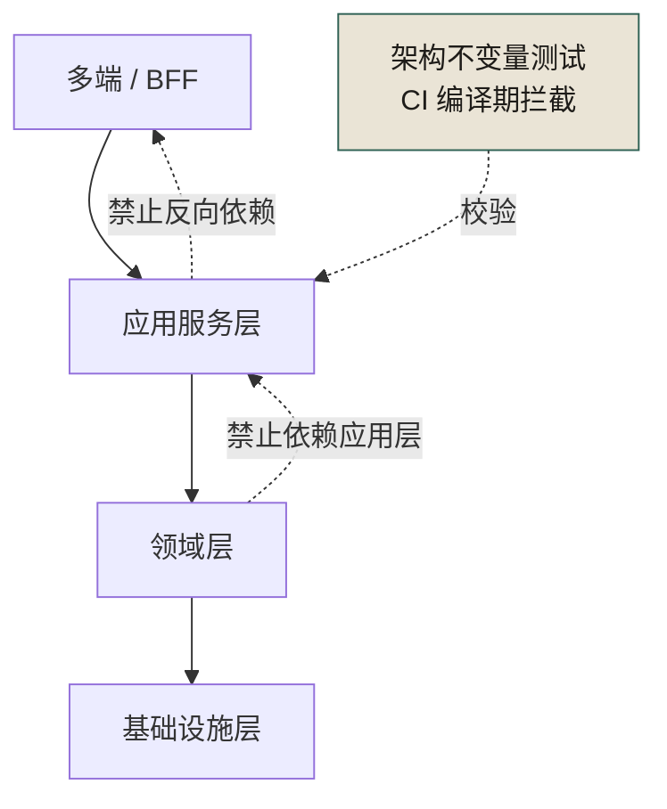
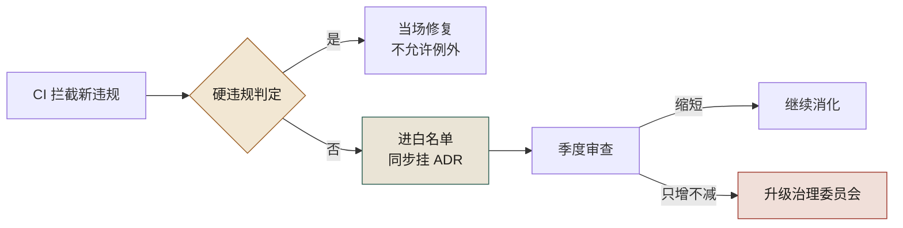

# 第 8 章 目标架构：多端 + 多业务域

> **本章定位**：把架构原则从"图"变成"不变量约束"——架构治理的终点不是所有人理解架构，而是就算有人不理解也违规不了。
> **核心命题**：架构如果只活在图里，它就是一张漂亮的壁纸。

图 8-1 要按两种线读：实线是允许的依赖方向，从多端/BFF 逐层落到基础设施；虚线是被显式禁止的事——应用层不得反向依赖 UI、领域层不得依赖应用层，以及架构不变量测试挂在何处做校验。这张图有没有牙齿，全看三条虚线有没有被 CI 执行。

<figure class="chapter-plate">
  
  <figcaption>题图 · 等高线：目标架构不是一个点，是一圈一圈收敛的界</figcaption>
</figure>



**图 8-1｜目标架构与不变量** — 边界靠测不靠画；违规在 CI 里变成编译错误。

---

## 8.1 问题：架构图画得很漂亮，三个月后没人遵守

许多组织经历了相似的场景：治理团队画了一张漂亮的目标架构图——分层清晰、依赖单向、边界明确，挂在会议室中央，管理层点头称赞。

三个月后复查，约束力约等于零。

在某电商平台案例中（案例一），一个新模块为了赶需求直接跨域调用了另一个域的内部服务，绕过了中间的服务层。问起来，工程师说"架构图我看过了，但我这个需求急，先这么写，以后再改"。**以后再改 = 永远不改。** 三个月后那个"临时"调用变成了正式依赖，再往后 AI 也开始沿着这条违规路径生成代码——因为它从现有代码里学到了"可以这么调用"，于是违规成了 AI 的"正确答案"。

**人类的违规是一次性的，AI 的违规是规模化的——它会沿着违规的路径，批量生产新的违规。**

这种模式在其他案例中同样可见：交易所案例中，跨事业部的直接调用绕过了清算中间层，AI 在重构时学习并放大了这些违规路径；安全初创案例中，智能体之间的隐式调用绕过了编排体，AI 在生成新的智能体交互时复制了这些违规模式。

---

## 8.2 根因：架构是"建议"，不是"约束"

为什么画了图没人遵守？因为在工程实现层面，架构图**没有任何强制力**。

**① 没有不变量的定义。** 画了"依赖单向"，但从没把这句话翻译成"什么操作会让它不成立"。没有可判定的不变量，就没有可执行的约束。

**② 违规的成本是零。** 一个跨层调用，代码照样跑、测试照样过、需求照样上线——**架构违规在技术上是"无后果"的**。既然无后果，赶需求的人当然选择违规。

**③ AI 会学习并放大违规。** 当违规代码混进了仓库，AI 在生成新代码时会把这些违规当成"正常模式"。

三条归结成一句：**架构治理的失败，始于把架构当文档，而不是当约束。**

---

## 8.3 AI 用法：AI 按架构生成，但架构约束必须先于人

AI 在架构这件事上的位置很微妙：**它既是违规的放大器，也可以是合规的执行者**——取决于有没有给它约束。

**不给约束时**：AI 会从现有代码里推断"什么是对的"，于是违规代码教它违规。

**给了约束后**：AI 可以在约束范围内生成代码——只要把"依赖单向"翻译成它能理解的规则（如 import-linter 配置），它生成的代码就会自动遵守。

关键步骤是**把架构翻译成不变量**：

```
架构原则           →  可判定的不变量
"依赖单向"         →  "应用层不允许 import 服务层的内部模块"
"跨域只走服务层"   →  "交易域不允许直接 import 风控域的实现"
"UI 不能含业务逻辑" →  "前端组件不允许 import 数据库驱动"
```

每条不变量都要满足三个条件：**可判定（能写成规则）、可执行（违规能被拦截）、可归因（知道是谁违反的）**。把架构翻译成这样的不变量，是治理团队的活，不是 AI 的活——这步 AI 替不了。

可直接对照落地的 `import-linter` 示意：

```ini
# .importlinter
[importlinter]
root_package = trade

[importlinter:contract:layered]
name = 分层单向
type = layers
layers =
    trade.api
    trade.service
    trade.domain
    trade.infra

[importlinter:contract:cross-domain]
name = 跨域只走服务门面
type = forbidden
source_modules =
    trade.api.*
forbidden_modules =
    trade.internal.risk.*
    trade.internal.pay.*
```

**没有这份配置时，架构是壁纸；有了它并挂进 CI，架构才开始有牙齿。**

### 工具落地卡：import-linter —— 上面这份配置怎么证明它真的在拦

（**取证口径**：本卡的退出码常量与汇总行**逐字核对自 import-linter 的 `main` 分支源码**（`src/importlinter/application/rendering.py`、`src/importlinter/cli.py`，2026-09-24 本机从 raw 源文件取回），版本号取自 PyPI 官方接口；**工具未在本机安装、`lint-imports` 未复跑**。）

- **版本口径**：2.x 线，本机从 PyPI 取到当前版 **2.15**（2026-09-24）。书中案例未写版本。
- **配置落点**：官方入门文档写明，不在命令行指定时，它按当前目录找 **`setup.cfg` / `.importlinter` / `pyproject.toml`** 三者之一。上面那份是 INI 形状；TOML 等价写法是 `[tool.importlinter]` + `[[tool.importlinter.contracts]]`。**三份同时存在时的优先级文档没有明写——未核实**，所以工程上的结论很简单：一个仓库只留一份，别把行为交给没定义过的规则。
- **抄之前先补一步**：官方文档对 `root_package` 有一句硬要求——**它必须可导入**（"The root_package must be importable"）。所以 `root_package = trade` 意味着跑 `lint-imports` 的那个环境得真的能 `import trade`：CI 里先装包或设 `PYTHONPATH`。**漏这一步，报出来的是导入错误而不是架构违规，一线会把工具当成「坏掉的 CI」而不是「抓到的违规」**——第 10 章复盘过一次这种误判。
- **跑完看哪条输出**：每条契约打一行，源码里的字面量是 `"KEPT" if contract_check.kept else "BROKEN"`，拼在契约名后面；最后一条汇总是 `Contracts: {kept} kept, {broken} broken.`（本机逐字核对，两份契约全过时长这样：`Contracts: 2 kept, 0 broken.`）。退出码只有两个值：`EXIT_STATUS_SUCCESS = 0`、`EXIT_STATUS_ERROR = 1`。**判据是那个 `broken` 计数，不是「命令跑完了」**——把它整行 grep 进 CI 日志留档。另有一条必做的自证：接进 CI 的第一天，故意写一条违规 import，亲眼看它变 `BROKEN`、流水线变红，再删掉。**门禁要先证它会红**，和第 9 章兼容门禁"先让 CI 亮一次"是同一条纪律。
- **它替代不了什么**：四条边界都得知道，不然会把"绿"读成"合规"。① 它读的是**静态分析出来的 import 语句**，运行期 `importlib`、反射、依赖注入接上的关系看不见。② 官方文档明写外部包不做静态分析（"external packages are *not* statically analyzed"），所以跨服务的耦合（消息队列、共享表名、定时任务前后置）一概不在它眼里——那正是第 6 章跨团队依赖分析要人来做的原因。③ **`layers` 契约默认只约束列进 `layers` 的那些层**：不加 `exhaustive = true`，新起一个与层平级的包就完全不受管——**架构漂移最省事的走法不是违反规则，是在规则外面加一个模块**，这条要写进评审清单。④ `if TYPE_CHECKING:` 块里的 import 默认计入，需要显式设 `exclude_type_checking_imports`；两可的配置本身就是漏点。

### 操作步骤：从架构图到 CI 拦截

把一张架构图变成"违规了就跑不起来"，动作是固定的，可以直接照抄：

1. **圈定范围**：先只挑一条最痛的规则（如跨域只走服务门面）落地，不要第一天就上全量规则——规则越多，一线的抵触越大。
2. **翻译不变量**：把这条规则写成一句可判定的话，明确"什么 import 会让它不成立"。
3. **落成配置**：不变量写成 import-linter 契约，放进仓库根目录，跟代码一起版本化。
4. **接进 CI**：把 `lint-imports` 挂进 PR 流水线，违规即红、不可合并。
5. **登记例外**：历史违规不强行当场修，进白名单并挂 ADR，逐季度消化。
6. **回喂 AI**：把拦截报错自动附加到下一轮提示词，让 AI 自己改到绿（机制详见第 10 章）。

顺序不能颠倒：**先有第 1 步的取舍，再有第 4 步的拦截。** 一开始就把所有规则设成硬拦，一线会联手把工具推翻——第 10 章有完整复盘。

### 配置示例：例外登记进配置，不留在心里

历史违规不是假装不存在——它们以"显式例外"的形式留在配置里，每个例外都能对到一份 ADR：

```yaml
# .importlinter（示意：白名单 = 显式例外，不是规则失效）
[importlinter:contract:cross-domain]
name = 跨域只走服务门面
type = forbidden
source_modules =
    trade.api.*
forbidden_modules =
    trade.internal.risk.*
    trade.internal.pay.*
# 每一条 ignore 必须挂一份 ADR——没有 ADR 的例外，季度审查时直接删掉
ignore_imports =
    trade.api.legacy_portal -> trade.internal.risk.legacy_check  # ADR-XX（占位）：portal 退役前的过渡豁免
```

**例外写进配置而不是留在心里，白名单才审查得动**：CI 每天都在数它还剩几条——缩短了不需要表扬，变长了立刻看得见。

---

## 8.4 组织冲突模式：架构规范推不推得动，取决于违规代价归谁

定分层架构和单向依赖，技术上通常没争议。争议在**谁来承担"纠正历史违规"的成本**。

冲突的典型场景：定义了"跨域只走服务层"后，发现某个域有十余处直接调用另一个域内部服务的违规。治理团队要求整改。该域负责人反对："这些调用都是线上跑着的，我改一个要测一周，十几个就是十几周。你们给时间吗？"

治理团队通常给不了那么多时间。最终妥协：**新代码必须合规，历史违规进"白名单"逐步消化，每季度至少整改一定比例。** 代价是白名单本身成了"合法的违规"——治理团队要定期审查白名单有没有在缩短，否则它就成了违规的永久庇护所。

> **代价声明**：白名单机制上线时，数十处历史架构违规进入白名单，需要多个季度逐步消化。这不是一个能"一键修复"的问题，它是一个需要持续投入的债。

白名单的生死在于"只许缩短"——这条纪律的回路在图 8-2：季度审查只有两个出口，「缩短」继续消化，「只增不减」走升级治理委员会那条红色分支；入口侧同样没有含糊空间——硬违规判定为「是」就当场修复、不允许例外，白名单只收编挂了 ADR 的历史违规。



**图 8-2｜白名单消化回路** — 白名单只许缩短不许增长；连续只增不减，就升级到治理委员会。

---

## 8.5 产出物：全平台架构规范

可落地的一份规范，核心条款：

1. **分层划分**：应用层 / 服务层 / 包层（公共库与基础设施）
2. **依赖方向**：只允许上层依赖下层，反向与跨层禁止
3. **跨域规则**：跨业务域调用只走服务层的对外接口，不调内部模块
4. **不变量清单**：每条架构原则翻译成可判定的不变量（第 10 章细化）
5. **历史违规白名单**：逐季度消化，治理团队定期审查

> **代价声明**：架构规范上线后，新代码的架构违规率从"未度量"变为可度量，逐步下降。但白名单消化占用了各团队一部分研发容量——这笔投入没有任何 KPI 认它，但它真实地从需求交付里被扣走了。

### 度量指标：架构治理看哪几个数

规范上线后没有度量，白名单的消化就没人看。治理组固定看四个数：

| 指标 | 怎么测 | 阈值 | 谁看 | 多久看一次 |
|------|--------|------|------|-----------|
| 新代码架构违规率 | import-linter 拦截记录 ÷ 提交量 | 只降不升，回升即开复盘 | 架构组 + 各域 TL | 每月 |
| 白名单条目数 | 白名单配置的 diff | 只减不增，只增即升级 | 治理团队 | 每季度 |
| 无 ADR 的例外数 | 白名单条目与 ADR 目录对账 | 零容忍，发现即补或删 | 治理团队 | 每季度 |
| AI 生成代码的违规占比 | 拦截记录中标注 AI 生成的比例 | 不设 KPI，只用于改提示词模板 | 治理团队 | 每月 |

**前三个是刹车，最后一个是喂料**：AI 违规占比高，说明架构约束还没进提示词模板——先改模板，再谈人的问题。

### 检查清单：新业务域接入架构门禁

- [ ] 该域的分层划分，写进全平台架构规范的附录了吗？
- [ ] 该域的跨域调用规则，有对应的 import-linter 契约吗？
- [ ] 历史违规进白名单时，同步登记 ADR 了吗？
- [ ] 域 TL 知不知道自己每季度要出席白名单审查？
- [ ] 本域 AI 生成代码用的提示词模板，附上不变量清单了吗？

---

## 四案例映射

| 案例 | 架构违规的典型表现 | AI 放大违规的路径 | 白名单消化策略 |
|------|-------------------|------------------|--------------|
| 案例一·电商平台 | 跨域直接调用绕过服务层 | AI 从现有代码学习违规模式 | 新合规+老白名单，季度消化 |
| 案例二·加密交易所 | 跨事业部调用绕过清算层 | AI 复制跨事业部直调路径 | 按资金链路优先级消化 |
| 案例三·Web3 量化 | 策略间直接仓位依赖 | AI 生成策略时复制隐式依赖 | 策略隔离重构 + 合约升级 |
| 案例四·安全初创 | 智能体绕过编排体直接交互 | 新智能体复制违规交互模式 | Agent 间契约强制 + 逐步纠正 |

---

## 8.6 检查清单

- [ ] 你的架构图，有没有翻译成可判定的不变量？没有 = 它只是壁纸。
- [ ] 架构违规在技术上有没有后果（编译不过 / CI 失败）？没有 = 赶需求的人一定违规。
- [ ] 你有没有处理历史违规的机制（白名单 + 消化节奏）？没有 = 违规只会越积越多。
- [ ] AI 生成代码时，有没有被告知架构约束？没有 = AI 会从违规代码里学习。
- [ ] 白名单有没有在缩短？没缩短 = 它变成了违规的庇护所。

---

## 8.7 反模式

| # | 反模式 | 后果 |
|---|--------|------|
| 1 | 画了架构图但不变成约束 | 三个月后没人遵守 |
| 2 | 没有不变量定义 | "依赖单向"无法判定，无法执行 |
| 3 | 违规无技术后果 | 赶需求的人一定违规 |
| 4 | 不处理历史违规 | 违规教 AI 违规，被规模化放大 |
| 5 | 白名单只增不减 | 永久的违规庇护所 |

---

## 8.8 遗留问题

- **不变量怎么变成编译期拦截？** 本章说了"要翻译成可判定的不变量"，但具体怎么用 import-linter、怎么接 CI，是第 10 章的核心。
- **架构规范和白名单的矛盾怎么长期管理？** 白名单是妥协的产物，它本身和"架构规范"是矛盾的。长期管理留给第 25 章（文档治理）里的 ADR——**每个白名单条目都必须有一份 ADR 解释为什么它还在。**

---

> **本章的一句话**：目标架构的价值，不在图画得多漂亮，而在**它能不能变成"你违规了就跑不起来"的硬约束**。画图是开始，翻译成不变量才是功夫。架构治理的终点，不是所有人理解了架构，而是**就算有人不理解，他也违规不了**。
