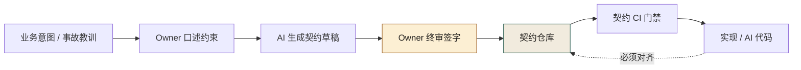
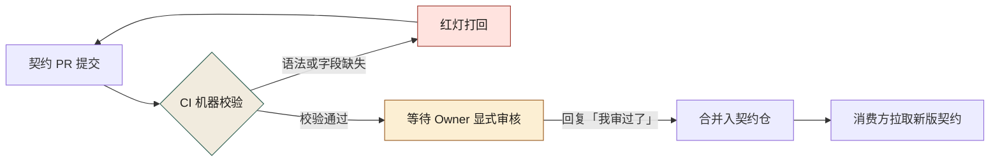
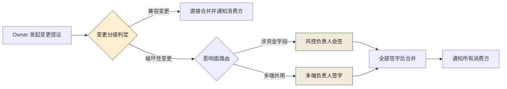
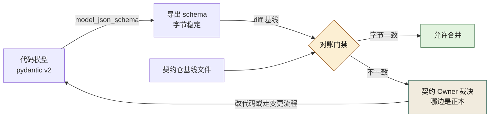
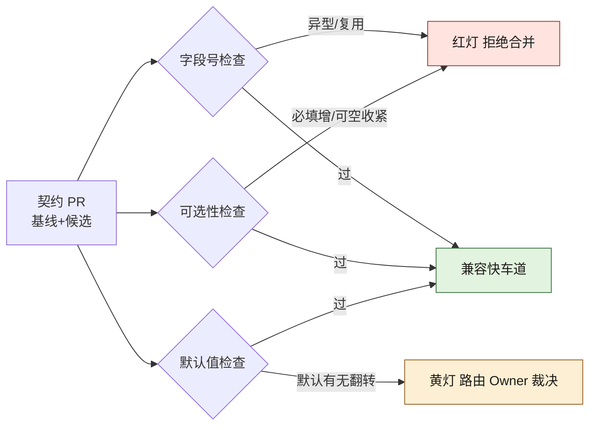

# 第 9 章 契约先行：OpenAPI、Protobuf、设计令牌

> **本章定位**：契约治理章。回答"谁为接口契约负责"这一组织问题，给出"具名 Owner + 签字权分离 + 变更分级"的机制化答案。
> **核心命题**：契约先行的第一步不是建仓库，是逼着每个域交出一个具名的责任人；AI 可以加速生成契约，但契约对不对只能由人审核。

> **本章回答第 2 章遗留问题**：介入点矩阵里"契约 Owner 谁当、风控签字人谁当"——本章给出逐域确定责任人的全过程。

---

## 9.1 问题：一次接口事故之后，去找每个域要"契约 Owner"，没人认

在一次典型的接口事故之后的第二天，治理组拿着一份名单去找各个业务域，名单上只有一栏需要填："**你们域的契约 Owner 是谁？**"

没有一个域当场填出来。

最常见的回答是："契约？我们域有 OpenAPI 文件，在仓库的 docs 里，谁写的不知道，现在谁维护也不知道。"有些域甚至连 OpenAPI 都没有，接口定义散在代码的注释和协作文档里。

这件事说明，那次接口事故的根子不是 AI 改错了接口，而是**全平台没有一个「契约的责任人」**。没有责任人，契约就成了无人维护的遗产——AI 改了实现没人更新契约，端上拿了旧契约去对接，不炸才怪。

后来治理组做的第一件大事，不是建契约仓库，是**逼着每个域报上一个契约 Owner 的名字**。这一步比建仓库难十倍，因为它不是技术问题，是权力问题——**谁当了 Owner，谁就要对这块契约负责，谁就有了变更签字权**。

---

## 9.2 根因：契约是孤儿，因为从来没人需要为它负责

为什么一个组织里会没有契约 Owner？因为在多数公司的激励结构里，**维护契约不产生任何可见的产出，于是没有人有动机去当这个 Owner**。

**① 维护契约是纯成本。** 写代码有提交量，发版有上线数，维护契约呢？什么都不算。所以没人抢着当 Owner。

**② 契约的影响是滞后的。** 契约没维护好，不会立刻出事——直到有一天 AI 改了实现、端上炸了，才知道契约早就漂了。**滞后的问题永远激励不足，因为它不进当前的 KPI。**

**③ 跨域契约没有"共同的老板"。** 某个核心域的接口被多个端共用，契约 Owner 该归这个域还是归多端？两边都觉得不是自己的事。**没有共同的老板，就没有共同的契约。**

三条根因，一句话：**契约失灵不是技术疏忽，是组织从未把"契约"提升到需要有人负责的地位。** 解决方案不是更好的工具，是给契约配上一个具名的人。

---

## 9.3 AI 用法：用 AI 生成契约，人审核契约

契约先行这件事，AI 反而是最好的加速器——前提是**人生成 → AI 加速 → 人审核**这个顺序不能颠倒。



**图 9-1｜契约先行流水线** — AI 加速草稿，签字权在人；实现对不上契约仓库就合不了。

**AI 在契约环节能做的：**
- 从一段接口描述生成 OpenAPI / Protobuf 初版（试点期部分域 70% 契约草稿是 AI 生成的）
- 从已有代码反推契约骨架（考古场景，配合第 7 章）
- 检测契约与实现的差异（辅助，不替代人工确认）

**AI 不能做的：**
- **判断契约对不对。** 它生成的契约经常漏错误码、把破坏性字段标成兼容——这正是各类接口事故的种子。审核必须人做。
- **决定契约的语义。** "这个字段是金额还是数量"，AI 猜得出来但不敢信，必须业务确认。

成熟实践定下一条规矩：**AI 生成的契约，必须在合并前经过契约 Owner 的显式审核**——不是"看一眼"，是在 PR 里明确回复"我审过了"。没有这句回复，PR 不能合并。

这条规矩在契约仓库的 CI 里落成了两道门：机器先校验格式，人再显式审核。



**图 9-2｜契约仓 CI 校验流程** — 机器校验挡住格式问题，Owner 显式回复挡住语义问题；缺哪一句，PR 都过不去。

---

## 9.4 角色博弈：契约 Owner 和签字权的两周拉锯

找各个域要 Owner 名单，花了整整两周。最难的不是没人愿意当，是**签字权归属谈不拢**。

**冲突一 · 涉资金域的契约 Owner。** 业务域 TL 说当然归他。风控负责人当场反对："这个域涉资金，契约变更必须我签字，那 Owner 凭什么不是我？" 两人僵了一下午。

**最后方案**：Owner 归业务域 TL（他负责日常维护），但**资金相关字段的变更，Owner 提议后必须风控负责人会签**——所有权和签字权分离。代价：业务域 TL 觉得自己只是个"管家"，风控负责人觉得自己的签字权被稀释成了"会签"。**两边都不满，但都能接受。**

**冲突二 · 多端共享契约 Owner。** 某个被多端共用的接口，服务端 TL 和多端负责人都想要签字权。多端负责人的话很直接："这个接口改一次，我多个端要发版，签字权不给我，我睡不好觉。"

**最后方案**：日常维护归服务端 TL，**破坏性变更必须多端负责人签字**（这条后来在第 27 章升级成了正式的"破坏性契约变更签字权"）。代价：服务端 TL 失去了破坏性变更的单方面决定权。

**冲突三 · 没有 Owner 的孤儿契约。** 有几个域实在没人愿意当 Owner——维护成本高、看不出绩效。最后治理组自己接了这些域的契约 Owner，代价是治理组的工作量直接翻倍。

> **两周拉锯的结果**：各域大多有了具名 Owner（含治理组代管的若干个），少数挂"待定"持续跟进。**这些名字，就是契约先行在全平台落地的起点。** 没有这些名字，建再好的契约仓库也没人维护。

---

## 9.5 产出物：契约治理规范 + 变更流程（指向附录 I）

本章的产出物已在附录 I（`21-契约治理规范模板.md`）中完整给出模板。核心要点：

- **双源契约**：OpenAPI（HTTP）+ Protobuf（RPC）
- **契约仓库唯一**，代码追契约
- **契约变更分级**：兼容性 / 破坏性
- **破坏性变更须签字**：多端签字归多端负责人，资金签字归风控负责人，时限 2 个工作日
- **每个契约一个具名 Owner**

把变更分级和签字权画成一条链，就是下面这张图：



**图 9-3｜契约变更签字链** — 兼容变更走快车道；破坏性变更按影响面路由签字人，签不齐就合不了，不让它默默上线。

> **代价声明**：契约治理规范上线后，新接口从"写代码"到"可对接"的平均时长从 0.5 天涨到 1.2 天——因为要先写契约、等人审。这笔时间成本写进了数字清单。一线工程师会抱怨："以前我接口写完就能用，现在我还得等一个人审我的契约。"——这话没错，但实践表明，**等一个人审，比炸了之后等回滚便宜。**

---

## 9.5b 操作步骤：把契约从文档变成会报警的工件

E-0311 之后第五天，治理组对着商品详情域的契约文件开了一个会。那个 YAML 写得像模像样——问题是**它不会报错，不会拦人，谁改了它也没有任何感觉**。这样的契约不是工件，是遗书：出事之后才有人翻。

把契约变成能执行的东西，从今早就可动手的七步：

1. **给契约文件选一个能跑 diff 的家。** 独立契约仓或契约子目录，前提是它能被 CI 触发。触发源是契约仓的 PR，不是"想起来才跑一次"。
2. **每条响应字段标三个属性：** `required`（必填）、`nullable`（可空）、`deprecated`（弃用中）。三者缺一，兼容判定就无法机器化，只能回到人嘴。
3. **金额一律 `amount` + `currency` 成对出现，禁止裸数值。** 字段名带单位后缀（`refundAmountYuan` 之类）视为红灯——单位写进名字，改单位就是改契约，谁都不记得。
4. **错误码表进契约。** AI 生成契约最常漏的就是错误码：没有错误码表的契约，等于告诉消费方"出错请随缘"。
5. **CI 挂兼容检查**（见 9.5c）。基线是主干上一份已发布契约，判定规则五条，写在门禁配置里，不写在人的记忆里。
6. **消费方从契约仓生成客户端代码，禁止手抄字段。** 手抄一次，就是给下一次白屏埋雷。
7. **给每个契约文件的第一行注释填具名 Owner。** 填不出名字的契约，进"孤儿契约"队列，按 9.4 的冲突三处理。

这套动作跑通一个域的代价大约是一个工程师的一天——拿一个非核心域练手，跑通再复制。**别拿商品详情域开刀，那是 E-0311 炸过的地方，第一次跑门禁你会先怀疑工具。**

---

## 9.5c 可抄工件：契约片段 + 兼容检查门禁

契约片段（示意字段，替换为你系统的真实接口）：

```yaml
# contracts/trade/order-refund.v2.yaml
# OWNER: 交易域 TL（张三）   ← 具名 Owner 写在文件头，机器和人都看得见
paths:
  /orders/{id}/refund:
    post:
      responses:
        "200":
          content:
            application/json:
              schema:
                type: object
                required: [refund_amount, currency, status]   # 必填字段删一个 = 破坏性
                properties:
                  refund_amount: { type: string, description: "十进制字符串，禁止浮点" }
                  currency:      { type: string, enum: [CNY] }
                  status:
                    type: string
                    enum: [SUCCEEDED, PROCESSING, REJECTED]   # 枚举缩窄 = 破坏性，加值 = 兼容
                    x-added-in: "2.1"                          # 增量字段带版本号，消费方好排查
                  coupon_gap:
                    type: integer
                    nullable: true                             # 新增必填不给默认值 = 端上老版本直接崩
                    x-added-in: "2.2"
        "409":
          description: "退款金额超过可退余额"                    # 错误码表进契约，AI 草稿最常漏这里
          content:
            application/json:
              schema: { $ref: "./errors.yaml#/RefundOverflow" }
```

兼容检查门禁（契约仓 CI，示意）：

```yaml
# .github/workflows/contract-compat.yml —— 基线是主干，不是上一次 PR
- name: 兼容性检查（破坏性变更直接红灯）
  run: |
    oasdiff breaking main.yaml head.yaml --fail-on ERR   # 工具出处见 docs/public-evidence.md 外链台账
    buf breaking --against 'https://git.example.com/contracts.git#ref=main'   # OpenAPI 管 HTTP，Protobuf 管 RPC，双源同闸
```

五条判定规则，写在门禁注释里，也写进契约仓 README：

| # | 变更 | 判定 | 依据 |
|---|------|------|------|
| 1 | 新增可选字段（带默认值/可空） | 兼容 | 老客户端不读它也能活 |
| 2 | 新增必填字段且无默认值 | **破坏性** | 老客户端构造不出合法请求 |
| 3 | 删字段 / 把可空改成必填 | **破坏性** | E-0311 的直接成因就是这个 |
| 4 | 枚举缩窄、错误码删除 | **破坏性** | 消费方按旧集合写的分支会走进死路 |
| 5 | 路径改名 | 先加新名、旧名标 deprecated、双跑一个发版周期后删 | "删旧"本身就是破坏性变更，要单独排期 |

**破坏性变更不是不许有，是不许静悄悄有。** 判定为破坏性的 PR 自动打 `breaking` 标签、路由到对应签字人（图 9-3 那条链），标签缺了门禁不让合。

---

## 9.5d 度量与反例：契约先行最容易烂在哪

| 指标 | 怎么测 | 阈值 | 谁看 | 多久看一次 |
|------|--------|------|------|-----------|
| 契约一致率 | CI 定期回放：实现实际返回 vs 契约声明 | 治理前从未度量（估低于六成），治理后爬到 97.4%（数字清单口径）——先测出来，再谈爬 | 治理组 | 周 |
| 破坏性变更占比 | `breaking` 标签 PR / 契约 PR 总数 | 稳定非零 = 分级在真判；持续为零 = 怀疑全员把破坏性报成兼容 | 契约 Owner | 月 |
| 兼容门禁拦截数 | CI 红灯次数 | 长期为零先查门禁还活着没有，再表扬团队 | 治理组 | 月 |
| 契约漂移存活时长 | 从"实现与契约不一致"出现到被 CI 发现的时长 | 经验阈值：不超过一个发版周期——这条线是拍的，用于起手，不是标准 | 域 TL | 月 |
| 孤儿契约数 | Owner 字段为空的契约文件 | 挂"待定"可短期存在，无人认领必须进治理组代管队列 | 治理组 | 周 |

**契约先行烂掉的第一个信号：契约是 AI 从实现反推出来的，之后再没人动过。** 反推不是原罪——考古场景本来就要反推（第 7 章）——罪在反推完不立 Owner、不挂门禁，于是契约沦为代码的化石记录，永远"正确"，永远没用。

第二个信号：**门禁设成了 warning。** CI 里黄灯亮起、PR 照样合并，两周后没人再看那行输出。兼容检查要么红灯挡路，要么等于没有。

第三个信号最隐蔽：**Owner 用 AI 秒审自己的契约。** 自己提议、自己回复"我审过了"——两道门（图 9-2）塌成一道。对策是签字权分离的机器化：契约 PR 的作者与审核人 GitHub 账号相同时，CI 直接拒绝。多花的那一分钟，就是"契约先行"和"契约表演"的全部区别。

---

## 9.5e 工具落地卡：图 9-1 里只有"CI 机器校验"这一格能整段抄

图 9-1 那条流水线五格，前四格（意图、草稿、终审、入仓）全靠人的语义判断，抄不动；唯一能整段抄进 CI 的是"契约 CI 门禁"那一格。下面两张卡按第 4 章 4.5c 定的口径写（版本口径 / 配置落点 / 最小可抄配置 / 跑完看哪条输出 / 替代不了什么），**报错原文是 2026-09-24 在指定版本上真实跑出来的**——不是你环境里的版本，抄之前先对齐 `--version`，卡里的字符串才会一字不差地复现。

### 卡 · OpenAPI 3.1 + openapi-generator-cli（挡格式的那道门）

> **档位声明（OpenAPI 3.1 / openapi-generator-cli）**：**B 档 · 文档逐字，本书未在本机跑过。** 判据行取自官方 README 与 issue 原文；这台机器上没有 JVM（`command -v java` 无输出、`/usr/lib/jvm` 不存在），`npx` 的缓存里也没有 `@openapitools/openapi-generator-cli` 这个包，所以下面每一行输出都**不是**本机打印的。抄之前在自己的环境里跑一遍——本卡先前写过"实测跑在 OpenJDK 17"，那是台账层的错，已在第 4 章台账里改回 B 档。

**版本口径**：规范锁 OpenAPI Specification 3.1.1（官方 Releases：3.1.1 发布于 2024-10-24，3.1.2 与 3.2.0 同在 2025-09-19，3.2.1 在 2026-09-10）；工具链 openapi-generator 7.25.0（2026-08-24）+ npm 包装器 `@openapitools/openapi-generator-cli` 2.41.0，官方 README 要求 `java` 在 PATH 上、最低 JDK 11。

**配置落点**：契约正文进 `contracts/{domain}/{service}/{version}/openapi.yaml`；**生成器版本另放一个文件 `openapitools.json`，必须和 `package.json` 同级**，官方 README 明写要把这个文件提交进版本库。文件名就是 `openapitools.json`——网上流传的 `openapi-generator-cli.json` 是旧叫法。

```json
{
  "$schema": "./node_modules/@openapitools/openapi-generator-cli/config.schema.json",
  "spaces": 2,
  "generator-cli": { "version": "7.25.0" }
}
```

**最小可抄配置**（`openapi.yaml`）：

```yaml
openapi: 3.1.1            # 必填：规范的 Fixed Fields 表把 openapi 标为 REQUIRED
info:
  title: Book API         # 必填：info.title / info.version 各自 REQUIRED
  version: 0.1.0
paths:                    # 3.1 起 paths 本身不再 REQUIRED，但本书场景必须写：
  /shelves:               #   没有 paths 就没有可 diff、可 codegen 的接口面，CI 会"通过"一份空契约
    get:
      operationId: listShelves   # 实践必填：codegen 拿它当函数名，缺了就退化成 getShelves200
      responses:
        "200":
          description: ok        # 必填：responses 里唯一硬要求的字段，缺了 validate 直接报错
          content:
            application/json:
              schema: { type: array, items: { type: string } }
```

**跑完看哪条输出**：

```text
$ npx @openapitools/openapi-generator-cli validate -i .../openapi.yaml
Validating spec (contracts/example/book/v1/openapi.yaml)
No validation issues detected.                    ← 绿灯就抓这两行，退出码 0
```

```text
Errors:
	- attribute paths.'/a'(get).responses is missing

[error] Spec has 1 errors.                        ← CI 里 grep「[error] Spec has」，退出码 1
```

- 悬空 `$ref` 同样落在 `[error] Spec has 2 errors.` 这一行下面，两行分别报 `...schema.#/components/schemas/Nope is missing` 和 `Could not find /components/schemas/Nope in contents of ...`——机器能精确指到引用断在哪。
- `generate` 时如果吃的是 3.1 契约，第一行固定是这句警告，可以直接 grep 断言：**警告行 `OpenAPI 3.1 support is still in beta.` 逐字如此**（还带 issue 链接）。这是选 3.1 的代价，写在选型文档里，别到 CI 日志里才发现。
- 契约不合法时 `generate` 直接抛 `SpecValidationException: There were issues with the specification.`，紧跟 ` | Error count: 1, Warning count: 0`。**不要用 `--skip-validate-spec` 绕过它**——绕过之后生成物会安静地长成错的样子。
- 缺 Java 时（CI 镜像最常见的坑）报 `Error: /bin/sh: 1: java: not found`。
- 一个占位符坑：用配置文件驱动 `generate` 时，`#{name}` 解析成**输入文件名（不含扩展名）**，不是你在配置里给生成器起的名字——`"#{cwd}/generated/#{name}"` 会落到 `generated/openapi/` 而不是 `generated/book-api/`。

**替代不了什么**：它是接口的**语法与结构守门员**——字段漏写、`$ref` 指错、`responses` 缺失都过不去。它拦不住**语义兼容**：把 `value` 从 `details` 里挪出来，validate 照样全绿；也拦不住契约与实现不一致。那两件事分别是 9.5c 的 `oasdiff breaking` / `buf breaking` 和契约测试的活（**注意**：这两条命令的判据输出本卡没有实测过，未核实的字符串就不写进书；它们在 CI 里以红灯为准，行为以你自己的版本跑一遍再定）。

### 卡 · Protocol Buffers / protoc（RPC 那一源）

> **档位声明（Protobuf / protoc）**：**B 档 · 文档与源码逐字，protoc 未在本机装过**（`command -v protoc` 无输出；`go` 也不在，所以连插件缺失那条报错都是照抄官方 issue 的形状）。本卡给的是**规范形状**：命令行、报错文本、产物名都以你自己的 protoc 版本为准，别当成这台机器打印过的东西。9.5h 里那句"descriptor 集对撞"同属这一档。

**版本口径**：protoc 36.2（2026-09-17 发布，版本号取自官方 Releases）；语言口径 proto3 或 `edition = "2023"`（官方：Edition 2023 是合并 proto2/proto3 的基线）。protobuf 的官方 LTS 版本号：**未核实**。

**配置落点**：protoc **没有配置文件**——`-I/--proto_path`、`--python_out`、`--plugin=` 全走命令行或 CI 脚本，版本锁由下载的 `protoc-<version>-<os>-<arch>.zip` 文件名承担。`.proto` 是唯一工件，官方文档原话是"不要把 .proto 和其他语言源码放在同一目录"，所以它进契约仓（`contracts/{domain}/{service}/{version}/proto/*.proto`），不进业务仓。

**最小可抄配置**（`shelf.proto`）：

```proto
syntax = "proto3";              // 必须是第一个非空非注释行；漏写时按 proto2 处理
package book.example.v1;        // 语言无关命名空间，别拿 Java 包名当目录
option go_package = "example.com/book/pbv1;pbv1";  // 只有 Go 生成需要；删了 --go_out 直接失败
message ShelfRequest {
  string user_id = 1;           // 字段号是线格式身份，上线后不可改（改号 = 删字段 + 建新字段）
  repeated string tags = 2;
  enum Status {
    STATUS_UNSPECIFIED = 0;     // proto3 枚举必须有 0 值当"未设置"
    STATUS_ACTIVE = 1;
  }
  Status status = 3;
  reserved 4, 5;                // 删字段后必须留号：protoc 会拒绝复用
  reserved "legacy_flag";       // 名字也要留，防同名字段复活
}
```

**跑完看哪条输出**：

1. `protoc --python_out=gen shelf.proto` **什么都不打印，退出码 0**。这一条对本书所有门禁脚本都关键：**protoc 的成功是静默的**，判据只能是 `exit 0` + 产物存在（`gen/shelf_pb2.py`）。要"看得见"的比对工件就用 `protoc --descriptor_set_out=gen/desc.bin --include_imports shelf.proto`，把 `desc.bin` 存成 CI artifact 才能 diff。
2. 复用已 reserved 的字段号：`shelf.proto:2:22: Field "b" uses reserved number 2.`（下一行还给建议号），退出码 1——grep `uses reserved number`。
3. 字段号撞号：`Field number 1 has already been used in "M" by field "a". Next available field number is 2.`
4. proto3 里写 `required`：`Required fields are not allowed in proto3.`；名字被 reserved：`Field name "a" is reserved.`；类型没定义：`"Missing" is not defined.`
5. 插件没装（CI 镜像第二常见的坑），grep `program not found or is not executable`：

```text
protoc-gen-go: program not found or is not executable
Please specify a program using absolute path or make sure the program is available in your PATH system variable
--go_out: protoc-gen-go: Plugin failed with status code 1.
```

**替代不了什么**：protoc 是**编译器级别的类型门禁**，同名字段、复用号、未定义类型、插件缺失全都编不过。但它只对"这一份 .proto 能不能编译"负责：`string user_id = 1` 改成 `int32 user_id = 1` 一样编译通过，线上才是事故——跨版本兼容性要靠 `--descriptor_set_out` 产物加独立的 breaking 比对工具，那一半不在本卡口径内。

> **抄卡片的顺序**：先 `--version` 对齐，再跑一次"故意写坏"的那条（删掉 `responses`、复用 reserved 号），**看见红灯才算门禁活着**。这一步花五分钟，正好对上 9.5d 的第二个信号——没被故意触发过的门禁，和设成 warning 的门禁是同一件事。

---

## 9.5f JSON Schema 2020-12 与 pydantic v2：互转、对账、谁赢

契约有两个物理存放地：契约仓里那份 YAML/JSON，和代码里那个模型类。两边一旦各长各的，"契约先行"就退化成"两份文档互相甩锅"。所以这一节回答一个必须提前定死的问题：**代码模型导出的 schema 与契约仓里的 schema，谁是正本？**

先看两边各自长什么样。pydantic v2 的 `model_json_schema()` 直接产出 JSON Schema（本机实跑，Python 3.14.4 / pydantic 2.13.5 / jsonschema 4.25.1）。下面这个模型按契约仓意图写：金额 = 两位小数的十进制字符串、只收 CNY、状态有枚举、可空新字段：

```python
from decimal import Decimal
from pydantic import BaseModel, Field, field_validator

class RefundRequest(BaseModel):
    refund_amount: Decimal = Field(pattern=r"^\d+\.\d{2}$", description="十进制字符串，禁止浮点")
    currency: str = Field(pattern="^CNY$")
    status_filter: str = Field("SUCCEEDED", pattern="^(SUCCEEDED|PROCESSING|REJECTED)$")
    coupon_gap: int | None = None
    @field_validator("refund_amount")
    @classmethod
    def _two_dp(cls, v): ...
```

导出 schema 的 `properties` 段原文（本机实跑）：

```json
{
  "refund_amount": {"anyOf": [{"type": "number"},
                              {"pattern": "^(?!^[-+.]*$)[+-]?0*\\d*\\.?\\d*$", "type": "string"}],
                   "description": "十进制字符串，禁止浮点", "title": "Refund Amount"},
  "currency": {"pattern": "^CNY$", "title": "Currency", "type": "string"},
  "status_filter": {"default": "SUCCEEDED", "pattern": "^(SUCCEEDED|PROCESSING|REJECTED)$",
                    "title": "Status Filter", "type": "string"},
  "coupon_gap": {"anyOf": [{"type": "integer"}, {"type": "null"}], "default": null, "title": "Coupon Gap"}
}
```

顶层另有 `"required": ["refund_amount", "currency"]` 与 `"title": "RefundRequest"`。拿一份故意违规的报文 `{"refund_amount": "12.5", "currency": "USD", "status_filter": "SUCCEEDED"}` 交给独立的 JSON Schema 校验器，报错原文只有一条（本机实跑）：

```text
'USD' does not match '^CNY$'
```

**`12.5` 违反契约的"两位小数"，却过了这份导出 schema。** 原因藏在导出件里：字段声明成 `Decimal` 时，pydantic 导出的是自己那串十进制正则，**你写在 `Field(pattern=...)` 里的两位小数约束被静默顶掉**；把校验挪进 `field_validator` 也没用——自定义校验器根本进不了 schema。把字段改成 `str` 声明再导一次，`pattern` 原样落进导出件，同一份报文的两条报错都出来了（本机实跑）：

```text
'12.5' does not match '^\\d+\\.\\d{2}$'
'USD' does not match '^CNY$'
```

这一对读数就是"两边谁赢"最直白的答案：**导出件不忠实于你的意图，也不忠实于契约仓文本——它只忠实于类型声明。** 想让约束活到 schema，必须把它声明成"可翻译的形状"；而哪些算可翻译，只有对账门加一个会读 diff 的 Owner 兜得住。另有两条口径点，比报错本身重要：

- **导出的是 2020-12 方言**。模式参数一路可指定到 2019-09，导出文本逐字节相同、`$schema` 锚点纹丝不动——`Draft202012Validator` 与老一版校验器吃的都是这一份；OpenAPI 3.1 与 AsyncAPI 3.x 的正本 payload 用的也正是这个方言。
- **可空字段导出成 `anyOf` 内联，不是 2020-12 习惯的 `type: [integer, "null"]` 数组**。这是校验器中立写法；写进契约仓的 YAML 若要归一成数组形式，那是 Owner 的语义决定——机器不做语义决定，与 9.4 的"AI 可以加速生成契约，但契约对不对只能由人审核"同一条纪律。

反向（schema 驱动代码）没有零依赖的正解，工具链要么生成新类型、要么把注解包进 `Annotated`——都属于第三方生态，**本书不声称本机跑过**。所以立场要务实：**承认代码模型经常先写出来，那就把它导出的 schema 当契约工件管起来**。图 9-4 是这条回路：



**图 9-4｜schema 与代码模型的对账回路** — 代码模型导出的 schema 与契约仓基线逐字节 diff；不一致时由 Owner 裁决正本，机器只负责让不一致现形。

**两边谁赢的定死口径**（治理组版，写进契约仓 README）：

1. **进版本库、被消费方依赖的那份文本是正本**。代码仓导出的 schema 只是候选，不比对不算契约。
2. **正本变更后，代码模型要过两条独立判据**：导出文本与基线一致（机器 diff，上图那个门）；用正本验实现（JSON Schema 方言 + `Draft202012Validator` 之类的独立校验器，不要只靠 pydantic 自产自验）。
3. **翻译必然丢信息，所以只准"代码 → schema"单向导出，且导出的必须是"可翻译形状"。** 上面那对读数就是丢信息的现场：`Decimal` 字段上的自定义 `pattern` 会被 pydantic 自己的十进制正则顶掉，`field_validator` 里的两位小数判断则完全不进导出件——只有以 `str` + `pattern` 声明，契约意图才活着到达 schema。同理，`Annotated` 元数据、跨字段规则都带不进对账门，它们留在实现侧、由第 10 章的不变量测试兜底。**别造"schema 加扩展字段再反向生成代码"的翻译层**——9.5b 第 3 条"单位写进名字谁都不记得"的坑，在扩展字段上会重演一遍。

> **档位声明（JSON Schema ↔ pydantic 双向对账）**：**A 档／B 档 · 分别说清**。正向这半边是 A：`model_json_schema()` 的导出件原文、`'USD' does not match '^CNY$'` 与 `'12.5' does not match '^\d+\.\d{2}$'` 两条报错都是本机实跑打印的（Python 3.14.4 / pydantic 2.13.5 / jsonschema 4.25.1）。反向（schema 驱动代码）这半边是 B：工具链"要么生成新类型、要么把注解包进 `Annotated`"只是本书立场，**本书不声称本机跑过**。

---

## 9.5g 事件契约：AsyncAPI 的字段口径

上面的对账回路管的是同步接口；推的事件面（消息、事件、流）需要另一份正本。这里**按规范写口径（B 档）**——AsyncAPI 的具体工具与某版本的默认值，本机没有复跑，一律不声称。

AsyncAPI 文档与 OpenAPI 的分工是"渠道面 vs 请求面"，五个顶层块各自回答一个问题：

| 块 | 回答的问题 | 与 OpenAPI 的对应 |
|----|------------|--------------------|
| 渠道面（channels / address） | 事件住在哪：主题、队列、路由键 | `paths` 的替身，但地址是"逻辑名"不是 URL |
| 操作面（operations / action） | 这个应用对频道是收还是发（send / receive） | HTTP 的 method；**3.x 才把它从渠道里独立出来** |
| 消息体（message / payload） | 事件正文长什么样 | `requestBody` / `response.content` |
| 头（headers） | 信封：关联 ID、分区键、追踪字段 | HTTP headers 的替身 |
| 组件（components） | 可复用定义集合 | 同 OpenAPI 的 `components` |

**事件面比请求面多三行契约义务**，全在同步接口里不存在：

- **信封纪律**：payload 可以演进，前提是消费方对未知字段只忽略、对缺失字段给默认。这句话把 9.5c 判定表的第 1、2 条撑成了事件场景的Compat 基线——消费方一旦写了 `switch` 全枚举或把未知字段当攻击，新增枚举值立刻从"兼容"变"炸群"。
- **顺序与幂等进契约**：谁负责乱序（状态机版本号 / 事件 ID 去重位）必须写进消息定义或 ADR，不能留给"实现者自觉"。分区键与顺序语义的实现细节在[第 18 章](./ch23-第18章-亿级流量.md)，事件对账的判据在第 21 章。
- **频道改名是破坏性变更，且比路径改名更狠**：9.5c 判定表第 5 条的"双跑一个发版周期"在事件面同样适用，但退役窗口按消费者组位点算——还有人在旧主题上未消费完，旧频道就不能关。

事件 payload 的正本仍是 9.5f 那条回路产出的 JSON Schema（2020-12 方言），挂进消息定义的 `payload` 处即可。**事件契约最容易烂的地方不是文档不全，是「频道没人认领 Owner」**——9.4 那场 Owner 拉锯，在事件面上要重演一次：一条被三个消费方订阅的事件流，签字权归生产者还是最脆的那个消费者，要提前定死，不能等它炸。

> **档位声明（AsyncAPI 事件契约）**：**B 档 · 按规范口径写，未在本机复跑。** 本节开头已自述：AsyncAPI 的具体工具与某版本的默认值本机没有复跑，一律不声称——上面五块口径与三行契约义务都是文档口径，没有一条判据行是本机打印的。

---

## 9.5h 兼容性判定的机检形状：三条检查各自决定方向

9.5c 那张判定表说的是"什么算破坏"；机检工具（oasdiff、buf 一类）能落地，靠的是把判定**约减成三条各自独立、方向相反的机器检查**。三条都只吃"基线文本 vs 候选文本"，不需要懂业务。

**① 字段号检查（Protobuf 线格式）——它决定"改号"为什么永远是破坏性。** 线格式只记字段号与线型，名字是给人看的注释。于是：同号码换线型，老字节流在新代码手里解码行为**未定义，官方文档明言不保证**；换名字则无损（wire 上根本没带名字）。更危险的是删字段后复用旧号——新字段会安静地吃进老数据的类型和值。三条判据在 proto 源文件里都长得出来：

```proto
message ShelfRequest {
  string user_id = 1;      // 同号换类型：int32 user_id = 1 照样编译通过，事故到线上才显形
  reserved 4, 5;           // 删字段必留号——protoc 会拒绝复用；号不在，机检无从判起
  reserved "legacy_flag";  // 改名安全、改号致命：名字要留是因为 JSON 编码按名认字段
}
```

号检查的产物是机器可读的：descriptor 集（`--descriptor_set_out`）新旧两版对撞，同位异型、号被复用，都是可判定的字节差。（protoc 未在本机装过——上面这段是 9.5e 卡口径内的规范形状，不要当作跑过的输出。）

**② 可选性检查——它单独决定向后方向。** "向后兼容"定义为**老消费者能读新生产者**：新 schema 加的字段必须可选，且生产者不能删必填字段。老代码解码时"跳过未知字段"（proto）或"取不到默认值"（JSON 按名解析），可选字段于是无害。把这条写成机检，就是候选相对基线的两类红：`required` 集合只增不减、可空不许收紧。

**③ 默认值检查——它单独决定向前方向。** "向前兼容"反过来：**新消费者要能读老生产者写下的存量字节**。存量数据里没有新字段，新代码读它时全靠默认值顶上——所以新增必填字段必须给默认，否则老数据一到新消费方就是非法输入。默认值改**值**（0 → 50）在 proto3 风格（默认值不上线）下不报错但改语义，属于"机检看不见的人必须看见"一类；改**有无**（不给默认 → 给默认）则是向前判据翻转，这一条能机检。

三条合成一句：**字段号管"字节怎么认"，可选性管"向后"，默认值管"向前"——任何一条翻转，兼容方向就翻转**；四模式两两成对，展开的判据表在第 27 章。机检的形状比规则更要紧：判定必须输出"哪条变更、动的是哪一栏、判的是哪个方向"，人能一眼复核。一个 40 行的最小门，跑真实数据（本机实跑，纯标准库）：

```python
def compat_check(base: dict, cand: dict) -> list:
    """基线/候选 = {字段: (是否必填, 默认值哨兵 NO_DEFAULT)}；返回 [(级别, 说明)]。"""
    out = []
    for f in set(base) - set(cand):
        out.append(("BREAKING", f"字段删除: {f}"))            # 老生产者的报文，新消费者读不到
    for f in set(cand) - set(base):
        if cand[f][0]:
            out.append(("BREAKING", f"新增必填且无默认: {f}"))  # 红在向后：老构造器给不出它
        else:
            out.append(("OK", f"新增可选字段: {f}"))
    for f in set(base) & set(cand):
        b_req, b_d = base[f]; c_req, c_d = cand[f]
        if c_req and not b_req:
            out.append(("BREAKING", f"可选转必填: {f}"))        # 9.5c 判定表第 3 条
        elif b_d != c_d:
            out.append(("FORWARD?", f"默认值变更: {f}"))        # 机检只让它现形，裁决归人
    return sorted(out)
```

```bash
$ python3 contract_diff.py ; echo "EXIT=$?"
BREAKING  |  可选转必填: coupon_gap
OK        |  新增可选字段: channel
FORWARD?  |  默认值变更: min_remaining  None -> '0.00'
EXIT=1
```

退出码 1 即红灯；`FORWARD?` 这一档刻意不判死——它是 9.5d 第三个信号的用武之地：机器把可疑变更路由给 Owner，人留裁决记录。**门不裁语义，只裁形状。** 三条检查在 CI 里的接线形状见图 9-5：



**图 9-5｜兼容性三门的机检形状** — 字段号与可选性两条红灯直拦；默认值"有无"翻转拦、"值"变只路由人裁决——机检管现形，Owner 管语义。

三条检查各自的**静默失效面**（写进契约仓 README，别只写在门禁注释里）：

| 检查 | 能判 | 判不了（静默放行面） | 兜底 |
|------|------|----------------------|------|
| 字段号 | 同位异型、号被复用、required 变 optional | 语义漂移：号没动、意思变了 | 评审 + 不变量测试（第 10 章） |
| 可选性 | 新增必填、必填删、可空收紧 | 老客户端把未知字段当攻击（实现不合规） | 契约测试双跑 |
| 默认值 | 默认"有无"翻转 | 默认**值**变更不改字节、只改解释 | 路由 Owner 人工判（上图黄灯） |

**这套机检替代不了 9.4 的签字链**——它只回答"这次变更属哪级"，"破坏性变更允不允许发生"仍是签字权问题。把机检当免签通道，就是 9.5d 第三个信号换了个执行者。

> **档位声明（oasdiff / buf）**：**C 档 · 本书不出卡。** 理由在本节 9.5e 的 OpenAPI 卡「替代不了什么」段末已给过：`oasdiff breaking` / `buf breaking` 这两条命令的判据输出本卡没有实测过，未核实的字符串就不写进书——本机未装、本轮没取到可核对的判据行，卡位宁可留空。它们在 CI 里以红灯为准，行为以你自己的版本跑一遍再定。

---

### 四案例映射

本章"契约先行"机制在四个案例中的具体落地形态：

| 案例 | 契约形态 | Owner 归属 | 破坏性变更签字权 |
|------|---------|-----------|----------------|
| 案例一·电商平台 | 多端共享契约（商品详情等接口被多端共用） | 业务域 TL | 多端负责人签字 |
| 案例二·加密交易所 | 涉资金交易契约（OpenAPI + Protobuf 双源） | 交易域 TL | 风控负责人会签 |
| 案例三·Web3量化 | 策略/数据源契约（行情、信号、下单接口） | 量化团队负责人 | 量化 + 风控双签 |
| 案例四·安全初创 | 安全合规契约（审计、权限、日志接口） | 安全团队负责人 | 合规负责人会签 |

---

## 9.6 检查清单

- [ ] 你的每个接口契约，能不能当场说出一个具名的 Owner？说不出 = 契约是孤儿。
- [ ] Owner 和签字权有没有分离？资金相关的契约，风控有没有签字位？
- [ ] 破坏性契约变更，有没有一个"离端最近的人"持有签字权？
- [ ] 契约是先于代码写的，还是代码写完后补的文档？后者 = 不是契约先行。
- [ ] AI 生成的契约，有没有强制经过人的显式审核？没有 = 接口事故的种子已埋下。

---

## 9.7 反模式

| # | 反模式 | 后果 |
|---|--------|------|
| 1 | 契约无 Owner | 漂移无人维护，端上迟早炸 |
| 2 | Owner 包揽所有签字权 | 跨域涉资金时该签字的人被绕过 |
| 3 | 先写代码后补契约 | 契约沦为代码的注释，一定过期 |
| 4 | AI 生成契约不经人审 | 漏错误码、误标兼容性 |
| 5 | 所有变更都需全员签 | 签字链太长，治理被拖垮 |

---

## 9.8 遗留问题

- **契约仓库本身怎么治理？** 契约成了事实来源，那契约仓库的权限、版本、Owner 更替，就成了新的治理对象。治理会无限套娃——这条留给读者和第 25 章。
- **破坏性变更的分级判定能不能自动化？** 现在是契约 Owner 人工判。AI 辅助判定的准确率够不够？留给第 24 章。
- **老版本 App 的契约兼容怎么办？** 契约变了，线上老版本还在用旧契约。这是第 17 章（多端 BFF）要回答的。
- **9.5f 的导出对账门只比字节，不比语义。** 模型字段改名、校验器换实现，只要导出文本不变就全绿——"文本没变但约束变了"（比如 `pattern` 一字未动、域内校验逻辑被改）这条通道，机器看不见，只能靠第 10 章的不变量测试与契约回放。要不要给导出门再加一道"AST 级"的模型 diff？留给读者与第 24 章。

---

> **本章的一句话**：契约先行的第一步不是建仓库，是**逼着每个域交出一个具名的责任人**。工具可以买，仓库可以建，但"谁为这份契约负责"这个问题，永远只能由人来回答。**没有 Owner 的契约，就像没有房东的房子——住着住着就塌了，塌了还找不到人修。**
