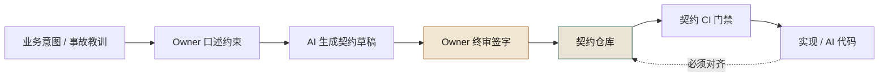
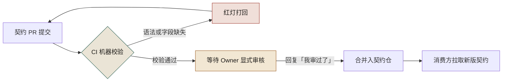
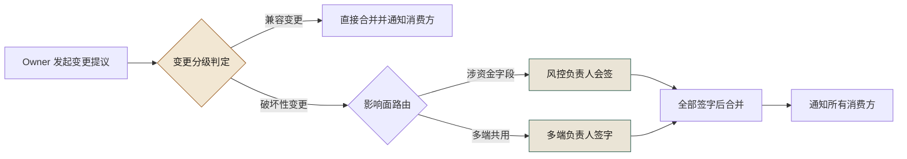

# 第 9 章 契约先行：OpenAPI、Protobuf、设计令牌

> **本章定位**：契约治理章。回答"谁为接口契约负责"这一组织问题，给出"具名 Owner + 签字权分离 + 变更分级"的机制化答案。
> **核心命题**：契约先行的第一步不是建仓库，是逼着每个域交出一个具名的责任人；AI 可以加速生成契约，但契约对不对只能由人审核。

> **本章回答第 2 章遗留问题**：介入点矩阵里"契约 Owner 谁当、风控签字人谁当"——本章给出逐域确定责任人的全过程。

---

## 9.1 问题：一次接口事故之后，去找每个域要"契约 Owner"，没人认

在一次典型的接口事故之后的第二天，治理组拿着一份名单去找各个业务域，名单上只有一栏需要填："**你们域的契约 Owner 是谁？**"

没有一个域当场填出来。

最常见的回答是："契约？我们域有 OpenAPI 文件，在仓库的 docs 里，谁写的不知道，现在谁维护也不知道。"有些域甚至连 OpenAPI 都没有，接口定义散在代码的注释和协作文档里。

这件事说明，那次接口事故的根子不是 AI 改错了接口，而是**全平台没有一个「契约的责任人」**。没有责任人，契约就成了无人维护的遗产——AI 改了实现没人更新契约，端上拿了旧契约去对接，不炸才怪。

后来治理组做的第一件大事，不是建契约仓库，是**逼着每个域报上一个契约 Owner 的名字**。这一步比建仓库难十倍，因为它不是技术问题，是权力问题——**谁当了 Owner，谁就要对这块契约负责，谁就有了变更签字权**。

---

## 9.2 根因：契约是孤儿，因为从来没人需要为它负责

为什么一个组织里会没有契约 Owner？因为在多数公司的激励结构里，**维护契约不产生任何可见的产出，于是没有人有动机去当这个 Owner**。

**① 维护契约是纯成本。** 写代码有提交量，发版有上线数，维护契约呢？什么都不算。所以没人抢着当 Owner。

**② 契约的影响是滞后的。** 契约没维护好，不会立刻出事——直到有一天 AI 改了实现、端上炸了，才知道契约早就漂了。**滞后的问题永远激励不足，因为它不进当前的 KPI。**

**③ 跨域契约没有"共同的老板"。** 某个核心域的接口被多个端共用，契约 Owner 该归这个域还是归多端？两边都觉得不是自己的事。**没有共同的老板，就没有共同的契约。**

三条根因，一句话：**契约失灵不是技术疏忽，是组织从未把"契约"提升到需要有人负责的地位。** 解决方案不是更好的工具，是给契约配上一个具名的人。

---

## 9.3 AI 用法：用 AI 生成契约，人审核契约

契约先行这件事，AI 反而是最好的加速器——前提是**人生成 → AI 加速 → 人审核**这个顺序不能颠倒。



**图 9-1｜契约先行流水线** — AI 加速草稿，签字权在人；实现对不上契约仓库就合不了。

**AI 在契约环节能做的：**
- 从一段接口描述生成 OpenAPI / Protobuf 初版（试点期部分域 70% 契约草稿是 AI 生成的）
- 从已有代码反推契约骨架（考古场景，配合第 7 章）
- 检测契约与实现的差异（辅助，不替代人工确认）

**AI 不能做的：**
- **判断契约对不对。** 它生成的契约经常漏错误码、把破坏性字段标成兼容——这正是各类接口事故的种子。审核必须人做。
- **决定契约的语义。** "这个字段是金额还是数量"，AI 猜得出来但不敢信，必须业务确认。

成熟实践定下一条规矩：**AI 生成的契约，必须在合并前经过契约 Owner 的显式审核**——不是"看一眼"，是在 PR 里明确回复"我审过了"。没有这句回复，PR 不能合并。

这条规矩在契约仓库的 CI 里落成了两道门：机器先校验格式，人再显式审核。



**图 9-2｜契约仓 CI 校验流程** — 机器校验挡住格式问题，Owner 显式回复挡住语义问题；缺哪一句，PR 都过不去。

---

## 9.4 角色博弈：契约 Owner 和签字权的两周拉锯

找各个域要 Owner 名单，花了整整两周。最难的不是没人愿意当，是**签字权归属谈不拢**。

**冲突一 · 涉资金域的契约 Owner。** 业务域 TL 说当然归他。风控负责人当场反对："这个域涉资金，契约变更必须我签字，那 Owner 凭什么不是我？" 两人僵了一下午。

**最后方案**：Owner 归业务域 TL（他负责日常维护），但**资金相关字段的变更，Owner 提议后必须风控负责人会签**——所有权和签字权分离。代价：业务域 TL 觉得自己只是个"管家"，风控负责人觉得自己的签字权被稀释成了"会签"。**两边都不满，但都能接受。**

**冲突二 · 多端共享契约 Owner。** 某个被多端共用的接口，服务端 TL 和多端负责人都想要签字权。多端负责人的话很直接："这个接口改一次，我多个端要发版，签字权不给我，我睡不好觉。"

**最后方案**：日常维护归服务端 TL，**破坏性变更必须多端负责人签字**（这条后来在第 27 章升级成了正式的"破坏性契约变更签字权"）。代价：服务端 TL 失去了破坏性变更的单方面决定权。

**冲突三 · 没有 Owner 的孤儿契约。** 有几个域实在没人愿意当 Owner——维护成本高、看不出绩效。最后治理组自己接了这些域的契约 Owner，代价是治理组的工作量直接翻倍。

> **两周拉锯的结果**：各域大多有了具名 Owner（含治理组代管的若干个），少数挂"待定"持续跟进。**这些名字，就是契约先行在全平台落地的起点。** 没有这些名字，建再好的契约仓库也没人维护。

---

## 9.5 产出物：契约治理规范 + 变更流程（指向附录 I）

本章的产出物已在附录 I（`21-契约治理规范模板.md`）中完整给出模板。核心要点：

- **双源契约**：OpenAPI（HTTP）+ Protobuf（RPC）
- **契约仓库唯一**，代码追契约
- **契约变更分级**：兼容性 / 破坏性
- **破坏性变更须签字**：多端签字归多端负责人，资金签字归风控负责人，时限 2 个工作日
- **每个契约一个具名 Owner**

把变更分级和签字权画成一条链，就是下面这张图：



**图 9-3｜契约变更签字链** — 兼容变更走快车道；破坏性变更按影响面路由签字人，签不齐就合不了，不让它默默上线。

> **代价声明**：契约治理规范上线后，新接口从"写代码"到"可对接"的平均时长从 0.5 天涨到 1.2 天——因为要先写契约、等人审。这笔时间成本写进了数字清单。一线工程师会抱怨："以前我接口写完就能用，现在我还得等一个人审我的契约。"——这话没错，但实践表明，**等一个人审，比炸了之后等回滚便宜。**

---

## 9.5b 操作步骤：把契约从文档变成会报警的工件

E-0311 之后第五天，治理组对着商品详情域的契约文件开了一个会。那个 YAML 写得像模像样——问题是**它不会报错，不会拦人，谁改了它也没有任何感觉**。这样的契约不是工件，是遗书：出事之后才有人翻。

把契约变成能执行的东西，从今早就可动手的七步：

1. **给契约文件选一个能跑 diff 的家。** 独立契约仓或契约子目录，前提是它能被 CI 触发。触发源是契约仓的 PR，不是"想起来才跑一次"。
2. **每条响应字段标三个属性：** `required`（必填）、`nullable`（可空）、`deprecated`（弃用中）。三者缺一，兼容判定就无法机器化，只能回到人嘴。
3. **金额一律 `amount` + `currency` 成对出现，禁止裸数值。** 字段名带单位后缀（`refundAmountYuan` 之类）视为红灯——单位写进名字，改单位就是改契约，谁都不记得。
4. **错误码表进契约。** AI 生成契约最常漏的就是错误码：没有错误码表的契约，等于告诉消费方"出错请随缘"。
5. **CI 挂兼容检查**（见 9.5c）。基线是主干上一份已发布契约，判定规则五条，写在门禁配置里，不写在人的记忆里。
6. **消费方从契约仓生成客户端代码，禁止手抄字段。** 手抄一次，就是给下一次白屏埋雷。
7. **给每个契约文件的第一行注释填具名 Owner。** 填不出名字的契约，进"孤儿契约"队列，按 9.4 的冲突三处理。

这套动作跑通一个域的代价大约是一个工程师的一天——拿一个非核心域练手，跑通再复制。**别拿商品详情域开刀，那是 E-0311 炸过的地方，第一次跑门禁你会先怀疑工具。**

---

## 9.5c 可抄工件：契约片段 + 兼容检查门禁

契约片段（示意字段，替换为你系统的真实接口）：

```yaml
# contracts/trade/order-refund.v2.yaml
# OWNER: 交易域 TL（张三）   ← 具名 Owner 写在文件头，机器和人都看得见
paths:
  /orders/{id}/refund:
    post:
      responses:
        "200":
          content:
            application/json:
              schema:
                type: object
                required: [refund_amount, currency, status]   # 必填字段删一个 = 破坏性
                properties:
                  refund_amount: { type: string, description: "十进制字符串，禁止浮点" }
                  currency:      { type: string, enum: [CNY] }
                  status:
                    type: string
                    enum: [SUCCEEDED, PROCESSING, REJECTED]   # 枚举缩窄 = 破坏性，加值 = 兼容
                    x-added-in: "2.1"                          # 增量字段带版本号，消费方好排查
                  coupon_gap:
                    type: integer
                    nullable: true                             # 新增必填不给默认值 = 端上老版本直接崩
                    x-added-in: "2.2"
        "409":
          description: "退款金额超过可退余额"                    # 错误码表进契约，AI 草稿最常漏这里
          content:
            application/json:
              schema: { $ref: "./errors.yaml#/RefundOverflow" }
```

兼容检查门禁（契约仓 CI，示意）：

```yaml
# .github/workflows/contract-compat.yml —— 基线是主干，不是上一次 PR
- name: 兼容性检查（破坏性变更直接红灯）
  run: |
    oasdiff breaking main.yaml head.yaml --fail-on ERR   # 工具出处见 docs/public-evidence.md 外链台账
    buf breaking --against 'https://git.example.com/contracts.git#ref=main'   # OpenAPI 管 HTTP，Protobuf 管 RPC，双源同闸
```

五条判定规则，写在门禁注释里，也写进契约仓 README：

| # | 变更 | 判定 | 依据 |
|---|------|------|------|
| 1 | 新增可选字段（带默认值/可空） | 兼容 | 老客户端不读它也能活 |
| 2 | 新增必填字段且无默认值 | **破坏性** | 老客户端构造不出合法请求 |
| 3 | 删字段 / 把可空改成必填 | **破坏性** | E-0311 的直接成因就是这个 |
| 4 | 枚举缩窄、错误码删除 | **破坏性** | 消费方按旧集合写的分支会走进死路 |
| 5 | 路径改名 | 先加新名、旧名标 deprecated、双跑一个发版周期后删 | "删旧"本身就是破坏性变更，要单独排期 |

**破坏性变更不是不许有，是不许静悄悄有。** 判定为破坏性的 PR 自动打 `breaking` 标签、路由到对应签字人（图 9-3 那条链），标签缺了门禁不让合。

---

## 9.5d 度量与反例：契约先行最容易烂在哪

| 指标 | 怎么测 | 阈值 | 谁看 | 多久看一次 |
|------|--------|------|------|-----------|
| 契约一致率 | CI 定期回放：实现实际返回 vs 契约声明 | 治理前从未度量（估低于六成），治理后爬到 97.4%（数字清单口径）——先测出来，再谈爬 | 治理组 | 周 |
| 破坏性变更占比 | `breaking` 标签 PR / 契约 PR 总数 | 稳定非零 = 分级在真判；持续为零 = 怀疑全员把破坏性报成兼容 | 契约 Owner | 月 |
| 兼容门禁拦截数 | CI 红灯次数 | 长期为零先查门禁还活着没有，再表扬团队 | 治理组 | 月 |
| 契约漂移存活时长 | 从"实现与契约不一致"出现到被 CI 发现的时长 | 经验阈值：不超过一个发版周期——这条线是拍的，用于起手，不是标准 | 域 TL | 月 |
| 孤儿契约数 | Owner 字段为空的契约文件 | 挂"待定"可短期存在，无人认领必须进治理组代管队列 | 治理组 | 周 |

**契约先行烂掉的第一个信号：契约是 AI 从实现反推出来的，之后再没人动过。** 反推不是原罪——考古场景本来就要反推（第 7 章）——罪在反推完不立 Owner、不挂门禁，于是契约沦为代码的化石记录，永远"正确"，永远没用。

第二个信号：**门禁设成了 warning。** CI 里黄灯亮起、PR 照样合并，两周后没人再看那行输出。兼容检查要么红灯挡路，要么等于没有。

第三个信号最隐蔽：**Owner 用 AI 秒审自己的契约。** 自己提议、自己回复"我审过了"——两道门（图 9-2）塌成一道。对策是签字权分离的机器化：契约 PR 的作者与审核人 GitHub 账号相同时，CI 直接拒绝。多花的那一分钟，就是"契约先行"和"契约表演"的全部区别。

---

## 9.5e 工具落地卡：图 9-1 里只有"CI 机器校验"这一格能整段抄

图 9-1 那条流水线五格，前四格（意图、草稿、终审、入仓）全靠人的语义判断，抄不动；唯一能整段抄进 CI 的是"契约 CI 门禁"那一格。下面两张卡按第 4 章 4.5c 定的口径写（版本口径 / 配置落点 / 最小可抄配置 / 跑完看哪条输出 / 替代不了什么），**报错原文是 2026-09-24 在指定版本上真实跑出来的**——不是你环境里的版本，抄之前先对齐 `--version`，卡里的字符串才会一字不差地复现。

### 卡 · OpenAPI 3.1 + openapi-generator-cli（挡格式的那道门）

**版本口径**：规范锁 OpenAPI Specification 3.1.1（官方 Releases：3.1.1 发布于 2024-10-24，3.1.2 与 3.2.0 同在 2025-09-19，3.2.1 在 2026-09-10）；工具链 openapi-generator 7.25.0（2026-08-24）+ npm 包装器 `@openapitools/openapi-generator-cli` 2.41.0，官方 README 要求 `java` 在 PATH 上、最低 JDK 11，本卡实测跑在 OpenJDK 17。

**配置落点**：契约正文进 `contracts/{domain}/{service}/{version}/openapi.yaml`；**生成器版本另放一个文件 `openapitools.json`，必须和 `package.json` 同级**，官方 README 明写要把这个文件提交进版本库。文件名就是 `openapitools.json`——网上流传的 `openapi-generator-cli.json` 是旧叫法。

```json
{
  "$schema": "./node_modules/@openapitools/openapi-generator-cli/config.schema.json",
  "spaces": 2,
  "generator-cli": { "version": "7.25.0" }
}
```

**最小可抄配置**（`openapi.yaml`）：

```yaml
openapi: 3.1.1            # 必填：规范的 Fixed Fields 表把 openapi 标为 REQUIRED
info:
  title: Book API         # 必填：info.title / info.version 各自 REQUIRED
  version: 0.1.0
paths:                    # 3.1 起 paths 本身不再 REQUIRED，但本书场景必须写：
  /shelves:               #   没有 paths 就没有可 diff、可 codegen 的接口面，CI 会"通过"一份空契约
    get:
      operationId: listShelves   # 实践必填：codegen 拿它当函数名，缺了就退化成 getShelves200
      responses:
        "200":
          description: ok        # 必填：responses 里唯一硬要求的字段，缺了 validate 直接报错
          content:
            application/json:
              schema: { type: array, items: { type: string } }
```

**跑完看哪条输出**：

```text
$ npx @openapitools/openapi-generator-cli validate -i .../openapi.yaml
Validating spec (contracts/example/book/v1/openapi.yaml)
No validation issues detected.                    ← 绿灯就抓这两行，退出码 0
```

```text
Errors:
	- attribute paths.'/a'(get).responses is missing

[error] Spec has 1 errors.                        ← CI 里 grep「[error] Spec has」，退出码 1
```

- 悬空 `$ref` 同样落在 `[error] Spec has 2 errors.` 这一行下面，两行分别报 `...schema.#/components/schemas/Nope is missing` 和 `Could not find /components/schemas/Nope in contents of ...`——机器能精确指到引用断在哪。
- `generate` 时如果吃的是 3.1 契约，第一行固定是这句警告，可以直接 grep 断言：**警告行 `OpenAPI 3.1 support is still in beta.` 逐字如此**（还带 issue 链接）。这是选 3.1 的代价，写在选型文档里，别到 CI 日志里才发现。
- 契约不合法时 `generate` 直接抛 `SpecValidationException: There were issues with the specification.`，紧跟 ` | Error count: 1, Warning count: 0`。**不要用 `--skip-validate-spec` 绕过它**——绕过之后生成物会安静地长成错的样子。
- 缺 Java 时（CI 镜像最常见的坑）报 `Error: /bin/sh: 1: java: not found`。
- 一个占位符坑：用配置文件驱动 `generate` 时，`#{name}` 解析成**输入文件名（不含扩展名）**，不是你在配置里给生成器起的名字——`"#{cwd}/generated/#{name}"` 会落到 `generated/openapi/` 而不是 `generated/book-api/`。

**替代不了什么**：它是接口的**语法与结构守门员**——字段漏写、`$ref` 指错、`responses` 缺失都过不去。它拦不住**语义兼容**：把 `value` 从 `details` 里挪出来，validate 照样全绿；也拦不住契约与实现不一致。那两件事分别是 9.5c 的 `oasdiff breaking` / `buf breaking` 和契约测试的活（**注意**：这两条命令的判据输出本卡没有实测过，未核实的字符串就不写进书；它们在 CI 里以红灯为准，行为以你自己的版本跑一遍再定）。

### 卡 · Protocol Buffers / protoc（RPC 那一源）

**版本口径**：protoc 36.2（2026-09-17 发布，本卡报错全部在它上面跑出），`protoc --version` → `libprotoc 36.2`；语言口径 proto3 或 `edition = "2023"`（官方：Edition 2023 是合并 proto2/proto3 的基线）。protobuf 的官方 LTS 版本号：**未核实**。

**配置落点**：protoc **没有配置文件**——`-I/--proto_path`、`--python_out`、`--plugin=` 全走命令行或 CI 脚本，版本锁由下载的 `protoc-<version>-<os>-<arch>.zip` 文件名承担。`.proto` 是唯一工件，官方文档原话是"不要把 .proto 和其他语言源码放在同一目录"，所以它进契约仓（`contracts/{domain}/{service}/{version}/proto/*.proto`），不进业务仓。

**最小可抄配置**（`shelf.proto`）：

```proto
syntax = "proto3";              // 必须是第一个非空非注释行；漏写时按 proto2 处理
package book.example.v1;        // 语言无关命名空间，别拿 Java 包名当目录
option go_package = "example.com/book/pbv1;pbv1";  // 只有 Go 生成需要；删了 --go_out 直接失败
message ShelfRequest {
  string user_id = 1;           // 字段号是线格式身份，上线后不可改（改号 = 删字段 + 建新字段）
  repeated string tags = 2;
  enum Status {
    STATUS_UNSPECIFIED = 0;     // proto3 枚举必须有 0 值当"未设置"
    STATUS_ACTIVE = 1;
  }
  Status status = 3;
  reserved 4, 5;                // 删字段后必须留号：protoc 会拒绝复用
  reserved "legacy_flag";       // 名字也要留，防同名字段复活
}
```

**跑完看哪条输出**：

1. `protoc --python_out=gen shelf.proto` **什么都不打印，退出码 0**。这一条对本书所有门禁脚本都关键：**protoc 的成功是静默的**，判据只能是 `exit 0` + 产物存在（`gen/shelf_pb2.py`）。要"看得见"的比对工件就用 `protoc --descriptor_set_out=gen/desc.bin --include_imports shelf.proto`，把 `desc.bin` 存成 CI artifact 才能 diff。
2. 复用已 reserved 的字段号：`shelf.proto:2:22: Field "b" uses reserved number 2.`（下一行还给建议号），退出码 1——grep `uses reserved number`。
3. 字段号撞号：`Field number 1 has already been used in "M" by field "a". Next available field number is 2.`
4. proto3 里写 `required`：`Required fields are not allowed in proto3.`；名字被 reserved：`Field name "a" is reserved.`；类型没定义：`"Missing" is not defined.`
5. 插件没装（CI 镜像第二常见的坑），grep `program not found or is not executable`：

```text
protoc-gen-go: program not found or is not executable
Please specify a program using absolute path or make sure the program is available in your PATH system variable
--go_out: protoc-gen-go: Plugin failed with status code 1.
```

**替代不了什么**：protoc 是**编译器级别的类型门禁**，同名字段、复用号、未定义类型、插件缺失全都编不过。但它只对"这一份 .proto 能不能编译"负责：`string user_id = 1` 改成 `int32 user_id = 1` 一样编译通过，线上才是事故——跨版本兼容性要靠 `--descriptor_set_out` 产物加独立的 breaking 比对工具，那一半不在本卡口径内。

> **抄卡片的顺序**：先 `--version` 对齐，再跑一次"故意写坏"的那条（删掉 `responses`、复用 reserved 号），**看见红灯才算门禁活着**。这一步花五分钟，正好对上 9.5d 的第二个信号——没被故意触发过的门禁，和设成 warning 的门禁是同一件事。


---

### 四案例映射

本章"契约先行"机制在四个案例中的具体落地形态：

| 案例 | 契约形态 | Owner 归属 | 破坏性变更签字权 |
|------|---------|-----------|----------------|
| 案例一·电商平台 | 多端共享契约（商品详情等接口被多端共用） | 业务域 TL | 多端负责人签字 |
| 案例二·加密交易所 | 涉资金交易契约（OpenAPI + Protobuf 双源） | 交易域 TL | 风控负责人会签 |
| 案例三·Web3量化 | 策略/数据源契约（行情、信号、下单接口） | 量化团队负责人 | 量化 + 风控双签 |
| 案例四·安全初创 | 安全合规契约（审计、权限、日志接口） | 安全团队负责人 | 合规负责人会签 |

---

## 9.6 检查清单

- [ ] 你的每个接口契约，能不能当场说出一个具名的 Owner？说不出 = 契约是孤儿。
- [ ] Owner 和签字权有没有分离？资金相关的契约，风控有没有签字位？
- [ ] 破坏性契约变更，有没有一个"离端最近的人"持有签字权？
- [ ] 契约是先于代码写的，还是代码写完后补的文档？后者 = 不是契约先行。
- [ ] AI 生成的契约，有没有强制经过人的显式审核？没有 = 接口事故的种子已埋下。

---

## 9.7 反模式

| # | 反模式 | 后果 |
|---|--------|------|
| 1 | 契约无 Owner | 漂移无人维护，端上迟早炸 |
| 2 | Owner 包揽所有签字权 | 跨域涉资金时该签字的人被绕过 |
| 3 | 先写代码后补契约 | 契约沦为代码的注释，一定过期 |
| 4 | AI 生成契约不经人审 | 漏错误码、误标兼容性 |
| 5 | 所有变更都需全员签 | 签字链太长，治理被拖垮 |

---

## 9.8 遗留问题

- **契约仓库本身怎么治理？** 契约成了事实来源，那契约仓库的权限、版本、Owner 更替，就成了新的治理对象。治理会无限套娃——这条留给读者和第 25 章。
- **破坏性变更的分级判定能不能自动化？** 现在是契约 Owner 人工判。AI 辅助判定的准确率够不够？留给第 24 章。
- **老版本 App 的契约兼容怎么办？** 契约变了，线上老版本还在用旧契约。这是第 17 章（多端 BFF）要回答的。

---

> **本章的一句话**：契约先行的第一步不是建仓库，是**逼着每个域交出一个具名的责任人**。工具可以买，仓库可以建，但"谁为这份契约负责"这个问题，永远只能由人来回答。**没有 Owner 的契约，就像没有房东的房子——住着住着就塌了，塌了还找不到人修。**
