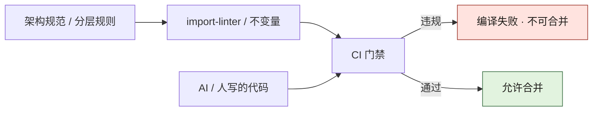
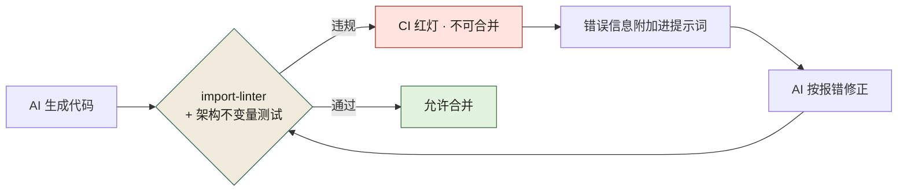
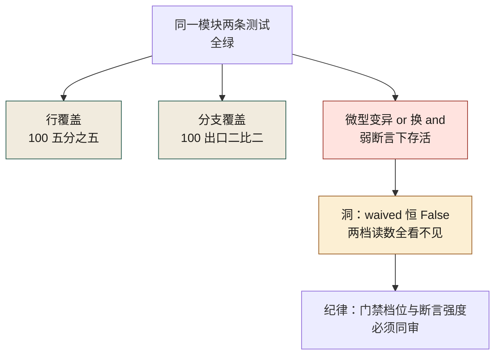

# 第 10 章 把边界变成测试：import-linter 与分层不变量

> **本章定位**：架构边界章。回答"规范为何挡不住代码"这一问题，给出"把架构规范翻译成不变量测试、接入 CI、违规即编译失败"的机制化答案。
> **核心命题**：架构边界不是画出来的，是测出来的；与其告诉 AI "请遵守架构规范"，不如让架构违规变成 AI 能读的编译错误。

> **本章回答第 11 章遗留问题**："该不该留缝"能否做成自动化扩展点检查清单——本章给出"架构不变量测试"这一机制化答案。

图 10-1 是两路汇一口：上路把架构规范翻译成 import-linter 不变量接进 CI，下路让 AI 与人写的代码流向同一道门禁；门禁出口只有两个——违规即编译失败、不可合并，通过才允许合并，中间没有"事后整改"那条路。



**图 10-1｜边界测试门禁** — 规范挡不住进度压力；必须让违规在 CI 变红。

---

## 10.1 问题：架构规范发了三个月，违规还在悄悄涨

架构规范发布之后，团队本预期至少新代码会好一些。可在规范发布三个月后抽查某业务域的新提交，架构违规率还有 12%。

有一条提交很有代表性。一线工程师在应用层写了一段直接查数据库的代码——绕过了服务层。被叫来问时，他很坦白："我知道规范说不能这么写，但服务层那个接口不支持我要的字段，我懒得等人加，直接查库省事。"然后补了一句："**而且规范又不会编译报错，我这么写了照样能跑。**"

他说到了点子上。**规范是文件，文件挡不住代码。** 真正能挡住代码的，只有另一段代码——一段让你编译不过、测试不过、合并不了的代码。

于是治理组的架构师做了一件事：**把架构规范翻译成 import-linter 规则，接入 CI，违规即编译失败。** 一周后上线，首周就在试点域拦下了 47 处违规。

---

## 10.2 根因：人类自律 vs 机器拦截，差着一个量级

为什么"发了规范"不等于"守了规范"？

**① 自律是有波动的，机制是恒定的。** 一线工程师不忙的时候会遵守规范，赶需求的时候就忘了。但 CI 不会因为赶需求就放行——**它不在乎你急不急，它只在乎你违规没违规。**

**② 规范是事后追溯，拦截是事前预防。** 等治理组抽查发现违规，代码已经合并了。而 import-linter 在 PR 阶段就拦住，违规根本进不了仓库。**事后追溯的成本是整改，事前预防的成本只是改一行。**

**③ AI 没有规范意识，但能理解编译错误。** 跟 AI 说"请遵守架构规范"，它答应了然后照样违规。但让它生成的代码过一次 import-linter，它编译失败了，在提示词里附上错误信息，它就会修正。**AI 不懂规范，但它懂报错。**

---

## 10.3 AI 用法：让 AI 在不变量的围栏里生成

这一节的核心认知：**与其告诉 AI "请遵守架构规范"（它做不到），不如让 AI 生成的代码自动经过不变量测试，失败了就把错误信息喂回给它（它能做到）。**

工作流是这样的：

```
1. AI 生成代码
2. 代码经过 import-linter + 架构不变量测试
3. 若失败 → 错误信息自动附加到下一轮提示词
4. AI 根据报错修正
5. 循环直到通过
```

这个闭环的好处：**不需要教会 AI 架构，只需要让架构违规变成 AI 能读的错误信息。** 这比写一万字的"架构指南"塞进提示词有效得多。图 10-2 里回路只有一条：CI 红灯之后，错误信息整段附加进下一轮提示词、AI 按报错修正、再折回门禁；每一次红灯都必须走完这条回路，唯一的离场出口是「通过 · 允许合并」。



**图 10-2｜违规从红到修的闭环** — 不教 AI 架构，只把报错喂回提示词；红一次修一次，直到通过才放行。

同理，第 11 章问的"该不该留缝能不能自动化"，这里给出半个答案：**扩展点的检查，可以被翻译成一种不变量——"资金链路的模块必须暴露风控钩子接口"，用测试来判定有没有留。** 有钩子位就过，没有就拦。这样"留缝"就从"某个人的判断"变成了"一道编译期的检查"。

当然，不是所有缝都能自动化判定——"这个模块未来可能需要扩展到什么程度"仍然需要人判断。**自动化能保证的是"必须留的底线缝"（如风控钩子），不能保证的是"最好留的弹性缝"。** 后者还是人的活。

---

## 10.4 角色博弈：拦下别人的代码，等于挡别人的需求

import-linter 上线第一周，47 处违规被拦。一线工程师的怒气直接冲到治理组办公室。

"你们的 linter 把我三条 PR 全挡了。我这周五要上线，你让我怎么办？"

这种愤怒是合理的——**对一线工程师来说，被拦下的不是"违规"，是"需求"。** 挡了他的 PR，就是挡了他的交付，就是动了他的 KPI。

最后各方谈了一个过渡方案：**违规分两类——硬违规（跨层依赖、循环依赖）必须当场修复，没有例外；软违规（命名规范、层的内部结构）给两周过渡期。** 被拦的三条 PR 里有一条是硬违规，当晚改了；另两条是软违规，给了过渡期。

**这个分级让 import-linter 没有被一线联手推翻。** 如果一开始就把所有违规都设成"编译不过"，一线会联合抵制，工具推不下去。分级后，硬违规铁腕、软违规弹性，**治理组让出了软违规的执法权，换来硬违规的零容忍被接受。**

> **代价声明**：import-linter 接入后，试点域的 PR 平均合并时长增加了 18 分钟（因为要等 linter 跑完、有时要修正）。这笔时间进入了开发流程的固定成本。**但没有这 18 分钟，跨层依赖式的违规就会继续悄悄进仓库。**

---

## 10.5 产出物：组织级不变量清单

可落地的一份清单，每条不变量对应一条 import-linter 规则或测试：

| 不变量 | 判定方式 | 级别 | 责任人 |
|--------|---------|------|--------|
| 依赖单向（应用→服务→包） | import-linter | 硬违规 | 架构组 |
| 跨域只走服务层对外接口 | import-linter | 硬违规 | 各域 TL |
| 资金链路模块暴露风控钩子 | 接口存在性测试 | 硬违规 | 风控 + 域 TL |
| 无循环依赖 | 依赖图分析 | 硬违规 | 架构组 |
| 契约与实现一致 | 契约测试 | 硬违规 | 契约 Owner |
| 层内模块结构合规 | import-linter（软） | 软违规 | 域 TL |

> **代价声明**：这份清单维护本身需要人——架构组每周花半天审查"新增的不变量需求"，因为每发现一种新的违规模式，就要加一条新规则。**不变量清单是活的，它会一直长。**

### 可抄工件：一条不变量在 CI 的哪一步

清单要能被抄，得落到具体位置。三件事：**规则文件、流水线位置、红灯的读法**。

```yaml
# PR 流水线（示意：顺序即反馈速度，别并行成一坨）
steps:
  - name: 契约测试            # 先跑：它拦的是最危险的多端不一致
    run: make contract-test
  - name: 分层不变量
    run: lint-imports --config .importlinter --verbose
    # verbose 必开：只给模块对，AI 与人拿不到行号，下一轮只能猜
    # 报错整段贴进下一轮提示词，不摘录——摘录会截掉"哪一层不许 import 哪一层"
  - name: 单元测试
    run: make test
```

规则文件本身第 8 章给过（`.importlinter` 的 layers / forbidden 契约）。本章补的是**位置**：不变量必须挂在 PR 流水线、必须在合并前、必须不可跳过。**挂在 nightly 上的 lint 不叫门禁，叫晚报。**

红灯三行读法，输出结构固定，看行顺序别跳：

| 看哪一行 | 决定什么 | 为什么先它 |
|---|---|---|
| 报头的契约名 | 分级（硬 / 软） | 契约名把分级写死（如 `硬-分层单向`、`软-包内结构`），CI 按名字取级别——**分级写在规则名里，不写在人脑里** |
| 中间的模块对（谁 import 谁） | 谁被叫来 | 源模块属于哪个域，那位域 TL 到场；撞上不可碰符号，架构组与风控同席 |
| 底部的行号 | 改哪里 | 最后才看 |

**先照第三行动手的人，会把违规改成另一处违规**——他修的是那行 import 的写法，不是那条依赖的方向。

### 红灯 playbook：一次红跑从触发到关闭

| 红灯类型 | 第一动作 | 谁 | 关闭判据 | 不许做 |
|---|---|---|---|---|
| 新代码触发硬违规（跨层 / 循环） | 改结构，不是改写法 | 提交人 | 该契约回到 KEPT，评审看到新提交 | 往配置里加例外绕过 |
| 历史违规被顺手清掉（白名单变短） | 允许，直接合 | 提交人 + 架构组 | 白名单条目数 −1 | 把还债记成产能写进汇报 |
| 软违规落在过渡期内 | 登记到期日 | 域 TL | 过渡表里有日期且未过期 | 悄悄续期 |
| 规则误拦合法 import | 收窄规则或改写契约 | 架构组（24 小时内出 PR——这条线是拍的） | 规则 PR 合并并留 ADR | 让提交人"先例外过去，回头再修" |
| 契约测试与不变量测试同时红 | 先修契约 | 契约 Owner | 两条都绿 | 用 skip 标记跳掉其中一条 |
| 变异抽验出现存活体（测试无牙） | 先补断言，不补调用量 | 测试作者（AI 产物则回喂模板） | 该文件抽验存活数归零 | 往弱断言里塞 `assert True` 凑杀 |

最后一行是本章的取舍，也回答 10.8 那条遗留问题：**两条同时红，先修契约。** 契约拦的是多端不一致，事故半径最大——E-0311 那次的形状就是接口改了而契约仓库没动，三端白屏。**顺序写进 playbook，比在会上靠人记靠谱。**

### 一次红跑的完整经过

拿 10.1 那 47 处里最典型的一处走一遍（**钟点是示意，用来讲清动作顺序**；试点域按案例时间线是营销域）：

- **T+0**——一线工程师赶周五上线，在应用层直接 import 了包层的仓储模块，为的是多取两个字段。契约测试绿，分层不变量红：契约名"分层单向"，模块对是"应用层 → 包层"，行号落在他新写的那一行。
- **T+5 分钟（分级）**——流水线按契约名把这条判成硬违规，不给过渡期。他的第一反应是去配置里加例外，但那一行有 ADR 校验：加了例外，红在另一个检查上。
- **T+30 分钟（叫人）**——域 TL 到场。他要问的不是"你为什么不守规范"，是"服务层那个接口为什么不支持这两个字段"。答案是要改服务层对外接口——这已经是一次契约变更。
- **T+2 小时（真正的修法）**——按第 9 章提一次 MINOR，AI 生成契约草稿，契约 Owner 审核签字（试点期实测单条平均约 22 分钟，见案例时间线），再让 AI 在契约骨架内重写应用层那段。
- **T+次日**——lint 回到 KEPT，白名单条目数没变，PR 合并。上线比原定晚了半天。

**这一次红跑花的不是 18 分钟，是半天。** 10.4 的代价声明只记了 CI 时间，没记"违规背后那个接口本来就该改"：红跑的真实成本，是把一件本该在契约上办的事提前逼到了台面上。**它仍然划算——换来的不是省时间，是那个跨层依赖没进仓库、没在三个月后被第二个人照着抄。**

### 度量与反例：这道墙有没有真的立住

| 指标 | 怎么取数 | 起手的线 | 谁看 | 这条线怎么来的 |
|---|---|---|---|---|
| 硬违规拦下数（绝对数） | lint-imports 失败记录 | 不为 0 才算机制在跑；长期为 0 先查规则是否被架空 | 架构组 | 判断题 |
| 白名单条目数 | 配置 diff | 只减不增 | 治理组 | 沿用第 8 章同一口径 |
| 新增例外条数 | PR diff | 每条必须挂 ADR，无 ADR 即打回 | 治理组 | 定义，不是阈值 |
| 红到合并的中位耗时 | CI 时间戳 | 只看趋势，不设线 | 域 TL | 早期分母不稳，设线只会逼出造假 |
| 清单新增条数 | 上表清单的 diff | 每季度有新增 | 架构组 | 经验阈值：一条不加 = 没在发现新违规模式 |
| 漏网违规数 | 季度抽查新提交 | 趋零 | 治理组 + 域 TL | 判断题；抽样法见附录 J 的抽检记录 |

**三种最常见的走样**：

1. **把"拦下数"当 KPI 派给一线。** 一线不会从此少写违规代码，他会学会写例外和忽略标记：分母被藏起来，报表上的违规率归零，仓库一点没变干净。**这条指标只能自证机制在跑，不能用来考核人。**
2. **一次把全部规则设成硬拦。** 第一天满屏红，工单全压到治理组，一周后整套规则降级成"提醒"——**从一条规则一个域开始、加到出现抵触为止，比一次给满再退回更快立住**（10.4 的分级就是这么换来的）。
3. **只挂 nightly 不挂 PR。** 违规在合并之后才被发现，10.2 说的"事前预防"当场退回"事后整改"，而且整改成本已经乘上了这段时间里依赖它的人数。

### 10.5c 属性测试与 shrinking：给 AI 一个"普适命题"去拆（规范档）

样例测试考的是"这几个输入下对不对"，属性测试考的是"**所有输入下这条命题成不成立**"。对 AI 生成的代码，这正好打它的七寸：它擅长写出通过已知样例的实现，不擅长扛住随机轰击。写法（hypothesis 规范形状）：

```python
from decimal import Decimal
from hypothesis import given, strategies as st

amounts = st.decimals(min_value=0, max_value=Decimal("1000000"),
                      places=2, allow_nan=False, allow_infinity=False)

@given(a=amounts, b=amounts)
def test_refund_never_creates_money(a, b):
    """不变量：退款额不得超过可退余额，且金额保留两位小数。"""
    r = compute_refund(order_amount=a, refund=b)
    assert r.refunded <= a
    assert r.refunded == r.refunded.quantize(Decimal("0.01"))
```

找到反例时，框架会做 **shrinking**：把输入往最小了缩（137.55 → 0.01），打印出那行 `Falsifying example: test_refund_never_creates_money(a=..., b=...)`——最小反例是给 AI 回喂修正的最好输入：短、确定、不带噪声。

**hypothesis 本机未安装（pip3 可装，但本书未装未跑），本节全部内容按规范写**：上面的装饰器、strategy 构造与 `Falsifying example` 报告形状都是该库文档口径，**不要向任何人引用本节作为"跑过"的证据**；装好后第一件事是拿一条故意写错的 `compute_refund` 验红。三条纪律：

1. **断言必须是普适命题。** 写成"这单退款是 70"就退化成带随机数的样例测试，白跑。
2. **种子样例先行。** 把 10.5 清单里每条不变量的边界值登记为显式样例（hypothesis 的 `@example` 装饰器），随机流之外保底——红线值最常在边界翻车，随机流恰恰最难命中边界。
3. **属性测试也要自证有效。** 把实现改坏一条（去掉上限或量化判断），属性必须红；不红的属性测试先怀疑命题写成恒真或过弱——和 10.5d 要抓的无牙测试是同一类东西。

AI 在这里的位置：给它不变量语句（10.5 清单行），让它补 strategy 与 property——strategy 的**窄化**是它的弱项，常默认生成过宽输入（NaN、负零、超长字符串），把域定义表抄进 prompt 才能约束住。

### 10.5d 变异测试：AI 写的测试到底有没有牙齿（规范档）

先说清楚口径：**mutmut / cosmic-ray 未在本机安装，本节按工具机制的规范口径写，未本机复跑；下面三个示例分数是构造的教学数字，不是任何项目的实测。**

覆盖率证明"代码被执行过"，属性测试证明"命题在随机输入下成立"，但两者都不直接回答那个最要害的问题：**如果把实现偷偷改坏，现有测试会不会红？** 变异测试的做法：对源文件做最小改动（`>=` 改成 `>`、`+` 改成 `-`、删一个分支、把常量改成邻近值），每改一处叫一个**变异体**，重跑测试套件——红了叫 killed（测试有牙齿），绿了叫 survived（测试对这个洞是瞎的）。三个典型分数形状：

| 变异分数 | 形状 | 结论 |
|----------|------|------|
| 约 100%（示意） | 每个变异体都有测试变红 | 牙齿齐——但先查等价变异是不是太多（下一段） |
| 约 60%（示意） | 核心路径的变异体活着 | 测试只跟着 happy path 走，边界与失败分支无人守 |
| 0% 且覆盖率 100%（示意） | 所有变异全绿 | 极端形态：断言只验类型不验值——典型 AI 讨好式产物 |

为什么它是**最直接**的度量：行覆盖、分支覆盖、属性覆盖都在测"测试的执行面"，只有变异测试测"测试的判定力"。10.5 清单加一行，正是把这条纪律立成不变量：**凡新增 AI 生成的测试文件，抽验变异，存活数 > 0 即整改。**

两个必须知道的边界：

- **等价变异是天花板。** `if x >= 0` 改成 `if x > -1`，对整数输入行为完全相同——变异体"存活"是正确行为，分数天然到不了 100%。分数解读要留这个折扣，也别拿满分逼团队手写假断言。
- **成本随规模爆炸。** 变异体数 ≈ 改动点数 × 测试套件时长，大仓上全量跑不现实。落地形状：新文件全量抽验、历史文件按月抽样，**当趋势指标，不当 PR 硬门**。

### 10.5e 覆盖率三档：行、分支、断言，各自怎么骗人（本机实跑）

组织一旦把"覆盖率 ≥ X%"设成门禁，最先进化出来的不是更好的测试，而是**更会刷覆盖率的测试**——AI 尤擅此道，因为它优化的就是"过这道门"。所以门禁设在哪一档之前，先看清每一档的骗法。下面这个四行小函数是真靶：

```python
# /tmp/ch15cov/refund.py —— 示例模块（教学用），三条纪律里它只当活靶
def apply_refund(payable, refund, waived=False):
    fee = 0
    if waived or payable - refund >= 0:
        fee = payable - refund
    return fee
```

两条测试：`apply_refund(100, 30)`（正常退款）和 `apply_refund(100, 300)`（超额退款）。用 `sys.settrace` 记行、`ast` 枚举分支出口，本机实跑读数：

```text
LINE   100.0%  语句行 5/5 被执行
BRANCH 100.0%  if 出口命中 2/2
COND   waived=True 这条路：被 or 短路吞掉，上面两级读数都看不见
```

**口径如实写**：本机没有 coverage.py（`python3 -m coverage` 报无此模块），上面是手搭量具——`sys.settrace` 记执行行、`ast` 枚举 If 节点两出口；它和 coverage.py 的语句集不完全一致（装饰器行、docstring 的计入与否各有口径），**读"两档都 100%、洞还在"这个形状，别把它当 coverage.py 的读数抄**。

三档各自的骗法，对着这份读数看：

| 档位 | 回答的问题 | 骗法（都发生在读数 100% 的时候） |
|------|------------|--------------------------------|
| 行覆盖 | 每行被执行过吗 | 只调用、只构造对象、一条断言不写——分母满格。AI 讨好式测试的标准形态 |
| 分支覆盖 | 每个判断的真假出口走过吗 | 复合条件短路：本例 `waived` 恒 False 也拿满分——分支档数的是 if 出口，不是每个原子的取值 |
| 断言档（变异代理） | 改坏实现测试会红吗 | 这档反过来**只**回答判定力：执行面为零的函数它看不见，等价变异还会压低分数——没有哪一档能替另一档站岗 |

拿同一个靶子真跑一次微型变异（本机实跑，纯标准库，不是 mutmut）：把 `or` 换成 `and` 造一个变异体，分别喂给两套测试——

```text
变异 or->and   弱断言测试: 存活
变异 or->and   强断言测试: 被杀
基线不变       弱断言测试: 存活
```

弱断言（只判 `>= 0`）的两条测试行覆盖 100%、分支 100%，变异体照穿——**这就是"AI 写的绿灯测试"的物理形状**；强断言（`== 70`）当场杀死它。三档读数、一个洞、一次回杀，图 10-3 把它画成一条阶梯：



**图 10-3｜三档覆盖各漏什么** — 行与分支两档同时 100% 时，短路的条件值仍可以是零测试；变异档是唯一直接量断言强度的尺，但它也不替前两档站岗。

治理落法就一句：**覆盖率门槛只当"下限报警器"（跌破查执行面），断言强度用变异抽验兜（存活数 > 0 即整改）——两道都挂，缺一道，另一道的绿都可以被刷出来。**

### 10.5f pytest 扩展点：把本章的自定义检查挂进采集器（本机实跑）

上面所有门最终都长在测试框架的钩子上。pytest 的自定义检查有两个必用扩展点，各配一条防呆：

**① 注册 marker 加 `--strict-markers`。** `markers` 里登记过的标记才合法；没登记的拼写错误直接报错而不是静默忽略。本机实跑一个拼错的标记：

```text
'slow2' not found in `markers` configuration option
ERROR test_sample.py - Failed: 'slow2' not found in `markers` configuration o...
!!!! Interrupted: 1 error during collection !!!!
```

这个形状要会认：**收集期 error、0 个测试跑过、退出码非零**——它是"标记 typo 静默放行"唯一的解药。本章清单第五行（契约与实现一致）那条，AI 生成的测试漏打 `contract` 标记就静默跳过契约检查——解药就是这道。

**② `pytest_runtest_call` 钩子前置自定义检查。** conftest 里这个钩子跑在每个测试函数调用之前——拿源码做 AST 检查的挂点。本机真写了一个"无断言测试不计入门禁"的检查器，跑出来的失败原文（本机实跑）：

```text
        if not (has_assert or has_raises):
>           pytest.fail("自定义检查：无断言测试不计入门禁——补一条真断言再跑")
E           Failed: 自定义检查：无断言测试不计入门禁——补一条真断言再跑

conftest.py:17: Failed
=========================== short test summary info ============================
FAILED test_sample.py::test_fluffy - Failed: 自定义检查：无断言测试不计入门禁...
1 failed, 1 passed in 0.01s
```

被测的 test_fluffy 里没有任何 `assert`，被 conftest 的 AST 检查当场拦下。

三个失效面要背下来：钩子**只覆盖 pytest 路线**——同一条检查挂在 unittest 的 runner 上就全体失效；`pytest.fail` 在收集期与运行期行为不同，放错阶段会静默不执行；`-p no:cacheprovider` 之类的插件开关一线排障时会顺手加，**加上的那一刻自定义门就关了**——CI 命令行要锁死，别留"本地能跳过"的口子。顺带一提：`-k` 与 `--deselect` 同属这类"能静默卸门"的开关，门禁脚本只认最终收集到的测试数（`--collect-only -q` 数行数），不认"命令跑完了"。两条门要常驻，就得把开关本身钉进仓库配置——`pytest.ini` 的最小钉法（形状按 pytest 文档口径）：

```ini
# pytest.ini —— 门禁配置进仓库，命令行就不给一线留"临时松一下"的口子
[pytest]
addopts = --strict-markers -ra
markers =
    contract: 契约一致性检查（10.5 清单第五行的用例挂这里）
    invariant: 架构不变量检查（先跑，红了别往下看单测）
```

`addopts` 让 `--strict-markers` 对每次调用都生效，哪怕调用方是 CI 里拼错命令的一行脚本；`markers` 登记表同时是"这套门有哪些类"的人读清单。两个已知的失效面：仓库根没有 `pytest.ini` 时这些设置可能散在 `pyproject.toml` / `tox.ini` 里，CI 工作目录一错就全部静默不生效——**判据是收集到的测试数对不对，不是配置文件在不在**。

---

### 四案例映射

本章"把边界变成测试"机制在四个案例中的具体落地形态：

| 案例 | 核心不变量 | 判定方式 | 硬/软违规 |
|------|-----------|---------|----------|
| 案例一·电商平台 | 依赖单向、跨域只走服务层对外接口 | import-linter 接入 CI | 硬违规 |
| 案例二·加密交易所 | 资金链路模块必须暴露风控钩子、无循环依赖 | 接口存在性测试 + 依赖图分析 | 硬违规 |
| 案例三·Web3量化 | 策略模块依赖单向、数据源只走适配层 | import-linter + 适配层测试 | 硬违规 |
| 案例四·安全初创 | 安全边界编译期拦截、敏感模块禁直接入库 | import-linter + 权限不变量测试 | 硬违规 |

---

## 10.6 检查清单

- [ ] 你的架构规范，有没有翻译成 import-linter 规则或测试？没有 = 规范是壁纸。
- [ ] 违规是硬拦截（编译不过）还是软提醒？只软不硬 = 等于没有。
- [ ] 你有没有区分硬违规和软违规？全硬 = 一线会联手抵制；全软 = 形同虚设。
- [ ] AI 生成的代码，有没有自动经过不变量测试、失败了喂回错误信息？没有 = AI 在盲目违规。
- [ ] 你的不变量清单有没有在持续增长？不长 = 你没在发现新的违规模式。
- [ ] 不变量挂在 PR 流水线，还是挂在 nightly？后者不算门禁，只算晚报。
- [ ] 红灯之后"谁先动、动什么、怎么算关闭"，有没有写成一页 playbook？没有 = 每次红都靠现场吵一遍。
- [ ] 覆盖率门禁设在哪一档？只设行档 = 鼓励 AI 写无断言的刷分测试（10.5e），断言强度必须有变异抽验兜底（10.5d）。
- [ ] 不变量的普适命题有没有落成属性测试、边界值有没有登记成种子样例（10.5c）？红线值最常从边界漏出去。

---

## 10.7 反模式

| # | 反模式 | 后果 |
|---|--------|------|
| 1 | 规范只发文不接 CI | "能跑就行"式违规横行 |
| 2 | 所有违规一律硬拦 | 一线抵制，工具推不下去 |
| 3 | 所有违规一律软提醒 | 形同虚设 |
| 4 | AI 不经过不变量测试 | 违规被规模化放大 |
| 5 | 不变量清单定了一次不动 | 新违规模式没人发现 |

---

## 10.8 遗留问题

- **扩展点检查能自动化到什么程度？** 本章给了"底线缝可测，弹性缝要人判"的答案。但"弹性缝"能不能也部分自动化？比如用 AI 分析一个模块的变更历史，推断"它未来大概率要扩展的方向"？这个尝试留给第 24 章。
- **契约测试和架构不变量测试，谁先跑？** 两者都在 CI 里，跑的顺序影响反馈速度。经验是契约测试先（它拦的是最危险的多端不一致），架构不变量后。这条规则留给各域 CI 配置参考。
- **不变量清单会不会变得太重？** 清单越长，CI 越慢，一线越不满。这个问题没有完美解，只有权衡——**每加一条不变量，要问"它拦住的违规值不值这些 CI 时间"。**
- **变异抽验的"存活数 > 0 即整改"会不会误伤等价变异？** 会。等价变异体永远杀不掉（10.5d 的天花板段），所以判据要配一条登记流程：疑似等价 → 登记理由 → 从分母剔除，由架构组复核，不许作者自行剔除——否则"等价"就成了新的例外通道。这条和 8.4 白名单是同构问题。
- **属性测试的命题本身写歪了谁发现？** 属性是人写的普适断言，写歪（恒真命题、过弱命题）时随机输入照样全绿。兜法就是 10.5c 纪律 3：改坏实现验红，不红即废——和 10.5d 的变异抽验是同一个动作的两次应用。

---

> **本章的一句话**：架构边界不是画出来的，是测出来的。**当你把"依赖单向"变成了一条 import-linter 规则，它才从一张壁纸变成了一道墙。** AI 让代码生成变容易了，于是边界检测也必须从"事后抽查"升级成"事前编译拦截"——否则你放进来多少代码，就放进来多少违规。
