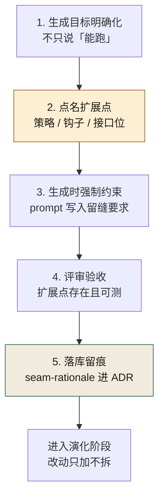
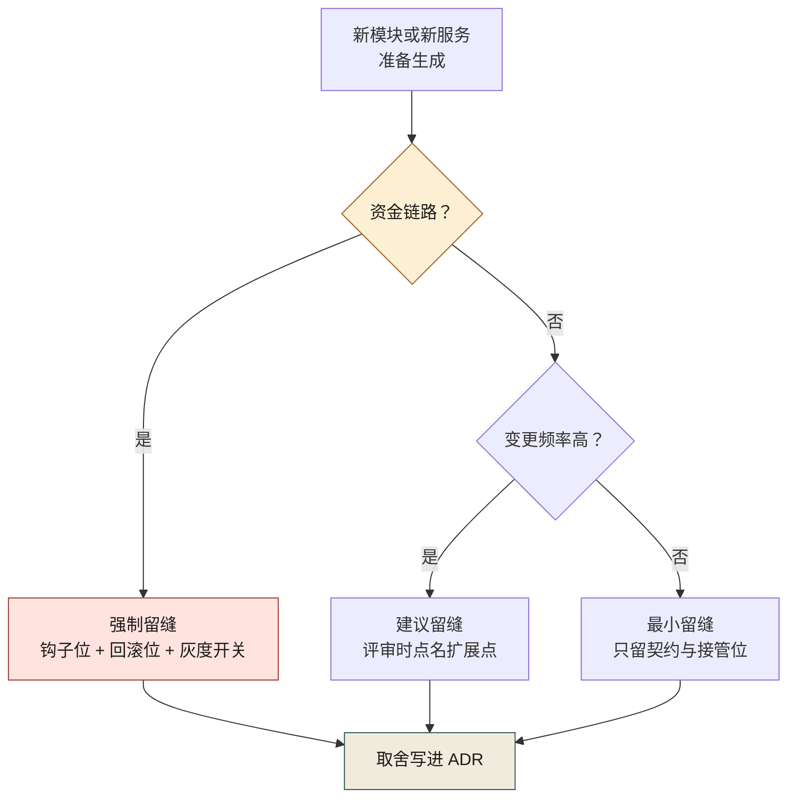
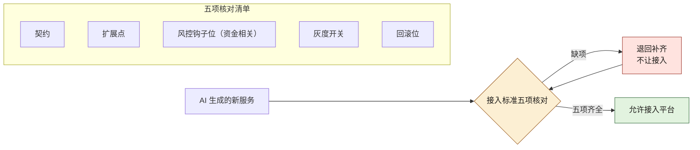

# 第 11 章 AI 一句话生成了系统，然后呢？

> **本章定位**：留缝章。回答"AI 生成的代码以后能不能改"这一问题，给出"生成-留缝五步法 + 扩展点地图 + 服务接入标准"的机制化答案。
> **核心命题**：AI 优化的是"现在能跑"，组织的成本大头在演化；除非有人在生成的那一刻替未来留缝，否则生成越快，演化越贵。

---

## 11.1 问题：生成只花了 20 分钟，改造花了三个礼拜

试点期有一个典型案例。一线工程师让 AI 生成一个规则引擎，从空到能跑，**20 分钟**。群里随即弹出一句"AI 牛逼"，附了张截图：规则配置、计算、落库，全有了。

然后是三个礼拜的折磨。

第一次改动：要加"满减和折扣不能叠加"。AI 给的初版把规则算死了，加不了。打开一看，不是逻辑错，是**结构上没有留扩展点**：规则之间是硬编码的 if-else，不是可组合的策略对象。改这个，等于重写。

第二次改动：要支持"按地域不同规则不同"。又重写一次。

第三次：要接入风控的限额校验。这次风控负责人下场了——他看了眼代码，说："这个引擎跑规则可以，但你没给风控留接口位。我不要事后塞，我要事前拦。"一线工程师说："加上不就行了？"风控负责人说："加不上。你的执行路径里没有钩子位，加进去就是把整个流程拆了重接。"

这一次算了一笔账：**生成省下了大约 3 天的人力，但因为没有留缝，后续三个月里为这段代码多花了 18 人天。** 生成便宜，演化昂贵——这是那三个月里最狠的一课。

---

## 11.2 根因：AI 优化的是"现在能跑"，不是"以后能改"

AI 生成代码，它的目标函数是"**满足当前 prompt 的最短路径**"。它不知道这段代码三个月后会被怎么改、会被谁接管、会被多少个端复用。于是它默认产出的是**最贴合当下、最不利于演化**的形态：

- **硬编码替代抽象**：能把 if-else 写完，它就不建策略类。
- **私有实现替代接口**：能直接调，它就不留接口位。
- **复制替代复用**：能复制一段，它就不抽公共模块。
- **跑通替代留缝**：能跑，它就不管"以后怎么改"。

**这不是 AI 的 bug，这是它的天性。** 它没有"为未来负责"这个动机，因为未来不在它的上下文里，也不在它的损失函数里。

于是矛盾出现了：**组织的成本大头在演化，AI 的强项在生成。一个只擅长生成的工具，被丢进一个演化成本占 80% 的系统里，必然把总成本推高——除非有人在生成的那一刻，替未来留缝。**

---

## 11.3 AI 用法：AI 生成，人留缝，五步法



**图 11-1｜留缝五步** — 生成省 3 天，没留缝可能多花 18 人天；缝必须在生成当天下死。

成熟实践定下的规矩，叫**生成-留缝五步法**——图 11-1 从左到右读成一条直线，从「生成目标明确化」起、到「落库留痕」止，最后一步收进 ADR 才交接给演化阶段，此后的纪律是改动只加缝、不拆缝。AI 还是那个 AI，但人的介入从"事后改"挪到了"生成时定形"。

```
1. 考古   —— 先搞清楚这块要接进哪个现有边界，AI 不许凭空生成
2. 判断   —— 人决定：这段需要哪些扩展点、哪些接管位
3. 契约   —— 先写契约/接口骨架，AI 在骨架内填实现
4. 灰度   —— 生成物走门禁，小流量验证
5. 归档   —— 扩展点、接管位、设计取舍写进 ADR
```

**关键在第 2 步——这是 AI 替不了的一步。** AI 能在骨架里填得又快又好，但"该留几个扩展点""风控钩子放哪"，它答不了，因为这是对未来的判断，未来不在它的上下文里。

回头复盘那次三个礼拜的折磨，根子正是跳过了第 2 步：让 AI 从零生成，没给它任何"缝"的约束，它当然贴着地面把路铺死了。

### 操作步骤：生成前点名扩展点

第 2 步「判断」最容易空转——人说"我会留意的"，然后什么都没留下。可照抄的提问顺序：

1. **问变更**：这块代码未来三个月最可能改的是什么？（规则、渠道、计价、权限，至少点出两项）
2. **问接管**：谁可能在我之后接手？他要的钩子位、回调位放在哪个接口上？
3. **问拦截**：这段要不要过风控 / 合规的卡点？要，就把钩子写进契约；不要，写明为什么不要。
4. **问回滚**：生成物出问题时怎么关掉？灰度开关、回滚位挂在哪个配置键上？
5. **问归档**：以上四问的答案落到哪份 ADR？没有落点，等于没问。

答不上来的问题，不要硬编——标"待定"进扩展点地图，比编一条错缝便宜。

### 模板：把留缝要求写进 prompt

留缝要求若不进 prompt，就是空话。可照抄的最小模板（占位符自行替换）：

```text
请实现【模块名】。约束：
1. 在【业务域】内复用现有【服务或包名】，不新造平行实现。
2. 【扩展点一，如：计价规则】以策略接口暴露，默认实现一个，注册进工厂。
3. 【扩展点二，如：风控校验】预留钩子位，调用【风控服务或包名】的接口，本次可先空实现。
4. 灰度开关、回滚位接入【配置中心或配置文件】的既有键，不新造配置面。
5. 不确定处显式标注 TODO，不要自行猜测补全。
```

模板里最值钱的是第 3 条：**钩子位允许空实现，但不允许没有**——留缝留的是"位"，不是"功能"。

---

## 11.4 角色博弈：留缝是要花钱的，谁出？

留缝不免费。**给一段代码留扩展点，意味着现在多写 20%、多测 20%、多评审 20%。** 这笔钱谁出，是大组织里最现实的冲突。

**冲突 · 一线交付 vs 风控可接管。** 一线工程师的 KPI 是交付量，留缝降低他的速度；风控负责人的 KPI 是零损失，不留缝他事后接不进来。两人在会上顶起来：

> **一线工程师**：你现在让我每个引擎都留风控钩子位，我交付量掉三成。
> **风控负责人**：你不留，出事了我接不进来，资金算谁的？
> **决策层**：留，但只在资金相关链路强制留；非资金的，留可选项。

**妥协：资金链路强制留缝，非资金链路建议留缝、不强制。** 一线保住了非资金域的速度，风控保住了资金域的可接管性。**两边都丢了东西：一线丢了资金域的"快"，风控接受了非资金域的"可能接不进来"。**

这件事的教训是：**留缝不能一刀切。** 一刀切全留，组织被拖垮；一刀切不留，事故重演。**缝留多少、留哪、谁批，必须按域分，必须挂到责任人头上。**

把这条分级规则画成决策流，评审时照着走。图 11-2 只有三个落点：命中资金链路就直接落到红色的「强制留缝」档——钩子位、回滚位、灰度开关三样都少不得；非资金的再看变更频率分流，注意「最小留缝」也不是不留，契约与接管位仍在缝列；三条分支最终都汇进「取舍写进 ADR」：



**图 11-2｜留缝分级决策** — 资金链路宁多勿少，非资金按变更频率倒推；分级结果必须落进 ADR，不许口头。

---

## 11.5 产出物：系统扩展点地图 + 服务接入标准

可落地的两件：

1. **《系统扩展点地图》**：每个核心链路标注——现有扩展点、接管位、谁拥有这个缝、下次该不该补缝。
2. **《服务接入标准》**：AI 生成的新服务要接入平台，必须自带：契约、扩展点、风控钩子位（资金相关）、灰度开关、回滚位。缺一项，不让接。

《服务接入标准》在接入环节就是一道门禁。图 11-3 的核对清单五项并列——契约、扩展点、风控钩子位、灰度开关、回滚位——任何一项缺失都走「退回补齐」那条回环，门禁没有"半接入"状态：



**图 11-3｜服务接入标准门禁** — 契约、扩展点、钩子位、灰度开关、回滚位，五项齐全才放行；缺一项就退回补齐。

> **代价声明**：接入标准上线后，新服务从"生成到可接入"的平均时长从 1.2 天涨到 3.5 天。一线会说"这是给 AI 上手铐"。这笔账组织认——但经历过一次"事后接不进来"的事故之后，没人再说手铐是坏事了。

### 模板：扩展点地图的最小条目

《系统扩展点地图》不需要复杂工具，一页表就是起点。每个核心链路一条，字段照抄：

| 字段 | 填什么 | 示例（占位） |
|------|--------|-------------|
| 链路 | 哪条业务链路 | 促销计价链路 |
| 缝位 | 扩展点 / 接管位的名字 | 计价规则策略接口 |
| 类型 | 底线缝 / 弹性缝 | 底线缝（资金相关） |
| 归属 | 谁拥有这条缝 | 促销域 TL |
| 状态 | 已留 / 待补 / 不留 | 已留 |
| 取舍依据 | 对应的 ADR 编号 | ADR-XX（占位） |

「状态」一栏只许三选一，不许留空——留空的地图，三个月后就没人在更新了。

### 度量指标：留缝有没有用，看哪几个数

| 指标 | 怎么测 | 阈值 | 谁看 | 多久看一次 |
|------|--------|------|------|-----------|
| 接入标准缺项拦截数 | 接入门禁的退回记录 | 每次退回都登记，趋势归零 | 平台治理组 | 每月 |
| 扩展点地图覆盖率 | 有条目的核心链路占全部核心链路的比例 | 只升不降 | 各域 TL | 每季度 |
| 资金链路钩子位就位率 | 接口存在性测试通过的资金模块占比 | 全量就位，零容忍缺口 | 风控负责人 | 每次发版 |
| 重写式改动次数 | 评审中被标注「等于重写」的改动 | 持续下降 | 架构组 | 每月 |

这张表刻意不设百分比目标——留缝的收益要几个月后才显形，早期盯绝对数只会逼出造假。先确认"有人在看"，再看趋势。

### 检查清单：评审一段 AI 生成代码的留缝

- [ ] 扩展点是落在接口上，还是只落在注释里？
- [ ] 资金相关链路有没有风控钩子位——哪怕是空实现？
- [ ] 灰度开关与回滚位接的是既有配置键，还是又新造了一套配置面？
- [ ] 本次"不留缝"的决定写进 ADR 了吗，还是只活在口头？
- [ ] 扩展点地图上这条链路的状态栏，更新了吗？

### 机制化：扩展点不能只活在模块内——entry points 的注册与发现（本机实跑）

> **档位声明（entry points）**：**A 档 · 本机实跑（发现与装配脚本只用 Python 标准库 `importlib.metadata`，Python 3.14.4 下的 stdout 逐字抄自本机；元数据目录为本机手写的最小件）**

11.2 说 AI 默认交出死疙瘩，11.4 给留缝定了分级——但"缝"本身还要有个物理形态。同一句"这里是扩展点"，有三种存在方式：**写在注释里、写在接口里、长在包边界上**。前两种都还需要人"知道并遵守"；只有第三种，机器能查出"注册了几个实现、有没有人真的引用、装配失败会不会响"。Python 生态里，长在包边界上的扩展点就是 entry points：**安装动作本身即注册，发现不需要改宿主代码**。

机制三件，全是纯 Python，可抄（口径按 `importlib.metadata` 文档写；本机跑通用的是手写元数据目录，生产上由 pip 安装时自动生成）：

1. 宿主声明一个**组名**（group），按组发现实现。
2. 插件在**自己包的元数据**里登记 `组名 = 名字 = 包路径:属性`。
3. 双方各自发版，互不 import——缝第一次长在**包边界**上，不在任何人脑子里。

插件侧在 `pyproject.toml` 里登记（示例组名 `acs.extension_points`，取自"可接管位"的拼音首字母，你仓库换成自己的域前缀即可）：

```toml
[project.entry-points."acs.extension_points"]
pricing_fast = "pricing_demo:fast"
```

安装后落成磁盘元数据（pip 生成；本机为验证发现逻辑手写过一份等价的最小件）：

```text
# acs_demo_pkg-0.1.0.dist-info/entry_points.txt
[acs.extension_points]
pricing_fast = pricing_demo:fast
pricing_slow = pricing_demo:slow
```

宿主侧发现与装配，一个探测脚本看全部形状：

```python
# probe.py —— 按组发现，按名装配；跑通才算缝存在
from importlib.metadata import distributions

found = set()
for d in distributions():
    for ep in d.entry_points:
        if ep.group == "acs.extension_points":
            found.add((ep.name, ep.value))
print("discovered:", sorted(n for n, _ in found))


def load(name):                         # 装配：把元数据里的 "包:属性" 变成一次真调用
    for n, value in sorted(found):
        if n == name:
            mod, _, attr = value.partition(":")
            import importlib
            return getattr(importlib.import_module(mod), attr)()
    raise KeyError(name)                # 注册了却装不起来 = 当场炸，不是静默降级


for n, _ in sorted(found):
    print(f"load: {n} -> {load(n)}")
```

本机实跑读数（Python 3.14.4；`sys.path` 上放了那份手工元数据目录；stdout 逐字）：

```text
discovered: ['pricing_fast', 'pricing_slow']
load: pricing_fast -> {'rule': 'fast'}
load: pricing_slow -> {'rule': 'slow'}
```

`load()` 返回的可调用对象能真的跑起来，"注册过"三个字才有了磁盘证据。**验收判据就立在这里：一个扩展点如果没跨包边界，它就不是扩展点，只是一个函数。**

四道静默失效面——它们比机制本身更值得抄进评审清单：

- **发现失败是空列表，不是异常。** 包没装、元数据没生成、组名拼错，都让发现静默返回空。宿主对空注册表必须显式报错（下一小节），否则"扩展点"三个字就是自欺。
- **`ep.load()` 可能抛 import 错。** 注册表只保证登记过，不保证可导入；装配处 catch 住、点名 quarantine，别让一个坏插件拖死整个服务。
- **同名注册要仲裁。** 两个包都登记 `pricing_fast` 时行为未定义——必须过一层注册表做唯一性判定（见 11.5c）。
- **只装运行时解释才可见。** entry points 依赖已安装包元数据：editable / 开发安装依赖较新 pip 的产物，CI 镜像里若没 pip 就没有元数据——"本地能发现、CI 发现不了"排查一圈，根因常是这个。

### 注册表与 SPI：进程内接缝的契约义务（本机实跑）

> **档位声明（进程内注册表与 SPI）**：**A 档 · 本机实跑（注册表为纯 Python 标准库实现，四条读数逐字抄自本机；Java 侧 `ServiceLoader` 本机无运行环境，卡内未声称跑过）**

不是每条缝都要跨包边界——8.3 说过，**缝的位置由变化速度决定**。同仓内部的缝用最小注册表就够，形状与 JDK 的 SPI 同构（Java 侧的 `ServiceLoader` 本机无运行环境，不展开，这里只写 Python 形状）：

```python
# /tmp/ch16_registry.py —— 注册即校验，未注册必炸，重名必报
_REGISTRY: dict = {}

def register(name, factory):
    if name in _REGISTRY and _REGISTRY[name] is not factory:
        raise RuntimeError(f"duplicate strategy name: {name!r}")
    _REGISTRY[name] = factory

def resolve(name):
    try:
        return _REGISTRY[name]
    except KeyError:
        raise LookupError(f"unknown strategy: {name!r}") from None
```

本机实跑（注册 fast/slow 两条策略后）：

```text
注册表: ['pricing_fast', 'pricing_slow']
fast: 0.00
未注册名: unknown strategy: 'pricing_missing'
重名注册: duplicate strategy name: 'pricing_fast'
```

三条契约义务，都落在这份读数里：

1. **resolve 对未注册名必须抛错**，不许回退默认策略——静默兜底是留缝的第一号假象：扩展点"在"，但没人注册时它假装一切正常。
2. **重名注册必须炸**。两个域各自注册同名策略，后装覆盖先装，线上行为取决于 import 顺序——这种 bug 没有报错、只有事故。
3. **注册与发现分离，装配点单一**。注册散落各处没关系（包边界管这个），装配必须只有一处——就是第 8 章 8.5b 的 `bootstrap`：那里是唯一允许同时 import 端口与实现的地点。

这条纪律的机器化形态，在 8.5b 骨架上真跑过：`PricingService` 的构造器要三个端口、测试里注入三个 fake、装配只出现在 `bootstrap/app.py` 的 `build_default_service`；三条不变量测试 `3 passed in 0.01s`（本机实跑，Python 3.14 / pytest 9.1）。**缝的"位"存在，与缝的"契约"被执行，是两件事——后者永远要靠一条测试来数。**

装配点本身还差最后一道 fail-fast——把"必须有谁注册过"写成断言，本机实跑的形状：

```python
REQUIRED_SEAMS = ("pricing", "risk", "ledger")   # 该模块按分级规则必须留的缝，登记在此

def build_service(registry):
    missing = [s for s in REQUIRED_SEAMS if s not in registry]
    if missing:
        raise RuntimeError(f"扩展点未注册: {missing}")   # 宁拒启，不静默兜底
    ...
```

```text
缺缝装配: 扩展点未注册: ['risk']
补齐装配: PricingService(pricing='FixedPricing', risk='AlwaysAllowRisk', ledger='FakeLedger')
```

风控那一条缝被拔掉时，服务**拒绝启动**而不是带着空钩子上线——11.1 风控负责人那句"我不要事后塞，我要事前拦"，落到代码里就是这两行。它的失效面也直白：`REQUIRED_SEAMS` 清单是人写的，缝加了没登记，等于没加——所以这张清单要跟着扩展点地图同季重扫。

### 缝的契约成本怎么度量：引用侧与实现侧各一条判据

缝不是荣誉徽章，是维护合同。每条缝的季度成本 ≈ **被引用的面 × 被实现的面**：引用方越多、实现方越多，一次端口签名变更的半径越大。所以扩展点地图（11.5）除了"状态"栏，每条缝还要两条可数的判据——**引用侧一条、实现侧一条**：

| 侧 | 判据 | 读数含义 | 档位处方 |
|----|------|----------|----------|
| 引用侧 | 按端口名 import 它的模块数 | 0 = 缝只被声明、从不被点名 | 0 引用先查口径，别先删缝 |
| 实现侧 | 实现了端口方法集的类数（含 fake） | 0 = 死缝；1 = 单实现缝（可收） | ≥ 2 且含 fake 才是完整缝 |

把这两条判据写成 AST 计数脚本，跑 8.5b 那套骨架（**缝的计数与第 8 章 8.5d 同一把尺，本处只数两栏**），本机实跑读数：

```text
port PricingPort: name-refs=1 impls=2 ['FixedPricing', 'RealGatewayPricing']
port RiskPort: name-refs=1 impls=2 ['AlwaysAllowRisk', 'RealHttpRisk']
port LedgerPort: name-refs=1 impls=2 ['FakeLedger', 'RealSqlLedger']
```

impls 每行都是 2（fake + 真实桩各一），缝是活的；但 `name-refs=1` 露出第一个坑：**除声明文件外没人按名字引用端口**——消费方靠构造参数注入拿实现，类型名在代码里一次都不出现。计数口径必须把"注入位形参 + 装配调用"算进引用侧，否则引用数永远虚低，缝会被误判成"无人使用，删了省事"。**缝的度量脚本本身要过一遍"故意拔掉一条缝"的阳性测试**——和门禁要先证它会红是同一条纪律（第 9 章 9.5e）。

这条阳性测试本机真做了：删掉骨架里的真实桩文件 `adapters/real_stubs.py`，同一个计数脚本重跑（本机实跑）：

```text
port PricingPort: name-refs=1 impls=1 ['FixedPricing']
port RiskPort: name-refs=1 impls=1 ['AlwaysAllowRisk']
port LedgerPort: name-refs=1 impls=1 ['FakeLedger']
```

三行实现数从 2 全部塌成 1，只剩 fake——**这把尺拔一根就响**，才谈得上拿去季度对账。每条缝在扩展点地图里追加两个计数栏、一行台账：

| 缝位 | 引用侧读数 | 实现侧读数 | 档位 | 本季变化 |
|------|------------|------------|------|----------|
| 计价规则策略接口 | 端口名 import 数 + 注入位数 | fake / 真实 各 1 | 标准缝 | 持平 |
| 风控钩子位 | 同上 | 真实桩被删则降为 1，触发 P1 | 底线缝 | 拔桩阳性测试已做 |

台账的价值不在表格本身，在"每季有人对着读数问一句为什么变了"。

成本档位由此可定（示例阈值，评审拍板，非标准）：

- **最小缝**：1 个引用位 + 1 个 fake——新模块起步形态，先把位占住。
- **标准缝**：引用 ≥ 2 且实现 ≥ 2——进季度重扫，改签名要过评审。
- **跨包缝**：标准缝 + 装配失败会响——才升级到 entry points 机制（11.5b），登记组名进扩展点地图。

留缝分级（图 11-2）管"该留哪几类"，本节管"每条缝花多少钱、钱花得值不值"。地图的「状态」列每季重扫一次：死缝（impls=0）限期退役——**退役缝同样是破坏性变更，按第 9 章 9.5c 判定表第 5 行走，双跑一个发版周期再拆。**

---

### 四案例映射

本章"留缝"机制在四个案例中的具体落地形态：

| 案例 | 必留的"底线缝" | 留缝分级 | 谁拍板 |
|------|---------------|---------|--------|
| 案例一·电商平台 | 促销规则引擎的策略插拔扩展点 | 资金相关强制、其余建议 | 多端负责人 + 业务域 TL |
| 案例二·加密交易所 | 资金链路的风控钩子、回滚位、灰度开关 | 全链路强制 | 风控负责人 |
| 案例三·Web3量化 | 策略插拔位、数据源适配位、熔断接管位 | 强制 | 量化负责人 + 风控 |
| 案例四·安全初创 | 安全审计接管位、权限校验钩子、日志留痕位 | 全链路强制 | 合规负责人 |

---

## 11.6 检查清单

- [ ] 你让 AI 生成一个新模块前，有没有先画好"它要接进哪个边界"？
- [ ] 生成的代码里，有没有为未来改动预留的扩展点？还是一个紧贴当下的死疙瘩？
- [ ] 资金/风控相关的生成物，有没有强制的人工接管位（钩子、回调、审批接入点）？
- [ ] 你有没有一张"扩展点地图"，知道系统现在哪里有缝、哪里没缝？
- [ ] AI 生成的新服务，接入平台有没有一份"必须自带什么"的清单？
- [ ] 你标的"扩展点"，注册和发现跨包边界吗？只在模块内的，只是函数，不是缝。
- [ ] 未注册 / 发现失败时，装配会显式炸，还是静默用兜底实现？
- [ ] 留缝的取舍，有没有写进 ADR？还是只活在某个人的判断里？

---

## 11.7 反模式

| # | 反模式 | 后果 |
|---|--------|------|
| 1 | 让 AI 从零生成，不给任何边界约束 | 3 天省下，18 人天赔进去 |
| 2 | 一刀切全留缝，不看域 | 拖垮交付速度 |
| 3 | 一刀切全不留缝 | 事故接不进来 |
| 4 | 留缝只留在脑子里 | 人走了缝就没了 |
| 5 | 把"留缝"理解成"多写注释" | 注释救不了硬编码 |

---

## 11.8 遗留问题

- **缝留多少才够？** 留多了浪费，留少了痛苦。没有现成公式，只有一条经验：**资金链路宁多勿少，非资金链路按变更频率倒推**。这条够不够，本书不打包票。
- **谁来判定"该不该留缝"？** 现在是各域 TL 与决策层人工判。能不能做成一份"扩展点检查清单"自动化？留给第 10 章（边界变成测试）和第 25 章（ADR 治理）。
- **AI 会不会进化到自己留缝？** 一种判断是：它会越来越会"留看起来像缝的东西"，但**「留对缝」需要对未来的判断，这部分永远是人吃饭的本事。** 这条，第 24 章再展开。
- **缝的注册与发现机制，要不要全平台统一一种？** 注册表与 entry points 的分界（11.5b 末的失效面）目前靠各域自选。统一会抬高小模块成本，不统一会让扩展点地图对不上账。这条组织题，第 25 章（文档与规范治理）接。

---

> **本章的一句话**：AI 让"把东西做出来"变得几乎免费，于是**「做出来之后能不能改」成了新的贵**。留缝，就是人在生成的那一刻，替三个月后的自己交的保险——这笔保险费，AI 不愿意出，因为它不为未来负责；只有人愿意出，因为改这段代码的，迟早是人自己。
