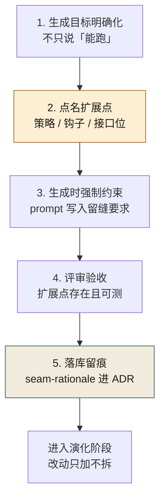
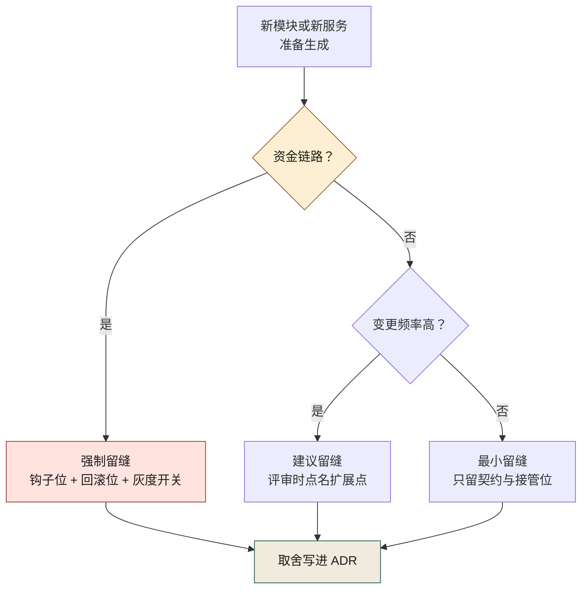
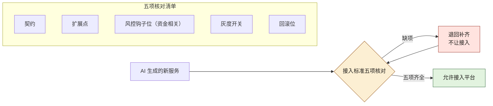
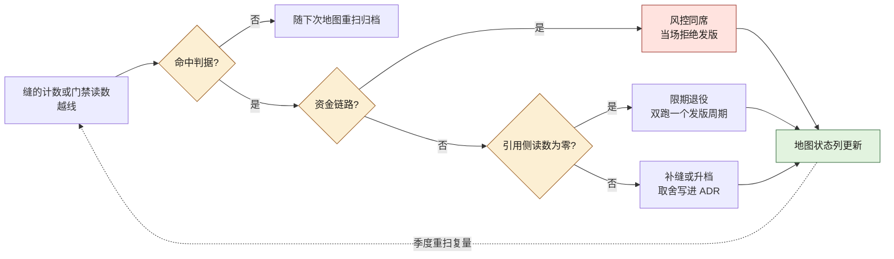

# 第 11 章 AI 一句话生成了系统，然后呢？

> **本章定位**：留缝章。回答"AI 生成的代码以后能不能改"这一问题，给出"生成-留缝五步法 + 扩展点地图 + 服务接入标准"的机制化答案。
> **核心命题**：AI 优化的是"现在能跑"，组织的成本大头在演化；除非有人在生成的那一刻替未来留缝，否则生成越快，演化越贵。

---

## 11.1 问题：生成只花了 20 分钟，改造花了三个礼拜

试点期有一个典型案例。一线工程师让 AI 生成一个规则引擎，从空到能跑，**20 分钟**。群里随即弹出一句"AI 牛逼"，附了张截图：规则配置、计算、落库，全有了。

然后是三个礼拜的折磨。

第一次改动：要加"满减和折扣不能叠加"。AI 给的初版把规则算死了，加不了。打开一看，不是逻辑错，是**结构上没有留扩展点**：规则之间是硬编码的 if-else，不是可组合的策略对象。改这个，等于重写。

第二次改动：要支持"按地域不同规则不同"。又重写一次。

第三次：要接入风控的限额校验。这次风控负责人下场了——他看了眼代码，说："这个引擎跑规则可以，但你没给风控留接口位。我不要事后塞，我要事前拦。"一线工程师说："加上不就行了？"风控负责人说："加不上。你的执行路径里没有钩子位，加进去就是把整个流程拆了重接。"

这一次算了一笔账：**生成省下了大约 3 天的人力，但因为没有留缝，后续三个月里为这段代码多花了 18 人天。** 生成便宜，演化昂贵——这是那三个月里最狠的一课。

---

## 11.2 根因：AI 优化的是"现在能跑"，不是"以后能改"

AI 生成代码，它的目标函数是"**满足当前 prompt 的最短路径**"。它不知道这段代码三个月后会被怎么改、会被谁接管、会被多少个端复用。于是它默认产出的是**最贴合当下、最不利于演化**的形态：

- **硬编码替代抽象**：能把 if-else 写完，它就不建策略类。
- **私有实现替代接口**：能直接调，它就不留接口位。
- **复制替代复用**：能复制一段，它就不抽公共模块。
- **跑通替代留缝**：能跑，它就不管"以后怎么改"。

**这不是 AI 的 bug，这是它的天性。** 它没有"为未来负责"这个动机，因为未来不在它的上下文里，也不在它的损失函数里。

于是矛盾出现了：**组织的成本大头在演化，AI 的强项在生成。一个只擅长生成的工具，被丢进一个演化成本占 80% 的系统里，必然把总成本推高——除非有人在生成的那一刻，替未来留缝。**

---

## 11.3 AI 用法：AI 生成，人留缝，五步法



**图 11-1｜留缝五步** — 生成省 3 天，没留缝可能多花 18 人天；缝必须在生成当天下死。

成熟实践定下的规矩，叫**生成-留缝五步法**——图 11-1 从左到右读成一条直线，从「生成目标明确化」起、到「落库留痕」止，最后一步收进 ADR 才交接给演化阶段，此后的纪律是改动只加缝、不拆缝。AI 还是那个 AI，但人的介入从"事后改"挪到了"生成时定形"。

```
1. 考古   —— 先搞清楚这块要接进哪个现有边界，AI 不许凭空生成
2. 判断   —— 人决定：这段需要哪些扩展点、哪些接管位
3. 契约   —— 先写契约/接口骨架，AI 在骨架内填实现
4. 灰度   —— 生成物走门禁，小流量验证
5. 归档   —— 扩展点、接管位、设计取舍写进 ADR
```

**关键在第 2 步——这是 AI 替不了的一步。** AI 能在骨架里填得又快又好，但"该留几个扩展点""风控钩子放哪"，它答不了，因为这是对未来的判断，未来不在它的上下文里。

回头复盘那次三个礼拜的折磨，根子正是跳过了第 2 步：让 AI 从零生成，没给它任何"缝"的约束，它当然贴着地面把路铺死了。

### 操作步骤：生成前点名扩展点

第 2 步「判断」最容易空转——人说"我会留意的"，然后什么都没留下。可照抄的提问顺序：

1. **问变更**：这块代码未来三个月最可能改的是什么？（规则、渠道、计价、权限，至少点出两项）
2. **问接管**：谁可能在我之后接手？他要的钩子位、回调位放在哪个接口上？
3. **问拦截**：这段要不要过风控 / 合规的卡点？要，就把钩子写进契约；不要，写明为什么不要。
4. **问回滚**：生成物出问题时怎么关掉？灰度开关、回滚位挂在哪个配置键上？
5. **问归档**：以上四问的答案落到哪份 ADR？没有落点，等于没问。

答不上来的问题，不要硬编——标"待定"进扩展点地图，比编一条错缝便宜。

### 模板：把留缝要求写进 prompt

留缝要求若不进 prompt，就是空话。可照抄的最小模板（占位符自行替换）：

```text
请实现【模块名】。约束：
1. 在【业务域】内复用现有【服务或包名】，不新造平行实现。
2. 【扩展点一，如：计价规则】以策略接口暴露，默认实现一个，注册进工厂。
3. 【扩展点二，如：风控校验】预留钩子位，调用【风控服务或包名】的接口，本次可先空实现。
4. 灰度开关、回滚位接入【配置中心或配置文件】的既有键，不新造配置面。
5. 不确定处显式标注 TODO，不要自行猜测补全。
```

模板里最值钱的是第 3 条：**钩子位允许空实现，但不允许没有**——留缝留的是"位"，不是"功能"。

---

## 11.4 角色博弈：留缝是要花钱的，谁出？

留缝不免费。**给一段代码留扩展点，意味着现在多写 20%、多测 20%、多评审 20%。** 这笔钱谁出，是大组织里最现实的冲突。

**冲突 · 一线交付 vs 风控可接管。** 一线工程师的 KPI 是交付量，留缝降低他的速度；风控负责人的 KPI 是零损失，不留缝他事后接不进来。两人在会上顶起来：

> **一线工程师**：你现在让我每个引擎都留风控钩子位，我交付量掉三成。
> **风控负责人**：你不留，出事了我接不进来，资金算谁的？
> **决策层**：留，但只在资金相关链路强制留；非资金的，留可选项。

**妥协：资金链路强制留缝，非资金链路建议留缝、不强制。** 一线保住了非资金域的速度，风控保住了资金域的可接管性。**两边都丢了东西：一线丢了资金域的"快"，风控接受了非资金域的"可能接不进来"。**

这件事的教训是：**留缝不能一刀切。** 一刀切全留，组织被拖垮；一刀切不留，事故重演。**缝留多少、留哪、谁批，必须按域分，必须挂到责任人头上。**

把这条分级规则画成决策流，评审时照着走。图 11-2 只有三个落点：命中资金链路就直接落到红色的「强制留缝」档——钩子位、回滚位、灰度开关三样都少不得；非资金的再看变更频率分流，注意「最小留缝」也不是不留，契约与接管位仍在缝列；三条分支最终都汇进「取舍写进 ADR」：



**图 11-2｜留缝分级决策** — 资金链路宁多勿少，非资金按变更频率倒推；分级结果必须落进 ADR，不许口头。

---

## 11.5 产出物：系统扩展点地图 + 服务接入标准

可落地的两件：

1. **《系统扩展点地图》**：每个核心链路标注——现有扩展点、接管位、谁拥有这个缝、下次该不该补缝。
2. **《服务接入标准》**：AI 生成的新服务要接入平台，必须自带：契约、扩展点、风控钩子位（资金相关）、灰度开关、回滚位。缺一项，不让接。

《服务接入标准》在接入环节就是一道门禁。图 11-3 的核对清单五项并列——契约、扩展点、风控钩子位、灰度开关、回滚位——任何一项缺失都走「退回补齐」那条回环，门禁没有"半接入"状态：



**图 11-3｜服务接入标准门禁** — 契约、扩展点、钩子位、灰度开关、回滚位，五项齐全才放行；缺一项就退回补齐。

> **代价声明**：接入标准上线后，新服务从"生成到可接入"的平均时长从 1.2 天涨到 3.5 天。一线会说"这是给 AI 上手铐"。这笔账组织认——但经历过一次"事后接不进来"的事故之后，没人再说手铐是坏事了。

### 模板：扩展点地图的最小条目

《系统扩展点地图》不需要复杂工具，一页表就是起点。每个核心链路一条，字段照抄：

| 字段 | 填什么 | 示例（占位） |
|------|--------|-------------|
| 链路 | 哪条业务链路 | 促销计价链路 |
| 缝位 | 扩展点 / 接管位的名字 | 计价规则策略接口 |
| 类型 | 底线缝 / 弹性缝 | 底线缝（资金相关） |
| 归属 | 谁拥有这条缝 | 促销域 TL |
| 状态 | 已留 / 待补 / 不留 | 已留 |
| 取舍依据 | 对应的 ADR 编号 | ADR-XX（占位） |

「状态」一栏只许三选一，不许留空——留空的地图，三个月后就没人在更新了。

### 度量指标：留缝有没有用，看哪几个数

| 指标 | 怎么测 | 阈值 | 谁看 | 多久看一次 |
|------|--------|------|------|-----------|
| 接入标准缺项拦截数 | 接入门禁的退回记录 | 每次退回都登记，趋势归零 | 平台治理组 | 每月 |
| 扩展点地图覆盖率 | 有条目的核心链路占全部核心链路的比例 | 只升不降 | 各域 TL | 每季度 |
| 资金链路钩子位就位率 | 接口存在性测试通过的资金模块占比 | 全量就位，零容忍缺口 | 风控负责人 | 每次发版 |
| 重写式改动次数 | 评审中被标注「等于重写」的改动 | 持续下降 | 架构组 | 每月 |

这张表刻意不设百分比目标——留缝的收益要几个月后才显形，早期盯绝对数只会逼出造假。先确认"有人在看"，再看趋势。

### 检查清单：评审一段 AI 生成代码的留缝

- [ ] 扩展点是落在接口上，还是只落在注释里？
- [ ] 资金相关链路有没有风控钩子位——哪怕是空实现？
- [ ] 灰度开关与回滚位接的是既有配置键，还是又新造了一套配置面？
- [ ] 本次"不留缝"的决定写进 ADR 了吗，还是只活在口头？
- [ ] 扩展点地图上这条链路的状态栏，更新了吗？

### 机制化：扩展点不能只活在模块内——entry points 的注册与发现（本机实跑）

> **档位声明（entry points）**：**A 档 · 本机实跑（发现与装配脚本只用 Python 标准库 `importlib.metadata`，Python 3.14.4 下的 stdout 逐字抄自本机；元数据目录为本机手写的最小件）**

11.2 说 AI 默认交出死疙瘩，11.4 给留缝定了分级——但"缝"本身还要有个物理形态。同一句"这里是扩展点"，有三种存在方式：**写在注释里、写在接口里、长在包边界上**。前两种都还需要人"知道并遵守"；只有第三种，机器能查出"注册了几个实现、有没有人真的引用、装配失败会不会响"。Python 生态里，长在包边界上的扩展点就是 entry points：**安装动作本身即注册，发现不需要改宿主代码**。

机制三件，全是纯 Python，可抄（口径按 `importlib.metadata` 文档写；本机跑通用的是手写元数据目录，生产上由 pip 安装时自动生成）：

1. 宿主声明一个**组名**（group），按组发现实现。
2. 插件在**自己包的元数据**里登记 `组名 = 名字 = 包路径:属性`。
3. 双方各自发版，互不 import——缝第一次长在**包边界**上，不在任何人脑子里。

插件侧在 `pyproject.toml` 里登记（示例组名 `acs.extension_points`，取自"可接管位"的拼音首字母，你仓库换成自己的域前缀即可）：

```toml
[project.entry-points."acs.extension_points"]
pricing_fast = "pricing_demo:fast"
```

安装后落成磁盘元数据（pip 生成；本机为验证发现逻辑手写过一份等价的最小件）：

```text
# acs_demo_pkg-0.1.0.dist-info/entry_points.txt
[acs.extension_points]
pricing_fast = pricing_demo:fast
pricing_slow = pricing_demo:slow
```

宿主侧发现与装配，一个探测脚本看全部形状：

```python
# probe.py —— 按组发现，按名装配；跑通才算缝存在
from importlib.metadata import distributions

found = set()
for d in distributions():
    for ep in d.entry_points:
        if ep.group == "acs.extension_points":
            found.add((ep.name, ep.value))
print("discovered:", sorted(n for n, _ in found))


def load(name):                         # 装配：把元数据里的 "包:属性" 变成一次真调用
    for n, value in sorted(found):
        if n == name:
            mod, _, attr = value.partition(":")
            import importlib
            return getattr(importlib.import_module(mod), attr)()
    raise KeyError(name)                # 注册了却装不起来 = 当场炸，不是静默降级


for n, _ in sorted(found):
    print(f"load: {n} -> {load(n)}")
```

本机实跑读数（Python 3.14.4；`sys.path` 上放了那份手工元数据目录；stdout 逐字）：

```text
discovered: ['pricing_fast', 'pricing_slow']
load: pricing_fast -> {'rule': 'fast'}
load: pricing_slow -> {'rule': 'slow'}
```

`load()` 返回的可调用对象能真的跑起来，"注册过"三个字才有了磁盘证据。**验收判据就立在这里：一个扩展点如果没跨包边界，它就不是扩展点，只是一个函数。**

四道静默失效面——它们比机制本身更值得抄进评审清单：

- **发现失败是空列表，不是异常。** 包没装、元数据没生成、组名拼错，都让发现静默返回空。宿主对空注册表必须显式报错（下一小节），否则"扩展点"三个字就是自欺。
- **`ep.load()` 可能抛 import 错。** 注册表只保证登记过，不保证可导入；装配处 catch 住、点名 quarantine，别让一个坏插件拖死整个服务。
- **同名注册要仲裁。** 两个包都登记 `pricing_fast` 时行为未定义——必须过一层注册表做唯一性判定（见 11.5c）。
- **只装运行时解释才可见。** entry points 依赖已安装包元数据：editable / 开发安装依赖较新 pip 的产物，CI 镜像里若没 pip 就没有元数据——"本地能发现、CI 发现不了"排查一圈，根因常是这个。

### 注册表与 SPI：进程内接缝的契约义务（本机实跑）

> **档位声明（进程内注册表与 SPI）**：**A 档 · 本机实跑（注册表为纯 Python 标准库实现，四条读数逐字抄自本机；Java 侧 `ServiceLoader` 本机无运行环境，卡内未声称跑过）**

不是每条缝都要跨包边界——8.3 说过，**缝的位置由变化速度决定**。同仓内部的缝用最小注册表就够，形状与 JDK 的 SPI 同构（Java 侧的 `ServiceLoader` 本机无运行环境，不展开，这里只写 Python 形状）：

```python
# /tmp/ch16_registry.py —— 注册即校验，未注册必炸，重名必报
_REGISTRY: dict = {}

def register(name, factory):
    if name in _REGISTRY and _REGISTRY[name] is not factory:
        raise RuntimeError(f"duplicate strategy name: {name!r}")
    _REGISTRY[name] = factory

def resolve(name):
    try:
        return _REGISTRY[name]
    except KeyError:
        raise LookupError(f"unknown strategy: {name!r}") from None
```

本机实跑（注册 fast/slow 两条策略后）：

```text
注册表: ['pricing_fast', 'pricing_slow']
fast: 0.00
未注册名: unknown strategy: 'pricing_missing'
重名注册: duplicate strategy name: 'pricing_fast'
```

三条契约义务，都落在这份读数里：

1. **resolve 对未注册名必须抛错**，不许回退默认策略——静默兜底是留缝的第一号假象：扩展点"在"，但没人注册时它假装一切正常。
2. **重名注册必须炸**。两个域各自注册同名策略，后装覆盖先装，线上行为取决于 import 顺序——这种 bug 没有报错、只有事故。
3. **注册与发现分离，装配点单一**。注册散落各处没关系（包边界管这个），装配必须只有一处——就是第 8 章 8.5b 的 `bootstrap`：那里是唯一允许同时 import 端口与实现的地点。

这条纪律的机器化形态，在 8.5b 骨架上真跑过：`PricingService` 的构造器要三个端口、测试里注入三个 fake、装配只出现在 `bootstrap/app.py` 的 `build_default_service`；三条不变量测试 `3 passed in 0.01s`（本机实跑，Python 3.14 / pytest 9.1）。**缝的"位"存在，与缝的"契约"被执行，是两件事——后者永远要靠一条测试来数。**

装配点本身还差最后一道 fail-fast——把"必须有谁注册过"写成断言，本机实跑的形状：

```python
REQUIRED_SEAMS = ("pricing", "risk", "ledger")   # 该模块按分级规则必须留的缝，登记在此

def build_service(registry):
    missing = [s for s in REQUIRED_SEAMS if s not in registry]
    if missing:
        raise RuntimeError(f"扩展点未注册: {missing}")   # 宁拒启，不静默兜底
    ...
```

```text
缺缝装配: 扩展点未注册: ['risk']
补齐装配: PricingService(pricing='FixedPricing', risk='AlwaysAllowRisk', ledger='FakeLedger')
```

风控那一条缝被拔掉时，服务**拒绝启动**而不是带着空钩子上线——11.1 风控负责人那句"我不要事后塞，我要事前拦"，落到代码里就是这两行。它的失效面也直白：`REQUIRED_SEAMS` 清单是人写的，缝加了没登记，等于没加——所以这张清单要跟着扩展点地图同季重扫。

### 缝的契约成本怎么度量：引用侧与实现侧各一条判据

缝不是荣誉徽章，是维护合同。每条缝的季度成本 ≈ **被引用的面 × 被实现的面**：引用方越多、实现方越多，一次端口签名变更的半径越大。所以扩展点地图（11.5）除了"状态"栏，每条缝还要两条可数的判据——**引用侧一条、实现侧一条**：

| 侧 | 判据 | 读数含义 | 档位处方 |
|----|------|----------|----------|
| 引用侧 | 按端口名 import 它的模块数 | 0 = 缝只被声明、从不被点名 | 0 引用先查口径，别先删缝 |
| 实现侧 | 实现了端口方法集的类数（含 fake） | 0 = 死缝；1 = 单实现缝（可收） | ≥ 2 且含 fake 才是完整缝 |

把这两条判据写成 AST 计数脚本，跑 8.5b 那套骨架（**缝的计数与第 8 章 8.5d 同一把尺，本处只数两栏**），本机实跑读数：

```text
port PricingPort: name-refs=1 impls=2 ['FixedPricing', 'RealGatewayPricing']
port RiskPort: name-refs=1 impls=2 ['AlwaysAllowRisk', 'RealHttpRisk']
port LedgerPort: name-refs=1 impls=2 ['FakeLedger', 'RealSqlLedger']
```

impls 每行都是 2（fake + 真实桩各一），缝是活的；但 `name-refs=1` 露出第一个坑：**除声明文件外没人按名字引用端口**——消费方靠构造参数注入拿实现，类型名在代码里一次都不出现。计数口径必须把"注入位形参 + 装配调用"算进引用侧，否则引用数永远虚低，缝会被误判成"无人使用，删了省事"。**缝的度量脚本本身要过一遍"故意拔掉一条缝"的阳性测试**——和门禁要先证它会红是同一条纪律（第 9 章 9.5e）。

这条阳性测试本机真做了：删掉骨架里的真实桩文件 `adapters/real_stubs.py`，同一个计数脚本重跑（本机实跑）：

```text
port PricingPort: name-refs=1 impls=1 ['FixedPricing']
port RiskPort: name-refs=1 impls=1 ['AlwaysAllowRisk']
port LedgerPort: name-refs=1 impls=1 ['FakeLedger']
```

三行实现数从 2 全部塌成 1，只剩 fake——**这把尺拔一根就响**，才谈得上拿去季度对账。每条缝在扩展点地图里追加两个计数栏、一行台账：

| 缝位 | 引用侧读数 | 实现侧读数 | 档位 | 本季变化 |
|------|------------|------------|------|----------|
| 计价规则策略接口 | 端口名 import 数 + 注入位数 | fake / 真实 各 1 | 标准缝 | 持平 |
| 风控钩子位 | 同上 | 真实桩被删则降为 1，触发 P1 | 底线缝 | 拔桩阳性测试已做 |

台账的价值不在表格本身，在"每季有人对着读数问一句为什么变了"。

成本档位由此可定（示例阈值，评审拍板，非标准）：

- **最小缝**：1 个引用位 + 1 个 fake——新模块起步形态，先把位占住。
- **标准缝**：引用 ≥ 2 且实现 ≥ 2——进季度重扫，改签名要过评审。
- **跨包缝**：标准缝 + 装配失败会响——才升级到 entry points 机制（11.5b），登记组名进扩展点地图。

留缝分级（图 11-2）管"该留哪几类"，本节管"每条缝花多少钱、钱花得值不值"。地图的「状态」列每季重扫一次：死缝（impls=0）限期退役——**退役缝同样是破坏性变更，按第 9 章 9.5c 判定表第 5 行走，双跑一个发版周期再拆。**

---

### 四案例映射

本章"留缝"机制在四个案例中的具体落地形态：

| 案例 | 必留的"底线缝" | 留缝分级 | 谁拍板 |
|------|---------------|---------|--------|
| 案例一·电商平台 | 促销规则引擎的策略插拔扩展点 | 资金相关强制、其余建议 | 多端负责人 + 业务域 TL |
| 案例二·加密交易所 | 资金链路的风控钩子、回滚位、灰度开关 | 全链路强制 | 风控负责人 |
| 案例三·Web3量化 | 策略插拔位、数据源适配位、熔断接管位 | 强制 | 量化负责人 + 风控 |
| 案例四·安全初创 | 安全审计接管位、权限校验钩子、日志留痕位 | 全链路强制 | 合规负责人 |

---

## 11.5e 生效证据清点：本章每件产物各自挂在哪个证据面上

11.5 交出了两件产出物、三段机制卡（entry points、注册表与 SPI、缝的契约成本）、一张四行度量表。可"产物在"和"产物有人按固定姿势去读"是两件事——本章自己早写过这条判据：缝的"位"存在，与缝的"契约"被执行，是两件事，后者永远要靠一条测试来数（11.5 注册表卡）。这一节把本章点过的产物逐条翻成证据面：真凭据是什么、怎么读、落在**有产物／产物可造假／无产物**哪一态、没有产物时该机制退回什么样子。表内读数全部来自本章前文，不新增任何读数；第 10 章 10.5g 已对"不变量 ↔ 产物"做过同一形状的清点，本节不重抄那套口径，只把尺子对准缝。

| 产物／机制（出处） | 生效证据 | 这条证据怎么读 | 证据态 | 没有产物时退回什么样子 |
|---|---|---|---|---|
| 《系统扩展点地图》六字段（11.5 模板表） | 每季度重扫留下的地图 diff：状态列有变动、「本季变化」栏被填过（11.5 成本卡台账第五列） | 不数条目数，数"有没有人对着读数问一句为什么变了"；地图与两条计数（引用侧／实现侧）对不上账即空转 | 产物可造假 | 缝留在代码里而没人记录为谁而留——下一轮重构把它当冗余拆掉，11.7 第四条「留缝只留在脑子里」原地复发 |
| 每条缝的「取舍依据」＝ ADR 编号（11.5 模板表末列，入口在 11.3 第五步落库留痕） | 那条 ADR 上的 `seam-rationale` 字段（必填判据与三样内容在 25.4：预期扩展场景、预计多久会扩展、不扩展的废弃条件） | 三样是否逐项写了具体答案；填"为未来留一下"等于没填——这一格是唯一能把"当初为什么这么预测"留下来的地方 | 产物可造假（字段有模板，内容要人读） | 三个月后没人答得出这条缝为谁而留，拆它的成本被读成零；11.1 那笔"省 3 天、赔 18 人天"的账就此失去对照物 |
| 《服务接入标准》五项核对（11.5 产出物＋图 11-3） | 接入门禁的退回记录（11.5 度量表第一行：每次退回都登记、趋势归零、平台治理组每月看） | 每条退回要能在 PR 面上找到对应缺项；记录为零而"生成到可接入"的时长纹丝不动，说明门禁根本没挂在这条路径上 | 有产物 | 「缺一项，不让接」退成一句承诺，"半接入"悄悄出现——而 11.5 那段明写门禁没有"半接入"状态 |
| 生成时的留缝约束 prompt（11.3 模板五条） | 存档的 prompt ＋生成物里第 2、3 条要求的策略接口与钩子位是否真在场 | 拿第 3 条对代码：钩子位允许空实现、不允许没有——空实现找不到即没留 | 无产物风险最高（模板只是文本，约束没落地就没有产物宿主） | 五步法第 3 步"生成时强制约束"退回成会上那句"我会留意的"，正是 11.3 点名的第 2 步空转形状 |
| entry points 注册与装配（11.5 entry points 卡，A 档本机实跑） | `discovered` 那两条名字与随后三行 `load` 读数（Python 3.14.4，stdout 逐字） | 注册表非空**且**装出来的对象真返回结果，才算缝长在包边界上；只有 discovered、没有 load ＝ 登记过不等于装得上 | 有产物 | 该卡点名的四道静默失效面之首：发现失败返回空列表而不报错，宿主不对空注册表报错，"扩展点"三个字就是自欺 |
| 进程内注册表三条契约义务＋fail-fast（11.5 注册表卡） | 四条本机读数（注册表两名字、fast 取值、未注册名报错、重名报错）＋`3 passed in 0.01s` 的不变量测试＋缺缝时那行 `扩展点未注册` | 报错原文必须是"抛错"而不是"回退默认"；装配点必须只出现在 bootstrap 一处 | 有产物，但带口径 | 静默兜底——11.5 注册表卡的原话：留缝的第一号假象，扩展点"在"，没人注册时它假装一切正常 |
| 一条缝的两条计数（11.5 成本卡） | `name-refs` 与 `impls` 各三行读数，加拔桩后三行从 2 全部塌成 1 的阳性测试 | 先确认口径把"注入位形参＋装配调用"算进引用侧，否则 name-refs 恒为 1 是虚低不是少用 | 有产物（阳性测试真做过），但尺子的口径可造假 | 活缝被误判成"无人使用、删了省事"，拆掉的可能是资金链路的底线缝（11.5 台账里那行"真实桩被删则降为 1，触发 P1"） |
| 四行度量表本身（11.5） | 拦截数、地图覆盖率、钩子位就位率、重写式改动次数——各自的看的人与频次都在表里 | 这张表刻意不设百分比目标：早期盯绝对数只会逼出造假，读趋势不读达标 | 产物可造假（任一行派给考核人那天） | 与第 10 章 10.5g 那一格同形：一线学会的不是少写违规，是换一套登记口径 |

留缝这件事有两处暗面，必须在证据面上单独点名，否则它们会藏在一片绿里。**第一处是「没人记录为谁而留」**：地图归属栏与 ADR 编号栏都填得出来、却没有任何一条测试会因为它们为空而变红——所以它的证据态只能是"产物可造假"，拦它要靠人读那三样内容。**第二处是「预留容量永远不被行使」**：11.4 说留缝现在多写 20%、多测 20%、多评审 20%，11.5 代价声明说接入时长从 1.2 天涨到 3.5 天，这两笔是每期都发生的**确定成本**；而一条缝的收益要等那次改动来行使它才兑现。引用侧读数为零的条目每多一条，账面成本就多挂一期——它不出现在任何一张告警里，只在季度对账时以"没人动过"的形状露一次头，所以下一节那张决策点表必须有"引用侧为零"这一行。

这四列要咬合才拦得住事：只有产物没有读法，评审会把一张填满"已留"的地图读成安全；没有证据态这一列，"可造假"与"真跑过"混排，读者无从分辨 entry points 那三行 stdout 与一句口头承诺；没有"退回什么样子"这一列，腐烂发生时手上没有对照物——11.7 第五条「把留缝理解成多写注释」的复发方式，正是有人拿一份注释齐全、地图空白、ADR 无编号的模块说"缝都留了"。

---

## 11.5f 决策点表：哪条读数越线，触发谁上会、签什么、多久复核

11.5 的度量表只管"看趋势"，可有些形状不能靠看：它要上会、要有名字、要有下一次复量的日子。这一节把散在 11.3 五问、11.4 妥协、11.5 三张卡与代价声明里的判断收成一张表：读数（标出处）→ 上会判据（什么形状算越线，只写形状不写手感）→ 触发后的动作 → 签署方 → 时限锚。签署方全部沿用本章已出场的角色——风控负责人（11.1 下场那句"我不要事后塞，我要事前拦"的人、度量表第三行的看的人）、决策层（11.4 定分级的那一方）、各域 TL 与业务域 TL（地图归属栏那个名字）、平台治理组（度量表第一行的看的人）、架构组（度量表第四行的看的人）、一线工程师（11.1 那位、也是 11.4 报"交付量掉三成"的一方）。不新增人物，不新增读数。

| 读数（出处） | 上会判据（什么形状算越线） | 触发后的动作 | 签署方 | 时限锚 |
|---|---|---|---|---|
| 资金链路钩子位就位率（11.5 度量表第三行） | 缺口不为 0 即上会——该行阈值原话是"全量就位、零容忍"，不设容忍带 | 该模块按缺缝装配那行的形状拒绝发版（11.5 注册表卡），补齐接口位并把缝位登记进地图 | 风控负责人；缝的归属域 TL 同签 | 每次发版当场（度量表原频次） |
| 接入标准缺项拦截数（11.5 度量表第一行） | 趋势归零，而同期"重写式改动次数"（同一张表第四行）不降——两个读数互证，必有一个在撒谎 | 不查一线，先核图 11-3 那道门有没有真挂在接入路径上：退回记录逐条对 PR，再谈改标准 | 平台治理组提请，决策层批是否改标准 | 每月（度量表原频次） |
| 扩展点地图覆盖率（11.5 度量表第二行） | 出现任一链路「状态」列为空或整季未更新——11.5 模板表"只许三选一、不许留空"的字面形状 | 该链路重走图 11-2 分级，三档结果落进 ADR；不许用口头豁免代替重扫 | 各域 TL 出条目，架构组核口径 | 每季度重扫（11.5 成本卡同一条频次） |
| 单条缝的引用侧／实现侧读数（11.5 成本卡两条判据） | 实现侧读数为 0（死缝），或修正口径后引用侧仍长期为零而实现侧留着——缝只被声明、从不被点名 | 限期退役，按第 9 章 9.5c 判定表第 5 行走，双跑一个发版周期再拆；不许当场删接口 | 缝的归属人（地图归属栏那个 TL）提请，架构组批 | 每季度对账；退役完成前每次发版复量 |
| 实现侧读数从 2 降为 1、且降的是真实桩（11.5 成本卡台账第二行，明写触发 P1） | 一次即报——底线缝被拔桩的形状，与拔桩阳性测试跑出来的那三行同形 | 按 P1 处置：桩回补，该缝的成本档位（最小缝／标准缝／跨包缝）重评一次 | 风控负责人（资金相关）＋决策层认档 | 当场；随下一次地图重扫复量 |
| 生成到可接入的平均时长（11.5 代价声明：1.2 天涨到 3.5 天） | 时长继续上涨而拦截数同时归零——成本在花、拦截没涨，即门禁空转 | 先核五项核对里灰度开关与回滚位有没有逼人新造配置面（11.5 那段评审清单第三条的原话），减重复核对优先于开豁免 | 平台治理组提方案，决策层认这笔账 | 每月 |
| 非资金域的档位分布（11.4 的妥协：资金强制、非资金建议留缝） | 某域一个季度里没有一条落到图 11-2 的"建议留缝"支，而同期该域有过被标"等于重写"的改动 | 分级重评：仍选最小留缝档的，把理由写进 ADR；写不出理由即升档 | 决策层＋业务域 TL（11.4 那张桌子上的两方） | 每季度；随该域地图重扫一并复核 |

缺哪一列，就复发本章已经写过的那种病：有读数没判据，"零容忍"就退成值班者当天的手感，11.4 那句"缝留多少、留哪、谁批，必须挂到责任人头上"当场作废；有判据没动作，度量表退化成四格仪表盘，也就是 11.7 那两条「一刀切」反模式能反复重演的原因——没人需要为形状负责，只需要在出事时表态；有动作没签署方，"改签名要过评审"这件事没有主人，缝的契约成本（11.5 成本卡那笔乘法）就永远没人认；有签署方没时限，那条限期退役的等待就变永久，正如 11.5 模板表警告过的：留空的地图，三个月后就没人在更新了。图 11-4 把这条链上必须按形状分岔的三个岔口画出来：



**图 11-4｜留缝证据决策链** — 三个菱形全是形状判断：先问有没有越线、再问资金与否、最后问这条缝到底有没有人引用；缝的存亡由读数决定，不由谁还记得它决定。

读图 11-4 盯三处。第一处是最左边那个菱形的"否"分支：它不拦任何事——没命中判据就安静随下次地图重扫归档，这是这套闸不至于一有读数波动就把风控负责人和决策层一起拉到桌上的前提——11.4 那笔按域分级的妥协，省掉的正是这一格的会。第二处是中间那个黄菱形：它把"当场拒绝发版"（红色节点，没有讨价还价的出口）与"补缝／退役"两条性质完全不同的支分开——11.1 风控负责人那句"加不上。你的执行路径里没有钩子位"说的就是这条边为什么必须是硬的；走错这条岔口的形状，是把资金链路的缺口当成一次普通的排期。第三处是右边那对分叉：**补缝与拆缝在这里是对称动作**，都要过同一条判据、都要落到「地图状态列更新」这一格——留缝这套机制最容易烂的地方恰恰是只数"新增了多少条缝"，从不数"退役了多少条"；底下那条虚线回边把两件事一起押回季度重扫，环上没有终点站。

---

## 11.5g 腐烂判据：这套留缝机制自己烂掉之前，先出现的是什么形状

机制造齐了，最后一问最不留情：11.3 的五步法、11.5 的两件产出物和三段机制卡会不会自己烂。留缝的失败形态从来不是"没留"，是"留着，而且看起来很齐"——地图在更新、ADR 有编号、门禁有记录，只是这些东西和代码里真正能被行使的缝已经对不上。五条信号，每条点名它依赖的本章产物，证据面全是前文，不新增读数。

1. **地图腐烂：状态列一片"已留"，两条计数不在场。** 依赖 11.5 模板表（六字段、状态只许三选一）与成本卡的引用侧／实现侧判据。这个形状最阴的地方在于地图完全合规：字段齐、覆盖率只升不降、每季度都有 diff。分辨它只有一个动作——随机抽几条"已留"，回代码里数引用与实现；抽不出对应读数，地图就从证据退化成登记簿，11.7 第四条「留缝只留在脑子里」换了个载体重新上场。
2. **门禁腐烂：拦截数归零而"等于重写"的标注不降。** 依赖度量表第一行与第四行这一对读数，以及图 11-3 那条退回回环。两种解释都成立——真的没有缺项了，或者缺项在提交前就被口头补齐、门禁根本没被走到。这对读数必须同读，不许各报各的：单看拦截数归零，是一次"安全通过"；两个一起看，才知道门还在不在。
3. **契约义务腐烂：报错还在，但开始兜底。** 依赖注册表卡那三条义务与四条本机读数（未注册必抛错、重名必炸、装配点单一）。判据不是有没有报错，而是报错之后走了哪条路：未注册名回退默认策略、同名注册后装覆盖先装、装配点从 bootstrap 长出第二处——三个形状任一出现，11.5e 表里对应那一行的"有产物"当场降为"产物可造假"，因为读数还在、语义已经换了。这是 11.5 那句"静默兜底是留缝的第一号假象"的生产版。
4. **尺子腐烂：计数口径没跟着注入位改，阳性测试也不再重跑。** 依赖成本卡那个"第一个坑"（`name-refs=1` 是口径不含注入位造成的虚低）与拔桩后三行从 2 塌成 1 那次阳性测试。信号形状是：某季实现数普遍下降、而代码没动——那不是缝死了，是尺子换了宿主。这条与第 10 章 10.5i 的信号四同族，本章只补一句缝特有的：**度量脚本的阳性测试要随骨架一起重跑，拔一次桩的成本远低于误拆一条底线缝。**
5. **账面腐烂：预留容量永不被行使，且开始被人拿来说事。** 依赖 11.4 那三个 20% 与 11.5 代价声明那句 1.2 天到 3.5 天——这两笔是期期发生的确定成本，收益却要等一次改动来行使。形状很好认：引用侧为零的条目在涨、被行使的缝为零，而评审桌上开始有人把保险叫成"给 AI 上手铐"。它不会触发任何告警，只会在一次交付延迟的事故复盘里被翻出来；届时 11.4 那句"两边都丢了东西"会被重读成"两边都没收到东西"，一刀切（11.7 第二条）就重新有了市场。

### 反事实的形状：如果这五条当时在场，桌上会先看到什么

把本章点过的三次改动、那次冲突与四案例映射里的形态放回判据桌，归因就从"一线不留缝"换成"哪一格产物没在场"：

| 那次的形状（出处） | 若有判据，桌上先看到的 | 现在该做的动作 |
|---|---|---|
| 11.1 第一次改动：满减与折扣叠加不了，判为"等于重写" | 不是逻辑写错，是地图里当时根本没有"计价规则策略接口"这一条——11.3 五问的前两问（问变更、问接管）没人在生成当天回答 | 五问的答案落到 ADR 编号栏；"待定"照 11.3 的规矩进地图，不许硬编一条错缝 |
| 11.1 第三次改动：风控负责人说"加不上"，执行路径里没有钩子位 | 资金链路钩子位就位率在生成那天就是缺口，而不是三个月后才被读出来——度量表第三行的频次是"每次发版"，那次发版它没响 | 缺缝装配那两行（宁拒启、不静默兜底）进流水线，接口存在性测试随发版跑 |
| 11.4 会上那句"我交付量掉三成" | 拦截数与 1.2→3.5 天两格必须同看：成本涨而拦截不涨＝门禁空转，成本涨而拦截也涨＝这笔账认得值（11.5 代价声明后半句的形状） | 按图 11-2 重跑分级：资金链路强制、非资金可选项，把妥协写死成档位而不是口头豁免 |
| 11.5 entry points 卡那道"发现失败静默返回空列表"的失效面 | 地图上标着"跨包缝"的条目而注册表为空——空注册表不报错，"缝"就只是一行声明 | 宿主对空注册表显式报错；登记组名进地图（跨包缝档位的入场券） |
| 四案例映射·案例三：策略插拔位、数据源适配位、熔断接管位全部标"强制" | 三条缝的引用侧读数：谁行使过、行使了几次；全"强制"而引用为零，就是这个域把 11.4 的分级读成了免责清单 | 三档成本（最小缝／标准缝／跨包缝）逐条归档，量化负责人与风控按 11.5f 第三行走一次重评 |

这五条与那张表咬合的方式是互相校验，而不是各自成立：信号一与信号四共用地图那两条计数（一个管登记、一个管尺子，单看任一条都能被另一种解释放过）；信号二守的是门禁，而它一烂就会把信号一的读数刷成"已留"（缺项不再被记录，等于没缺项）；信号三与信号五分别管代码侧与账本侧——它们合起来才是 11.3 那句"改动只加不拆"的两个前提：缝要能被行使（信号三），且行使得起来才不算账面成本（信号五）。少了这张反事实表更致命：五条信号全是形状，没有 11.1 那三个礼拜垫在底下，读的人会以为这是预防性洁癖。

**最后是这笔账的诚实部分：这一节和 11.5e 用的是同一把尺，五条信号自己也得上那张清点。** 信号三、信号四押在本机真跑过的读数上（entry points 那三行 load、注册表那四条、`3 passed in 0.01s`、拔桩塌成 1 的三行），可核对；信号一、二、五不能——它们押在"有人每月每季度真的去读那张表"上，而本章没有任何一件产物记录过这些重扫发生过。按 11.5e 的三态读，这三条**目前就是「产物可造假」**：一张填得整整齐齐、没人重扫的地图，和一张从没填过的地图，在这套证据面上长得一模一样。还有一格本章确实没给产物：`seam-rationale` 的必填判据在 25.4，本章只有入口（11.3 第五步）和一句检查清单（11.6 末尾那条"留缝的取舍，有没有写进 ADR？"），字段内容的抽查归第 25 章，不在这里冒充已有闸。这套尺要是不落到写它的这一节上，「防腐烂」这一节就是全章最后那张纸——而本章从 11.2 起讲的始终是同一句话：AI 优化的是"现在能跑"，所以"以后能改"这件事永远得有人在生成那天留下能被读到的东西，一张写着腐烂判据的纸也不例外。

---

## 11.6 检查清单

- [ ] 你让 AI 生成一个新模块前，有没有先画好"它要接进哪个边界"？
- [ ] 生成的代码里，有没有为未来改动预留的扩展点？还是一个紧贴当下的死疙瘩？
- [ ] 资金/风控相关的生成物，有没有强制的人工接管位（钩子、回调、审批接入点）？
- [ ] 你有没有一张"扩展点地图"，知道系统现在哪里有缝、哪里没缝？
- [ ] AI 生成的新服务，接入平台有没有一份"必须自带什么"的清单？
- [ ] 你标的"扩展点"，注册和发现跨包边界吗？只在模块内的，只是函数，不是缝。
- [ ] 未注册 / 发现失败时，装配会显式炸，还是静默用兜底实现？
- [ ] 留缝的取舍，有没有写进 ADR？还是只活在某个人的判断里？

---

## 11.7 反模式

| # | 反模式 | 后果 |
|---|--------|------|
| 1 | 让 AI 从零生成，不给任何边界约束 | 3 天省下，18 人天赔进去 |
| 2 | 一刀切全留缝，不看域 | 拖垮交付速度 |
| 3 | 一刀切全不留缝 | 事故接不进来 |
| 4 | 留缝只留在脑子里 | 人走了缝就没了 |
| 5 | 把"留缝"理解成"多写注释" | 注释救不了硬编码 |

---

## 11.8 遗留问题

- **缝留多少才够？** 留多了浪费，留少了痛苦。没有现成公式，只有一条经验：**资金链路宁多勿少，非资金链路按变更频率倒推**。这条够不够，本书不打包票。
- **谁来判定"该不该留缝"？** 现在是各域 TL 与决策层人工判。能不能做成一份"扩展点检查清单"自动化？留给第 10 章（边界变成测试）和第 25 章（ADR 治理）。
- **AI 会不会进化到自己留缝？** 一种判断是：它会越来越会"留看起来像缝的东西"，但**「留对缝」需要对未来的判断，这部分永远是人吃饭的本事。** 这条，第 24 章再展开。
- **缝的注册与发现机制，要不要全平台统一一种？** 注册表与 entry points 的分界（11.5b 末的失效面）目前靠各域自选。统一会抬高小模块成本，不统一会让扩展点地图对不上账。这条组织题，第 25 章（文档与规范治理）接。

---

> **本章的一句话**：AI 让"把东西做出来"变得几乎免费，于是**「做出来之后能不能改」成了新的贵**。留缝，就是人在生成的那一刻，替三个月后的自己交的保险——这笔保险费，AI 不愿意出，因为它不为未来负责；只有人愿意出，因为改这段代码的，迟早是人自己。
