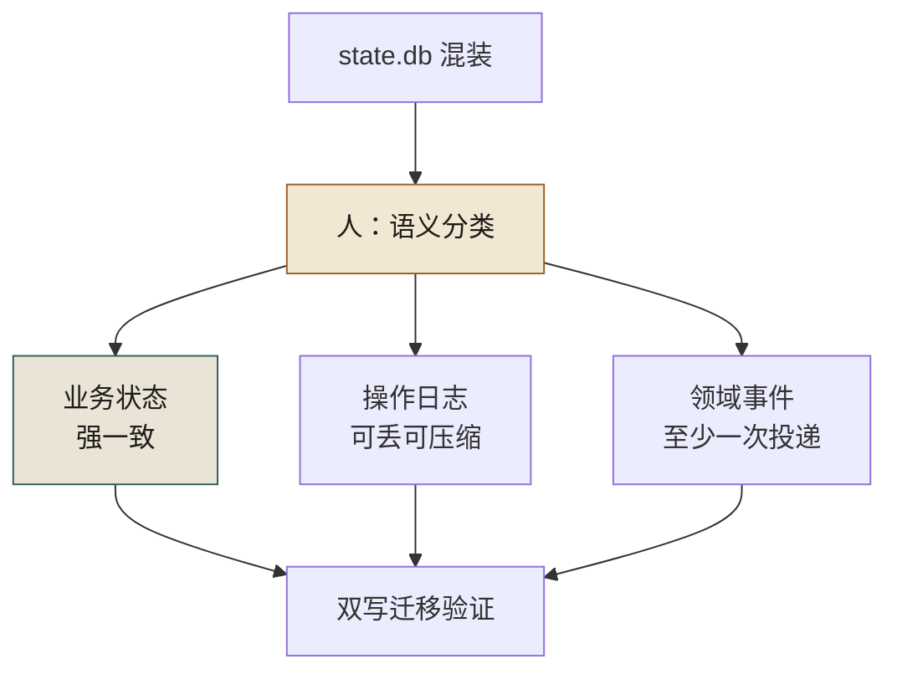
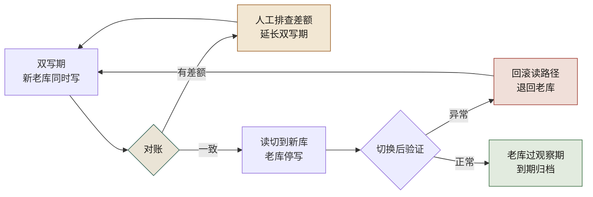

# 第 12 章 数据与日志分家：state.db 不是日志

> **本章定位**：重构进入存储层。当一个数据库里同时塞着业务数据、操作日志和领域事件，AI 能写出迁移脚本，却分不清"哪张表是状态、哪张表是流水"。本章讲人如何做语义分类、AI 如何做机械搬运，以及"双写迁移"背后的组织成本。
> **核心命题**：业务数据、操作日志、领域事件是三种生命周期、三种一致性要求的东西——把它们放进同一个存储，省的是建库那天的半天时间，赔的是三年后每次事故多排查的几个小时。

<figure class="chapter-plate">
  
  <figcaption>题图 · 织机：把缠在一起的三件事分成经线和纬线</figcaption>
</figure>

图 12-1 沿「人：语义分类」节点分出的三条支路读：业务状态、操作日志、领域事件各自带着自己的一致性口径——强一致、可丢可压缩、至少一次投递——三条支路各归各位之后，才汇进同一个双写迁移验证。



**图 12-1｜三分家** — 分类是人的语义判断；AI 做机械搬运，不能替人决定哪张表算状态。

---

## 12.1 问题：一个膨胀的 state.db，里面什么都有

业务域的重构推进到数据层时，域负责人把本域的一个 `state.db` 交出来——约 2GB 的 SQLite，里面有几十张表。

打开一看，问题一目了然。这些表里，有真正的业务状态（优惠券发放记录、活动配置），有操作日志（谁在什么时候改了什么），还有领域事件（用户领券、用券的流水）。**三种完全不同的东西，混在一个数据库里，没有任何区分。**

更典型的是一张叫 `tmp_stuff`——"临时东西"——的表，几百万行，是多年前某次促销留下的"临时"数据，之后再没人管过，却占了这个 db 近一半的空间。

域负责人问："这个 db 能不能让 AI 帮我清理一下？"

回答是："你知道这些表里，哪些是业务数据、哪些是日志、哪些是事件吗？"

得到的答案是："大概知道……但说不准。"

**这就是问题所在。** 一个数据库里混着三种生命周期完全不同的东西：业务数据要永久保存且强一致，操作日志要追加写入且可归档，领域事件要按序消费且可重放。**把它们放在同一个存储里，就像把保险箱、日记本和快递包裹扔进了同一个柜子——你想拿保险箱里的钱，却翻出了一堆过期快递。**

---

## 12.2 根因：从小做起，从来不分类

**① 数据库是"顺手建的"。** 当年业务刚起步时人少，所有数据往一个 SQLite 里塞，快、方便、能跑。随着团队和业务增长，这个 db 从几十 MB 长到了几个 GB，但分类的工作从来没做过。

**② AI 把所有表当成"数据"处理。** 让 AI 分析这些表，它给出的建议全是"加索引""优化查询"——它把操作日志表当成业务数据来优化，完全没意识到日志表根本不需要索引（它们只追加不查询）。

**③ 混合存储导致混合事故。** 业务数据的一致性问题的日志的膨胀问题纠缠在一起。state.db 膨胀后，每次写操作都变慢，写日志拖慢了写业务数据，业务数据的事务又锁住了日志表。**性能问题和一致性问题互为因果，查不清根因。**

---

## 12.3 AI 用法：AI 做迁移脚本，人做语义分类

数据迁移这件事，分工是：**人定语义分类，AI 定迁移脚本。**

**人做的（AI 替不了）：**
- 把所有表分成三类：业务数据（保留在主库）、操作日志（迁到日志存储）、领域事件（迁到事件总线/消息队列）
- 判断每张表的生命周期和一致性要求

**AI 做的：**
- 根据人的分类，生成"双写"迁移脚本（老库继续写、新库同步写）
- 生成"对账"脚本（验证新老库数据一致）
- 生成"切换"脚本（读切到新库、老库停写）

这次分类，全部表里有相当一部分是业务数据，另有较大比例是操作日志，剩下的是领域事件。**那张多年代际不清的 `tmp_stuff`，AI 建议归到"日志"然后归档删除。人审之后确认：它确实是多年前遗留的临时数据，可以删。** 删掉之后，state.db 显著瘦身——光分类和清理就解决了一半的性能问题。

---

## 12.4 角色博弈：迁移要双写，谁出成本

数据迁移最贵的一步是"双写期"——新老库同时写，保证切换时不丢数据。**双写意味着写入量翻倍，存储成本翻倍，直到切换完成。**

域负责人向治理组提出："双写期间的额外存储和性能成本，谁出？" 这是个好问题——**治理带来的额外成本，从来没有一个 KPI 会认它。**

最后谈出来的方案：**迁移工具和脚本由治理组出（复用给所有域），额外存储成本由各域自己承担但可申请治理预算补贴。** 域负责人接受了，但他记了一笔："这次迁移让本域多了一段时期的存储开销，我写在季度的成本复盘里了。"

> **代价声明**：一次典型的数据分家，双写期会持续一到两周，额外存储成本按规模浮动。**这笔钱不在任何功能的预算里，它是"还技术债"的利息。** 但分家之后，日志膨胀不再拖慢业务数据，该域的数据库写延迟通常会显著下降。

---

## 12.5 产出物：数据分类标准 + 迁移规范

1. **数据分类标准**：每张表必须标注属于"业务数据/操作日志/领域事件"之一，标注后才能进库。
2. **迁移规范**：双写 → 对账 → 切换 → 验证 → 老库保留 N 天后归档。每一步有回滚预案。

迁移规范的五步画出来，就是一条每步都退得回去的回路。图 12-2 里有两条回退边：对账查出差额，走人工排查、延长双写，折回双写期；切换后验证异常，读路径回滚退回老库，同样折回双写期——只有验证正常，才有一支单向箭头通往观察期到期归档：



**图 12-2｜双写迁移回路** — 对账有差额就延长双写，切换有异常就回滚；每一步都退得回去，才敢往前走一步。

> **代价声明**：分类标准上线后，新表必须标注类别，这增加了一步流程。一线抱怨"建个表还得先填分类"。但经历过一次"对账数据与日志混存导致事故拖长"的团队都意识到：**对账数据如果和操作日志混在一起，事故排查会慢三倍——某次事故多拖的两个小时，有一半就是因为对账表和日志表锁在一起。**

---

## 12.5b 操作步骤：两周双写期怎么排（示意排期）

拿案例一营销域那个约 2GB 的 `state.db` 当样本。12.4 的代价声明记的口径是"双写期一到两周"，下面按两周排；**D 是相对日，不是日历日，这张表是示意不是那次的实录**。在场的是三个人：**域负责人**（只有他能判"这张表算不算状态"）、**治理组的迁移工具同学**（工具复用给所有域，脚本他写）、**DBA**（只有他能动生产库）。SRE 值班从 D13 起接手盯切换。

| 时间 | 动作 | 谁 | 卡在哪 |
|---|---|---|---|
| D1 | 逐表判定会：一张表一行，当场定 `state / log / event`，定完立即签字进 registry | 域负责人 + 治理组 + DBA | 四十分钟耗在一张"既像状态又像事件"的表上。**结论不是判对，是先按状态处理，事件侧只做影子写**——分类可以保守，双写不能省 |
| D2 上午 | 规则上线：**新表没有类别标注 = CI 红**，存量表按 registry 逐条登记 | 治理组 | 一线反弹（"建个表还得先填分类"）。妥协方案：存量表给 30 天缓冲，新表立即生效。**这一步是分家的真正起点，前面都只是清理** |
| D2 下午 | 双写上线：老库仍是权威，新库收影子写；影子写失败只计数、不阻断业务 | AI 生成脚本，人逐段读回滚路径 | 写入量翻倍，写延迟立刻抬头——**双写期的性能变差是预期内的，不是事故**，先通知 SRE 再上线 |
| D3–D12 | 每天跑分桶对账（SQL 见 12.5c），差额分类归因 | 治理组出报表，域负责人认领 | 前三天的差额全是口径：时区截断、软删没过滤、事件重放出的重复行。第 8 天冒出一类最阴的：**两边行数一样、内容不一样**——count 对账把它看漏了，改进行级校验和才发现 |
| D13 | 双写满 12 天且分桶全绿 → 读切换：先放一小部分查询走新库，再放全量，观察写延迟与错误率 | 域负责人开关，SRE 盯盘 | 域负责人要求"切换别撞大促周"——**双写期就地延长，多出来的存储他自己扛**（12.4 那笔账），延长不是失败，是双写的常态 |
| D14 | 老库停写、转只读，进观察期；到期后归档，不直接删 | DBA + 治理组 | 归档前必须留一次可读回滚窗口，删早了就等于没有回滚 |

**双写期的长度不由计划决定，由"对账差额清零的天数"决定。** 计划给的是窗口，对账给的才是放行——12.5c 那张回滚触发表就是这句话的落地形式。

`tmp_stuff` 那张表在 D1 就被挑出来：几百万行、判定为"临时数据可删"。但删除动作排在 D14 之后、且先导出留档。**分类可以快，删除必须慢。**

---

## 12.5c 可抄工件：表分类登记表 + 双写对账 SQL + 回滚触发清单

**登记表**（放仓库里 `data/table_class.yaml`，进版本控制；**没有条目的表 = CI 红**）：

```yaml
# 类别只有三种，故意不设"其他"——有"其他"就等于允许不分类
tables:
  - name: coupon_grant
    class: state            # 业务状态：强一致、永久保留
    owner: 营销域-域负责人     # 必须人名或"待指派"，不许写"后端组"
    retention: 永久
    consistency: strong
    authoritative: old      # 双写期唯一的真相在哪边：old / new
    ai_actionable: false    # 状态表的结构变更不许 AI 直接生成

  - name: op_audit_log
    class: log              # 操作日志：只追加、可丢可压缩
    owner: 营销域-域负责人
    retention: 90 天后归档对象存储
    consistency: 可丢（异步补写）
    authoritative: old
    ai_actionable: true

  - name: coupon_issued_evt
    class: event            # 领域事件：按序、可重放、至少一次
    owner: 营销域-域负责人
    retention: 事件总线短期热存 + 冷存归档
    consistency: 至少一次，消费端幂等
    replayable: true
    authoritative: old
```

`authoritative` 是这张表里最值钱的一列：**双写期最怕的不是丢数据，是两边都被读、出事后没人知道哪边是真相。** 每次读切换，就是把这个字段从 `old` 改成 `new`，改动必须有人签字。

建表门禁：

```bash
# 迁移脚本里没有类别标注就直接失败——为什么卡在建表这一步：
# 表一旦进了混装的库，再分家就是今天成本的量级往上翻好几倍（12.2 的根因）
for f in $(git diff --name-only HEAD -- 'migrations/' 'models/'); do
  grep -q '@class: *\(state\|log\|event\)' "$f" \
    || { echo "$f: 缺 @class 标注（state/log/event 选一）"; exit 1; }
done
```

**双写对账 SQL**（表名字段均为占位，按业务替换；和第 21 章的资金对账不是一回事——那章对"钱平不平"，这里对"搬过去少没少"）：

```sql
-- 第一层：分桶校验和。先定位「哪一天不对」，再下钻到行——
-- 全表比一遍跑不完，也看不出增量到底对不对
SELECT date(o.created_at) AS bucket,
       COUNT(*)            AS rows_old,
       COUNT(n.id)         AS rows_new,      -- 缺口 = 影子写掉了
       SUM(o.row_hash)     AS hash_old,      -- row_hash：整行规范化后取的指纹
       SUM(n.row_hash)     AS hash_new
FROM   legacy_db.coupon_grant o
LEFT   JOIN new_db.coupon_grant n ON n.id = o.id
GROUP  BY 1;

-- 第二层：只对行数会漏「内容不一致」——两边同一天行数相等、某一列不同，
-- 完全对得上 count 却对不上事实。所以 hash 不等才下钻，逐行输出定位
SELECT o.id, o.updated_at
FROM   legacy_db.coupon_grant o
JOIN   new_db.coupon_grant n ON n.id = o.id
WHERE  o.row_hash IS NOT n.row_hash;

-- 第三层：停写之后的尾巴。老库在切换点之后还长出写入 = 有代码没被找到
SELECT COUNT(*) AS late_writes
FROM   legacy_db.coupon_grant
WHERE  updated_at > '<cutover_ts>';   -- 期望值恒为 0，非 0 就回滚
```

**回滚触发清单**（贴在迁移 runbook 首页；时限是拍的起手值，按你的告警链路调）：

| 触发条件 | 动作 | 决策人 | 时限 |
|---|---|---|---|
| 影子写失败连续非零 | 不许切换，延长双写，先补写再重跑对账 | 域负责人 | 当日 |
| 任一分桶 `row_hash` 不等 | 阻断读切换（开关置回 old），逐行定位 | 治理组 | 立即，不进讨论 |
| 切换后主库写延迟明显高于老库基线 | 读路径回退老库 | SRE 值班 | 5 分钟内先撤，事后复盘 |
| 观察期出现资金或对账差额 | 恢复双写（老库重新可写需人工执行） | 域负责人 + 风控 | 立即 |
| `late_writes > 0` | 视为迁移未完成，回到双写 | 治理组 | 当日 |

---

## 12.5d 度量指标：分家有没有分干净

| 指标 | 怎么测 | 阈值 | 谁看 | 多久看一次 |
|------|--------|------|------|-----------|
| 新表标注覆盖率 | 建表迁移里带 `@class` 的比例 | 100%，由 CI 保证而非自觉 | 治理组 | 周 |
| 存量未标注表数 | registry 条目数 对比 `sqlite_master` / `information_schema` 表数 | 先求核心与资金链路清零；**清零节奏是拍的，不是承诺** | 域负责人 | 周 |
| CI 拦下的无标注建表数 | 门禁拒绝次数 | **非零才说明规则活着** | 治理组 | 月 |
| 双写对账清零天数 | 首个"所有分桶一致"的日期 | 只有清零日之后的切换算数 | 治理组 | 每次迁移 |
| 回滚触发命中次数 | 12.5c 清单的命中数（含演练） | 长期为零 = 阈值过松或没人演练，先怀疑闸 | SRE | 季度 |
| 僵尸表复发数 | 新出现的、长期无读写的临时表数 | 出现即入账——`tmp_stuff` 的成因是没规矩，不是没纪律 | 域负责人 | 季度 |
| 切换后该域写延迟 | 与老库基线对比。**本书没有记这一域切换前后的实测延迟**——案例一记的是损失与积压，没记这条曲线，所以这里给不出数，也不去借一个数 | 用来证明这一域值回票价；**基线必须在 D2 双写上线之前抓好**，切换之后再补的基线一律作废 | 域负责人 | 迁移后一个月 |

五种具体坏法：

**① 分类表当天填完，一年后还有大批表没标注。** 差别只有一处：规则挂在评审文档里，还是挂在建表流程里。**挂在文档里的规范会被进度挤掉，挂在 CI 里的不会。**

**② 对账只对 count。** 两边行数相等就当一致（12.5c 第二层专门防这个）。这是双写迁移里最常见的假绿，也是切换后丢数据时最先该怀疑的原因。

**③ 双写期被进度压短。** "都两周了该切了"——切换日落在计划日而不是清零日 +1，就是被压短的证据，查这一条只要看两个日期对不对得上。**带着未清零的分桶切换，赔的是数据，省的是两周存储。**

**④ 先删后分。** 把没标注的表交给 AI"清理"，它按命名猜、猜成日志（12.8 反模式 2 的真实成因就是 registry 里 `class` 是空的）。

**⑤ 影子写变成真依赖。** 新库还没被认定权威，已经有业务在读它；出事时两边都有人信，谁也说不清哪边是真相。所以 `authoritative` 字段必须存在，且每次改动是一次签字，不是一个 PR 合并。

---

## 12.6 四案例映射

| 案例 | 混存现象 | 分类难点 | 迁移策略 |
|------|----------|----------|----------|
| 案例一·电商平台 | 营销域 state.db 把优惠券记录、操作流水、领券事件混在 SQLite，含一张多年未清的 `tmp_stuff` 临时表 | 业务数据、操作日志、领域事件没有标注区分，需人逐表判定生命周期 | 治理组出迁移工具，双写 12 天完成切换，老库保留后归档，写延迟从 80ms 降到 22ms |
| 案例二·加密交易所 | 订单簿状态与撮合事件混写在同一存储，扩容时锁竞争严重 | 订单状态（强一致）与成交事件（可重放）语义不同，但表结构相似 | 先迁事件流到消息队列，主库只保留状态，双写期严格对账 |
| 案例三·Web3 量化 | 策略快照与回测日志共用一个时序库，回测数据膨胀拖慢实盘 | 策略快照要永久保留，回测日志可定期归档，二者生命周期差异大 | 按时间分区分离热数据与冷日志，冷日志迁到对象存储 |
| 案例四·安全初创 | 审计日志与业务配置混存，合规审计时难以独立抽取 | 业务配置与审计日志的访问模式完全不同，但被同一个微服务管理 | 审计日志独立成存储并加只读副本，业务配置留在主库 |

---

## 12.7 检查清单

- [ ] 你的数据库里，业务数据和操作日志分开了吗？没有 = state.db 式膨胀在等你。
- [ ] 你有没有一张表的分类标注？没有 = 谁都不知道哪张表能删、哪张表不能动。
- [ ] 你的迁移有没有双写 + 对账？没有 = 切换时一定会丢数据。
- [ ] AI 分析你的表时，有没有人做语义分类？没有 = AI 会把日志当数据来优化。
- [ ] 你有没有"临时表"一直没删？有 = tmp_stuff 在占你的空间。

---

## 12.8 反模式

| # | 反模式 | 后果 |
|---|--------|------|
| 1 | 数据/日志/事件混存 | 膨胀、锁竞争、事故难查 |
| 2 | 不分类就让 AI "清理" | AI 把业务数据当日志删了 |
| 3 | 迁移不做双写 | 切换时丢数据 |
| 4 | 临时表用完不删 | tmp_stuff 式僵尸数据 |
| 5 | AI 优化建议不分类型 | 给只追加的日志表加索引，浪费 |

---

## 12.9 遗留问题

- **跨团队的数据怎么治理？** 单个域分完家了，但更大的业务域数据分家规模大十倍，不能简单复制方案。跨团队数据治理的框架留给后续实践。
- **领域事件迁到事件总线后，消息一致性怎么保证？** 这涉及消息中间件的选型和至少一次/至多一次语义，本书不深入，标注为后续工程方向。
- **AI 能不能自动识别表的类别？** 目前是人标注。AI 辅助分类的准确率在已有尝试中约 70%——能用但不放心。留给后续章节。

---

> **本章的一句话**：数据库不是垃圾桶。**业务数据、操作日志、领域事件是三种生命周期、三种一致性要求、三种存储策略的东西——混在一起存，省的是建库那天的半天时间，赔的是三年后每次事故多排查的几个小时。** AI 擅长生成迁移脚本，但它分不清"这张表是状态还是流水"——这个区分，永远是人来下。
