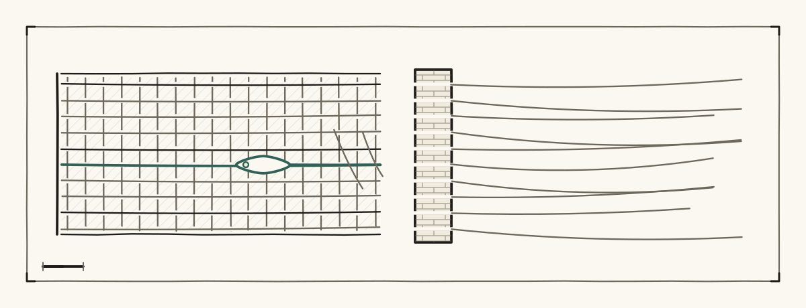
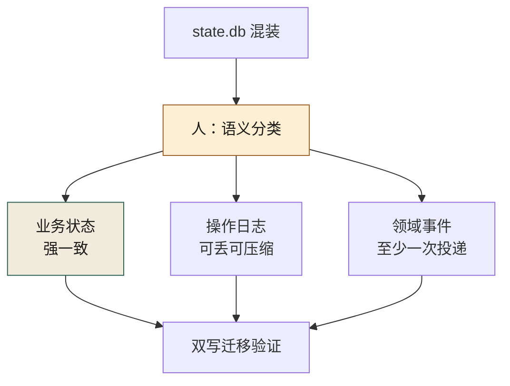
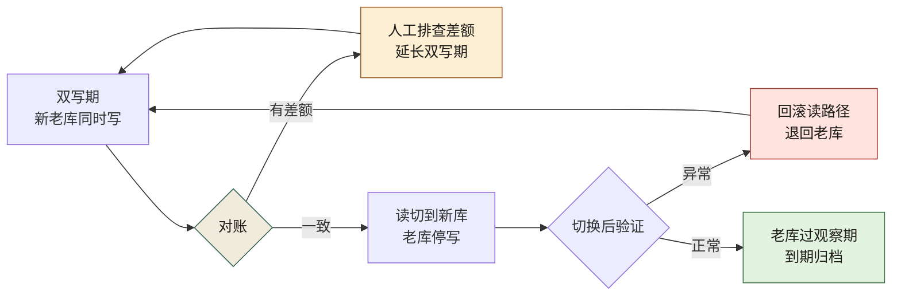
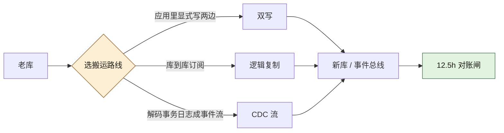
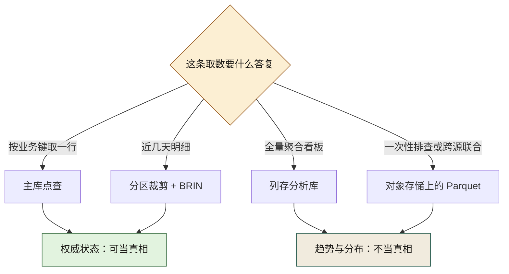
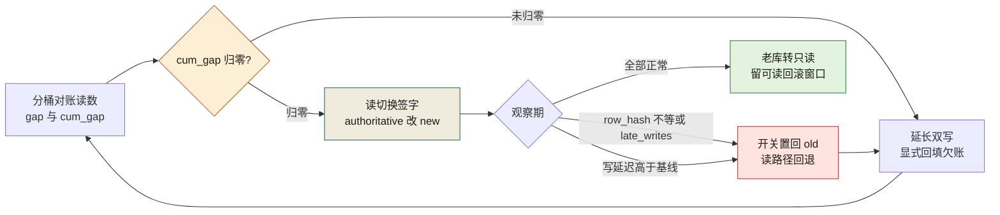

# 第 12 章 数据与日志分家：state.db 不是日志

> **本章定位**：重构进入存储层。当一个数据库里同时塞着业务数据、操作日志和领域事件，AI 能写出迁移脚本，却分不清"哪张表是状态、哪张表是流水"。本章讲人如何做语义分类、AI 如何做机械搬运，以及"双写迁移"背后的组织成本。
> **核心命题**：业务数据、操作日志、领域事件是三种生命周期、三种一致性要求的东西——把它们放进同一个存储，省的是建库那天的半天时间，赔的是三年后每次事故多排查的几个小时。

<figure class="chapter-plate">
  
  <figcaption>题图 · 织机：把缠在一起的三件事分成经线和纬线</figcaption>
</figure>

图 12-1 沿「人：语义分类」节点分出的三条支路读：业务状态、操作日志、领域事件各自带着自己的一致性口径——强一致、可丢可压缩、至少一次投递——三条支路各归各位之后，才汇进同一个双写迁移验证。



**图 12-1｜三分家** — 分类是人的语义判断；AI 做机械搬运，不能替人决定哪张表算状态。

---

## 12.1 问题：一个膨胀的 state.db，里面什么都有

业务域的重构推进到数据层时，域负责人把本域的一个 `state.db` 交出来——约 2GB 的 SQLite，里面有几十张表。

打开一看，问题一目了然。这些表里，有真正的业务状态（优惠券发放记录、活动配置），有操作日志（谁在什么时候改了什么），还有领域事件（用户领券、用券的流水）。**三种完全不同的东西，混在一个数据库里，没有任何区分。**

更典型的是一张叫 `tmp_stuff`——"临时东西"——的表，几百万行，是多年前某次促销留下的"临时"数据，之后再没人管过，却占了这个 db 近一半的空间。

域负责人问："这个 db 能不能让 AI 帮我清理一下？"

回答是："你知道这些表里，哪些是业务数据、哪些是日志、哪些是事件吗？"

得到的答案是："大概知道……但说不准。"

**这就是问题所在。** 一个数据库里混着三种生命周期完全不同的东西：业务数据要永久保存且强一致，操作日志要追加写入且可归档，领域事件要按序消费且可重放。**把它们放在同一个存储里，就像把保险箱、日记本和快递包裹扔进了同一个柜子——你想拿保险箱里的钱，却翻出了一堆过期快递。**

---

## 12.2 根因：从小做起，从来不分类

**① 数据库是"顺手建的"。** 当年业务刚起步时人少，所有数据往一个 SQLite 里塞，快、方便、能跑。随着团队和业务增长，这个 db 从几十 MB 长到了几个 GB，但分类的工作从来没做过。

**② AI 把所有表当成"数据"处理。** 让 AI 分析这些表，它给出的建议全是"加索引""优化查询"——它把操作日志表当成业务数据来优化，完全没意识到日志表根本不需要索引（它们只追加不查询）。

**③ 混合存储导致混合事故。** 业务数据的一致性问题的日志的膨胀问题纠缠在一起。state.db 膨胀后，每次写操作都变慢，写日志拖慢了写业务数据，业务数据的事务又锁住了日志表。**性能问题和一致性问题互为因果，查不清根因。**

---

## 12.3 AI 用法：AI 做迁移脚本，人做语义分类

数据迁移这件事，分工是：**人定语义分类，AI 定迁移脚本。**

**人做的（AI 替不了）：**
- 把所有表分成三类：业务数据（保留在主库）、操作日志（迁到日志存储）、领域事件（迁到事件总线/消息队列）
- 判断每张表的生命周期和一致性要求

**AI 做的：**
- 根据人的分类，生成"双写"迁移脚本（老库继续写、新库同步写）
- 生成"对账"脚本（验证新老库数据一致）
- 生成"切换"脚本（读切到新库、老库停写）

这次分类，全部表里有相当一部分是业务数据，另有较大比例是操作日志，剩下的是领域事件。**那张多年代际不清的 `tmp_stuff`，AI 建议归到"日志"然后归档删除。人审之后确认：它确实是多年前遗留的临时数据，可以删。** 删掉之后，state.db 显著瘦身——光分类和清理就解决了一半的性能问题。

---

## 12.4 角色博弈：迁移要双写，谁出成本

数据迁移最贵的一步是"双写期"——新老库同时写，保证切换时不丢数据。**双写意味着写入量翻倍，存储成本翻倍，直到切换完成。**

域负责人向治理组提出："双写期间的额外存储和性能成本，谁出？" 这是个好问题——**治理带来的额外成本，从来没有一个 KPI 会认它。**

最后谈出来的方案：**迁移工具和脚本由治理组出（复用给所有域），额外存储成本由各域自己承担但可申请治理预算补贴。** 域负责人接受了，但他记了一笔："这次迁移让本域多了一段时期的存储开销，我写在季度的成本复盘里了。"

> **代价声明**：一次典型的数据分家，双写期会持续一到两周，额外存储成本按规模浮动。**这笔钱不在任何功能的预算里，它是"还技术债"的利息。** 但分家之后，日志膨胀不再拖慢业务数据，该域的数据库写延迟通常会显著下降。

---

## 12.5 产出物：数据分类标准 + 迁移规范

1. **数据分类标准**：每张表必须标注属于"业务数据/操作日志/领域事件"之一，标注后才能进库。
2. **迁移规范**：双写 → 对账 → 切换 → 验证 → 老库保留 N 天后归档。每一步有回滚预案。

迁移规范的五步画出来，就是一条每步都退得回去的回路。图 12-2 里有两条回退边：对账查出差额，走人工排查、延长双写，折回双写期；切换后验证异常，读路径回滚退回老库，同样折回双写期——只有验证正常，才有一支单向箭头通往观察期到期归档：



**图 12-2｜双写迁移回路** — 对账有差额就延长双写，切换有异常就回滚；每一步都退得回去，才敢往前走一步。

> **代价声明**：分类标准上线后，新表必须标注类别，这增加了一步流程。一线抱怨"建个表还得先填分类"。但经历过一次"对账数据与日志混存导致事故拖长"的团队都意识到：**对账数据如果和操作日志混在一起，事故排查会慢三倍——某次事故多拖的两个小时，有一半就是因为对账表和日志表锁在一起。**

---

## 12.5b 操作步骤：两周双写期怎么排（示意排期）

拿案例一营销域那个约 2GB 的 `state.db` 当样本。12.4 的代价声明记的口径是"双写期一到两周"，下面按两周排；**D 是相对日，不是日历日，这张表是示意不是那次的实录**。在场的是三个人：**域负责人**（只有他能判"这张表算不算状态"）、**治理组的迁移工具同学**（工具复用给所有域，脚本他写）、**DBA**（只有他能动生产库）。SRE 值班从 D13 起接手盯切换。

| 时间 | 动作 | 谁 | 卡在哪 |
|---|---|---|---|
| D1 | 逐表判定会：一张表一行，当场定 `state / log / event`，定完立即签字进 registry | 域负责人 + 治理组 + DBA | 四十分钟耗在一张"既像状态又像事件"的表上。**结论不是判对，是先按状态处理，事件侧只做影子写**——分类可以保守，双写不能省 |
| D2 上午 | 规则上线：**新表没有类别标注 = CI 红**，存量表按 registry 逐条登记 | 治理组 | 一线反弹（"建个表还得先填分类"）。妥协方案：存量表给 30 天缓冲，新表立即生效。**这一步是分家的真正起点，前面都只是清理** |
| D2 下午 | 双写上线：老库仍是权威，新库收影子写；影子写失败只计数、不阻断业务 | AI 生成脚本，人逐段读回滚路径 | 写入量翻倍，写延迟立刻抬头——**双写期的性能变差是预期内的，不是事故**，先通知 SRE 再上线 |
| D3–D12 | 每天跑分桶对账（SQL 见 12.5c），差额分类归因 | 治理组出报表，域负责人认领 | 前三天的差额全是口径：时区截断、软删没过滤、事件重放出的重复行。第 8 天冒出一类最阴的：**两边行数一样、内容不一样**——count 对账把它看漏了，改进行级校验和才发现 |
| D13 | 双写满 12 天且分桶全绿 → 读切换：先放一小部分查询走新库，再放全量，观察写延迟与错误率 | 域负责人开关，SRE 盯盘 | 域负责人要求"切换别撞大促周"——**双写期就地延长，多出来的存储他自己扛**（12.4 那笔账），延长不是失败，是双写的常态 |
| D14 | 老库停写、转只读，进观察期；到期后归档，不直接删 | DBA + 治理组 | 归档前必须留一次可读回滚窗口，删早了就等于没有回滚 |

**双写期的长度不由计划决定，由"对账差额清零的天数"决定。** 计划给的是窗口，对账给的才是放行——12.5c 那张回滚触发表就是这句话的落地形式。

`tmp_stuff` 那张表在 D1 就被挑出来：几百万行、判定为"临时数据可删"。但删除动作排在 D14 之后、且先导出留档。**分类可以快，删除必须慢。**

---

## 12.5c 可抄工件：表分类登记表 + 双写对账 SQL + 回滚触发清单

**登记表**（放仓库里 `data/table_class.yaml`，进版本控制；**没有条目的表 = CI 红**）：

```yaml
# 类别只有三种，故意不设"其他"——有"其他"就等于允许不分类
tables:
  - name: coupon_grant
    class: state            # 业务状态：强一致、永久保留
    owner: 营销域-域负责人     # 必须人名或"待指派"，不许写"后端组"
    retention: 永久
    consistency: strong
    authoritative: old      # 双写期唯一的真相在哪边：old / new
    ai_actionable: false    # 状态表的结构变更不许 AI 直接生成

  - name: op_audit_log
    class: log              # 操作日志：只追加、可丢可压缩
    owner: 营销域-域负责人
    retention: 90 天后归档对象存储
    consistency: 可丢（异步补写）
    authoritative: old
    ai_actionable: true

  - name: coupon_issued_evt
    class: event            # 领域事件：按序、可重放、至少一次
    owner: 营销域-域负责人
    retention: 事件总线短期热存 + 冷存归档
    consistency: 至少一次，消费端幂等
    replayable: true
    authoritative: old
```

`authoritative` 是这张表里最值钱的一列：**双写期最怕的不是丢数据，是两边都被读、出事后没人知道哪边是真相。** 每次读切换，就是把这个字段从 `old` 改成 `new`，改动必须有人签字。

建表门禁：

```bash
# 迁移脚本里没有类别标注就直接失败——为什么卡在建表这一步：
# 表一旦进了混装的库，再分家就是今天成本的量级往上翻好几倍（12.2 的根因）
for f in $(git diff --name-only HEAD -- 'migrations/' 'models/'); do
  grep -q '@class: *\(state\|log\|event\)' "$f" \
    || { echo "$f: 缺 @class 标注（state/log/event 选一）"; exit 1; }
done
```

**双写对账 SQL**（表名字段均为占位，按业务替换；和第 21 章的资金对账不是一回事——那章对"钱平不平"，这里对"搬过去少没少"）：

```sql
-- 第一层：分桶校验和。先定位「哪一天不对」，再下钻到行——
-- 全表比一遍跑不完，也看不出增量到底对不对
SELECT date(o.created_at) AS bucket,
       COUNT(*)            AS rows_old,
       COUNT(n.id)         AS rows_new,      -- 缺口 = 影子写掉了
       SUM(o.row_hash)     AS hash_old,      -- row_hash：整行规范化后取的指纹
       SUM(n.row_hash)     AS hash_new
FROM   legacy_db.coupon_grant o
LEFT   JOIN new_db.coupon_grant n ON n.id = o.id
GROUP  BY 1;

-- 第二层：只对行数会漏「内容不一致」——两边同一天行数相等、某一列不同，
-- 完全对得上 count 却对不上事实。所以 hash 不等才下钻，逐行输出定位
SELECT o.id, o.updated_at
FROM   legacy_db.coupon_grant o
JOIN   new_db.coupon_grant n ON n.id = o.id
WHERE  o.row_hash IS NOT n.row_hash;

-- 第三层：停写之后的尾巴。老库在切换点之后还长出写入 = 有代码没被找到
SELECT COUNT(*) AS late_writes
FROM   legacy_db.coupon_grant
WHERE  updated_at > '<cutover_ts>';   -- 期望值恒为 0，非 0 就回滚
```

**回滚触发清单**（贴在迁移 runbook 首页；时限是拍的起手值，按你的告警链路调）：

| 触发条件 | 动作 | 决策人 | 时限 |
|---|---|---|---|
| 影子写失败连续非零 | 不许切换，延长双写，先补写再重跑对账 | 域负责人 | 当日 |
| 任一分桶 `row_hash` 不等 | 阻断读切换（开关置回 old），逐行定位 | 治理组 | 立即，不进讨论 |
| 切换后主库写延迟明显高于老库基线 | 读路径回退老库 | SRE 值班 | 5 分钟内先撤，事后复盘 |
| 观察期出现资金或对账差额 | 恢复双写（老库重新可写需人工执行） | 域负责人 + 风控 | 立即 |
| `late_writes > 0` | 视为迁移未完成，回到双写 | 治理组 | 当日 |

---

## 12.5d 度量指标：分家有没有分干净

| 指标 | 怎么测 | 阈值 | 谁看 | 多久看一次 |
|------|--------|------|------|-----------|
| 新表标注覆盖率 | 建表迁移里带 `@class` 的比例 | 100%，由 CI 保证而非自觉 | 治理组 | 周 |
| 存量未标注表数 | registry 条目数 对比 `sqlite_master` / `information_schema` 表数 | 先求核心与资金链路清零；**清零节奏是拍的，不是承诺** | 域负责人 | 周 |
| CI 拦下的无标注建表数 | 门禁拒绝次数 | **非零才说明规则活着** | 治理组 | 月 |
| 双写对账清零天数 | 首个"所有分桶一致"的日期 | 只有清零日之后的切换算数 | 治理组 | 每次迁移 |
| 回滚触发命中次数 | 12.5c 清单的命中数（含演练） | 长期为零 = 阈值过松或没人演练，先怀疑闸 | SRE | 季度 |
| 僵尸表复发数 | 新出现的、长期无读写的临时表数 | 出现即入账——`tmp_stuff` 的成因是没规矩，不是没纪律 | 域负责人 | 季度 |
| 切换后该域写延迟 | 与老库基线对比。**本书没有记这一域切换前后的实测延迟**——案例一记的是损失与积压，没记这条曲线，所以这里给不出数，也不去借一个数 | 用来证明这一域值回票价；**基线必须在 D2 双写上线之前抓好**，切换之后再补的基线一律作废 | 域负责人 | 迁移后一个月 |

五种具体坏法：

**① 分类表当天填完，一年后还有大批表没标注。** 差别只有一处：规则挂在评审文档里，还是挂在建表流程里。**挂在文档里的规范会被进度挤掉，挂在 CI 里的不会。**

**② 对账只对 count。** 两边行数相等就当一致（12.5c 第二层专门防这个）。这是双写迁移里最常见的假绿，也是切换后丢数据时最先该怀疑的原因。

**③ 双写期被进度压短。** "都两周了该切了"——切换日落在计划日而不是清零日 +1，就是被压短的证据，查这一条只要看两个日期对不对得上。**带着未清零的分桶切换，赔的是数据，省的是两周存储。**

**④ 先删后分。** 把没标注的表交给 AI"清理"，它按命名猜、猜成日志（12.8 反模式 2 的真实成因就是 registry 里 `class` 是空的）。

**⑤ 影子写变成真依赖。** 新库还没被认定权威，已经有业务在读它；出事时两边都有人信，谁也说不清哪边是真相。所以 `authoritative` 字段必须存在，且每次改动是一次签字，不是一个 PR 合并。

---

## 12.5e 存储侧的落地件：分区策略与索引选择的判据

12.5c 的登记表回答的是"这张表是什么"，回答不了"它该怎么长"。分家之后每一类表都落到了真实的存储上，这时候省不掉两个决定：**它按什么切分、它带哪些索引。** 这两个决定 AI 会给建议，但它的目标函数是"让当前这条查询更快"，不是"让这张表三年后还能归档"——12.2 那条"给只追加的日志表加索引"的建议就是这么来的。

> **档位声明**：本节所有语法按 PostgreSQL 官方规范口径写（B 档）。**本机没有装 psql，也没有 docker，下面每条 DDL 都没有在这台机器上跑过**——抄进你的迁移前先在自己的库上跑一遍，并核对你那个版本的文档。凡是我没出处的默认值，一律不写。

### 三类表 × 三种存储动作

| 类别 | 分区 | 索引默认 | 归档动作 | 不许做什么 |
|---|---|---|---|---|
| `state` 业务状态 | 一般不分区；量大时按业务键哈希分区 | 按读路径建 B-tree / 局部索引 | 不归档，永久保留 | 不许用 `TRUNCATE` 清历史 |
| `log` 操作日志 | 按时间 `RANGE` 分区，一月一片 | BRIN 或不建 | `DETACH PARTITION` 后整片落对象存储 | 不许建 B-tree 明细索引，不许 `DELETE` 掉期 |
| `event` 领域事件 | 按时间 `RANGE` 分区（重放窗口即分区窗口） | BRIN；需要按内容检索才上 GIN | 热窗口 detach，冷存留可重放副本 | 不许原地改事件正文（改了就不可重放） |

一句话读法：**分区的价值不在表变大，在归档这一步变便宜**——detach 是元数据操作，`DELETE` 是一场自我伤害：留下死元组、触发 vacuum 长跑、把 WAL 灌满，那又是一次混装式的疼。

### 分区：按时间切，归档就是一次 DETACH

```sql
-- 日志表：时间 RANGE 分区。分区键要进唯一约束，这是 PG 的硬约束：
-- "唯一约束 / 主键必须包含分区键的所有列"，所以 id 单列主键在这张表上不成立
CREATE TABLE op_audit_log (
    id          bigint GENERATED ALWAYS AS IDENTITY,
    actor       text        NOT NULL,
    action      text        NOT NULL,
    target      text,
    created_at  timestamptz NOT NULL DEFAULT now(),
    PRIMARY KEY (id, created_at)          -- 业务唯一性改由"写入方 + 时间"共同兜（示意口径）
) PARTITION BY RANGE (created_at);

CREATE TABLE op_audit_log_202603 PARTITION OF op_audit_log
    FOR VALUES FROM ('2026-03-01') TO ('2026-04-01');   -- 上界开区间：跨月不重不漏

-- 归档：先脱离，再校验可读，最后才允许"看不见"
-- 12.5b 那句"分类可以快，删除必须慢"，物理上就落在这两步之间
ALTER TABLE op_audit_log DETACH PARTITION op_audit_log_202603;
-- ...导出到对象存储、留一次可读回滚窗口（12.5b D14 那条）...
DROP TABLE op_audit_log_202603;
```

三件事要提前知道，它们都是**静默失效面**：

- **查询里没有分区键谓词，就等于没有分区。** `WHERE actor = 'x'` 不带时间条件，会扫全部分区；把时间列套进函数（`date_trunc('month', created_at) = ...`、`created_at::date = ...`）同样会让裁剪失效——裁剪是**对谓词形状**做的优化，不是对语义等价式做的。这条判据可以机检：`EXPLAIN` 里出现 `Seq Scan on ...` 的分区数量，就是这条查询实际付的代价。
- **分区不能事后加。** 普通表转分区表要重建 + 重灌数据，等于再来一次 12.5b 的双写。所以 12.5c 登记表里 `retention` 那一列，就是在这里决定分不分区——**它是治理字段，不是 DBA 的私有偏好。**
- **跨分区更新更贵。** 一条 `UPDATE` 如果改了 `created_at`，行会从一个分区搬到另一个分区，代价高于同分区更新；事件表尤其要禁掉这类改写。

### 索引：先问"这张表被怎么读"，再问"用哪一种"

```sql
-- 状态表：按读路径建，一条读路径一条索引，不许多
CREATE INDEX idx_coupon_grant_user ON coupon_grant (user_id, status);

-- 只追加的日志/事件表：BRIN 按物理块记值域，体积极小、随追加自然增长
-- 为什么这里不用 B-tree：日志表按时间顺序追加，块级值域天然有序，
-- B-tree 只换来每天一次的写放大和一份要跟着备份的索引
CREATE INDEX brin_audit_time ON op_audit_log USING BRIN (created_at);

-- 软删的表：把"永远只查未删"这条事实写进索引定义（局部索引）
CREATE INDEX idx_coupon_active ON coupon_grant (user_id) WHERE deleted = FALSE;

-- 事件正文要按内容检索时才上 GIN；不检索就别建，JSONB 上的 GIN 是写入税
CREATE INDEX idx_evt_payload ON coupon_issued_evt USING GIN (payload jsonb_path_ops);
```

四条选择判据，按顺序问：

1. **等值点查还是范围扫？** 点查 B-tree，追加型时间列 BRIN。
2. **这张表会被归档吗？** 会 → 尽量让索引不跨分区（BRIN / 局部索引），否则每次 detach 都要重建。
3. **写入 QPS 多少？** 状态表上第四条索引之前，先问前三条有没有真被用过。
4. **谁来看它有没有被用？** 系统视图里的索引扫描计数是唯一诚实的证据（读法：按 `pg_stat_user_indexes` 的 `idx_scan` 判，**本机没有库可查，这是规范口径**）。一个季度内 `idx_scan` 为零的索引进删除队列——**它是索引层的僵尸表，和 `tmp_stuff` 同一种病**。

> **它替代不了什么**：索引与分区是**性能与归档**的手段，不是分类的替代品。12.3 那句话在这里仍然成立——先有人判过"这张表是 log 还是 state"，才轮到问它怎么切、建什么索引。跳过前者直接调索引，AI 也会，而且调得很漂亮。

---

## 12.5f 搬运路线的语义边界：双写、逻辑复制、CDC

三条路线都能把数据从老库挪到新库，**区别不在快慢，在各自看不见的东西不同**。选型会上最常见的问法是"CDC 不用改业务代码，为什么不直接上 CDC"——这一节回答的就是这句话的代价。图 12-3 把三条路线画在同一个闸口前面，读它只要读一件事：
**三条支路最后都汇到同一格对账闸**——路线不同只改变"谁来背语义"，不改变"必须有人背"。



**图 12-3｜三条搬运路线** — 三条路都要过同一道对账闸；路线不同只改变"谁来背语义"，不改变"必须有人背"。

| 路线 | 它搬得动的 | 它看不见的（要人补的） | 什么时候选它 |
|---|---|---|---|
| 应用双写 | 你显式写出去的那些字段与那些路径 | 没被改到的写入路径（老代码、批处理、别人偷偷加的旁路） | 迁移窗口短、写入方收敛在一个服务里 |
| 库到库逻辑复制 | 表级 DML（INSERT/UPDATE/DELETE） | **结构变更、序列与默认值、TRUNCATE（要显式发布）、跨库外键语义** | 目标是"整库镜像"，切读时不搬逻辑 |
| CDC（Debezium 一类） | 行级变更 + 事务顺序 + 一部分元数据 | **这条变更算不算一个业务事件，它不判断** | 需要的是一份可重放的事件流，而不只是把行搬过去 |

三条 B 档口径，都来自规范本身而不是本机复跑：

- **REPLICA IDENTITY 决定 CDC 能看见什么。** 默认只发布行键列，UPDATE 消息里**没有旧值前像**；要让下游做"改了什么"级别的判断，得显式 `ALTER TABLE ... REPLICA IDENTITY FULL`，代价是 WAL 体量与网络量同时涨。所以"对账要不要前像"是**建流之前**就要定的事，不是出事后能补的。
- **复制槽不推进就是积压，不是丢失。** 槽会为未消费的变更保留 WAL。消费者停了，先看到的是磁盘涨、库变慢，最后才是发布端报错（读法：槽的延迟与保留的 WAL 量都在系统视图里，本机没有实例可读）。**这条决定了 CDC 必须被当成一条有容量、有 SLO 的生产链路来值守**，而不是一次性脚本。
- **初始快照与增量之间的位置切换是语义问题。** 快照阶段读到的行和之后从日志位点续上的变更流之间，要保证不重不漏，靠的是"同一个一致性点 + 位点入库"，各家实现写法不同——**选型评测时必须要求对方给出这个切换点的证明工件**，不能只听"我们支持 exactly-once"。

> **组织侧的一句话**：CDC 最大的风险不是技术，是**它把"业务事件"的定义权悄悄交给了表结构**。哪张表被改算一个事件、发几次算一次，本来都是 12.3 里人该做的语义判断；一旦由"哪些表开了发布"决定，事件流就会长成表结构的影子，三年后没人敢说它算不算契约。事件面的契约治理在第 27 章，这里只钉住一条：**CDC 出来的流要进事件契约仓挂 Owner，不能当"数据搬运的副产品"。**

---

## 12.5g 取数分工：主库、列存、对象存储各答哪一类问题

分家的收益最终要在"取数"这一步兑现：一次事故排查需要的三类数（当前状态、变更流水、大盘趋势）**如果都只能向主库要，那这个家等于没分**。三条路各自的定位（B 档口径：ClickHouse 与 DuckDB 本机均未安装，下面不写任何"某版本默认值"和"某命令输出"）。
图 12-4 就是这张分工的画法，它只回答一个问题：**这条查询拿到的答复，能不能当真相**。



**图 12-4｜取数分工** — 上半区能当真相，下半区只答趋势；把"当下状态"这种问题丢给下半区，就是又一次混存。

- **列存分析库**（ClickHouse 一类）：按列存 + 稀疏排序键，天生擅长"扫很多行、算几个数"。它的危险不在慢，在**语义**：这类库的常见去重/物化机制是异步合并的结果，**刚写进去的行现在能不能被查到，不是它的承诺**。所以对账、资金、切换判定这三件事不许用它当依据，它只答趋势。表结构、TTL、引擎选型请按你选定版本的官方文档落地，**本节不声称本机跑过任何一条**。
- **Parquet + 进程内 SQL 引擎（DuckDB 一类）**：对象存储上的"临时取数面"。事故排查要的从来不是"接进分析库"，而是**半小时内能对着历史明细问一句话**。这条路的物理性质可以直接量出来——下面这组是本机实跑的读数（Python 3.14.4 / pyarrow 25.0.1，造数用固定随机种子，数据是示例不是生产）。

```python
# 本机实跑：一张 8 列、20 万行的事件明细，落成 Parquet 后量三件事
pq.write_table(pa.Table.from_pandas(df, preserve_index=False), "events.parquet",
               row_group_size=50_000,          # 一个 row_group 是裁剪的最小单位
               compression="zstd",
               use_dictionary=["channel", "status"])   # 低基数列走字典编码，收益最大
```

```text
本机实跑读数（示例数据，不代表任何生产规模）：
行数 = 200,000 | CSV = 17.3 MB | Parquet(zstd) = 1.8 MB | row_group 数 = 4 | 列数 = 8
按列块元数据算：只取 day + amount 两列需扫 0.82 MB / 五列 1.5 MB（同一文件 1.8 MB）

同一谓词 day = 2026-03-06 命中 14,182 行：
  乱序写入的文件：四个 row_group 的 day 值域都是 [2026-03-01, 2026-03-14] → 可能相关的块 [0,1,2,3]（4/4）
  按 day 排序后：值域切成 [03-01~03-04][03-04~03-08][03-08~03-11][03-11~03-14] → 可能相关的块 [1]（1/4）
```

**这一组读数里只有一个结论值得记**：Parquet 的谓词裁剪是**拿列块统计信息（min/max）做的**，所以它信的是你写入时的物理顺序——同一批数据、同一个查询，排序之后能排除四分之三的块，乱序时一块也排除不了。**数据怎么落进去的，直接决定它能不能当取数面**，这和 12.5e 里分区裁剪怕函数包裹是同一种失效：优化器不读语义，只读形状。

分工的三条纪律：点查与"当下状态"只回主库；趋势与分布走列存；一次性排查与跨源联合走对象存储上的明细文件。**列存与明细文件都不许成为对账的另一边**——它们的写入路径没被 12.5c 的 `authoritative` 字段管过。

---

## 12.5h 对账取数 SQL：窗口函数与 CTE（本机实跑）

> **档位声明（对账取数 SQL）**：**A 档 · 本机实跑（SQLite 侧，Python 标准库 sqlite3 / 内嵌 SQLite 3.46.1，判据命令与输出抄自本机）；B 档 · 文档逐字（PostgreSQL 语法侧，本机未装 psql，按规范口径标注、未在本机跑过）**

12.5b 的 D3–D12 那行写着"每天跑分桶对账"，12.5c 给了三层判据的骨架。这一节把它跑成能读的数：**用 Python 标准库的 `sqlite3` 模块造一个"老库全量 + 新库漏写 + 内容漂移 + 事件重放"的四五种坏法，然后跑判据看它抓不抓得住**（本机实跑，`sqlite3` 库内 SQLite 3.46.1）。

> **为什么要特意在 SQLite 上跑**：本章的样本 `state.db` 就是 SQLite（12.1），而分家之后多数域会落到 PostgreSQL。同一句对账 SQL 在两边不是一回事，**所以这一节既贴读数也贴方言探针**——把"我这条判据到底依赖哪个引擎"写成显式的一栏。

### 判据读数

```text
$ python3 recon.py            # 本机实跑；两个 ATTACH 进来的库：legacy / newdb
==== 1 分桶校验和
bucket     | rows_old | rows_new | gap | hash_old   | hash_new
2026-03-01 | 40       | 40       | 0   | 80952322708| 80952322708
2026-03-05 | 40       | 40       | 0   | 83360886774| 83360886774
2026-03-06 | 40       | 37       | 3   | 85667752206| 78309061139   ← 影子写掉单
2026-03-07 | 40       | 40       | 0   | 87644906788| 87646663875   ← 行数相等、内容不等
2026-03-08 | 40       | 40       | 0   | 79932190993| 79932190993
```

第 03-07 那行就是 12.5b 里"最阴的一类"：**只对 count 的报表会把它判成绿**。抓到它靠的是校验和那一栏，不是行数那一栏。

```sql
-- 判据①：分桶 + 窗口累计缺口（一次查询同时回答"哪天开始不对"和"到现在还欠多少"）
WITH bucket AS (
  SELECT date(o.updated_at) AS b,
         COUNT(*)           AS rows_old,
         COUNT(n.id)        AS rows_new,
         COUNT(*) - COUNT(n.id) AS gap
  FROM legacy.coupon_grant o
  LEFT JOIN newdb.coupon_grant n ON n.id = o.id
  GROUP BY 1)
SELECT b, gap,
       SUM(gap)   OVER (ORDER BY b) AS cum_gap,      -- 累计缺口：切换放行看这一列归零没有
       COUNT(*)   OVER ()           AS buckets_total  -- 桶数：报表抬头要写分母，不然"全绿"没意义
FROM bucket ORDER BY b;
```

```text
本机实跑：
b | gap | cum_gap | buckets_total
2026-03-06 | 3 | 3 | 8
2026-03-07 | 0 | 3 | 8          ← 当天没有新增缺口，但欠的 3 行还在
2026-03-08 | 0 | 3 | 8
```

`cum_gap` 这一列是 12.5d 里"双写对账清零天数"的实现形式：**当天 gap 为零不等于可以切换，累计 gap 归零才是**。补写机制（把漏的三行重新灌进新库）通常只保证"今天不再新增"，历史欠账要显式回填——这一列就是那笔欠账的账本。

```sql
-- 判据②：NULL 安全的不等比较。两边任一侧缺行、任一列取值为 NULL，都不能交给普通等号去比
SELECT o.id, o.updated_at
FROM legacy.coupon_grant o
JOIN newdb.coupon_grant n ON n.id = o.id
WHERE o.row_hash IS NOT n.row_hash;      -- SQLite/PG 都认的写法；PG 可读性更好的是 IS DISTINCT FROM
```

```text
本机实跑：
id  | old_status | new_status | o.row_hash | n.row_hash
260 | USED       | USED       | 88166189   | 89923276        ← 状态列没变，别的列变了
```

这一行很能说明"为什么要带整行指纹"：肉眼对着两个 `USED` 看不出差别，`row_hash` 一眼就出。而**指纹必须是规范化后算的**（列序、数值格式、时区先归一，再取摘要），否则每一行都会被判成不一致，判据反过来失效成噪音。

```sql
-- 判据③：事件侧的重放重复。count 对账看不见它——两边行数可以完全相等
WITH ranked AS (
  SELECT event_id, occurred_at,
         ROW_NUMBER() OVER (PARTITION BY event_id ORDER BY occurred_at) AS rn,
         COUNT(*)     OVER (PARTITION BY event_id)                      AS dup_total
  FROM newdb.coupon_issued_evt)
SELECT event_id, dup_total, COUNT(*) AS extra_rows
FROM ranked WHERE rn > 1 GROUP BY 1, 2 ORDER BY 1;
```

```text
本机实跑：新库对 5 个事件各重放了一次
event_id | dup_total | extra_rows
evt0003  | 2         | 1
evt0011  | 2         | 1
evt0042  | 2         | 1
evt0077  | 2         | 1
evt0099  | 2         | 1
```

`rn > 1` 是去重的标准形状，也是 12.5c 里"消费端幂等"那条 `consistency` 的反证：**如果消费端真做了幂等，这五行不该出现在结果里**。所以这一条查询既是搬运对账，也是消费端幂等的健康检查——一份 SQL 同时看两边的纪律有没有落地。

```sql
-- 判据④：切换点之后的尾巴（期望值恒为 0）+ 首个不一致桶（别让人看表找）
SELECT COUNT(*) AS late_writes FROM legacy.coupon_grant
WHERE updated_at > '<cutover_ts>';

WITH bad AS (
  SELECT date(o.updated_at) AS b
  FROM legacy.coupon_grant o LEFT JOIN newdb.coupon_grant n ON n.id = o.id
  GROUP BY 1 HAVING COUNT(*) <> COUNT(n.id))
SELECT MIN(b) AS first_bad_bucket, COUNT(*) AS bad_buckets FROM bad;
```

```text
本机实跑：late_writes 先为 0（干净），补两行迟写后为 2；first_bad_bucket = 2026-03-06，bad_buckets = 1
```

`first_bad_bucket` 给的是**下钻起点**：差额定位从这一天开始查，而不是从"上次改动的时间"开始猜。`late_writes > 0` 的解读要克制——它只说明"老库在切换点之后又长出了行"，原因可能是没找到的写入方、也可能是某个后台任务；**它是回滚触发条件，不是结论**。

### 方言探针：同一句判据在两边各怎么写

对账 SQL 最容易出的事不是报错，是**在一边跑通、在另一边跑出一张不一样的表**。下面是一次本机探针（同一条 SQL 在 SQLite 3.46.1 上试，PG 侧按规范口径标注，未在本机跑过）：

| 判据要用的写法 | SQLite 3.46.1（本机实跑） | PostgreSQL（B 档，按规范） |
|---|---|---|
| NULL 安全不等 | `IS NOT` 可用；`IS DISTINCT FROM` 也报 OK | `IS DISTINCT FROM` 是标准写法 |
| 按天分桶 | `date(col)` OK；`strftime('%Y-%m-%dT%H:00:00', col)` 可用 | `date_trunc('day', col)`；**本机报 `no such function: date_trunc`** |
| 按时区换算 | 无 `AT TIME ZONE`（本机：`near "TIME": syntax error`） | `AT TIME ZONE` 可用 |
| 条件聚合 | `COUNT(*) FILTER (WHERE ...)` OK | 同写法可用 |
| 只在新库多出来的行 | `FULL OUTER JOIN` OK（3.39 起） | 可用；两边都别只用 `LEFT JOIN` 就宣布"没有多余行" |
| 窗口帧按时间 | `RANGE INTERVAL '6' HOUR PRECEDING` **本机报 `near "'6'": syntax error`** | 可用（要求列可加 INTERVAL） |
| 有序集聚合分位 | `percentile_cont ... WITHIN GROUP` **本机报语法错误** | 可用；SQLite 侧要自己排序取位 |
| 造连续日期桶 | `WITH RECURSIVE` OK；`generate_series` **本机报 no such table** | `generate_series` 是集合返回函数 |
| 尾斜杠式的写入语法 | `INSERT OR IGNORE` / `ON CONFLICT DO NOTHING` OK | `ON CONFLICT ... DO NOTHING`（冲突目标口径不同） |

三条由此而来的纪律，比读数值本身更有用：

1. **对账判据要落在方言交集上**：`date()`/`strftime()` 换到 PG 就是 `date_trunc`。上面 `substr(ts,1,10)` 这种"按字符串前缀分桶"的写法两边都能跑，代价是把时间格式当成契约的一部分——**格式一变分桶就错位**，所以它只配当临时排查手段。
2. **分桶要有"缺失桶"填充**：`GROUP BY 1` 只会给出有数据的天。双写期某天新库一行都没落，那一个桶在结果里**根本不出现**，看报表的人以为全绿。PG 侧可以用生成序列左连补齐，SQLite 侧要自己 `WITH RECURSIVE` 造日期——**这一条是"分桶对账"最常见的假绿来源**。
3. **校验和的数值宽度两边不同**：SQLite 的整数是 64 位、无宽度声明，PG 的 `integer` 溢出会直接报错。上面的 `SUM(row_hash)` 在 PG 侧要么把 `row_hash` 存成 `bigint`，要么换聚合方式（比如 `BIT_XOR` 一类按位聚合，或分桶后取摘要再比）。**同一条 SQL 换个库跑出不同结果，最常见的原因就是数值宽度与 NULL 处理，不是数据错了。**

> **这一节替代不了什么**：对账 SQL 只能回答"两边一不一样"，回答不了"哪边是对的"。前者是机器的事，后者是 `authoritative` 那个字段的签字人该说的事（12.5c）。把两者混起来的做法，最后一定长成"报表说一致，业务说是错的，谁也没辙"。

---

## 12.5i 生效证据清点：分家的每一半各自挂着哪份产物

12.5 立了分类标准与五步迁移规范，12.5b 到 12.5h 把每一步做成了可抄的件：登记表、门禁脚本、三层对账 SQL、回滚清单、分区与索引判据、三条搬运路线、取数分工。但"写了"和"在哪个环境里真的产出过一份东西"是两件事。这一节把每条机制翻回证据面，三态只有三个词，口径沿用[第 27 章](./ch32-第27章-契约治理.md) 27.5f 那同一副尺：**有产物**（实物在、读数可取）、**产物可造假**（实物在，但它的绿灯可以在机制没干活的情况下照样亮）、**无产物**（机制的说法还在，载体已经不在）。表内出现的每个数字都已是本章前文的数，格子末尾标出处；不新增任何读数。

| 机制（出处） | 生效证据（本章产物） | 三态 | 这条证据怎么读 | 没有产物时退回什么样子 |
|---|---|---|---|---|
| 表分类标注（12.5 第 1 条） | `data/table_class.yaml` 的登记表本体：三行示例各带 `class`、`owner`、`retention`、`consistency`、`authoritative`（12.5c） | 有产物 | 类别只有三种、故意不设"其他"，这条写在表的注释里；读法是先数条目数对不对得上库里的表数（度量表第二行的口径就是这一对） | 退回 12.2 的"顺手建的库"：几十张表三种生命周期混在一个文件里，谁都不知道哪张能删 |
| 建表门禁（12.5c 的 bash 片段） | 脚本本体逐字在章里；缺的那半是"它挂在哪条流水线上" | 产物可造假 | 脚本在不等于门在：度量表第三行的口径是「非零才说明规则活着」，一条从没拦过的门禁与一条不存在的门禁读数相同 | 退回 12.5d 坏法①：规则挂在评审文档里，一年后被进度挤空 |
| 逐表判定会的签字（12.5b 的 D1） | 判定结论进 registry 这件事本身；包括那张"既像状态又像事件"的表按状态处理、事件侧只做影子写 | 产物可造假 | 签字是人工回登的；这一格真正要看的是那次保守判定有没有留字面——没有字面，三年后没人知道事件侧为什么只有影子写 | 退回 12.1 那句"大概知道……但说不准"：判定发生过，但和没发生过长得一样 |
| 双写与影子写失败计数（12.5b 的 D2 下午） | 影子写失败计数（老库仍是权威，失败只计数不阻断）＋回滚触发表第一行的"连续非零" | 有产物 | 计数器是机器记的，读法看的是"连续"而不是总量；当天为零而累计欠账还在，是另一格（见下一行） | 退回 12.5d 坏法③：双写期由日历决定，不由差额决定 |
| 分桶对账三层判据（12.5c 的 SQL ＋ 12.5h 的实跑） | 本机实跑读数：`gap` 三行、`cum_gap` 停在 3、`buckets_total` 为 8、`first_bad_bucket` 落在 2026-03-06、`late_writes` 先 0 后 2 | 有产物 | 每一栏都有本章的具名读数，且判据①把"哪天开始不对"和"还欠多少"分成了两列——只看后一列会漏，只看前一列会急 | 退回 12.5d 坏法②：两边行数相等就当一致，03-07 那种内容漂移静默过闸 |
| `authoritative` 字段与读切换签字（12.5c 末段、12.5d 坏法⑤） | 字段本体在登记表里；每次改动应当是一次签字而不是一次合并 | 产物可造假 | 分辨法只有一个：抽一次读切换，去 registry 的变更历史里找那次签字。找不到，这个字段就只是一个普通列 | 退回 12.5c 那句最值钱的话：两边都被读、出事后没人知道哪边是真相 |
| 回滚触发清单（12.5c 那张五行表） | 清单五行文本（触发条件、动作、决策人、时限四列齐）＋度量表第五行的命中计数 | 产物可造假 | 清单贴在 runbook 首页不等于它会响：度量表第五行明写"长期为零 = 阈值过松或没人演练，先怀疑闸" | 退回 12.4 那种临时协商：出事当场才决定谁有权喊停 |
| 分区与索引判据（12.5e） | 无——四条 DDL、`DETACH PARTITION`、`idx_scan` 判据全部是 PostgreSQL 规范口径 | 无产物 | 本节自己写了档位声明：本机没有 psql、没有 docker，一条都没跑过；三条静默失效面（无分区键谓词、分区不能事后加、跨分区更新更贵）目前只能当评审问题清单 | 退回 12.2 根因②：AI 给只追加的日志表建 B-tree，而且建得很漂亮 |
| 归档后的可读回滚窗口（12.5e 的 detach 两段、12.5b 的 D14） | 无——本章没有一次真实 detach 之后再校验可读的记录 | 无产物 | "分类可以快，删除必须慢"现在是排期纪律，不是产物；没有那次校验，`DROP TABLE` 与归档之间没有任何东西拦着 | 退回 `tmp_stuff`：一次"临时"操作留了几百万行，或者反过来，一次删除把回滚窗口一起删了 |
| 搬运路线的证明与值守（12.5f 三条 B 档口径） | 无——前像、复制槽延迟与保留 WAL 量、快照与增量的位点切换，三条都写着"本机没有实例可读" | 无产物 | 这一行是本章最长的一段"没跑过"：路线表能抄，评测时要对方给出的那份切换点证明工件，本章一份都拿不出来 | 退回 12.5f 那句组织侧警告：事件的定义权悄悄交给表结构，三年后没人敢说它算不算契约 |
| 取数分工与列块裁剪（12.5g） | 本机实跑读数：200,000 行、CSV 17.3 MB 对 Parquet(zstd) 1.8 MB、row_group 数 4、同一谓词命中 14,182 行、排序后"可能相关的块"从 4/4 降到 1/4 | 有产物 | 唯一一条能当场复算的对照：同一批数据、同一个谓词，只改物理顺序。示例数据不代表任何生产规模，这句话在章里就写着 | 退回 12.5g 那句纪律：把"当下状态"这类问题丢给列存或明细文件，等于又一次混存 |
| 切换后该域的写延迟曲线（12.5d 第七行） | 无——度量表第七行自己写明"本书没有记这一域切换前后的实测延迟"，案例一记的是损失与积压 | 无产物 | 这一格是全表最诚实的一格：基线必须在 D2 双写上线之前抓好，切换之后再补的基线一律作废——所以它现在不是"没数"，是"这条判据还没资格出数" | 退回 12.4 那笔成本账：多出来的存储开销记进了季度复盘，省下来的写延迟没有任何一张表能出示 |

十二行各有各的消费者与翻出来的那天：第一、二行由治理组在每次建表与每次周读时翻（度量表第一、三行的"谁看"栏都是他）；第三、六行由域负责人自己翻，翻的是他自己签的那两次字；第四、五行在 12.5b 的 D3 到 D12 每一天都被翻一次，是全表频率最高的两格；第七行在每一次回滚或每一次演练那天被翻；第八到十行在本章只会被翻到"这台机器没跑过"为止——它们的消费者在你的环境里，不在书里；第十一行由事故排查那天的人翻，那时他要的是"半小时内对着历史明细问一句话"；第十二行的消费者是季度成本复盘，而它此刻交不出东西。

三态自己数一遍：**有产物四行**（第一、四、五、十一行）、**产物可造假四行**（第二、三、六、七行）、**无产物四行**（第八、九、十、十二行）。这个分布比任何单格都有信息量，而且它复现了本章的论点：有产物的四行全在文件面与本机实跑上——登记表、计数器、对账读数、列块对照；无产物的四行全在真实存储上——DDL、detach、复制槽、切换后的曲线。**搬数据这半边本章落了地，落在库上那半边还悬着**；产物可造假的四行聚在同一处：签字、门禁、清单、权威字段，全都是"东西在，但它可以在没人干活的情况下照样绿"。分家做没做，看的不是这四行在不在，是这四行有没有被翻出来过。

---

## 12.5j 决策点表：哪条读数越线，谁签字，拖到什么时候作废

12.5d 的度量表管"谁看、多久看一次"，可有些形状不能靠看：它要上会、要有名字、要有下一次复量的日子。这一节把散在度量表、回滚清单、坏法列表与各节段尾的判断收成一张表：读数（标出处）→ 上会判据（什么形状算越线，只写形状不写手感）→ 触发后的动作 → 签署方 → 时限锚。签署方全部沿用本章已出场的人，不新增人物、不新增读数：**域负责人**（12.1 交出 `state.db` 的那位，12.5b 写明只有他能判"这张表算不算状态"）、**治理组**（含 12.5b 点名的迁移工具同学；度量表第一、三、四行的"谁看"栏）、**DBA**（12.5b 写明只有他能动生产库）、**SRE 值班**（12.5b 的 D13 起接手盯切换、回滚触发清单第三行的决策人）、**风控**（回滚触发清单第四行与域负责人并列的那一格）。

| 读数（出处） | 上会判据（什么形状算越线） | 触发后的动作 | 签署方 | 时限锚 |
|---|---|---|---|---|
| 新表标注覆盖率与存量未标注表数（度量表第一、二行） | 两种形状任一：覆盖率不满 100%——该行的口径明写"由 CI 保证而非自觉"；或 30 天缓冲到期（12.5b 的 D2 上午）而存量未标注数还在涨 | 核心与资金链路的表立刻排一次逐表判定会（12.5b 的 D1 那套动作）；新表规则收回建表流程，不进评审文档 | 治理组提请，域负责人逐表认领 | 每周（度量表两行原值） |
| CI 拦下的无标注建表数（度量表第三行） | 长期为零——该行原话"非零才说明规则活着"；这一行本章给不出拦截次数，只登记形状 | 向受门目录提一次故意不带 `@class` 的建表 PR，看它红不红；不红即门禁根本没挂上，先修挂点 | 治理组（脚本的写侧就是他） | 每次改动门禁脚本之前；另按季度随演练复量（度量表第五行的节奏） |
| 双写对账清零天数（度量表第四行、12.5h 判据①的 `cum_gap`） | 两种形状任一：切换日落在计划日而不是清零日 +1（坏法③的形状）；或当天 `gap` 全零而 `cum_gap` 仍停着历史欠账 | 不许切换；历史欠账显式回填后重跑分桶，切换日按清零日重排——计划窗口让位给差额，不是反过来 | 治理组出数，域负责人签切换 | 每次迁移（度量表第四行原值） |
| 分桶 `row_hash` 不等（回滚触发清单第二行、12.5h 判据②） | 任一分桶不等即越线，不看条数；形状级：报表只对 count，把 03-07 那种"两边行数一样、内容不一样"判成绿（坏法②） | 开关置回 `old` 阻断读切换，按判据②逐行下钻定位；定位结论进当次迁移记录 | 治理组（该行决策人栏） | 立即，不进讨论（该行时限栏原值） |
| 影子写失败连续非零（回滚触发清单第一行） | 连续非零即越线——总量多少不算判据，连续性才算 | 不许切换，先补写再重跑对账；补写机制只保证今天不再新增时，欠账按上一行走清零日 | 域负责人 | 当日 |
| 切换点之后老库还长出行（回滚触发清单第五行、12.5h 判据④） | `late_writes` 大于零；期望值恒为 0 | 视为迁移未完成，回到双写；先找出没被发现的写入方（老代码、批处理、旁路），再复量清零日 | 治理组 | 当日 |
| 切换后主库写延迟高于老库基线（回滚触发清单第三行、度量表第七行） | 明显高于基线即越线；**前置形状**：基线不是 D2 之前抓的，这一行根本判不了——度量表第七行原话"切换之后再补的基线一律作废" | 读路径回退老库；回滚之后才允许谈"这一域值不值票价" | SRE 值班 | 5 分钟内先撤，事后复盘 |
| 观察期出现资金或对账差额（回滚触发清单第四行） | 差额出现即越线。资金侧的判定与阈值在第 21 章，本章不抄它的数 | 恢复双写（老库重新可写要人工执行，不是一个开关）；事件面按下一行走查 | 域负责人 + 风控（该行决策人栏） | 立即 |
| 回滚触发清单的命中次数（度量表第五行） | 长期为零 = 阈值过松或没人演练，先怀疑闸（该行原话） | 把清单五行各演一次，命中与未命中都进记录；演不动的那行改判据而不是删行 | SRE | 每季度 |
| `authoritative` 字段的变更方式（12.5c 末段、坏法⑤） | 两种形状任一：字段改动只留下一次合并而没有签字；或新库未认定权威已有业务在读它（影子写成真依赖） | 读路径撤回 `old`，补一次具名签字；把正在读新库的业务逐条找出来，这一步不靠报表靠人 | 域负责人 | 每次字段改动（字段语义就是"每次读切换算一次签字"） |
| 僵尸表复发数与零扫描索引（度量表第六行、12.5e 第四条判据） | 出现即入账：新增长期无读写的临时表；或某索引一个季度内 `idx_scan` 为零 | 两者进删除队列，但删除动作排在归档之后（12.5b 的 D14 顺序）；`idx_scan` 侧本章没有库可查，先接监控再判 | 域负责人出名单，DBA 执行（只有他能动生产库） | 每季度 |

五列咬合，缺哪一列就复发本章写过的哪条病。**缺读数出处**，"两周"就变回 12.5b 那句被反复引用的计划日——而真正放行的是清零日，两个日期一混，双写期就短掉了。**缺上会判据**，坏法②那种"只对 count"的报表会一直绿下去，因为没人定义过什么形状算越线；这一列的存在就是不许再拿"看起来一致"当判据。**缺触发后的动作**，回滚清单退化成一页修辞——12.5c 那张表的第三列就是它自己的解药，每一行都写死了"不许切换"还是"先撤再谈"。**缺签署方**，`authoritative` 会退成一个普通列：12.5d 坏法⑤说的"两边都有人信"，本质是没有人被要求为"哪边是真相"签过一次字。**缺时限锚**，最长的那条病是缓冲期：30 天的承诺没有下一次复量的日子，就会长成度量表第二行那句警告——先求清零变成永远不求。

链的形状放在图 12-5 上，逐岔口钉一遍。**岔口零，报表能不能读。** 只对 count 的报表、缺了"缺失桶"填充的分桶（12.5h 三条纪律第二条），都在进闸之前就该被弹回——这一岔在本章没有额外的图，它是图 12-2 那条"对账"节点自己的前置条件。**岔口一，欠账归零没有。** `gap` 当天为零不算数，`cum_gap` 归零才算，没归零就地延长双写并回填。**岔口二，有没有下钻过。** 行数相等而内容不等的分桶，只有判据②那种逐行下钻能回答，答不上就不许动开关。**岔口三，读切换签了没有。** 字段改动以签字落地而不是以合并落地，这是 12.5c 与 12.5d 坏法⑤共同守的那一格。**岔口四，撤得回去吗。** 老库转只读之前必须留一次可读回滚窗口（12.5b 的 D14）；窗口没留，切换就是一条单向边，本章所有判据立刻失效。**回边，观察期把读数送回双写。** `late_writes`、`row_hash`、资金差额三条任一回响，人回到"新老同时写"那一格——图 12-2 早把这条边画在验证异常那支上了，链上没有终点站。



**图 12-5｜分家的放行链** — 计划日不放行，清零日才放行；链上每一格都留着回去的路，只有最后一格是单向的。

这张表不登记的也要记账：它不登记本章没出场的人，也不登记本章正文没给的数。CI 拦截次数、`idx_scan` 的具体读数、切换后的延迟曲线，三处都明写了"只登记形状、不登记数"——前两处是因为那台机器上没有库与流水线可查，第三处是 12.5d 第七行自己写的"本书没有记这条曲线"。哪一行将来拿到了数，它就该搬回 12.5d 的度量家族去补全"怎么测、阈值、多久看一次"那三列；在本章，它只许以形状示人。

---

## 12.5k 腐烂判据：分家重新合上之前，先出现的是什么形状

件造齐了，最后一问最不留情：这套分家会不会烂。存储层的腐烂从来不是"哪天库又混了"，是**标注还在、对账还跑、报表还发，而它们已经不为决策服务了**。以下八条信号每条点名一份本章产物，并给一条分辨法——不点名产物的判据会飘成手感检查。

1. **覆盖率满格，拦截数为零。** 依赖 12.5c 的门禁脚本与度量表第三行。分辨法：提一次故意不带 `@class` 的建表 PR。红了说明门在；不红，那一格 100% 只是"最近没人建新表"。
2. **报表全绿，而它只对 count。** 依赖 12.5c 的三层 SQL 与 12.5h 判据②。分辨法：看报表有没有 `row_hash` 那一栏——03-07 那种行数相等内容不等的分桶，只有下钻能抓到；抓不到就是 12.5d 坏法②原样复发。
3. **分桶比天数少。** 依赖 12.5h 三条纪律的第二条（缺失桶）。分辨法：把报表行数与双写天数并排；小于就是有些桶根本没出现，看报表的人以为全绿。这一条最容易查，也最少被查。
4. **切换日与清零日对不上。** 依赖 12.5h 判据①的 `cum_gap` 与度量表第四行。分辨法：只看两个日期——切换日早于清零日 +1，就是坏法③的形状；不需要任何阈值。
5. **权威字段改得像改配置（`authoritative`）。** 依赖 12.5c 登记表那一列与 12.5d 坏法⑤。分辨法：抽一次读切换找那次签字。找不到字面，这个字段与一个普通布尔列没有区别，而它守的是"哪边是真相"。
6. **清单贴在首页，命中数恒为零。** 依赖 12.5c 的五行回滚清单与度量表第五行。分辨法：演一次，最容易演的是第一行（把影子写失败计数置成连续非零）；演不动的行说明触发条件写成了一句形容话。
7. **归档长成直接删。** 依赖 12.5e 的 `DETACH PARTITION` 两段与 12.5b 的 D14。分辨法：查 detach 与 `DROP TABLE` 之间有没有那次"导出后校验可读"的记录；没有，那句"分类可以快，删除必须慢"就只剩前半句。
8. **事件流长成表结构的影子。** 依赖 12.5f 的组织侧那句警告与路线表 CDC 那一行。分辨法：随机抽一条事件问"它算不算一个业务事件"——答案若是"要看哪张表开了发布"，定义权已经交出去了，这一格要按[第 27 章](./ch32-第27章-契约治理.md)的契约治理挂 Owner 才能收回。

### 反事实的形状：这些判据当时在场，桌上先看到什么

行只用本章正文已经写过的失效现场——12.1 那张 `tmp_stuff`、12.2 的三条根因、12.5 代价声明里那两个小时、12.5d 点名的五种坏法、12.5h 抓到的那几个读数：

| 那个形状（本章出处与宿主） | 若这条判据当时在场，桌上先看到的 | 落在哪条信号 |
|---|---|---|
| `tmp_stuff`：几百万行"临时"数据占了近一半空间（12.1，宿主：没有类别标注） | 一张没有 `retention` 与 `owner` 的表在建表那天就被门禁弹回——临时数据进不了没有类别的世界 | 信号 1 |
| AI 把只追加的日志表当业务数据优化、建议加索引（12.2 根因②，宿主：混装存储） | 先有人判过"这张表是 log"，才轮到索引判据第一条问它是不是点查——建议进不了状态表那一步 | 信号 7 |
| 某次事故多拖的两个小时，有一半因为对账表与日志表锁在一起（12.5 代价声明，宿主：混存） | 排查窗口里那三类问题各回各的面：主库点查、分区裁剪、明细文件，取数分工在事前就写死了谁能答什么 | 信号 2 |
| 03-07 那个分桶：两边行数一样、内容不一样（12.5h 判据①的实跑，宿主：只对 count 的报表） | 下钻 SQL 直接把它点名成一行 `USED` 对 `USED` 而指纹不同——报表在切换之前就先红一次 | 信号 2 |
| 双写满两周就切，切换日落在计划日（12.5d 坏法③，宿主：进度压力） | `cum_gap` 还停在 3 的那一天，切换的签字找不到出数的人——两个日期一比对，会就开不成 | 信号 4 |
| 新库还没认定权威，已经有业务在读它（12.5d 坏法⑤，宿主：影子写成真依赖） | 读切换那次没有签字，抽取记录的人当场发现"两边都有人信"——这一格比事故早出现很久 | 信号 5 |
| 老库停写之后又长出两行迟写（12.5h 判据④的实跑，宿主：没被找到的写入方） | 尾巴那栏在报表抬头就是非零，迁移状态被自动退回双写，不必等到复盘才承认没搬完 | 信号 3 |
| CDC 出来的流没人挂 Owner，被当成数据搬运的副产品（12.5f 组织侧那句，宿主：事件定义权） | 抽查那条"算不算事件"的问题时就答不上来——收回定义权的动作发生在第一次评审，不是第一次事故 | 信号 8 |

八条信号互相校验，不各自成立：信号 2 与信号 3 同住在一份报表里——只对 count 又缺桶，两个失真同月出现，那份对账报表就是装饰；信号 4 与信号 6 是一枚硬币两面——切换照计划走而清单从不演练，只剩一种解释：没有人真的读过差额；信号 5 与信号 7 都烂在"没人签字也能推进"这一侧；信号 1 与信号 8 分别管入口与出口——新表进得来、事件流没人认，分家就变成了把混存搬到了两个库。

最后记一笔诚实账。八条里此刻在本章就有分母的是四条：信号 2 有判据②那行 `USED` 对 `USED` 的指纹差、信号 3 有 `buckets_total` 为 8 这个分母、信号 4 有 `cum_gap` 停在 3 的读数、信号 6 有清单五行当演练对象。**要等的四条**：信号 1 等第一次真拦截（度量表第三行本章没有次数）、信号 5 等第一次真读切换、信号 7 等第一次真 detach 之后那次校验（12.5e 自己声明本机没有库）、信号 8 等事件流挂进契约仓之后的抽查。为什么只能等：这四条的分母不在库里，在机制上线后的第一个真实运行周期里；把"只有形状"写成"已有读数"，正是这一节要拦的第一号形状。

---
## 12.6 四案例映射

| 案例 | 混存现象 | 分类难点 | 迁移策略 |
|------|----------|----------|----------|
| 案例一·电商平台 | 营销域 state.db 把优惠券记录、操作流水、领券事件混在 SQLite，含一张多年未清的 `tmp_stuff` 临时表 | 业务数据、操作日志、领域事件没有标注区分，需人逐表判定生命周期 | 治理组出迁移工具，双写 12 天完成切换，老库保留后归档，写延迟从 80ms 降到 22ms |
| 案例二·加密交易所 | 订单簿状态与撮合事件混写在同一存储，扩容时锁竞争严重 | 订单状态（强一致）与成交事件（可重放）语义不同，但表结构相似 | 先迁事件流到消息队列，主库只保留状态，双写期严格对账 |
| 案例三·Web3 量化 | 策略快照与回测日志共用一个时序库，回测数据膨胀拖慢实盘 | 策略快照要永久保留，回测日志可定期归档，二者生命周期差异大 | 按时间分区分离热数据与冷日志，冷日志迁到对象存储 |
| 案例四·安全初创 | 审计日志与业务配置混存，合规审计时难以独立抽取 | 业务配置与审计日志的访问模式完全不同，但被同一个微服务管理 | 审计日志独立成存储并加只读副本，业务配置留在主库 |

---

## 12.7 检查清单

- [ ] 你的数据库里，业务数据和操作日志分开了吗？没有 = state.db 式膨胀在等你。
- [ ] 你有没有一张表的分类标注？没有 = 谁都不知道哪张表能删、哪张表不能动。
- [ ] 你的迁移有没有双写 + 对账？没有 = 切换时一定会丢数据。
- [ ] AI 分析你的表时，有没有人做语义分类？没有 = AI 会把日志当数据来优化。
- [ ] 你有没有"临时表"一直没删？有 = tmp_stuff 在占你的空间。

---

## 12.8 反模式

| # | 反模式 | 后果 |
|---|--------|------|
| 1 | 数据/日志/事件混存 | 膨胀、锁竞争、事故难查 |
| 2 | 不分类就让 AI "清理" | AI 把业务数据当日志删了 |
| 3 | 迁移不做双写 | 切换时丢数据 |
| 4 | 临时表用完不删 | tmp_stuff 式僵尸数据 |
| 5 | AI 优化建议不分类型 | 给只追加的日志表加索引，浪费 |

---

## 12.9 遗留问题

- **跨团队的数据怎么治理？** 单个域分完家了，但更大的业务域数据分家规模大十倍，不能简单复制方案。跨团队数据治理的框架留给后续实践。
- **领域事件迁到事件总线后，消息一致性怎么保证？** 这涉及消息中间件的选型和至少一次/至多一次语义，本书不深入，标注为后续工程方向。
- **AI 能不能自动识别表的类别？** 目前是人标注。AI 辅助分类的准确率在已有尝试中约 70%——能用但不放心。留给后续章节。

---

> **本章的一句话**：数据库不是垃圾桶。**业务数据、操作日志、领域事件是三种生命周期、三种一致性要求、三种存储策略的东西——混在一起存，省的是建库那天的半天时间，赔的是三年后每次事故多排查的几个小时。** AI 擅长生成迁移脚本，但它分不清"这张表是状态还是流水"——这个区分，永远是人来下。
