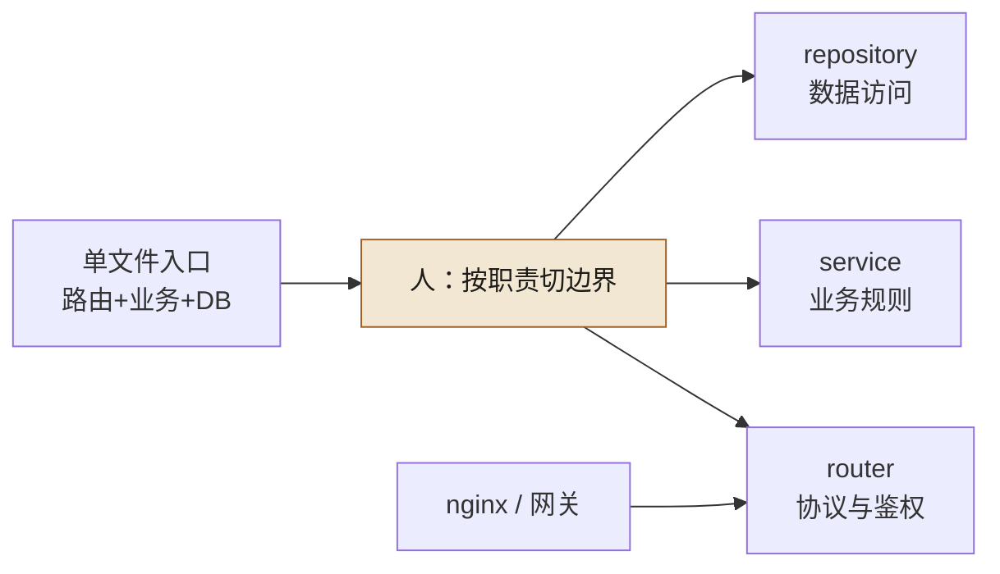
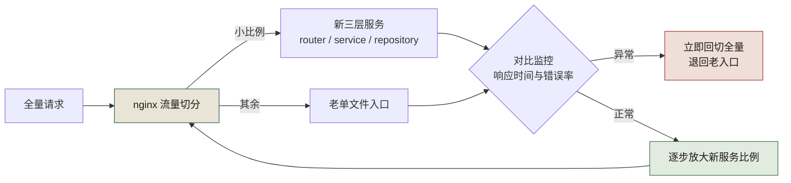

# 第 13 章 从单文件 API 到 router + nginx

> **本章定位**：重构进入接口层。把一个臃肿的单文件入口拆成 router/service/repository 三层并前置 nginx，是经典的"解耦"动作。本章讲为什么 AI 擅长拆函数却不擅长拆边界，以及"拆分"如何牵动跨团队的协调成本。
> **核心命题**：大文件问题的本质从来不是"行数太多"，而是"不该混在一起的东西混在了一起"。AI 看得见代码的结构，看不见职责的边界——拆分那一刀切在哪里，永远是人来定。



**图 13-1｜拆分一刀切在职责** — AI 按函数相似度拆会更纠缠；边界由人定。

---

## 13.1 问题：上千行的单文件入口，最后一次 git blame 是几年前的事

业务域有一个 API 入口文件，数千行规模，最后一次有意义的修改是多年前。该域所有的 HTTP 路由、业务逻辑、数据库读写，全在这一个文件里。

域负责人试图让 AI 重构它。给 AI 的指令是"把这个文件拆成更好的结构"。AI 用了半分钟，给出了一个方案——它把全部代码拆成了若干个函数文件，每个文件里放着一组函数。

**但这个拆法是错的。** AI 按函数的"大小"和"相似度"拆，不是按"职责"拆。它把"处理优惠券的函数"和"记录优惠券操作日志的函数"放在同一个文件里——因为它们都包含"优惠券"这个词。结果业务逻辑和日志逻辑纠缠得更紧了。

这件事揭示了一个界限：**AI 擅长拆函数，但不擅长拆边界。** 函数是代码层面的概念，AI 看得清；边界是职责层面的概念，涉及"什么是业务逻辑、什么是数据访问、什么是路由"——这些区分需要架构意图，不在代码的字面里。

图 13-1 里 `CUT` 那个节点只有三条出边，落点分别叫 router、service、repository——**没有一个边叫「优惠券」**。这张图要读者带走的就是这一点：切完之后每一片仍然叫得出**职责**，才叫边界；只叫得出业务名词的，那是模块，拆它不会让任何人少改一个文件。

---

## 13.2 根因：单文件不是懒，是当年没有边界意识

**① 单文件是"快速验证"的遗产。** 业务刚起步时，一个文件搞定所有事是最快的。验证成功后没人回头重构——因为"它能跑"。**「能跑」是技术债最好的保护伞。**

**② AI 重构按代码结构，不按职责结构。** AI 的目标函数是"让代码更短更整洁"，不是"让职责更清晰"。两者经常矛盾——把相关职责分开，代码反而会更"散"，但架构会更清晰。AI 选择了前者。

**③ 没有 nginx 前置，限流/超时/灰度全写在业务代码里。** 单文件里有几百行是在做"请求频率限制""超时处理""灰度判断"——这些本应是基础设施层（nginx/网关）的事，混进了业务代码。AI 重构时把它们当成业务逻辑一起搬，越搬越乱。

---

## 13.3 AI 用法：人定边界，AI 拆函数

正确的拆法是**先由人定义三层边界，再让 AI 在边界内拆函数**：

```
人定义：
  router 层 —— 只做 HTTP 解析、参数校验、响应组装
  service 层 —— 业务逻辑（核心）
  repository 层 —— 数据访问

AI 执行：
  在这三层边界内，把全部函数分配到对应的层
```

这个分工的关键是：**人画三层，AI 填函数。** 人不关心每个函数具体怎么拆（AI 比人快），但人必须先定义"哪一层放什么"（AI 判断不了职责）。

实际执行中，AI 在分配函数到层时，会有一定比例的函数分错层——比如把一段业务逻辑分到了 repository 层（因为它有 SQL），或者把一段路由组装分到了 service 层（因为它调了业务函数）。**这些错误需要人逐个纠正。** 但大部分分配是正确的，AI 节省了大量机械性的搬运工作。

### 操作步骤：一次单文件拆分的完整走法

可照抄的顺序（前两步是人的，中间是 AI 的，最后两步回到人）：

1. **盘家底**：让 AI 列出该文件的全部函数与调用关系，输出一份函数清单——先有地图，再谈切分。
2. **定边界**：人写下三层的判定规则（见下方模板），规则要能判伪——"service 层不出现 SQL"比"service 层放业务逻辑"可执行。
3. **分函数**：AI 按判定规则把函数分配到三层，输出分配表，不确定的单独标注。
4. **纠错**：人逐个复核含 SQL、HTTP 关键词的可疑分配——错分基本集中在这两类特征上。
5. **防回流**：拆分结果接 import-linter（第 10 章），router 不 import repository、service 不发 HTTP——防止边界再次糊掉。
6. **灰度切换**：双入口并行，nginx 按比例切流量（见图 13-2），对比监控正常后逐步放大。

### 模板：给 AI 的三层判定规则

把每层的"判定规则"写进约束后，分配错误有所下降。可照抄的版本：

```text
按以下规则把函数分配到三层，不确定的标「待定」：
- router 层：出现 HTTP 状态码、请求解析、参数校验、响应组装。
- service 层：出现业务规则、金额计算、状态流转；不出现 SQL、不发 HTTP。
- repository 层：出现 SQL、ORM 调用、缓存读写；不出现业务术语判断。
- 同时命中两层特征的，标「待定」，不要自行二选一。
```

「待定」这一条是模板的灵魂：**宁可让人多判几个，也不要 AI 硬猜**——错分一个函数的返工，比标十个待定贵。

---

## 13.4 角色博弈：nginx 前置要改运维，运维说"没排期"

拆分的一部分是把限流/超时/灰度从业务代码挪到 nginx。这件事技术上没问题，但需要运维团队配合改 nginx 配置。

运维的回应："nginx 配置变更要走变更流程，排期到下月。"

这是大组织里最常见的摩擦——**一个域的重构，牵动了另一个团队的排期。** 最后治理组出面协调，把 nginx 配置变更纳入了该域重构的联合项目，运维出一人配合。**代价是这个联合项目又多了一段协调时间。**

域负责人的抱怨是："我就想拆个文件，结果要拉三个团队开会。"

> **代价声明**：单文件入口的拆分，从代码层面花的人工不算多（含 AI 辅助 + 人工纠错），但因为牵动 nginx 配置和运维排期，整个项目耗时数周。**真正贵的是协调，不是编码。** 这也是为什么 AI 能加速编码却不能加速重构——重构的瓶颈从来不是写代码，是让多个团队达成一致。

---

## 13.5 产出物：拆分标准 + 灰度方案

1. **拆分标准**：三层划分（router/service/repository）的定义和判定规则，每层只做什么、不做什么。
2. **灰度方案**：拆分后的新服务通过 nginx 做流量切分，从小比例灰度起步，逐步切到全量（复用后续章节的灰度框架）。

灰度方案画成图，就是一条"切得出去、也切得回来"的流量回路：



**图 13-2｜nginx 灰度切流回路** — 小比例起步、对比监控、异常回切；切得回来，才敢切出去。

### 配置示例：灰度与限流前置到 nginx

拆分要兑现"限流/超时/灰度挪出业务代码"，落点是 nginx 配置。可照抄的骨架（域名、上游主机均为占位符，比例与数值为示意值，按实际环境与灰度计划替换）：

```nginx
upstream old_entry {
    server old-entry.internal:8080;   # 占位主机：老单文件入口，回滚靠它
}

upstream new_router {
    server new-router.internal:8080;  # 占位主机：拆分后的 router 层
}

# 为什么用 split_clients 而不是随机分流：同一用户固定进同一入口，对比监控才可比
split_clients "${remote_addr}${http_user_agent}" $entry {
    10%    new_router;                # 示意值：灰度起步比例，逐档放大
    *      old_entry;
}

# 为什么放 http 块：zone 共享内存对所有 server 生效，避免每个站点各配一套
limit_req_zone $binary_remote_addr zone=api_per_ip:10m rate=10r/s;  # 示意值

server {
    listen 80;
    server_name api.example.com;      # 占位域名

    # 限流前置：不占应用线程，业务变更也不会误伤限流规则
    limit_req zone=api_per_ip burst=20 nodelay;  # 示意值

    location / {
        # 超时前置：取代老入口里那段手写的超时逻辑
        proxy_connect_timeout 2s;     # 示意值
        proxy_read_timeout    5s;     # 示意值
        proxy_pass http://$entry;
    }
}
```

这份配置里最容易被删掉的是 upstream `old_entry`——**灰度未到全量之前，老入口不许下线**；它在 nginx 里留着，回切才是一行配置的事。

> **代价声明**：拆分后该域的单接口平均响应时间显著下降（因为限流/超时挪到了 nginx，不再占用应用线程）。**但拆分过程的协调成本和运维配合成本，是这个性能提升背后的隐性投入。**

### 工具落地卡：nginx —— 上面那段骨架，`-t` 现在就会拦你

**版本口径**：nginx 1.30.x（stable，官网 download 页 2026-09-24 列 1.30.5）/ 1.31.x（mainline，列 1.31.6），开源版而非 NGINX Plus。**本卡的每条报错原文来自源码编译的 1.30.5**，输出字符串跟版本绑定，别跨版本照抄结论。

**配置落点**：一个文件 `nginx.conf`，位置由编译期 `--conf-path` 决定（官方口径：源码编译默认 `prefix/conf/nginx.conf`；**发行版包与官方镜像的路径本次未核实**，别照抄 `/etc/nginx/…`）。本书要落的那一条是：**这份 conf 进版本库**（`deploy/nginx/{domain}.conf`），CI 用 `-t -c <仓库里那份> -p <prefix>` 校验——不去摸线上机器上那份，才谈得上"配置可追溯"。命令行工件没有版本锁文件，靠 `nginx -v` 与部署基线对齐。

**最小可抄配置**（骨架，实测 `nginx -t` 一次通过；缺 `events` 块 nginx 直接报错）：

```nginx
worker_processes  auto;
events { worker_connections 1024; }    # 这两行是能被 -t 接受的最小骨架

http {
    upstream book_backend {
        server 127.0.0.1:8000;         # ★ 必须解析得到：写占位主机名，-t 阶段就挂（见下）
        keepalive 32;                  # 必须配 proxy_http_version 1.1 才生效，否则每次新建连接
    }
    server {
        listen 8080;
        server_name book.example.com;
        location /api/ {
            proxy_pass         http://book_backend;   # 用 upstream 名走静态解析；带变量则必须另配 resolver
            proxy_http_version 1.1;                   # 不写 = HTTP/1.0 + Connection: close，keepalive 全废
            proxy_set_header   Host              $host;
            proxy_set_header   X-Real-IP         $remote_addr;        # 不传则后端看到的 IP 全是 nginx 的
            proxy_set_header   X-Forwarded-For   $proxy_add_x_forwarded_for;
            proxy_set_header   X-Forwarded-Proto $scheme;             # 后端判 https / 拼回调地址要用
        }
    }
}
```

**跑完看哪条输出**：

```text
$ nginx -t -c /srv/ngx/conf/nginx.conf -p /srv/ngx
nginx: the configuration file /srv/ngx/conf/nginx.conf syntax is ok
nginx: configuration file /srv/ngx/conf/nginx.conf test is successful   ← 两行齐 + 退出码 0 才算过
```

- CI 想安静就 `nginx -t -q`：**两行都不打印，只留退出码**（实测 `-q` 下 `exit=0`）。
- 指令名打错：`nginx: [emerg] unknown directive "worker_process" in /tmp/ngxtest/conf/bad.conf:1`，文件与行号自带。
- 括号/分号错位：`nginx: [emerg] unexpected "}" in /tmp/ngxtest/conf/bad2.conf:2`。
- **占位主机没替换——本节上面那段灰度骨架正好踩这条**：`nginx: [emerg] host not found in upstream "old-entry.internal:8080" in /tmp/ngxbook/conf/nginx.conf:5`。`upstream { server <不可解析主机>; }` 在 `-t` 阶段就要解析，**所以照抄灰度片段时，先把两个上游换成 IP 跑一次 `-t`，再换成真名**（实测同一骨架换成 `127.0.0.1:8081/8082` 后一次通过）。
- `proxy_pass http://$entry;` 里的 `$entry` 没被 `split_clients` 定义时：`nginx: [emerg] unknown "entry" variable`——变量分流这条链，两个节点都得对上才亮。
- 想看"最终生效的全量配置"（include 全算进去）：`nginx -T -c <conf> -p <prefix>`，stdout 首行就是 `# configuration file <路径>:`，这比 `cat` 单个文件可靠。
- 改完配置 `nginx -s reload`。**reload 成功时终端打印什么：未核实**——官方 control 文档只描述信号语义（HUP = 换配置 + 老 worker 优雅退出），不承诺 stdout。要判成败就 `nginx -t` 前置 + `ps` 看 `nginx: master process` / `nginx: worker process is shutting down` 两行。
- 容器里常见的前置告警：`nginx: [alert] could not open error log file: open() ".../logs/error.log" failed (2: No such file or directory)`——日志目录不存在会让后面所有判断都失真，先修环境再判断配置。

**替代不了什么**：`nginx -t` 只做**语法与加载期检查**（指令是否存在、参数个数、上游主机能否解析、`listen` 是否重复）。它拦不住语义与容量：`rate=10r/s` 写小了、`proxy_read_timeout 5s` 掐死慢接口、灰度比例算错——**配置全绿，事故照出**（图 13-2 那条回路里"对比监控"和"异常回切"两格存在的理由就是这个）。它更不校验业务契约，接口结构变更的拦截仍在第 9 章的契约仓。

### 度量指标：拆分效果看哪几个数

| 指标 | 怎么测 | 阈值 | 谁看 | 多久看一次 |
|------|--------|------|------|-----------|
| 单接口平均响应时间 | 网关侧按接口维度的监控 | 拆分后不劣于拆分前 | 域 TL | 每日 |
| 灰度期新老入口错误率差 | 同一窗口内两个 upstream 的错误日志对比 | 新入口不高于老入口，才允许放大比例 | 域 TL + 运维 | 灰度全程 |
| AI 分层分配纠错次数 | 分配表中被人工改判的函数数 | 逐次拆分持续下降 | 架构组 | 每次拆分 |
| 协调耗时占比 | 项目总耗时中跨团队会议与排期等待的占比 | 登记进复盘，不设硬阈值 | 治理组 | 每个项目 |

第三个指标是给「判定规则模板」回血的：纠错次数在降，说明模板在变准。

### 检查清单：nginx 前置迁移

- [ ] 限流、超时、灰度，是不是都从业务代码挪进了 nginx/网关？
- [ ] 灰度分流是不是同一用户固定进同一入口？随机分流会让对比监控失真。
- [ ] 老入口在灰度到全量之前，是不是还留着、随时可回切？
- [ ] nginx 配置有没有进版本库？只存在运维手里，出了事故无从追溯。
- [ ] 配置里的域名、主机、比例，是不是都是显式占位符或经过评审的值？

---

## 13.6 四案例映射

| 案例 | 单文件症状 | 拆分边界难点 | 协调成本 |
|------|-----------|--------------|----------|
| 案例一·电商平台 | 营销域 `app.py` 8237 行，路由/业务/SQL 混在一起，限流灰度也写在业务代码里 | AI 按关键词聚类，把优惠券逻辑和优惠券日志塞进同一文件 | 拉运维改 nginx 配置，联合项目耗时 3 周 |
| 案例二·加密交易所 | 撮合引擎入口文件把撮合、风控、撮合日志混在一起，最后修改在多年前 | 撮合逻辑与风控逻辑高度耦合，AI 拆分时把风控判定并入撮合层 | 风控团队和撮合团队需要联合排期 |
| 案例三·Web3 量化 | 策略调度入口同时承担行情订阅、策略执行、持仓上报 | 行情订阅和策略执行的时间耦合，AI 按函数大小拆忽略了事件驱动边界 | 行情接入和策略执行分别由不同子团队维护 |
| 案例四·安全初创 | 单体后端把审计、扫描任务调度、报告生成都堆在一个入口文件里 | 审计任务与扫描任务的资源需求差异大，AI 按业务名词聚类 | 初创团队人少，但多端 SDK 维护分散精力 |

---

## 13.7 检查清单

- [ ] 你有没有超过 1000 行的单文件入口？有 = 技术债在利息滚利。
- [ ] 你让 AI 重构时，是让它"拆得更好"还是"按职责拆到指定层"？前者 = 它会按代码结构拆乱你。
- [ ] 你的限流/超时/灰度是在业务代码里还是在 nginx/网关层？在业务代码里 = 每次 API 变更都可能动到它们。
- [ ] 你拆分时有没有牵动其他团队？有 = 你的项目实际耗时不止编码时间。
- [ ] 拆分后有没有灰度切换方案？没有 = 一刀切 = 撞大运。

---

## 13.8 反模式

| # | 反模式 | 后果 |
|---|--------|------|
| 1 | 让 AI "拆得更好"不给边界 | 按代码结构拆，职责更乱 |
| 2 | 限流/超时写在业务代码里 | 业务变更影响基础设施逻辑 |
| 3 | 拆分不考虑运维排期 | 项目卡在跨团队协调 |
| 4 | 拆完一刀切上线 | 出了问题无法定位是哪层的 |
| 5 | 能跑就不拆 | 技术债利滚利，最终不可维护 |

---

## 13.9 遗留问题

- **拆出来的服务怎么管？** 拆完不是一个文件了，是多个服务——微服务的治理（注册、发现、网关）是新问题。这一层在后续立包和亿级流量章节继续。
- **AI 分层分配的错误率能不能降低？** 部分分配错误需要人工纠正。能不能通过更好的提示词降低？尝试过给 AI 每层的"判定规则"作为约束，错误率有所下降。留作实践经验。
- **nginx 配置本身怎么版本化？** 配置散在运维手里，出了事故无从追溯。留给后续安全合规与文档治理章节。

---

> **本章的一句话**：AI 能在半分钟内把上千行拆成十几个文件，但"怎么拆"这个决定它做不对——**因为它看得见代码的结构，看不见职责的边界。** 大文件问题的本质从来不是"行数太多"，而是"不该混在一起的东西混在了一起"。拆分的功夫，在人怎么定义那一刀切在哪里。
