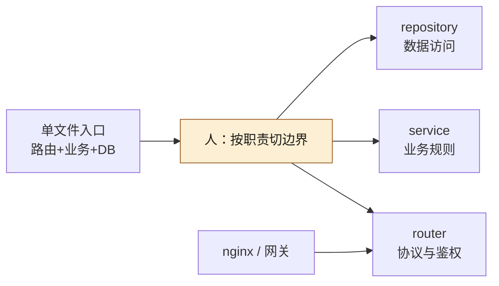
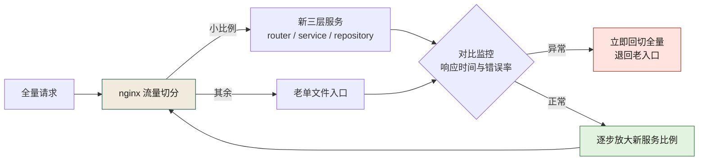
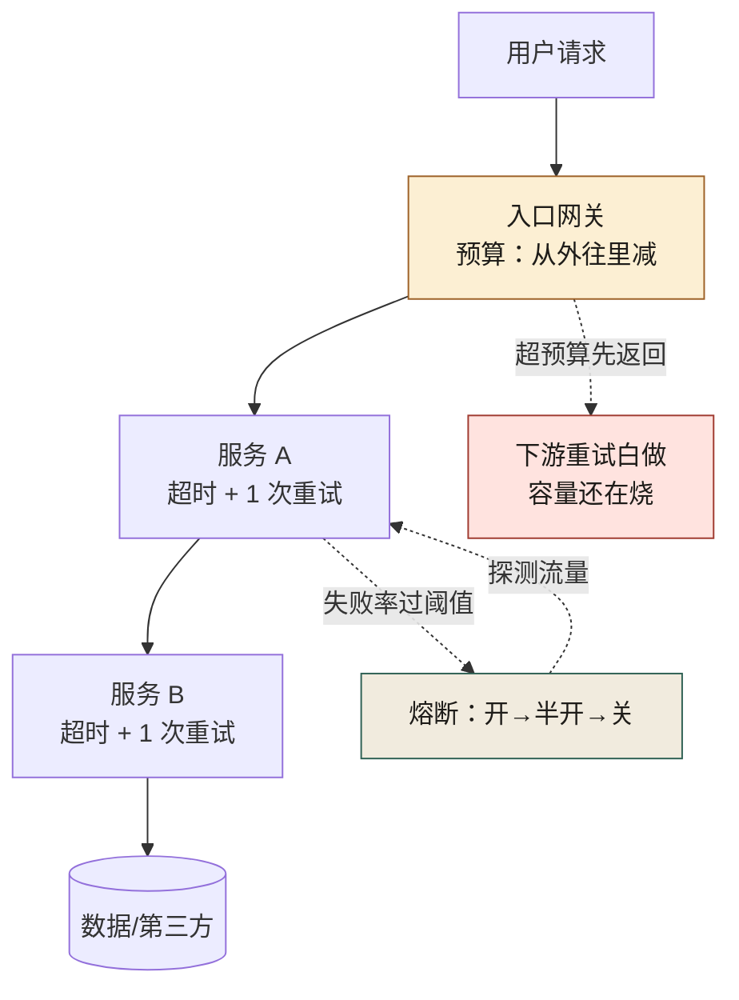

# 第 13 章 从单文件 API 到 router + nginx

> **本章定位**：重构进入接口层。把一个臃肿的单文件入口拆成 router/service/repository 三层并前置 nginx，是经典的"解耦"动作。本章讲为什么 AI 擅长拆函数却不擅长拆边界，以及"拆分"如何牵动跨团队的协调成本。
> **核心命题**：大文件问题的本质从来不是"行数太多"，而是"不该混在一起的东西混在了一起"。AI 看得见代码的结构，看不见职责的边界——拆分那一刀切在哪里，永远是人来定。



**图 13-1｜拆分一刀切在职责** — AI 按函数相似度拆会更纠缠；边界由人定。

---

## 13.1 问题：上千行的单文件入口，最后一次 git blame 是几年前的事

业务域有一个 API 入口文件，数千行规模，最后一次有意义的修改是多年前。该域所有的 HTTP 路由、业务逻辑、数据库读写，全在这一个文件里。

域负责人试图让 AI 重构它。给 AI 的指令是"把这个文件拆成更好的结构"。AI 用了半分钟，给出了一个方案——它把全部代码拆成了若干个函数文件，每个文件里放着一组函数。

**但这个拆法是错的。** AI 按函数的"大小"和"相似度"拆，不是按"职责"拆。它把"处理优惠券的函数"和"记录优惠券操作日志的函数"放在同一个文件里——因为它们都包含"优惠券"这个词。结果业务逻辑和日志逻辑纠缠得更紧了。

这件事揭示了一个界限：**AI 擅长拆函数，但不擅长拆边界。** 函数是代码层面的概念，AI 看得清；边界是职责层面的概念，涉及"什么是业务逻辑、什么是数据访问、什么是路由"——这些区分需要架构意图，不在代码的字面里。

图 13-1 里 `CUT` 那个节点只有三条出边，落点分别叫 router、service、repository——**没有一个边叫「优惠券」**。这张图要读者带走的就是这一点：切完之后每一片仍然叫得出**职责**，才叫边界；只叫得出业务名词的，那是模块，拆它不会让任何人少改一个文件。

---

## 13.2 根因：单文件不是懒，是当年没有边界意识

**① 单文件是"快速验证"的遗产。** 业务刚起步时，一个文件搞定所有事是最快的。验证成功后没人回头重构——因为"它能跑"。**「能跑」是技术债最好的保护伞。**

**② AI 重构按代码结构，不按职责结构。** AI 的目标函数是"让代码更短更整洁"，不是"让职责更清晰"。两者经常矛盾——把相关职责分开，代码反而会更"散"，但架构会更清晰。AI 选择了前者。

**③ 没有 nginx 前置，限流/超时/灰度全写在业务代码里。** 单文件里有几百行是在做"请求频率限制""超时处理""灰度判断"——这些本应是基础设施层（nginx/网关）的事，混进了业务代码。AI 重构时把它们当成业务逻辑一起搬，越搬越乱。

---

## 13.3 AI 用法：人定边界，AI 拆函数

正确的拆法是**先由人定义三层边界，再让 AI 在边界内拆函数**：

```
人定义：
  router 层 —— 只做 HTTP 解析、参数校验、响应组装
  service 层 —— 业务逻辑（核心）
  repository 层 —— 数据访问

AI 执行：
  在这三层边界内，把全部函数分配到对应的层
```

这个分工的关键是：**人画三层，AI 填函数。** 人不关心每个函数具体怎么拆（AI 比人快），但人必须先定义"哪一层放什么"（AI 判断不了职责）。

实际执行中，AI 在分配函数到层时，会有一定比例的函数分错层——比如把一段业务逻辑分到了 repository 层（因为它有 SQL），或者把一段路由组装分到了 service 层（因为它调了业务函数）。**这些错误需要人逐个纠正。** 但大部分分配是正确的，AI 节省了大量机械性的搬运工作。

### 操作步骤：一次单文件拆分的完整走法

可照抄的顺序（前两步是人的，中间是 AI 的，最后两步回到人）：

1. **盘家底**：让 AI 列出该文件的全部函数与调用关系，输出一份函数清单——先有地图，再谈切分。
2. **定边界**：人写下三层的判定规则（见下方模板），规则要能判伪——"service 层不出现 SQL"比"service 层放业务逻辑"可执行。
3. **分函数**：AI 按判定规则把函数分配到三层，输出分配表，不确定的单独标注。
4. **纠错**：人逐个复核含 SQL、HTTP 关键词的可疑分配——错分基本集中在这两类特征上。
5. **防回流**：拆分结果接 import-linter（第 10 章），router 不 import repository、service 不发 HTTP——防止边界再次糊掉。
6. **灰度切换**：双入口并行，nginx 按比例切流量（见图 13-2），对比监控正常后逐步放大。

### 模板：给 AI 的三层判定规则

把每层的"判定规则"写进约束后，分配错误有所下降。可照抄的版本：

```text
按以下规则把函数分配到三层，不确定的标「待定」：
- router 层：出现 HTTP 状态码、请求解析、参数校验、响应组装。
- service 层：出现业务规则、金额计算、状态流转；不出现 SQL、不发 HTTP。
- repository 层：出现 SQL、ORM 调用、缓存读写；不出现业务术语判断。
- 同时命中两层特征的，标「待定」，不要自行二选一。
```

「待定」这一条是模板的灵魂：**宁可让人多判几个，也不要 AI 硬猜**——错分一个函数的返工，比标十个待定贵。

---

## 13.4 角色博弈：nginx 前置要改运维，运维说"没排期"

拆分的一部分是把限流/超时/灰度从业务代码挪到 nginx。这件事技术上没问题，但需要运维团队配合改 nginx 配置。

运维的回应："nginx 配置变更要走变更流程，排期到下月。"

这是大组织里最常见的摩擦——**一个域的重构，牵动了另一个团队的排期。** 最后治理组出面协调，把 nginx 配置变更纳入了该域重构的联合项目，运维出一人配合。**代价是这个联合项目又多了一段协调时间。**

域负责人的抱怨是："我就想拆个文件，结果要拉三个团队开会。"

> **代价声明**：单文件入口的拆分，从代码层面花的人工不算多（含 AI 辅助 + 人工纠错），但因为牵动 nginx 配置和运维排期，整个项目耗时数周。**真正贵的是协调，不是编码。** 这也是为什么 AI 能加速编码却不能加速重构——重构的瓶颈从来不是写代码，是让多个团队达成一致。

---

## 13.5 产出物：拆分标准 + 灰度方案

1. **拆分标准**：三层划分（router/service/repository）的定义和判定规则，每层只做什么、不做什么。
2. **灰度方案**：拆分后的新服务通过 nginx 做流量切分，从小比例灰度起步，逐步切到全量（复用后续章节的灰度框架）。

灰度方案画成图，就是一条"切得出去、也切得回来"的流量回路：



**图 13-2｜nginx 灰度切流回路** — 小比例起步、对比监控、异常回切；切得回来，才敢切出去。

### 配置示例：灰度与限流前置到 nginx

拆分要兑现"限流/超时/灰度挪出业务代码"，落点是 nginx 配置。可照抄的骨架（域名、上游主机均为占位符，比例与数值为示意值，按实际环境与灰度计划替换）：

```nginx
upstream old_entry {
    server old-entry.internal:8080;   # 占位主机：老单文件入口，回滚靠它
}

upstream new_router {
    server new-router.internal:8080;  # 占位主机：拆分后的 router 层
}

# 为什么用 split_clients 而不是随机分流：同一用户固定进同一入口，对比监控才可比
split_clients "${remote_addr}${http_user_agent}" $entry {
    10%    new_router;                # 示意值：灰度起步比例，逐档放大
    *      old_entry;
}

# 为什么放 http 块：zone 共享内存对所有 server 生效，避免每个站点各配一套
limit_req_zone $binary_remote_addr zone=api_per_ip:10m rate=10r/s;  # 示意值

server {
    listen 80;
    server_name api.example.com;      # 占位域名

    # 限流前置：不占应用线程，业务变更也不会误伤限流规则
    limit_req zone=api_per_ip burst=20 nodelay;  # 示意值

    location / {
        # 超时前置：取代老入口里那段手写的超时逻辑
        proxy_connect_timeout 2s;     # 示意值
        proxy_read_timeout    5s;     # 示意值
        proxy_pass http://$entry;
    }
}
```

这份配置里最容易被删掉的是 upstream `old_entry`——**灰度未到全量之前，老入口不许下线**；它在 nginx 里留着，回切才是一行配置的事。

> **代价声明**：拆分后该域的单接口平均响应时间显著下降（因为限流/超时挪到了 nginx，不再占用应用线程）。**但拆分过程的协调成本和运维配合成本，是这个性能提升背后的隐性投入。**

### 工具落地卡：nginx —— 上面那段骨架，`-t` 现在就会拦你

**版本口径**：nginx 1.30.x（stable，官网 download 页 2026-09-24 列 1.30.5）/ 1.31.x（mainline，列 1.31.6），开源版而非 NGINX Plus。**本卡的每条报错原文来自源码编译的 1.30.5**，输出字符串跟版本绑定，别跨版本照抄结论。

**配置落点**：一个文件 `nginx.conf`，位置由编译期 `--conf-path` 决定（官方口径：源码编译默认 `prefix/conf/nginx.conf`；**发行版包与官方镜像的路径本次未核实**，别照抄 `/etc/nginx/…`）。本书要落的那一条是：**这份 conf 进版本库**（`deploy/nginx/{domain}.conf`），CI 用 `-t -c <仓库里那份> -p <prefix>` 校验——不去摸线上机器上那份，才谈得上"配置可追溯"。命令行工件没有版本锁文件，靠 `nginx -v` 与部署基线对齐。

**最小可抄配置**（骨架，实测 `nginx -t` 一次通过；缺 `events` 块 nginx 直接报错）：

```nginx
worker_processes  auto;
events { worker_connections 1024; }    # 这两行是能被 -t 接受的最小骨架

http {
    upstream book_backend {
        server 127.0.0.1:8000;         # ★ 必须解析得到：写占位主机名，-t 阶段就挂（见下）
        keepalive 32;                  # 必须配 proxy_http_version 1.1 才生效，否则每次新建连接
    }
    server {
        listen 8080;
        server_name book.example.com;
        location /api/ {
            proxy_pass         http://book_backend;   # 用 upstream 名走静态解析；带变量则必须另配 resolver
            proxy_http_version 1.1;                   # 不写 = HTTP/1.0 + Connection: close，keepalive 全废
            proxy_set_header   Host              $host;
            proxy_set_header   X-Real-IP         $remote_addr;        # 不传则后端看到的 IP 全是 nginx 的
            proxy_set_header   X-Forwarded-For   $proxy_add_x_forwarded_for;
            proxy_set_header   X-Forwarded-Proto $scheme;             # 后端判 https / 拼回调地址要用
        }
    }
}
```

**跑完看哪条输出**：

```text
$ nginx -t -c /srv/ngx/conf/nginx.conf -p /srv/ngx
nginx: the configuration file /srv/ngx/conf/nginx.conf syntax is ok
nginx: configuration file /srv/ngx/conf/nginx.conf test is successful   ← 两行齐 + 退出码 0 才算过
```

- CI 想安静就 `nginx -t -q`：**两行都不打印，只留退出码**（实测 `-q` 下 `exit=0`）。
- 指令名打错：`nginx: [emerg] unknown directive "worker_process" in /tmp/ngxtest/conf/bad.conf:1`，文件与行号自带。
- 括号/分号错位：`nginx: [emerg] unexpected "}" in /tmp/ngxtest/conf/bad2.conf:2`。
- **占位主机没替换——本节上面那段灰度骨架正好踩这条**：`nginx: [emerg] host not found in upstream "old-entry.internal:8080" in /tmp/ngxbook/conf/nginx.conf:5`。`upstream { server <不可解析主机>; }` 在 `-t` 阶段就要解析，**所以照抄灰度片段时，先把两个上游换成 IP 跑一次 `-t`，再换成真名**（实测同一骨架换成 `127.0.0.1:8081/8082` 后一次通过）。
- `proxy_pass http://$entry;` 里的 `$entry` 没被 `split_clients` 定义时：`nginx: [emerg] unknown "entry" variable`——变量分流这条链，两个节点都得对上才亮。
- 想看"最终生效的全量配置"（include 全算进去）：`nginx -T -c <conf> -p <prefix>`，stdout 首行就是 `# configuration file <路径>:`，这比 `cat` 单个文件可靠。
- 改完配置 `nginx -s reload`。**reload 成功时终端打印什么：未核实**——官方 control 文档只描述信号语义（HUP = 换配置 + 老 worker 优雅退出），不承诺 stdout。要判成败就 `nginx -t` 前置 + `ps` 看 `nginx: master process` / `nginx: worker process is shutting down` 两行。
- 容器里常见的前置告警：`nginx: [alert] could not open error log file: open() ".../logs/error.log" failed (2: No such file or directory)`——日志目录不存在会让后面所有判断都失真，先修环境再判断配置。

**替代不了什么**：`nginx -t` 只做**语法与加载期检查**（指令是否存在、参数个数、上游主机能否解析、`listen` 是否重复）。它拦不住语义与容量：`rate=10r/s` 写小了、`proxy_read_timeout 5s` 掐死慢接口、灰度比例算错——**配置全绿，事故照出**（图 13-2 那条回路里"对比监控"和"异常回切"两格存在的理由就是这个）。它更不校验业务契约，接口结构变更的拦截仍在第 9 章的契约仓。

### 度量指标：拆分效果看哪几个数

| 指标 | 怎么测 | 阈值 | 谁看 | 多久看一次 |
|------|--------|------|------|-----------|
| 单接口平均响应时间 | 网关侧按接口维度的监控 | 拆分后不劣于拆分前 | 域 TL | 每日 |
| 灰度期新老入口错误率差 | 同一窗口内两个 upstream 的错误日志对比 | 新入口不高于老入口，才允许放大比例 | 域 TL + 运维 | 灰度全程 |
| AI 分层分配纠错次数 | 分配表中被人工改判的函数数 | 逐次拆分持续下降 | 架构组 | 每次拆分 |
| 协调耗时占比 | 项目总耗时中跨团队会议与排期等待的占比 | 登记进复盘，不设硬阈值 | 治理组 | 每个项目 |

第三个指标是给「判定规则模板」回血的：纠错次数在降，说明模板在变准。

### 检查清单：nginx 前置迁移

- [ ] 限流、超时、灰度，是不是都从业务代码挪进了 nginx/网关？
- [ ] 灰度分流是不是同一用户固定进同一入口？随机分流会让对比监控失真。
- [ ] 老入口在灰度到全量之前，是不是还留着、随时可回切？
- [ ] nginx 配置有没有进版本库？只存在运维手里，出了事故无从追溯。
- [ ] 配置里的域名、主机、比例，是不是都是显式占位符或经过评审的值？

---

## 13.5b 可抄骨架：三层的最小可跑形状（本机实跑）

> **档位声明（FastAPI APIRouter + pydantic + httpx）**：**A 档 · 本机实跑 · 本卡代码与全部输出都在本机跑过，依赖为 FastAPI 0.141.1 / pydantic 2.13.5 / httpx 0.28.1，版本与本机 `python3 -c "import fastapi, pydantic, httpx"` 的可导入读数一致。**

13.3 那份判定规则写得再准，也还是会遇到同一句反问：分对层这件事，除了人评审，**还有没有别的证据可以拿**？ 有——把三层跑起来，让同一批请求去撞它。一份能抄的形状比一段描述更有用，因为读者可以照着改，改错了状态码会告诉他。

> **档位声明**：本节代码与全部输出都在本机跑过（Python 3.14.4 / FastAPI 0.141.1 / pydantic 2.13.5 / httpx 0.28.1，请求走 `httpx.ASGITransport`，不起端口、不依赖 uvicorn）。**本机没有 nginx，本节不涉及任何 nginx 行为**；nginx 的语义在下面的 13.5c，按规范写。

### 目录与依赖方向

```text
app/
  main.py                  # 组装 + 领域错误 → HTTP 状态码的唯一映射点
  api/
    deps.py                # 组合根：三层在这里接线
    routers/coupons.py     # router：HTTP 解析、参数校验、协议层拒绝（401/403）
  services/coupon.py       # service：业务规则与状态流转；不写 SQL、不发 HTTP
  repositories/coupon.py   # repository：只有 SQL 与行；不出现业务名词判断
  domain/errors.py         # 领域错误：被上两层共用，谁都不许 import 谁
```

依赖方向从上到下单向：`routers → services → repositories`，`domain` 谁都可以被引用、它不引用任何人。**这张目录树本身就是 13.1 那句"按职责切，不按业务名词切"的落地物**——切完之后每一片还叫得出职责，而不是"优惠券组"。

### 五份文件

```python
# app/domain/errors.py —— 错误是领域对象，不是 HTTP 异常
class DomainError(Exception):
    code = "domain_error"          # 机器可读的错误名，进契约的错误码表
class CouponNotFound(DomainError):  code = "coupon_not_found"
class AlreadyGranted(DomainError):  code = "coupon_already_granted"
class ThresholdNotMet(DomainError): code = "threshold_not_met"

# app/repositories/coupon.py —— 只说 SQL 与行，不出现业务名词判断
class CouponRepo:
    def __init__(self):
        self.conn = sqlite3.connect(DB, check_same_thread=False)   # 见下面的坑
    def get(self, coupon_id):        ...      # 返回 dict 或 None，不判"这张券还能不能用"
    def mark_used(self, coupon_id):  ...      # 只做一次 UPDATE

# app/services/coupon.py —— 业务规则；这里出现 HTTP 或 SQL 就是分错层
MIN_ORDER_CENTS = 20000                 # 示意常量：真实值进配置，不留代码里

class CouponService:
    def __init__(self, repo):
        self.repo = repo                # 注入的是抽象，测试里可以塞 fake repo
    def use(self, coupon_id, order_cents):
        row = self.repo.get(coupon_id)
        if row is None:
            raise CouponNotFound(coupon_id)
        if row["status"] != "granted":
            raise AlreadyGranted(coupon_id)          # 同一张券二次核销
        if order_cents < MIN_ORDER_CENTS:
            raise ThresholdNotMet("order below threshold")
        self.repo.mark_used(coupon_id)
        return {"coupon_id": coupon_id, "discount_cents": row["amount_cents"],
                "payable_cents": order_cents - row["amount_cents"]}
```

```python
# app/api/routers/coupons.py —— 协议层：URL、鉴权头、请求模型
router = APIRouter(prefix="/coupons", tags=["coupons"])   # prefix 只管 URL，不管进程边界

class UseIn(BaseModel):                # 参数校验是 router 的活，不交给 service
    order_cents: int = Field(ge=1)

@router.get("/{coupon_id}")
def read_coupon(x_tenant: str = Header(...), coupon_id: str = None,
                svc: CouponService = Depends(get_coupon_service)):
    if x_tenant != "tenant-a":
        raise HTTPException(403, detail="tenant_mismatch")   # 协议层拒绝：留在这里
    return svc.quote(coupon_id)                              # 语义结果：交给 service

@router.post("/{coupon_id}/use")
def use_coupon(body: UseIn, coupon_id: str = None,
               svc: CouponService = Depends(get_coupon_service)):
    return svc.use(coupon_id, body.order_cents)

# app/main.py —— 组装；状态码映射只在这一个地方
app = FastAPI(title="promo-coupon")
app.include_router(coupons.router)
STATUS = {CouponNotFound: 404, AlreadyGranted: 409, ThresholdNotMet: 422}

@app.exception_handler(DomainError)
async def domain_error_handler(request: Request, exc: DomainError):
    return JSONResponse(status_code=STATUS.get(type(exc), 500),
                        content={"error": exc.code})   # service 至今不知道 HTTP 是什么
```

`APIRouter` 这一段是本章标题里的那个词。它值得单说一句：`include_router` **这条挂载发生在编译期，不是运行时的路由表下发**。prefix、tags、dependencies 都在导入时定死；一个 router 想跨域复用，复用的是"URL 前缀 + 依赖声明"这套形状，不是那段业务代码。所以"每个域一个 router 文件"这件事，治理含义是**接口面的分账单位**——契约变更影响哪个 router，PR 就落在哪个 Owner 头上。

### 跑起来看什么

测试里不开端口：`httpx.AsyncClient(transport=httpx.ASGITransport(app=app))` 直接把 ASGI 应用接进客户端，请求照常走完 router → service → repository 的整条链。九条真实请求与真实响应：

```text
$ python3 tests/test_coupons.py            # 本机实跑，九条请求
GET  /coupons/c-1        req={"x-tenant": "tenant-a"}  -> 200 {"id":"c-1","user_id":"u-1","amount_cents":3000,"status":"granted"}
GET  /coupons/c-1        req={"x-tenant": "tenant-b"}  -> 403 {"detail":"tenant_mismatch"}
GET  /coupons/nope       req={"x-tenant": "tenant-a"}  -> 404 {"error":"coupon_not_found"}
POST /coupons/c-1/use    req={"order_cents": 25000}    -> 200 {"coupon_id":"c-1","discount_cents":3000,"payable_cents":22000}
POST /coupons/c-1/use    req={"order_cents": 25000}    -> 409 {"error":"coupon_already_granted"}
POST /coupons/c-2/use    req={"order_cents": 100}      -> 422 {"error":"threshold_not_met"}
POST /coupons/c-2/use    req={"pay": "250元"}           -> 422 {"detail":[{"type":"missing","loc":["body","order_cents"],"msg":"Field required","input":{"pay":"250元"}}]}
GET  /coupons/c-2        req={}                        -> 422 {"detail":[{"type":"missing","loc":["header","x-tenant"],"msg":"Field required","input":null}]}
GET  /coupons/c-2/       req={"x-tenant": "tenant-a"}  -> 307
```

这九行就是"分对层"的证据形状：

- **同一个业务规则（能不能核销），换了拒绝原因就该换状态码**：404 找不到、409 二次核销、422 门槛不足。三个码都来自 `main.py` 那一张映射表，Service 里一条 `if` 都没写 HTTP。**如果哪天状态码开始散在 service 的 return 里，说明这一层又糊了。**
- **`422` 有两种来源，别混**：`{"error":"threshold_not_met"}` 是业务规则（本服务定的），`{"detail":[{"type":"missing"...}]}` 是框架的校验器（请求形状不对）。**两种 422 的账落在不同地方**——前者进契约的错误码表，后者是 router 的守卫；混在一起看，错误率告警会指错方向。
- **尾斜杠差一个字符就不是同一条路由**（本机实跑：`GET /coupons/c-2/` 返回 `307`）。FastAPI/Starlette 对它的处理取决于版本与配置，**网关改写路径时最容易撞上的就是这一格**——13.5c 的 `proxy_pass` 尾斜杠语义讲的就是它。顺带一条同源读数：`{"order_cents": true}` 能通过 `int` 校验并被当成 `1`，于是拿到 `422 threshold_not_met` 而不是形状错误——**这不是框架的 bug，是"契约里写的类型"和"你真正允许的取值"之间的距离**（第 9 章 9.5f 同一条纪律）。

### 三个真跑出来的坑（比骨架本身有用）

1. **`body: dict` 不校验，router 就退化成转发器。** 把 `UseIn` 换成 `dict` 再发同一份错误请求，`$ python3 tests/test_500.py`（本机实跑）拿到的是 `未声明请求模型时: 500 Internal Server Error`，应用日志里是 `KeyError: 'order_cents'`。**一个字段名写错的用户请求，会伪装成一次服务端故障**：错误率告警响、契约测试全绿、排查方向整个反了。这就是 13.3 把"参数校验"划给 router 层的物理理由——不是洁癖，是**让客户端的错留在客户端的账上**（4xx），别污染服务的错误率。
2. **同步端点跑在线程池里，repository 单例的连接会被跨线程复用。** 第一版本机直接抛：

```text
sqlite3.ProgrammingError: SQLite objects created in a thread can only be used in that same thread. The object was created in thread id 125728413348352 and this is thread id 125728357512896.
```

   `def`（非 `async def`）端点会被丢进线程池，模块级连接的线程归属就漂了。`check_same_thread=False` 能让它跑，但**能不能并发复用一条连接，是另一个问题**——正解是每请求一条连接或走连接池。**这类坑的共同点：本地单线程测不出来，一次分层接线就炸。**
3. **测试客户端默认会把异常抛回测试，不给你状态码。** 上面那次 500 是要显式 `ASGITransport(app=app, raise_app_exceptions=False)` 才看到的。换句话说：**如果你的三层测试从来没见过 500，可能不是因为代码没崩，是因为崩在你看的窗口外面。**

## 13.5c nginx 的 location 匹配与 proxy_pass 尾斜杠（B 档）

> **档位声明（nginx location / proxy_pass 尾斜杠）**：**B 档 · 文档逐字 · 本机没有安装 nginx，出不了任何真实报错或 `nginx -T` 读数，匹配次序与替换语义全部按 nginx 文档口径书写。**

> **档位声明**：**本机没有安装 nginx，也没有它的任何报错可贴。** 下面只讲规范里写明的匹配次序与替换语义，全部以你自己的环境里 `nginx -T` 输出的最终生效配置为准（上一节那张卡给了 `nginx -T` 的用法）。任何"某版本默认值是 X"的说法这里一律不出现。

13.5 那份灰度骨架里，最危险的一行不是 `split_clients`，是 `proxy_pass`。**它决定了后端看到的路径长什么样**，而这一件事在配置里是隐式的：

- `location /api/ { proxy_pass http://backend; }`（不带 URI）→ 后端收到的是**原始请求路径**，`/api/coupons/c-1` 原样透传。
- `location /api/ { proxy_pass http://backend/; }`（带 URI，哪怕只是一个 `/`）→ nginx 把 location 前缀**替换**成 `proxy_pass` 的 URI 部分，后端看到的变成 `/coupons/c-1`。

这就是"改一行配置、路由静默换面"的形状：**两种写法都合法、都能启动、`-t` 都过**，区别只在后端收到什么路径。如果你的 FastAPI 挂了 `prefix="/api"`，第二种写法会把所有请求打成 404，而 nginx 的访问日志全是 200 之外的其他码——**看日志的人第一反应是"后端挂了"，不是"我改掉了前缀"。**

前缀匹配本身的次序值得记住（规范口径）：

1. `location = /path` 精确匹配，命中即停；
2. 否则取**最长前缀**匹配（不是"写在前面就赢"），前缀之间不比书写顺序；
3. 最长前缀若带 `^~`，直接用它；否则再按书写顺序试正则 `~` / `~*`，正则命中即赢；
4. `@name` 是内部跳转目标（`error_page`、`try_files` 的兜底），不参与上面的竞争。

> **它替代不了什么**：这些规则管的是"哪个 location 赢"，管不了"哪个服务该收这个请求"。**灰度期的正确性判据只有 13.5 那张灰度回路里的对比监控，不在 location 匹配里**——路径改写错了，nginx 会认为它工作得很好。

### 判据：把"尾斜杠决定"写成一条可 grep 的纪律

```bash
# 每个 location 都必须显式决定 proxy_pass 带不带 URI；下面把"不带 URI"的写法列出来复核
grep -nE 'location|proxy_pass' deploy/nginx/*.conf | awk -F: '{print $1, $2, $3}'   # 输出交给评审人看
# 只出报表不出红灯：静态 grep 认不出 include 与 if 里的跳转，语义要靠 nginx -T 的最终生效集判断
```

配套要求：`proxy_pass` 后面**不许带变量**（带变量就要显式 `resolver`，否则是运行期才炸的坑）；上游用 `upstream` 命名走静态解析；`X-Forwarded-*` 三条头按上一节那张卡的写法补齐——**后端拿不到真实客户端 IP 与协议，限流与灰度分流都会算错人**。

## 13.5d 超时、重试、熔断的预算算术（可抄）

前置 nginx 之后，"超时/重试/熔断"从业务代码搬到了配置里。搬过来只是换了地方写，**不等于算对了**——最贵的错误是"每一跳各写各的"：写的时候各自都合理，串起来就同时超预算又放大流量。下面这段算术可以照抄进评审会。图 13-3 是这条链的形状：**预算箭头从外往里变窄，放大箭头从里往外变宽**。

```python
def spend(t, r, base=0.1, ratio=2.0, cap=0.5):
    """一跳的最坏占用 = 首次超时 + 每次重试的超时 + 退避等待（指数递增，封顶 cap）"""
    waits = [min(cap, base * ratio ** k) for k in range(r)]
    return t * (1 + r) + sum(waits)          # 退避也要算进占用：漏掉它是最常见的算错方式

def check(name, t, r, budget):               # budget = 这一跳允许的父预算（秒）
    s = spend(t, r)
    print(("OK   " if s < budget else "红灯 "),
          f"{name}timeout={t:.2f}s 重试={r} 次 → 最坏占用 {s:.2f}s，父预算 {budget:.2f}s")
```

```text
$ python3 budget.py            # 本机实跑；秒数与重试次数全是示例值，用来演示算术本身
=== 违规版本：外层用户预算 1.2s，三跳各自写了更宽的超时
红灯  网关→A timeout=1.00s 重试=2 次 → 最坏占用 3.30s，父预算 1.20s
红灯  A→B    timeout=0.90s 重试=2 次 → 最坏占用 3.00s，父预算 1.20s
红灯  B→DB   timeout=0.80s 重试=2 次 → 最坏占用 2.70s，父预算 1.20s
=== 收敛版本：从用户预算往下分配，内层永远比外层窄
OK    网关→A timeout=0.40s 重试=1 次 → 最坏占用 0.90s，父预算 1.20s
红灯  A→B    timeout=0.15s 重试=1 次 → 最坏占用 0.40s，父预算 0.40s   ← 等于父预算也不行
红灯  B→DB   timeout=0.05s 重试=1 次 → 最坏占用 0.20s，父预算 0.15s
```

三条结论，都能抄成一句话：

1. **预算是从外往里减的，不是每跳独立定的。** 判据式子就一条：`spend(内层) < timeout(外层单次)`，而且**取等号也要判红**——上面那个 `0.40 vs 0.40` 的红灯就是这条：外层先超时，内层的重试就永远做在没人等的请求上，纯烧容量。
2. **重试的代价是连乘的**：`故障期下游到达率 = 入口到达率 × Π(1 + 每跳重试次数)`。本机实跑的三行算术：

```text
入口 100/s（示例值）：每跳重试 1 次 × 3 跳 → 最内层峰值   800/s（8 倍）
                      每跳重试 2 次 × 3 跳 → 最内层峰值 2,700/s（27 倍）
                      每跳重试 1 次 × 5 跳 → 最内层峰值 3,200/s（32 倍）
```

   **注意最后两行**：跳数比次数更能放大流量。把"每跳 2 次"改成"每跳 1 次"看着温柔，链一长就回到 8 倍；而链上多一次扇出（微服务拆得更细、BFF 多一跳），倍率立刻跳一档。**这也是 13.4 那次拆分要顺带把超时挪进 nginx 的真正理由：入口那一跳的预算，必须由入口统一持有。**
3. **熔断要有最小样本数。** 只写失败率阈值会误伤。本机实跑，阈值取"窗口失败率 ≥ 50% 且窗口样本 ≥ 20 才开"：`3/5 = 60% → 不开`、`12/20 = 60% → 开`、`9/20 = 45% → 不开`、`11/20 = 55% → 开`。没有最小样本数的那条阈值，会在低峰期被一两次抖动顶开；开了之后放探测流量进去，又恰好打在还在恢复的实例上——**这就是越保护越不稳**（半开探测与恢复节奏在 [第 28 章](./ch33-第28章-灰度发布.md)）。



**图 13-3｜预算与放大的因果链** — 预算自外向内递减、重试倍率自内向外连乘；两个方向同时成立，链子才稳。

### 重试风暴的判据（怎么看出自己在制造它）

| 症状 | 读数 | 为什么指向重试风暴 |
|---|---|---|
| 下游 QPS 涨、入口 QPS 没涨 | 两处的每分钟请求数对比 | 放大发生在中间跳，不在入口 |
| 超时与错误同时上升再一起回落 | 时间轴上两条曲线的锯齿 | 一次抖动 → 全员重试 → 更抖 → 再重试 |
| 恢复瞬间尖峰远大于故障期 | 上游侧 p99 与吞吐的突刺 | 积压的重试队列被同时释放 |
| 重试全打在同一个坏实例 | 按实例分布的 5xx | 没有退避抖动，也没换实例 |

四道的处理各不同：**指数退避 + 抖动**治锯齿；**只重试幂等且可重试的错误**（超时/5xx/连接失败；业务拒绝、4xx、风控拦截一律不重试）治"把 409 当网络错"；**预算继承**（把剩余 deadline 传下去，下一跳不许自己重算）治白做；**重试令牌桶**（每单元时间内最多补 N 次）治尖峰。

> **它替代不了什么**：这套算术治的是"容量与延迟"，治不了"重复生效"。**写操作重试的终点是第 20 章那条幂等键**——没有幂等键的重试，算术再漂亮也是在赌运气。幂等与不可绕过的实现细节在 [第 20 章](./ch25-第20章-风控不可绕过.md)。

## 13.5e 边界的守门：一条 AST 判据（本机实跑）

> **档位声明（AST 边界判据）**：**A 档 · 本机实跑 · 判据脚本只用 Python 标准库（`ast` / `pathlib` / `sys`），干净树与两次注入的违规读数都是本机真实运行结果，不依赖任何第三方工具。**

操作步骤第 5 步"防回流"说的是最容易烂掉的一环：拆完三个月，有人从 router 里直接查了库。**职责**这件事没有编译器管——类型正确、测试全绿、页面正常，边界照样糊。本机可跑的最低成本判据不是引入新工具，是**用标准库读 import 语句**：它不额外装东西、不依赖运行时，只判"谁引用了谁"。

```python
"""check_layers.py —— 三层判据按 import 边判，不看函数名、不看注释"""
import ast, pathlib, sys

ALLOWED = {"routers": {"api", "domain", "services"},   # router 可以调 service，不能碰 repository
           "services": {"domain", "repositories"},     # service 依赖仓储
           "repositories": {"domain"},                 # 仓储不许反向引用
           "domain": set()}                            # 领域层谁都不许被它牵住

def layer_of(p):                                       # app/api/routers/x.py -> routers
    return next((s for s in reversed(p.parts[:-1]) if s in ALLOWED), None)
bad = []
for f in pathlib.Path("app").rglob("*.py"):
    layer = layer_of(f)
    if layer:
        for node in ast.walk(ast.parse(f.read_text())):          # 只看 import 节点，不看调用
            mods = [node.module or ""] if isinstance(node, ast.ImportFrom) else \
                   [a.name for a in node.names] if isinstance(node, ast.Import) else []
            for mod in mods:
                hit = [s for s in mod.split(".") if s in ALLOWED]
                if hit and hit[0] not in ALLOWED[layer]:
                    bad.append(f"{f}:{node.lineno}  {layer} -> {hit[0]}")
print("\n".join(bad) or "无跨层违规"); print(f"违规数 = {len(bad)}")
sys.exit(1 if bad else 0)
```

```text
$ python3 tests/check_layers.py ; echo "EXIT=$?"     # 同一命令跑三次：干净树、注入 A、注入 B
无跨层违规
违规数 = 0
EXIT=0
--- 注入 A：AI 图快，让 router 直接拿数据访问（在 routers/coupons.py 顶部加一行 import）
app/api/routers/coupons.py:1  routers -> repositories
违规数 = 1
EXIT=1
--- 注入 B：仓储层反调 service（依赖倒流）
app/repositories/coupon.py:1  repositories -> services
违规数 = 1
EXIT=1
```

两条注入都要试，**因为它们对应两种不同的糊法**：A 是"越过一层"，B 是"倒过来依赖"——只写 A 的判据会把 B 放过去，而 B 才是让 service 长出新 SQL 的那只手。三点边界要提前说清，否则这条判据会被误当成"分层已经守住了"：

- **它只认 import 边，不认运行期的字符串路径。** `importlib.import_module("app.repositories.coupon")`、配置里反射出来的类名，它一概看不见。要覆盖这类通道，得连配置一起判——那是策略即代码的活，见 [第 19 章](./ch24-第19章-五层门禁.md)。
- **它判的是"允许的方向"，不判"层内的职责"。** `services/coupon.py` 里自己算了个 HTTP 状态码，AST 层面无罪。**13.3 那句"service 不出现 SQL"，在这条判据里只能兑现成"不许出现仓储实现的引用"，到这一步为止。**
- **它必须和行为侧的契约测试配对。** 一条管结构（谁能引用谁），一条管行为（拆完层返回不变，见 [第 10 章](./ch15-第10章-边界变测试.md)）。只有前一条，团队会把违规 import 改成动态导入绕过去——**被绕过的判据比没有判据更危险，因为它给所有人一个"已经守住了"的错觉。**

三道闸的分工一句话说清：AST 方向闸与契约测试拦的是这次 PR（合并前），灰度对比监控拦的是这次上线（合并后）。前两道绿了不代表第三道可以省，顺序也不可交换——把灰度当结构闸用，等于让线上流量替你评审代码。

---

## 13.6 四案例映射

| 案例 | 单文件症状 | 拆分边界难点 | 协调成本 |
|------|-----------|--------------|----------|
| 案例一·电商平台 | 营销域 `app.py` 8237 行，路由/业务/SQL 混在一起，限流灰度也写在业务代码里 | AI 按关键词聚类，把优惠券逻辑和优惠券日志塞进同一文件 | 拉运维改 nginx 配置，联合项目耗时 3 周 |
| 案例二·加密交易所 | 撮合引擎入口文件把撮合、风控、撮合日志混在一起，最后修改在多年前 | 撮合逻辑与风控逻辑高度耦合，AI 拆分时把风控判定并入撮合层 | 风控团队和撮合团队需要联合排期 |
| 案例三·Web3 量化 | 策略调度入口同时承担行情订阅、策略执行、持仓上报 | 行情订阅和策略执行的时间耦合，AI 按函数大小拆忽略了事件驱动边界 | 行情接入和策略执行分别由不同子团队维护 |
| 案例四·安全初创 | 单体后端把审计、扫描任务调度、报告生成都堆在一个入口文件里 | 审计任务与扫描任务的资源需求差异大，AI 按业务名词聚类 | 初创团队人少，但多端 SDK 维护分散精力 |

---

## 13.7 检查清单

- [ ] 你有没有超过 1000 行的单文件入口？有 = 技术债在利息滚利。
- [ ] 你让 AI 重构时，是让它"拆得更好"还是"按职责拆到指定层"？前者 = 它会按代码结构拆乱你。
- [ ] 你的限流/超时/灰度是在业务代码里还是在 nginx/网关层？在业务代码里 = 每次 API 变更都可能动到它们。
- [ ] 你拆分时有没有牵动其他团队？有 = 你的项目实际耗时不止编码时间。
- [ ] 拆分后有没有灰度切换方案？没有 = 一刀切 = 撞大运。

---

## 13.8 反模式

| # | 反模式 | 后果 |
|---|--------|------|
| 1 | 让 AI "拆得更好"不给边界 | 按代码结构拆，职责更乱 |
| 2 | 限流/超时写在业务代码里 | 业务变更影响基础设施逻辑 |
| 3 | 拆分不考虑运维排期 | 项目卡在跨团队协调 |
| 4 | 拆完一刀切上线 | 出了问题无法定位是哪层的 |
| 5 | 能跑就不拆 | 技术债利滚利，最终不可维护 |

---

## 13.9 遗留问题

- **拆出来的服务怎么管？** 拆完不是一个文件了，是多个服务——微服务的治理（注册、发现、网关）是新问题。这一层在后续立包和亿级流量章节继续。
- **AI 分层分配的错误率能不能降低？** 部分分配错误需要人工纠正。能不能通过更好的提示词降低？尝试过给 AI 每层的"判定规则"作为约束，错误率有所下降。留作实践经验。
- **nginx 配置本身怎么版本化？** 配置散在运维手里，出了事故无从追溯。留给后续安全合规与文档治理章节。

---

> **本章的一句话**：AI 能在半分钟内把上千行拆成十几个文件，但"怎么拆"这个决定它做不对——**因为它看得见代码的结构，看不见职责的边界。** 大文件问题的本质从来不是"行数太多"，而是"不该混在一起的东西混在了一起"。拆分的功夫，在人怎么定义那一刀切在哪里。
