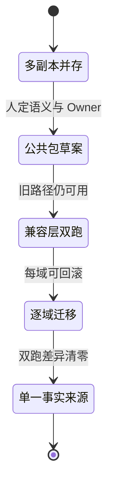
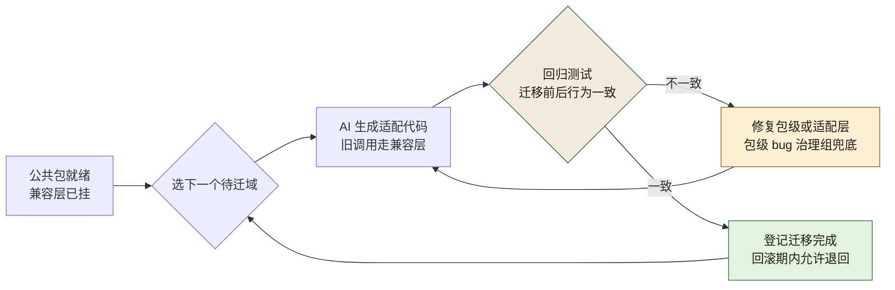
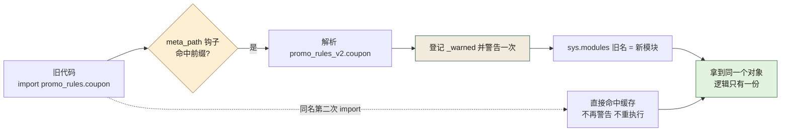

# 第 14 章 Python 立包与迁移：小步、可回滚

> **本章定位**：重构进入复用层。当同一份逻辑在全平台被多个域各写一遍时，"立包"是把它们收敛成单一事实来源的手段。本章讲人如何定立包顺序与兼容层策略、AI 如何做代码搬运，以及"先迁谁就先承担风险"的博弈。
> **核心命题**：复用不是复制。当你发现同一个逻辑在全平台有六个版本时，问题不在于"谁写错了"，而在于"组织从来没有提供一条'复用而非复制'的路"。AI 能把多份代码合并成一份，但"合并之后谁维护它"——这个答案，永远是组织给的。



**图 14-1｜立包迁移状态图** — 先稳定语义再抽取；兼容层双跑期间任何一步可回退。

---

## 14.1 问题：多个域各写了一遍同一个核心逻辑，没有一个是对的

业务域拆完单文件入口后，做了一次跨域代码扫描，发现一个荒诞的事实：**某个核心业务规则，全平台有多个版本。** 各个域都自己写过一遍，而且每个版本的行为各不相同。

以"满额减"这一类规则为例，某个域的版本允许和折扣叠加，另一个域的版本不允许，再一个域的版本看活动配置。**同一个公司、同一个规则、多种理解。** 这就是为什么之前跨域做联合活动时，每次都要先对一遍"你的逻辑和我的逻辑一不一样"。

域负责人看了扫描结果说："是不是该抽一个公共包？"

答案是肯定的，但顺序很重要——**不能一次抽所有域的版本，要先挑最稳定的那个当源头，再逐步迁移。** 图 14-1 把这条路线画成一段段状态迁移，关键在边上的触发条件：进"公共包草案"要先由人定语义与 Owner，进"兼容层双跑"的条件是旧路径仍可用，而通往单一事实来源的最后一道门叫"双跑差异清零"。

---

## 14.2 根因：复用靠复制粘贴，没有"公共包"的意识

**① 每个域都在自己的时间压力下"快速实现"。** 需要某个逻辑？复制一份改改就能用。**复制是最快的复用方式，也是最难维护的复用方式。**

**② AI 加剧了复制。** AI 在生成代码时，倾向于在当前仓库内自包含——它不会主动说"你应该用一个公共包"。相反，如果当前仓库有一份现成逻辑，AI 会基于它生成新的变体。**多份变体，AI 来了之后可能变成更多份。**

**③ 立包没有标准，谁也不知道"什么时候该独立成包"。** 太早立包，包的接口不稳定，调用方天天跟着改；太晚立包，复制已经失控。**这个时机判断，AI 给不了，因为它不理解"这个模块的变更频率和复用度"。**

---

## 14.3 AI 用法：AI 做搬运，人定顺序和兼容层

立包这件事，AI 和人的分工：

**人做的：**
- 判断"哪个版本最稳定"（变更频率最低）作为包的源头
- 定义包的对外接口（哪些函数暴露、哪些隐藏）
- 设计兼容层（让原有调用方暂时不用改，通过兼容层调新包）
- 决定迁移顺序（先迁哪个域、后迁哪个域）

**AI 做的：**
- 把选中版本抽成独立包的代码骨架
- 为每个调用方生成"通过兼容层调新包"的适配代码
- 生成回归测试，验证迁移前后行为一致

这次立包，选了那个刚被重构过、最干净的版本作为源头。**但 AI 在抽取时，把某个域特有的缓存逻辑也复制进了包里**——那段缓存是该域针对自己流量特征做的优化，别的域不需要。这就是 AI 的跨上下文失灵：**它不理解"哪些是通用逻辑、哪些是域特有逻辑"，因为在它眼里代码都是代码。**

人审之后把那段域特有的逻辑从包里移除了，保留在该域的适配层里。

### 操作步骤：一次立包的完整走法

可照抄的顺序（人的判断在前，AI 的搬运在中，拆除在最后）：

1. **扫重复**：让 AI 做跨域相似函数扫描，输出"重复逻辑簇"清单——每一簇就是一个立包候选。
2. **定源头**：人选变更频率最低、刚被重构过的版本当包的源头——它最接近"单一事实来源"该有的样子。
3. **划边界**：人写下"通用逻辑 / 域特有逻辑"的区分规则（见下方模板），AI 按规则抽包骨架。
4. **剔特有**：人复核 AI 的抽取结果，把域特有的缓存、阈值、重试参数移回各域适配层。
5. **双跑**：包内配置走 pyproject/setup 双跑（见下方配置示例），兼容层让旧调用方一行不改。
6. **逐域迁**：按"源头域 → 简单域 → 复杂域"的顺序迁移，每域回归测试通过才算完成。
7. **拆兼容**：所有调用方迁完、回滚观察期过后，删除兼容层与 setup 垫片——不拆，就永远是两套。

### 模板：给 AI 的「通用与特有」区分规则

区分规则写进约束，AI 抽包时才知道什么不许进包。可照抄：

```text
抽取公共包时按以下规则区分，不确定的标「待定」：
- 进包：业务规则本身、纯函数计算、与域无关的数据结构。
- 留在适配层：缓存策略、超时与重试参数、域特有的阈值与开关。
- 同时含两者的函数：先拆函数再判断，不许整段进包。
```

第三条最容易被跳过——**整段搬进包再"以后再拆"，就是兼容层永远拆不掉的开始。**

### 配置示例：pyproject/setup 双跑

包的配置本身也要"单一事实来源 + 兼容层"：pyproject.toml 是唯一事实，setup.py 只是给未迁移工具链的垫片。可照抄（包名、依赖均为占位）：

```toml
# pyproject.toml —— 唯一事实来源：包名、版本、依赖只在这一份里
[build-system]
requires = ["setuptools>=61"]
build-backend = "setuptools.build_meta"

[project]
name = "promo-rules"          # 占位包名
version = "0.1.0"             # 立包标准：主版本号内不破坏兼容
dependencies = [
    # 占位：按实际依赖填写；只锁主版本区间——包级回归测试只验证过锁定区间
]

[tool.setuptools.packages.find]
include = ["promo_rules*"]    # 为什么用通配：防止把域内实验目录误打进发布轮子
```

```python
# setup.py —— 兼容层垫片：老 CI 模板仍按旧命令调用构建时的过渡
# 为什么保留：还有域的构建模板没迁到新构建链；全部迁完后删除本文件
from setuptools import setup

setup()  # 参数全部读 pyproject.toml——本文件不允许再出现任何包信息
```

垫片文件里那句"不允许再出现任何包信息"是纪律：**一旦有人在 setup.py 里加了参数，事实来源就裂成两份**——这正是本章要消灭的"多副本并存"，在配置层的翻版。

---

## 14.4 角色博弈：先迁谁，谁就先承担风险

迁移多个域的顺序是一场博弈。**先迁的域承担"新包刚抽出来可能有 bug"的风险，后迁的域享受"前面的人帮你踩完坑"的红利。**

没有人想当先迁的。

源头域的负责人说："这个包是从我们域抽出来的，我们已经是最接近的，迁移成本最低——但我们不想当第一批验证者，万一新包有 bug，我们第一个炸。"

最后定的顺序是：**源头域先迁（因为它最接近，偏差最小），然后迁用得最简单、风险最低的域，最后迁有自己的定制逻辑、迁移最复杂的域。** 作为交换，治理组承诺："前几个域迁移中发现的所有包级 bug，由治理组负责修复。" 源头域负责人接受了——用"当先驱"的风险，换了"治理组兜底"的保障。

> **代价声明**：公共包从立包到全部调用方迁移完成，通常需要数周。兼容层的维护成本约占总工作量的 30%——**兼容层是"让旧代码不用改"的代价，它必须存在直到所有调用方都迁完，然后才能拆。** 在迁移期内，同一份逻辑同时存在于"新包"和"旧代码"两处，任何修改都要改两遍。

---

## 14.5 产出物：包治理规范

1. **立包标准**：何时立包（被若干域复用 + 变更频率低）、包的接口稳定性要求（主版本号内不破坏兼容）。
2. **迁移规范**：源头选定 → 兼容层 → 逐域迁移 → 回归测试 → 兼容层拆除。每步可回滚。

迁移规范的"逐域迁移、每步可回滚"画成回路：



**图 14-2｜逐域迁移回路** — 一域一迁、回归把关、包级 bug 有人兜底；退得回去，才走得下去。

读图 14-2 要顺着回归测试闸口的两个分支走：一致才登记迁移完成、回到选域节点；不一致先修包级或适配层再重跑适配——回路上没有任何一条边能从一域的失败直接通向"迁移完成"，这就是"每域可回滚"的画法。

> **代价声明**：包治理规范上线后，新发现的"重复逻辑"不再被允许直接复制——必须走"评估是否立包"的流程。这增加了一步审批，但避免了重复变体继续扩散。**规范的代价是"不再能随手复制"，收益是"同一个逻辑只维护一份"。**

### 度量指标：包治理看哪几个数

| 指标 | 怎么测 | 阈值 | 谁看 | 多久看一次 |
|------|--------|------|------|-----------|
| 重复逻辑簇数 | 跨域相似函数扫描 | 只降不升，新增即触发立包评估 | 架构组 | 每季度 |
| 迁移中包级 bug 数 | 治理组兜底修复台账 | 每个包趋零后才允许拆兼容层 | 治理组 | 每次迁移 |
| 兼容层存续时长 | 兼容层从挂上到拆除的天数 | 登记进复盘，超预期要写原因 | 包 Owner | 每月 |
| 未评估就复制的事件 | 评审中发现的新增重复实现 | 零容忍，退回走立包评估 | 各域 TL | 每次评审 |

第三个指标是治理组给自己上的紧箍咒：**兼容层拖得越久，"改两遍"的税就收得越久。**

### 检查清单：兼容层拆除前

- [ ] 所有登记在册的调用方，是不是都迁到了新包？
- [ ] 回滚观察期过了吗？期间有没有任何调用方退回旧路径？
- [ ] 迁移期台账上的包级 bug，是不是全部清零？
- [ ] setup.py 垫片和旧路径入口，是不是和兼容层一起删了？
- [ ] 拆除动作本身，有没有留下一条可追溯的变更记录？

## 14.5b PEP 621 逐行注释：`pyproject.toml` 的每个字段在替谁做决定

14.3 那份双跑配置示例只给了最小骨架。本节把立包当日的 `pyproject.toml` 逐行讲清：每个字段看着是元数据，实际都在替某个将来的动作做决定——缺一个字段，那个动作就会在半夜的构建日志里现形。

> **档位声明**：字段语义按 PEP 621 与 setuptools 文档口径写（B 档），本节**没有**跑过任何构建或发布；但"这份文件能不能被正确解析成预期的结构"用了 Python 标准库自带的 `tomllib` 实测（本机实跑，Python 3.14.4，不装任何第三方包）。

```toml
# pyproject.toml —— 包配置的唯一事实来源（PEP 621）
[build-system]
requires = ["setuptools>=61"]            # 构建这次需要哪些模块；这是对"构建能力"的要求，不是运行时依赖
build-backend = "setuptools.build_meta"  # 由谁来构建；换后端只动这两行，[project] 一字不改

[project]
name = "promo-rules-v2"                  # 分发名（内部源上可搜到的名字）；import 用的下划线名由后端映射得出
version = "2.0.0"                        # 立包标准的落点：主版本号内不破坏兼容（见 14.5）
requires-python = ">=3.11"               # 下限必须对齐"各域线上最低 Python"，写宽了装得上、跑不起
dependencies = []                        # 运行时依赖：只写意图区间，不钉死精确版本（钉法见 14.5d）

[project.optional-dependencies]
dev = ["ruff>=0.5", "mypy>=1.10"]        # 开发工具链不是运行时依赖：混进 dependencies 会传染给所有域

[project.urls]
Homepage = "https://git.internal/platform/promo-rules-v2"   # "事实来源在哪"的机器可读入口

[tool.setuptools.packages.find]
where = ["src"]                          # src 布局：本机测试时不会因为当前目录遮蔽而 import 到旧同名包
include = ["promo_rules_v2*"]            # 通配防误打包：域内实验目录不会被装进发布的轮子
```

三条判据，都源自"哪个字段写错了会疼"：

1. **一个字段只许出现在一份文件里。** 分发名、版本、依赖在 pyproject 之外再出现一次（setup.py 参数、`__init__.py` 里的 `__version__`、CI 脚本里的硬编码），事实来源就裂成两份——14.3 那句"垫片文件不允许再出现任何包信息"就是这条的兑现。
2. **版本要单一来源。** 若想让版本号只在代码或只在 tag 里存一份，用 `dynamic = ["version"]` 把决定权显式交给构建后端；**判据不是"用不用 dynamic"，而是"版本号有没有第二个手抄点"。**
3. **`requires-python` 是和各域的接口。** 它写 `>=3.11`，就意味着任何还跑 3.10 的域永远装不上这个包——这个字段是"谁有资格迁过来"的机器可读版本，改它等于改迁移范围，要走评审，不许顺手。

解析验证（本机实跑）：

```text
$ python3 -c "import tomllib; d = tomllib.load(open('pyproject.toml','rb')); print(sorted(d)); print(sorted(d['project']))"
['build-system', 'project', 'tool']
['dependencies', 'name', 'optional-dependencies', 'requires-python', 'urls', 'version']
```

再加一个"第二事实来源"探针——同一份文件里把 `name` 写两遍：

```text
$ printf '[project]\nname = "a"\nname = "b"\n' | python3 -c "import tomllib,sys; tomllib.loads(sys.stdin.read())"
tomllib.TOMLDecodeError: Cannot overwrite a value (at line 3, column 11)
```

同文件内的第二份事实，TOML 当场拦下；**真正危险的第二事实来源住在另一份文件里**（setup.py、CI 脚本），没有任何解析器会跨文件对账——那只能靠 14.5c、14.5e 那两条机器判据来守。

## 14.5c 判据行：ruff 与 mypy strict 各管什么（B 档）

> **档位声明**：**本机没有安装 ruff，也没有安装 mypy**——`python3 -m ruff --version` 与 `python3 -m mypy --version` 均返回 `No module named ruff` / `No module named mypy`（这是本机实跑的"工具在场性"检查，不是工具输出）。**本节不声称跑过这两个工具、不贴它们的任何报错**，只按文档口径写配置与判据行；拿到你的 CI 里跑通之后，才允许升格成你们环境的读数。

```toml
[tool.ruff]
target-version = "py311"        # 必须与 requires-python 下限一致，否则 lint 结论和运行环境脱节
line-length = 100               # 交给格式化器执行，人不在这条上吵架

[tool.ruff.lint]
select = ["E", "F", "B", "I", "UP"]   # 判据行一：F 与 B 不许关
[tool.ruff.lint.per-file-ignores]
"src/promo_rules/*" = ["F401"]         # 判据行二：豁免只精确到"兼容层路径 × 具体规则号"

[tool.mypy]
python_version = "3.11"
strict = true                          # strict 是一组开关的打包名，不是一种新检查
```

判据行一：`select` **至少含 `F` 与 `B`。** 本章的病因是 AI 搬运——搬运最容易留下的正是未用的 import、未用的变量、复制错作用域的名字，这些全在 `F` 的射程里；`B`（bugbear）管的是"看起来对、实际上错"的形状。`E` 里大半是风格，和格式化器重复，不必逐条争论。

判据行二：**每条 ignore 都必须带路径限定。** 全局关一条规则，等于给全仓所有人发通行证；写成"兼容层目录 × F401"这种精确豁免，兼容层一拆（14.5e 的拆除判据），这行配置跟着删——**配置的寿命和它服务的代码绑定，这就是"临时"两个字的机器形态。**

`strict = true` 的构成（按 mypy 文档口径）大致是：所有函数必须有完整注解（未注解即报错，而不是静默免检）、禁止隐式 `Any`、泛型不许裸用、`NoReturn`/`object` 收紧、未 re-export 的名字不许从包外 import。**判据行三：strict 用白名单渐进——`files = [...]` 只列新包，这张清单只许变短不许变长**（和 13.5e 那条目录清单同一条纪律）。

判据行四：**老包不套 strict，新包必须。** 双跑期的新包是唯一事实来源，它的类型面就是将来所有域的依赖面；shim 目录不写注解——**给一段注定被删除的代码补注解，是把迁移成本排到了拆除成本前面。**

判据行五：`ignore_missing_imports` 这类 per-module 豁免只给没有类型标记的第三方库，**永远不给自家另一个域的模块**——自家模块之间的缺口是契约问题（第 9 章），不是配置问题。

> **它替代不了什么**：ruff/mypy 判的是"这份代码自洽且类型面完整"，判不了"这份逻辑是不是全平台唯一的那份"。**14.2 的病因是复制，lint 治不了复制**——能治它的是 14.7 第一条那个跨域扫描。接线位置在门禁层，静态规则如何进流水线各层，见 [第 19 章](./ch24-第19章-五层门禁.md)。

## 14.5d 依赖锁定与可重现构建：把"当时能装"变成"永远能装"

立包之后出现一类新的不确定性：pyproject 写的是**意图**（`setuptools>=61`），而一次成功的构建依赖的是**某个具体解析结果**。中间这段距离，要靠分层来管：

| 层 | 回答的问题 | 落在哪件东西上 | 什么时候失效 |
|---|---|---|---|
| 意图层 | 这个包需要什么样的依赖 | pyproject 的区间声明 | 几乎不失效，人评审它 |
| 解析层 | 这次到底装哪个版本 | 锁文件里的精确版本集 | 解释器/平台标记变了就要重解 |
| 内容层 | 解析到的还是不是那份代码 | 哈希摘要 | 上游重新发布同版本包时 |

三层各自的判据：

1. **锁不许跨包边界。** 应用仓（各域的服务）必须从锁文件装；**库包只声明区间，锁文件不进发布物**——包一旦把锁带出去，就把全平台的依赖图钉死在自己那一份解析结果上，"被多个域复用"立刻变质为"替所有域做决定"。
2. **关于"可重现"有三档，先宣布做到哪一档。** 同一锁文件 + 同一解释器版本 + 同一平台 ⇒ 装出同一组包；这再往上才是"轮子逐字节一致"，那牵进构建路径、时间戳、压缩参数等一整套因素——**本章范围内不承诺它，也不要对 AI 说"给我可重现构建"却不指明是哪一档**，它会替你选最难的那档。
3. **锁 PR 的大小本身要受评审预算约束。** AI 批量升依赖时，一次 PR 的版本变更数超过人可核对的量，就把回滚粒度做没了——**要能单撤一个包，就像 14.5e 要求能单撤一个域。** 回滚通路的画法见 [第 21 章](./ch26-第21章-对账灰度回滚监控.md)。

> **档位声明**：本机有 pip（26.2.1）但本节写作全程未安装任何包、未联网取数，因此不出示安装类读数；`--require-hashes` 之类参数一律按 pip 文档口径描述，升格与否取决于你的 CI。

## 14.5e 把双跑真正跑起来：shim、`sys.modules` 换名与 meta_path 钩子（本机实跑）

> **档位声明**：本节所有代码与输出在本机跑过（Python 3.14.4，只用标准库，无第三方包）。目录形状：`src/promo_rules_v2/`（新包，事实来源）、`src/promo_rules/`（shim，只余 `__init__.py` 与一个旧子模块）、`src/compat_hook.py`（meta_path 钩子）、`domain_a/`、`domain_b/`（两个未迁域）。

第一步，包级 shim——旧路径 `import promo_rules` 仍然可用，但只警告一次、然后把名字整个交出去：

```python
# src/promo_rules/__init__.py —— 兼容层 shim：旧 import 路径仍可用，但只活到迁移完成
import sys
import warnings

from promo_rules_v2 import full_reduction as _full_reduction   # 事实来源在 v2，这里只做再导出
from promo_rules_v2 import VERSION as _VERSION

warnings.warn(
    "promo_rules 已弃用，请改 import promo_rules_v2（拆除条件见第 14 章兼容层台账）",
    DeprecationWarning,
    stacklevel=2,                       # 指向调用方那一行，不是这一行——警告要报对门
)

sys.modules[__name__] = sys.modules["promo_rules_v2"]   # ★ 钩子：旧名字直接指向新模块对象
```

`sys.modules` 换名这行是整个兼容层的心脏：**此后 `promo_rules` 与 `promo_rules_v2` 是同一个对象**，不存在"两份实现各自热着"的双跑漂移——真正的双跑只有"新旧路径"，永远没有"新旧逻辑"。而模块体只执行一次，所以警告天然只响一次，不会刷屏到让人去全局静音。

子路径（`import promo_rules.coupon`）光靠 shim 盖不住，补一个 `sys.meta_path` 钩子：

```python
# src/compat_hook.py —— 把整棵旧子路径 promo_rules.* 映射到 promo_rules_v2.*
import importlib
import sys
import warnings

PREFIX_OLD, PREFIX_NEW = "promo_rules.", "promo_rules_v2."
_warned = set()                       # 每个别名只警告一次——重复刷屏会让人把警告整体关掉

class AliasFinder:
    def find_spec(self, fullname, path=None, target=None):
        if not fullname.startswith(PREFIX_OLD):
            return None               # 不归我管，交回正常解析链
        real = PREFIX_NEW + fullname[len(PREFIX_OLD):]
        mod = importlib.import_module(real)         # 真正的解析交给新包
        if fullname not in _warned:
            _warned.add(fullname)
            warnings.warn(f"{fullname} 已弃用，请改 import {real}",
                          DeprecationWarning, stacklevel=2)
        sys.modules[fullname] = mod                 # 旧名字挂上新模块，之后走缓存
        return mod.__spec__

sys.meta_path.insert(0, AliasFinder())
```

两个未迁域照常 import 旧路径（`domain_a/service.py` 用 `from promo_rules import full_reduction`，`domain_b/job.py` 用 `from promo_rules.coupon import clamp_gap`），跑起来：

```text
$ python3 run_demo.py            # 本机实跑，Python 3.14.4
域 A 走旧路径        : 22000
第二次 import 同一路径: 22000
域 B 走旧子路径      : 3000
警告条数 = 2
   - DeprecationWarning: promo_rules 已弃用，请改 import promo_rules_v2（拆除条件见第 14 章兼容层台账） | 触发文件: service.py
   - DeprecationWarning: promo_rules.coupon 已弃用，请改 import promo_rules_v2.coupon | 触发文件: job.py
旧名字就是新模块 : True | VERSION = 2.0.0
sys.modules 读数 : promo_rules_v2 | 子路径读数: promo_rules_v2.coupon
```

四行读数各对一个主张：**业务结果照常**（22000，旧路径没有改变任何行为）、**警告每别名一次**（两条，各来自一个域）、**换名彻底**（`is` 为真、`VERSION` 是 v2 的）、**旧名字在新事实里不留位置**（sys.modules 里查到的是新模块的 `__name__`）。双跑期一个旧名的 import 到底走了哪几步，画在图 14-3 里——注意钩子只在"第一次"出现，之后那条缓存边才是常态。



**图 14-3｜双跑期的 import 解析链** — 钩子只在第一次出场：翻译名字、留下警告、把旧名挂到新模块上；之后一切走缓存，逻辑自始至终只有一份。

### 三个失效面：本机真撞上的那种

1. **旧名字名下的子模块，在新包里一个都不会多出来。** shim 换名后，旧包的命名空间跟着新包走：

```text
$ python3 run_failures.py            # 本机实跑（前两行是那次 import 的警告回显）
DeprecationWarning: promo_rules 已弃用，请改 import promo_rules_v2（拆除条件见第 14 章兼容层台账）
换名后 __path__ = ['/tmp/ch19/src/promo_rules_v2']
FAIL promo_rules.only_old -> ModuleNotFoundError: No module named 'promo_rules_v2.only_old'
OK   promo_rules_v2.coupon
```

   旧包留在磁盘上的 `only_old.py` 反而变得不可达——**兼容层不创造逻辑，它只转送逻辑**；旧实现里没进新包的部分，不会从路径里长出来。这正是 14.5 检查清单第一条要机器化的原因。
2. **钩子文件不许住在它换名的那个包里。** 把 `compat_hook.py` 挪进 shim 目录再 import：

```text
$ python3 -c "import sys; sys.path.insert(0,'src'); import promo_rules; import promo_rules.legacy_hook"
ModuleNotFoundError: No module named 'promo_rules.legacy_hook'
```

   钩子安装完成之前，旧名字已经被换掉了——**兼容层不能在自己要改造的命名空间里 bootstrap 自己**，安装入口必须留在旧命名空间之外。
3. **默认设置下，这枚警告你在生产日志里根本看不见。** Python 的默认过滤器会对 `__main__` 之外的 `DeprecationWarning` 保持安静——这是特性（不扰民），也是坑（不报到 CI 上）。把警告升成红灯是可跑的：

```text
$ PYTHONPATH=src:. python3 -W error::DeprecationWarning -c "import domain_a.service" ; echo "EXIT=$?"
DeprecationWarning: promo_rules 已弃用，请改 import promo_rules_v2（拆除条件见第 14 章兼容层台账）
EXIT=1
$ # 域 A 是它目录里最后一个旧 import；把那一行改成 promo_rules_v2 后重跑同一条命令
$ PYTHONPATH=src:. python3 -W error::DeprecationWarning -c "import domain_a.service" ; echo "EXIT=$?"
EXIT=0
```

   判据行：**红灯挂在"尚未迁移的域"的 CI 任务上，不挂全仓**——全仓红灯第一天就会被静音，等于没有灯；每迁完一个域，摘一个域的灯，灯的数量就是迁移进度。

### 拆除判据：旧路径引用数要数得出来

14.5 检查清单第一条问"所有调用方都迁了吗"。靠目录翻是翻不动的，用标准库数 import（本机实跑）：

```python
# scan_callers.py —— 旧路径引用清单：只认 import 语句，与 13.5e 的 AST 闸同源
import ast, pathlib, sys
OLD = sys.argv[1] if len(sys.argv) > 1 else "promo_rules"
hits = []
for f in sorted(pathlib.Path(".").rglob("*.py")):
    for n in ast.walk(ast.parse(f.read_text())):
        mods = [(n.module or "")] if isinstance(n, ast.ImportFrom) else \
               [a.name for a in n.names] if isinstance(n, ast.Import) else []
        for m in mods:
            if m == OLD or m.startswith(OLD + "."):
                hits.append(f"{f}:{n.lineno}  import {m}")
print("\n".join(hits) or "无旧路径调用方")
print(f"仍走旧路径的 import 语句数 = {len(hits)}")
sys.exit(1 if hits else 0)
```

```text
$ python3 scan_callers.py promo_rules ; echo "EXIT=$?"      # 本机实跑
domain_a/service.py:1  import promo_rules
domain_b/job.py:1  import promo_rules.coupon
run_demo.py:18  import promo_rules
run_failures.py:4  import promo_rules
仍走旧路径的 import 语句数 = 4
EXIT=1
$ # 把 domain_a/service.py 那一行迁成新路径后再跑：计数 4 变 3，EXIT 仍为 1
```

两个已知盲区，与 13.5e 那条 AST 判据一字不差：**运行期的字符串路径它看不见**（`importlib.import_module("promo_rules.coupon")` 照样能过），**它只数引用、不判语义**（迁了 import 行但还从兼容层拿私有名字，计数上看不出来）。所以这张清单必须和 14.5e 那条警告台账配对使用：**清单数出"还有几处要迁"，警告台账数出"迁完的还在偷用"。** 两个数同时归零，检查清单第一条才算绿灯。

---

## 14.6 四案例映射

| 案例 | 重复逻辑现象 | 立包难点 | 迁移顺序 |
|------|--------------|----------|----------|
| 案例一·电商平台 | 优惠券逻辑在六个域各有一份，"满 200 减 30"行为各不相同 | AI 把营销域特有的缓存逻辑也塞进公共包，需人工剔除 | 选重构过的营销域版本为源头，先迁源头域，再迁简单调用方，最后迁有定制逻辑的域 |
| 案例二·加密交易所 | 风控规则在撮合、清结算、风控三个子系统各写一份 | 风控阈值在不同子系统的语义不同，AI 抽包时把撮合侧阈值当通用值 | 先迁语义最清晰的风控子系统作为源头，撮合侧最后迁并保留适配层 |
| 案例三·Web3 量化 | 仓位计算在实盘、回测、模拟三套引擎里各写一份 | 回测允许近似、实盘要求精确，AI 不理解精度差异 | 先迁实盘引擎版本（最严格），回测和模拟通过适配层调用 |
| 案例四·安全初创 | 扫描任务调度在多个产品线各有一套，调度策略不一致 | 不同产品线对优先级和并发的定义不同，AI 按函数名聚类 | 先迁调度逻辑最稳定的旗舰产品线，其它产品线逐步跟进 |

---

## 14.7 检查清单

- [ ] 你的平台有多少逻辑是被多个域重复实现的？超过 3 份 = 该立包了。
- [ ] 你让 AI 抽包时，有没有人区分"通用逻辑"和"域特有逻辑"？没有 = AI 会把域特有的东西也塞进包里。
- [ ] 你的包有没有兼容层让旧代码不用立即改？没有 = 迁移变成大爆炸式风险。
- [ ] 你的迁移顺序是"先难后易"还是"先易后难"？先难 = 第一天就炸。
- [ ] 迁移完成后，兼容层拆了吗？没拆 = 新旧并存永远纠缠。

---

## 14.8 反模式

| # | 反模式 | 后果 |
|---|--------|------|
| 1 | 复制粘贴当复用 | 多个版本多种行为 |
| 2 | AI 抽包不分通用与特有 | 域特有逻辑污染公共包 |
| 3 | 没有兼容层直接迁移 | 所有调用方同时改，同时炸 |
| 4 | 先迁最复杂的域 | 第一批就踩最大的坑 |
| 5 | 迁完不拆兼容层 | 永远维护两套代码 |

---

## 14.9 遗留问题

- **跨团队包的 Owner 是谁？** 公共包立出来了，但它服务于多个域，归谁维护？源头域觉得"不是我的事了"，别的域觉得"我没发起立包凭什么我维护"。这个治理问题留给后续委员会章节——最终公共包的 Owner 归治理组，各域有"提议变更权"但无"单方面修改权"。
- **包的版本和各域的升级节奏怎么协调？** 包出了新版本，各域不会同时升级。怎么保证"旧版本还有人用、新版本有人验证"？这涉及语义化版本和兼容窗口，和老版本兼容章节是同类问题。

---

> **本章的一句话**：复用不是复制。**当你发现同一个逻辑在全平台有多个版本时，问题不在于"谁写错了"，而在于"组织从来没有提供一条'复用而非复制'的路"。** AI 能帮你把多份代码合并成一份，但"合并成一份之后谁维护它"——这个问题的答案，永远是组织给的，不是 AI 给的。
