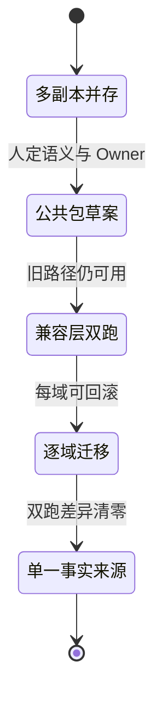
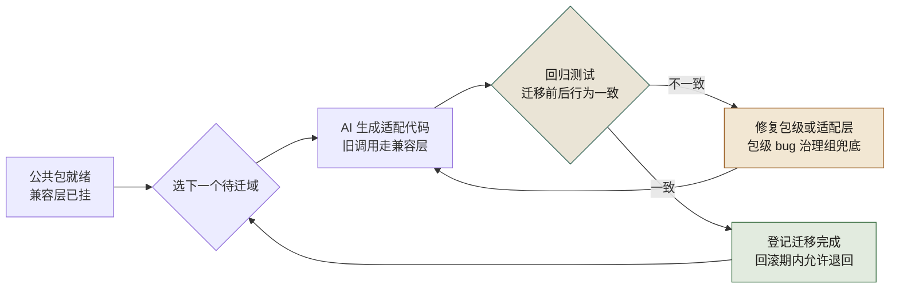

# 第 14 章 Python 立包与迁移：小步、可回滚

> **本章定位**：重构进入复用层。当同一份逻辑在全平台被多个域各写一遍时，"立包"是把它们收敛成单一事实来源的手段。本章讲人如何定立包顺序与兼容层策略、AI 如何做代码搬运，以及"先迁谁就先承担风险"的博弈。
> **核心命题**：复用不是复制。当你发现同一个逻辑在全平台有六个版本时，问题不在于"谁写错了"，而在于"组织从来没有提供一条'复用而非复制'的路"。AI 能把多份代码合并成一份，但"合并之后谁维护它"——这个答案，永远是组织给的。



**图 14-1｜立包迁移状态图** — 先稳定语义再抽取；兼容层双跑期间任何一步可回退。

---

## 14.1 问题：多个域各写了一遍同一个核心逻辑，没有一个是对的

业务域拆完单文件入口后，做了一次跨域代码扫描，发现一个荒诞的事实：**某个核心业务规则，全平台有多个版本。** 各个域都自己写过一遍，而且每个版本的行为各不相同。

以"满额减"这一类规则为例，某个域的版本允许和折扣叠加，另一个域的版本不允许，再一个域的版本看活动配置。**同一个公司、同一个规则、多种理解。** 这就是为什么之前跨域做联合活动时，每次都要先对一遍"你的逻辑和我的逻辑一不一样"。

域负责人看了扫描结果说："是不是该抽一个公共包？"

答案是肯定的，但顺序很重要——**不能一次抽所有域的版本，要先挑最稳定的那个当源头，再逐步迁移。** 图 14-1 把这条路线画成一段段状态迁移，关键在边上的触发条件：进"公共包草案"要先由人定语义与 Owner，进"兼容层双跑"的条件是旧路径仍可用，而通往单一事实来源的最后一道门叫"双跑差异清零"。

---

## 14.2 根因：复用靠复制粘贴，没有"公共包"的意识

**① 每个域都在自己的时间压力下"快速实现"。** 需要某个逻辑？复制一份改改就能用。**复制是最快的复用方式，也是最难维护的复用方式。**

**② AI 加剧了复制。** AI 在生成代码时，倾向于在当前仓库内自包含——它不会主动说"你应该用一个公共包"。相反，如果当前仓库有一份现成逻辑，AI 会基于它生成新的变体。**多份变体，AI 来了之后可能变成更多份。**

**③ 立包没有标准，谁也不知道"什么时候该独立成包"。** 太早立包，包的接口不稳定，调用方天天跟着改；太晚立包，复制已经失控。**这个时机判断，AI 给不了，因为它不理解"这个模块的变更频率和复用度"。**

---

## 14.3 AI 用法：AI 做搬运，人定顺序和兼容层

立包这件事，AI 和人的分工：

**人做的：**
- 判断"哪个版本最稳定"（变更频率最低）作为包的源头
- 定义包的对外接口（哪些函数暴露、哪些隐藏）
- 设计兼容层（让原有调用方暂时不用改，通过兼容层调新包）
- 决定迁移顺序（先迁哪个域、后迁哪个域）

**AI 做的：**
- 把选中版本抽成独立包的代码骨架
- 为每个调用方生成"通过兼容层调新包"的适配代码
- 生成回归测试，验证迁移前后行为一致

这次立包，选了那个刚被重构过、最干净的版本作为源头。**但 AI 在抽取时，把某个域特有的缓存逻辑也复制进了包里**——那段缓存是该域针对自己流量特征做的优化，别的域不需要。这就是 AI 的跨上下文失灵：**它不理解"哪些是通用逻辑、哪些是域特有逻辑"，因为在它眼里代码都是代码。**

人审之后把那段域特有的逻辑从包里移除了，保留在该域的适配层里。

### 操作步骤：一次立包的完整走法

可照抄的顺序（人的判断在前，AI 的搬运在中，拆除在最后）：

1. **扫重复**：让 AI 做跨域相似函数扫描，输出"重复逻辑簇"清单——每一簇就是一个立包候选。
2. **定源头**：人选变更频率最低、刚被重构过的版本当包的源头——它最接近"单一事实来源"该有的样子。
3. **划边界**：人写下"通用逻辑 / 域特有逻辑"的区分规则（见下方模板），AI 按规则抽包骨架。
4. **剔特有**：人复核 AI 的抽取结果，把域特有的缓存、阈值、重试参数移回各域适配层。
5. **双跑**：包内配置走 pyproject/setup 双跑（见下方配置示例），兼容层让旧调用方一行不改。
6. **逐域迁**：按"源头域 → 简单域 → 复杂域"的顺序迁移，每域回归测试通过才算完成。
7. **拆兼容**：所有调用方迁完、回滚观察期过后，删除兼容层与 setup 垫片——不拆，就永远是两套。

### 模板：给 AI 的「通用与特有」区分规则

区分规则写进约束，AI 抽包时才知道什么不许进包。可照抄：

```text
抽取公共包时按以下规则区分，不确定的标「待定」：
- 进包：业务规则本身、纯函数计算、与域无关的数据结构。
- 留在适配层：缓存策略、超时与重试参数、域特有的阈值与开关。
- 同时含两者的函数：先拆函数再判断，不许整段进包。
```

第三条最容易被跳过——**整段搬进包再"以后再拆"，就是兼容层永远拆不掉的开始。**

### 配置示例：pyproject/setup 双跑

包的配置本身也要"单一事实来源 + 兼容层"：pyproject.toml 是唯一事实，setup.py 只是给未迁移工具链的垫片。可照抄（包名、依赖均为占位）：

```toml
# pyproject.toml —— 唯一事实来源：包名、版本、依赖只在这一份里
[build-system]
requires = ["setuptools>=61"]
build-backend = "setuptools.build_meta"

[project]
name = "promo-rules"          # 占位包名
version = "0.1.0"             # 立包标准：主版本号内不破坏兼容
dependencies = [
    # 占位：按实际依赖填写；只锁主版本区间——包级回归测试只验证过锁定区间
]

[tool.setuptools.packages.find]
include = ["promo_rules*"]    # 为什么用通配：防止把域内实验目录误打进发布轮子
```

```python
# setup.py —— 兼容层垫片：老 CI 模板仍按旧命令调用构建时的过渡
# 为什么保留：还有域的构建模板没迁到新构建链；全部迁完后删除本文件
from setuptools import setup

setup()  # 参数全部读 pyproject.toml——本文件不允许再出现任何包信息
```

垫片文件里那句"不允许再出现任何包信息"是纪律：**一旦有人在 setup.py 里加了参数，事实来源就裂成两份**——这正是本章要消灭的"多副本并存"，在配置层的翻版。

---

## 14.4 角色博弈：先迁谁，谁就先承担风险

迁移多个域的顺序是一场博弈。**先迁的域承担"新包刚抽出来可能有 bug"的风险，后迁的域享受"前面的人帮你踩完坑"的红利。**

没有人想当先迁的。

源头域的负责人说："这个包是从我们域抽出来的，我们已经是最接近的，迁移成本最低——但我们不想当第一批验证者，万一新包有 bug，我们第一个炸。**

最后定的顺序是：**源头域先迁（因为它最接近，偏差最小），然后迁用得最简单、风险最低的域，最后迁有自己的定制逻辑、迁移最复杂的域。** 作为交换，治理组承诺："前几个域迁移中发现的所有包级 bug，由治理组负责修复。** 源头域负责人接受了——用"当先驱"的风险，换了"治理组兜底"的保障。

> **代价声明**：公共包从立包到全部调用方迁移完成，通常需要数周。兼容层的维护成本约占总工作量的 30%——**兼容层是"让旧代码不用改"的代价，它必须存在直到所有调用方都迁完，然后才能拆。** 在迁移期内，同一份逻辑同时存在于"新包"和"旧代码"两处，任何修改都要改两遍。

---

## 14.5 产出物：包治理规范

1. **立包标准**：何时立包（被若干域复用 + 变更频率低）、包的接口稳定性要求（主版本号内不破坏兼容）。
2. **迁移规范**：源头选定 → 兼容层 → 逐域迁移 → 回归测试 → 兼容层拆除。每步可回滚。

迁移规范的"逐域迁移、每步可回滚"画成回路：



**图 14-2｜逐域迁移回路** — 一域一迁、回归把关、包级 bug 有人兜底；退得回去，才走得下去。

读图 14-2 要顺着回归测试闸口的两个分支走：一致才登记迁移完成、回到选域节点；不一致先修包级或适配层再重跑适配——回路上没有任何一条边能从一域的失败直接通向"迁移完成"，这就是"每域可回滚"的画法。

> **代价声明**：包治理规范上线后，新发现的"重复逻辑"不再被允许直接复制——必须走"评估是否立包"的流程。这增加了一步审批，但避免了重复变体继续扩散。**规范的代价是"不再能随手复制"，收益是"同一个逻辑只维护一份"。**

### 度量指标：包治理看哪几个数

| 指标 | 怎么测 | 阈值 | 谁看 | 多久看一次 |
|------|--------|------|------|-----------|
| 重复逻辑簇数 | 跨域相似函数扫描 | 只降不升，新增即触发立包评估 | 架构组 | 每季度 |
| 迁移中包级 bug 数 | 治理组兜底修复台账 | 每个包趋零后才允许拆兼容层 | 治理组 | 每次迁移 |
| 兼容层存续时长 | 兼容层从挂上到拆除的天数 | 登记进复盘，超预期要写原因 | 包 Owner | 每月 |
| 未评估就复制的事件 | 评审中发现的新增重复实现 | 零容忍，退回走立包评估 | 各域 TL | 每次评审 |

第三个指标是治理组给自己上的紧箍咒：**兼容层拖得越久，"改两遍"的税就收得越久。**

### 检查清单：兼容层拆除前

- [ ] 所有登记在册的调用方，是不是都迁到了新包？
- [ ] 回滚观察期过了吗？期间有没有任何调用方退回旧路径？
- [ ] 迁移期台账上的包级 bug，是不是全部清零？
- [ ] setup.py 垫片和旧路径入口，是不是和兼容层一起删了？
- [ ] 拆除动作本身，有没有留下一条可追溯的变更记录？

---

## 14.6 四案例映射

| 案例 | 重复逻辑现象 | 立包难点 | 迁移顺序 |
|------|--------------|----------|----------|
| 案例一·电商平台 | 优惠券逻辑在六个域各有一份，"满 200 减 30"行为各不相同 | AI 把营销域特有的缓存逻辑也塞进公共包，需人工剔除 | 选重构过的营销域版本为源头，先迁源头域，再迁简单调用方，最后迁有定制逻辑的域 |
| 案例二·加密交易所 | 风控规则在撮合、清结算、风控三个子系统各写一份 | 风控阈值在不同子系统的语义不同，AI 抽包时把撮合侧阈值当通用值 | 先迁语义最清晰的风控子系统作为源头，撮合侧最后迁并保留适配层 |
| 案例三·Web3 量化 | 仓位计算在实盘、回测、模拟三套引擎里各写一份 | 回测允许近似、实盘要求精确，AI 不理解精度差异 | 先迁实盘引擎版本（最严格），回测和模拟通过适配层调用 |
| 案例四·安全初创 | 扫描任务调度在多个产品线各有一套，调度策略不一致 | 不同产品线对优先级和并发的定义不同，AI 按函数名聚类 | 先迁调度逻辑最稳定的旗舰产品线，其它产品线逐步跟进 |

---

## 14.7 检查清单

- [ ] 你的平台有多少逻辑是被多个域重复实现的？超过 3 份 = 该立包了。
- [ ] 你让 AI 抽包时，有没有人区分"通用逻辑"和"域特有逻辑"？没有 = AI 会把域特有的东西也塞进包里。
- [ ] 你的包有没有兼容层让旧代码不用立即改？没有 = 迁移变成大爆炸式风险。
- [ ] 你的迁移顺序是"先难后易"还是"先易后难"？先难 = 第一天就炸。
- [ ] 迁移完成后，兼容层拆了吗？没拆 = 新旧并存永远纠缠。

---

## 14.8 反模式

| # | 反模式 | 后果 |
|---|--------|------|
| 1 | 复制粘贴当复用 | 多个版本多种行为 |
| 2 | AI 抽包不分通用与特有 | 域特有逻辑污染公共包 |
| 3 | 没有兼容层直接迁移 | 所有调用方同时改，同时炸 |
| 4 | 先迁最复杂的域 | 第一批就踩最大的坑 |
| 5 | 迁完不拆兼容层 | 永远维护两套代码 |

---

## 14.9 遗留问题

- **跨团队包的 Owner 是谁？** 公共包立出来了，但它服务于多个域，归谁维护？源头域觉得"不是我的事了"，别的域觉得"我没发起立包凭什么我维护"。这个治理问题留给后续委员会章节——最终公共包的 Owner 归治理组，各域有"提议变更权"但无"单方面修改权"。
- **包的版本和各域的升级节奏怎么协调？** 包出了新版本，各域不会同时升级。怎么保证"旧版本还有人用、新版本有人验证"？这涉及语义化版本和兼容窗口，和老版本兼容章节是同类问题。

---

> **本章的一句话**：复用不是复制。**当你发现同一个逻辑在全平台有多个版本时，问题不在于"谁写错了"，而在于"组织从来没有提供一条'复用而非复制'的路"。** AI 能帮你把多份代码合并成一份，但"合并成一份之后谁维护它"——这个问题的答案，永远是组织给的，不是 AI 给的。
