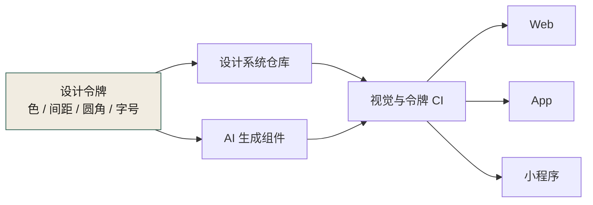
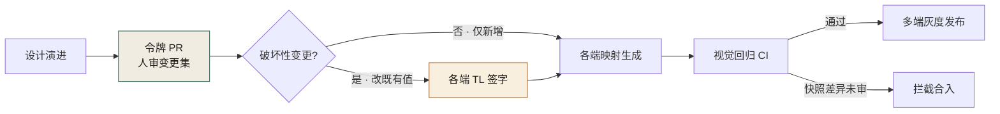

# 第 15 章 前端解耦、多端与设计系统

> **本章定位**：重构进入展示层。当一个业务需要在多个端（Web、移动、小程序等）同时落地时，AI 能为每个端生成代码，却无法保证各端视觉一致。本章讲设计令牌如何作为"审美契约"喂给 AI，以及"以哪个端为标准"的多端博弈。
> **核心命题**：审美也是契约。当你不给 AI 一份设计令牌，它就在多个端各画各的——不是因为它不努力，是因为它没有一个"对的"标准。多端设计系统的本质，是让"它们应该长成什么样"这件事，有一份人定的、可追溯的、AI 能读懂的单一事实来源。



**图 15-1｜设计令牌即审美契约** — 没有令牌，AI 会在多端各画各的；标准必须是人定的单一事实来源。

---

## 15.1 问题：AI 生成的同一个按钮，多个端长得不一样

业务域做前端重构时，让 AI 生成一组活动页组件——优惠券卡片、倒计时、活动横幅。AI 生成得很快，多端的代码都有了。

但设计系统负责人看了之后，差点掀桌。

同一个"优惠券卡片"，各端的圆角、间距、字号、主色各不相同。**AI 不是故意做不一致——它在每个端的代码里，基于该端"看起来合理"的值各自生成了样式。它没有一个"统一标准"的概念，因为标准不在代码里，在设计系统里，而没有团队给 AI 这个系统。**

设计系统负责人拿着多端的截图来质问："你们的 AI 是在帮我做几个不同的产品吗？"

这件事揭示了一个之前被忽略的问题：**不仅是接口需要契约，审美也需要契约。** 设计令牌（颜色、间距、圆角、字号）如果不统一，AI 生成的 UI 就是几个人各画各的——只是这几个人都是同一个 AI。

---

## 15.2 根因：设计令牌散落在多个端，没有单一事实来源

**① 多个端各自维护样式值。** 安卓在 XML 里写颜色、iOS 在 Swift 里写、Web 在 CSS 里写、小程序在 WXSS 里写——每个端有自己的"色板"，值相近但不完全一致。**人和人之间的不一致，被 AI 等比例放大成了系统性不一致。**

**② AI 生成 UI 时，基于当前端的散值。** 它不知道有个"应该统一的源头"，它在每个端的代码里各取一个值。

**③ 审美一致性不是工程师的 KPI。** 工程师的 KPI 是"功能做出来了"，至于是不是"和设计稿一模一样"，验收时差不多就行。**审美的偏差是渐进的、不被追踪的——直到某天设计师把多端摆在一起看，才发现已经面目全非。**

---

## 15.3 AI 用法：给 AI 设计令牌，就像给 AI 契约

解决方法和契约先行一模一样：**先定义"设计契约"，再让 AI 在契约内生成。**

图 15-1 就是这份契约落地后的形状：设计令牌有两条出边，一条进 AI 生成、一条进设计系统仓库，两条边在视觉与令牌 CI 汇合之后才分发给 Web、App、小程序——任何一端绕开这道 CI，等于绕开契约。

**设计令牌的层级：**
```
基础令牌（颜色/间距/圆角/字号的原始值）
  → 语义令牌（"主色" = 基础令牌里的某个值）
    → 组件令牌（"按钮圆角" = 语义令牌里的"中等圆角"）
```

**每个端的样式，都必须从这个令牌表映射而来，不允许写散值。** AI 生成 UI 时，提示词里附上令牌表。这样 AI 生成的多端代码，样式值来自同一个源头。

设计系统负责人带着设计工程师花了几周，把多端的散值整理成了一份统一令牌表，并标注了"多端差异必须显式声明原因"的规则。**比如某个端的导航栏高度和别的端不同，不是因为设计不一致，而是平台限制——这种情况要标注"平台约束导致的差异"，而不是当 bug 处理。**

---

## 15.4 角色博弈：设计令牌统一，多端各让一步

令牌统一的过程，最激烈的冲突在"**以哪个端为标准**"。

各端的代表各执一词：用户最多的端说"以我为准"；规范最严格的端说"以我为准"；平台限制最多的端说"你们定的值我不一定支持"。

最后设计系统负责人拍了一个折中方案：**令牌的基础值以"设计稿"为准（不是任何一端），各端如果因为平台限制不能完全实现，必须标注"平台豁免"并说明原因。** 各端都让了一步——用户最多的端让出了"以我为标准"的地位，规范最严格的端让出了"我最严格"的优越感，限制最多的端拿到了"平台豁免"的机制。

> **代价声明**：令牌统一后，各端的 UI 组件库都要更新映射。这个更新占用了各端若干人天。**短期内多端的视觉效果会出现一次"统一化"的微调，部分用户会注意到按钮圆角变了。** 设计系统负责人说："这种变化是值得的——要么现在统一，要么几年后多端完全分叉。"

---

## 15.5 产出物：多端设计系统规范

1. **设计令牌表**：基础令牌 + 语义令牌 + 组件令牌，各端各自维护映射文件。
2. **平台豁免清单**：哪些差异是平台限制导致的、哪些是真正的偏差。
3. **组件库**：多端共享设计规范的组件实现（各端代码不同，但视觉规范一致）。

> **代价声明**：设计系统规范的最大长期成本是"维护令牌表"——每次设计语言演进，令牌表要更新，各端映射要同步。**这个成本由设计系统团队承担，它不进任何业务域的 KPI。但如果没有它，AI 生成的 UI 永远是几个不同的产品。**

---

## 15.6 可抄骨架：令牌文件与各端映射

令牌仓库里只有两个 JSON 是事实来源，其余全部是生成物：

```json
// tokens/base.json —— 原始值层，唯一允许"手写"的地方
{
  "color":  { "primary-500": "#4F46E5", "danger-500": "#DC2626" },
  "radius": { "sm": 4, "md": 8, "lg": 16 },
  "space":  { "1": 4, "2": 8, "3": 16, "4": 24 },
  "font":   { "size-body": 14, "size-title": 20 }
}
```

```json
// tokens/semantic.json —— 语义层，组件与 AI 只准引用这一层
{
  "brand":       "{color.primary-500}",
  "radius-card": "{radius.md}",
  "gap-card":    "{space.3}"
}
```

各端的映射文件由 CI 从令牌表**生成**：Web 生成 CSS 变量、iOS 生成 Swift 枚举、Android 生成 XML theme、小程序生成 WXSS 变量。端只许"映射"，不许"硬编码"——lint 规则可以立得非常朴素：**业务代码里出现裸 hex 色值或裸 px 间距（未引用生成变量）即违规，MR 拦死。**

给 AI 生成 UI 的提示词，附上语义层就够：

```text
生成【优惠券卡片】组件。样式值只能取自下方令牌表；
若需要的观感无法用令牌表达，停下来输出
"TOKEN_MISSING: <缺什么、为什么需要>"，禁止用散值凑。
<semantic.json 内容>
```

关键是 **TOKEN_MISSING 这个显式出口**：宁可让 AI 承认"你的契约里没有这个令牌"，也不要它拿散值凑一个"看起来对"的卡片。每一条 TOKEN_MISSING 上报，都是令牌表下一次修订的输入——这和设计稿评审里"设计师补令牌"是同一个回路，只是现在补漏的请求方换成了 AI。

---

## 15.7 落地步骤与度量

**五步落地：**

1. **散值盘点**：一次性脚本抽取各端代码里所有色值与尺寸，按相似度聚类，得到"伪令牌"清单——同一个主色往往能聚出四五个色号，这份清单就是统一谈判的起点。
2. **人定值**：设计系统负责人和设计师按设计稿为每个语义定唯一值。**端不参与定值，只参与豁免**——这一条守住，第 15.4 节的博弈就不会重演。
3. **令牌仓库 + 生成**：令牌表进仓库，JSON 是事实来源，各端映射文件全部由流水线生成，人不手写生成物。
4. **lint 与 CI 进场**：散值扫描 + 视觉回归快照比对；引用不存在令牌的 MR 直接拦截。
5. **豁免登记**：平台差异（如某端导航栏高度）逐条进豁免清单，写明原因与责任方；未登记的差异一律按 bug 处理。

**度量四件套：**

| 指标 | 度量什么 | 健康方向 |
|------|----------|---------|
| 散值率 | 业务代码中未走令牌的样式值占比 | 只降不升；回升 = lint 松了 |
| TOKEN_MISSING 数 | AI 上报"令牌不够用"的频次 | 前期多、后期收敛 |
| 豁免清单长度 | 已声明的平台差异条数 | 基本稳定；快速增长 = 又开始分叉 |
| 视觉回归拦截数 | 被快照比对拦下的 MR 数 | 非零才有意义；恒零先怀疑快照失效 |

令牌也是契约，变更要走和接口契约一样的流程——图 15-2 就是它的传导链。



**图 15-2｜令牌变更传导链** — 把令牌当装饰的那天，就是多端重新分叉的那天；把它当契约，才有替你拦人的 CI。

---

## 15.8 四案例映射

| 案例 | 多端不一致症状 | 令牌统一难点 | 谁承担维护成本 |
|------|----------------|--------------|----------------|
| 案例一·电商平台 | 营销活动页优惠券卡片在安卓/iOS/小程序/Web/鸿蒙五端圆角、字号、主色各异 | 各端各有"看起来合理"的散值，AI 逐端生成放大了偏差 | 设计系统团队维护令牌表，五端各出 3-5 人天更新映射 |
| 案例二·加密交易所 | 行情列表组件在 App 和 Web 上的涨跌色、字号、刷新动效不一致 | 涨跌色在不同地区有合规要求差异，不能简单统一 | 合规团队介入定义"合规豁免"，设计系统团队负责其余 |
| 案例三·Web3 量化 | 策略看板在桌面端、移动端、邮件报表三端样式漂移 | 桌面端信息密度高、移动端需折叠，AI 不理解"密度差异" | 设计系统团队定义"密度档位"令牌，各端按档位映射 |
| 案例四·安全初创 | 控制台在 Web 和 CLI 工具上配色与排版各异，用户体感割裂 | CLI 没有"圆角/间距"概念，令牌映射需要降维 | 设计系统团队为 CLI 定义"等价语义令牌"（如颜色对配色映射） |

---

## 15.9 检查清单

- [ ] 你的多端 UI，用的是同一份设计令牌吗？不是 = AI 生成的 UI 各端各异。
- [ ] 你给 AI 生成 UI 时，有没有附上令牌表？没有 = AI 用散值自由发挥。
- [ ] 你的令牌有没有单一事实来源？散在各端 = 没有统一的可能。
- [ ] 多端的差异，你区分了"设计偏差"和"平台限制"吗？不区分 = 统一时会把平台限制当 bug 来改。
- [ ] 你的令牌表有没有更新机制？没有 = 设计演进时令牌表过期。

---

## 15.10 反模式

| # | 反模式 | 后果 |
|---|--------|------|
| 1 | 多端各自维护散值 | AI 放大不一致，多端分叉 |
| 2 | 以某一个端为"标准" | 其他端被迫适配不属于自己的规范 |
| 3 | 不给 AI 令牌就让它生成 UI | 自由发挥 = 多个产品 |
| 4 | 把平台限制当设计偏差 | 强行统一导致某些端无法实现 |
| 5 | 令牌表建完不维护 | 几年后又是一堆散值 |

---

## 15.11 遗留问题

- **设计令牌怎么和代码契约一起治理？** 令牌也是一种契约——变更需要通知、破坏性变更需要审批。这件事和契约治理是同构的，留给后续设计令牌治理章节收口。
- **AI 能不能自动检测 UI 和设计稿的偏差？** 视觉回归测试可以做到一部分，但 AI 生成的 UI 和设计稿的语义差异（不是像素差异）很难自动判定。留给后续章节。
- **组件库的跨端维护谁负责？** 多端代码不同但规范一致，这意味着同一个组件要维护多个实现。这个维护成本和"公共包"问题是同类——需要一个有治理组支撑的"组件 Owner"机制。

---

> **本章的一句话**：审美也是契约。**当你不给 AI 一份设计令牌，它就在多个端各画各的——不是因为它不努力，是因为它没有一个"对的"标准。** 多端设计系统的本质，不是让多端长得一样，而是让"它们应该长成什么样"这件事，有一份人定的、可追溯的、AI 能读懂的单一事实来源。
