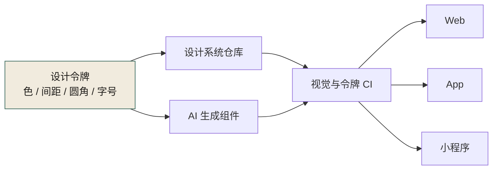
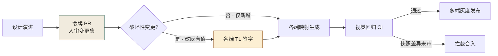
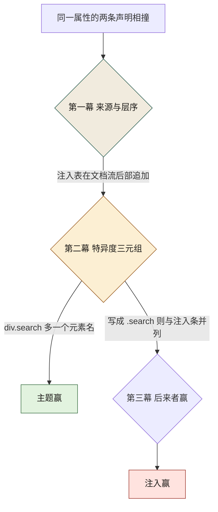
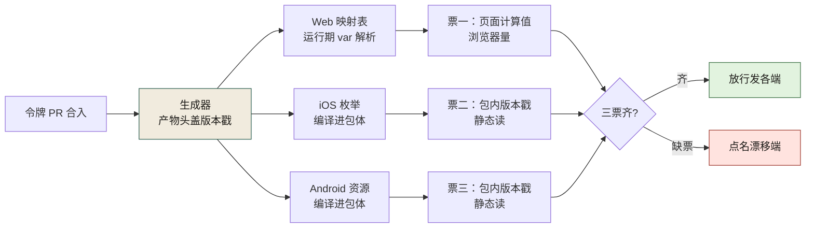
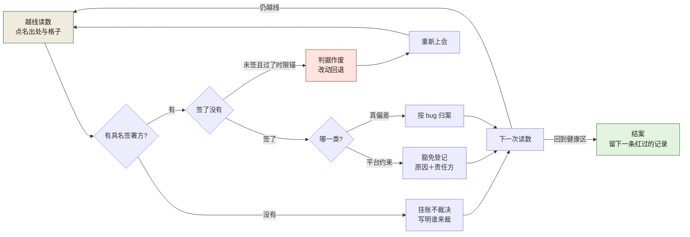

# 第 15 章 前端解耦、多端与设计系统

> **本章定位**：重构进入展示层。当一个业务需要在多个端（Web、移动、小程序等）同时落地时，AI 能为每个端生成代码，却无法保证各端视觉一致。本章讲设计令牌如何作为"审美契约"喂给 AI，以及"以哪个端为标准"的多端博弈。
> **核心命题**：审美也是契约。当你不给 AI 一份设计令牌，它就在多个端各画各的——不是因为它不努力，是因为它没有一个"对的"标准。多端设计系统的本质，是让"它们应该长成什么样"这件事，有一份人定的、可追溯的、AI 能读懂的单一事实来源。


```mermaid
flowchart LR
  TOK[设计令牌<br/>色 / 间距 / 圆角 / 字号] --> AI[AI 生成组件]
  TOK --> DS[设计系统仓库]
  DS --> CI[视觉与令牌 CI]
  AI --> CI
  CI --> W[Web]
  CI --> A[App]
  CI --> M[小程序]
  style TOK fill:#f1ebde,stroke:#2f6154,color:#1e1c19
```

**图 15-1｜设计令牌即审美契约** — 没有令牌，AI 会在多端各画各的；标准必须是人定的单一事实来源。

---

## 15.1 问题：AI 生成的同一个按钮，多个端长得不一样

业务域做前端重构时，让 AI 生成一组活动页组件——优惠券卡片、倒计时、活动横幅。AI 生成得很快，多端的代码都有了。

但设计系统负责人看了之后，差点掀桌。

同一个"优惠券卡片"，各端的圆角、间距、字号、主色各不相同。**AI 不是故意做不一致——它在每个端的代码里，基于该端"看起来合理"的值各自生成了样式。它没有一个"统一标准"的概念，因为标准不在代码里，在设计系统里，而没有团队给 AI 这个系统。**

设计系统负责人拿着多端的截图来质问："你们的 AI 是在帮我做几个不同的产品吗？"

这件事揭示了一个之前被忽略的问题：**不仅是接口需要契约，审美也需要契约。** 设计令牌（颜色、间距、圆角、字号）如果不统一，AI 生成的 UI 就是几个人各画各的——只是这几个人都是同一个 AI。

---

## 15.2 根因：设计令牌散落在多个端，没有单一事实来源

**① 多个端各自维护样式值。** 安卓在 XML 里写颜色、iOS 在 Swift 里写、Web 在 CSS 里写、小程序在 WXSS 里写——每个端有自己的"色板"，值相近但不完全一致。**人和人之间的不一致，被 AI 等比例放大成了系统性不一致。**

**② AI 生成 UI 时，基于当前端的散值。** 它不知道有个"应该统一的源头"，它在每个端的代码里各取一个值。

**③ 审美一致性不是工程师的 KPI。** 工程师的 KPI 是"功能做出来了"，至于是不是"和设计稿一模一样"，验收时差不多就行。**审美的偏差是渐进的、不被追踪的——直到某天设计师把多端摆在一起看，才发现已经面目全非。**

---

## 15.3 AI 用法：给 AI 设计令牌，就像给 AI 契约

解决方法和契约先行一模一样：**先定义"设计契约"，再让 AI 在契约内生成。**

图 15-1 就是这份契约落地后的形状：设计令牌有两条出边，一条进 AI 生成、一条进设计系统仓库，两条边在视觉与令牌 CI 汇合之后才分发给 Web、App、小程序——任何一端绕开这道 CI，等于绕开契约。

**设计令牌的层级：**
```
基础令牌（颜色/间距/圆角/字号的原始值）
  → 语义令牌（"主色" = 基础令牌里的某个值）
    → 组件令牌（"按钮圆角" = 语义令牌里的"中等圆角"）
```

**每个端的样式，都必须从这个令牌表映射而来，不允许写散值。** AI 生成 UI 时，提示词里附上令牌表。这样 AI 生成的多端代码，样式值来自同一个源头。

设计系统负责人带着设计工程师花了几周，把多端的散值整理成了一份统一令牌表，并标注了"多端差异必须显式声明原因"的规则。**比如某个端的导航栏高度和别的端不同，不是因为设计不一致，而是平台限制——这种情况要标注"平台约束导致的差异"，而不是当 bug 处理。**

---

## 15.4 角色博弈：设计令牌统一，多端各让一步

令牌统一的过程，最激烈的冲突在"**以哪个端为标准**"。

各端的代表各执一词：用户最多的端说"以我为准"；规范最严格的端说"以我为准"；平台限制最多的端说"你们定的值我不一定支持"。

最后设计系统负责人拍了一个折中方案：**令牌的基础值以"设计稿"为准（不是任何一端），各端如果因为平台限制不能完全实现，必须标注"平台豁免"并说明原因。** 各端都让了一步——用户最多的端让出了"以我为标准"的地位，规范最严格的端让出了"我最严格"的优越感，限制最多的端拿到了"平台豁免"的机制。

> **代价声明**：令牌统一后，各端的 UI 组件库都要更新映射。这个更新占用了各端若干人天。**短期内多端的视觉效果会出现一次"统一化"的微调，部分用户会注意到按钮圆角变了。** 设计系统负责人说："这种变化是值得的——要么现在统一，要么几年后多端完全分叉。"

---

## 15.5 产出物：多端设计系统规范

1. **设计令牌表**：基础令牌 + 语义令牌 + 组件令牌，各端各自维护映射文件。
2. **平台豁免清单**：哪些差异是平台限制导致的、哪些是真正的偏差。
3. **组件库**：多端共享设计规范的组件实现（各端代码不同，但视觉规范一致）。

> **代价声明**：设计系统规范的最大长期成本是"维护令牌表"——每次设计语言演进，令牌表要更新，各端映射要同步。**这个成本由设计系统团队承担，它不进任何业务域的 KPI。但如果没有它，AI 生成的 UI 永远是几个不同的产品。**

---

## 15.6 可抄骨架：令牌文件与各端映射

令牌仓库里只有两个 JSON 是事实来源，其余全部是生成物：

```json
// tokens/base.json —— 原始值层，唯一允许"手写"的地方
{
  "color":  { "primary-500": "#4F46E5", "danger-500": "#DC2626" },
  "radius": { "sm": 4, "md": 8, "lg": 16 },
  "space":  { "1": 4, "2": 8, "3": 16, "4": 24 },
  "font":   { "size-body": 14, "size-title": 20 }
}
```

```json
// tokens/semantic.json —— 语义层，组件与 AI 只准引用这一层
{
  "brand":       "{color.primary-500}",
  "radius-card": "{radius.md}",
  "gap-card":    "{space.3}"
}
```

各端的映射文件由 CI 从令牌表**生成**：Web 生成 CSS 变量、iOS 生成 Swift 枚举、Android 生成 XML theme、小程序生成 WXSS 变量。端只许"映射"，不许"硬编码"——lint 规则可以立得非常朴素：**业务代码里出现裸 hex 色值或裸 px 间距（未引用生成变量）即违规，MR 拦死。**

给 AI 生成 UI 的提示词，附上语义层就够：

```text
生成【优惠券卡片】组件。样式值只能取自下方令牌表；
若需要的观感无法用令牌表达，停下来输出
"TOKEN_MISSING: <缺什么、为什么需要>"，禁止用散值凑。
<semantic.json 内容>
```

关键是 **TOKEN_MISSING 这个显式出口**：宁可让 AI 承认"你的契约里没有这个令牌"，也不要它拿散值凑一个"看起来对"的卡片。每一条 TOKEN_MISSING 上报，都是令牌表下一次修订的输入——这和设计稿评审里"设计师补令牌"是同一个回路，只是现在补漏的请求方换成了 AI。

---

## 15.7 落地步骤与度量

**五步落地：**

1. **散值盘点**：一次性脚本抽取各端代码里所有色值与尺寸，按相似度聚类，得到"伪令牌"清单——同一个主色往往能聚出四五个色号，这份清单就是统一谈判的起点。
2. **人定值**：设计系统负责人和设计师按设计稿为每个语义定唯一值。**端不参与定值，只参与豁免**——这一条守住，第 15.4 节的博弈就不会重演。
3. **令牌仓库 + 生成**：令牌表进仓库，JSON 是事实来源，各端映射文件全部由流水线生成，人不手写生成物。
4. **lint 与 CI 进场**：散值扫描 + 视觉回归快照比对；引用不存在令牌的 MR 直接拦截。
5. **豁免登记**：平台差异（如某端导航栏高度）逐条进豁免清单，写明原因与责任方；未登记的差异一律按 bug 处理。

**度量四件套：**

| 指标 | 度量什么 | 健康方向 |
|------|----------|---------|
| 散值率 | 业务代码中未走令牌的样式值占比 | 只降不升；回升 = lint 松了 |
| TOKEN_MISSING 数 | AI 上报"令牌不够用"的频次 | 前期多、后期收敛 |
| 豁免清单长度 | 已声明的平台差异条数 | 基本稳定；快速增长 = 又开始分叉 |
| 视觉回归拦截数 | 被快照比对拦下的 MR 数 | 非零才有意义；恒零先怀疑快照失效 |

令牌也是契约，变更要走和接口契约一样的流程——图 15-2 就是它的传导链。


```mermaid
flowchart LR
  D1[设计演进] --> PR[令牌 PR<br/>人审变更集]
  PR --> BR{破坏性变更?}
  BR -->|否 · 仅新增| GEN[各端映射生成]
  BR -->|是 · 改既有值| RISK[各端 TL 签字] --> GEN
  GEN --> SNAP[视觉回归 CI]
  SNAP -->|通过| REL[多端灰度发布]
  SNAP -->|快照差异未审| BLOCK[拦截合入]
  style PR fill:#f1ebde,stroke:#2f6154,color:#1e1c19
  style RISK fill:#fcefd3,stroke:#9d6127,color:#1e1c19
```

**图 15-2｜令牌变更传导链** — 把令牌当装饰的那天，就是多端重新分叉的那天；把它当契约，才有替你拦人的 CI。

## 15.7b W3C Design Tokens 的字段口径（B 档）

> **档位声明（W3C Design Tokens 字段口径）**：**B 档 · 文档逐字 · 该规范至今是工作草案，本卡字段口径全部按规范文本描述，本机没跑过它的校验器、也没跑过 Style Dictionary 一类转换工具链。**

15.6 那两份 JSON 是仓库自定形状。业界正在收敛的标准形状是 W3C Design Tokens 社区组的格式规范——**注意它至今是草案（工作稿），本节只按规范文本描述字段口径（B 档）：本机没跑过它的校验器，也没跑过 Style Dictionary 一类转换工具链**，那些读数要等你在自己的流水线上跑通才许写进你们的文档。

和 15.6 的形状对齐之后，标准格式真正多出来的东西只有两类：**保留字段的 `$` 前缀，和类型/引用的显式化。** 一条颜色令牌的标准形状：

```json
{
  "color": {
    "$type": "color",
    "primary-500": {
      "$value": "#4F46E5",
      "$description": "品牌主色。语义层用 {color.primary-500} 引用它，组件永远不直呼其名",
      "$extensions": { "com.example.tokens": { "exempt": "none" } }
    }
  }
}
```

四条字段判据：

1. **`$` 开头是工具契约，不是命名偏好。** 不以 `$` 开头的键一律按"分组"理解——所以 `value:` 和 `$value:` 的差别是"这条令牌在规范里根本不存在"和"这条令牌有值"的差别。**从自定形状迁移到标准形状时，第一版校验器的红灯几乎全在这里。**
2. **`$type` 声明在分组层，成员继承。** 每条令牌重复写一遍类型，等于给同一个事实造第二个手抄点——和 [第 14 章](./ch19-第14章-Python立包与迁移.md) 14.5b 对 pyproject 的判据一字不差。dimension 类令牌的值是 `{"value": 8, "unit": "px"}` 这样的对象（数值和单位都不许缺），spacing、duration、fontFamily 在规范里各有自己的类型名，别混用。
3. **`$description` 是给 AI 读的。** 15.6 的提示词只附语义层；令牌进了标准形状后，附给 AI 的应当是 `$description` 那一层信息——"这个值代表什么、什么时候不许直接用"，AI 从描述里读意图，从 `$value` 里读值。
4. **平台豁免进 `$extensions`，别去改标准字段的语义。** 15.4 那份"以端为准"的博弈产物，在标准格式里有一个专门的不跨区域口袋：反向域名前缀的自定义键。各端生成器读它，校验器忽略不认识的前缀——**豁免有处安放，破坏性变更的签字流程（图 15-2）才不会被"顺手改标准字段"绕开。**

引用语法 `{color.primary-500}` 与 15.6 的写法同源，这不是巧合：自定形状最像标准的那一笔，决定了将来工具链迁移是"补 `$` 前缀"还是"推翻重来"。

### 别名机制：规范只给一种引用语法，剩下三问要团队自己答

上面那句就是标准引用的全部形状——值得把这件事说透，因为别名是令牌表里最容易写歪的一格。

**第一问：`$ref` 归谁管。** DTCG 格式文本定义的别名语法只有花括号路径这一种；`$ref` 是 JSON 生态的通用引用约定，不是这份规范发的通行证。生成器认不认 `$ref`，完全取决于实现方——同一份文件里混用两种引用，最坏结局不是报错，而是被认不出的那半**当成普通对象原样透传**，颜色悄悄回到默认值。所以仓库纪律要写明：允许哪几种引用语法、校验器的白名单里躺着谁。（B 档口径：本书没跑过任何校验器，"原样透传"那半句是按通用解析行为推的，在自己的工具链上验证过才许抄进文档。）

**第二问：引用什么时候变成值。** 组件令牌 → 语义令牌 → 基础令牌，链条解析的终点必须是基础层；环引用没有合法解——那是校验器该报错的事，不是运行时"取最后访问到的那个值"。更要紧的一条：每一跳都按**名字**解析到底才取值，所以改基础令牌的值、语义层自动跟随——这正是 15.3 那张层级图想买的保险，名字才是锚点。代码与 AI 的提示词只许直呼语义名；谁越过语义层直接引用基础层，别名就替他挡不住下一次改值。

**第三问：跨层引用管不管。** 规范不禁止语义层的令牌反过来引用组件层的名字，方向对不对，它不管。团队纪律要管：引用只许自上而下，反向一跳就是层级坍塌的第一个缺口——和 [第 9 章](./ch14-第9章-契约先行.md) 里"下层反过来依赖上层"是同一族病，只是宿主从 import 换成了花括号。

别名进了链条，对账口径跟着换：守的不再主要是"值相同"，而是"名可达"。**改值是显式变更，走图 15-2 的签字；改名是破坏性变更，那条链上所有别名与引用同时断**——把这条写进 lint 判据，令牌 PR 的评审面就从"扫一眼色号"变成"扫一眼断链清单"。

## 15.7c 构建期展开还是运行期 `var()`：两种静默失效

令牌从 JSON 到像素有两条路，**选哪条，决定你会遇上哪一类静默的失效**：

- **构建期展开**：生成器把令牌值直接烧进产物——iOS 的 Swift 枚举、Android 的 XML theme、小程序的 WXSS 常量，都是这一类。失效面：换值必须重新发版，运行期改不动；**好处是产物里没有间接层，错了就是生成器的确定输入错了，可对账。**
- **运行期取值**（`var()`）：CSS 自定义属性在浏览器里解析。失效面全在层叠里——令牌名拼错或没定义且无后备值时，**引用它的整条声明按无效处理**（属性悄悄回落到继承值或初始值，页面不崩，颜色不对）；写了后备值 `var(--x, 兜底)` 时更糟：声明永远"有效"，**因为永远在用兜底，绿灯之下全是假绿。** 深浅主题这一类"运行期换值"的需求，只有这条路能满足。

本书的站点就是这条路的活样本——一份 `theme.css`、一个浅色 `:root` 块加一个深色 `html[data-theme='dark']` 块，全站只在这两个块里写字面色值，其余位置一律 `var()`。这份账可以不开浏览器、纯静态算（本机实跑，写作当时的工作区版本）：

```text
$ python3 token_ledger.py docs/theme.css        # 本机实跑（写作当时的文件状态）：注释区整行不计
定义行 = 130（不同名 80）| var() 引用 = 338 次（不同名 59）
定义了但从未被 var() 接走的 = 21
裸色值行（剥注释后）= 74 | 落在两个令牌块内 = 70 | mask-image 黑白遮罩豁免 = 4 行 | 其余违例 = 0
令牌块 = 2 处：浅档 :root、深档 html[data-theme='dark']
```

四条判据，都从这几个数里长出来：

1. **令牌块必须恰好两枚、且可被定位。** 块一旦改名或裂成第三份，"唯一事实来源"就碎了——这条已写进仓库第八条守卫的口径：只定位到 2 个令牌块才继续，否则直接中止而不是静默放行。
2. **例外要白名单化，且逐类可查。** 豁免只有两类：`mask-image` 的黑白遮罩和打印介质；剩下的 4 行豁免全部落在 mask 上、违例为零——**判据不是"没有例外"，而是"例外可以被数出来"。**
3. **21 枚没被 `var()` 接走的令牌，先全站对账再进退役清单。** 接走者未必住在 CSS 里：把 21 个名字拿去 `docs/index.html` 与 `docs/` 下全部 JS 里再扫一遍（本机实跑，同一脚本），`index.html 出现 = 14、仅 JS 出现 = 0、全站文本都找不到 = 7`——只有那 7 枚（`--c-cyan`、`--c-pink` 与五枚 `--c-plate-*-line`）才算真悬空。**而图版色一族的消费者根本不在 CSS 文本里：手稿 mermaid 不认 `var()`，只许写字面量抄件——第八条守卫因此还有半条判据，抄件值必须逐一对上令牌真值，抄错即红。** 退役一枚令牌前要过的就是这两道：`var()` 账与抄件账。
4. **引用数除以定义数就是"单一事实"的密度。** 338 次引用摊在 59 个名字上，平均一个令牌替全站做了约六次决定；这个比值哪天掉了，说明散值在回来（15.7 度量表里"散值率只降不升"的同一个现象，另一个算法）。

## 15.7d 特异度：与运行时注入表抢同一块画布

前面所有判据都假设"样式表是静态文件"。真实页面里还有一类对手：**第三方插件在你加载完之后，往文档里追加一张运行时样式表**——docsify 的搜索插件就是如此，它把约二十条规则以 `<style>` 追加到文档流后部。你改不了它的源码，只能在层叠规则里赢它。

本书 `theme.css` 里所有搜索框规则都写成 `div.search` 而不是 `.search`——**多出来的那个元素名，就是在跟这张注入表抢裁决权。** 层叠的裁决是三幕戏，图 15-3 是它的流程：来源与层序先过，再比特异度三元组，最后才轮到"后来者赢"。注入表占了"后来者"，主题表就只能把第二幕赢回来。


```mermaid
flowchart TB
  X[同一属性的两条声明相撞] --> L{第一幕 来源与层序}
  L -->|注入表在文档流后部追加| S{第二幕 特异度三元组}
  S -->|div.search 多一个元素名| W1[主题赢]
  S -->|写成 .search 则与注入条并列| T{第三幕 后来者赢}
  T --> W2[注入赢]
  style L fill:#f1ebde,stroke:#2f6154,color:#1e1c19
  style S fill:#fcefd3,stroke:#9d6127,color:#1e1c19
  style W1 fill:#e2f3df,stroke:#3e7247,color:#1e1c19
  style W2 fill:#ffe3df,stroke:#a03b31,color:#1e1c19
```

**图 15-3｜层叠裁决的三幕** — 元素名压的不是"错"，是"顺序"；赢回第二幕的同时，也欠下了一笔要定期对账的债。

这笔债可以对账，而且不需要浏览器。把注入表的规则存成一份抄件，两张表纯静态比对（本机实跑）：

```python
"""specificity_ledger.py —— 主题表 × 注入表：逐条找出同属性冲突并算出谁赢"""
import re, pathlib

def spec(sel):                          # W3C 计数法 (id, 类/属性/伪类, 元素/伪元素)
    s = sel.strip()
    a = len(re.findall(r'#[\w-]+', s))
    b = len(re.findall(r'\.[\w-]+|\[[^\]]+\]|:(?!:)[\w-]+', s))
    c = len(re.findall(r'::[\w-]+', s)) + len(re.findall(r'(?:^|[\s>+~])[a-z]+(?=$|[\s>.,:+~\[])', s))
    return (a, b, c)

def rules(css):                         # 扁平规则：选择器 -> 声明体
    return [(re.sub(r'\s+', ' ', s).strip(), b) for s, b in
            re.findall(r'([^{}]+)\{([^{}]*)\}',
                       re.sub(r'/\*.*?\*/', '', css, flags=re.S))]

def props(body):
    return {p.split(':')[0].strip() for p in body.split(';') if ':' in p}

theme = rules(pathlib.Path('docs/theme.css').read_text())
inj   = dict(rules(pathlib.Path('injected.css').read_text()))
hits = 0
for sel, body in theme:
    m = re.fullmatch(r'div((?:\.[\w-]+)(?:[ .][\w:.()-]+)*)', sel)
    if not m or m.group(1) not in inj:
        continue
    clash = props(body) & props(inj[m.group(1)])
    if clash:
        hits += 1
        print(sel, spec(sel), 'vs 注入', m.group(1), spec(m.group(1)),
              '->', '主题赢' if spec(sel) > spec(m.group(1)) else '并列→注入赢',
              '| 冲突属性:', ', '.join(sorted(clash)))
print('命中 =', hits, '| 注入条规则数 =', len(inj))
```

```text
$ python3 specificity_ledger.py         # 本机实跑（只读两份文件，不开浏览器）
div.search (0, 1, 1) vs 注入 .search (0, 1, 0) -> 主题赢 | 冲突属性: border-bottom, margin-bottom, padding
div.search input (0, 1, 2) vs 注入 .search input (0, 1, 1) -> 主题赢 | 冲突属性: border, font-size, outline, padding, width
div.search input:focus (0, 2, 2) vs 注入 .search input:focus (0, 2, 1) -> 主题赢 | 冲突属性: box-shadow
div.search .matching-post (0, 2, 1) vs 注入 .search .matching-post (0, 2, 0) -> 主题赢 | 冲突属性: border-bottom
div.search .matching-post:last-child (0, 3, 1) vs 注入 .search .matching-post:last-child (0, 3, 0) -> 主题赢 | 冲突属性: border-bottom
命中 = 5 | 注入条规则数 = 19
```

三句话把这张表读成纪律：

1. **删掉那五个 `div`，页面看起来一模一样。** 两表在冲突属性上写的值本就相近，今天生效的是主题值——**这种"看起来没问题"恰恰是整套写法最危险的地方**：它把"顺序赢了"伪装成"值对了"，注入条哪天升级或第三张表进场，账立刻翻。
2. **同特异度是后来者赢，所以元素名是债务不是方案。** 规范给出的长期方案是层（`@layer`）：**未入层的声明永远压过任何入层声明**——把自己的表放进层、把插件注入表留在层外，裁决就不再看"谁追加得晚"。草案期口径（B 档）：用之前先确认你的目标浏览器档位。
3. **对账要算"同属性"，不算"同选择器"。** 台账里每个命中都列了冲突属性清单；只比对选择器会漏报——两表选择器相同而属性不相交时，根本没有战争。

> **它替代不了什么**：静态台账判的是"纸面上的胜负"，判不了"渲染出来的像素"。浏览器类守卫（本项目第九条）负责后者，本章刻意不跑它；两层各有漏网，缺哪层都会以"没人注意到"的方式兑现。

## 15.7e 视觉回归：基线到底钉在什么上面

> **档位声明（视觉回归工具链）**：**形状档 · 未运行 · 截图比对与无头浏览器工具链本机从未运行，本卡只给"五钉 + 一审 + 一自证"的判据与一份示意配置形状，不含任何快照工具的读数。**

15.7 度量表里"快照差异未审即拦截"那句话，前提是**基线本身是钉住的**。钉不住，视觉回归就是"用一张错的底图去拦对的改动"。可抄的钉法是"五钉 + 一审 + 一自证"：

| 钉 | 钉不住时的症状 | 钉法 |
|---|---|---|
| 渲染器 | 同一份代码在 CI 和笔记本上差 1 像素 | 固定无头浏览器版本号，版本号进基线文件名 |
| 字体 | 换机器后整页字宽漂移，快照全红 | 字体自托管并子集化，禁止依赖宿主字体兜底（本书站点即此形状） |
| 视口档位 | 一次改动要重录全部基线 | 档位集合写进配置，增删档位是一次显式变更、走评审 |
| 数据与时钟 | 快照隔十分钟就不一致 | 固定 fixture、冻结 now 与随机种子、禁动画 |
| 令牌 | 令牌 PR 顺手动了基线 | 基线更新与令牌改动不许同 PR；图 15-2 的签字在快照这里再立一次 |

五钉可以钉进一份配置里。下面**不是任何一家快照工具的现成命令行**（B 档，工具可换），但它覆盖了换工具时不许丢的最小形状：

```yaml
# snapshot.config（示意）—— 基线文件名由这五个值共同派生，钉没钉住一眼可见
engine: chromium@pinned         # 无头渲染器锁版本号；升版本 = 显式重录全部基线
viewports: [390, 768, 1280]     # 档位集合进配置；增删档位走评审，不在 CI 里顺手
fonts: local-subset             # 自托管子集字体；宿主字体兜底 = 换机器必漂
clock: frozen                   # 固定 now 与随机种子，动画全禁，数据走固定 fixture
threshold: { pixels: 0.1%, text: 0, per_viewport: true }   # 文本区零容忍，装饰区容忍抗锯齿噪声
baseline_update: human-only     # 改代码的 PR 不许同时更新基线
```

**一审**：基线只能由人审完快照差异后更新，谁改代码谁不许批自己的基线——AI 生成样式改动后自己声明"快照一致所以安全"，等于让被告兼法官，第 2 章的人回路线在这条流水线上就是这个动作要禁止。

**一自证**：恒绿的视觉回归要先怀疑它坏了，而不是庆祝它稳（15.7 度量表"恒零先怀疑快照失效"的同一条）。做法与 13.5e 的注入、14.5e 的 `-W error` 同构：**定期向基线环境注入一次故意的小改动（改一个令牌值），确认它真的变红**。红得回来，绿灯才有含金量。

> **档位声明**：视觉回归工具链（截图比对、无头浏览器）本机未运行——本节是判据与形状（形状档 + 仓库事实），不含任何快照工具的读数；字体子集化与两枚令牌块是本仓库已落地的既有事实。

## 15.7f 令牌纪律的机检：一条通用纪律，加第八条守卫的口径

先把 15.7c 与 15.7d 收成一句话：**「文件里写了」与「页面算出来还是它」是两个事实。** 前者归静态守卫——读文件就能判；后者要么归浏览器，要么归一张人维护的账——反正都不归"看一眼 CSS 源码"。这条二分不只管颜色：凡是与运行时注入表竞争的声明——插件样式表、平台内置表、将来冒出来的任何晚到者——都要有一行账本，写明它跟谁竞争、现在谁赢、多久对一次账。15.7d 那份逐条打印冲突属性的台账就是账本的原型：它没有停在"我们加了 div 前缀"这一步，而是把每一条主题表选择器与注入表的同名规则摆成对照行，胜负是算出来的，不是背下来的。

这张账不开浏览器就能起步——三条命令全是纯文件读取（本机实跑，输出照抄，行号是写作当日工作区的读数）：

```bash
$ grep -n "^div\.search" docs/theme.css | head -3        # 主题表一侧：每条都带元素名
175:div.search input:focus-visible {
362:div.search {
368:div.search input {

$ grep -o '\.search {[^}]*}' docs/vendor/search.min.js | head -1   # 注入表一侧：压缩文件里的一条完整规则
.search {\n  margin-bottom: 20px;\n  padding: 6px;\n  border-bottom: 1px solid #eee;\n}

$ grep -n "ainse-theme" docs/index.html | head -2        # 另一对抄件：存储键在 head 与 body 各一次
17:        if (localStorage.getItem('ainse-theme') === 'dark') {
40:    var AINSE_THEME_KEY = 'ainse-theme';
```

三个读数对应三种竞争：注入表与主题表撞在**选择器**上，15.7d 台账里 padding 那一行的对手值就是这里的 6px；存储键撞在**字符串**上，同一个值写了两处，改一处忘另一处，主题切换就翻不动；mermaid 抄件撞在**字面值**上（下面守卫口径的第 2 条）。账本行的模板就是把这三问写成字段——对手是谁、撞在哪一轴、谁算的胜负、多久过堂：

```yaml
# ledger.yaml（示意）—— 一行一条竞争声明；条目要能被脚本读回，不许只活在口口相传里
- owner: div.search              # 主题表里的写法（15.7d 的活样本）
  rival: injected .search        # 与谁竞争：插件注入 / 平台内置 / 站内手抄
  axis: specificity              # 竞争轴：特异度 / 字面值 / 字符串，三选一起步
  verdict: theme-wins            # 当前胜负，由 15.7d 台账脚本算出后回填，不由人回忆
  recheck: per-release           # 对账节奏——"定期过堂"要钉成一个节奏才作数
```

本书把这条纪律机检化的组件是第八条守卫 `scripts/check_palette.py`。它的口径值得整段转述，因为"令牌纪律"从口号到闸门要过的每一道手都在里面（依据是该文件头部注释与判据①的实现，只转述口径、不复述读数）：

1. **theme.css 里，除两个令牌块之外不得出现字面量色值。** 例外只留两类：`mask-image` 的黑白遮罩、打印介质的强制黑白。代码高亮曾经被列为第三类豁免——那段豁免让深档一整块字面量代码色合法地活了一整个改版周期，守卫全程没报过红。守卫自己的复盘写得很直白：豁免名单要定期过堂，写进去那一刻不代表它对。今天打印色被令牌化成 `--c-print-paper` 与 `--c-print-ink`（见 15.7g 的实物），规则侧回到零字面量。
2. **书稿 markdown 里全部 mermaid 的 `style`、`classDef`、`linkStyle` 指令行，是图版令牌的抄件，抄件必须逐个等于 `--c-plate*` 真值。** 原因正好是 15.7c 那条失效面的镜像应用：mermaid 不认 `var()`，写了 var 的那条 style 会让整张图渲染失败——图版**只能**带字面量。既然只能手抄，抄件就是第二个事实源，就得逐字对回源头，板外色直接红。
3. **`index.html` 里的手抄字面量逐格登记。** 两枚活样本都读自本仓库：`<meta name="theme-color">` 那一格是浅档 `--c-desk` 的抄件，文件里它的注释原文就是"第八条守卫按令牌名逐字对账，动过 theme.css 就要动这里"；JS 兜底表 `AINSE_FIG_FALLBACK` 的每个键按令牌名对账，运行时颜色由 `ainseToken` 按名字现取，兜底注释里写明漏一个名字会静默变 transparent——"站在暖纸上是一张没有底的图"。
4. **条数不进正文，也不进注释。** 守卫自带的写法纪律是：数由本闸自己打印，注释里不复述，免得腐烂成一条假计数——位图会增删、抄件会增减，写死的计数第一天就旧了。本节照办，一个实测数都不给。想知道上面三条现在各拦着多少条，跑命令、读它打印的那一行：

```bash
python3 scripts/check_palette.py        # 自起本地服务器并驱动浏览器，全量跑一遍不便宜
```

它不只做静态令牌账——对比度、焦点环、悬停反馈的浏览器量法在同一个进程里。**本节写作时没有跑过这条命令**（浏览器类守卫由主控调度），所以这里没有任何读数；你在自己机器上跑出来的那一行，才是你那套色板的账。

> **它替代不了什么**：抄件账判"字面值等于令牌真值"，判不了"这条规则在页面上赢没赢"——那是 15.7d 的特异度账；两本账都判不了"用户看见的那一帧对不对"——那是 15.7e 快照的活。三本账缺一本，缺的那本就以"没人注意到"的方式兑现。令牌变更的人审与登记流程如何在文档侧收口，第 25 章有后续：[第 25 章](./ch30-第25章-文档ADR-RFC-设计令牌治理.md)。

## 15.7g 运行期 `var()` 的另外三处漏点：缓存、JS 之前的首帧、打印介质

15.7c 数过的两类失效（名字缺失、后备值假绿）都是"单个文件、静态一眼"就能对账的。下面三类各藏着一个额外维度——时间、脚本时机、介质——静态账算不到它们，得各配各的钉法。

**① 缓存：同一页可以来自两个年代。** `var()` 对账有个没被说破的前提：引用者和定义者出自同一代产物。主题表走浏览器与 CDN 缓存，引用它的 `index.html` 走另一条缓存链路——两份文件在用户浏览器里会师那一刻，谁也不知道对方是不是昨天那一版。旧表没有新名、新表删了旧名，两种混装都让整条声明按无效处理——机制同 15.7c 的名字缺失，但这次**源码全对，错在装配**。钉法是二选一，并且要写进发布配置：样式表 URL 带版本参数，让缓存键能表达"代"；或者定义表与全部消费方同提交、整目录原子发布。本书属后者——整棵 `docs/` 一次上线（BOOK_SPEC §10），源侧不存在半新半旧，剩下的暴露面全在缓存侧。**判据一句话：换令牌那天，第一帧不对、强刷之后对，就是混装，不要去怀疑令牌值本身。**

**② 首帧：深色档必须在 JS 之前就位。** 本书深色切换靠 `html[data-theme='dark']` 属性选择器，而属性值存在 localStorage 里——写属性这步一旦排在样式解析或插件初始化之后，深色用户就先拿到一帧浅色再被硬翻过去。实物在 `docs/index.html` 的 head，摘录如下（脚本本体逐字照抄，首行说明是本节加的）：

```text
<!-- docs/index.html（实物摘录）：主题属性同步写在样式表链接之前 -->
<script>
  (function () {
    try {
      if (localStorage.getItem('ainse-theme') === 'dark') {
        document.documentElement.setAttribute('data-theme', 'dark');
      }
    } catch (e) { /* localStorage 不可用时保持浅色默认 */ }
  })();
</script>
<link rel="stylesheet" href="theme.css">
```

这段内联脚本本身就是令牌纪律的一处例外，按 15.7f 的口径它要在账上：存储键 `ainse-theme` 在 head 内联脚本与 body 主脚本里各手抄了一次——两处字面量、一个事实源，哪天改了其中一处，就是又一起抄件事故，和 `<meta name="theme-color">` 那格同族。顺带一句边界（B 档，按 CSS 规范语义）：`@media (prefers-color-scheme: dark)` 能在零 JS 下对上系统档，但它表达的是"系统偏好"，不是"用户在这个站上显式选过的档"——允许手动切换的站点拿它当兜底会切错档，两种机制不要混用。本站对禁用 JS 的访客给的是 noscript 提示行——这是选定的降级，不是遗漏。

**③ 打印：介质不跟屏幕档翻。** 屏幕令牌有浅、深两档，打印是第三个语境：纸上白纸黑墨是印刷约定，不随用户选的档翻。本书把这一维也令牌化了（`docs/theme.css` 实物，浅档块一处、深档块同值一处；下面逐字摘录的是浅档块那一处）：

```text
--c-print-paper: #fff;                   /* 打印档：纸面白纸黑墨是印刷约定，不随屏幕主题翻，
                                                所以深档块里给同值；写在这里是为了让「规则里零字面量」
                                                这条闸不需要为 @media print 开口子 */
```

它对账口径的意义大于对像素的意义：15.7c 那条"令牌块恰好两枚"的静态判据之所以还成立，恰恰因为 `@media print` 的规则体里只出现 `var()`、零字面量——打印色被收进了两枚块**之内**。哪天有人图省事在 print 块里直接写死颜色，"块数"与"零字面量"两条判据就互相顶牛。推广成一句话：**每加一种介质——高对比档、墨水屏、邮件端——先回答对账口径要不要加一票，再动手写样式。**

三处漏点与 15.7c 的两类并排放，就是运行期路线的完整失效表：

| 失效面 | 触发条件 | 症状 | 钉法 |
|---|---|---|---|
| 名字缺失 | 引用拼错或定义缺席，且无后备 | 整条声明无效，静默回落 | 定义与引用的静态对账（15.7c） |
| 后备值假绿 | 用 `var()` 后备值当保险 | 永远"有效"，永远用兜底 | 兜底仅当显式豁免并登记 |
| 缓存混装 | 定义表与引用方不同代会师 | 第一帧错，强刷后对 | URL 版本参数，或同提交原子发布 |
| JS 之前的首帧 | 主题属性依赖晚到的脚本 | 深色用户闪一帧浅色 | 属性同步写在链接之前（实物在上） |
| 打印与介质 | 介质不跟屏幕档 | 屏幕对、纸上错 | 介质色令牌化，收进既有令牌块 |

五行说的是同一件事的五个侧面：**同一个 `var()` 把裁决推迟到运行时，对账就得跟着推迟——静态账对不上的那一格，必须有另一本账顶上，不许空着。**

## 15.7h 一份令牌在三个端的展开差异：谁先漂，怎么判

15.6 那句"各端的映射文件由 CI 生成"只说了生成，没说生成物长成什么样、以及**它多久会不对一次**。把 Web、iOS、Android 三端的展开摆开，漂移有两种脾气完全不同的形态；图 15-4 是三端各上一票的对账形状。

**三端展开的形状差异（B 档，按各平台公开的资源机制描述，本机未跑任何端的构建工具链）：**

- **Web** 走 15.7c 到 15.7g 的整条运行期路线。漂移形态是"文件对、页面算出来不对"——源文件与令牌库一字不差时也可能发生（注入表、缓存、介质，前面三节各给过一个活例）。检测它必须下到页面量，静态账看不见。
- **iOS** 的令牌生成 Swift 枚举，编译期定死、随包体冻结。漂移形态是"源文件落后于令牌库"——令牌 PR 合入那天它就已经旧了，但这份旧有到期日：下一次发版自然治愈。检测便宜：对版本戳，不必碰像素。
- **Android** 的令牌生成 XML 资源，同为构建期，但平台的资源限定机制（夜间变体那一族）又开了一层运行期切换——**平台的内置表和令牌的语义层在抢同一个裁决，形状与 15.7d 的插件注入表一模一样，只是对手从第三方换成了操作系统。** 生成器算对了值，仍可能被平台默认变体盖掉。豁免清单因此要登记两样：端平台约束导致的差异（15.4 已经在记的），以及端平台内置机制与令牌竞争的位置（基本没人在记的那半）。

同一个语义令牌 `brand`，三端生成物摆在一起长这样（示意形状，未在任何端流水线实跑；色值沿用 15.6 基础层的示例值）：

```text
/* tokens@v7 · web/variables.css —— 运行期解析 */
:root { --brand: #4F46E5; }                /* 主题层还能再覆盖它，见 15.7c 到 15.7g */

// tokens@v7 · ios/BrandTokens.swift —— 编译期定死
enum Brand { static let primary = "#4F46E5" }   // 令牌库更新对它不可见，直到下次发版

<!-- tokens@v7 · android/res/values/brand.xml -->
<color name="brand_primary">#FF4F46E5</color>   <!-- 开头 FF 是 alpha 通道，不是第四种颜色 -->
```

三行头注释是这张形状里唯一许跨端比的东西。而第三行末尾那句注释，就是"跨端比色值为什么是陷阱"最直观的一格：ARGB 记法让 Android 的"同一个颜色"在文本上永远不等于 Web 与 iOS 的那个——写一个跨端色值 diff 脚本，它当场把三种记法报成三处漂移。


```mermaid
flowchart LR
  TOK[令牌 PR 合入] --> GEN[生成器<br/>产物头盖版本戳]
  GEN --> WEB[Web 映射表<br/>运行期 var 解析]
  GEN --> IOS[iOS 枚举<br/>编译进包体]
  GEN --> AND[Android 资源<br/>编译进包体]
  WEB --> V1[票一：页面计算值<br/>浏览器量]
  IOS --> V2[票二：包内版本戳<br/>静态读]
  AND --> V3[票三：包内版本戳<br/>静态读]
  V1 --> CHK{三票齐?}
  V2 --> CHK
  V3 --> CHK
  CHK -->|齐| REL[放行发各端]
  CHK -->|缺票| WHO[点名漂移端]
  style GEN fill:#f1ebde,stroke:#2f6154,color:#1e1c19
  style WHO fill:#ffe3df,stroke:#a03b31,color:#1e1c19
  style REL fill:#e2f3df,stroke:#3e7247,color:#1e1c19
```

**图 15-4｜一份令牌三处展开，三票定漂移** — 慢漂有到期日，快漂没有告警；版本戳管住三端共同的起点，页面量补上构建期看不见的那一维。

**「谁先漂」的判据：两条轴，别混成一维排名。** 一条轴是发版周期——周期越长、暴露窗口越长，所以**先漂的是移动端**；另一条轴是间接层数——层越多、漂移越静默，所以**漂得最阴的是 Web 端**：它不用等任何发版就能在绿灯之下不对。只盯一条轴的团队，会拿查慢漂的手段（对版本戳）去查快漂，或者反过来拿查快漂的手段（页面量测）去追慢漂的债，两头都漏。图 15-4 的三票就是把两条轴各配上自己的量具：移动端出快票、Web 端出慢票，缺哪票红哪边。

**版本戳是跨端唯一许比对的东西。** 各端生成物头部统一盖章，CI 断言三端声明的版本等于令牌库当前合入版本——不等的那端就是漂了，漂了多久由版本历史回答（B 档，形状可抄，本书未在任何端流水线实跑）：

```text
// GENERATED from tokens@<合入版本> — DO NOT EDIT
// 各端生成器统一盖此戳；CI 拿它与令牌库当前合入版本断言，不等即红
```

反过来的做法——把三端展开出来的色值拿来直接互相比——不许做。单位制不同（px、dp、pt 各有语义）、颜色记法不同（hex、rgba、分量字节序各有惯例）、取整规则不同，跨端字面量对账里的"相等"从来不是那个意思。**跨端只比名字与版本戳；比像素，就每端各留一套快照基线**——15.7e 的五钉按端各钉一遍，不是钉一遍三端共享。

AI 端收口：15.6 的提示词附语义层时，跨端组件要同时声明各端的展开形态；TOKEN_MISSING 上报加一个端字段——"令牌存在但 Android 还没发版带上"与"令牌根本不存在"是两种缺：前者等发版，后者提令牌 PR，责任方不同，混在一起报会把人叫错。

---

## 15.7i 生效证据清点：一份令牌从写进文件到三端同代，每一半各自挂着哪份产物

15.6 给了两份 JSON 与一条 lint，15.7 给了五步与四件套，15.7b 到 15.7h 把令牌摊成字段口径、两条展开路线、一层特异度竞争、一份快照纪律、一条机检、三处运行期漏点和三端版本戳。但"写了这一步"与"这一步真的交出过一件东西"是两件事。这一节把每条机制翻回证据面，三态只有三个词，口径沿用[第 27 章](./ch32-第27章-契约治理.md) 27.5f 那同一副尺：**有产物**（实物在、读数可取）、**产物可造假**（实物在，但它的绿灯可以在机制没干活的情况下照样亮）、**无产物**（机制的说法还在，载体已经不在）。表内出现的每个数字都已是本章前文的数，格子末尾标出处；不新增任何读数。

| 机制（出处） | 生效证据（本章产物） | 三态 | 这条证据怎么读 | 没有产物时退回什么样子 |
|---|---|---|---|---|
| 语义层是组件与 AI 唯一许引用的层（15.6 的 semantic.json 注释、15.7b 第三问"引用只许自上而下"） | 语义层文件本体在、那句"组件永远不直呼其名"的注释在；跨层引用的判据一条都没打印过 | 产物可造假 | 文件在不等于层级在：谁从组件层写了一次基础令牌名，lint 现在不会红——这条纪律在本章只有文字 | 退回 15.2 根因②：AI 在每个端的代码里各取一个值，只是这次取的是"看着像语义名"的基础名 |
| 散值 lint：业务代码出现裸 hex 或裸 px 即违规，MR 拦死（15.6 末段） | 本机实跑台账：裸色值行 74、落在两个令牌块内 70、mask 豁免 4 行、其余违例 0 | 有产物 | 最后那个零才是判据，前三个数只是给它划界；这道 lint 的第一读者是 MR，不是度量表 | 退回 15.1 那叠多端截图：同一个卡片四五个色号，没人说得清哪一个是"对的" |
| 令牌块必须恰好两枚且可被定位（15.7c 判据 1、第八条守卫的早退口径） | 读数「令牌块 = 2 处」，外加"取不到两枚就中止而不是静默放行"那条判据本身 | 有产物 | 2 是常数不是趋势：块被改名或裂成第三份时，读数应当是"中止"，不是"2 变 3" | 退回 15.2 根因①：每个端一份色板，只是现在同一端里有三份 |
| 例外要白名单化且逐类可查（15.7c 判据 2、15.7f 第 1 条的复盘） | 两类例外的登记（mask 的黑白遮罩、打印介质）与"4 行全落在 mask 上、违例为零"这半句 | 有产物 | 判据不是"没有例外"，而是"例外可以被数出来"；那 4 行还全在同一族上，才说明白名单没被顺手拓宽 | 退回 15.7f 写下的前科：代码高亮那一整块字面量合法活了一整个改版周期，守卫全程没红 |
| 退役一枚令牌要过两道账（15.7c 判据 3：var() 账与抄件账） | 21 枚未被接走 → 二次扫描得 index.html 出现 14、仅 JS 出现 0、全站找不到 7，那 7 枚具名 | 有产物 | 只有第三类那 7 枚才算真悬空；14 枚的含义是"消费者不在 CSS 文本里"，不是"没人用" | 退回 15.7c 那句"先全站对账再进退役清单"：退役一枚还在被图版抄件消费的令牌，页面全绿而图悄悄变色 |
| 引用密度比就是单一事实的密度（15.7c 判据 4） | 一步除法 338 比 59（章内读作约六次）；而"散值率只降不升"那条在 15.7 度量表里没有算法 | 产物可造假 | 比值只对同一份文件的同一次跑有意义，换一次扫描口径就换一次数——本章没给口径，只给了一句判据 | 退回 15.7 度量表第一行：散值率填在表里、没人会算，回升那天没人看得见 |
| 与运行时注入表抢裁决权的每条声明要有一行账（15.7d 末段、15.7f 的 ledger.yaml 五字段） | 特异度台账命中 5 行、注入表规则数 19，五行的冲突属性逐条打印 | 有产物 | 胜负是算出来的而不是背下来的；19 是抄件的规模、5 是竞争的面，两个都可复算，这一格才站得住 | 退回 15.7d 判据 1 那句"看起来一模一样"：删掉五个元素名页面不变，注入条升级那天账才翻 |
| 竞争声明的账本本体（15.7f：owner、rival、axis、verdict、recheck） | 只有一份示意 YAML 与三条 grep 读数（主题表三条 div.search、vendor 里一条 .search、存储键两处手抄）；文件不在仓库里 | 无产物 | 五字段是模板不是产物：verdict 由台账脚本回填这件事，本章零次发生过 | 退回 15.7f 那句"不许只活在口口相传里"——现在它正是口口相传 |
| TOKEN_MISSING 是显式出口，且要带端字段（15.6 提示词、15.7h 收口段） | 提示词那三行文本与"宁可让 AI 承认契约里没有这个令牌"那句在；上报计数没有宿主 | 产物可造假 | 恒零无法分辨"令牌够用"与"AI 在拿散值凑"；15.7 度量表给的方向（前期多、后期收敛）没有分母 | 退回 15.1：AI 照样交付一张"看起来对"的卡片，只是不一致被写进了产物里 |
| 度量四件套（15.7 表：散值率、TOKEN_MISSING 数、豁免清单长度、视觉回归拦截数） | 四行指标定义与"健康方向"那一列的文字在；四格里没有一格给出算法或数据源 | 产物可造假 | 定义不是读数；"恒零先怀疑快照失效"这句能立住，恰恰是因为其余三格此刻量不出来 | 退回 15.2 根因③：审美偏差不被追踪，直到设计师把多端摆在一起看 |
| 基线要钉住五件事，且会自证会红（15.7e 五钉、一审、一自证与那份示意配置） | 只有五字段的示意配置与"定期注入一次故意改动"的形状；截图比对与无头浏览器本机从未运行 | 无产物 | 本节自己声明是形状档；"基线文件名由这五个值共同派生"没有一次真的派生过 | 退回 15.7e 那句"用一张错的底图去拦对的改动"：视觉回归退成装饰闸 |
| 改代码的 PR 不许同时更新基线（15.7e 第五钉与 baseline_update 那一行） | 判据文本在；PR 与基线更新之间的对账记录零条 | 无产物 | 这一格要的是"谁审完快照差异之后点了更新"；本章连一次快照差异都没打印过 | 退回 15.7e 一审那句"让被告兼法官"：AI 自己声明"快照一致所以安全"就直接合进去 |
| 破坏性令牌变更要各端签字（图 15-2 的 RISK 节点、15.7b 第 4 条把豁免收进 $extensions） | 图上那条边与"各端 TL 签字"那句话在；签字件的形状（谁签、签在哪、过期没有）本章没给 | 产物可造假 | 有节点不等于有链：一次改既有值的 PR 只要没人问，就能从"否·仅新增"那一支走出去 | 退回 15.4 那场博弈：以哪个端为准，最后又被写成一次随手改值 |
| 三端产物头盖版本戳，CI 断言同代（15.7h 的版本戳与那三票） | 三行示例生成物（同一个版本号、ARGB 那句注释）是形状；未在任何端流水线实跑 | 无产物 | 三票里只有票一在本机跑过（第八条守卫自起服务器驱动浏览器），票二票三停在"对版本戳"这一句话 | 退回 15.7h 那句"漂得最阴的是 Web 端"：现在三端一起漂，而且谁都没有到期日 |
| 介质与首帧各有实物（15.7g 的打印色令牌与 head 内联脚本摘录） | 两处实物逐字抄在章里，外加那条因果：打印色收进块内，才让"零字面量"与"块数 = 2"不互相顶牛 | 有产物 | 实物比判据硬：这一格是本章唯一"新增一维而没有弄坏既有闸"的证据 | 退回 15.7g 失效表最后两行：屏幕对、纸上错；深色用户先闪一帧浅色 |
| 图版只许字面量抄件，抄件逐字对回真值（15.7c 判据 3 的半条、15.7f 第 2 条） | 第八条守卫那条口径的转述在章里（style、classDef、linkStyle 三类指令行等于图版令牌真值，板外色直接红）；读数按守卫自己的纪律刻意不进正文 | 有产物 | 这一格的"有产物"是闸在、不是数在：想知道拦了多少条要跑命令读它打印那一行 | 退回 15.7c 那句"手稿 mermaid 不认 var()"：图版自行改色，样式表那边一片绿 |

十六行各有各的消费者与翻出来的那天。第二、三、四、十六行由机器翻——lint 与第八条守卫每合一次 MR 读一次，人只在红的时候被叫来；第五、七、十五行的消费者是令牌 PR 的评审人，翻的对象是"这次改动会不会弄断一道已经对上的账"；第一、六、九、十、十三行的消费者是设计系统团队，他们本该季度对账，但这五格在本章连一次都没被对过；第八、十一、十二、十四行在本机只会被翻到"这台机器没跑过"为止，它们的消费者在你的流水线里。

三态自己数一遍：**有产物七行**（第二、三、四、五、七、十五、十六行）、**产物可造假五行**（第一、六、九、十、十三行）、**无产物四行**（第八、十一、十二、十四行）。这个分布比任何单格都有信息量，而且它把本章的命题照了一遍镜子：有产物那七行里，五行是单端（Web）的静态文件账，一行是单端的特异度账，一行是实物摘录——**全部落在同一台机器、同一个端上**。可造假那五行同族：机制有文字、方向有表格、分母不在。无产物那四行则全部住在"跨端与快照"那一侧（账本本体、五钉、基线对账、版本戳）。于是 15.7h 那张三票图在本仓库的真实形状是：票一跑过，票二票三从未出过读数，而票一之外的一切靠纪律文档撑着。这正好复现 15.5 那句代价声明——**令牌表这份契约，机检目前只替一个端守着**。

---

## 15.7j 决策点表：哪条读数越线，谁签字，拖到什么时候作废

15.7 的度量表管"看什么、健康方向朝哪"，可令牌这一族事情大半不能靠看：它要上会、要有名字、要有一个"什么时候必须承认这条判据已经作废"的日子。这一节把散在度量表、图 15-2 的分支、各节段尾的判断收成一张表：读数（标出处）→ 上会判据（什么形状算越线，只写形状不写手感）→ 触发后的动作 → 签署方 → 时限锚。签署方全部沿用本章已出场的人，不新增人物、不新增读数：**设计系统负责人**（15.3 拍板"以设计稿为准"、15.4 定折中方案的那一位）、**设计系统团队**（15.5 代价声明里扛下"维护令牌表"的一方）、**各端 TL**（图 15-2 破坏性那一支的签字方）、**各端代表**（15.4 各执一词的那批人，豁免的申请方）、**业务域**（15.5 那句"这个成本不进任何业务域的 KPI"里的另一方）。守卫与 lint 只报红、不签字——这是本章对机检唯一的角色界定。

| 读数（出处） | 上会判据（什么形状算越线） | 触发后的动作 | 签署方 | 时限锚 |
|---|---|---|---|---|
| 散值率（15.7 度量表第一行，本机算法见 15.7c 判据 4） | 任一档回落到上一档之上即越线——该行原话"只降不升；回升 = lint 松了"，不设容忍带 | 跑 15.7 第一步的散值盘点，把回来的散值点名到文件；那条 lint 规则的变更记录贴进同一份 MR | 设计系统负责人 | 随令牌 PR 当场 |
| 令牌块数（15.7c 判据 1 的读数：2 处） | 读数不等于那枚常数即越线；守卫取不到两枚却仍然放行，是第二条越线 | 块改名或裂成第三份的当场回并；回并完成前暂停该端映射生成，别让产物替错误的源头盖章 | 设计系统团队 | per-release（15.7f 台账 recheck 字段的原值） |
| 违例格（15.7c 台账"其余违例 = 0"） | 非零即越线，且非零那一行必须落在两类例外之外 | 白名单外改回令牌引用；确实表达不了的观感按 15.6 走 TOKEN_MISSING 补令牌，而不是加例外 | 设计系统负责人（白名单只有他能加） | 随令牌 PR 当场 |
| 豁免清单（15.7 第五步、15.3 平台豁免） | 出现"无原因的差异"即越线——未登记的差异一律按 bug 处理，这是第五步的原话 | 补登记：写明原因与责任方；补不出原因的，改回统一值并向该端公告这次"统一化微调" | 该端代表提请，设计系统负责人登记 | 随设计稿评审下一场（15.6 那个补令牌回路） |
| 特异度台账命中数（15.7d 表：命中 5、注入 19 条） | 出现"并列→注入赢"那一档即越线；命中数变了而 injected.css 抄件的日期没动，也算越线 | 短修：补元素名止血；长修：按 15.7d 判据 2 迁到层（B 档，先确认目标浏览器档位）。两个动作都要回写账本那一行 | 该端 TL | 下一次基线更新之前 |
| 引用密度比（15.7c 判据 4：338 比 59） | 比值下降即越线——只有同一份文件、同一次扫描口径之间的比较才算数 | 追分子分母哪一头动了：分母涨得比分子快，说明新令牌发出去没人接，先并再发 | 设计系统团队 | per-release |
| TOKEN_MISSING 数（15.6 出口、15.7 度量表第二行） | 恒零即越线：这一格非零才有意义，而零要能分辨"够用"与"没在报" | 复查提示词里那三行显式出口有没有被删；顺带查各端映射是否漏了 15.7h 那个端字段 | 设计系统负责人 | 随设计稿评审下一场 |
| 视觉回归拦截数（15.7 度量表第四行） | 恒零先怀疑快照失效，而不是庆祝它稳——该行原话 | 跑 15.7e 的一自证：注入一枚故意改动的令牌值，确认基线真的变红；红不回来就停用快照闸并公告停用范围 | 设计系统团队 | 下一次基线更新之前 |
| 快照差异（图 15-2 末节点、15.7e 一审） | 差异未审即合入为越线；"AI 自己声明快照一致"不构成审 | 拦住合入，由人逐张看完差异再更新基线；改代码的人不许批自己的基线 | 该端 TL（且不得是改动作者） | 随令牌 PR 当场 |
| 本次令牌 PR 是否改既有值（图 15-2 的判据、15.7b 第 4 条） | 改既有值即破坏性——只有"仅新增"许走短支；把破坏性写成新增，是这条判据唯一的造假形态 | 破坏性变更须各端 TL 签字后才生成映射；需要平台差异的走 $extensions，不许改标准字段语义来绕签字 | 各端 TL 全签 | 随令牌 PR 当场 |
| 某端产物版本戳落后（15.7h 三票） | 任一端声明的版本不等于令牌库当前合入版本即越线；缺票同样算越线，不算通过 | 点名漂移端：移动端进发版窗口，Web 端当场重跑生成器；跨端色值 diff 不许当证据用 | 该端 TL | 该端下一次发版窗口（15.7h 那句"下次发版自然治愈"） |
| 手抄字面量的点数（15.7f 第 3 条：meta 那一格、兜底表、存储键两处） | 手抄点新增而登记表没加行即越线——两处字面量背后只有一个事实源 | 补登 index.html 手抄清单；凡能从 theme.css 派生的改成派生，派生不了的写明谁在运行时读它 | 设计系统团队 | 随令牌 PR 当场 |
| 平台内置机制与令牌竞争的位置（15.7h Android 那半段：夜间变体那一族） | 出现一例"生成器算对了值仍被平台默认变体盖掉"即越线（未登记的竞争位） | 进豁免清单第二栏（15.7h 要求登记的两样之一），账本补一行 axis；不许把平台机制当 bug 关 | 该端 TL 提请，设计系统负责人登记 | 该端下一次发版窗口 |

五列咬合，缺哪一列就复发本章写过的哪条病。**缺读数出处**，"散值率"就会像 15.7c 判据 4 那个比值一样，谁都能报一个新数而没人知道口径换没换。**缺上会判据**，度量表那一列"健康方向"就只是手感：这里把"回升"钉成"任一档回落到上一档之上"的形状，正是为了让它能在会上被反驳。**缺触发后的动作**，第八条守卫就只是一段脚本——它自己会红，但没人规定红了之后谁去回并令牌块、暂停谁的映射生成。**缺签署方**，"平台豁免"会退化成盖章：15.4 那场博弈的成果全存在"谁签的、为什么"这两问里，第十三行没有签字方，那半句未登记的差异一律按 bug 处理就永远执行不下去。**缺时限锚**，最长的那条病是"令牌表要随设计语言演进更新"（15.5）——它没有截止日期，所以这一列给它的是"随令牌 PR 当场"和"下一次基线更新之前"，而不是"以后同步"。

链的形状放在图 15-5 上，逐岔口钉一遍。**岔口一，有没有具名签署方。** 第十三行那种"没人在记的"竞争位就是卡在这一岔：没有签署方的越线不许裁决，只许挂账并写明谁来裁——把它当场判成 bug，等于替 15.4 那场没开完的会做决定。**岔口二，签了没有、过没过时限锚。** 未签且过期不叫"再等等"，叫判据作废、改动回退，然后回会上；这一支是整条链唯一的回边，缺了它，破坏性变更会永远停在"下周补签"。**岔口三，签的是哪一类。** 平台约束与真偏差必须分岔到两个去处：前者进豁免清单（带原因与责任方），后者按 bug 归案——混在一格，豁免清单就会像 15.7c 判据 2 说的那样"快速增长"，而那条增长正是重新分叉的读数。**出口，下一次读数。** 回到健康区才结案，且结案要留下一条"这里曾经红过"的记录；15.7e 度量表那句"恒零先怀疑快照失效"，说的就是没有红过的账本不可信。


```mermaid
flowchart LR
  RD[越线读数<br/>点名出处与格子] --> WHO{有具名签署方?}
  WHO -->|没有| PEND[挂账不裁决<br/>写明谁来裁]
  PEND --> NEXT
  WHO -->|有| SIGN{签了没有}
  SIGN -->|未签且过了时限锚| REV[判据作废<br/>改动回退]
  REV --> MEET[重新上会]
  MEET --> RD
  SIGN -->|签了| KIND{哪一类?}
  KIND -->|平台约束| EXC[豁免登记<br/>原因＋责任方]
  KIND -->|真偏差| BUG[按 bug 归案]
  EXC --> NEXT[下一次读数]
  BUG --> NEXT
  NEXT -->|回到健康区| CLOSE[结案<br/>留下一条红过的记录]
  NEXT -->|仍越线| RD
  style RD fill:#f1ebde,stroke:#2f6154,color:#1e1c19
  style REV fill:#ffe3df,stroke:#a03b31,color:#1e1c19
  style CLOSE fill:#e2f3df,stroke:#3e7247,color:#1e1c19
```

**图 15-5｜越线读数的处置链** — 判据不会自己作废，它是在没人肯签字的地方慢慢变成装饰的；挂账、回退、分岔、留红，四个动作少一个，令牌契约就少一层。

---

## 15.7k 腐烂判据：令牌纪律重新变成一份没人验的文档之前，先出现的是什么形状

两份 JSON、一条 lint、一副度量表、一道守卫、五钉与三票都齐了，最后一问最不留情：这套令牌纪律会不会烂。设计系统的腐烂从来不是"哪天又多端不一致了"，而是**令牌表在维护、快照在跑、豁免清单在长、报告在发，而它们已经不再改变任何一端敢不敢写下一个色值**。以下八条信号每条点名一份本章产物，并给一条分辨法——不点名产物的判据会飘成手感检查。

1. **令牌块那枚常数不再被打印。** 依赖 15.7c 判据 1 与第八条守卫"取不到两枚就中止"的早退。分辨法：跑一次台账，看输出里还有没有"令牌块 = 2 处"那一行；那一行不见了而守卫仍绿，是守卫少了一格，不是块变好了。
2. **排除集在扩，而没有对应的登记。** 依赖 15.7c 判据 2 那两类例外与 15.7f 第 1 条写下的前科。分辨法：数那几行豁免是不是仍全落在同一族上；出现第三族字面量而白名单没更新，当年那一整块字面量就又活了一次。
3. **injected.css 抄件比插件版本旧。** 依赖 15.7d 那份台账的第二输入与 15.7f 的 recheck 字段。分辨法：拿 vendor 文件的版本对抄件日期；抄件不动，那五行的"主题赢"就只是五张旧照片。
4. **verdict 那一列开始由人回忆回填。** 依赖 15.7f 那五个字段与 15.7d 的台账脚本。分辨法：随机挑一行让脚本重算，跟格子里的胜负对一对；对不上，说明 axis 那一列已经和胜负分家了。
5. **TOKEN_MISSING 静默归零。** 依赖 15.6 提示词那三行与 15.7 度量表第二行。分辨法：给 AI 一道故意超出令牌的题，看它报不报；既不报又交回一个值，就是散值回来了。
6. **度量表里出现"填了数却没有算法"的格。** 依赖 15.7 那张四件套表与 15.7c 判据 4 那个比值。分辨法：追问那一格的数从哪条命令来、命令在不在仓库里；不在就是手抄，手抄的"只降不升"是巧合不是趋势。
7. **快照自证从未跑过。** 依赖 15.7e 的一自证与那份示意配置里的 baseline_update。分辨法：查有没有一次"故意改动 → 基线变红"的记录；恒绿的视觉回归要先怀疑它坏了，这条 15.7e 已经立过，缺的只是那一次运行。
8. **豁免清单只剩一个总数。** 依赖 15.3 的平台豁免、15.4 的折中方案与 15.7h 要求登记的两样。分辨法：随机点一条问"哪一端、为什么、谁签的"；三问答不全，清单已经退化成一个数字，而 15.4 那场博弈的全部成果就存在这三问里。

### 反事实的形状：这些判据当时在场，桌上先看到什么

行只用本章正文已经写过的现场——15.7c 那两串台账读数、15.7d 那五行冲突、15.7f 的守卫前科与手抄点、15.1 那张被质问的卡片：

| 那个形状（本章出处与宿主） | 若这条判据当时在场，桌上先看到的 | 落在哪条信号 |
|---|---|---|
| 代码高亮那一整块字面量合法活了一整个改版周期（15.7f 第 1 条，宿主：豁免名单） | 豁免名单的过堂记录：写进名单那一刻就排下一次复查，而不是等到有人掀桌 | 信号 2 |
| 21 枚令牌没被 var() 接走，其中 7 枚全站文本找不到（15.7c 判据 3，宿主：退役口径） | 退役清单里每一枚都带着两道账的日期，缺一道就不许退役 | 信号 6 |
| 删掉五个元素名之后页面看起来一模一样（15.7d 判据 1，宿主：注入表） | "看起来没问题"被写成风险而不是结论，并配一条 recheck 节奏 | 信号 3 |
| 存储键在 head 与 body 各手抄一次（15.7g 首帧实物，宿主：内联脚本） | 新增手抄点必须先登记再合入，登记表就是那三条 grep 的落点 | 信号 4 |
| 视觉回归拦截数恒零（15.7 度量表第四行，宿主：快照 CI） | 一次"改一个令牌值、看它变红"的记录，而不是一片绿 | 信号 7 |
| 图版不认 var()，只能带字面量抄件（15.7c 判据 3 半条，宿主：mermaid） | 抄件账与 var() 账两本同时在场，缺一本即红；守卫中止而不是放行 | 信号 1 |
| AI 交回一张"看起来对"的卡片而不报缺（15.1、15.6 出口，宿主：提示词） | 那道故意的题被跑过一次：不报缺就当场判上报口堵了 | 信号 5 |
| 某端导航栏高度的差异没写原因与责任方（15.3 平台豁免、15.4，宿主：豁免清单） | 那条差异被当 bug 改掉之前先被问三问；用户不会在两天内又看到一次"按钮变了" | 信号 8 |

八条信号互相校验，不各自成立：信号 1 与信号 3 同住在"静态账的第二输入"里——锚不再打印、抄件不再更新，剩下的判据就都在读一份记忆；信号 2 与信号 8 都烂在"例外在长大而不留名"这一侧，一个宽的是白名单，一个宽的是豁免清单，两者靠同一份登记活著；信号 5 与信号 6 是一枚硬币两面——上报归零加上无算法的格，最省钱的解释就是"数在被格式喂大"；信号 4 与信号 7 分别管回填与自证——一个把算出来的胜负换成回忆，一个让恒绿替机制背书，两者合起来就是"闸还在，电已经拔了"。

最后记一笔诚实账。八条里此刻在本章就有分母的是四条：信号 1 有"令牌块 = 2 处"那行读数、信号 2 有 mask 那 4 行与违例 0、信号 3 有命中 5 与注入 19 条和那份台账脚本本体、信号 4 有存储键两处手抄与三条 grep 读数。**要等的四条**：信号 5 等第一次真的报缺（或那道故意的题在本机跑过一次）、信号 6 等四件套里任何一格配上算法与命令、信号 7 等一次基线红过（截图比对与无头浏览器本机从未运行）、信号 8 等第一条"无原因的差异"出现。**为什么只能等**：这四条的分母都不在文件里，而在"这套纪律被别人用一次"之后；15.7e 已经把自证的动作写成了句子，缺的从来不是判据，是那一次运行。同样的道理管着 15.7h 那三票——票二票三今天报不出数，谁要是把"没报"读成"三票齐"，本章第十六行的早退就是为这一格准备的。

---

## 15.8 四案例映射

| 案例 | 多端不一致症状 | 令牌统一难点 | 谁承担维护成本 |
|------|----------------|--------------|----------------|
| 案例一·电商平台 | 营销活动页优惠券卡片在安卓/iOS/小程序/Web/鸿蒙五端圆角、字号、主色各异 | 各端各有"看起来合理"的散值，AI 逐端生成放大了偏差 | 设计系统团队维护令牌表，五端各出 3-5 人天更新映射 |
| 案例二·加密交易所 | 行情列表组件在 App 和 Web 上的涨跌色、字号、刷新动效不一致 | 涨跌色在不同地区有合规要求差异，不能简单统一 | 合规团队介入定义"合规豁免"，设计系统团队负责其余 |
| 案例三·Web3 量化 | 策略看板在桌面端、移动端、邮件报表三端样式漂移 | 桌面端信息密度高、移动端需折叠，AI 不理解"密度差异" | 设计系统团队定义"密度档位"令牌，各端按档位映射 |
| 案例四·安全初创 | 控制台在 Web 和 CLI 工具上配色与排版各异，用户体感割裂 | CLI 没有"圆角/间距"概念，令牌映射需要降维 | 设计系统团队为 CLI 定义"等价语义令牌"（如颜色对配色映射） |

---

## 15.9 检查清单

- [ ] 你的多端 UI，用的是同一份设计令牌吗？不是 = AI 生成的 UI 各端各异。
- [ ] 你给 AI 生成 UI 时，有没有附上令牌表？没有 = AI 用散值自由发挥。
- [ ] 你的令牌有没有单一事实来源？散在各端 = 没有统一的可能。
- [ ] 多端的差异，你区分了"设计偏差"和"平台限制"吗？不区分 = 统一时会把平台限制当 bug 来改。
- [ ] 你的令牌表有没有更新机制？没有 = 设计演进时令牌表过期。
- [ ] 你的主题档位切换，在首帧之前就位吗？靠晚到的 JS = 深色用户先闪一帧浅色。
- [ ] 主题表与引用它的文件，发布时是一个整体吗？分开缓存 = 同一页可以来自两个年代。
- [ ] 与运行时注入表、平台内置表竞争的声明，各有一行账本吗？没有账 = 胜负只看谁追加得晚。
- [ ] 各端生成物盖了令牌版本戳吗？CI 有没有断言三端同代？没有 = 最慢的端漂了也没人知道。

---

## 15.10 反模式

| # | 反模式 | 后果 |
|---|--------|------|
| 1 | 多端各自维护散值 | AI 放大不一致，多端分叉 |
| 2 | 以某一个端为"标准" | 其他端被迫适配不属于自己的规范 |
| 3 | 不给 AI 令牌就让它生成 UI | 自由发挥 = 多个产品 |
| 4 | 把平台限制当设计偏差 | 强行统一导致某些端无法实现 |
| 5 | 令牌表建完不维护 | 几年后又是一堆散值 |
| 6 | 把"文件里写了"当成"页面算出来还是它" | 与注入表竞争的声明静默失效，源码里完全看不出 |
| 7 | 跨端直接比对展开后的色值 | 单位与记法各不相同，"相等"从来不是那个意思；该比的是名字与版本戳 |
| 8 | 豁免名单写进去就再也不过堂 | 一段过期豁免能让一整块散值合法活过一整个改版周期 |

---

## 15.11 遗留问题

- **设计令牌怎么和代码契约一起治理？** 令牌也是一种契约——变更需要通知、破坏性变更需要审批。这件事和契约治理是同构的，留给后续设计令牌治理章节收口。
- **AI 能不能自动检测 UI 和设计稿的偏差？** 视觉回归测试可以做到一部分，但 AI 生成的 UI 和设计稿的语义差异（不是像素差异）很难自动判定。留给后续章节。
- **组件库的跨端维护谁负责？** 多端代码不同但规范一致，这意味着同一个组件要维护多个实现。这个维护成本和"公共包"问题是同类——需要一个有治理组支撑的"组件 Owner"机制。

---

> **本章的一句话**：审美也是契约。**当你不给 AI 一份设计令牌，它就在多个端各画各的——不是因为它不努力，是因为它没有一个"对的"标准。** 多端设计系统的本质，不是让多端长得一样，而是让"它们应该长成什么样"这件事，有一份人定的、可追溯的、AI 能读懂的单一事实来源。
