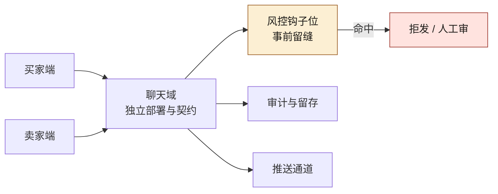
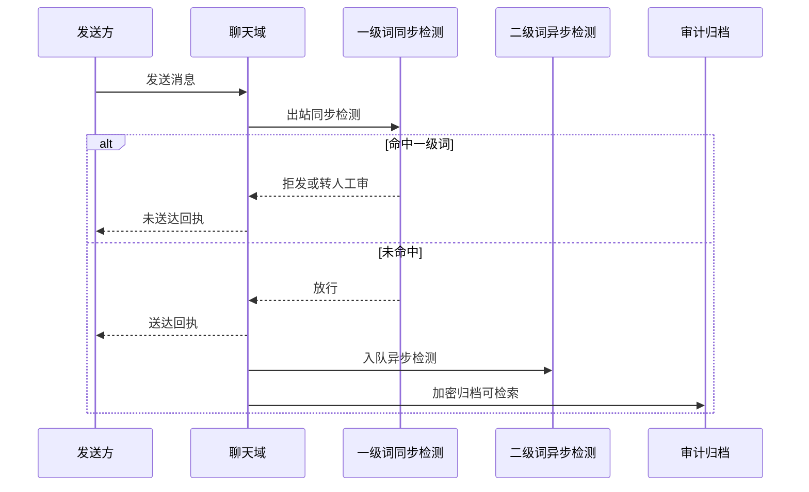
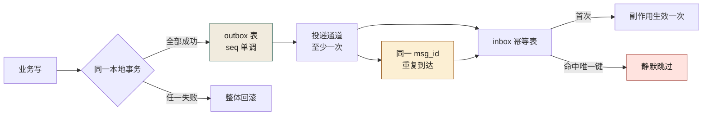
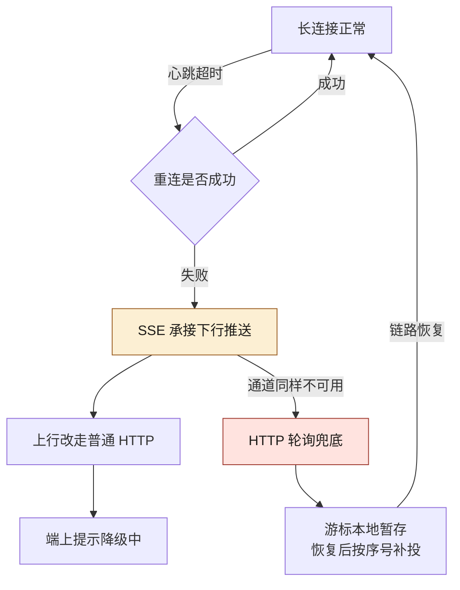
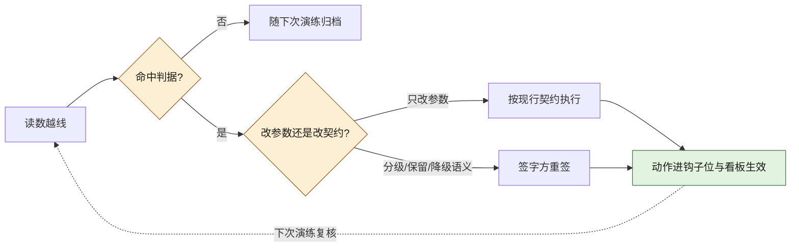

# 第 16 章 聊天功能：独立领域、WebSocket、推送与风控

> **本章定位**：当一个业务新增"用户间即时通讯"这类实时通信功能时，如何把它当成独立域来设计，而不是塞进某个已有域当子功能。
> **核心命题**：聊天域天然挂着风控、合规、审计、降级、跨端一致性——这些非功能约束不在需求文档里，必须由人在 AI 动手之前先画好边界与留缝。
> **本章的 AI 失灵点**：AI 生成的聊天功能默认不带敏感词过滤（它不知道这是业务约束）。
> **本章的人介入点**：聊天域独立、契约先行、风控钩子位强制留缝（呼应第 11 章）。

<figure class="chapter-plate">
  
  <figcaption>题图 · 桁架：新功能必须落在既有的承重结构上</figcaption>
</figure>



**图 16-1｜聊天独立成域** — 风控钩子必须事前留缝；事后补过滤等于把合规当成上线后体检。

---

## 16.1 问题：AI 生成的聊天功能，唯独没有敏感词过滤

业务方提了一个新需求：买家和卖家可以在交易过程中直接聊天。这个需求看起来简单——不就是一个聊天室嘛。

一线工程师让 AI 生成了一版完整的聊天功能：WebSocket 连接、消息收发、在线状态、消息存储。从代码角度看，功能完整、能跑、体验流畅。

**然后风控负责人和合规负责人一起把这版代码否了。**

风控负责人的否决理由："这个聊天功能没有任何敏感词过滤。买家卖家在里面聊'加我微信线下交易'怎么办？聊欺诈话术怎么办？聊违规商品怎么办？" 合规负责人的否决理由："聊天内容是用户数据，存储和审计的合规边界在哪里？AI 生成的这版代码，消息直接明文入库，没有审计接口。"

一线工程师委屈地说："需求文档里只写了'买家卖家可以聊天'，并没有说要加这些。"

**这就是第 11 章"留缝"在新功能上的直接体现。** AI 生成聊天功能时，它的目标函数是"让聊天能跑"，不是"让聊天安全合规"。它不知道这个聊天域背后挂着风控、合规、审计三重约束——因为这些约束不在需求文档里，在组织的隐性知识里，而隐性知识从来不会被自动喂给 AI。

图 16-1 把这三重约束摊开在买卖两端之下：聊天域有三个并列出口——风控钩子位、审计与留存、推送通道，而全图唯一带条件的分支挂在钩子位的"命中"上，拒发/人工审都在那条分支的下游。缝不在骨架里预留，这条分支事后根本补不进去。

---

## 16.2 根因：新功能没有"域"的意识，也没有"非功能需求"的意识

**① 聊天没有被当成一个独立的业务域。** 一线把它当成交易域的一个子功能，塞进了交易域的代码里。但聊天有自己的生命周期、自己的一致性要求（消息顺序、已读状态）、自己的合规约束（内容审计）。**它不是一个子功能，它是一个域。**

**② 非功能需求没有写在需求里。** "聊天要能跑"是功能需求；"聊天内容要过敏感词、要可审计、要能降级"是非功能需求。**AI 只读到了功能需求，因为非功能需求散在风控手册、合规手册、SRE 的运维规范里——它们从来没被整合进 AI 能看到的上下文。**

**③ AI 生成新功能时，不会主动"留缝"。** 第 11 章讲过：AI 的天性是贴着当前需求生成最短路径。它不会主动想"这个聊天域未来要接风控、接审计、接推送降级"——除非有人在生成前就把这些缝定义好。

---

## 16.3 AI 用法：先画域的边界和缝，再让 AI 填充

正确的顺序：

```
人定义（生成前）：
  1. 聊天是独立域 → 独立仓库、独立契约、独立部署
  2. 风控钩子位 → 每条消息发出前必须过敏感词接口
  3. 审计接口 → 所有消息可被审计系统检索
  4. 降级方案 → WebSocket 断开时降级为 HTTP 轮询
  5. 推送策略 → 离线消息通过推送送达

AI 执行（在上述约束内）：
  生成聊天域的代码骨架和实现
```

**关键差异在于：人在 AI 动手之前，就把"这个域必须留的缝"定义好了。** 这样 AI 不是在"生成一个聊天功能"，而是在"填充一个已经留好缝的聊天域骨架"。

---

## 16.4 角色博弈：聊天域的 Owner 和风控接入

**冲突一 · 聊天域归谁？** 交易域负责人说聊天是交易的子功能，归他。增长域负责人说聊天是用户留存工具，归他。最后治理组裁定：**聊天是独立域**，因为它的合规约束和生命周期与交易/增长都不同。**两位都没拿到，都不满，但都能理解。**

**冲突二 · 风控接入的力度。** 风控负责人要求"每条消息实时过敏感词"，但这会增加 50-100ms 延迟。聊天体验团队反对——"聊天延迟超过 200ms 用户就会觉得卡。"

最后妥协：**敏感词分两级——一级词（违法违规）实时拦截（可接受 100ms 延迟），二级词（营销导流）异步检测（不影响延迟但事后追溯）。** 风控负责人保住了对一级词的实时控制，聊天体验团队保住了延迟在可接受范围内。

这条「分级」落到消息出站的链路上，就是每条消息发出前必经的一道闸：



**图 16-2｜消息出站的两级检测** — 一级词同步拦住违法违规，二级词异步追溯营销导流；分级是「拦得住」与「聊得顺」之间唯一的折中。

图 16-2 的关键在读回执的时机：命中一级词时发送方拿到的是"未送达回执"，拦在送达之前；放行之后，二级词入队与加密归档都发生在送达回执之后——延迟预算只花在那一步同步检测上。

**冲突三 · 聊天内容保留多久。** 合规负责人要求聊天内容保留 90 天供审计。业务方说"聊天是私密内容，保留太久用户会有隐私顾虑"。最后定 30 天在线、90 天审计归档（加密），过了 90 天彻底删除。**合规负责人让了"在线保留"的时长，业务方让了"审计归档"的存在。**

---

## 16.5 产出物：聊天域契约 + 风控接入标准

1. **聊天域契约**：WebSocket 协议、消息格式（含消息类型、敏感词标记位）、已读/撤回的语义定义。
2. **风控接入标准**：一级词实时接口（<100ms）、二级词异步队列、审计检索接口。

> **代价声明**：风控接入让聊天消息的平均延迟从 30ms（纯转发）涨到了 95ms（含一级敏感词检测）。**体验团队最初无法接受，但风控负责人的一句话终结了争论："聊天里出了欺诈，用户不会找你聊天团队，会找我风控。"**

### 落地步骤：聊天域从立项到上线

把 16.3 的「先画缝、再生成」展开成可照抄的顺序，每一步都有责任人：

1. **域判据评审**：独立生命周期、独立合规约束、独立一致性要求，三条中两条成立即独立成域，结论写成 RFC。
2. **定 Owner**：聊天域 TL 一名；风控、合规、SRE 的接手点写进介入点矩阵（见本节末）。
3. **契约先行**：消息格式（含敏感词标记位）、已读与撤回语义、WebSocket 协议先入契约仓库，签字后 AI 才能动手。
4. **骨架留缝**：风控钩子位、审计接口、降级开关写进骨架接口；骨架评审通过，才允许 AI 填充实现。
5. **AI 填充**：消息收发、在线状态、存储在骨架约束内生成，生成物带 prompt 留痕进 PR。
6. **风控联调**：一级词实时接口、二级词异步队列、审计检索接口分别联调，各留一份联调记录。
7. **降级演练**：人为断开 WebSocket，验证 HTTP 轮询降级与离线推送路径，演练记录归档。
8. **门禁放行**：走第 19 章五层门禁；即使适用性判定为与资金无关，也要留判定记录。
9. **度量接入**：延迟、拦截、留痕三块指标进监控，口径见下表。

### 可抄骨架：出站风控钩子位

```typescript
// 聊天域出站中间件：风控钩子位是「留缝」的落地形态
// 为什么骨架必须人写：钩子位一旦交给生成代码「顺手实现」，合规就退回事后体检
type Verdict = 'BLOCK' | 'REVIEW' | 'PASS'

async function outboundGuard(msg: ChatMessage): Promise<Verdict> {
  // 一级词同步检测：违法违规内容必须拦在送达之前
  const l1 = await riskClient.checkSync(msg.text)
  if (l1.hit) return l1.severe ? 'BLOCK' : 'REVIEW'
  // 二级词只入异步队列：营销导流类不牺牲聊天延迟，事后可追溯
  await riskQueue.enqueue({ messageId: msg.id })
  // 审计归档加密存储，检索接口只对审计系统开放（冲突三的结论）
  await auditArchive.saveEncrypted(msg)
  return 'PASS'
}
```

`riskClient`、`riskQueue`、`auditArchive` 都是注入的边界依赖；`REVIEW` 的处置策略表由风控负责人维护，聊天域无权改。

### 度量指标：聊天域的三块仪表盘

| 指标 | 怎么测 | 起步阈值 | 谁看 | 多久看一次 |
|---|---|---|---|---|
| 出站延迟 P95 | 发送到回执的端到端打点 | 超出两级方案的延迟预算即告警 | 聊天域 TL | 每日 |
| 一级词拦截量 | 钩子位打点，按词类分组 | 突增即告警——话术在变异 | 风控 | 每日 |
| 二级词处置闭环 | 异步队列从积压到处置的时长 | 有积压即告警 | 风控 | 每周 |
| 审计检索可用性 | 对审计接口定时拨测 | 失败即告警 | 合规 | 每日 |
| 降级演练新鲜度 | 演练记录归档时间 | 大促前必须有新鲜记录 | SRE | 每个大促前 |

### 演练剧本：WebSocket 断链降级

每月一次、大促前必做，SRE 主导，聊天域 TL 在场：

1. 预发环境断开 WebSocket 网关，观察端上是否自动切换 HTTP 轮询。
2. 验证轮询的进入与退出：连接恢复后是否及时切回长连接，避免轮询 QPS 滞留。
3. 制造一条离线消息，验证推送通道送达与端上提醒。
4. 记录切换时长、消息丢失与恢复时长，归档为演练记录。
5. 任一项失败即红项，上线检查清单不放行。

### 介入点矩阵：聊天域谁在哪儿接手

| 节点 | 谁接手 | 动作 |
|---|---|---|
| 域判据评审 | 治理组 | 裁定独立成域或并入既有域 |
| 契约定稿 | 聊天域 TL | 签字入契约仓库，解锁 AI 生成 |
| 敏感词分级 | 风控负责人 | 定一级与二级词表及处置策略 |
| 保留时长 | 合规负责人 | 定在线与审计归档期限 |
| 降级演练验收 | SRE | 出演练记录，未演练不放行 |
| 上线放行 | 聊天域 TL | 五层门禁全过后解锁发布 |

### 通道选型：WebSocket 帧、心跳与背压 vs SSE

上面的钩子位、介入点矩阵与演练剧本都回答了"谁在哪儿接手"；还剩一格也必须人在 AI 动手之前定死：**消息走哪条通道出去，这条通道不健康时退到哪条**。这一格几乎不含业务语义，却直接决定 16.4 那条延迟预算花得值不值。

组织需要这张对照表的理由很直白：让 AI 写聊天，它默认只会写 WebSocket——它见过的聊天教程几乎全是 WebSocket。而"这个场景其实一条下行推送就够"是人的判断，判错了的代价是多养一套双向连接管理代码，还多一批没人测过的重连分支。

| 维度 | WebSocket | SSE |
|---|---|---|
| 方向 | 同一连接双向：上下行共用一条 TCP | 只下行：推送走这条连接，上行另发普通 HTTP 请求 |
| 分帧 | 控制帧与数据帧分离，文本、二进制、关闭、心跳请求、心跳应答各占一类操作码 | 纯文本事件流按行分帧，字段只有 `data`、`event`、`id`、`retry` 四个 |
| 断线重连 | 全在应用层：自己记游标、自己退避、自己补洞 | 浏览器原生：自动带 `Last-Event-ID` 重连，服务端据此从断点补发 |
| 心跳 | 应用层心跳控制帧，两端都要写代码，也要两端各设超时 | 没有专门心跳帧，靠周期性下发注释行保活 |
| 背压 | 写缓冲有可见读数，缓冲持续增长说明对端消费不动，需要预先定好丢弃或断开策略 | 受 HTTP 响应体写入约束，同样要自己判缓冲，但没有双向帧可协商 |
| 链路与鉴权 | 需要协议升级，链路上每一跳都得支持；凭证只在握手那一次带上 | 就是一条普通 HTTP 响应，网关、缓存、鉴权中间件都认得它 |
| 该选它的场景 | 双向且密集：输入中状态、协同光标、低延迟上下行 | 单向推送为主：新消息提醒、已读状态同步、审计事件流 |

这张表按协议自身的语义写，属 B 档口径（帧类别、字段名、重连行为都出自规范本身，本仓库没有实测过长连接）。**两个数字要显式留白**：心跳周期与写缓冲上限的默认值随所选服务端库及其版本而变，本机没有装任何 WebSocket 库，所以本书不写"默认是多少"，只写一条可核对的纪律——**这两个数要进聊天域契约，不许留在库的默认值里**；换库那天，它就是兼容性评审的对象。

这条选型什么时候会静默失效：链路上只要有一个不认识协议升级的中间代理，WebSocket 不会报错，只会一直停在"连接中"。**用户看到的是消息收不到，监控看到的是错误率为零**——两侧都不报警的故障最难发现。所以下面那条降级链不是可选项，它必须与选型同一次定稿。

### 消息顺序与 outbox：把至少一次投递收敛成只生效一次

会话域最容易出问题的是顺序。**消息在传输层没有顺序保证**：多实例生产、失败重试、跨节点转发，任何一环都能让后发的消息先到。而聊天是顺序敏感的域——撤回指令跑到被撤回的消息前面，界面上就出现"先撤回、后到达"。

第二重约束来自投递语义：可靠投递通道（本地 outbox 加队列、Streams 消费组、分区日志）给出的承诺基本都是**至少一次**——不丢，但会重。于是"顺序"与"只生效一次"这两件事得自己搭，搭法只有一个名字：**outbox 模式**。写侧把业务变更与待发消息放在同一个本地事务里提交，读侧按单调序号消费、以幂等键去重。

为什么这件事必须人定：AI 写聊天时，"发送成功"通常等于"函数返回了"。它不会主动在一个事务里同时落业务表与消息表——需求文档没写这一条，而这一条恰恰是"消息不丢"的全部根据。

下面这个最小例是本机实跑（Python 3.14.4，只用标准库 `asyncio` + `sqlite3`，无外部依赖），刻意把投递做得又重复又乱序，看顺序和幂等这两条各自靠什么站住：

```python
import asyncio, sqlite3, random
DB = sqlite3.connect(":memory:", check_same_thread=False)
DB.executescript("""
  CREATE TABLE outbox(seq INTEGER PRIMARY KEY AUTOINCREMENT, msg_id TEXT UNIQUE, body TEXT);
  CREATE TABLE inbox(msg_id TEXT PRIMARY KEY);
  CREATE TABLE effect(msg_id TEXT);
""")

async def publish(conv, text):
    def tx():
        # 业务写与 outbox 写同一个事务：要么都落、要么都不落，丢失与乱序出不了这个提交点
        DB.execute("INSERT INTO outbox(msg_id, body) VALUES(?,?)", (f"{conv}:{text}", text))
        DB.commit()
    await asyncio.to_thread(tx)

def apply_once(msg_id, body):
    # 幂等键 = msg_id；命中唯一约束时 rowcount 为 0，副作用一次都不执行
    c = DB.execute("INSERT OR IGNORE INTO inbox(msg_id) VALUES(?)", (msg_id,))
    if c.rowcount == 0: return "DUP-SKIP"
    DB.execute("INSERT INTO effect VALUES(?)", (body,)); DB.commit()
    return "APPLIED"

async def deliver(rows):
    bag = list(rows) + random.sample(rows, 2)     # 制造重复投递
    random.shuffle(bag)                           # 制造乱序到达
    log = []
    for seq, msg_id, body in sorted(bag, key=lambda r: r[0]):   # 消费端按 seq 重排
        log.append((seq, msg_id, await asyncio.to_thread(apply_once, msg_id, body)))
    return log

async def main():
    random.seed(7)
    for i in range(5): await publish("conv-1", f"m{i}")
    rows = DB.execute("SELECT seq, msg_id, body FROM outbox ORDER BY seq").fetchall()
    for seq, msg_id, r in await deliver(rows): print(f"seq={seq} msg={msg_id} -> {r}")
    eff = [m for (m,) in DB.execute("SELECT msg_id FROM effect ORDER BY rowid")]
    print("生效序列：", eff)
    print("outbox/inbox/effect 行数：",
          *(DB.execute(f"SELECT count(*) FROM {t}").fetchone()[0] for t in ("outbox","inbox","effect")))
    print("生效序列是否与 seq 顺序一致：", eff == [b for _,_,b in rows])

asyncio.run(main())
```

真实 stdout（本机实跑，Python 3.14.4）：

```text
seq=1 msg=conv-1:m0 -> APPLIED
seq=2 msg=conv-1:m1 -> APPLIED
seq=2 msg=conv-1:m1 -> DUP-SKIP
seq=3 msg=conv-1:m2 -> APPLIED
seq=3 msg=conv-1:m2 -> DUP-SKIP
seq=4 msg=conv-1:m3 -> APPLIED
seq=5 msg=conv-1:m4 -> APPLIED
生效序列： ['m0', 'm1', 'm2', 'm3', 'm4']
outbox/inbox/effect 行数： 5 5 5
生效序列是否与 seq 顺序一致： True
```

这段读数里三件事各自独立，缺一不可：

- **顺序靠 seq，不靠到达顺序**。投递袋被故意打乱过，消费端按 `seq` 排序重放，于是生效序列与 outbox 声明的顺序逐字相同——也就是最后那行的 `True`。
- **只生效一次靠唯一键**，而不是靠"应该不会重复吧"。`m1` 与 `m2` 各到达两次，第二次被 `INSERT OR IGNORE` 挡在 `inbox` 表外，副作用一次都没多做，`effect` 表才与 `outbox` 表同为 5 行。
- **两者不能互相顶替**。只去重不排序，会得到"先到先生效"的乱序；只排序不去重，重复投递会把同一条消息的作用做两遍（重复计数、重复推送、重复扣减）。

图 16-3 是这条回路的形状，注意两处分叉各自挡什么：



**图 16-3｜outbox 加 inbox：顺序与幂等各挡一半** — 同事务保证不漏，序号重排保证不乱，唯一键保证重复不生效；缺任一段，界面上就会留下"撤回先于消息"或"一条消息两遍副作用"。

**这套机制的静默失效面**（写进契约仓 README，别只写在代码注释里）：

- `seq` 要"每会话单调"。全局自增序号会让多会话互相阻塞，本例单会话是简化，生产要按会话分片取号。
- 幂等键要有生命周期。`inbox` 永久增长会拖慢写入，但保留窗口短于最大重放窗口时，重复消息就会重新生效。**这个窗口是多长，是存储成本与合规追溯之间的一次签字，不是技术单方面能定的**——与 16.4 冲突三同类。
- outbox 只保证"进了库"，不保证"投出去"。投递进程崩溃后靠游标续投，所以游标本身也要落库；放在内存里，就等于把不丢消息的承诺寄托在进程不死上。

### 投递语义：Streams 消费组在至少一次下如何做幂等

上一节的 outbox 是"写侧 + 消费侧"的抽象；落到具体中间件，消费组是最常见的那一种。这里按规范写口径，属 B 档：**本机没有装 `redis-cli`，本节不给任何命令读数，也不声称跑过**；参数名与默认值一律以你所连实例的帮助输出与官方文档为准。

消费组的语义链条，每一条都能对回上面那个最小例：

| 规范里的概念 | 语义 | 对应最小例的哪一块 |
|---|---|---|
| 流内条目 ID（毫秒加序号的形状） | 单流内单调，可直接当顺序游标 | `seq` |
| 消费者组与组内游标 | 同组各消费者拿到互不重叠的新条目 | 消费端进度 |
| 表示"从此刻起"的特殊 ID | 只读新条目，不回放历史 | 首连时起点怎么选 |
| 确认后才移出待确认集合 | 未确认的条目留在待确认列表里，会被重新投递 | 至少一次之所以"会重" |
| 条目的投递计数 | 每重投一次自增，可据此判毒消息 | 需要人定的重试上限 |
| 显式裁剪与按容量近似裁剪 | 流不会无限增长，代价是最老的条目先没了 | outbox 与 inbox 的保留窗口 |

**至少一次下做幂等只有一个答案：幂等键放在消费侧，且键要能被重放出来。** 去重位放在生产侧没有意义——重投恰恰是"生产侧以为没送到"才发生的。工程上通常二选一：

- **业务键去重**：像最小例那样，用会话加客户端消息 ID 当唯一键，去重表与副作用表同事务写。这条最稳，因为它不依赖中间件的确认语义。
- **游标去重**：每个消费者只持久化"已生效的最大条目 ID"，低于它的一律跳过。省一张表，但只在同会话严格串行消费时成立；一旦并发，游标会漏。

再补一条最容易写反的顺序：**确认要在副作用提交之后再打**。先确认再处理，崩在中间就是永久丢消息；先处理再确认，崩在中间就是重复处理，于是又绕回上面那条幂等键。这两句话是同一个取舍的一体两面，必须一次定死，不能留给实现者"顺手写"。至于毒消息（重投到上限仍然失败），要有明确去处：落死信表并告警——把它留在待确认集合里等于埋雷，顺序消费会被它一直挡着。

**这一格替代不了什么**：确认机制挡的是投递丢失，挡不住业务处理失败，也挡不住"消息送达但已被撤回"这类语义竞态。后者仍然要靠 16.5 契约里的消息类型与状态位，那是语义判断，机器的位点管不着。

### 降级链路：长连接不健康时往哪儿退

16.5 的演练剧本第 1 步要求"观察端上是否自动切换"。**自动这两个字要有定义**，否则各端各写一套重试逻辑，就又回到第 17 章讲的那种多份拼接逻辑无人负责的处境。降级链的判据要写进契约，形状见下图：



**图 16-4｜聊天通道的降级链** — 每一跳的进入条件与回切条件都进契约；游标本地暂存是"降级不丢消息"的唯一凭据，回切全靠它按序号补投。

三条纪律，都是从图 16-4 那三个出口读出来的：

- **降级要成对**：有进入条件就必须有退出条件，否则流量切出去就不回来，轮询的请求量会长期滞留在网关上——演练剧本第 2 步测的正是这个。
- **降级不许改语义**：换通道只能换"怎么送到"，不能换"送到几次、什么顺序"。图 16-3 那套序号加幂等键必须在三条通道上都成立，否则降级一次就丢一批。
- **降级要留痕**：切换事件写进审计流，与 16.4 冲突三的归档同源。事后复盘要能回答"这段时间哪些消息走了轮询"，答不出就等于给第 21 章的对账留了一道补不回来的洞。

这条链在什么规模下开始不划算，就是 16.9 第一条遗留问题：轮询兜底的请求量与在线人数成正比，具体阈值与成本留给[第 18 章](./ch23-第18章-亿级流量.md)；跨端已读一致性则留给[第 17 章](./ch22-第17章-多端BFF.md)。

---

## 16.5b 生效证据清点：这些聊天机制各自挂着哪份产物

16.5 把机制从钩子位一直造到降级链，还配了三块仪表盘。但"写了"和"生效过"是两件事，第 18 章的 18.6h 已给出通例：每条防线只有三种状态——有产物、产物可造假、无产物。本节把聊天机制逐条翻成证据面，证据条目全部是本章已写明的产物（联调记录、演练记录、拨测、仪表盘、本机实跑 stdout），表内不新增任何读数，每个出处标回本节小节号。

| 机制（出处） | 生效证据（本章产物） | 三态 | 这条证据怎么读 | 没有产物时退回什么样子 |
|---|---|---|---|---|
| 出站两级检测（冲突二，可抄骨架） | 一级接口、二级队列、审计检索三份联调记录（落地步骤第 6 步） | 有产物 | 记录里有没有出现过一次"未送达回执"（图 16-2 命中支）——只走过"无命中"的联调，证明的是放行路径通了，不是闸存在 | 钩子位退成类型声明：拦截能力等于"应该拦得住"，第 16.1 节那版被否的代码换壳复活 |
| 独立成域的裁定（冲突一、落地步骤第 1 步） | 一份 RFC：三条判据（独立生命周期、独立合规约束、独立一致性要求）中两条成立即独立 | 有产物 | 判据要逐条有依据地打钩，不是只留结论——两位负责人都没拿到、都能理解的前提，是裁定过程落了件 | 域归属退回嗓门大小；下一个想收编聊天的域出现时，冲突一整套角色博弈重演一遍 |
| 消息顺序与幂等（outbox 一节） | 一段本机实跑 stdout：五遍重放乱序，生效序列与声明顺序一致 | 产物可造假 | 实跑是固定种子、单会话、内存表；生产按会话分片取号（静默失效面第一条）之后，这条判据若没再跑过，就是一张只在开发机绿着的顺序测试 | 顺序退回"到达即生效"——撤回先于消息的竞态重新可能出现 |
| 降级切换（图 16-4） | 每月一份演练记录，含切换时长、消息丢失、恢复时长三个值（演练剧本第 4 步） | 有产物 | 三个值逐次对比：值恒定不变说明抄板；剧本只主动断网关，记录里永远没有心跳超时分支，说明覆盖不全 | 剧本第 5 步写死"任一项失败即红项不放行"——没有记录，这条红项规则本身成了摆设 |
| 真实断连下的重连语义（图 16-4 心跳超时进边） | 无——演练主动断开网关，从不制造丢包、弱网与不认识协议升级的代理挂起（通道选型一节） | 无产物 | 这是本章特有的暗面：降级入口的第一条边只在真实断连下才被走过，而断连从没被真实造过 | "自动切换"只剩字面意思，端上各写一套重试逻辑，回到第 17 章讲过的无人负责的拼接 |
| 通道选型与两个留白数（通道选型一节） | 一条纪律：心跳周期与写缓冲上限要进聊天域契约，不许留在库默认值里 | 无产物 | 纪律落没落地，只看契约仓库里有没有这两个字段；本节明说过本仓库没实测过长连接，所以选型判断本身也只有规范背书 | 选型退回"AI 默认写 WebSocket"；代理不认识升级时，用户看消息收不到、监控看错误率为零 |
| 审计保留与删除（冲突三） | 审计检索每日拨测（度量表第四行，失败即告警） | 产物可造假 | 拨测查"可检索"不等于查"保留期满"：若只检索近期热窗口，30 天在线与 90 天归档那道边界从没被探过，误删与超存两种违约都看不见 | "过了 90 天彻底删除"退成配置文件里两个没人对账的数字 |
| 契约先行与生成留痕（落地步骤第 3、5 步） | 契约仓库签字记录 + 带 prompt 留痕的 PR | 产物可造假 | 比时间戳：契约签字必须早于第一份生成 PR——顺序反了，"先画缝再生成"就退成先上车后补票 | AI 先生成、契约后追认，16.3 的顺序整个倒过来，钩子位由实现者顺手定义 |
| 离线消息推送与补拉（16.3 第 5 项、剧本第 3 步、图 16-4 暂存节点） | 演练里"制造一条离线消息验证送达"这一项，落在演练记录 | 产物可造假 | 一条人造消息送达，只证明通路在；断连期间积压大批消息、恢复后按游标整批补拉这条路径从没被量过 | "降级不丢消息"退成图注里的口号，丢的那批要到用户投诉才显形 |
| 撤回与已读的语义竞态（16.5 产出物第 1 项、投递语义一节） | 契约定义了撤回与已读语义；对"送达但已被撤回"这条竞态，本章没有任何测试产物 | 无产物 | 确认机制挡投递丢失、挡不住语义竞态是那一节的原话——契约有字段，没有一条"撤回指令先到"的样本用例 | 界面上重新出现"先撤回、后到达"——顺序一节开头点名的第一个竞态没人拦 |
| 上线放行与适用性判定（落地步骤第 8 步） | 一份门禁判定记录 | 产物可造假 | 记录要指名介入点矩阵里的接手人，不能只有"与资金无关"的结论——判例可以被被放行方自己写 | 五层门禁退成走过场，事后补合规正是图 16-1 题注警告的那种上线后体检 |

表里两格要单独点名，因为它们是聊天功能特有的暗面：重连语义那行是"无产物"——演练只主动断网关，图 16-4 从"心跳超时"进来的那条边从没在真实断连下走过；顺序实跑那行是"产物可造假"的标本——五遍重放全对，但它绿在固定种子、单会话、内存表上，生产形状（分片取号、多会话并发）一次都没穿过这道闸。

三态里最刺眼的不是"无产物"，是"产物可造假"：本章开篇那版被风控和合规一起否掉的代码，演示完整、能跑、体验流畅——它的证据面全绿，缺的恰恰是整张表最后两列。这就是为什么"这条证据怎么读"和"退回什么样子"两列不能省：没有前两列，清点退成产物堆砌；没有后两列，没人记得不挂证据的代价长什么样。第 16.1 节的病在功能演示里看不出来，只在这张表上看得出来——一条机制若连"怎么读"都答不出，它和没写等价。

---

## 16.5c 决策点表：哪条读数越线触发哪次上会、谁拍、多久复核

图 16-4 的降级链管自动跳档，度量表管谁盯看板；剩下半段是自动动作之上必须有人拍板的那部分。读数全部现成：度量表五行的阈值语言、代价声明的两个口径（30ms 与 95ms）、冲突二的预算与体验线（100ms 与 200ms）、冲突三的两扇保留窗（30 天与 90 天）、静默失效面第二条的两窗错身。签署方全部沿用本章已出场角色——聊天域 TL、风控负责人、合规负责人、SRE、业务方、聊天体验团队、治理组，16.4 与 16.5 里出现过的这七个名字就是本表的签署全集。削峰与容量侧的决策点表见第 18 章 18.6i，那张管流量形状，这张管语义形状，不重复。

| 读数（出处） | 上会判据（什么形状算越线） | 触发后的动作 | 签署方 | 时限锚 |
|---|---|---|---|---|
| 出站延迟 P95（度量表第一行） | 从 95ms（代价声明实称）向 200ms（冲突二体验线）爬升，且逼近 100ms（风控接入标准的接口预算）那一周二级队列同时有积压——两条线一起收紧＝分级方案的容量不够了 | 复审一级词命中范围（是不是词表把词放错了级），不许直接关同步检测——关了即反模式四 | 风控负责人动词表分级，聊天体验团队确认新延迟可接受，聊天域 TL 签字 | 每日读数，越线进当周例会 |
| 一级词拦截量（度量表第二行） | 突增告警响（原文：话术在变异），且命中集中在少数新词类 | 新词类走介入点矩阵"敏感词分级"那一行重签；词库更新机制没落地前（16.9 第三条），告警只能落到"重签现有两级"为止 | 风控负责人（矩阵里这一行的专属签字人） | 每日 |
| 二级词处置闭环时长（度量表第三行） | 周评审后积压仍不归零——评完不降的积压不是容量问题，是处置停摆 | 核处置策略表与毒消息去处：投毒上限、死信表加告警回写契约（投递语义一节的原话） | 风控负责人执行，合规负责人核追溯链完整 | 每周 |
| 演练新鲜度与红项（度量表第五行、剧本第 5 步） | 三种形状任一：三个时长缺一值；距上次演练超过一个月；大促前无新鲜记录 | 不放行；连续两次不放行升级到治理组——本章唯一当过裁定人的桌子（冲突一） | SRE 出记录，聊天域 TL 执行不放行，升档由治理组接 | 每月一次、大促前必做 |
| 保留窗与重放窗（静默失效面第二条） | 两窗改动记录不成对出现——新增离线补拉通道让重放窗变长，而 `inbox` 保留窗没上同一张评审桌 | 存储成本与合规追溯重签一次（与冲突三同流程）；已入 `inbox` 的消息重新生效按红项处理 | 合规负责人与聊天域 TL 会签（原文：不是技术单方面能定的） | 每次通道或客户端方案变更 |
| 审计拨测失败（度量表第四行） | 连续两次失败，或一次失败恰好落在降级留痕时段内——那些消息走过轮询，正是最需要审计答得出的时候（降级纪律第三条） | 按图 16-4 游标暂存清点该时段消息、逐条对账补洞（对账口径给第 21 章） | 合规负责人验收，SRE 提供切换事件流 | 每日拨测，失败当日进会 |

五列咬合，缺一个就复发本章写过的病：有读数没判据，"实时拦截"退成值班手感，而冲突二的整场争论就是在两个数字上谈的，不是在感觉上谈的；有判据没动作，仪表盘烂成一墙灯——度量表写"突增即告警"，若没人对被这句话接住，响了也白响；有动作没签署方，敏感词分级的权力回到代码仓，骨架末行那句"聊天域无权改"成空话；有签署方没时限，契约停在签字那天，而话术、通道、端型早换了一轮。图 16-4 里没写任何"当天临场决定"的边——前提是每次跳档升级给人之前，触发形状已经写死。这条链画成图 16-5：



**图 16-5｜聊天风控决策链：从读数越线到动作生效** — 岔口只提前登记形状：改参数不惊动签字方，改契约必须回到介入点矩阵重签；底部回边让今天的签字成为下次演练的被测对象。

读图 16-5 盯三处。两个菱形之前的"否"分支都不拦事——没命中判据就随下次演练安静归档、契约没动就按现单执行，风控决策的提速全靠这两个不拦；中间那个黄菱形是全图唯一先分形状再走的岔口——"只改参数"沿用冲突二签过的分级方案，"改契约"（词分级、保留窗、降级语义）必须回到介入点矩阵对应行重签。这条岔口防的就是"用调参的名义改契约"：把一级词挪进异步队列，在对端看是一行配置，实际上是反模式四的处置；底部回边不产生新动作——签完生效的动作，下次演练还要再量一遍，环上没有终点站。它与第 18 章图 18-5 的差别只在回边锚点：那张用"复跑压测"复核，这张只能用"复跑演练"，因为 16.9 承认百万级并发没有压测读数——环的锚由本章证据清点的厚度决定，这正是 16.5b 与这张表互锁的地方。

---

## 16.5d 腐烂判据：这套机制自己烂掉之前，先出现的是什么形状

机制造齐、证据清点完、判据上了会，最后一问最不留情：这整套会不会烂。聊天域的腐烂不是塌方，是"还在跑、还在响、还全绿"。量尺沿用第 18 章 18.6j 的形状——每条防线一条信号，信号没有一条是事故本身；本章换的是证据面：六条信号各自点名它依赖的本章产物。

1. **检测层——联调记录里只有"无命中"样本。** 落地步骤第 6 步归档三份联调记录；若三份都只有放行支读数、从未有一条"未送达回执"，图 16-2 的命中支就是上线以来没真正走过。分辨法：拿一级拦截量看板对——看板有值而记录无例，记录造假；看板恒零且话术在变异，钩子位是摆设。依赖产物：联调记录、拦截量看板。
2. **顺序层——那段 stdout 再没重跑过。** 本机实跑是固定种子、单会话、内存表，静默失效面写明了生产要按会话分片取号；分片上线后"生效序列是否与声明一致"若没在新形状上重跑，这条判据就烂了——绿得永远不会红的灯，是记忆不是测试。依赖产物：实跑 stdout、静默失效面清单。
3. **降级层——演练三个时长月月相同。** 主动断网关是可复制的，真实丢包和代理挂起（连接停在"连接中"、错误率为零那种形状）演练复制不出来；三个值逐月一字不差就是抄板。再加一个盯点：轮询退出只被"看它变低"过，没有任何曲线归档——QPS 滞留有没有发生，其实没人知道。依赖产物：演练记录、降级留痕审计流。
4. **保留层——拨测只查热窗口。** 审计拨测若永远只检索最近消息，30 天在线与 90 天归档那道边界（冲突三）从没被探过：误删只在追溯那天显形，超存只在隐私审计时显形，两种违约在日拨测里都是绿的。删除作业要拿归档边界两侧的样本来证明生效。依赖产物：拨测记录、在线与归档两窗配置。
5. **治理层——不放行从没发生过。** 剧本第 5 步与介入点矩阵把"未演练不放行"写死了；若聊天域上线以来这条规则从没真的拦下任何一次发布，两种解释：要么演练全绿，要么有人把红项改成了黄项。翻一遍放行记录看被拦次数即可，不用新看板。依赖产物：介入点矩阵、放行记录。
6. **契约层——两个留白字段一直没人回填。** 通道选型一节把"心跳周期与写缓冲上限要进聊天域契约"立成可核对的纪律，并写明换库那天它们就是兼容性评审的对象；若契约仓库里这两个字段至今空着，腐烂的形状不是填错，是没人再问"这条纪律该谁、在哪一天交卷"。依赖产物：聊天域契约的两个留白字段。

### 反事实的形状：把本章点过名的事故形状放回判据桌

| 那次的形状（出处） | 若有判据，桌上先看到的 | 现在该做的动作 |
|---|---|---|
| 案例一·电商：线下导流与欺诈话术（16.1 风控否决理由） | 拦截量看板有值、二级处置闭环周评后不归零——导流话术进了异步队列而处置停摆，"事后追溯"变"事后无动作" | 词类进重签（冲突二那行签字）；词库更新机制不落地，告警永远追不上话术（16.9 第三条） |
| 案例二·交易所：反洗钱话术追溯（16.6 映射） | 审计检索日日绿，第一次跨归档边界追溯就查空——信号 4 的"热窗口"形状当场显形 | 拨测纳入边界样本：每次定时探测查一条早于在线窗、落在归档窗的记录 |
| 案例三·量化告警：关键告警必达（16.6 映射） | 条目投递计数持续上涨并进死信表，而毒消息告警没人接——"必达"三个字从没进契约，只活在案例表里 | 重试上限进契约并指名接收方（投递语义一节：死信落表加告警是毒消息唯一去处） |
| 案例四·安全初创：敏感样本脱敏（16.6 映射） | 骨架里 `auditArchive.saveEncrypted` 被生成代码顺手改成普通保存——评审拦得住 diff，拦不住三份联调记录里本来就没有加密与检索列的验证条目 | 审计拨测加一列：检索结果可见性本身就是被拨测对象 |
| 本族先病·端上各写一套重试（降级链路一节借第 17 章点名的形状） | 一次弱网断连后各端重试节奏不一、消息列表两端对不齐——这就是 16.5b"重连语义无产物"那行预警的现场版 | 把"自动"的定义（图 16-4 各跳进出条件）补进契约并由契约定稿行签字（介入点矩阵第二行） |

六条信号和五行反事实咬合的是同一件事：每条信号都拽着一份本章的具体产物，缺"依赖产物"这一列，腐烂判据就飘成第 19 章门禁里的"手感检查"；缺"怎么分辨"这一动作，信号命中只剩一声叹息——案例三那种"告警没人接"的病，原样就是判据有了、签署方那一列空着。

复审的最小环不需要新表：大促前的演练先过六条信号，命中任一条列入该会第一项；改预案的唯一入场券是一份复跑过的证据（重跑那段顺序实跑、或重做一轮演练）——本通道没有压测链路（16.9），锚只有这两个。环有三个盯点：六条信号没有一条是事故本身，全是腐烂的形状——聊天域的坏状态从不以出事现身，它以"这个月很平静"现身；"复跑过的证据"是全环唯一认机器读数不认签名的关口，没复跑过的预案修订，签齐所有名字也不许进生效列；环没有终点站——废止一条防线要连同它的演练记录与拨测样本一起归档，那是下次基线漂移时唯一可翻的对照。

最后记一笔诚实账：本节和 16.5b 用的是同一把尺。六条信号"依赖的产物"就是那张表上的同一批东西——联调记录、实跑 stdout、演练记录、拨测记录、放行记录、契约与 RFC；那批产物若整批腐烂，本节读到的也是腐烂产物——"三个时长月月相同"能识别抄板，识别不了每月都认真抄一遍。所以本节自己也进 16.5b 的清点登记，三态照实写：有产物，产物就是本节文字，且它可被造假的方式与它指控的方式一模一样。本章自己的教训在这里合上：第 16.1 节那版聊天功能也是完整的、能跑的、体验流畅的——一套聊天机制的健康度不在大促那个月有多平静，在那些绿灯还红不红得起来。

---

## 16.6 四案例映射

| 案例 | 本章对应的场景 | 域的独立性体现 | 关键约束 |
|------|----------------|----------------|----------|
| 案例一·电商平台 | 买家卖家交易即时聊天新增 | 聊天独立成域，从交易域剥离 | 敏感词分级、内容审计保留期 |
| 案例二·加密交易所 | 用户间站内消息与客服会话 | 与交易/资金域隔离，独立部署 | 反洗钱话术识别、合规留痕 |
| 案例三·Web3 量化 | 策略告警与成员通知通道 | 通知域与策略执行域分离 | 关键告警必达、噪声抑制 |
| 案例四·安全初创 | 安全研究员协作与工单讨论 | 讨论域与工单系统解耦 | 敏感样本脱敏、操作可追溯 |

---

## 16.7 检查清单

- [ ] 你的新功能，是被当成"子功能"还是"独立域"？子功能 = 它的非功能需求没人管。
- [ ] AI 生成新功能前，你有没有定义它必须留的缝（风控/审计/降级）？没有 = 第 11 章的教训重演。
- [ ] 敏感内容有没有分级处理（实时 vs. 异步）？全实时 = 延迟炸；全异步 = 拦不住一级风险。
- [ ] 聊天内容的保留时长，合规和隐私有没有谈过？没谈 = 合规否决在等你。
- [ ] 新域的 Owner 定了没有？没定 = 它会成为下一个孤儿域。

---

## 16.8 反模式

| # | 反模式 | 后果 |
|---|--------|------|
| 1 | 聊天塞进交易域当子功能 | 合规约束没人管，风控接不进来 |
| 2 | AI 生成聊天不留风控缝 | 欺诈/违规内容畅行无阻 |
| 3 | 敏感词全实时 | 聊天延迟过高，用户流失 |
| 4 | 敏感词全异步 | 一级违法违规内容拦不住 |
| 5 | 聊天内容永久保留 | 隐私合规风险 |

---

## 16.9 遗留问题

- **WebSocket 降级方案在大规模下可靠吗？** 小规模测试 HTTP 轮询降级可用，但百万级并发下降级的代价（轮询的 QPS 暴涨）还没有实战验证。留给第 18 章（亿级流量）。
- **聊天域的跨端一致性怎么保证？** 已读状态在多端之间同步，涉及多端状态一致性——这是第 17 章（多端 BFF）的同类问题。
- **敏感词库谁来维护？** 词库是活的，新的欺诈话术不断出现。敏感词库的更新机制和 Owner 归属，留给第 20 章（风控）和第 26 章（治理）。

---

> **本章的一句话**：新功能不是"代码生成完就结束了"。**一个聊天功能背后，挂着风控、合规、审计、降级、跨端一致性——这些都不是 AI 会主动想到的东西。** AI 能帮你把聊天写出来，但"这个聊天域必须遵守什么规则"，永远是人在 AI 动手之前就要画好的边界。
